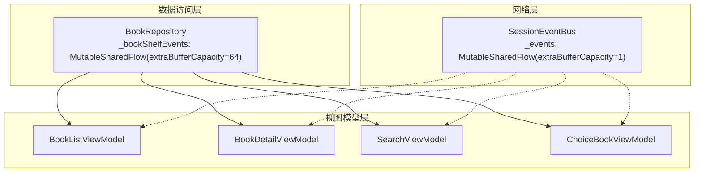
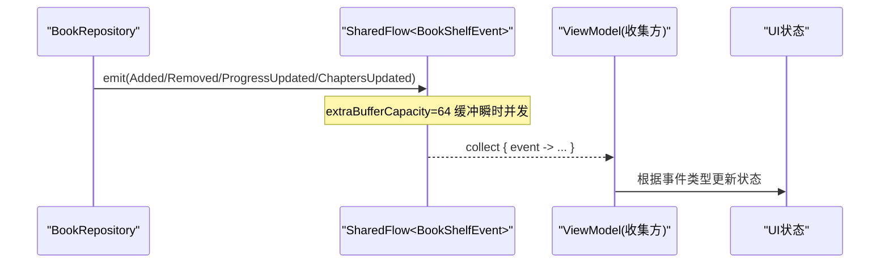
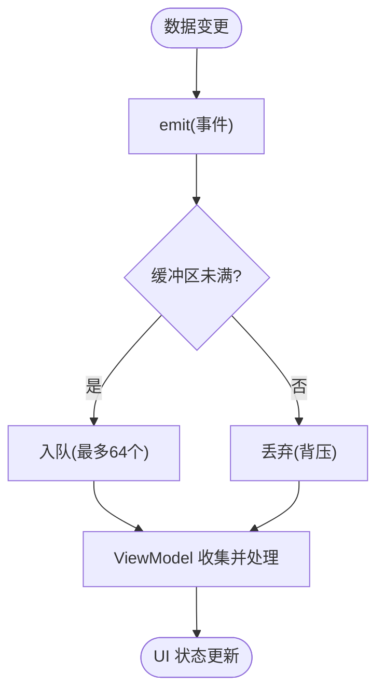
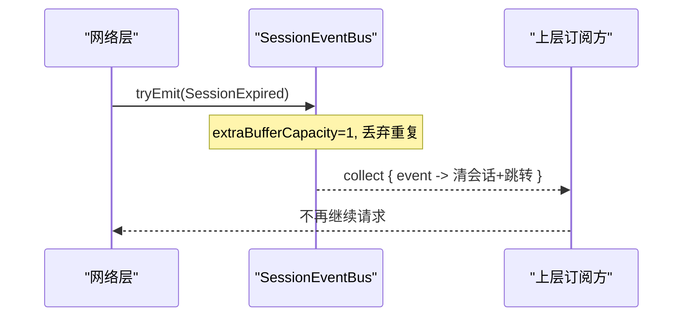
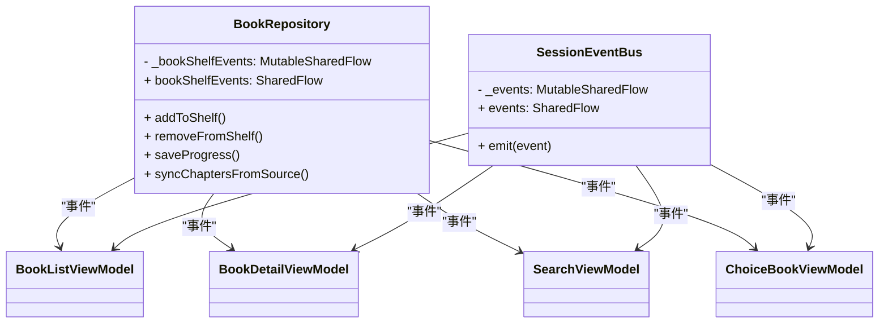

# 背压处理与缓冲策略

<cite>
**本文引用的文件**
- [BookRepository.kt](file://lib_book_common/src/main/java/com/ebook/common/repository/BookRepository.kt)
- [SessionEventBus.kt](file://lib_ebook_api/src/main/java/com/ebook/api/auth/SessionEventBus.kt)
- [0004-rxbus-to-sharedflow.md](file://docs/adr/0004-rxbus-to-sharedflow.md)
- [BookListViewModel.kt](file://module_book/src/main/java/com/ebook/book/mvvm/viewmodel/BookListViewModel.kt)
- [BookDetailViewModel.kt](file://module_book/src/main/java/com/ebook/book/mvvm/viewmodel/BookDetailViewModel.kt)
- [SearchViewModel.kt](file://module_find/src/main/java/com/ebook/find/mvvm/viewmodel/SearchViewModel.kt)
- [ChoiceBookViewModel.kt](file://module_find/src/main/java/com/ebook/find/mvvm/viewmodel/ChoiceBookViewModel.kt)
</cite>

## 目录
1. [引言](#引言)
2. [项目结构](#项目结构)
3. [核心组件](#核心组件)
4. [架构总览](#架构总览)
5. [详细组件分析](#详细组件分析)
6. [依赖关系分析](#依赖关系分析)
7. [性能考量](#性能考量)
8. [故障排查指南](#故障排查指南)
9. [结论](#结论)
10. [附录](#附录)

## 引言
本文聚焦于项目中基于 Kotlin Coroutines SharedFlow 的背压处理与缓冲策略，围绕以下要点展开：
- BookRepository.bookShelfEvents 为何选择 extraBufferCapacity = 64
- SessionEventBus 为何选择 extraBufferCapacity = 1 并使用 tryEmit 无阻塞发射
- 不同频率事件（高频 vs 低频）的缓冲策略差异
- 背压的三种策略（缓冲丢弃、挂起等待、异常抛出）在项目中的取舍
- 缓冲区满时的降级与重试实践
- 背压问题的检测与调优方法

## 项目结构
本项目采用多模块 MVVM 架构，事件总线使用 SharedFlow 替代旧版 RxBus。关键位置如下：
- 书架事件总线位于数据访问层：BookRepository 暴露 bookShelfEvents，供各 ViewModel 订阅
- 会话事件总线位于网络层：SessionEventBus 暴露 events，用于全局会话过期处置
- 消费方在 ViewModel 层通过 viewModelScope 收集事件并驱动 UI

图示来源
- [BookRepository.kt:75-77](file://lib_book_common/src/main/java/com/ebook/common/repository/BookRepository.kt#L75-L77)
- [SessionEventBus.kt:30-43](file://lib_ebook_api/src/main/java/com/ebook/api/auth/SessionEventBus.kt#L30-L43)
- [BookListViewModel.kt:38-46](file://module_book/src/main/java/com/ebook/book/mvvm/viewmodel/BookListViewModel.kt#L38-L46)
- [BookDetailViewModel.kt:77-88](file://module_book/src/main/java/com/ebook/book/mvvm/viewmodel/BookDetailViewModel.kt#L77-L88)
- [SearchViewModel.kt:110-120](file://module_find/src/main/java/com/ebook/find/mvvm/viewmodel/SearchViewModel.kt#L110-L120)
- [ChoiceBookViewModel.kt:63-73](file://module_find/src/main/java/com/ebook/find/mvvm/viewmodel/ChoiceBookViewModel.kt#L63-L73)

章节来源
- [BookRepository.kt:75-77](file://lib_book_common/src/main/java/com/ebook/common/repository/BookRepository.kt#L75-L77)
- [SessionEventBus.kt:30-43](file://lib_ebook_api/src/main/java/com/ebook/api/auth/SessionEventBus.kt#L30-L43)
- [BookListViewModel.kt:38-46](file://module_book/src/main/java/com/ebook/book/mvvm/viewmodel/BookListViewModel.kt#L38-L46)
- [BookDetailViewModel.kt:77-88](file://module_book/src/main/java/com/ebook/book/mvvm/viewmodel/BookDetailViewModel.kt#L77-L88)
- [SearchViewModel.kt:110-120](file://module_find/src/main/java/com/ebook/find/mvvm/viewmodel/SearchViewModel.kt#L110-L120)
- [ChoiceBookViewModel.kt:63-73](file://module_find/src/main/java/com/ebook/find/mvvm/viewmodel/ChoiceBookViewModel.kt#L63-L73)

## 核心组件
- BookRepository.bookShelfEvents
  - 类型：MutableSharedFlow<BookShelfEvent> 暴露为只读 SharedFlow
  - 缓冲容量：extraBufferCapacity = 64
  - 用途：书架增删、阅读进度更新、目录追加等事件广播
- SessionEventBus.events
  - 类型：MutableSharedFlow<SessionEvent> 暴露为只读 SharedFlow
  - 缓冲容量：extraBufferCapacity = 1
  - 发射方式：tryEmit（非阻塞），缓冲满时丢弃重复事件
  - 用途：会话过期等全局事件，幂等处置

章节来源
- [BookRepository.kt:75-77](file://lib_book_common/src/main/java/com/ebook/common/repository/BookRepository.kt#L75-L77)
- [SessionEventBus.kt:30-43](file://lib_ebook_api/src/main/java/com/ebook/api/auth/SessionEventBus.kt#L30-L43)

## 架构总览
SharedFlow 在本项目承担跨层事件分发职责。数据变更触发 emit，ViewModel 在协程作用域内收集并穷尽 when 分支处理，避免遗漏新事件类型。

图示来源
- [BookRepository.kt:136-146](file://lib_book_common/src/main/java/com/ebook/common/repository/BookRepository.kt#L136-L146)
- [BookRepository.kt:418-432](file://lib_book_common/src/main/java/com/ebook/common/repository/BookRepository.kt#L418-L432)
- [BookRepository.kt:595-597](file://lib_book_common/src/main/java/com/ebook/common/repository/BookRepository.kt#L595-L597)
- [BookListViewModel.kt:38-46](file://module_book/src/main/java/com/ebook/book/mvvm/viewmodel/BookListViewModel.kt#L38-L46)
- [BookDetailViewModel.kt:77-88](file://module_book/src/main/java/com/ebook/book/mvvm/viewmodel/BookDetailViewModel.kt#L77-L88)
- [SearchViewModel.kt:110-120](file://module_find/src/main/java/com/ebook/find/mvvm/viewmodel/SearchViewModel.kt#L110-L120)
- [ChoiceBookViewModel.kt:63-73](file://module_find/src/main/java/com/ebook/find/mvvm/viewmodel/ChoiceBookViewModel.kt#L63-L73)

## 详细组件分析

### BookRepository 书架事件流
- 设计要点
  - 使用 MutableSharedFlow 封装内部事件通道，asSharedFlow 暴露只读接口
  - extraBufferCapacity = 64：用于吸收瞬时并发写入（如批量导入、快速翻页、后台同步）导致的事件突发
  - 事件类型：Added、Removed、ProgressUpdated、ChaptersUpdated，语义明确，消费方以 sealed class 穷尽处理
- 背压策略
  - 采用“缓冲”策略：当消费者暂时跟不上时，将事件放入内存缓冲；超过容量时按 SharedFlow 默认行为丢弃多余事件
  - 选择 64 的原因：书架事件属于中高频、可丢失次要事件（例如短时间内多次 Added 合并为一次刷新即可接受），且 UI 侧通常以 Flow 重拉事实源（Room 失效流）作为最终一致依据
- 典型调用点
  - 保存进度后 emit ProgressUpdated
  - 加书/删书 emit Added/Removed
  - 目录追加成功 emit ChaptersUpdated（仅成功时）
  - 换源完成后先 Removed 再 Added，保证中间态不出现重复书

图示来源
- [BookRepository.kt:136-146](file://lib_book_common/src/main/java/com/ebook/common/repository/BookRepository.kt#L136-L146)
- [BookRepository.kt:418-432](file://lib_book_common/src/main/java/com/ebook/common/repository/BookRepository.kt#L418-L432)
- [BookRepository.kt:595-597](file://lib_book_common/src/main/java/com/ebook/common/repository/BookRepository.kt#L595-L597)
- [0004-rxbus-to-sharedflow.md:1-13](file://docs/adr/0004-rxbus-to-sharedflow.md#L1-L13)

章节来源
- [BookRepository.kt:136-146](file://lib_book_common/src/main/java/com/ebook/common/repository/BookRepository.kt#L136-L146)
- [BookRepository.kt:418-432](file://lib_book_common/src/main/java/com/ebook/common/repository/BookRepository.kt#L418-L432)
- [BookRepository.kt:595-597](file://lib_book_common/src/main/java/com/ebook/common/repository/BookRepository.kt#L595-L597)
- [0004-rxbus-to-sharedflow.md:1-13](file://docs/adr/0004-rxbus-to-sharedflow.md#L1-L13)

### SessionEventBus 会话事件流
- 设计要点
  - 单订阅场景下的全局事件：会话过期（SessionExpired）
  - extraBufferCapacity = 1 + tryEmit：确保最新一次过期事件能尽快到达，同时允许丢弃重复事件，绝不阻塞请求线程
- 背压策略
  - 采用“缓冲丢弃”策略：缓冲满时丢弃后续相同或重复事件；由于处置是幂等的（清会话+跳转登录），丢弃不会造成业务影响
  - 使用 tryEmit 而非 emit：避免在网络层回调中阻塞 I/O 线程，提升吞吐与响应性
- 典型调用点
  - 网络层 token 刷新失败时 emit(SessionExpired)，上层统一订阅并执行清会话流程

图示来源
- [SessionEventBus.kt:30-43](file://lib_ebook_api/src/main/java/com/ebook/api/auth/SessionEventBus.kt#L30-L43)

章节来源
- [SessionEventBus.kt:30-43](file://lib_ebook_api/src/main/java/com/ebook/api/auth/SessionEventBus.kt#L30-L43)

### 不同频率事件的缓冲策略
- 高频率事件（如书架频繁更新）
  - 采用较大缓冲（64）：吸收突发写入，减少 UI 抖动；消费方聚合刷新
  - 容忍少量丢弃：UI 最终以 Room 流为事实源进行一致性纠正
- 低频率事件（如会话过期）
  - 采用极小缓冲（1）：保证最近事件可达，避免堆积
  - 丢弃重复：幂等处置，丢弃不影响正确性

章节来源
- [BookRepository.kt:75-77](file://lib_book_common/src/main/java/com/ebook/common/repository/BookRepository.kt#L75-L77)
- [SessionEventBus.kt:30-43](file://lib_ebook_api/src/main/java/com/ebook/api/auth/SessionEventBus.kt#L30-L43)
- [0004-rxbus-to-sharedflow.md:1-13](file://docs/adr/0004-rxbus-to-sharedflow.md#L1-L13)

### tryEmit 的使用场景与优势
- 适用场景
  - 需要在可能繁忙的线程（如网络回调、I/O 线程）上快速发出事件，不能阻塞主流程
  - 事件幂等且可丢弃重复（如会话过期）
- 优势
  - 非阻塞：缓冲满直接返回 false，避免背压引发的级联阻塞
  - 简单可靠：无需复杂重试或队列管理，适合“最近一条有效”的场景

章节来源
- [SessionEventBus.kt:30-43](file://lib_ebook_api/src/main/java/com/ebook/api/auth/SessionEventBus.kt#L30-L43)

### 背压的三种策略及项目选择
- 缓冲丢弃
  - 描述：缓冲区满时丢弃新事件
  - 项目选择：SessionEventBus 使用此策略（capacity=1，tryEmit）
  - 理由：事件幂等、最近一条最重要，丢弃不会破坏业务
- 挂起等待
  - 描述：emit 挂起直到有空间，适合严格顺序、不可丢的场景
  - 项目现状：未在当前事件流中使用
  - 风险：在高并发或慢消费下易引起线程阻塞与超时
- 异常抛出
  - 描述：缓冲区满时抛异常（某些实现提供 backpressure 模式）
  - 项目现状：未在当前事件流中使用
  - 风险：异常会中断调用链，需额外错误处理

章节来源
- [SessionEventBus.kt:30-43](file://lib_ebook_api/src/main/java/com/ebook/api/auth/SessionEventBus.kt#L30-L43)
- [BookRepository.kt:75-77](file://lib_book_common/src/main/java/com/ebook/common/repository/BookRepository.kt#L75-L77)

### 缓冲区满时的降级与重试机制
- 降级
  - SessionEventBus：缓冲满则丢弃重复事件，保证非阻塞
  - BookRepository：缓冲满时由 SharedFlow 默认丢弃，消费方以 Room 流为准做最终一致
- 重试
  - 对关键路径（如目录追加）仅在成功时发事件，失败不发，避免误导消费方
  - 对网络相关操作（如目录重抓）在失败时不写时间戳，下次可重试
- 建议实践
  - 对于不可丢事件，考虑改用 channel 或带确认机制的队列
  - 对于可丢事件，保持 tryEmit + 小缓冲，简化实现

章节来源
- [BookRepository.kt:595-597](file://lib_book_common/src/main/java/com/ebook/common/repository/BookRepository.kt#L595-L597)
- [SessionEventBus.kt:30-43](file://lib_ebook_api/src/main/java/com/ebook/api/auth/SessionEventBus.kt#L30-L43)

## 依赖关系分析
- 发布方
  - BookRepository：数据变更 → emit(bookShelfEvents)
  - SessionEventBus：网络层事件 → tryEmit(events)
- 订阅方
  - 多个 ViewModel：viewModelScope.launch { collect(...) }
  - 消费策略：sealed class 穷尽 when 分支，编译期保证覆盖

图示来源
- [BookRepository.kt:75-77](file://lib_book_common/src/main/java/com/ebook/common/repository/BookRepository.kt#L75-L77)
- [SessionEventBus.kt:30-43](file://lib_ebook_api/src/main/java/com/ebook/api/auth/SessionEventBus.kt#L30-L43)
- [BookListViewModel.kt:38-46](file://module_book/src/main/java/com/ebook/book/mvvm/viewmodel/BookListViewModel.kt#L38-L46)
- [BookDetailViewModel.kt:77-88](file://module_book/src/main/java/com/ebook/book/mvvm/viewmodel/BookDetailViewModel.kt#L77-L88)
- [SearchViewModel.kt:110-120](file://module_find/src/main/java/com/ebook/find/mvvm/viewmodel/SearchViewModel.kt#L110-L120)
- [ChoiceBookViewModel.kt:63-73](file://module_find/src/main/java/com/ebook/find/mvvm/viewmodel/ChoiceBookViewModel.kt#L63-L73)

章节来源
- [BookRepository.kt:75-77](file://lib_book_common/src/main/java/com/ebook/common/repository/BookRepository.kt#L75-L77)
- [SessionEventBus.kt:30-43](file://lib_ebook_api/src/main/java/com/ebook/api/auth/SessionEventBus.kt#L30-L43)
- [BookListViewModel.kt:38-46](file://module_book/src/main/java/com/ebook/book/mvvm/viewmodel/BookListViewModel.kt#L38-L46)
- [BookDetailViewModel.kt:77-88](file://module_book/src/main/java/com/ebook/book/mvvm/viewmodel/BookDetailViewModel.kt#L77-L88)
- [SearchViewModel.kt:110-120](file://module_find/src/main/java/com/ebook/find/mvvm/viewmodel/SearchViewModel.kt#L110-L120)
- [ChoiceBookViewModel.kt:63-73](file://module_find/src/main/java/com/ebook/find/mvvm/viewmodel/ChoiceBookViewModel.kt#L63-L73)

## 性能考量
- 缓冲大小选择
  - 书架事件（extraBufferCapacity=64）：平衡瞬时并发与内存占用，避免频繁丢弃导致的 UI 闪烁
  - 会话事件（extraBufferCapacity=1）：保证最新事件可达，丢弃重复，降低开销
- 背压策略权衡
  - 丢弃：适用于幂等、最近有效事件（会话过期）
  - 挂起：适用于强一致、不可丢场景（当前未使用）
  - 异常：谨慎使用，避免中断主流程
- 消费端优化
  - 在 ViewModel 层集中收集，避免 Activity/Fragment 重建重复累积
  - 使用 sealed class 穷尽分支，新增事件类型编译期报错，防止漏处理
- 监控指标
  - 观察 UI 卡顿、事件延迟、内存增长
  - 记录丢弃次数（可通过自定义计数器辅助）
  - 关注 Room 流与事件流的时序一致性

[本节为通用指导，不直接分析具体文件]

## 故障排查指南
- 症状：UI 未及时更新
  - 检查是否正确使用 viewModelScope 收集事件
  - 确认事件类型是否被穷尽处理
  - 验证 Room 流是否正确失效与重拉
- 症状：事件丢失
  - 若为会话事件，属于预期行为（丢弃重复）
  - 若为书架事件，检查缓冲区是否过小或消费过慢；必要时增大缓冲或优化消费逻辑
- 症状：线程阻塞
  - 检查是否误用 emit 而非 tryEmit（会话事件）
  - 检查是否在 I/O 线程执行了耗时操作
- 诊断步骤
  - 打印事件发送与消费时序
  - 统计缓冲区使用率与丢弃次数
  - 对比事件流与 Room 流的一致性

章节来源
- [BookListViewModel.kt:38-46](file://module_book/src/main/java/com/ebook/book/mvvm/viewmodel/BookListViewModel.kt#L38-L46)
- [BookDetailViewModel.kt:77-88](file://module_book/src/main/java/com/ebook/book/mvvm/viewmodel/BookDetailViewModel.kt#L77-L88)
- [SearchViewModel.kt:110-120](file://module_find/src/main/java/com/ebook/find/mvvm/viewmodel/SearchViewModel.kt#L110-L120)
- [ChoiceBookViewModel.kt:63-73](file://module_find/src/main/java/com/ebook/find/mvvm/viewmodel/ChoiceBookViewModel.kt#L63-L73)

## 结论
- 项目采用 SharedFlow 作为事件总线，兼顾类型安全与结构化并发
- 针对不同频率与重要性事件，差异化设置缓冲容量与背压策略：
  - 书架事件：较大缓冲（64），容忍丢弃，以 Room 流为最终一致
  - 会话事件：极小缓冲（1），丢弃重复，确保最近事件可达
- 使用 tryEmit 避免阻塞，提升网络层吞吐与响应性
- 建议在不可丢事件场景中谨慎评估缓冲策略，必要时引入确认机制或队列

[本节为总结，不直接分析具体文件]

## 附录
- 事件定义与消费示例（参考路径）
  - 书架事件：BookShelfEvent（Added/Removed/ProgressUpdated/ChaptersUpdated）
  - 会话事件：SessionEvent（SessionExpired）
  - 消费方：BookListViewModel、BookDetailViewModel、SearchViewModel、ChoiceBookViewModel

章节来源
- [BookRepository.kt:873-892](file://lib_book_common/src/main/java/com/ebook/common/repository/BookRepository.kt#L873-L892)
- [SessionEventBus.kt:12-20](file://lib_ebook_api/src/main/java/com/ebook/api/auth/SessionEventBus.kt#L12-L20)
- [BookListViewModel.kt:38-46](file://module_book/src/main/java/com/ebook/book/mvvm/viewmodel/BookListViewModel.kt#L38-L46)
- [BookDetailViewModel.kt:77-88](file://module_book/src/main/java/com/ebook/book/mvvm/viewmodel/BookDetailViewModel.kt#L77-L88)
- [SearchViewModel.kt:110-120](file://module_find/src/main/java/com/ebook/find/mvvm/viewmodel/SearchViewModel.kt#L110-L120)
- [ChoiceBookViewModel.kt:63-73](file://module_find/src/main/java/com/ebook/find/mvvm/viewmodel/ChoiceBookViewModel.kt#L63-L73)