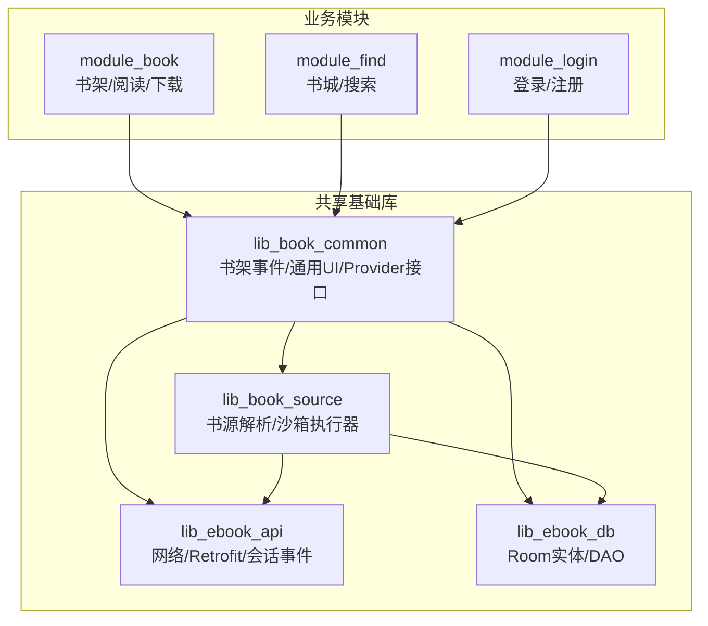
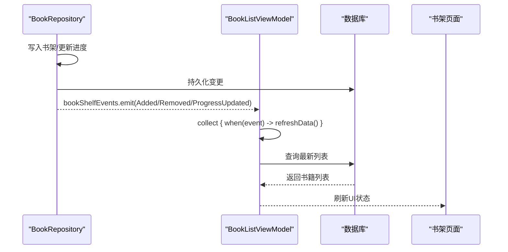
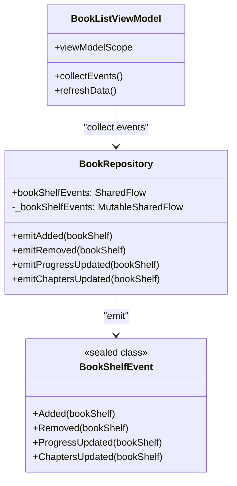
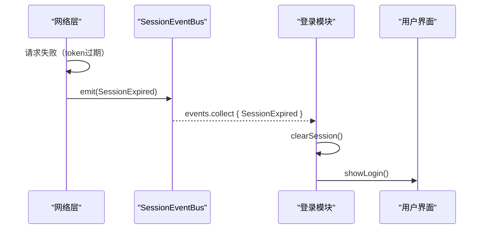
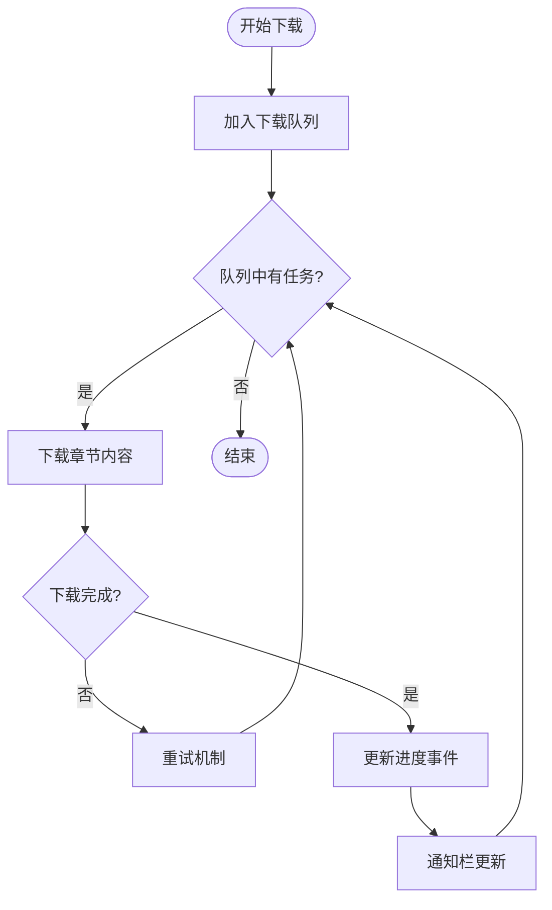
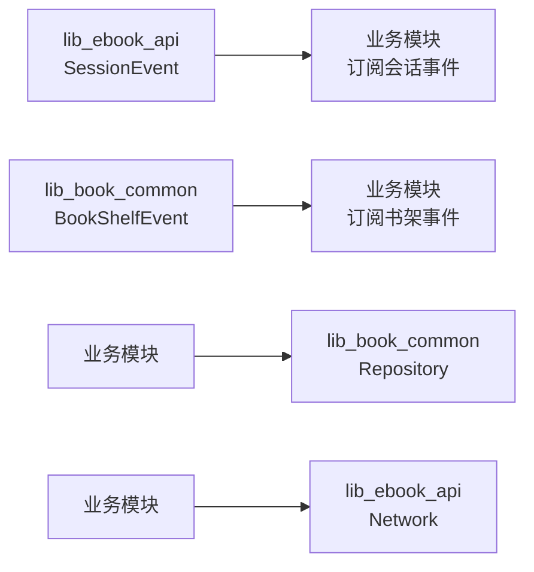

# 跨模块通信最佳实践

<cite>
**本文引用的文件**
- [SessionEventBus.kt](file://lib_ebook_api/src/main/java/com/ebook/api/auth/SessionEventBus.kt)
- [BookRepository.kt](file://lib_book_common/src/main/java/com/ebook/common/repository/BookRepository.kt)
- [BookListViewModel.kt](file://module_book/src/main/java/com/ebook/book/mvvm/viewmodel/BookListViewModel.kt)
- [SearchViewModel.kt](file://module_find/src/main/java/com/ebook/find/mvvm/viewmodel/SearchViewModel.kt)
- [DownloadService.kt](file://module_book/src/main/java/com/ebook/book/service/DownloadService.kt)
- [DownloadManageViewModel.kt](file://module_book/src/main/java/com/ebook/book/mvvm/viewmodel/DownloadManageViewModel.kt)
- [Constant.kt](file://lib_book_common/src/main/java/com/ebook/common/event/Constant.kt)
- [KeyCode.kt](file://lib_book_common/src/main/java/com/ebook/common/event/KeyCode.kt)
- [RouteArgs.kt](file://lib_book_common/src/main/java/com/ebook/common/event/RouteArgs.kt)
- [0004-rxbus-to-sharedflow.md](file://docs/adr/0004-rxbus-to-sharedflow.md)
- [0015-common-lib-boundary.md](file://docs/adr/0015-common-lib-boundary.md)
- [0018-download-foreground-service-data-sync-quota.md](file://docs/adr/0018-download-foreground-service-data-sync-quota.md)
</cite>

## 目录
1. [简介](#简介)
2. [项目结构](#项目结构)
3. [核心组件](#核心组件)
4. [架构总览](#架构总览)
5. [详细组件分析](#详细组件分析)
6. [依赖与解耦策略](#依赖与解耦策略)
7. [安全性考虑](#安全性考虑)
8. [性能考量](#性能考量)
9. [故障排除指南](#故障排除指南)
10. [结论](#结论)
11. [附录：事件与路由约定](#附录：事件与路由约定)

## 简介
本文件系统化梳理本项目基于 SharedFlow 的跨模块通信最佳实践，重点说明：
- lib_book_common 中的书架事件（BookShelfEvent）如何在多模块间传递。
- lib_ebook_api 中的会话事件（SessionEvent）如何被上层模块消费。
- 依赖方向约束：事件定义放在被依赖的基础库中，消费者在上层业务模块实现。
- 通过接口抽象、事件命名约定和版本兼容性管理实现的松耦合通信。
- 跨模块事件的安全性：数据校验、权限控制与敏感信息保护。
- 正确的发布/订阅模式示例：发布者职责分离、消费者生命周期管理。
- 常见问题排查：循环依赖、内存泄漏、性能瓶颈等。

## 项目结构
本项目采用多模块分层架构，核心依赖方向为：
- 业务模块 → lib_book_common → lib_book_source → lib_ebook_api / lib_ebook_db
- 事件定义下沉到共享基础库（如 BookShelfEvent 在 lib_book_common），会话事件定义在 lib_ebook_api
- 事件消费位于上层业务模块（如 module_book、module_find），以 ViewModel 或 Service 形式订阅

**图表来源**
- [BookRepository.kt:52-77](file://lib_book_common/src/main/java/com/ebook/common/repository/BookRepository.kt#L52-L77)
- [SessionEventBus.kt:30-44](file://lib_ebook_api/src/main/java/com/ebook/api/auth/SessionEventBus.kt#L30-L44)

**章节来源**
- [BookRepository.kt:52-77](file://lib_book_common/src/main/java/com/ebook/common/repository/BookRepository.kt#L52-L77)
- [SessionEventBus.kt:30-44](file://lib_ebook_api/src/main/java/com/ebook/api/auth/SessionEventBus.kt#L30-L44)

## 核心组件
- 书架事件总线（BookRepository.bookShelfEvents）：定义并暴露书架相关事件流，包含添加、移除、进度更新、目录追加等事件。
- 会话事件总线（SessionEventBus.events）：定义并暴露会话级全局事件，如 SessionExpired，用于统一处理认证失效。
- 事件消费者：ViewModel（如 BookListViewModel、SearchViewModel）、Service（如 DownloadService）订阅事件并驱动 UI 或后台任务。

**章节来源**
- [BookRepository.kt:76-77](file://lib_book_common/src/main/java/com/ebook/common/repository/BookRepository.kt#L76-L77)
- [SessionEventBus.kt:33-43](file://lib_ebook_api/src/main/java/com/ebook/api/auth/SessionEventBus.kt#L33-L43)
- [BookListViewModel.kt:40-51](file://module_book/src/main/java/com/ebook/book/mvvm/viewmodel/BookListViewModel.kt#L40-L51)
- [SearchViewModel.kt:1-100](file://module_find/src/main/java/com/ebook/find/mvvm/viewmodel/SearchViewModel.kt#L1-L100)

## 架构总览
SharedFlow 在本项目中承担跨模块事件总线角色，遵循“事件定义下沉、消费上移”的原则：
- 事件类型定义在 lib_book_common（BookShelfEvent）和 lib_ebook_api（SessionEvent）
- 事件发射由 Repository（BookRepository）和网络层（SessionEventBus）负责
- 事件消费集中在 ViewModel 和 Service，使用 viewModelScope.launch 启动收集，确保生命周期安全

**图表来源**
- [BookRepository.kt:76-77](file://lib_book_common/src/main/java/com/ebook/common/repository/BookRepository.kt#L76-L77)
- [BookListViewModel.kt:40-51](file://module_book/src/main/java/com/ebook/book/mvvm/viewmodel/BookListViewModel.kt#L40-L51)

## 详细组件分析

### 书架事件系统（BookShelfEvent）
- 事件类型：Added、Removed、ProgressUpdated、ChaptersUpdated
- 事件流：MutableSharedFlow 暴露为只读 SharedFlow，缓冲容量 64，避免阻塞写操作
- 发布者：BookRepository 在 CRUD 和章节同步后 emit 事件
- 消费者：BookListViewModel 收集事件并触发刷新，SearchViewModel 可监听进度变化更新搜索结果

**图表来源**
- [BookRepository.kt:76-77](file://lib_book_common/src/main/java/com/ebook/common/repository/BookRepository.kt#L76-L77)
- [BookRepository.kt:873-892](file://lib_book_common/src/main/java/com/ebook/common/repository/BookRepository.kt#L873-L892)
- [BookListViewModel.kt:40-51](file://module_book/src/main/java/com/ebook/book/mvvm/viewmodel/BookListViewModel.kt#L40-L51)

**章节来源**
- [BookRepository.kt:76-77](file://lib_book_common/src/main/java/com/ebook/common/repository/BookRepository.kt#L76-L77)
- [BookRepository.kt:873-892](file://lib_book_common/src/main/java/com/ebook/common/repository/BookRepository.kt#L873-L892)
- [BookListViewModel.kt:40-51](file://module_book/src/main/java/com/ebook/book/mvvm/viewmodel/BookListViewModel.kt#L40-L51)

### 会话事件系统（SessionEventBus）
- 事件类型：SessionExpired（会话不可恢复，需清会话并跳转登录）
- 事件流：MutableSharedFlow 暴露为只读 SharedFlow，缓冲容量 1，丢弃重复过期事件
- 发布者：网络层拦截器在 token 刷新失败时 emit
- 消费者：登录模块或全局错误处理器订阅并统一处置

**图表来源**
- [SessionEventBus.kt:33-43](file://lib_ebook_api/src/main/java/com/ebook/api/auth/SessionEventBus.kt#L33-L43)

**章节来源**
- [SessionEventBus.kt:33-43](file://lib_ebook_api/src/main/java/com/ebook/api/auth/SessionEventBus.kt#L33-L43)

### 下载服务事件流（DownloadService）
- 下载队列通过 SharedFlow 管理任务状态，支持暂停/继续/取消
- 事件驱动下载进度更新和通知栏刷新
- 与 DownloadManageViewModel 协作，提供下载管理界面

**图表来源**
- [DownloadService.kt:1-100](file://module_book/src/main/java/com/ebook/book/service/DownloadService.kt#L1-L100)
- [DownloadManageViewModel.kt:1-100](file://module_book/src/main/java/com/ebook/book/mvvm/viewmodel/DownloadManageViewModel.kt#L1-L100)

**章节来源**
- [DownloadService.kt:1-100](file://module_book/src/main/java/com/ebook/book/service/DownloadService.kt#L1-L100)
- [DownloadManageViewModel.kt:1-100](file://module_book/src/main/java/com/ebook/book/mvvm/viewmodel/DownloadManageViewModel.kt#L1-L100)

## 依赖与解耦策略
- 事件定义下沉：BookShelfEvent 在 lib_book_common，SessionEvent 在 lib_ebook_api，确保下游模块无需了解上游实现细节
- 消费者上移：ViewModel 和 Service 负责订阅事件，业务逻辑与基础设施解耦
- 接口抽象：通过 Provider 接口暴露跨模块能力，避免直接依赖具体实现
- 版本兼容：事件类型使用 sealed class，新增分支编译期强制所有消费者更新，避免遗漏处理

**图表来源**
- [0015-common-lib-boundary.md:1-50](file://docs/adr/0015-common-lib-boundary.md#L1-L50)

**章节来源**
- [0015-common-lib-boundary.md:1-50](file://docs/adr/0015-common-lib-boundary.md#L1-L50)

## 安全性考虑
- 数据验证：事件载荷应经过基本校验，避免恶意或异常数据传播
- 权限控制：敏感事件（如 SessionExpired）仅在授权模块内处理，防止未授权访问
- 敏感信息保护：事件对象不包含密码、token 等敏感字段，仅传递必要标识符
- 线程安全：SharedFlow 配置适当的缓冲容量，避免内存溢出和并发问题

**章节来源**
- [SessionEventBus.kt:33-43](file://lib_ebook_api/src/main/java/com/ebook/api/auth/SessionEventBus.kt#L33-L43)
- [BookRepository.kt:76-77](file://lib_book_common/src/main/java/com/ebook/common/repository/BookRepository.kt#L76-L77)

## 性能考量
- 缓冲容量：BookShelfEvent 使用 64 缓冲，适合高频事件；SessionEvent 使用 1 缓冲，避免堆积
- 非阻塞发射：tryEmit 避免阻塞调用线程，提高响应性
- 生命周期管理：ViewModel 中收集事件，自动随生命周期销毁，防止内存泄漏
- 批量处理：合并多个小事件为一次刷新，减少 UI 重绘开销

**章节来源**
- [BookRepository.kt:76-77](file://lib_book_common/src/main/java/com/ebook/common/repository/BookRepository.kt#L76-L77)
- [SessionEventBus.kt:33-43](file://lib_ebook_api/src/main/java/com/ebook/api/auth/SessionEventBus.kt#L33-L43)
- [BookListViewModel.kt:40-51](file://module_book/src/main/java/com/ebook/book/mvvm/viewmodel/BookListViewModel.kt#L40-L51)

## 故障排除指南
- 循环依赖：检查模块依赖图，确保事件定义不形成环；使用 ADR-0015 边界指导
- 内存泄漏：确认 ViewModel 正确收集事件，避免全局静态引用
- 性能瓶颈：调整 SharedFlow 缓冲容量，避免过多事件堆积
- 事件丢失：增加缓冲容量或使用 StateFlow 保存最后状态
- 线程问题：确保事件发射和收集在同一调度器或正确使用 withContext

**章节来源**
- [0018-download-foreground-service-data-sync-quota.md:1-50](file://docs/adr/0018-download-foreground-service-data-sync-quota.md#L1-L50)
- [BookListViewModel.kt:40-51](file://module_book/src/main/java/com/ebook/book/mvvm/viewmodel/BookListViewModel.kt#L40-L51)

## 结论
基于 SharedFlow 的跨模块通信架构提供了类型安全、生命周期安全的消息传递机制。通过事件定义下沉、消费者上移的策略，实现了高内聚低耦合的模块设计。结合适当的性能优化和安全措施，该方案能够有效支撑复杂应用的多模块协作需求。

## 附录：事件与路由约定
- 事件命名：使用动词+名词形式（如 Added、Removed），清晰表达事件语义
- 路由常量：KeyCode 集中管理跨模块路由路径，避免硬编码
- 路由参数：RouteArgs 定义标准参数格式，保证跨模块数据传递一致性

**章节来源**
- [KeyCode.kt:6-104](file://lib_book_common/src/main/java/com/ebook/common/event/KeyCode.kt#L6-L104)
- [RouteArgs.kt:1-50](file://lib_book_common/src/main/java/com/ebook/common/event/RouteArgs.kt#L1-L50)
- [Constant.kt:3-24](file://lib_book_common/src/main/java/com/ebook/common/event/Constant.kt#L3-L24)