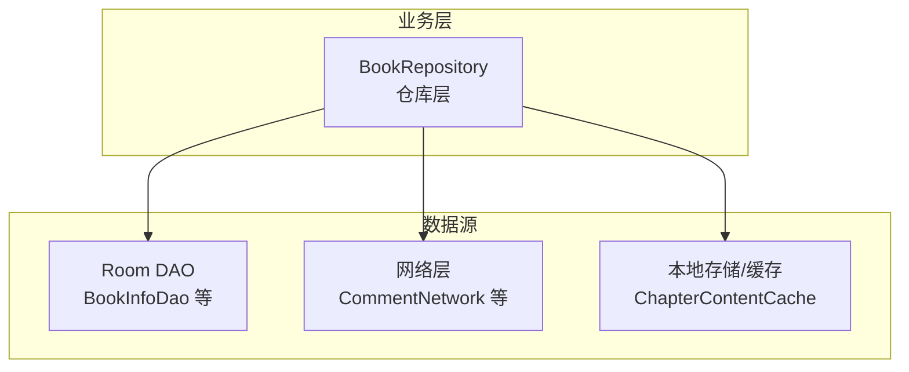
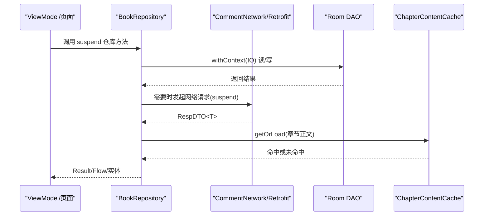
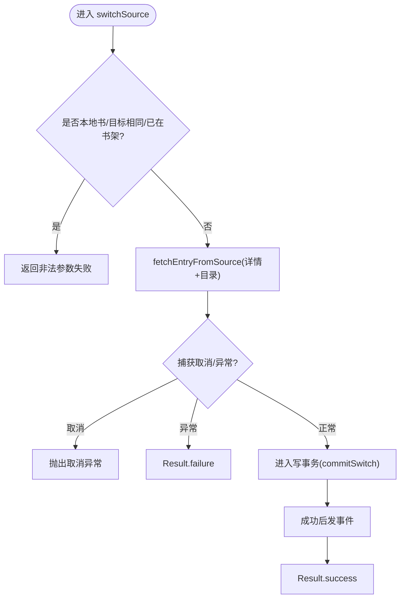
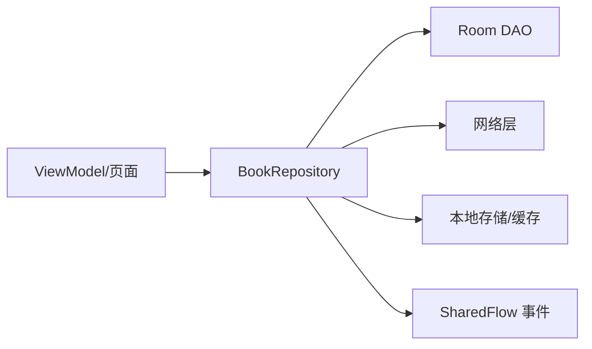

# suspend 函数设计原则与最佳实践

<cite>
**本文引用的文件列表**
- [lib_book_common/src/main/java/com/ebook/common/repository/BookRepository.kt](file://lib_book_common/src/main/java/com/ebook/common/repository/BookRepository.kt)
- [lib_ebook_api/src/main/java/com/ebook/api/service/comment/CommentNetwork.kt](file://lib_ebook_api/src/main/java/com/ebook/api/service/comment/CommentNetwork.kt)
- [lib_ebook_db/src/main/java/com/ebook/db/dao/BookInfoDao.kt](file://lib_ebook_db/src/main/java/com/ebook/db/dao/BookInfoDao.kt)
- [lib_book_common/src/main/java/com/ebook/common/store/ChapterContentCache.kt](file://lib_book_common/src/main/java/com/ebook/common/store/ChapterContentCache.kt)
- [lib_book_common/src/test/java/com/ebook/common/repository/BookRepositoryTest.kt](file://lib_book_common/src/test/java/com/ebook/common/repository/BookRepositoryTest.kt)
- [lib_book_source/src/main/java/com/ebook/source/script/ScriptHttp.kt](file://lib_book_source/src/main/java/com/ebook/source/script/ScriptHttp.kt)
</cite>

## 目录
1. [引言](#引言)
2. [项目结构](#项目结构)
3. [核心组件](#核心组件)
4. [架构总览](#架构总览)
5. [详细组件分析](#详细组件分析)
6. [依赖关系分析](#依赖关系分析)
7. [性能考量](#性能考量)
8. [故障排查指南](#故障排查指南)
9. [结论](#结论)
10. [附录](#附录)

## 引言
本文围绕本仓库中的协程 suspend 函数，总结一套可落地的设计原则与最佳实践。内容涵盖：何时将方法设计为 suspend、命名与参数约定、错误处理策略（Result 类型、异常传播与取消）、与回调接口的转换模式、并发控制、以及可测试性与单元测试策略。文中所有示例均以仓库中真实实现为依据，并给出对应源码路径以便深入阅读。

## 项目结构
本项目采用多模块 MVVM 架构，异步统一使用 Kotlin Coroutines + Flow，网络层基于 Retrofit，持久化基于 Room，业务逻辑集中在 lib_book_common 的 Repository 层，DAO 提供 suspend 数据库访问，网络层通过 suspend 接口暴露远程能力。

图表来源
- [lib_book_common/src/main/java/com/ebook/common/repository/BookRepository.kt:81-146](file://lib_book_common/src/main/java/com/ebook/common/repository/BookRepository.kt#L81-L146)
- [lib_ebook_db/src/main/java/com/ebook/db/dao/BookInfoDao.kt:15-49](file://lib_ebook_db/src/main/java/com/ebook/db/dao/BookInfoDao.kt#L15-L49)
- [lib_ebook_api/src/main/java/com/ebook/api/service/comment/CommentNetwork.kt:18-47](file://lib_ebook_api/src/main/java/com/ebook/api/service/comment/CommentNetwork.kt#L18-L47)
- [lib_book_common/src/main/java/com/ebook/common/store/ChapterContentCache.kt:25-63](file://lib_book_common/src/main/java/com/ebook/common/store/ChapterContentCache.kt#L25-L63)

章节来源
- [lib_book_common/src/main/java/com/ebook/common/repository/BookRepository.kt:81-146](file://lib_book_common/src/main/java/com/ebook/common/repository/BookRepository.kt#L81-L146)
- [lib_ebook_api/src/main/java/com/ebook/api/service/comment/CommentNetwork.kt:18-47](file://lib_ebook_api/src/main/java/com/ebook/api/service/comment/CommentNetwork.kt#L18-L47)
- [lib_ebook_db/src/main/java/com/ebook/db/dao/BookInfoDao.kt:15-49](file://lib_ebook_db/src/main/java/com/ebook/db/dao/BookInfoDao.kt#L15-L49)
- [lib_book_common/src/main/java/com/ebook/common/store/ChapterContentCache.kt:25-63](file://lib_book_common/src/main/java/com/ebook/common/store/ChapterContentCache.kt#L25-L63)

## 核心组件
- BookRepository：仓库层 suspend API 的中心，封装书架 CRUD、换源、目录同步、章节读取与缓存、事件发布等。大量使用 withContext(Dispatchers.IO) 隔离 IO 工作，并通过 Result 表达复杂分支结果。
- CommentNetwork：网络层 suspend 适配器，直接透传 Retrofit 的 suspend 接口返回，统一以 RespDTO 包装。
- Room DAO：如 BookInfoDao，所有读写均为 suspend 函数，避免阻塞调用线程。
- ChapterContentCache：章节正文内存缓存，使用 Mutex 保护并发访问，提供 getOrLoad 模式以避免重复加载。

章节来源
- [lib_book_common/src/main/java/com/ebook/common/repository/BookRepository.kt:81-146](file://lib_book_common/src/main/java/com/ebook/common/repository/BookRepository.kt#L81-L146)
- [lib_ebook_api/src/main/java/com/ebook/api/service/comment/CommentNetwork.kt:18-47](file://lib_ebook_api/src/main/java/com/ebook/api/service/comment/CommentNetwork.kt#L18-L47)
- [lib_ebook_db/src/main/java/com/ebook/db/dao/BookInfoDao.kt:15-49](file://lib_ebook_db/src/main/java/com/ebook/db/dao/BookInfoDao.kt#L15-L49)
- [lib_book_common/src/main/java/com/ebook/common/store/ChapterContentCache.kt:25-63](file://lib_book_common/src/main/java/com/ebook/common/store/ChapterContentCache.kt#L25-L63)

## 架构总览
下图展示了从 UI/ViewModel 到仓库、网络与数据库的 suspend 调用链，强调“仓库层聚合复杂流程、网络层仅透传、数据库层全部 suspend”。

图表来源
- [lib_book_common/src/main/java/com/ebook/common/repository/BookRepository.kt:455-475](file://lib_book_common/src/main/java/com/ebook/common/repository/BookRepository.kt#L455-L475)
- [lib_ebook_api/src/main/java/com/ebook/api/service/comment/CommentNetwork.kt:18-47](file://lib_ebook_api/src/main/java/com/ebook/api/service/comment/CommentNetwork.kt#L18-L47)
- [lib_ebook_db/src/main/java/com/ebook/db/dao/BookInfoDao.kt:15-49](file://lib_ebook_db/src/main/java/com/ebook/db/dao/BookInfoDao.kt#L15-L49)
- [lib_book_common/src/main/java/com/ebook/common/store/ChapterContentCache.kt:41-46](file://lib_book_common/src/main/java/com/ebook/common/store/ChapterContentCache.kt#L41-L46)

## 详细组件分析

### 仓库层：BookRepository 的 suspend 设计
- 何时使用 suspend
  - 任何可能阻塞或耗时的工作：网络请求、数据库操作、文件 I/O、解析计算等。例如 getAllBooks、saveProgress、switchSource、loadChapter、syncChaptersFromSource 等均声明为 suspend。
- 命名约定
  - 动词+名词：getAllBooks、addToShelf、removeFromShelf、loadChapter、syncChaptersFromSource、reconcileContentStore。语义清晰、无歧义。
- 参数设计
  - 最小必要参数；对复杂对象使用具名参数（如 loadChapter 的 bookShelf, index, title, chapterContentRef）。
  - 对可选行为使用默认参数（如 syncChaptersFromSource 的 force）。
- 错误处理策略
  - 使用 sealed 类型表达多分支结果：ImportMergeResult、ChapterSyncResult 等，让调用方能穷举所有结局。
  - 关键失败点返回 Result<T>：如 switchSource 返回 Result<BookShelfEntity>，区分成功/失败并在内部捕获异常。
  - 取消不视为失败：多处显式 catch CancellationException 并原样上抛，避免误报用户侧的错误提示。
- 线程模型
  - 大部分 IO 操作包裹 in withContext(Dispatchers.IO)，保证不阻塞主线程。
  - Room 事务内避免再切换上下文，保持原子性。
- 并发控制
  - 结合 SharedFlow 发布事件，配合 extraBufferCapacity 缓冲。
  - 通过 WriteTransactionRunner 约束写事务范围。

图表来源
- [lib_book_common/src/main/java/com/ebook/common/repository/BookRepository.kt:292-339](file://lib_book_common/src/main/java/com/ebook/common/repository/BookRepository.kt#L292-L339)
- [lib_book_common/src/main/java/com/ebook/common/repository/BookRepository.kt:351-384](file://lib_book_common/src/main/java/com/ebook/common/repository/BookRepository.kt#L351-L384)
- [lib_book_common/src/main/java/com/ebook/common/repository/BookRepository.kt:411-416](file://lib_book_common/src/main/java/com/ebook/common/repository/BookRepository.kt#L411-L416)

章节来源
- [lib_book_common/src/main/java/com/ebook/common/repository/BookRepository.kt:81-146](file://lib_book_common/src/main/java/com/ebook/common/repository/BookRepository.kt#L81-L146)
- [lib_book_common/src/main/java/com/ebook/common/repository/BookRepository.kt:292-339](file://lib_book_common/src/main/java/com/ebook/common/repository/BookRepository.kt#L292-L339)
- [lib_book_common/src/main/java/com/ebook/common/repository/BookRepository.kt:455-475](file://lib_book_common/src/main/java/com/ebook/common/repository/BookRepository.kt#L455-L475)
- [lib_book_common/src/main/java/com/ebook/common/repository/BookRepository.kt:512-600](file://lib_book_common/src/main/java/com/ebook/common/repository/BookRepository.kt#L512-L600)

### 网络层：CommentNetwork 的 suspend 适配
- 直接将 Retrofit 的 suspend 接口透传给上层，返回值使用 RespDTO 统一信封。
- 优点：API 层简洁，便于在仓库层集中处理错误与重试策略。
- 建议：若需增加重试/超时/降级，建议在仓库层组合而非在 DAO 层耦合。

章节来源
- [lib_ebook_api/src/main/java/com/ebook/api/service/comment/CommentNetwork.kt:18-47](file://lib_ebook_api/src/main/java/com/ebook/api/service/comment/CommentNetwork.kt#L18-L47)

### 数据库层：Room DAO 的 suspend 规范
- 所有 DAO 方法均声明为 suspend，确保调用方自由决定调度器与生命周期管理。
- 单列更新优先：如 setFinalRefreshData 定向 UPDATE，避免整行 REPLACE 带来的字段覆盖风险。
- 外键级联缺失场景由调用方负责清理（见 removeFromShelf 与 deleteEntryRows 的注释说明）。

章节来源
- [lib_ebook_db/src/main/java/com/ebook/db/dao/BookInfoDao.kt:15-49](file://lib_ebook_db/src/main/java/com/ebook/db/dao/BookInfoDao.kt#L15-L49)
- [lib_book_common/src/main/java/com/ebook/common/repository/BookRepository.kt:193-221](file://lib_book_common/src/main/java/com/ebook/common/repository/BookRepository.kt#L193-L221)

### 缓存层：ChapterContentCache 的并发安全
- 使用 Mutex 保护 LRU 表，getOrLoad 支持“未命中则执行 loader”的模式，loader 在锁外执行减少阻塞。
- 按 content_ref 作为键，失效按 bookId 前缀剔除，适合按书批量清理。
- 容量有限（默认 3），适合阅读器当前章及前后预读。

章节来源
- [lib_book_common/src/main/java/com/ebook/common/store/ChapterContentCache.kt:25-63](file://lib_book_common/src/main/java/com/ebook/common/store/ChapterContentCache.kt#L25-L63)

### 脚本网络：ScriptHttp 的 suspend 风格
- 脚本侧网络请求同样以 suspend 形式提供，便于在脚本执行器中挂起等待响应，避免回调地狱。
- 有利于统一错误处理与取消传播，保持与上层仓库一致的协程语义。

章节来源
- [lib_book_source/src/main/java/com/ebook/source/script/ScriptHttp.kt](file://lib_book_source/src/main/java/com/ebook/source/script/ScriptHttp.kt)

## 依赖关系分析
- 低耦合：仓库层聚合 DAO、网络、存储，对外暴露简洁的 suspend API。
- 单向依赖：UI/ViewModel → Repository → (DAO/Network/Store)。
- 事件解耦：SharedFlow 用于跨组件通知，避免紧耦合的回调链。

图表来源
- [lib_book_common/src/main/java/com/ebook/common/repository/BookRepository.kt:75-77](file://lib_book_common/src/main/java/com/ebook/common/repository/BookRepository.kt#L75-L77)
- [lib_book_common/src/main/java/com/ebook/common/repository/BookRepository.kt:81-146](file://lib_book_common/src/main/java/com/ebook/common/repository/BookRepository.kt#L81-L146)

章节来源
- [lib_book_common/src/main/java/com/ebook/common/repository/BookRepository.kt:75-77](file://lib_book_common/src/main/java/com/ebook/common/repository/BookRepository.kt#L75-L77)
- [lib_book_common/src/main/java/com/ebook/common/repository/BookRepository.kt:81-146](file://lib_book_common/src/main/java/com/ebook/common/repository/BookRepository.kt#L81-L146)

## 性能考量
- 避免不必要的挂起点
  - 在纯 CPU 计算且无需 IO 的场景尽量保持非 suspend，减少协程上下文切换开销。
  - 仓库中对 DAO 的调用已置于 withContext(Dispatchers.IO)，避免主线程阻塞。
- 合理使用 withContext
  - 仅在需要切换调度器时使用（如 IO 密集型任务）；Room 事务内避免再次切换上下文，保证原子性。
- 并发控制
  - 使用 SharedFlow 发布事件，合理设置缓冲区大小，避免背压导致丢消息。
  - 对共享状态（如缓存）使用 Mutex 保护，避免竞态条件。
- 缓存与去重
  - 章节正文通过 ChapterContentCache 进行内存缓存，减少重复 I/O。
  - 目录重抓使用限频时间戳（final_refresh_data）避免频繁请求。

[本节为通用指导，不直接分析具体文件]

## 故障排查指南
- 常见错误定位
  - 检查 Result 分支：仓库层的多分支结果（如 ImportMergeResult、ChapterSyncResult）应被调用方完整处理，避免静默失败。
  - 取消传播：遇到取消异常时应原样上抛，不要吞掉取消信号。
  - 事务边界：Room 写操作应在明确的事务范围内，避免部分提交导致数据不一致。
- 调试技巧
  - 在仓库层添加日志输出（遵循仓库约定的 Logger），记录关键步骤与异常堆栈。
  - 使用单元测试验证关键路径：如 BookRepositoryTest 对仓库行为的断言。
- 参考实现
  - 取消与异常处理：参见 BookRepository 中 switchSource、syncChaptersFromSource 的取消保护与异常捕获。
  - 事务与事件顺序：参见 commitSwitch 与 publishSwitched 的顺序约束。

章节来源
- [lib_book_common/src/main/java/com/ebook/common/repository/BookRepository.kt:292-339](file://lib_book_common/src/main/java/com/ebook/common/repository/BookRepository.kt#L292-L339)
- [lib_book_common/src/main/java/com/ebook/common/repository/BookRepository.kt:512-600](file://lib_book_common/src/main/java/com/ebook/common/repository/BookRepository.kt#L512-L600)
- [lib_book_common/src/test/java/com/ebook/common/repository/BookRepositoryTest.kt:86-100](file://lib_book_common/src/test/java/com/ebook/common/repository/BookRepositoryTest.kt#L86-L100)

## 结论
本仓库在 suspend 函数的设计上体现了清晰的职责划分与良好的工程实践：仓库层作为编排中心，网络层透明透传，数据库层全面 suspend；通过 Result 与 sealed 类型表达复杂分支，通过 SharedFlow 解耦事件，通过 withContext 与 Mutex 保障线程安全与并发控制。这些实践使代码具备高可读性、易测试性与良好性能表现。

[本节为总结性内容，不直接分析具体文件]

## 附录

### 命名与参数约定
- 命名：动词+名词，语义明确，避免缩写与歧义。
- 参数：最小必要集合，复杂参数使用具名参数，可选行为使用默认值。
- 返回值：简单成功/失败用 Result；多分支用 sealed 类型；流式数据用 Flow。

[本节为通用指导，不直接分析具体文件]

### 错误处理策略
- Result 类型：适用于可恢复的错误与业务分支（如 switchSource）。
- 异常传播：CancellationToken 必须原样上抛；其他异常在仓库层捕获并转换为 Result 或领域特定类型。
- 取消处理：所有长耗时操作需支持取消，避免资源泄漏与无用计算。

[本节为通用指导，不直接分析具体文件]

### 与回调接口的转换模式
- 优先使用 suspend 函数，避免回调地狱。
- 对于遗留回调 API，可在仓库层封装为 suspend 函数，统一错误与取消处理。
- 示例：脚本网络 ScriptHttp 提供 suspend 接口，便于上层协程编排。

章节来源
- [lib_book_source/src/main/java/com/ebook/source/script/ScriptHttp.kt](file://lib_book_source/src/main/java/com/ebook/source/script/ScriptHttp.kt)

### 单元测试策略
- 使用 runTest 编写协程测试，验证 suspend 函数的行为。
- 使用 Fake 实现替换外部依赖（如 DAO、网络），确保测试可控。
- 覆盖关键路径：如仓库的级联写入、事件发射、缓存失效等。

章节来源
- [lib_book_common/src/test/java/com/ebook/common/repository/BookRepositoryTest.kt:86-100](file://lib_book_common/src/test/java/com/ebook/common/repository/BookRepositoryTest.kt#L86-L100)