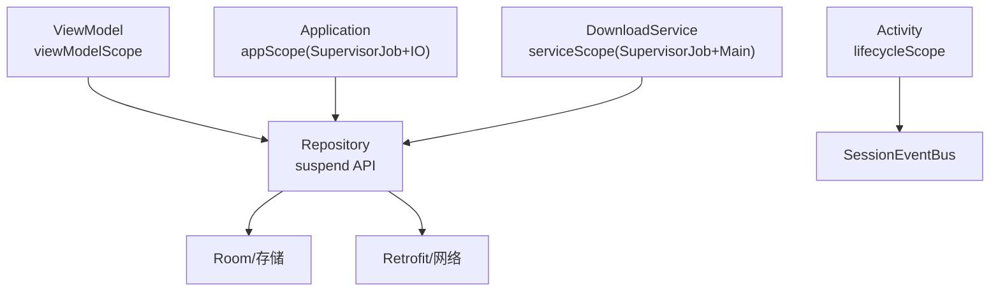
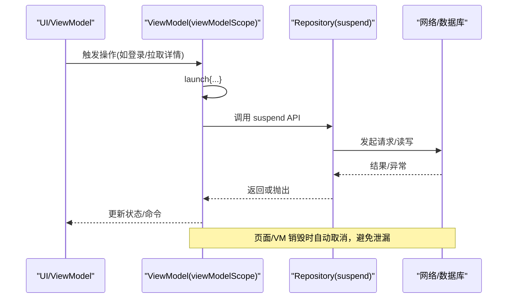
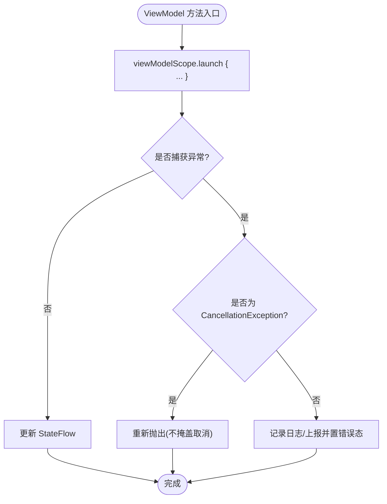
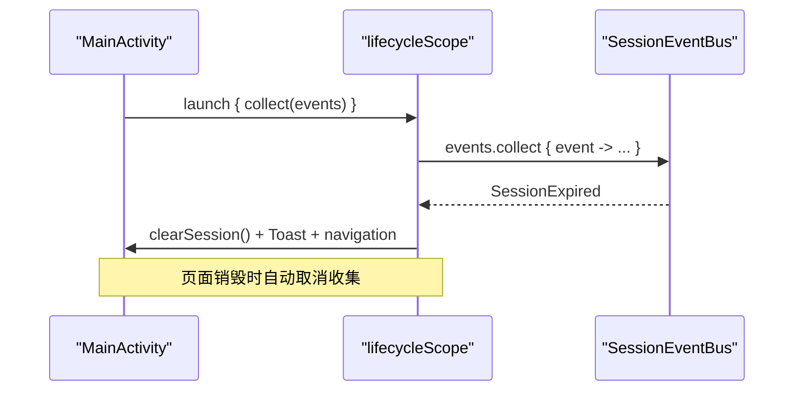
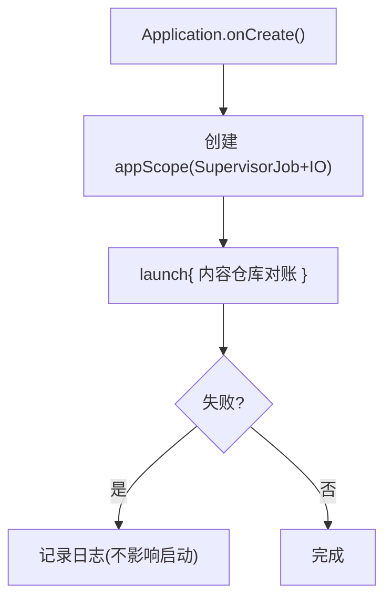
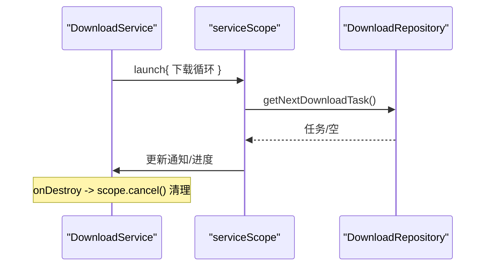
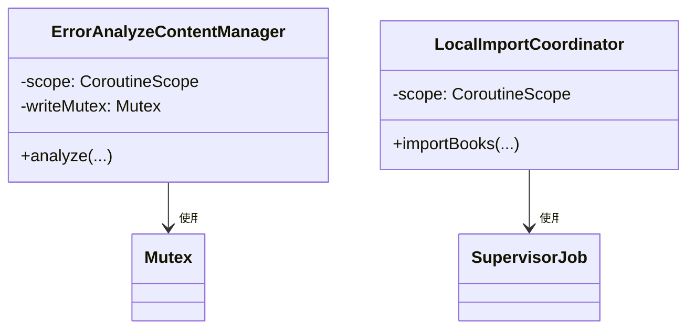
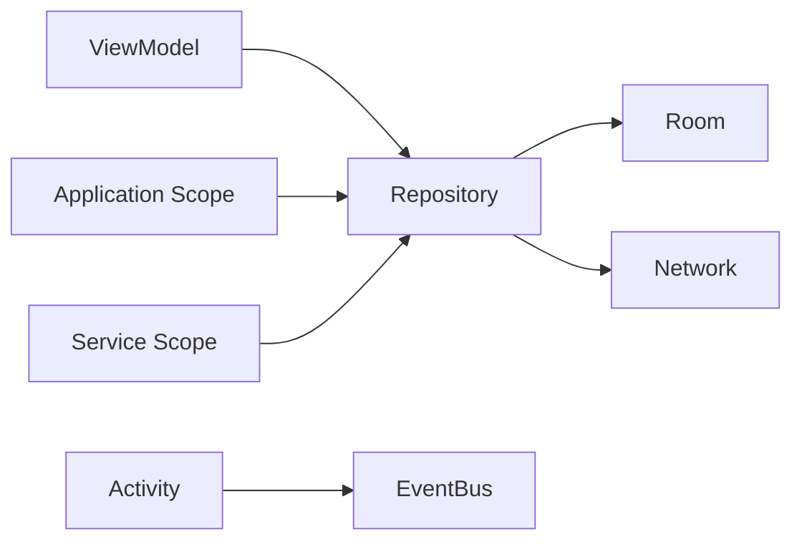

# 协程作用域管理与生命周期

<cite>
**本文引用的文件**
- [BookDetailViewModel.kt](file://module_book/src/main/java/com/ebook/book/mvvm/viewmodel/BookDetailViewModel.kt)
- [LoginViewModel.kt](file://module_login/src/main/java/com/ebook/login/mvvm/viewmodel/LoginViewModel.kt)
- [MainActivity.kt](file://module_main/src/main/java/com/ebook/main/MainActivity.kt)
- [MyApplication.kt](file://module_app/src/main/java/com/ebook/MyApplication.kt)
- [DownloadService.kt](file://module_book/src/main/java/com/ebook/book/service/DownloadService.kt)
- [ErrorAnalyzeContentManager.kt](file://lib_book_common/src/main/java/com/ebook/common/manager/ErrorAnalyzeContentManager.kt)
- [LocalImportCoordinator.kt](file://lib_book_common/src/main/java/com/ebook/common/importer/LocalImportCoordinator.kt)
</cite>

## 目录
1. [简介](#简介)
2. [项目结构中的协程使用位置概览](#项目结构中的协程使用位置概览)
3. [核心组件与职责](#核心组件与职责)
4. [架构总览](#架构总览)
5. [详细组件分析](#详细组件分析)
6. [依赖关系与作用域边界](#依赖关系与作用域边界)
7. [性能与并发特性](#性能与并发特性)
8. [故障排查与调试指南](#故障排查与调试指南)
9. [结论](#结论)

## 简介
本文围绕本仓库中协程作用域管理与生命周期管理进行系统化说明，聚焦以下主题：
- ViewModel 中使用 viewModelScope 的正确姿势、取消语义与内存安全
- Activity/Fragment 中使用 lifecycleScope 订阅事件流的时机与清理
- 应用级与 Service 级自定义 CoroutineScope（SupervisorJob）的创建、隔离与销毁策略
- 启动、暂停、恢复与取消的生命周期流转
- 典型场景模式：网络请求、数据同步、定时任务、前台服务
- 作用域隔离与竞态条件防护
- 调试技巧与常见问题定位

## 项目结构中的协程使用位置概览
- ViewModel 层：统一通过 viewModelScope.launch 发起异步任务，利用生命周期自动取消，避免内存泄漏。
- UI 层：Activity 使用 lifecycleScope 订阅全局事件流，随页面生命周期自动回收。
- 应用进程：Application 持有应用级 CoroutineScope(SupervisorJob + IO)，用于长生命周期后台任务。
- Service 层：前台下载服务维护自有 CoroutineScope(SupervisorJob + Main)，负责队列调度与 UI 通知更新。
- 公共组件：跨模块的协调器/管理器持有独立 CoroutineScope(SupervisorJob + IO) 以解耦业务模块生命周期。

**图示来源**
- [BookDetailViewModel.kt:75-101](file://module_book/src/main/java/com/ebook/book/mvvm/viewmodel/BookDetailViewModel.kt#L75-L101)
- [MainActivity.kt:68-80](file://module_main/src/main/java/com/ebook/main/MainActivity.kt#L68-L80)
- [MyApplication.kt:22-43](file://module_app/src/main/java/com/ebook/MyApplication.kt#L22-L43)
- [DownloadService.kt:87-93](file://module_book/src/main/java/com/ebook/book/service/DownloadService.kt#L87-L93)

**章节来源**
- [BookDetailViewModel.kt:75-101](file://module_book/src/main/java/com/ebook/book/mvvm/viewmodel/BookDetailViewModel.kt#L75-L101)
- [MainActivity.kt:68-80](file://module_main/src/main/java/com/ebook/main/MainActivity.kt#L68-L80)
- [MyApplication.kt:22-43](file://module_app/src/main/java/com/ebook/MyApplication.kt#L22-L43)
- [DownloadService.kt:87-93](file://module_book/src/main/java/com/ebook/book/service/DownloadService.kt#L87-L93)

## 核心组件与职责
- BookDetailViewModel：在详情页内用 viewModelScope 监听书架事件、静默重抓目录、拉取详情与章节；对 CancellationException 显式上抛，避免将“取消”误判为失败。
- LoginViewModel：登录流程在 viewModelScope 内执行，包含防重复点击、加载覆盖层、成功后的会话保存与导航。
- MainActivity：在 lifecycleScope 中收集 SessionEventBus 事件，处理会话过期并跳转登录页。
- MyApplication：应用启动时以 appScope 执行内容仓库对账，保证进程级一次性后台任务。
- DownloadService：前台下载服务维护 serviceScope(SupervisorJob+Main) 驱动任务循环与通知更新；onDestroy 中 cancel 作用域，避免泄露。
- ErrorAnalyzeContentManager / LocalImportCoordinator：公共组件持有 SupervisorJob 作用域，保证批量任务间相互隔离且与页面生命周期解耦。

**章节来源**
- [BookDetailViewModel.kt:168-209](file://module_book/src/main/java/com/ebook/book/mvvm/viewmodel/BookDetailViewModel.kt#L168-L209)
- [LoginViewModel.kt:45-73](file://module_login/src/main/java/com/ebook/login/mvvm/viewmodel/LoginViewModel.kt#L45-L73)
- [MainActivity.kt:68-80](file://module_main/src/main/java/com/ebook/main/MainActivity.kt#L68-L80)
- [MyApplication.kt:22-43](file://module_app/src/main/java/com/ebook/MyApplication.kt#L22-L43)
- [DownloadService.kt:87-93](file://module_book/src/main/java/com/ebook/book/service/DownloadService.kt#L87-L93)
- [ErrorAnalyzeContentManager.kt:31-37](file://lib_book_common/src/main/java/com/ebook/common/manager/ErrorAnalyzeContentManager.kt#L31-L37)
- [LocalImportCoordinator.kt:104-110](file://lib_book_common/src/main/java/com/ebook/common/importer/LocalImportCoordinator.kt#L104-L110)

## 架构总览
协程作用域在本项目中分层明确：
- UI/VM 层：由 AndroidX 提供的 viewModelScope/lifecycleScope 绑定生命周期，确保取消与资源释放。
- 应用进程层：Application 持有 SupervisorJob 作用域，承载与应用同生命周期的后台任务。
- Service 层：前台服务持有独立作用域，管理下载队列与 UI 通知，必要时在主线程调度。
- 公共组件层：跨模块组件各自持有 SupervisorJob 作用域，避免与具体模块耦合，提升可测试性与稳定性。

**图示来源**
- [LoginViewModel.kt:45-73](file://module_login/src/main/java/com/ebook/login/mvvm/viewmodel/LoginViewModel.kt#L45-L73)
- [BookDetailViewModel.kt:168-209](file://module_book/src/main/java/com/ebook/book/mvvm/viewmodel/BookDetailViewModel.kt#L168-L209)

## 详细组件分析

### ViewModel 层：viewModelScope 的使用与取消语义
- 启动方式：所有网络/IO 操作均在 viewModelScope.launch 中执行，避免手动管理 Job。
- 取消传播：当 ViewModel 被销毁时，viewModelScope 自动取消其下所有子协程；捕获到 CancellationException 时应向上抛出，不将其视为业务错误。
- 状态更新：通过 StateFlow.update 发布新状态，确保 Compose 重组与幂等性。
- 事件收集：在 init 中收集共享事件流，避免 Activity 侧重复收集导致重复累积。

**图示来源**
- [BookDetailViewModel.kt:248-270](file://module_book/src/main/java/com/ebook/book/mvvm/viewmodel/BookDetailViewModel.kt#L248-L270)
- [BookDetailViewModel.kt:280-297](file://module_book/src/main/java/com/ebook/book/mvvm/viewmodel/BookDetailViewModel.kt#L280-L297)

**章节来源**
- [BookDetailViewModel.kt:75-101](file://module_book/src/main/java/com/ebook/book/mvvm/viewmodel/BookDetailViewModel.kt#L75-L101)
- [BookDetailViewModel.kt:168-209](file://module_book/src/main/java/com/ebook/book/mvvm/viewmodel/BookDetailViewModel.kt#L168-L209)
- [BookDetailViewModel.kt:248-297](file://module_book/src/main/java/com/ebook/book/mvvm/viewmodel/BookDetailViewModel.kt#L248-L297)

### Activity 层：lifecycleScope 的事件订阅
- 在 onCreate 中通过 lifecycleScope.launch 收集 SessionEventBus.events，处理会话过期后清会话、提示并跳转登录页。
- 生命周期结束时自动取消收集，避免内存泄漏与无效回调。

**图示来源**
- [MainActivity.kt:68-80](file://module_main/src/main/java/com/ebook/main/MainActivity.kt#L68-L80)

**章节来源**
- [MainActivity.kt:68-80](file://module_main/src/main/java/com/ebook/main/MainActivity.kt#L68-L80)

### 应用进程层：Application 级 SupervisorJob 作用域
- 在 Application 中创建 appScope = CoroutineScope(SupervisorJob() + Dispatchers.IO)。
- 用于进程级一次性后台任务（如内容仓库对账），不影响主流程启动。
- 作用域随进程生命周期结束而销毁，无需手动取消。

**图示来源**
- [MyApplication.kt:22-43](file://module_app/src/main/java/com/ebook/MyApplication.kt#L22-L43)

**章节来源**
- [MyApplication.kt:22-43](file://module_app/src/main/java/com/ebook/MyApplication.kt#L22-L43)

### Service 层：前台下载的 SupervisorJob 作用域
- 使用 serviceScope = CoroutineScope(SupervisorJob() + Dispatchers.Main) 驱动下载循环与通知更新。
- onDestroy 中 cancel 作用域，移除 Handler 回调，确保无残留任务。
- onTimeout 快速收尾，仅做数秒内可完成的逻辑，避免超时崩溃。

**图示来源**
- [DownloadService.kt:87-93](file://module_book/src/main/java/com/ebook/book/service/DownloadService.kt#L87-L93)
- [DownloadService.kt:115-124](file://module_book/src/main/java/com/ebook/book/service/DownloadService.kt#L115-L124)

**章节来源**
- [DownloadService.kt:87-93](file://module_book/src/main/java/com/ebook/book/service/DownloadService.kt#L87-L93)
- [DownloadService.kt:115-124](file://module_book/src/main/java/com/ebook/book/service/DownloadService.kt#L115-L124)

### 公共组件：跨模块 SupervisorJob 作用域
- ErrorAnalyzeContentManager：以 SupervisorJob+IO 运行分析任务，配合 Mutex 串行写文件，避免竞态。
- LocalImportCoordinator：批量导入时使用 SupervisorJob+IO 作用域，保证导入过程与页面生命周期解耦。

**图示来源**
- [ErrorAnalyzeContentManager.kt:31-37](file://lib_book_common/src/main/java/com/ebook/common/manager/ErrorAnalyzeContentManager.kt#L31-L37)
- [LocalImportCoordinator.kt:104-110](file://lib_book_common/src/main/java/com/ebook/common/importer/LocalImportCoordinator.kt#L104-L110)

**章节来源**
- [ErrorAnalyzeContentManager.kt:31-37](file://lib_book_common/src/main/java/com/ebook/common/manager/ErrorAnalyzeContentManager.kt#L31-L37)
- [LocalImportCoordinator.kt:104-110](file://lib_book_common/src/main/java/com/ebook/common/importer/LocalImportCoordinator.kt#L104-L110)

## 依赖关系与作用域边界
- ViewModel 依赖 Repository 暴露的 suspend 函数，协程取消自上而下传播至 I/O 层。
- Activity 通过 lifecycleScope 订阅事件总线，订阅生命周期与页面一致。
- Application 作用域独立于 UI，适合长生命周期任务；Service 作用域独立于 Activity，适合前台任务。
- 公共组件使用 SupervisorJob 隔离任务，单任务失败不会终止整个作用域下的其他任务。

**图示来源**
- [BookDetailViewModel.kt:168-209](file://module_book/src/main/java/com/ebook/book/mvvm/viewmodel/BookDetailViewModel.kt#L168-L209)
- [MainActivity.kt:68-80](file://module_main/src/main/java/com/ebook/main/MainActivity.kt#L68-L80)
- [MyApplication.kt:22-43](file://module_app/src/main/java/com/ebook/MyApplication.kt#L22-L43)
- [DownloadService.kt:87-93](file://module_book/src/main/java/com/ebook/book/service/DownloadService.kt#L87-L93)

**章节来源**
- [BookDetailViewModel.kt:168-209](file://module_book/src/main/java/com/ebook/book/mvvm/viewmodel/BookDetailViewModel.kt#L168-L209)
- [MainActivity.kt:68-80](file://module_main/src/main/java/com/ebook/main/MainActivity.kt#L68-L80)
- [MyApplication.kt:22-43](file://module_app/src/main/java/com/ebook/MyApplication.kt#L22-L43)
- [DownloadService.kt:87-93](file://module_book/src/main/java/com/ebook/book/service/DownloadService.kt#L87-L93)

## 性能与并发特性
- 取消高效：viewModelScope/lifecycleScope 自动取消，减少手动 cancel 的遗漏风险。
- 隔离稳定：SupervisorJob 防止单个任务失败影响整体，适用于下载队列、批量导入、分析任务。
- 线程选择：IO 密集型使用 Dispatchers.IO，UI 更新使用 Dispatchers.Main。
- 竞争防护：写入文件等关键路径使用 Mutex 串行化，避免多协程交错导致的脏数据。

[本节为通用指导，不直接引用具体代码行]

## 故障排查与调试指南
- 常见症状
  - 页面不闪退但数据永远加载不出来：多为网络/序列化异常被吞掉，或缓存命中未刷新。
  - 页面销毁后仍收到回调：检查是否在 lifecycleScope/viewModelScope 之外持有了引用。
  - 下载服务无法前台化：检查 manifest 声明 dataSync 类型与权限，确认配额与系统限制。
- 定位步骤
  - 查看日志：统一走 Logger，关注网络/数据库异常栈。
  - 检查取消：捕获 CancellationException 时不应掩盖，应上抛以便上层感知取消。
  - 验证作用域：确认每个长生命周期作用域都有明确的创建点与销毁点（Application/Service）。
  - 观察状态流：确认 StateFlow 更新是否产生新对象引用，避免原地修改不触发重组。
- 调试建议
  - 在关键 suspend 调用处添加日志，标记进入/退出。
  - 使用断点观察作用域是否被取消（job.isCancelled）。
  - 对于前台服务超时，检查 onTimeout 是否及时 stopSelf 并保留任务。

**章节来源**
- [BookDetailViewModel.kt:248-297](file://module_book/src/main/java/com/ebook/book/mvvm/viewmodel/BookDetailViewModel.kt#L248-L297)
- [DownloadService.kt:115-124](file://module_book/src/main/java/com/ebook/book/service/DownloadService.kt#L115-L124)

## 结论
本项目在协程作用域管理方面遵循清晰的分层与约定：
- UI/VM 层使用 viewModelScope/lifecycleScope 确保生命周期绑定的取消与资源释放。
- 应用与服务层使用 SupervisorJob 构建稳定的长生命周期作用域，隔离任务、降低失败扩散。
- 通过 CancellationException 的上抛与严谨的状态更新，避免将“取消”误判为业务错误。
- 对并发访问的关键路径采用 Mutex 串行化，保障数据一致性。
这些实践共同构成了本项目的协程作用域管理与生命周期保障体系，既保证了功能正确性，也提升了可维护性与可观测性。