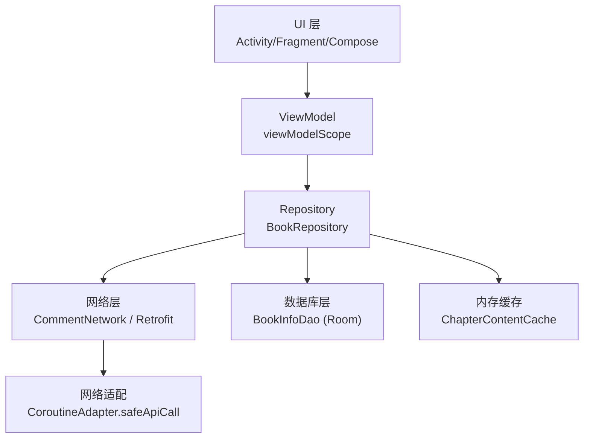
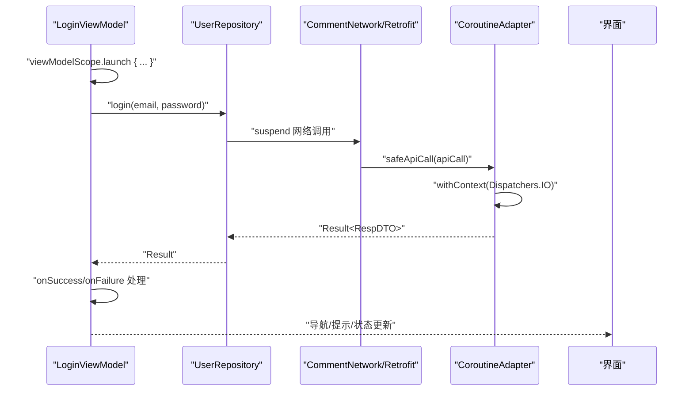
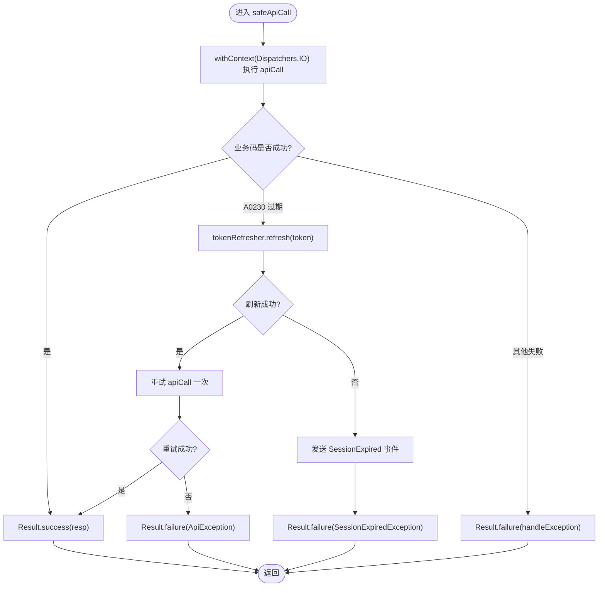
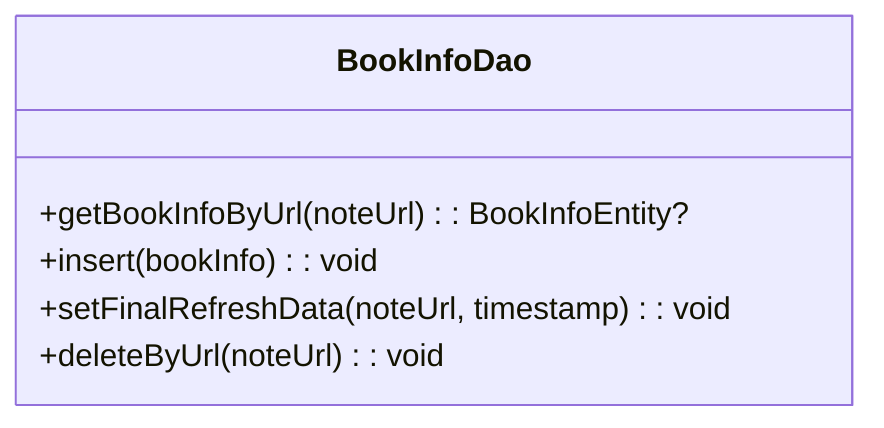
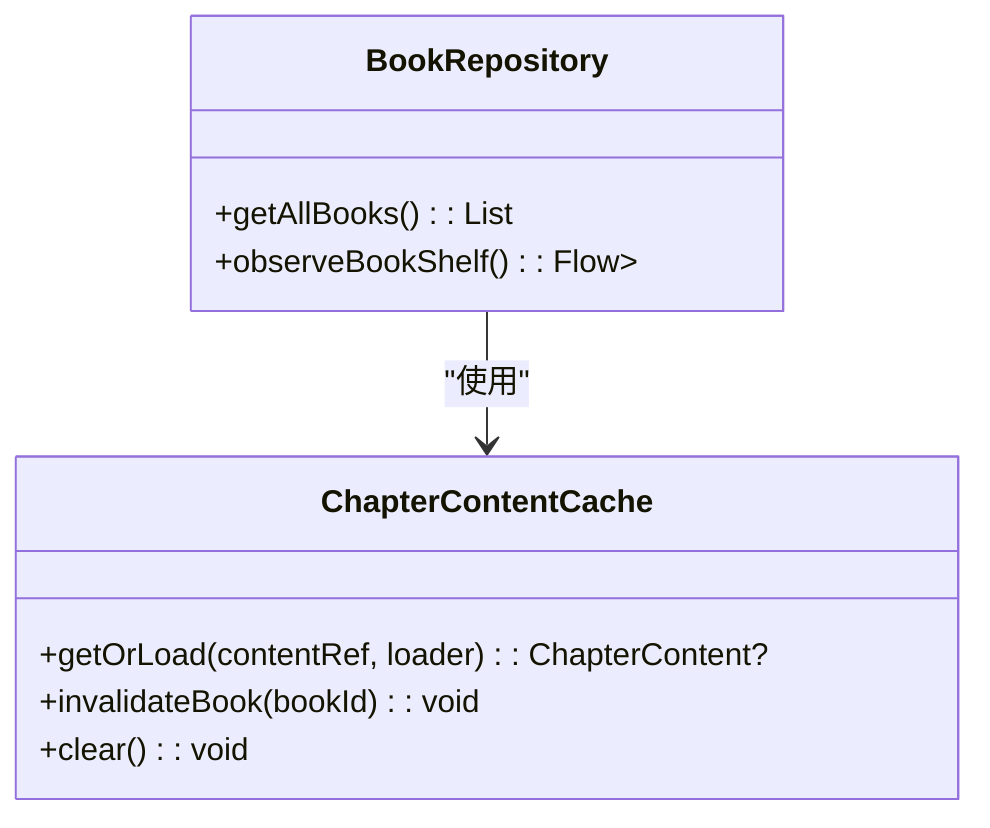
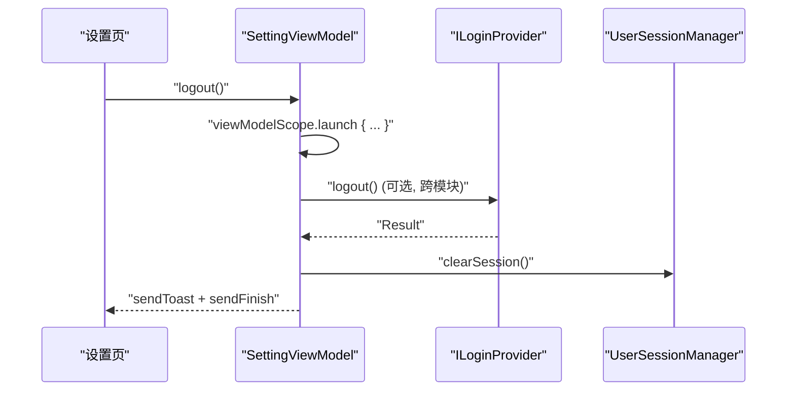
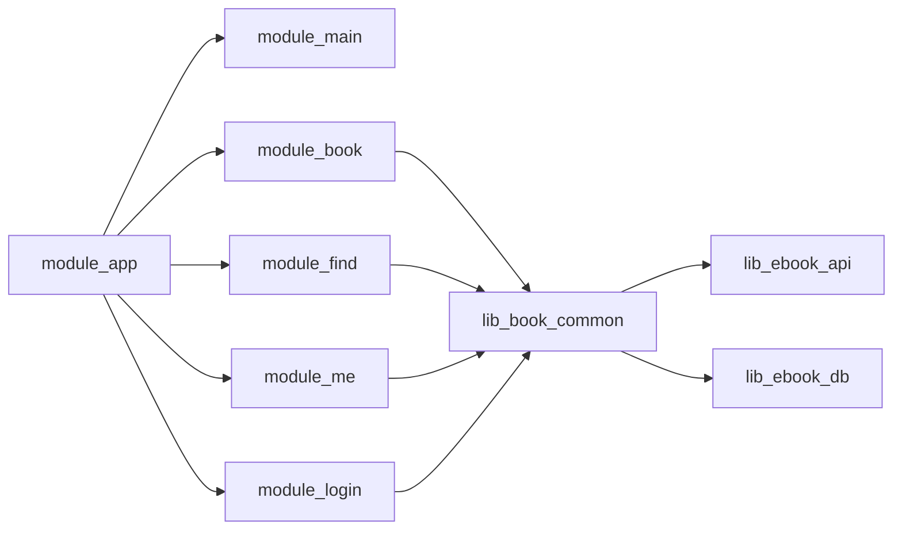

# 协程基础与 suspend 函数设计

<cite>
**本文引用的文件**
- [CoroutineAdapter.kt](file://lib_ebook_api/src/main/java/com/ebook/api/utils/CoroutineAdapter.kt)
- [LoginViewModel.kt](file://module_login/src/main/java/com/ebook/login/mvvm/viewmodel/LoginViewModel.kt)
- [CommentNetwork.kt](file://lib_ebook_api/src/main/java/com/ebook/api/service/comment/CommentNetwork.kt)
- [BookInfoDao.kt](file://lib_ebook_db/src/main/java/com/ebook/db/dao/BookInfoDao.kt)
- [BookRepository.kt](file://lib_book_common/src/main/java/com/ebook/common/repository/BookRepository.kt)
- [ChapterContentCache.kt](file://lib_book_common/src/main/java/com/ebook/common/store/ChapterContentCache.kt)
- [SettingViewModel.kt](file://module_me/src/main/java/com/ebook/me/mvvm/viewmodel/SettingViewModel.kt)
- [AGENTS.md](file://AGENTS.md)
</cite>

## 目录
1. [引言](#引言)
2. [项目结构](#项目结构)
3. [核心组件](#核心组件)
4. [架构总览](#架构总览)
5. [详细组件分析](#详细组件分析)
6. [依赖关系分析](#依赖关系分析)
7. [性能考量](#性能考量)
8. [故障排查指南](#故障排查指南)
9. [结论](#结论)

## 引言
本文件围绕 Kotlin 协程与 suspend 函数在本项目中的设计与实践，系统化阐述：
- 何时使用 suspend 函数、错误处理模式（try-catch vs Result）、取消传播与超时控制
- 协程作用域的使用原则：viewModelScope、lifecycleScope 与自定义作用域的创建与管理
- 调度器选择：Dispatchers.IO、Dispatchers.Main、Dispatchers.Default
- 常见场景的异步处理模式：网络请求、数据库操作、文件读写
- 协程性能优化：并发控制、避免不必要的挂起点、withContext 的最佳实践
- 调试技巧与常见问题定位方法

## 项目结构
本项目为多模块 Android 应用，统一采用 MVVM + Coroutines + Flow。关键层次：
- 网络层：lib_ebook_api（Retrofit + 通用适配器 CoroutineAdapter）
- 数据访问层：lib_ebook_db（Room DAO，suspend 接口）
- 业务仓库：lib_book_common（聚合网络与本地数据，封装领域逻辑）
- UI 层：各功能模块（module_*），通过 ViewModel + viewModelScope 组织异步流程

图表来源
- [CommentNetwork.kt:18-47](file://lib_ebook_api/src/main/java/com/ebook/api/service/comment/CommentNetwork.kt#L18-L47)
- [BookInfoDao.kt:13-49](file://lib_ebook_db/src/main/java/com/ebook/db/dao/BookInfoDao.kt#L13-L49)
- [BookRepository.kt:51-100](file://lib_book_common/src/main/java/com/ebook/common/repository/BookRepository.kt#L51-L100)
- [CoroutineAdapter.kt:17-62](file://lib_ebook_api/src/main/java/com/ebook/api/utils/CoroutineAdapter.kt#L17-L62)

章节来源
- [AGENTS.md](file://AGENTS.md)
- [BookRepository.kt:51-100](file://lib_book_common/src/main/java/com/ebook/common/repository/BookRepository.kt#L51-L100)

## 核心组件
- 网络适配：CoroutineAdapter.safeApiCall 将任意 suspend 网络调用统一到 IO 线程，并负责业务码转换、会话过期静默刷新、异常归一化
- Repository：BookRepository 聚合 DAO、解析器、缓存等能力，暴露 suspend/Flow API，屏蔽底层细节
- ViewModel：LoginViewModel、SettingViewModel 使用 viewModelScope 发起业务流，管理加载态、导航、事件
- DAO：Room DAO 以 suspend 函数暴露数据库访问，确保非阻塞
- 缓存：ChapterContentCache 用 Mutex 保护 LRU 缓存，提供 getOrLoad/invalidate/clear

章节来源
- [CoroutineAdapter.kt:17-62](file://lib_ebook_api/src/main/java/com/ebook/api/utils/CoroutineAdapter.kt#L17-L62)
- [BookRepository.kt:51-100](file://lib_book_common/src/main/java/com/ebook/common/repository/BookRepository.kt#L51-L100)
- [LoginViewModel.kt:45-73](file://module_login/src/main/java/com/ebook/login/mvvm/viewmodel/LoginViewModel.kt#L45-L73)
- [BookInfoDao.kt:13-49](file://lib_ebook_db/src/main/java/com/ebook/db/dao/BookInfoDao.kt#L13-L49)
- [ChapterContentCache.kt:25-62](file://lib_book_common/src/main/java/com/ebook/common/store/ChapterContentCache.kt#L25-L62)

## 架构总览
下图展示一次“登录”流程中协程与 suspend 函数的协作：ViewModel 在 viewModelScope 中发起请求，仓库层或网络层可能切换到 IO 线程执行，最终返回结果并由 UI 消费。

图表来源
- [LoginViewModel.kt:45-73](file://module_login/src/main/java/com/ebook/login/mvvm/viewmodel/LoginViewModel.kt#L45-L73)
- [CommentNetwork.kt:26-47](file://lib_ebook_api/src/main/java/com/ebook/api/service/comment/CommentNetwork.kt#L26-L47)
- [CoroutineAdapter.kt:41-62](file://lib_ebook_api/src/main/java/com/ebook/api/utils/CoroutineAdapter.kt#L41-L62)

## 详细组件分析

### 网络层：CoroutineAdapter 的错误处理与取消传播
- 职责：统一把网络调用切到 IO 线程；将业务码映射为 Result；对 A0230 会话过期做单飞刷新并仅在失败时触发全局事件；保留取消语义不被吞掉
- 关键点：
  - withContext(Dispatchers.IO) 包裹真实网络调用
  - try-catch 捕获业务异常与网络异常，统一转为 Result.failure
  - CancellationException 原样抛出，保证取消传播
  - 会话过期分支：先尝试刷新 token，成功则重放一次请求；失败则发射 SessionExpired 并返回特殊失败标记

图表来源
- [CoroutineAdapter.kt:41-112](file://lib_ebook_api/src/main/java/com/ebook/api/utils/CoroutineAdapter.kt#L41-L112)

章节来源
- [CoroutineAdapter.kt:17-150](file://lib_ebook_api/src/main/java/com/ebook/api/utils/CoroutineAdapter.kt#L17-L150)

### 数据访问层：Room DAO 的 suspend 设计
- 所有 DAO 方法声明为 suspend，便于上层以结构化并发调用
- 常用模式：按自然键查询/upsert、定向 UPDATE 仅修改必要列，降低误写风险
- 示例：BookInfoDao 提供 setFinalRefreshData 仅更新“最后检查时间”，避免整行 REPLACE 带来的字段丢失

图表来源
- [BookInfoDao.kt:13-49](file://lib_ebook_db/src/main/java/com/ebook/db/dao/BookInfoDao.kt#L13-L49)

章节来源
- [BookInfoDao.kt:13-49](file://lib_ebook_db/src/main/java/com/ebook/db/dao/BookInfoDao.kt#L13-L49)

### 仓库层：并发控制与缓存
- BookRepository 组合 DAO、解析器、缓存，对外暴露 suspend/Flow 接口
- 常见模式：
  - 读取列表：getAllBooks 在 IO 线程执行 DAO 查询
  - 响应式数据：observeBookShelf 返回 Flow，结合 map 过滤/投影
- 缓存：ChapterContentCache 使用 Mutex 保护 LRU，getOrLoad 支持“未命中再加载”，invalidateBook 按 bookId 片段清理

图表来源
- [BookRepository.kt:81-100](file://lib_book_common/src/main/java/com/ebook/common/repository/BookRepository.kt#L81-L100)
- [ChapterContentCache.kt:25-62](file://lib_book_common/src/main/java/com/ebook/common/store/ChapterContentCache.kt#L25-L62)

章节来源
- [BookRepository.kt:51-100](file://lib_book_common/src/main/java/com/ebook/common/repository/BookRepository.kt#L51-L100)
- [ChapterContentCache.kt:25-62](file://lib_book_common/src/main/java/com/ebook/common/store/ChapterContentCache.kt#L25-L62)

### ViewModel 层：作用域与生命周期
- LoginViewModel：在 viewModelScope 中发起登录，成功后保存会话、导航回跳、更新资料；防重复点击、loading 覆盖层
- SettingViewModel：版本检查、主题切换、退出登录均在 viewModelScope 中编排；强调“收尾放在 ViewModel，不在页面作用域”，避免旋转屏幕导致清理被取消

图表来源
- [SettingViewModel.kt:303-343](file://module_me/src/main/java/com/ebook/me/mvvm/viewmodel/SettingViewModel.kt#L303-L343)
- [LoginViewModel.kt:45-73](file://module_login/src/main/java/com/ebook/login/mvvm/viewmodel/LoginViewModel.kt#L45-L73)

章节来源
- [LoginViewModel.kt:45-73](file://module_login/src/main/java/com/ebook/login/mvvm/viewmodel/LoginViewModel.kt#L45-L73)
- [SettingViewModel.kt:303-343](file://module_me/src/main/java/com/ebook/me/mvvm/viewmodel/SettingViewModel.kt#L303-L343)

## 依赖关系分析
- 模块依赖方向：业务模块 → lib_book_common → lib_ebook_api / lib_ebook_db
- 协程相关依赖：
  - 网络层通过 CoroutineAdapter 统一异常与会话处理
  - 数据层通过 Room suspend DAO 暴露异步接口
  - 仓库层组合 DAO 与缓存，提供领域级 API
  - ViewModel 通过 viewModelScope 组织生命周期感知任务

图表来源
- [AGENTS.md](file://AGENTS.md)

章节来源
- [AGENTS.md](file://AGENTS.md)

## 性能考量
- 调度器选择
  - Dispatchers.IO：网络请求、文件 I/O、数据库写入等阻塞型操作（见 CoroutineAdapter.withContext(Dispatchers.IO)、BookRepository.getAllBooks）
  - Dispatchers.Main：UI 更新、回调落主线程（ViewModel 中一般无需显式切换，由 Compose/View 框架处理）
  - Dispatchers.Default：CPU 密集计算（如文本处理、复杂算法），注意控制粒度与批量大小
- 并发控制
  - 互斥锁：ChapterContentCache 使用 Mutex 保护 LRU 写入/读取
  - 背压：Flow 默认具备背压，必要时配合 flowOn(Dispatchers.IO) 将上游切换到 IO
- 避免不必要的挂起点
  - 仅在真正需要等待外部资源时挂起（网络、IO、DB）
  - 尽量将耗时逻辑封装到 suspend 函数内部，减少上层调用方复杂度
- withContext 最佳实践
  - 短小临界区用 withContext 切换调度器，避免长时间持有上下文
  - 不要在主线程中调用会阻塞的 IO 操作

[本节为通用指导，不直接分析具体文件]

## 故障排查指南
- 取消传播问题
  - 现象：页面销毁后仍有后台任务继续运行或抛出不期望的异常
  - 排查：确认未在 catch(Exception) 中吞掉 CancellationException；参考 CoroutineAdapter 对取消的原样上抛策略
- 会话过期与刷新风暴
  - 现象：多次请求同时触发刷新，或刷新失败后仍反复报错
  - 排查：确认使用 TokenRefresher 的单飞刷新机制；检查是否因异常路径漏发 SessionExpired 事件
- 主线程阻塞
  - 现象：UI 卡顿、ANR
  - 排查：检查是否在 Main 调度器执行了 IO 操作；确保网络/DB 调用在 IO 线程
- 数据库误写
  - 现象：字段被清空或数据不一致
  - 排查：优先使用定向 UPDATE 而非整行 REPLACE；核对主键策略与唯一索引约束

章节来源
- [CoroutineAdapter.kt:41-112](file://lib_ebook_api/src/main/java/com/ebook/api/utils/CoroutineAdapter.kt#L41-L112)
- [BookInfoDao.kt:28-42](file://lib_ebook_db/src/main/java/com/ebook/db/dao/BookInfoDao.kt#L28-L42)

## 结论
本项目在协程与 suspend 函数设计上遵循以下原则：
- 统一通过 suspend 函数表达可取消的异步操作
- 网络层集中处理异常与会话失效，保持上层简洁
- 仓库层聚合多种数据源并提供一致的领域 API
- ViewModel 使用 viewModelScope 组织生命周期感知任务，避免在页面作用域执行收尾逻辑
- 严格区分调度器用途，避免主线程阻塞，利用 Flow/Mutex 进行并发控制
- 通过缓存、事务与最小化更新降低系统开销

这些实践共同保证了应用的响应性、可维护性与健壮性。