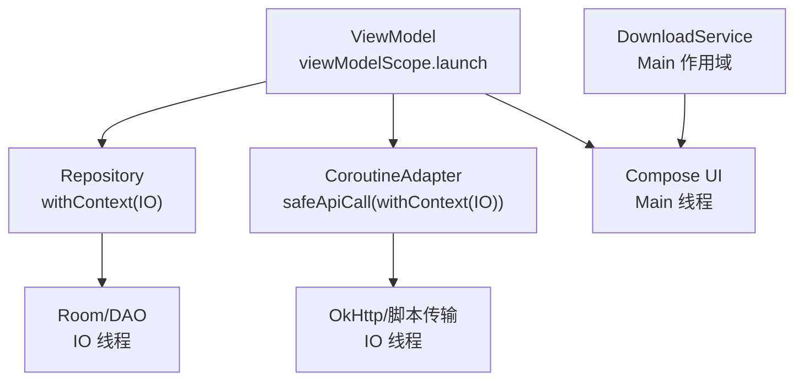
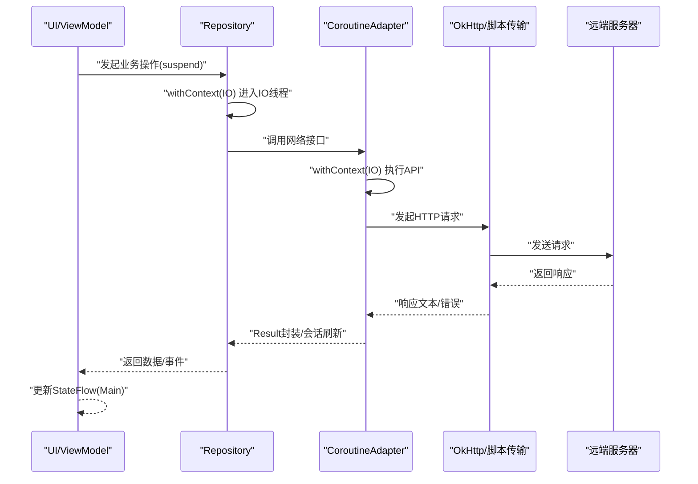
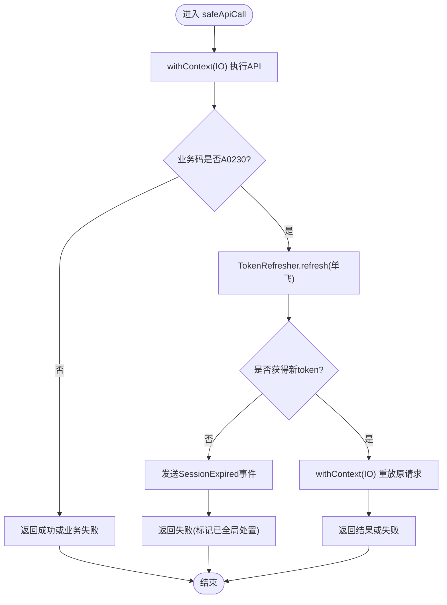
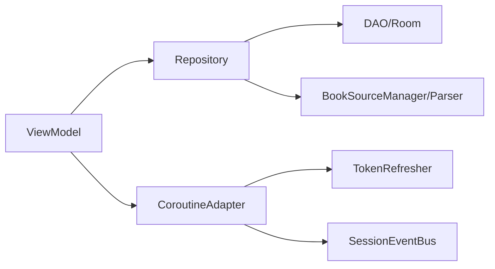

# 协程调度器选择与线程模型

<cite>
**本文引用的文件**   
- [CoroutineAdapter.kt](file://lib_ebook_api/src/main/java/com/ebook/api/utils/CoroutineAdapter.kt)
- [BookRepository.kt](file://lib_book_common/src/main/java/com/ebook/common/repository/BookRepository.kt)
- [DownloadService.kt](file://module_book/src/main/java/com/ebook/book/service/DownloadService.kt)
- [ScriptHttp.kt](file://lib_book_source/src/main/java/com/ebook/source/script/ScriptHttp.kt)
- [SettingViewModelTest.kt](file://module_me/src/test/java/com/ebook/me/mvvm/viewmodel/SettingViewModelTest.kt)
- [BookDetailViewModel.kt](file://module_book/src/main/java/com/ebook/book/mvvm/viewmodel/BookDetailViewModel.kt)
</cite>

## 目录
1. [引言](#引言)
2. [项目结构中与调度器相关的要点](#项目结构中与调度器相关的要点)
3. [核心组件与调度策略总览](#核心组件与调度策略总览)
4. [架构总览：调度器在请求链路中的位置](#架构总览：调度器在请求链路中的位置)
5. [关键组件详解](#关键组件详解)
6. [依赖关系分析](#依赖关系分析)
7. [性能考虑与优化建议](#性能考虑与优化建议)
8. [故障排查指南](#故障排查指南)
9. [结论](#结论)

## 引言
本文围绕本仓库的协程调度器选择与线程模型，系统性说明以下问题：
- 何时使用 Dispatchers.IO、Dispatchers.Main、Dispatchers.Default；
- withContext 的正确用法、切换时机与避免不必要切换的策略；
- 自定义调度器的创建与适用场景（含线程池配置与调优思路）；
- 结合网络请求、数据库操作、图片处理等典型场景给出调度策略；
- 线程安全与 ANR 防护；
- 如何监控线程使用情况与定位性能瓶颈。

## 项目结构中与调度器相关的要点
- 统一网络入口通过 CoroutineAdapter 收口，所有网络调用强制在 IO 线程执行，并集中处理会话过期与异常翻译。
- Repository 层将数据库访问与本地 I/O 包装为 suspend 函数，并在内部以 withContext(Dispatchers.IO) 确保不阻塞主线程。
- 前台下载服务 DownloadService 维护一个基于 Main 调度器的协程作用域用于 UI 相关更新，同时配合队列与任务调度逻辑。
- 书源脚本网络传输 ScriptHttp 中，对 OkHttp 的请求封装在 IO 调度器上执行，保证非阻塞且可重试。
- ViewModel 层普遍使用 viewModelScope.launch 发起异步任务，UI 状态通过 Flow/StateFlow 驱动重组。

**Section sources**
- [CoroutineAdapter.kt:41-62](file://lib_ebook_api/src/main/java/com/ebook/api/utils/CoroutineAdapter.kt#L41-L62)
- [BookRepository.kt:82-140](file://lib_book_common/src/main/java/com/ebook/common/repository/BookRepository.kt#L82-L140)
- [DownloadService.kt:86-94](file://module_book/src/main/java/com/ebook/book/service/DownloadService.kt#L86-L94)
- [ScriptHttp.kt:45-58](file://lib_book_source/src/main/java/com/ebook/source/script/ScriptHttp.kt#L45-L58)
- [BookDetailViewModel.kt:75-100](file://module_book/src/main/java/com/ebook/book/mvvm/viewmodel/BookDetailViewModel.kt#L75-L100)

## 核心组件与调度策略总览
- 网络请求：统一经 CoroutineAdapter.safeApiCall，内部用 withContext(Dispatchers.IO) 包裹 API 调用，避免在主线程发网络请求。
- 数据访问：Repository 的 suspend 方法在 IO 线程执行数据库读写，保证 UI 流畅。
- UI 更新：ViewModel 使用 viewModelScope.launch 启动任务，结果通过 StateFlow 回到 Compose 重组；前台服务中需要更新通知时使用 Main 调度器。
- 计算密集型：本项目未见显式使用 Dispatchers.Default 的重度 CPU 计算；如需引入，应将解析/转换等纯计算放入 Default，并限制并发度。
- 脚本取文：ScriptHttp 的 OkHttp 调用在 IO 线程执行，支持超时与重试，符合 I/O 密集模式。

**Diagram sources**
- [BookRepository.kt:82-140](file://lib_book_common/src/main/java/com/ebook/common/repository/BookRepository.kt#L82-L140)
- [CoroutineAdapter.kt:41-62](file://lib_ebook_api/src/main/java/com/ebook/api/utils/CoroutineAdapter.kt#L41-L62)
- [ScriptHttp.kt:45-58](file://lib_book_source/src/main/java/com/ebook/source/script/ScriptHttp.kt#L45-L58)
- [DownloadService.kt:86-94](file://module_book/src/main/java/com/ebook/book/service/DownloadService.kt#L86-L94)

## 架构总览：调度器在请求链路中的位置
下图展示一次从 UI 到网络的完整调用链，强调调度器切换点与职责边界。

**Diagram sources**
- [BookRepository.kt:82-140](file://lib_book_common/src/main/java/com/ebook/common/repository/BookRepository.kt#L82-L140)
- [CoroutineAdapter.kt:41-112](file://lib_ebook_api/src/main/java/com/ebook/api/utils/CoroutineAdapter.kt#L41-L112)
- [ScriptHttp.kt:45-80](file://lib_book_source/src/main/java/com/ebook/source/script/ScriptHttp.kt#L45-L80)

## 关键组件详解

### 网络层：CoroutineAdapter 的调度与异常处理
- 职责：将所有网络请求置于 IO 线程，统一处理业务码 A0230（token 过期），实现单飞静默刷新并重放一次原请求；其余异常转成类型化失败，取消异常放行。
- 调度器：safeApiCall 与重放路径均使用 withContext(Dispatchers.IO)，确保网络 I/O 不在主线程。
- 线程安全：取消异常被显式放行，避免误判为业务失败导致全局会话过期处置。

**Diagram sources**
- [CoroutineAdapter.kt:41-112](file://lib_ebook_api/src/main/java/com/ebook/api/utils/CoroutineAdapter.kt#L41-L112)

**Section sources**
- [CoroutineAdapter.kt:41-112](file://lib_ebook_api/src/main/java/com/ebook/api/utils/CoroutineAdapter.kt#L41-L112)

### 数据访问层：Repository 的 IO 线程策略
- 职责：封装书架 CRUD、阅读进度保存、章节读取路由、换源事务收尾等。
- 调度器：各 suspend 方法以 withContext(Dispatchers.IO) 包裹 DAO 调用，避免阻塞主线程；观察流仅做映射与过滤，无写副作用。
- 并发：SharedFlow 背压缓冲容量设置合理，事件分发不阻塞写路径。

**Section sources**
- [BookRepository.kt:82-140](file://lib_book_common/src/main/java/com/ebook/common/repository/BookRepository.kt#L82-L140)

### 前台服务：DownloadService 的线程与作用域
- 职责：离线下载逐章抓取正文并写入文件，维护下载队列与进度回传。
- 调度器：服务内维护一个以 Main 调度器为主的协程作用域用于 UI/通知相关更新；后台任务由仓库与服务内部队列管理，实际 I/O 走 IO 线程。
- 生命周期：onDestroy 中清理 Handler 回调并 cancel 作用域，防止泄漏。

**Section sources**
- [DownloadService.kt:86-94](file://module_book/src/main/java/com/ebook/book/service/DownloadService.kt#L86-L94)

### 脚本取文：ScriptHttp 的网络 I/O
- 职责：提供脚本取文的传输接缝，统一按选项 charset 解码响应文本，支持超时与重试。
- 调度器：execute 使用 withContext(Dispatchers.IO) 执行 OkHttp 请求，避免阻塞主线程；非 2xx 响应按 IOException 参与重试逻辑。
- 字符集：显式 bytes() + String(bytes, charset) 避免 Content-Type 强改导致的乱码。

**Section sources**
- [ScriptHttp.kt:45-80](file://lib_book_source/src/main/java/com/ebook/source/script/ScriptHttp.kt#L45-L80)

### ViewModel 与 UI 更新
- 职责：收集书架事件、更新详情状态、触发网络/数据库操作。
- 调度器：使用 viewModelScope.launch 启动协程；通过 StateFlow 将结果推送给 Compose 重组（默认在主线程）。
- 线程安全：事件收集在 VM init 中一次性订阅，避免旋转重建重复累积。

**Section sources**
- [BookDetailViewModel.kt:75-100](file://module_book/src/main/java/com/ebook/book/mvvm/viewmodel/BookDetailViewModel.kt#L75-L100)

## 依赖关系分析
- ViewModel 依赖 Repository 与各类管理器，Repository 依赖 DAO 与解析器；网络请求集中在 CoroutineAdapter，进一步依赖 TokenRefresher 与 SessionEventBus。
- 调度器使用分布清晰：网络与数据库均在 IO 线程，UI 更新在主线程，避免跨层随意切换造成性能损耗。

**Diagram sources**
- [BookRepository.kt:52-74](file://lib_book_common/src/main/java/com/ebook/common/repository/BookRepository.kt#L52-L74)
- [CoroutineAdapter.kt:30-34](file://lib_ebook_api/src/main/java/com/ebook/api/utils/CoroutineAdapter.kt#L30-L34)

**Section sources**
- [BookRepository.kt:52-74](file://lib_book_common/src/main/java/com/ebook/common/repository/BookRepository.kt#L52-L74)
- [CoroutineAdapter.kt:30-34](file://lib_ebook_api/src/main/java/com/ebook/api/utils/CoroutineAdapter.kt#L30-L34)

## 性能考虑与优化建议
- 减少不必要的线程切换：
  - 在 Repository 内部尽量保持同一 IO 上下文，避免多次 withContext 切换；
  - 仅在跨越边界（如 UI 更新）时切回 Main。
- 合理设置背压与缓冲：
  - SharedFlow 的 extraBufferCapacity 应适中，避免过大内存占用或过小背压导致丢事件。
- 网络层优化：
  - OkHttp 复用连接池，按需派生带超时的客户端；
  - 重试次数与超时时间需按场景配置，避免风暴。
- 计算密集型任务：
  - 若后续引入大量 CPU 密集处理（如图片解码、文本规范化），建议使用 Dispatchers.Default，并通过 Semaphore 或自定义线程池限制并发。
- 测试环境隔离：
  - 单元测试中使用 StandardTestDispatcher 与 setMain/resetMain，确保主线程行为可控；真实 IO 线程不受虚拟时钟影响，需用 awaitUntil 等机制等待。

[本节为通用指导，无需具体文件引用]

## 故障排查指南
- 主线程卡顿/ANR：
  - 检查是否在 UI 线程执行了网络或数据库操作；确认 Repository 与网络层均使用 IO 调度器。
- 会话过期未跳转登录：
  - 查看 CoroutineAdapter 的会话过期事件发射路径与上层订阅是否生效；确认取消异常未被吞掉。
- 脚本取文乱码：
  - 确认使用 bytes() + String(bytes, charset) 而非 body.string()；检查 EncodingInterceptor 对 Content-Type 的强改影响。
- 测试不稳定/竞态：
  - 注意真实 IO 线程不受虚拟时钟控制，使用 advanceUntilIdle 与轮询条件等待，避免固定 sleep 导致时序问题。

**Section sources**
- [CoroutineAdapter.kt:41-112](file://lib_ebook_api/src/main/java/com/ebook/api/utils/CoroutineAdapter.kt#L41-L112)
- [ScriptHttp.kt:45-80](file://lib_book_source/src/main/java/com/ebook/source/script/ScriptHttp.kt#L45-L80)
- [SettingViewModelTest.kt:66-91](file://module_me/src/test/java/com/ebook/me/mvvm/viewmodel/SettingViewModelTest.kt#L66-L91)

## 结论
本项目在协程调度器选择上遵循清晰的职责边界：网络与数据库操作在 IO 线程，UI 更新在主线程，ViewModel 通过 viewModelScope 与 Flow/StateFlow 协调异步流程。CoroutineAdapter 统一了网络层的调度与异常处理，Repository 保证了数据访问的非阻塞性，DownloadService 在服务生命周期内合理管理线程与资源。未来如需引入 CPU 密集任务，应在 Default 或自定义线程池中限制并发，并持续监控线程使用与性能瓶颈，确保用户体验稳定流畅。