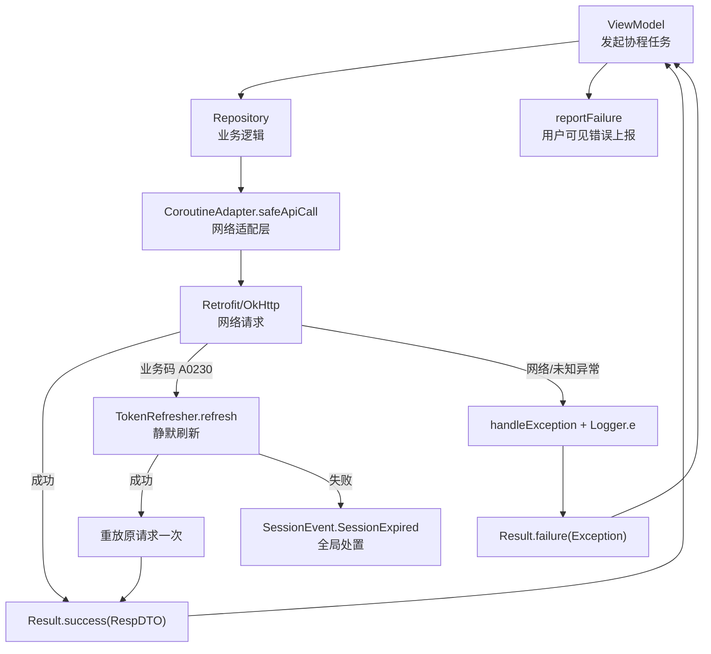
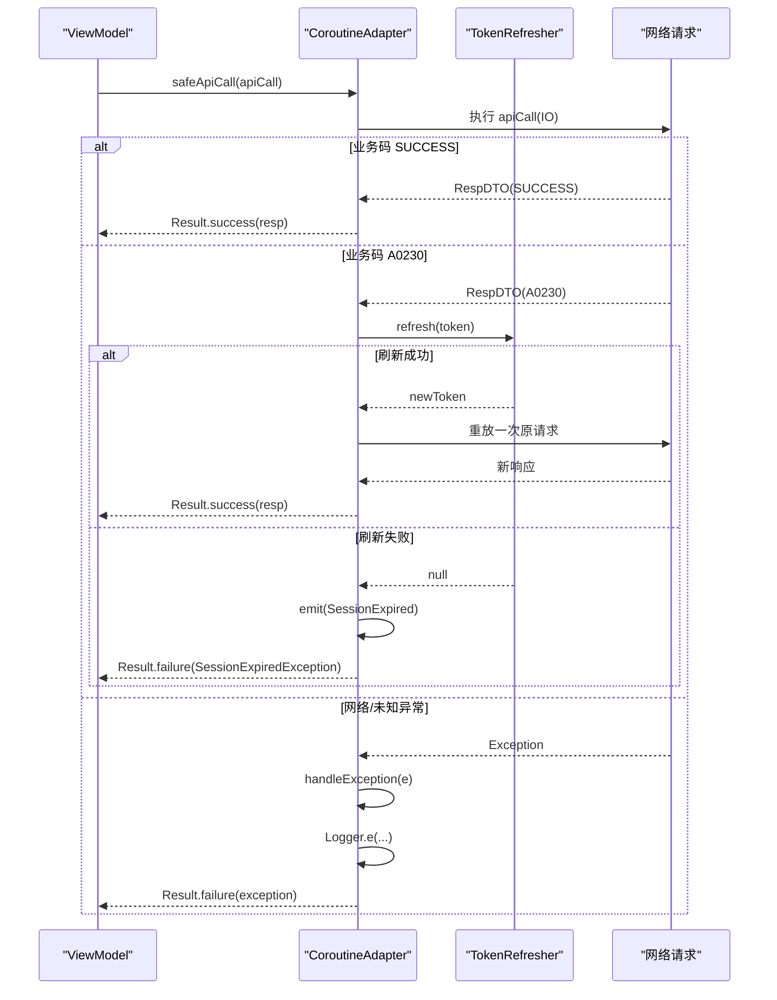
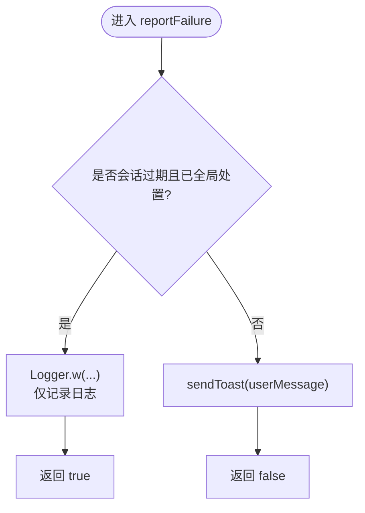
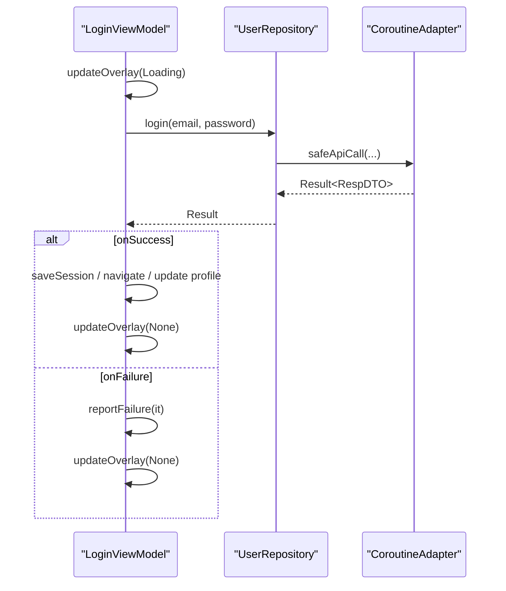
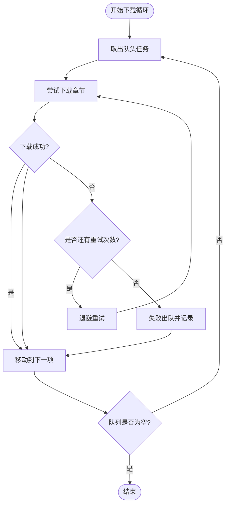
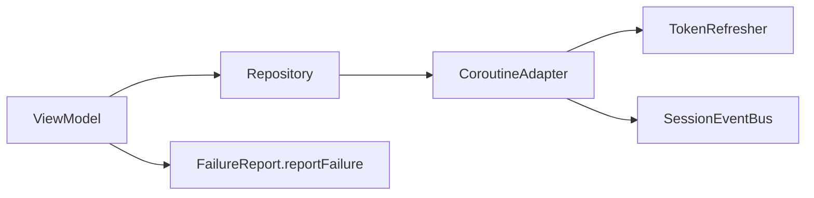

# 协程错误处理模式

<cite>
**本文引用的文件**
- [CoroutineAdapter.kt](file://lib_ebook_api/src/main/java/com/ebook/api/utils/CoroutineAdapter.kt)
- [FailureReport.kt](file://lib_book_common/src/main/java/com/ebook/common/util/FailureReport.kt)
- [LoginViewModel.kt](file://module_login/src/main/java/com/ebook/login/mvvm/viewmodel/LoginViewModel.kt)
- [BookDetailViewModel.kt](file://module_book/src/main/java/com/ebook/book/mvvm/viewmodel/BookDetailViewModel.kt)
- [BookImportViewModel.kt](file://module_book/src/main/java/com/ebook/book/mvvm/viewmodel/BookImportViewModel.kt)
- [DownloadService.kt](file://module_book/src/main/java/com/ebook/book/service/DownloadService.kt)
- [SessionTokenRefresher.kt](file://lib_book_common/src/main/java/com/ebook/common/domain/SessionTokenRefresher.kt)
</cite>

## 目录
1. [简介](#简介)
2. [项目结构中的错误处理位置](#项目结构中的错误处理位置)
3. [核心组件与职责](#核心组件与职责)
4. [架构总览](#架构总览)
5. [详细组件分析](#详细组件分析)
6. [依赖关系分析](#依赖关系分析)
7. [性能考虑](#性能考虑)
8. [故障排查指南](#故障排查指南)
9. [结论](#结论)

## 简介
本文件聚焦本项目中基于 Kotlin Coroutines 的错误处理模式，覆盖以下要点：
- try-catch 的使用边界、Result 返回模式与异常传播机制
- 取消异常 CancellationException 的识别与“不吞掉取消信号”的原则
- 异步操作的错误恢复策略：重试、降级、优雅失败
- 具体场景示例：网络超时、数据解析失败、权限拒绝等
- 错误上报与日志记录的最佳实践：区分用户可见错误与系统级错误
- 性能影响与优化：避免过度捕获造成的开销

## 项目结构中的错误处理位置
- 网络层统一收口：所有仓库层 API 调用通过 CoroutineAdapter.safeApiCall，将业务码翻译为 Result，并处理 A0230 会话过期静默刷新与重放。
- ViewModel 层统一上报：BaseViewModel.reportFailure 是用户可见错误的唯一出口，对“会话已全局处置”的情况静默只记日志。
- 各模块 ViewModel 使用 viewModelScope.launch 发起异步任务，结合 Result 分支（onSuccess/onFailure）进行 UI 状态更新或错误提示。
- 后台任务（下载服务）在长时间运行的协程中遵循取消优先与失败重试策略，避免阻塞队列头。

**章节来源**
- [CoroutineAdapter.kt:17-150](file://lib_ebook_api/src/main/java/com/ebook/api/utils/CoroutineAdapter.kt#L17-L150)
- [FailureReport.kt:7-53](file://lib_book_common/src/main/java/com/ebook/common/util/FailureReport.kt#L7-L53)
- [LoginViewModel.kt:45-73](file://module_login/src/main/java/com/ebook/login/mvvm/viewmodel/LoginViewModel.kt#L45-L73)
- [BookDetailViewModel.kt:113-150](file://module_book/src/main/java/com/ebook/book/mvvm/viewmodel/BookDetailViewModel.kt#L113-L150)

## 核心组件与职责
- 网络适配器 CoroutineAdapter
  - safeApiCall：IO 线程执行、业务码转 Result、A0230 静默刷新、统一异常包装与日志。
  - handleTokenExpired：单飞刷新、成功重放一次原请求；刷新失败发射会话过期事件，调用方据此跳过重复提示。
- 失败上报 FailureReport
  - userMessage：从 ApiException 取服务端消息，否则用异常自身消息。
  - reportFailure：会话过期走静默日志；其余经 BaseViewModel.sendToast 弹出用户可见提示。
- ViewModel 层
  - LoginViewModel：登录流程中 onFailure 调用 reportFailure，保持 UI 状态与覆盖层清理。
  - BookDetailViewModel：静默目录重抓失败仅记录日志，避免把“不可见”的错误转为页面失败态。
- 下载服务 DownloadService
  - 前台服务中的下载循环，按章重试、失败出队与配额管理，遵循取消优先与失败幂等。

**章节来源**
- [CoroutineAdapter.kt:36-112](file://lib_ebook_api/src/main/java/com/ebook/api/utils/CoroutineAdapter.kt#L36-L112)
- [FailureReport.kt:18-53](file://lib_book_common/src/main/java/com/ebook/common/util/FailureReport.kt#L18-L53)
- [LoginViewModel.kt:55-73](file://module_login/src/main/java/com/ebook/login/mvvm/viewmodel/LoginViewModel.kt#L55-L73)
- [BookDetailViewModel.kt:118-150](file://module_book/src/main/java/com/ebook/book/mvvm/viewmodel/BookDetailViewModel.kt#L118-L150)
- [DownloadService.kt:1-200](file://module_book/src/main/java/com/ebook/book/service/DownloadService.kt#L1-L200)

## 架构总览
下图展示了从 ViewModel 到网络层的错误处理链路，以及取消信号如何被正确传递而不被吞掉。

**图表来源**
- [CoroutineAdapter.kt:36-112](file://lib_ebook_api/src/main/java/com/ebook/api/utils/CoroutineAdapter.kt#L36-L112)
- [FailureReport.kt:18-53](file://lib_book_common/src/main/java/com/ebook/common/util/FailureReport.kt#L18-L53)

## 详细组件分析

### 网络适配层：CoroutineAdapter
- 关键行为
  - safeApiCall：在 IO 线程执行 apiCall；根据 RespDTO.code 返回 Result.success/failure；对 A0230 触发 handleTokenExpired。
  - handleTokenExpired：单飞刷新 token；成功则重放一次原请求；失败则发送 SessionEvent.SessionExpired 并返回带标记的失败（SessionExpiredException）。
  - 取消异常处理：两处 catch (CancellationException) 均选择 throw e，确保取消信号不被吞掉，避免误发会话过期事件或掩盖取消语义。
  - 异常包装：非业务码异常统一通过 handleException 转换并记录日志，最终封装为 Result.failure。

- 设计要点
  - 会话过期由网络层统一处置，调用方无需各自判断是否跳登录，避免重复提示。
  - 重放仅一次，防止刷新风暴；重放结果不再参与刷新判定。
  - 对用户可见的错误文案取自服务端原始 message，避免内部类名泄漏。

**图表来源**
- [CoroutineAdapter.kt:36-112](file://lib_ebook_api/src/main/java/com/ebook/api/utils/CoroutineAdapter.kt#L36-L112)
- [SessionTokenRefresher.kt:1-200](file://lib_book_common/src/main/java/com/ebook/common/domain/SessionTokenRefresher.kt#L1-L200)

**章节来源**
- [CoroutineAdapter.kt:36-112](file://lib_ebook_api/src/main/java/com/ebook/api/utils/CoroutineAdapter.kt#L36-L112)

### 失败上报：FailureReport
- 关键行为
  - userMessage：优先使用 ApiException.message()，否则取异常自身 message；空值归空串。
  - reportFailure：若异常为“会话过期且已全局处置”，仅记录日志并返回 true；否则调用 sendToast 弹出用户可见提示，返回 false。
- 设计要点
  - 将“会话过期已由全局处置”的判断收敛到一处，避免多个 ViewModel 重复实现相同分支。
  - 上层只需调用 reportFailure，无需关心会话过期的特殊分支。

**图表来源**
- [FailureReport.kt:18-53](file://lib_book_common/src/main/java/com/ebook/common/util/FailureReport.kt#L18-L53)

**章节来源**
- [FailureReport.kt:18-53](file://lib_book_common/src/main/java/com/ebook/common/util/FailureReport.kt#L18-L53)

### ViewModel 层：登录与详情
- 登录流程（LoginViewModel）
  - 使用 viewModelScope.launch 发起登录请求，onSuccess 保存会话并导航；onFailure 调用 reportFailure 上报错误。
  - 覆盖层状态在 finally 块中清理，确保无论成功或失败都移除 Loading。
- 详情静默重抓（BookDetailViewModel）
  - 静默同步章节失败时仅记录日志，不设置 loadError，避免对正常可阅读书籍显示错误态。
  - 追加成功时更新 StateFlow 并提交新实体以触发重组。

**图表来源**
- [LoginViewModel.kt:55-73](file://module_login/src/main/java/com/ebook/login/mvvm/viewmodel/LoginViewModel.kt#L55-L73)
- [CoroutineAdapter.kt:36-112](file://lib_ebook_api/src/main/java/com/ebook/api/utils/CoroutineAdapter.kt#L36-L112)

**章节来源**
- [LoginViewModel.kt:55-73](file://module_login/src/main/java/com/ebook/login/mvvm/viewmodel/LoginViewModel.kt#L55-L73)
- [BookDetailViewModel.kt:118-150](file://module_book/src/main/java/com/ebook/book/mvvm/viewmodel/BookDetailViewModel.kt#L118-L150)

### 下载服务：长时间任务的错误恢复
- 关键行为
  - 前台服务启动后按队列逐章下载；失败需在重试耗尽后出队，避免阻塞后续章节。
  - 暂停/中断时不出队，保留待续跑的任务。
  - 遵循取消优先：任何等待或 I/O 都应响应取消，不在 onTimeout 内做耗时操作。

**图表来源**
- [DownloadService.kt:1-200](file://module_book/src/main/java/com/ebook/book/service/DownloadService.kt#L1-L200)

**章节来源**
- [DownloadService.kt:1-200](file://module_book/src/main/java/com/ebook/book/service/DownloadService.kt#L1-L200)

## 依赖关系分析
- ViewModel 依赖 Repository 与 Provider 接口，Repository 通过 CoroutineAdapter 访问网络层。
- CoroutineAdapter 依赖 TokenRefresher、SessionEventBus、TokenHolder，负责会话生命周期与错误翻译。
- FailureReport 依赖 BaseViewModel 的命令通道与 CoroutineAdapter 的会话过期标记，提供统一的失败上报。

**图表来源**
- [CoroutineAdapter.kt:29-34](file://lib_ebook_api/src/main/java/com/ebook/api/utils/CoroutineAdapter.kt#L29-L34)
- [FailureReport.kt:18-53](file://lib_book_common/src/main/java/com/ebook/common/util/FailureReport.kt#L18-L53)

**章节来源**
- [CoroutineAdapter.kt:29-34](file://lib_ebook_api/src/main/java/com/ebook/api/utils/CoroutineAdapter.kt#L29-L34)
- [FailureReport.kt:18-53](file://lib_book_common/src/main/java/com/ebook/common/util/FailureReport.kt#L18-L53)

## 性能考虑
- 避免过度捕获异常：仅在必要处（如网络层、关键业务边界）捕获并包装异常，避免在每个小函数中包裹 try-catch 导致不必要的开销。
- 取消信号必须放行：多处显式 catch CancellationException 并直接抛出，避免吞掉取消信号造成资源泄漏或误判。
- 日志级别控制：使用统一 Logger，生产环境自动裁剪；只在关键路径记录 ERROR/WARN，避免频繁 I/O 影响性能。
- 重试策略：下载服务采用有限次重试与退避，避免无限重试导致的 CPU/网络占用；网络层对 A0230 仅重放一次，避免刷新风暴。
- 流式更新：详情页通过 StateFlow 增量更新，减少不必要的全量重组；静默失败不打断用户当前浏览体验。

[本节为通用指导，不直接分析具体文件]

## 故障排查指南
- 会话过期未跳转登录
  - 检查网络层是否发出 SessionEvent.SessionExpired；确认调用方是否正确调用 reportFailure 并跳过重复提示。
  - 参考：[CoroutineAdapter.kt:64-112](file://lib_ebook_api/src/main/java/com/ebook/api/utils/CoroutineAdapter.kt#L64-L112)、[FailureReport.kt:40-53](file://lib_book_common/src/main/java/com/ebook/common/util/FailureReport.kt#L40-L53)
- 用户看不到错误提示
  - 确认 ViewModel 的 onFailure 是否调用了 reportFailure；覆盖层是否在 finally 中清理。
  - 参考：[LoginViewModel.kt:55-73](file://module_login/src/main/java/com/ebook/login/mvvm/viewmodel/LoginViewModel.kt#L55-L73)
- 下载任务卡住
  - 检查失败是否及时出队；确认 onTimeout 只做快速收尾；验证取消信号是否正确传播。
  - 参考：[DownloadService.kt:1-200](file://module_book/src/main/java/com/ebook/book/service/DownloadService.kt#L1-L200)
- 网络请求异常定位
  - 查看 CoroutineAdapter 中的日志输出；关注 handleException 转换后的异常类型与消息。
  - 参考：[CoroutineAdapter.kt:52-61](file://lib_ebook_api/src/main/java/com/ebook/api/utils/CoroutineAdapter.kt#L52-L61)

**章节来源**
- [CoroutineAdapter.kt:52-61](file://lib_ebook_api/src/main/java/com/ebook/api/utils/CoroutineAdapter.kt#L52-L61)
- [LoginViewModel.kt:55-73](file://module_login/src/main/java/com/ebook/login/mvvm/viewmodel/LoginViewModel.kt#L55-L73)
- [DownloadService.kt:1-200](file://module_book/src/main/java/com/ebook/book/service/DownloadService.kt#L1-L200)
- [FailureReport.kt:40-53](file://lib_book_common/src/main/java/com/ebook/common/util/FailureReport.kt#L40-L53)

## 结论
本项目采用“网络层统一适配 + ViewModel 统一上报”的分层错误处理模式：
- 网络层负责异常翻译、会话过期处理与重试/重放，确保调用方不必关心底层细节。
- ViewModel 层通过 reportFailure 提供一致的用户可见错误体验，并对“会话已全局处置”的场景静默处理。
- 取消信号在所有关键路径被正确放行，避免吞掉取消导致的行为异常。
- 下载服务等长任务遵循取消优先与失败出队原则，保证用户体验与系统稳定性。
- 通过合理的日志与重试策略，在功能性与性能之间取得平衡。

[本节为总结性内容，不直接分析具体文件]