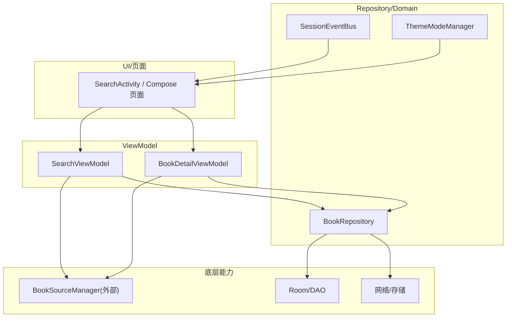
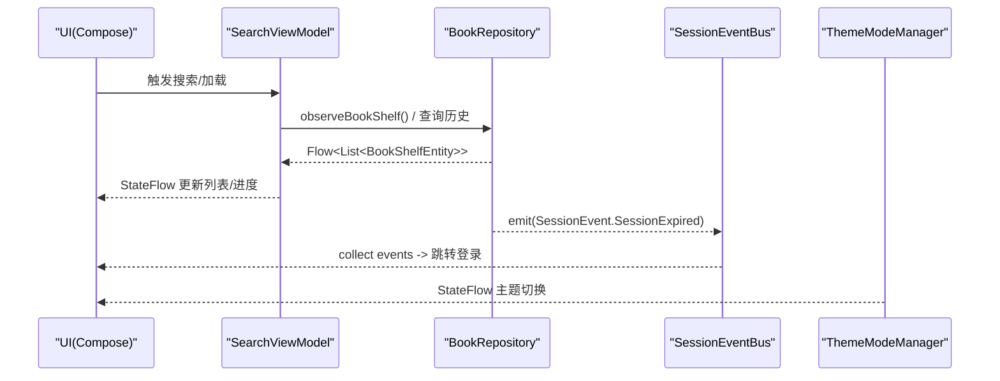
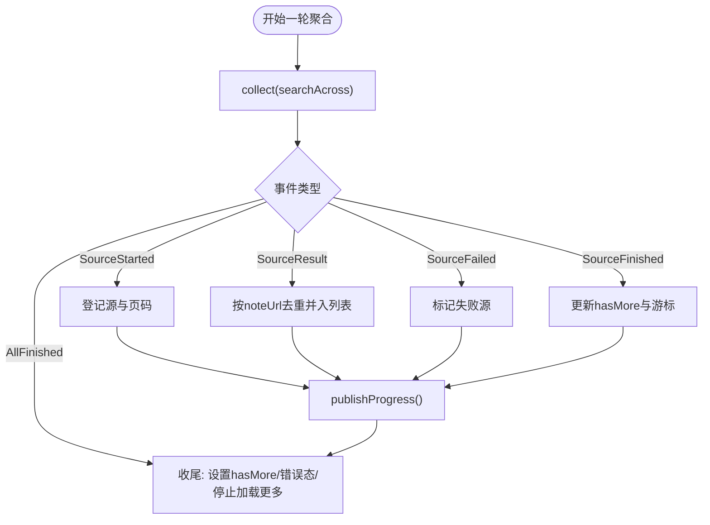
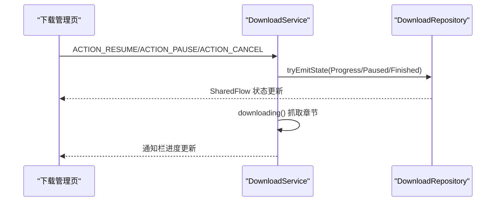
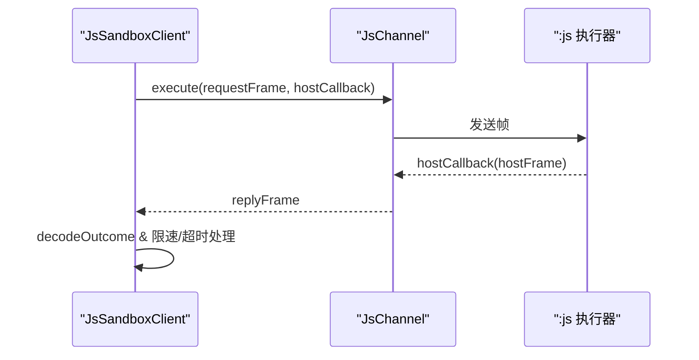
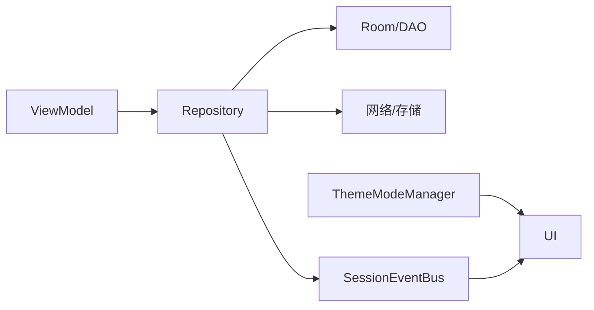

# 异步数据流与响应式编程

<cite>
**本文引用的文件**   
- [SearchViewModel.kt](file://module_find/src/main/java/com/ebook/find/mvvm/viewmodel/SearchViewModel.kt)
- [BookRepository.kt](file://lib_book_common/src/main/java/com/ebook/common/repository/BookRepository.kt)
- [DownloadService.kt](file://module_book/src/main/java/com/ebook/book/service/DownloadService.kt)
- [SessionEventBus.kt](file://lib_ebook_api/src/main/java/com/ebook/api/auth/SessionEventBus.kt)
- [ThemeModeManager.kt](file://lib_book_common/src/main/java/com/ebook/common/domain/ThemeModeManager.kt)
- [UserSessionManager.kt](file://lib_book_common/src/main/java/com/ebook/common/domain/UserSessionManager.kt)
- [JsSandboxClient.kt](file://lib_book_source/src/main/java/com/ebook/source/sandbox/JsSandboxClient.kt)
- [JsChannel.kt](file://lib_book_source/src/main/java/com/ebook/source/sandbox/JsChannel.kt)
</cite>

## 目录
1. [引言](#引言)
2. [项目结构](#项目结构)
3. [核心组件](#核心组件)
4. [架构总览](#架构总览)
5. [关键组件深度分析](#关键组件深度分析)
6. [依赖关系分析](#依赖关系分析)
7. [性能与背压](#性能与背压)
8. [故障排查指南](#故障排查指南)
9. [结论](#结论)

## 引言
本文件系统性梳理项目中基于 Kotlin Coroutines + Flow 的异步数据流与响应式编程实践，覆盖 StateFlow、SharedFlow、Channel 的使用场景；阐述如何将传统异步操作转换为响应式流，包括流的创建、转换与组合、多源聚合与合并策略（以 SearchViewModel 的聚合搜索为代表）；说明错误处理、生命周期管理、取消传播、背压控制与性能优化（缓冲大小、并发度等）。文中所有实现细节均对应仓库中的真实代码位置。

## 项目结构
本项目采用模块化架构：功能模块通过共享库 lib_book_common 暴露领域能力，网络与数据库分别位于 lib_ebook_api 与 lib_ebook_db，书源解析与沙箱执行在 lib_book_source。MVVM 层广泛使用 Flow 暴露状态与事件，ViewModel 通过协程作用域组织异步任务，Repository 封装数据访问并对外发布事件流。



图表来源
- [SearchViewModel.kt:1-500](file://module_find/src/main/java/com/ebook/find/mvvm/viewmodel/SearchViewModel.kt#L1-L500)
- [BookRepository.kt:1-1000](file://lib_book_common/src/main/java/com/ebook/common/repository/BookRepository.kt#L1-L1000)
- [SessionEventBus.kt:1-44](file://lib_ebook_api/src/main/java/com/ebook/api/auth/SessionEventBus.kt#L1-L44)
- [ThemeModeManager.kt:1-92](file://lib_book_common/src/main/java/com/ebook/common/domain/ThemeModeManager.kt#L1-L92)

章节来源
- [SearchViewModel.kt:1-500](file://module_find/src/main/java/com/ebook/find/mvvm/viewmodel/SearchViewModel.kt#L1-L500)
- [BookRepository.kt:1-1000](file://lib_book_common/src/main/java/com/ebook/common/repository/BookRepository.kt#L1-L1000)

## 核心组件
- StateFlow 用于“有状态”的数据展示：如搜索进度、主题模式、详情 UI 状态等，适合被 UI 收集并驱动重组。
- SharedFlow 用于“一次性或有限次”的事件广播：如书架事件、会话过期事件，适合跨组件事件分发。
- Channel/阻塞通道在进程间通信中承担帧传输：如 JS 沙箱客户端与执行器之间的请求/回调帧。
- 流组合与操作符：map、distinctBy、过滤、合并等用于数据清洗、去重与多源聚合。
- 背压与缓冲：通过 extraBufferCapacity 与 tryEmit 避免过载，结合取消传播确保资源释放。

章节来源
- [SearchViewModel.kt:89-101](file://module_find/src/main/java/com/ebook/find/mvvm/viewmodel/SearchViewModel.kt#L89-L101)
- [BookRepository.kt:76-78](file://lib_book_common/src/main/java/com/ebook/common/repository/BookRepository.kt#L76-L78)
- [SessionEventBus.kt:31-44](file://lib_ebook_api/src/main/java/com/ebook/api/auth/SessionEventBus.kt#L31-L44)
- [ThemeModeManager.kt:51-63](file://lib_book_common/src/main/java/com/ebook/common/domain/ThemeModeManager.kt#L51-L63)
- [JsSandboxClient.kt:65-99](file://lib_book_source/src/main/java/com/ebook/source/sandbox/JsSandboxClient.kt#L65-L99)

## 架构总览
下图展示了从 UI 到 ViewModel、Repository、底层能力的响应式数据流路径，以及事件总线与主题管理的横切点。



图表来源
- [SearchViewModel.kt:260-284](file://module_find/src/main/java/com/ebook/find/mvvm/viewmodel/SearchViewModel.kt#L260-L284)
- [BookRepository.kt:93-100](file://lib_book_common/src/main/java/com/ebook/common/repository/BookRepository.kt#L93-L100)
- [SessionEventBus.kt:31-44](file://lib_ebook_api/src/main/java/com/ebook/api/auth/SessionEventBus.kt#L31-L44)
- [ThemeModeManager.kt:51-63](file://lib_book_common/src/main/java/com/ebook/common/domain/ThemeModeManager.kt#L51-L63)

## 关键组件深度分析

### 聚合搜索与多源合并（SearchViewModel）
- 多源聚合：订阅 BookSourceManager.searchAcross 返回的事件流，逐条合并各书源结果，按 noteUrl 全局去重，维护每源的游标与结束集合，计算“是否还有更多”。
- 状态流：searchProgress 为 StateFlow，反映本轮参与源数与已结束源数；successEvent 为 SharedFlow，发射搜索历史结果。
- 取消与重试：新搜索时 cancel 上一轮 Job，避免旧结果污染新列表；loadMore 在首轮进行中直接忽略，防止并发改写簿记。
- 错误处理：单源失败计入 failed 集，仅当全部失败才上报；AllFinished 统一收尾，保证进度最终落定。



图表来源
- [SearchViewModel.kt:261-320](file://module_find/src/main/java/com/ebook/find/mvvm/viewmodel/SearchViewModel.kt#L261-L320)
- [SearchViewModel.kt:329-342](file://module_find/src/main/java/com/ebook/find/mvvm/viewmodel/SearchViewModel.kt#L329-L342)
- [SearchViewModel.kt:352-375](file://module_find/src/main/java/com/ebook/find/mvvm/viewmodel/SearchViewModel.kt#L352-L375)

章节来源
- [SearchViewModel.kt:69-101](file://module_find/src/main/java/com/ebook/find/mvvm/viewmodel/SearchViewModel.kt#L69-L101)
- [SearchViewModel.kt:130-167](file://module_find/src/main/java/com/ebook/find/mvvm/viewmodel/SearchViewModel.kt#L130-L167)
- [SearchViewModel.kt:212-226](file://module_find/src/main/java/com/ebook/find/mvvm/viewmodel/SearchViewModel.kt#L212-L226)
- [SearchViewModel.kt:261-320](file://module_find/src/main/java/com/ebook/find/mvvm/viewmodel/SearchViewModel.kt#L261-L320)
- [SearchViewModel.kt:329-375](file://module_find/src/main/java/com/ebook/find/mvvm/viewmodel/SearchViewModel.kt#L329-L375)

### 事件总线与共享状态（BookRepository, SessionEventBus）
- 书架事件：BookRepository.bookShelfEvents 为 SharedFlow，发射 Added/Removed/ProgressUpdated/ChaptersUpdated 事件，供搜索页与详情页同步内存快照。
- 会话事件：SessionEventBus.events 为 SharedFlow，集中处理会话过期，统一清会话+提示+跳转登录。
- 主题模式：ThemeModeManager.themeMode 为 StateFlow，持久化用户选择，装配到应用主题，使界面立即响应切换。

```mermaid
classDiagram
    class BookRepository {
        +bookShelfEvents: SharedFlow<BookShelfEvent>
        +observeBookShelf(): Flow<List<BookShelfEntity>>
    }
    class SessionEventBus {
        +events: SharedFlow<SessionEvent>
        +emit(event): void
    }
    class ThemeModeManager {
        +themeMode: StateFlow<ThemeMode>
        +setThemeMode(mode): void
    }
    BookRepository --> "发射" SessionEventBus : "会话事件"
    ThemeModeManager --> "UI订阅" : "StateFlow"
```

图表来源
- [BookRepository.kt:76-78](file://lib_book_common/src/main/java/com/ebook/common/repository/BookRepository.kt#L76-L78)
- [SessionEventBus.kt:31-44](file://lib_ebook_api/src/main/java/com/ebook/api/auth/SessionEventBus.kt#L31-L44)
- [ThemeModeManager.kt:51-63](file://lib_book_common/src/main/java/com/ebook/common/domain/ThemeModeManager.kt#L51-L63)

章节来源
- [BookRepository.kt:76-78](file://lib_book_common/src/main/java/com/ebook/common/repository/BookRepository.kt#L76-L78)
- [SessionEventBus.kt:31-44](file://lib_ebook_api/src/main/java/com/ebook/api/auth/SessionEventBus.kt#L31-L44)
- [ThemeModeManager.kt:51-63](file://lib_book_common/src/main/java/com/ebook/common/domain/ThemeModeManager.kt#L51-L63)

### 下载服务与前台任务流（DownloadService）
- 前台服务使用协程作用域与 Handler 推进下载任务，状态通过 DownloadRepository.tryEmitState 同步写入 replay 缓冲，确保 UI 即时收到 Finished/Paused/Progress。
- 失败重试与出队：重试耗尽后出队并计数，避免无限循环与常驻通知不消失。
- 取消传播：CancellationException 必须上抛，避免吞掉取消导致空转。



图表来源
- [DownloadService.kt:126-206](file://module_book/src/main/java/com/ebook/book/service/DownloadService.kt#L126-L206)
- [DownloadService.kt:274-378](file://module_book/src/main/java/com/ebook/book/service/DownloadService.kt#L274-L378)
- [DownloadService.kt:452-464](file://module_book/src/main/java/com/ebook/book/service/DownloadService.kt#L452-L464)

章节来源
- [DownloadService.kt:116-124](file://module_book/src/main/java/com/ebook/book/service/DownloadService.kt#L116-L124)
- [DownloadService.kt:126-206](file://module_book/src/main/java/com/ebook/book/service/DownloadService.kt#L126-L206)
- [DownloadService.kt:274-378](file://module_book/src/main/java/com/ebook/book/service/DownloadService.kt#L274-L378)
- [DownloadService.kt:452-464](file://module_book/src/main/java/com/ebook/book/service/DownloadService.kt#L452-L464)

### 进程间通信与背压（JsSandboxClient/JsChannel）
- JsSandboxClient.execute 串行化执行，限制请求体大小，超时控制，断连重放与主线程守卫。
- JsChannel 抽象通道接口，execute 同步执行一帧并通过 hostCallback 中继回调；异常由客户端兜底，避免跨进程未捕获异常。



图表来源
- [JsSandboxClient.kt:65-99](file://lib_book_source/src/main/java/com/ebook/source/sandbox/JsSandboxClient.kt#L65-L99)
- [JsChannel.kt:7-21](file://lib_book_source/src/main/java/com/ebook/source/sandbox/JsChannel.kt#L7-L21)

章节来源
- [JsSandboxClient.kt:65-99](file://lib_book_source/src/main/java/com/ebook/source/sandbox/JsSandboxClient.kt#L65-L99)
- [JsChannel.kt:7-21](file://lib_book_source/src/main/java/com/ebook/source/sandbox/JsChannel.kt#L7-L21)

## 依赖关系分析
- ViewModel 依赖 Repository 暴露的 Flow/SharedFlow，避免直接耦合数据源细节。
- Repository 对 Room DAO 和网络进行封装，并将变更转化为事件流，降低上层耦合。
- 事件总线与会话管理解耦网络层与 UI 层，提供统一处置入口。
- 主题管理器作为横切关注点，通过 StateFlow 驱动全局主题切换。



图表来源
- [BookRepository.kt:93-100](file://lib_book_common/src/main/java/com/ebook/common/repository/BookRepository.kt#L93-L100)
- [SessionEventBus.kt:31-44](file://lib_ebook_api/src/main/java/com/ebook/api/auth/SessionEventBus.kt#L31-L44)
- [ThemeModeManager.kt:51-63](file://lib_book_common/src/main/java/com/ebook/common/domain/ThemeModeManager.kt#L51-L63)

章节来源
- [BookRepository.kt:93-100](file://lib_book_common/src/main/java/com/ebook/common/repository/BookRepository.kt#L93-L100)
- [SessionEventBus.kt:31-44](file://lib_ebook_api/src/main/java/com/ebook/api/auth/SessionEventBus.kt#L31-L44)
- [ThemeModeManager.kt:51-63](file://lib_book_common/src/main/java/com/ebook/common/domain/ThemeModeManager.kt#L51-L63)

## 性能与背压
- 缓冲与背压：
  - SharedFlow(extraBufferCapacity=1)：会话事件允许丢弃重复，避免阻塞请求线程。
  - SharedFlow(extraBufferCapacity=64)：书架事件在高并发下保持足够缓冲，减少丢消息风险。
- 取消传播：
  - 搜索轮次在换词或加载更多前 cancel 上一轮 Job，避免旧结果污染。
  - 下载服务中 CancellationException 上抛，避免吞掉取消导致的空转。
- 并发控制：
  - 聚合搜索按源并发拉取，但 VM 侧通过簿记结构隔离轮次状态，避免交错写冲突。
  - JS 沙箱客户端串行化执行，保护单次请求体大小上限与超时控制。
- 内存与缓存：
  - 强制刷新时失效内容缓存，避免读取旧正文。
  - 列表项按 noteUrl 去重，避免重复渲染与崩溃。

章节来源
- [SessionEventBus.kt:31-44](file://lib_ebook_api/src/main/java/com/ebook/api/auth/SessionEventBus.kt#L31-L44)
- [BookRepository.kt:76-78](file://lib_book_common/src/main/java/com/ebook/common/repository/BookRepository.kt#L76-L78)
- [SearchViewModel.kt:212-226](file://module_find/src/main/java/com/ebook/find/mvvm/viewmodel/SearchViewModel.kt#L212-L226)
- [DownloadService.kt:343-363](file://module_book/src/main/java/com/ebook/book/service/DownloadService.kt#L343-L363)
- [JsSandboxClient.kt:75-80](file://lib_book_source/src/main/java/com/ebook/source/sandbox/JsSandboxClient.kt#L75-L80)

## 故障排查指南
- 搜索结果为空或永远加载：
  - 检查 searchAcross 事件流是否正常发出 AllFinished；确认 finishedSources 与 pageBySource 是否正确更新。
  - 参考：[SearchViewModel.kt:261-320](file://module_find/src/main/java/com/ebook/find/mvvm/viewmodel/SearchViewModel.kt#L261-L320)
- 会话过期未跳转：
  - 确认 SessionEventBus.emit 是否被调用；UI 是否 collect events 并处理 SessionExpired。
  - 参考：[SessionEventBus.kt:31-44](file://lib_ebook_api/src/main/java/com/ebook/api/auth/SessionEventBus.kt#L31-L44)
- 下载服务无法停止或常驻通知不消失：
  - 检查 onTimeout 与 finishDownload 是否调用 tryEmitState 并 stopService；确认 CancellationException 未被吞掉。
  - 参考：[DownloadService.kt:116-124](file://module_book/src/main/java/com/ebook/book/service/DownloadService.kt#L116-L124), [DownloadService.kt:646-666](file://module_book/src/main/java/com/ebook/book/service/DownloadService.kt#L646-L666)
- 主题切换无效：
  - 确认 setThemeMode 已持久化并更新 StateFlow；UI 是否 collectAsState 监听。
  - 参考：[ThemeModeManager.kt:60-63](file://lib_book_common/src/main/java/com/ebook/common/domain/ThemeModeManager.kt#L60-L63)

章节来源
- [SearchViewModel.kt:261-320](file://module_find/src/main/java/com/ebook/find/mvvm/viewmodel/SearchViewModel.kt#L261-L320)
- [SessionEventBus.kt:31-44](file://lib_ebook_api/src/main/java/com/ebook/api/auth/SessionEventBus.kt#L31-L44)
- [DownloadService.kt:116-124](file://module_book/src/main/java/com/ebook/book/service/DownloadService.kt#L116-L124)
- [DownloadService.kt:646-666](file://module_book/src/main/java/com/ebook/book/service/DownloadService.kt#L646-L666)
- [ThemeModeManager.kt:60-63](file://lib_book_common/src/main/java/com/ebook/common/domain/ThemeModeManager.kt#L60-L63)

## 结论
本项目以 Flow 为核心构建响应式数据流体系：StateFlow 承载可观察状态，SharedFlow 分发事件，结合协程作用域与取消传播实现健壮的生命周期管理。聚合搜索、下载服务、会话管理与主题切换等关键路径均采用流式组合与背压控制，确保在高并发与弱网环境下仍具备良好体验与稳定性。遵循统一的错误上报与日志规范，提升问题定位效率与维护性。