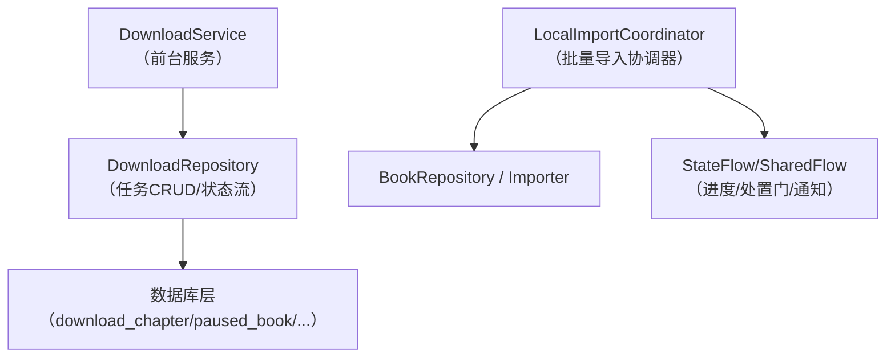
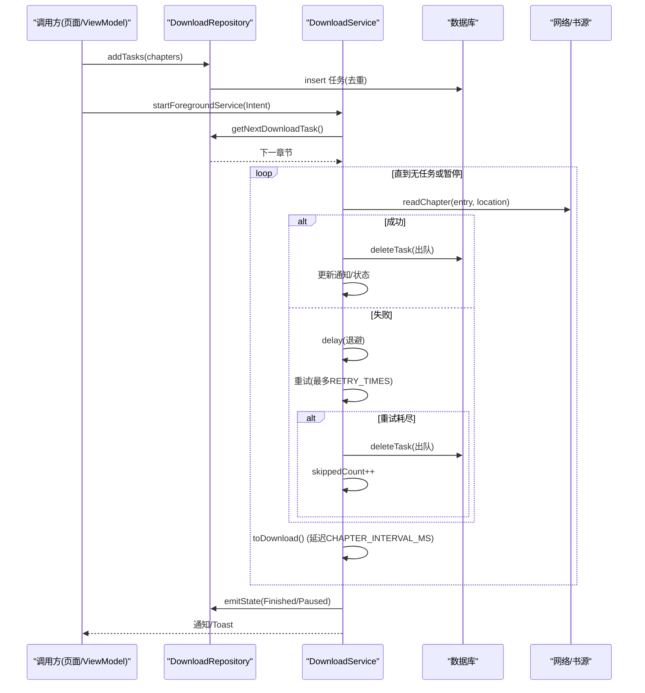
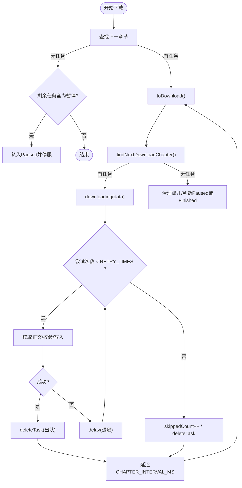
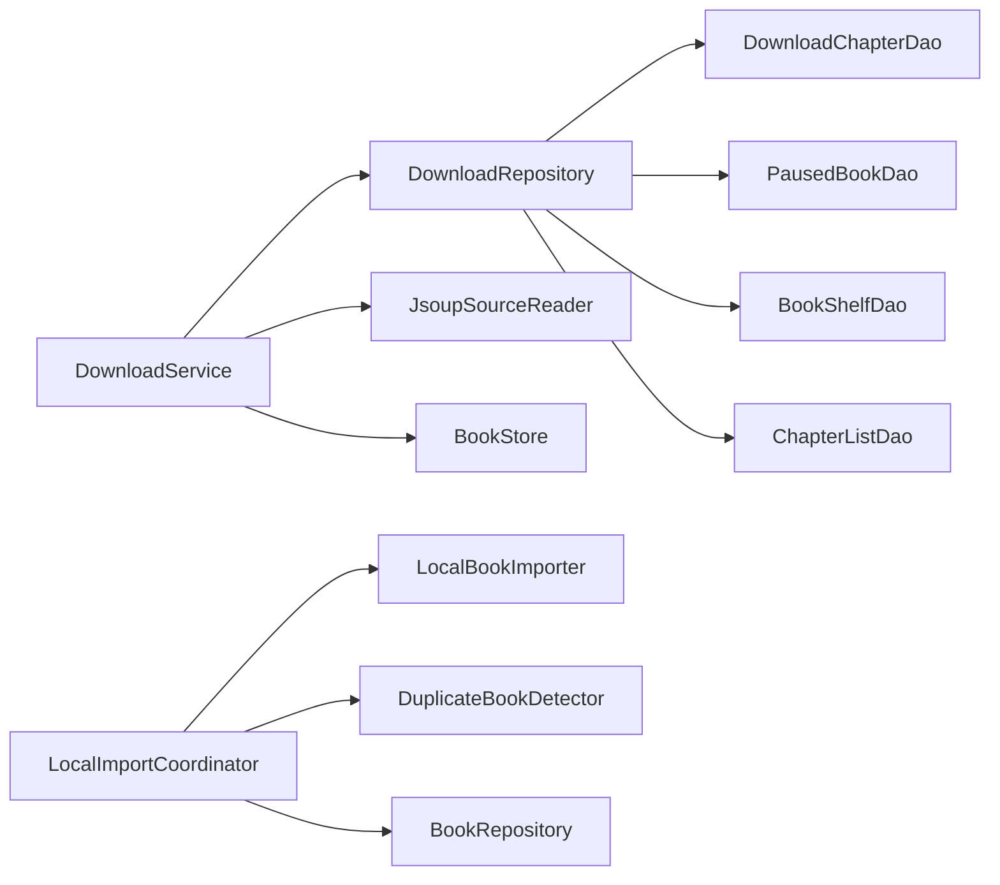

# 任务编排与调度模式

<cite>
**本文引用的文件**
- [DownloadService.kt](file://module_book/src/main/java/com/ebook/book/service/DownloadService.kt)
- [DownloadRepository.kt](file://module_book/src/main/java/com/ebook/book/repository/DownloadRepository.kt)
- [LocalImportCoordinator.kt](file://lib_book_common/src/main/java/com/ebook/common/importer/LocalImportCoordinator.kt)
- [0036-download-pause-per-book.md](file://docs/adr/0036-download-pause-per-book.md)
</cite>

## 目录
1. [简介](#简介)
2. [项目结构](#项目结构)
3. [核心组件](#核心组件)
4. [架构总览](#架构总览)
5. [详细组件分析](#详细组件分析)
6. [依赖关系分析](#依赖关系分析)
7. [性能考量](#性能考量)
8. [故障排查指南](#故障排查指南)
9. [结论](#结论)
10. [附录](#附录)

## 简介
本文件聚焦“任务编排与调度模式”，围绕两个关键场景展开：
- 下载服务的串行章节下载编排（downloading → toDownload → findNextDownloadChapter 循环）
- 导入协调器的批量任务编排（AtomicBoolean 并发控制、CompletableDeferred 暂停门机制、异常隔离）

并进一步阐述协程作用域选择原则（SupervisorJob + CoroutineScope）、取消传播行为，以及 DownloadService 的重试策略与退避等待。文末提供构建复杂任务依赖图、顺序/并行执行、共享状态同步的实操要点。

## 项目结构
与本主题直接相关的代码位于以下模块：
- module_book：下载服务与下载仓库（前台服务、队列管理、UI 状态下发）
- lib_book_common：本地书籍导入协调器（进程级批量导入、判重门控）
- docs/adr：按书暂停与下载中心设计决策（队列取篇策略、孤儿清理等）



图表来源
- [DownloadService.kt:40-206](file://module_book/src/main/java/com/ebook/book/service/DownloadService.kt#L40-L206)
- [DownloadRepository.kt:30-61](file://module_book/src/main/java/com/ebook/book/repository/DownloadRepository.kt#L30-L61)
- [LocalImportCoordinator.kt:85-136](file://lib_book_common/src/main/java/com/ebook/common/importer/LocalImportCoordinator.kt#L85-L136)

章节来源
- [DownloadService.kt:40-206](file://module_book/src/main/java/com/ebook/book/service/DownloadService.kt#L40-L206)
- [DownloadRepository.kt:30-61](file://module_book/src/main/java/com/ebook/book/repository/DownloadRepository.kt#L30-L61)
- [LocalImportCoordinator.kt:85-136](file://lib_book_common/src/main/java/com/ebook/common/importer/LocalImportCoordinator.kt#L85-L136)

## 核心组件
- 下载服务（DownloadService）
  - 职责：前台服务承载逐章抓取；维护 isStartDownload、isDownloading、skippedCount 三态；实现 RETRY_TIMES 重试与退避；通过 Intent 控制生命周期。
  - 关键点：findNextDownloadChapter → downloading → toDownload 的串行循环；每章间隔 CHAPTER_INTERVAL_MS；失败重试耗尽后出队并计数跳过。
- 下载仓库（DownloadRepository）
  - 职责：下载任务 CRUD；按书暂停策略（paused_book）；获取下一个任务时跳过暂停书；统一 startDownload（先入库再拉服务）。
  - 关键点：replay=1 的 SharedFlow 保证晚开 UI 对齐当前进度；tryEmitState 用于收尾路径避免被取消吞掉。
- 导入协调器（LocalImportCoordinator）
  - 职责：进程级批量导入；AtomicBoolean 防并发重复批次；CompletableDeferred 作为判重门暂停批次；异常隔离（单文件异常不中断整批）；结果与进度通过 StateFlow/SharedFlow 广播。
  - 关键点：runBatch 顺序推进；awaitDisposition 挂起直至 resolve*；finally 中清理解析中占位行。

章节来源
- [DownloadService.kt:62-88](file://module_book/src/main/java/com/ebook/book/service/DownloadService.kt#L62-L88)
- [DownloadRepository.kt:121-173](file://module_book/src/main/java/com/ebook/book/repository/DownloadRepository.kt#L121-L173)
- [LocalImportCoordinator.kt:100-177](file://lib_book_common/src/main/java/com/ebook/common/importer/LocalImportCoordinator.kt#L100-L177)

## 架构总览
下载链路以“任务持久化 + 前台服务消费”的模式解耦发起方与执行方，确保启动被拒、配额用尽、进程重启等场景下任务不丢失。导入链路以“进程级协调器 + 协程门控”的模式保证并发安全与用户交互可恢复。



图表来源
- [DownloadService.kt:126-206](file://module_book/src/main/java/com/ebook/book/service/DownloadService.kt#L126-L206)
- [DownloadService.kt:212-247](file://module_book/src/main/java/com/ebook/book/service/DownloadService.kt#L212-L247)
- [DownloadService.kt:274-378](file://module_book/src/main/java/com/ebook/book/service/DownloadService.kt#L274-L378)
- [DownloadRepository.kt:256-273](file://module_book/src/main/java/com/ebook/book/repository/DownloadRepository.kt#L256-L273)

## 详细组件分析

### 下载服务：串行章节下载编排与状态机
- 编排主循环
  - onStartCommand 在无 isStartDownload/isDownloading 时查找下一章节，若存在则进入 toDownload。
  - toDownload 设置 isDownloading=true，再次 findNextDownloadChapter，若存在则调用 downloading(data)，否则根据剩余任务情况进入 Paused 或 Finished，并清理孤儿任务。
  - downloading 内部完成单章抓取、缓存失效、出队、重试逻辑，最后通过 Handler.postDelayed 触发下一次 toDownload，形成“串行 + 固定间隔”的节拍。
- 状态机字段
  - isStartDownload：是否允许继续推进（全局暂停/取消时置 false）。
  - isDownloading：当前是否在推进一章（防止重复拉起同一章）。
  - skippedCount：记录本批因重试耗尽而跳过的章节数，用于收尾文案与提示。
- 生命周期与超时处理
  - onTimeout：在 dataSync 配额用尽时快速收尾，置空标志位、清回调、发 Paused、发送提醒通知并 stopSelf。
  - cancelDownload：清空队列、置终态、撤销常驻通知、stopService。
- 重试与退避
  - RETRY_TIMES=3，每次失败后 delay(RETRY_DELAY_MS) 再重试；耗尽后出队并计入 skippedCount。
  - 强制刷新会删除旧章文件并失效内存缓存，确保重抓生效。



图表来源
- [DownloadService.kt:126-206](file://module_book/src/main/java/com/ebook/book/service/DownloadService.kt#L126-L206)
- [DownloadService.kt:212-247](file://module_book/src/main/java/com/ebook/book/service/DownloadService.kt#L212-L247)
- [DownloadService.kt:274-378](file://module_book/src/main/java/com/ebook/book/service/DownloadService.kt#L274-L378)
- [DownloadService.kt:668-677](file://module_book/src/main/java/com/ebook/book/service/DownloadService.kt#L668-L677)

章节来源
- [DownloadService.kt:62-88](file://module_book/src/main/java/com/ebook/book/service/DownloadService.kt#L62-L88)
- [DownloadService.kt:115-206](file://module_book/src/main/java/com/ebook/book/service/DownloadService.kt#L115-L206)
- [DownloadService.kt:212-247](file://module_book/src/main/java/com/ebook/book/service/DownloadService.kt#L212-L247)
- [DownloadService.kt:274-378](file://module_book/src/main/java/com/ebook/book/service/DownloadService.kt#L274-L378)
- [DownloadService.kt:668-677](file://module_book/src/main/java/com/ebook/book/service/DownloadService.kt#L668-L677)
- [0036-download-pause-per-book.md:1-18](file://docs/adr/0036-download-pause-per-book.md#L1-L18)

### 导入协调器：批量任务编排与暂停门
- 并发控制
  - running: AtomicBoolean 保证同一时刻仅一批导入在执行；新提交直接忽略并留日志。
- 暂停门机制
  - duplicateGate: AtomicReference<CompletableDeferred<DuplicateResolution>?>，在判重命中时创建并置入，阻塞导入循环；UI 通过 resolve* 取出并完成，门关闭后继续。
  - duplicateState: StateFlow<ImportDuplicateState> 暴露给 UI 弹出处置框。
- 批量推进与异常隔离
  - runBatch 顺序遍历 files，每个文件 importWithDuplicateCheck 独立 try/catch；单个失败不影响其他文件，最终统计 successCount/failCount 并通过 batchFinished 发出。
  - progress: StateFlow<ImportBatchProgress> 实时上报 done/total/running。
- 智能合并与覆盖
  - applyMerge：对首个本地命中条目进行尾部补章；不同结果通过 notices 事件上送。
  - applyOverwrite：先吸收旧条目的 group 键到新条目，再删除旧条目；过滤与新条目同 noteUrl 的情况避免自删。

```mermaid
sequenceDiagram
    participant UI as "导入页"
    participant Coord as "LocalImportCoordinator"
    participant Imp as "LocalBookImporter"
    participant Det as "DuplicateBookDetector"
    participant Repo as "BookRepository"

    UI->>Coord: submit(files)
    Coord->>Coord: running.compareAndSet(false,true)
    Coord->>Coord: runBatch(files)
    loop 逐个文件
        Coord->>Imp: parseMetadata(file)
        Coord->>Det: findMatchesFor(meta)
        alt 命中重复
            Coord->>Coord: awaitDisposition() (阻塞)
            UI->>Coord: resolve*(决定)
            Coord->>Coord: gate.complete(决定)
        end
        try
            Coord->>Imp: import(file)
            opt 需要合并/覆盖
                Coord->>Repo: mergeTailChapters / absorbGroupKeys
            end
        catch Exception
            Coord->>Coord: failCount++
        end
        Coord->>Coord: progress.done++
    end
    Coord-->>UI: batchFinished(success,fail)
    Coord->>Coord: running=false
```

图表来源
- [LocalImportCoordinator.kt:100-177](file://lib_book_common/src/main/java/com/ebook/common/importer/LocalImportCoordinator.kt#L100-L177)
- [LocalImportCoordinator.kt:179-212](file://lib_book_common/src/main/java/com/ebook/common/importer/LocalImportCoordinator.kt#L179-L212)
- [LocalImportCoordinator.kt:220-234](file://lib_book_common/src/main/java/com/ebook/common/importer/LocalImportCoordinator.kt#L220-L234)
- [LocalImportCoordinator.kt:236-303](file://lib_book_common/src/main/java/com/ebook/common/importer/LocalImportCoordinator.kt#L236-L303)

章节来源
- [LocalImportCoordinator.kt:100-177](file://lib_book_common/src/main/java/com/ebook/common/importer/LocalImportCoordinator.kt#L100-L177)
- [LocalImportCoordinator.kt:179-234](file://lib_book_common/src/main/java/com/ebook/common/importer/LocalImportCoordinator.kt#L179-L234)
- [LocalImportCoordinator.kt:236-303](file://lib_book_common/src/main/java/com/ebook/common/importer/LocalImportCoordinator.kt#L236-L303)

### 协程作用域选择原则：SupervisorJob + CoroutineScope
- 使用场景
  - DownloadService.serviceScope：Main 线程的前台服务内，子任务失败不应导致服务销毁； SupervisorJob 确保子协程相互独立。
  - LocalImportCoordinator.scope：IO 线程的进程级协调器，批量导入需独立运行且不受 UI 生命周期影响。
- 取消传播行为
  - SupervisorJob：父取消会取消子任务，但子任务之间失败/取消不会级联到兄弟任务；适合“多任务互不影响”的编排。
  - 普通 Job：默认传播失败（非取消），任一子任务抛未捕获异常会导致父 Job 取消，从而终止整个批次。
- 实践建议
  - 前台服务、后台长任务使用 SupervisorJob + 明确的作用域，避免单点失败拖垮整体。
  - 对于必须“一处失败立即停止全部”的场景，可使用普通 Job 或显式组合 Job 并配合 coroutineScope。

章节来源
- [DownloadService.kt:87-94](file://module_book/src/main/java/com/ebook/book/service/DownloadService.kt#L87-L94)
- [LocalImportCoordinator.kt:106-111](file://lib_book_common/src/main/java/com/ebook/common/importer/LocalImportCoordinator.kt#L106-L111)

### 复杂任务依赖图、顺序与并行、共享状态同步示例
- 依赖图与顺序执行
  - 串行：下载服务中的 downloading → toDownload 即顺序依赖，通过 Handler.postDelayed 串联。
  - 条件分支：toDownload 中“无下一章”分支依据 paused_book 与孤儿任务清理决定 Paused 或 Finished。
- 并行执行
  - 导入批次的文件解析与导入各自独立，可在 Coordinator 中改为并行（mapIndexed/async）并用 supervisorScope 聚合结果；注意写库与 UI 更新的幂等性。
- 共享状态同步
  - DownloadRepository.downloadState：replay=1 的 SharedFlow，供晚开 UI 对齐当前进度；收尾路径使用 tryEmitState 避免被取消吞掉。
  - LocalImportCoordinator.duplicateState/progress/notices/batchFinished：分别承担处置门、进度、语义通知、收尾结果。
- 具体参考位置
  - 下载服务串行节拍与状态流转：[DownloadService.kt:212-247](file://module_book/src/main/java/com/ebook/book/service/DownloadService.kt#L212-L247)、[DownloadService.kt:274-378](file://module_book/src/main/java/com/ebook/book/service/DownloadService.kt#L274-L378)
  - 导入协调器流程与门控：[LocalImportCoordinator.kt:144-177](file://lib_book_common/src/main/java/com/ebook/common/importer/LocalImportCoordinator.kt#L144-L177)、[LocalImportCoordinator.kt:220-234](file://lib_book_common/src/main/java/com/ebook/common/importer/LocalImportCoordinator.kt#L220-L234)

## 依赖关系分析
- DownloadService 依赖 DownloadRepository 完成取篇、出队、状态下发；依赖 JsoupSourceReader/BookStore 完成正文抓取与存储；依赖 BookRepository 的 ChapterContentCache 做缓存失效。
- DownloadRepository 依赖多个 DAO 与 BookStore，封装取篇策略（跳过暂停书）、孤儿清理、覆盖率计算等。
- LocalImportCoordinator 依赖 LocalBookImporter、DuplicateBookDetector、BookRepository，负责编排导入流程与用户交互门控。



图表来源
- [DownloadService.kt:57-65](file://module_book/src/main/java/com/ebook/book/service/DownloadService.kt#L57-L65)
- [DownloadRepository.kt:45-52](file://module_book/src/main/java/com/ebook/book/repository/DownloadRepository.kt#L45-L52)
- [LocalImportCoordinator.kt:100-105](file://lib_book_common/src/main/java/com/ebook/common/importer/LocalImportCoordinator.kt#L100-L105)

章节来源
- [DownloadService.kt:57-65](file://module_book/src/main/java/com/ebook/book/service/DownloadService.kt#L57-L65)
- [DownloadRepository.kt:45-52](file://module_book/src/main/java/com/ebook/book/repository/DownloadRepository.kt#L45-L52)
- [LocalImportCoordinator.kt:100-105](file://lib_book_common/src/main/java/com/ebook/common/importer/LocalImportCoordinator.kt#L100-L105)

## 性能考量
- 下载节律
  - 单章间隔 CHAPTER_INTERVAL_MS 降低对书源站点的请求压力，避免瞬时高峰。
  - 重试前退避 RETRY_DELAY_MS 避开瞬时限流/抖动。
- 队列与缓存
  - 任务表只存未完成项；取篇时跳过暂停书，减少无效扫描。
  - 强制刷新时删除旧章文件并失效内存缓存，避免读取旧数据。
- 前台服务配额
  - dataSync 类型受 24h 累计 6h 限制；onTimeout 快速收尾，避免长时间空转。

章节来源
- [DownloadService.kt:668-677](file://module_book/src/main/java/com/ebook/book/service/DownloadService.kt#L668-L677)
- [DownloadService.kt:115-124](file://module_book/src/main/java/com/ebook/book/service/DownloadService.kt#L115-L124)
- [DownloadRepository.kt:73-82](file://module_book/src/main/java/com/ebook/book/repository/DownloadRepository.kt#L73-L82)

## 故障排查指南
- 下载卡住或通知不消失
  - 检查 isStartDownload/isDownloading 是否正确复位；查看是否有任务处于暂停书导致取篇为空；确认 onTimeout 是否触达并走 Paused 分支。
  - 关注 tryEmitState 的使用位置，确保终态能同步落 replay，避免被取消吞掉。
- 导入批次卡死
  - 检查 duplicateGate 是否被 resolve* 正确完成；留意 finally 中 duplicateState 复位与 parsingBooks 清理。
  - 单文件异常不影响整批，确认 batchFinished 的 success/fail 计数是否符合预期。
- 任务残留或孤儿任务
  - 使用 deleteTasksOutsideShelf 清理不在书架的任务；按书取消时需同时清除暂停标记。

章节来源
- [DownloadService.kt:115-206](file://module_book/src/main/java/com/ebook/book/service/DownloadService.kt#L115-L206)
- [DownloadService.kt:397-420](file://module_book/src/main/java/com/ebook/book/service/DownloadService.kt#L397-L420)
- [DownloadRepository.kt:187-205](file://module_book/src/main/java/com/ebook/book/repository/DownloadRepository.kt#L187-L205)
- [LocalImportCoordinator.kt:220-234](file://lib_book_common/src/main/java/com/ebook/common/importer/LocalImportCoordinator.kt#L220-L234)
- [LocalImportCoordinator.kt:144-177](file://lib_book_common/src/main/java/com/ebook/common/importer/LocalImportCoordinator.kt#L144-L177)

## 结论
本项目在下载与导入两条关键路径上，采用了稳健的任务编排与调度模式：
- 下载服务通过“持久化队列 + 前台服务串行消费 + 重试退避 + 暂停门控”，实现稳定、可控、可恢复的离线下载。
- 导入协调器通过“进程级作用域 + 原子并发控制 + CompletableDeferred 暂停门 + 异常隔离”，实现批量导入的可观测性与容错性。
- 协程作用域选择 SupervisorJob 保障任务间独立性，避免单点失败扩散；结合 Flow/StateFlow 提供响应式状态同步。

这些模式共同支撑了高可靠、可观察、易维护的任务编排体系。

## 附录
- 重试与退避参数
  - RETRY_TIMES=3，RETRY_DELAY_MS=1000ms，CHAPTER_INTERVAL_MS=800ms。
- 关键入口与常量
  - DownloadService.start/buildActionIntent/buildStartIntent
  - DownloadRepository.startDownload/getNextDownloadTask/deleteTasksOutsideShelf
  - LocalImportCoordinator.submit/resolveKeepBoth/resolveMerge/resolveOverwrite/resolveCancel

章节来源
- [DownloadService.kt:668-749](file://module_book/src/main/java/com/ebook/book/service/DownloadService.kt#L668-L749)
- [DownloadRepository.kt:256-289](file://module_book/src/main/java/com/ebook/book/repository/DownloadRepository.kt#L256-L289)
- [LocalImportCoordinator.kt:144-177](file://lib_book_common/src/main/java/com/ebook/common/importer/LocalImportCoordinator.kt#L144-L177)
- [LocalImportCoordinator.kt:283-303](file://lib_book_common/src/main/java/com/ebook/common/importer/LocalImportCoordinator.kt#L283-L303)