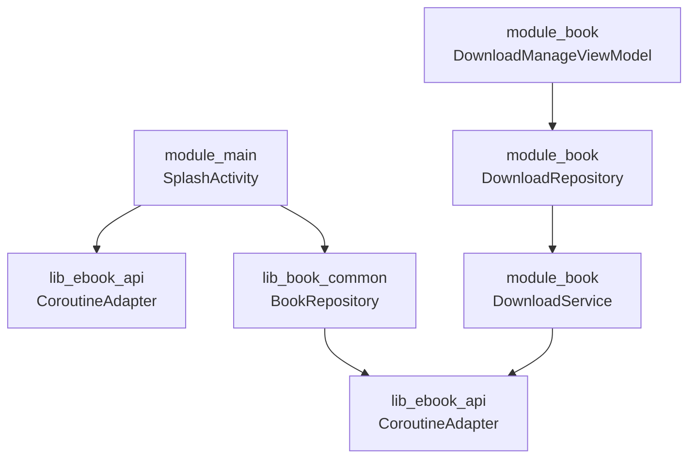
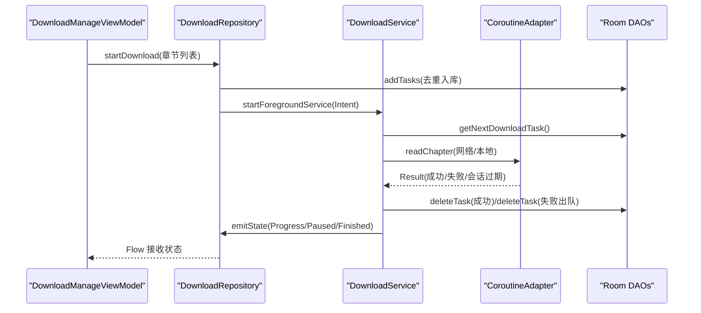
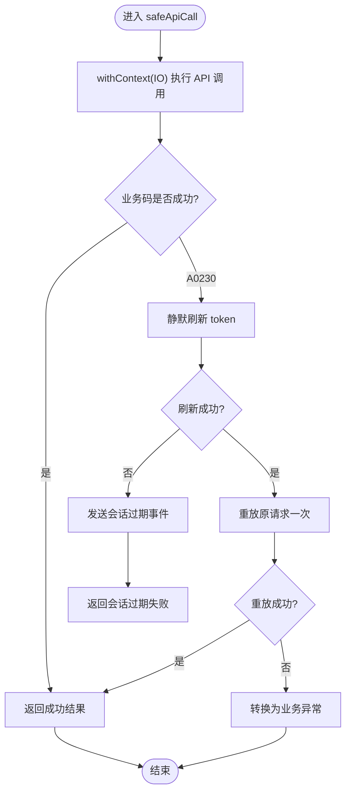
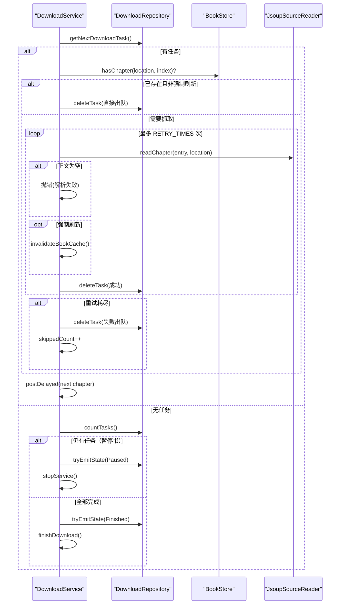
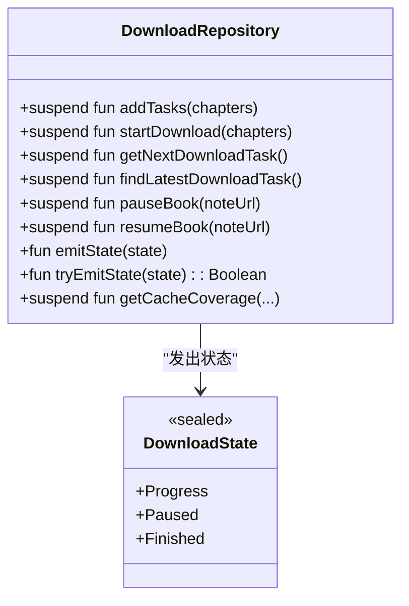
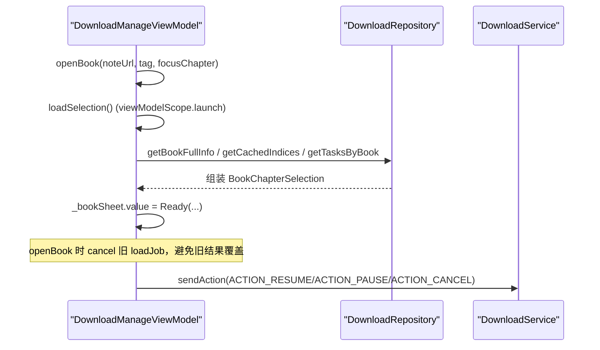
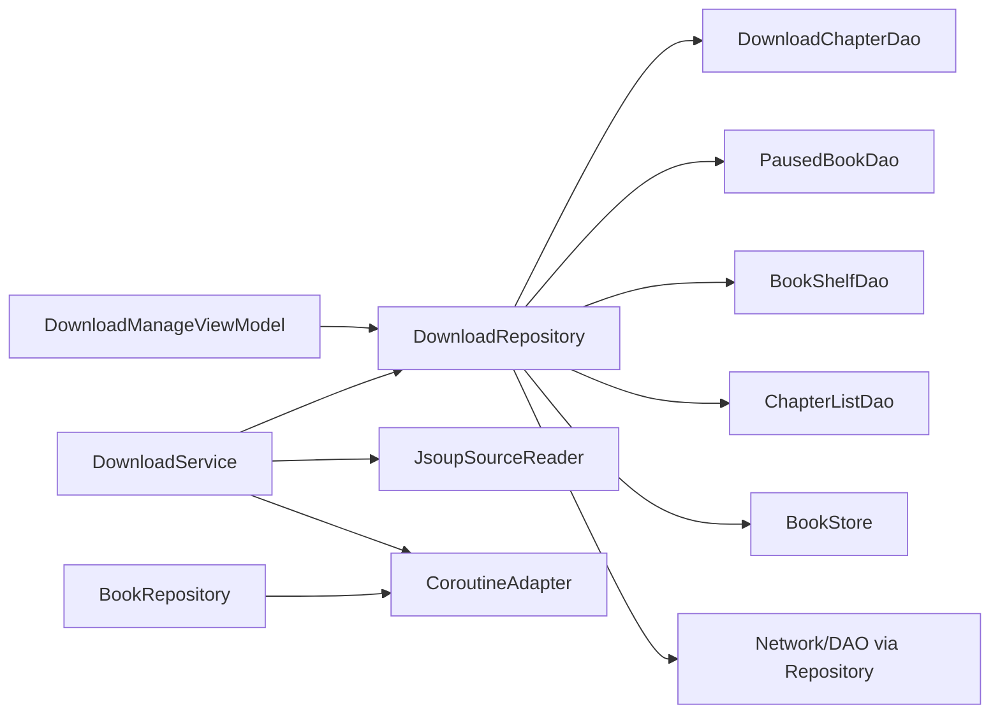

# 协程并发控制与任务编排

<cite>
**本文引用的文件**
- [CoroutineAdapter.kt](file://lib_ebook_api/src/main/java/com/ebook/api/utils/CoroutineAdapter.kt)
- [DownloadService.kt](file://module_book/src/main/java/com/ebook/book/service/DownloadService.kt)
- [DownloadRepository.kt](file://module_book/src/main/java/com/ebook/book/repository/DownloadRepository.kt)
- [DownloadManageViewModel.kt](file://module_book/src/main/java/com/ebook/book/mvvm/viewmodel/DownloadManageViewModel.kt)
- [BookRepository.kt](file://lib_book_common/src/main/java/com/ebook/common/repository/BookRepository.kt)
- [SplashActivity.kt](file://module_main/src/main/java/com/ebook/main/SplashActivity.kt)
</cite>

## 目录
1. [简介](#简介)
2. [项目结构](#项目结构)
3. [核心组件](#核心组件)
4. [架构总览](#架构总览)
5. [详细组件分析](#详细组件分析)
6. [依赖关系分析](#依赖关系分析)
7. [性能考量](#性能考量)
8. [故障排查指南](#故障排查指南)
9. [结论](#结论)

## 简介
本文围绕本仓库中的协程并发控制与任务编排，系统梳理以下主题：
- 并发控制策略：在何处使用 async/await、coroutineScope、supervisorScope，以及选择原则与场景。
- 任务编排模式：串行执行、并行执行、条件执行与循环执行的落地方式。
- 并发安全机制：共享状态保护、原子操作、线程同步策略。
- 任务依赖管理：任务图构建、依赖解析与执行顺序控制。
- 典型复杂场景：下载任务编排、数据同步、批量处理等。
- 并发性能优化：并发度调优、资源池使用与内存管理。
- 并发调试与竞态修复：常见问题定位与修复思路。

## 项目结构
本项目采用多模块 MVVM + Repository 分层：
- lib_ebook_api：网络层与通用请求适配器（协程封装、会话刷新）。
- module_book：阅读与下载相关功能（前台服务、下载仓库、下载管理页 ViewModel）。
- lib_book_common：领域共享仓库（书架、章节读取、事件总线等）。
- module_main：应用启动流程（启动页加载与会话准备）。

图表来源
- [SplashActivity.kt:90-110](file://module_main/src/main/java/com/ebook/main/SplashActivity.kt#L90-L110)
- [CoroutineAdapter.kt:17-150](file://lib_ebook_api/src/main/java/com/ebook/api/utils/CoroutineAdapter.kt#L17-L150)
- [DownloadManageViewModel.kt:120-230](file://module_book/src/main/java/com/ebook/book/mvvm/viewmodel/DownloadManageViewModel.kt#L120-L230)
- [DownloadRepository.kt:45-290](file://module_book/src/main/java/com/ebook/book/repository/DownloadRepository.kt#L45-L290)
- [DownloadService.kt:56-750](file://module_book/src/main/java/com/ebook/book/service/DownloadService.kt#L56-L750)

章节来源
- [SplashActivity.kt:90-110](file://module_main/src/main/java/com/ebook/main/SplashActivity.kt#L90-L110)
- [CoroutineAdapter.kt:17-150](file://lib_ebook_api/src/main/java/com/ebook/api/utils/CoroutineAdapter.kt#L17-L150)
- [DownloadManageViewModel.kt:120-230](file://module_book/src/main/java/com/ebook/book/mvvm/viewmodel/DownloadManageViewModel.kt#L120-L230)
- [DownloadRepository.kt:45-290](file://module_book/src/main/java/com/ebook/book/repository/DownloadRepository.kt#L45-L290)
- [DownloadService.kt:56-750](file://module_book/src/main/java/com/ebook/book/service/DownloadService.kt#L56-L750)

## 核心组件
- 通用网络请求适配器（CoroutineAdapter）：统一 IO 调度、业务码翻译、A0230 静默刷新与重放、取消异常放行。
- 下载前台服务（DownloadService）：逐章抓取、重试与退避、按书暂停、通知与配额超时处理、队列出队与收尾。
- 下载仓库（DownloadRepository）：任务入队、取篇策略（跳过暂停书）、状态流下发、覆盖率统计。
- 下载管理 ViewModel（DownloadManageViewModel）：页面状态聚合、与服务交互、并发装载与取消。
- 书架仓库（BookRepository）：书架 CRUD、章节读取路由、事件发布、换源与内容对账。
- 启动页（SplashActivity）：异步会话准备与启动流程编排。

章节来源
- [CoroutineAdapter.kt:17-150](file://lib_ebook_api/src/main/java/com/ebook/api/utils/CoroutineAdapter.kt#L17-L150)
- [DownloadService.kt:56-750](file://module_book/src/main/java/com/ebook/book/service/DownloadService.kt#L56-L750)
- [DownloadRepository.kt:45-290](file://module_book/src/main/java/com/ebook/book/repository/DownloadRepository.kt#L45-L290)
- [DownloadManageViewModel.kt:120-430](file://module_book/src/main/java/com/ebook/book/mvvm/viewmodel/DownloadManageViewModel.kt#L120-L430)
- [BookRepository.kt:38-120](file://lib_book_common/src/main/java/com/ebook/common/repository/BookRepository.kt#L38-L120)
- [SplashActivity.kt:90-110](file://module_main/src/main/java/com/ebook/main/SplashActivity.kt#L90-L110)

## 架构总览
整体以“仓库 + 前台服务”的模式组织长时任务：
- 网络侧通过 CoroutineAdapter 将 suspend 函数包装为 Result，统一错误与 token 过期处理。
- 下载任务以 Intent 信号触发前台服务，服务从数据库取篇、逐章抓取并写入文件，失败重试并出队。
- UI 通过 SharedFlow/StateFlow 订阅下载状态，ViewModel 负责聚合数据与响应式更新。

图表来源
- [DownloadRepository.kt:256-290](file://module_book/src/main/java/com/ebook/book/repository/DownloadRepository.kt#L256-L290)
- [DownloadService.kt:252-378](file://module_book/src/main/java/com/ebook/book/service/DownloadService.kt#L252-L378)
- [CoroutineAdapter.kt:41-120](file://lib_ebook_api/src/main/java/com/ebook/api/utils/CoroutineAdapter.kt#L41-L120)

## 详细组件分析

### 通用网络请求适配器（CoroutineAdapter）
- 职责：将网络调用置于 IO 线程；将业务码映射为 Result；遇到 A0230 静默刷新一次并重放；捕获并翻译异常；保持取消异常上抛。
- 并发与一致性：token 刷新由 TokenRefresher 保证并发单飞；会话过期事件全局分发；重放仅一次避免风暴。
- 错误边界：刷新失败发 SessionExpired 事件；上层据此清会话跳转登录；调用方收到特定异常类型只记日志不重复提示。

图表来源
- [CoroutineAdapter.kt:41-120](file://lib_ebook_api/src/main/java/com/ebook/api/utils/CoroutineAdapter.kt#L41-L120)

章节来源
- [CoroutineAdapter.kt:17-150](file://lib_ebook_api/src/main/java/com/ebook/api/utils/CoroutineAdapter.kt#L17-L150)

### 下载前台服务（DownloadService）
- 并发控制：
  - 使用 SupervisorJob + Main 调度的服务级作用域，确保单个章节下载失败不会中断整个服务。
  - 每章下载在独立协程中运行，通过 Handler.postDelayed 实现章节间延迟与串行推进。
- 任务编排：
  - 串行执行：while 循环 + 延迟，按书顺序逐章抓取。
  - 条件执行：命中缓存且非强制刷新则直接出队；强制刷新先删旧章再抓。
  - 重试与退避：固定次数重试，每次重试前 delay 避开抖动/限流。
  - 暂停语义：isStartDownload=false 中断重试但不立即出队；恢复后从头重试。
- 并发安全：
  - 关键标志位 isStartDownload/isDownloading/skippedCount 在服务主线程访问（Main 调度），配合 Handler 与 serviceScope 控制生命周期。
  - 取消异常放行，避免吞掉取消导致死循环。
- 前端交互：
  - 常驻通知与完成通知分离；超时回调 onTimeout 快速收尾，保留任务以便后续续跑。

图表来源
- [DownloadService.kt:212-378](file://module_book/src/main/java/com/ebook/book/service/DownloadService.kt#L212-L378)
- [DownloadService.kt:380-442](file://module_book/src/main/java/com/ebook/book/service/DownloadService.kt#L380-L442)
- [DownloadService.kt:646-666](file://module_book/src/main/java/com/ebook/book/service/DownloadService.kt#L646-L666)

章节来源
- [DownloadService.kt:56-750](file://module_book/src/main/java/com/ebook/book/service/DownloadService.kt#L56-L750)

### 下载仓库（DownloadRepository）
- 任务入队：addTasks 按 URL 去重，幂等插入；startDownload 先入库再拉起服务，防止启动被拒丢任务。
- 取篇策略：getNextDownloadTask 遍历书架，跳过本地书与暂停书；findLatestDownloadTask 用于弹窗判断是否有待下载。
- 状态通道：downloadState 使用 replay=1 的 SharedFlow，晚开页面也能对齐当前进度；tryEmitState 用于收尾路径快速落回放缓冲。
- 覆盖率统计：基于 BookStore.hasChapter 计算全书缓存覆盖率，作为二级视图进度口径。

图表来源
- [DownloadRepository.kt:45-290](file://module_book/src/main/java/com/ebook/book/repository/DownloadRepository.kt#L45-L290)

章节来源
- [DownloadRepository.kt:45-290](file://module_book/src/main/java/com/ebook/book/repository/DownloadRepository.kt#L45-L290)

### 下载管理 ViewModel（DownloadManageViewModel）
- 状态聚合：groups 按书分组，叠加剩余数与覆盖率；activeChapter 标记正在下载的章节。
- 并发装载：loadSelection 使用 viewModelScope.launch，openBook/backToBooks 时取消旧 Job，避免回写竞争。
- 与 Service 交互：sendAction 统一发送暂停/继续/取消；resumeIfPending 自动续跑。
- 并发安全：isDownloading 仅在 Progress 时断言活跃；取消异常上抛，避免将取消误判为失败。

图表来源
- [DownloadManageViewModel.kt:290-362](file://module_book/src/main/java/com/ebook/book/mvvm/viewmodel/DownloadManageViewModel.kt#L290-L362)
- [DownloadManageViewModel.kt:224-242](file://module_book/src/main/java/com/ebook/book/mvvm/viewmodel/DownloadManageViewModel.kt#L224-L242)

章节来源
- [DownloadManageViewModel.kt:120-430](file://module_book/src/main/java/com/ebook/book/mvvm/viewmodel/DownloadManageViewModel.kt#L120-L430)

### 书架仓库（BookRepository）
- 事件总线：SharedFlow 发布书架事件，替代历史 RxBus。
- 章节读取：统一经 ChapterReader 路由，本地/网络一致化；规范化在 loadChapter 收口。
- 换源与对账：switchSource 按目标条目 tag 拉详情与目录；reconcileContentStore 启动时对账存储。

章节来源
- [BookRepository.kt:38-120](file://lib_book_common/src/main/java/com/ebook/common/repository/BookRepository.kt#L38-L120)

### 启动页（SplashActivity）
- 异步会话准备：使用 async + withTimeoutOrNull 等待会话就绪，超时放行启动，避免阻塞闪屏。
- 最小展示：minSplashShown.await 保证最小启动时长体验。

章节来源
- [SplashActivity.kt:90-110](file://module_main/src/main/java/com/ebook/main/SplashActivity.kt#L90-L110)

## 依赖关系分析
- DownloadManageViewModel 依赖 DownloadRepository 进行数据操作与状态下发。
- DownloadRepository 依赖多个 DAO 与 BookStore 完成任务管理与覆盖率统计。
- DownloadService 依赖 DownloadRepository 获取任务与状态，依赖 JsoupSourceReader 与 BookStore 完成正文抓取与缓存失效。
- CoroutineAdapter 被网络侧多处复用，提供统一的协程封装与错误处理。

图表来源
- [DownloadManageViewModel.kt:120-230](file://module_book/src/main/java/com/ebook/book/mvvm/viewmodel/DownloadManageViewModel.kt#L120-L230)
- [DownloadRepository.kt:45-290](file://module_book/src/main/java/com/ebook/book/repository/DownloadRepository.kt#L45-L290)
- [DownloadService.kt:56-750](file://module_book/src/main/java/com/ebook/book/service/DownloadService.kt#L56-L750)
- [BookRepository.kt:38-120](file://lib_book_common/src/main/java/com/ebook/common/repository/BookRepository.kt#L38-L120)

章节来源
- [DownloadManageViewModel.kt:120-230](file://module_book/src/main/java/com/ebook/book/mvvm/viewmodel/DownloadManageViewModel.kt#L120-L230)
- [DownloadRepository.kt:45-290](file://module_book/src/main/java/com/ebook/book/repository/DownloadRepository.kt#L45-L290)
- [DownloadService.kt:56-750](file://module_book/src/main/java/com/ebook/book/service/DownloadService.kt#L56-L750)
- [BookRepository.kt:38-120](file://lib_book_common/src/main/java/com/ebook/common/repository/BookRepository.kt#L38-L120)

## 性能考量
- 并发度调优：
  - 下载服务采用串行逐章抓取，并通过 CHAPTER_INTERVAL_MS 降低站点压力；适合受限于单站并发或反爬的场景。
  - 如需并行抓取，可在仓库层引入带并发上限的并发工具（如 coroutineScope + 限流器），但需确保任务去重与出队逻辑一致。
- 资源池使用：
  - 网络请求统一走 CoroutineAdapter 的 IO 调度；避免在沙箱进程或主线程执行耗时操作。
  - 通知更新尽量轻量，避免阻塞下载流水线；不可用时降级继续执行。
- 内存管理：
  - 使用 viewModelScope 管理页面级协程，页面销毁时自动取消，避免泄漏。
  - 服务级 SupervisorJob 隔离章节协程，失败不传播到父作用域；Handler 清理回调防止残留。
  - SharedFlow 设置合理 replay/extraBufferCapacity，避免积压过多状态。

[本节为通用指导，无需具体文件引用]

## 故障排查指南
- 令牌过期与静默刷新：
  - 现象：请求返回 A0230；应检查 CoroutineAdapter 的 handleTokenExpired 分支与 SessionEventBus 事件。
  - 排查：确认 TokenRefresher 单飞刷新是否生效；重放请求是否携带新 token；若刷新失败，是否已发送 SessionExpired 事件并被全局消费。
- 下载任务卡住：
  - 现象：常驻通知不消失、某章反复重试。
  - 排查：确认 downloading 的重试耗尽分支是否正确出队并计数；isStartDownload 与 isDownloading 标志位是否在暂停/恢复时正确切换；onTimeout 是否正确收尾并保留任务。
- 通知不可用：
  - 现象：Android 13+ 未授权 POST_NOTIFICATIONS，通知不显示。
  - 排查：updateOngoingNotification/postCompletedNotification 内部兜底跳过通知；不影响下载流程；用户设置中开启权限。
- 会话过期未跳转：
  - 现象：页面反复报错但不跳登录。
  - 排查：CoroutineAdapter 是否抛出 SessionExpiredException；全局订阅方是否清会话并跳转；调用方是否错误拦截了该异常再次弹提示。
- 取消异常被吞：
  - 现象：页面销毁后仍出现旧结果或无限重试。
  - 排查：确保所有 catch 块放行 CancellationException；ViewModel 中取消旧 Job 后再赋值新状态；服务中取消异常透传。

章节来源
- [CoroutineAdapter.kt:64-120](file://lib_ebook_api/src/main/java/com/ebook/api/utils/CoroutineAdapter.kt#L64-L120)
- [DownloadService.kt:274-378](file://module_book/src/main/java/com/ebook/book/service/DownloadService.kt#L274-L378)
- [DownloadService.kt:534-549](file://module_book/src/main/java/com/ebook/book/service/DownloadService.kt#L534-L549)
- [DownloadManageViewModel.kt:352-360](file://module_book/src/main/java/com/ebook/book/mvvm/viewmodel/DownloadManageViewModel.kt#L352-L360)

## 结论
本项目在协程并发控制与任务编排方面形成了清晰的分层与契约：
- 网络层通过 CoroutineAdapter 统一协程封装、错误处理与会话刷新，保证调用方专注业务。
- 下载任务以“前台服务 + 仓库”的方式实现可靠、可续跑的长时任务，具备重试、暂停、配额超时处理与通知体系。
- ViewModel 负责页面级并发装载与状态聚合，利用 Flow/StateFlow 进行响应式更新，确保 UI 与后台任务一致。
- 通过 supervisorScope、取消异常放行、合理的并发度与资源管理，项目在稳定性与用户体验之间取得平衡。

建议在实际使用中遵循：
- 优先使用协程作用域管理生命周期，避免手动维护 Job。
- 长时任务务必持久化任务状态，便于重启续跑。
- 对外部资源（网络、IO）限制并发度，避免压垮服务端或设备资源。
- 明确错误边界与重试策略，区分临时失败与永久失败。
- 通过 Flow 暴露状态，UI 层只做展示与交互，不承载复杂并发逻辑。

[本节总结性内容，无需具体文件引用]