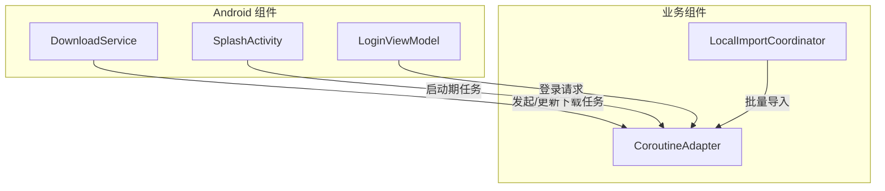
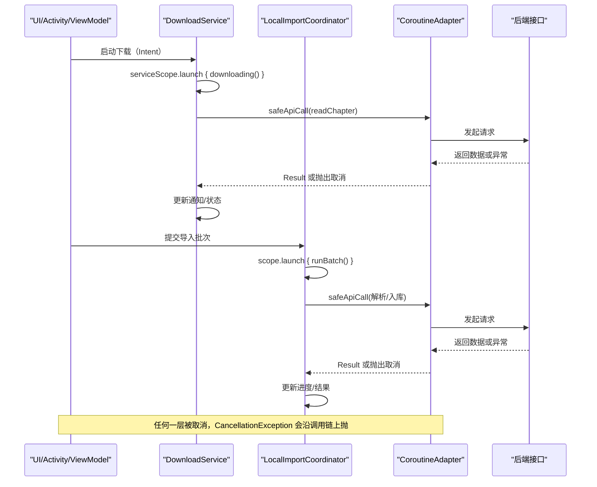
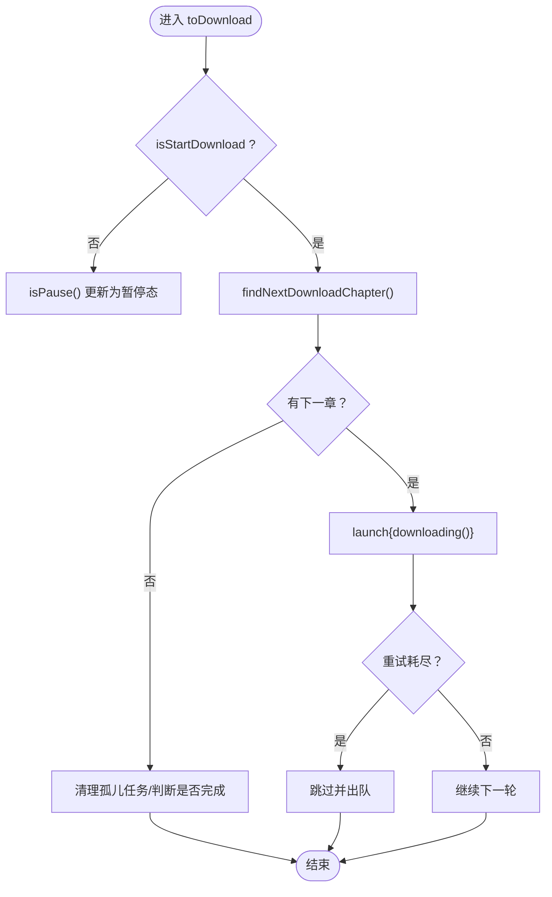
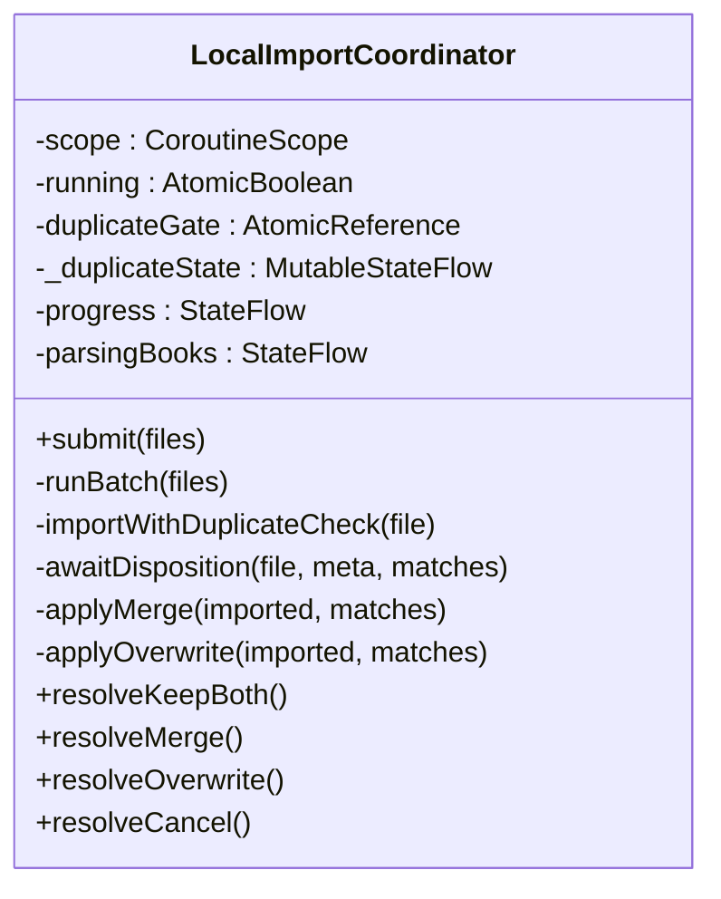
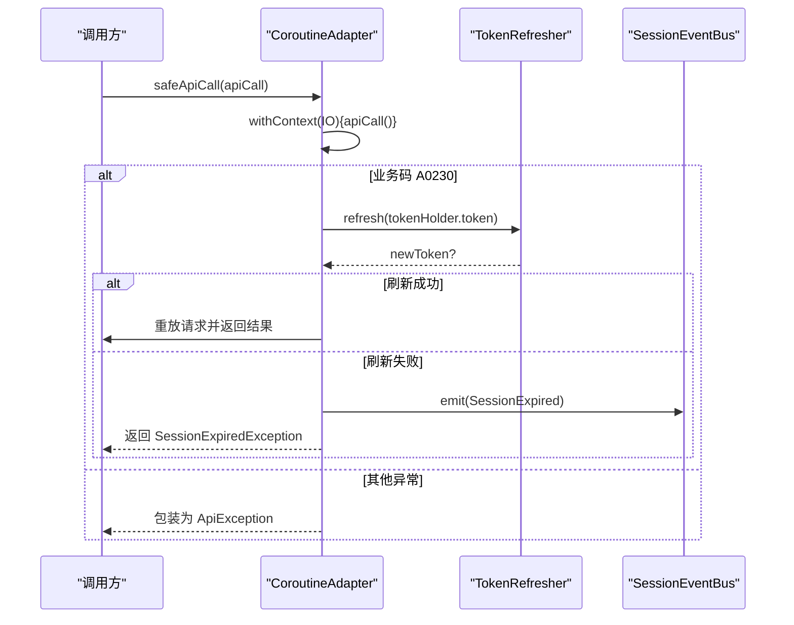
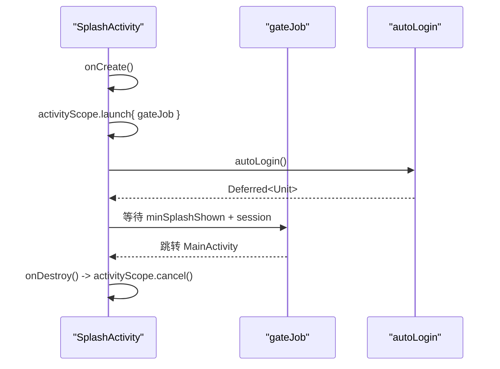
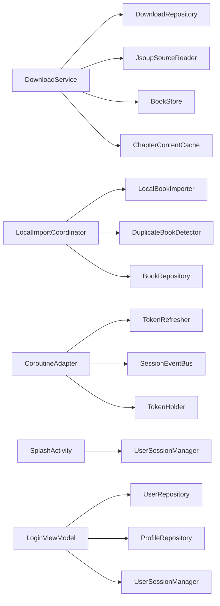

# 协程生命周期与作用域管理

<cite>
**本文引用的文件**
- [DownloadService.kt](file://module_book/src/main/java/com/ebook/book/service/DownloadService.kt)
- [LocalImportCoordinator.kt](file://lib_book_common/src/main/java/com/ebook/common/importer/LocalImportCoordinator.kt)
- [CoroutineAdapter.kt](file://lib_ebook_api/src/main/java/com/ebook/api/utils/CoroutineAdapter.kt)
- [SplashActivity.kt](file://module_main/src/main/java/com/ebook/main/SplashActivity.kt)
- [LoginViewModel.kt](file://module_login/src/main/java/com/ebook/login/mvvm/viewmodel/LoginViewModel.kt)
</cite>

## 目录
1. [引言](#引言)
2. [项目结构](#项目结构)
3. [核心组件](#核心组件)
4. [架构总览](#架构总览)
5. [详细组件分析](#详细组件分析)
6. [依赖关系分析](#依赖关系分析)
7. [性能考量](#性能考量)
8. [故障排查指南](#故障排查指南)
9. [结论](#结论)
10. [附录](#附录)

## 引言
本文聚焦于本仓库中 Kotlin 协程的生命周期与作用域管理实践，围绕以下目标展开：
- 解释服务级作用域（DownloadService.serviceScope）与批次级作用域（LocalImportCoordinator.scope）的使用场景与边界。
- 说明 SupervisorJob 的行为：子协程异常隔离、取消传播机制。
- 阐述协程取消的正确处理方式：CancellationException 的放行、资源清理与状态一致性。
- 说明协程与 Android 组件生命周期的绑定：Service.onDestroy 清理、ViewModel 销毁时作用域取消。
- 给出可落地的代码示例路径与最佳实践，并总结调试技巧与常见陷阱。

## 项目结构
本仓库采用多模块架构，协程使用分布在业务模块与共享库中：
- module_book：前台下载服务 DownloadService，维护服务级 CoroutineScope + SupervisorJob。
- lib_book_common：本地导入协调器 LocalImportCoordinator，持有进程级 CoroutineScope + SupervisorJob 用于导入批次的独立生命周期。
- lib_ebook_api：网络请求适配器 CoroutineAdapter，统一处理取消与异常、会话过期处置。
- module_main：启动页 SplashActivity，使用 Activity 级作用域控制启动期任务。
- module_login：登录 ViewModel 使用 viewModelScope 发起登录流程。

**图表来源**
- [DownloadService.kt:87-94](file://module_book/src/main/java/com/ebook/book/service/DownloadService.kt#L87-L94)
- [LocalImportCoordinator.kt:107-161](file://lib_book_common/src/main/java/com/ebook/common/importer/LocalImportCoordinator.kt#L107-L161)
- [CoroutineAdapter.kt:41-61](file://lib_ebook_api/src/main/java/com/ebook/api/utils/CoroutineAdapter.kt#L41-L61)
- [SplashActivity.kt:72-156](file://module_main/src/main/java/com/ebook/main/SplashActivity.kt#L72-L156)
- [LoginViewModel.kt:55-72](file://module_login/src/main/java/com/ebook/login/mvvm/viewmodel/LoginViewModel.kt#L55-L72)

**章节来源**
- [DownloadService.kt:87-94](file://module_book/src/main/java/com/ebook/book/service/DownloadService.kt#L87-L94)
- [LocalImportCoordinator.kt:107-161](file://lib_book_common/src/main/java/com/ebook/common/importer/LocalImportCoordinator.kt#L107-L161)
- [CoroutineAdapter.kt:41-61](file://lib_ebook_api/src/main/java/com/ebook/api/utils/CoroutineAdapter.kt#L41-L61)
- [SplashActivity.kt:72-156](file://module_main/src/main/java/com/ebook/main/SplashActivity.kt#L72-L156)
- [LoginViewModel.kt:55-72](file://module_login/src/main/java/com/ebook/login/mvvm/viewmodel/LoginViewModel.kt#L55-L72)

## 核心组件
- DownloadService.serviceScope：服务级作用域，绑定 Service 生命周期；在 onDestroy 中 cancel，确保所有下载相关协程在服务结束时停止。
- LocalImportCoordinator.scope：进程级作用域，独立于页面生命周期，保障导入批次不被 UI 销毁打断。
- CoroutineAdapter.safeApiCall/callData：统一网络调用封装，正确处理 CancellationException，避免吞掉取消信号。
- SplashActivity.activityScope：Activity 级作用域，用于启动期任务，onDestroy 时取消，避免内存泄漏。
- LoginViewModel：使用 viewModelScope 执行登录流程，随 ViewModel 销毁自动取消。

**章节来源**
- [DownloadService.kt:87-94](file://module_book/src/main/java/com/ebook/book/service/DownloadService.kt#L87-L94)
- [LocalImportCoordinator.kt:107-161](file://lib_book_common/src/main/java/com/ebook/common/importer/LocalImportCoordinator.kt#L107-L161)
- [CoroutineAdapter.kt:41-61](file://lib_ebook_api/src/main/java/com/ebook/api/utils/CoroutineAdapter.kt#L41-L61)
- [SplashActivity.kt:72-156](file://module_main/src/main/java/com/ebook/main/SplashActivity.kt#L72-L156)
- [LoginViewModel.kt:55-72](file://module_login/src/main/java/com/ebook/login/mvvm/viewmodel/LoginViewModel.kt#L55-L72)

## 架构总览
下图展示了协程在不同层之间的调用与取消传播路径：

**图表来源**
- [DownloadService.kt:274-378](file://module_book/src/main/java/com/ebook/book/service/DownloadService.kt#L274-L378)
- [LocalImportCoordinator.kt:163-177](file://lib_book_common/src/main/java/com/ebook/common/importer/LocalImportCoordinator.kt#L163-L177)
- [CoroutineAdapter.kt:41-61](file://lib_ebook_api/src/main/java/com/ebook/api/utils/CoroutineAdapter.kt#L41-L61)

## 详细组件分析

### DownloadService 中的服务级作用域
- 作用域创建：serviceScope = CoroutineScope(SupervisorJob() + Dispatchers.Main)。
- 生命周期绑定：onDestroy 中移除 Handler 回调并 cancel 作用域，保证所有下载协程在服务结束时停止。
- 取消传播：downloading 内部捕获非取消异常，但显式重新抛出 CancellationException，避免吞掉取消导致循环继续。
- 状态一致性：通过 tryEmitState 同步写入状态，避免异步竞争导致 UI 与服务状态不一致。

**图表来源**
- [DownloadService.kt:212-247](file://module_book/src/main/java/com/ebook/book/service/DownloadService.kt#L212-L247)
- [DownloadService.kt:274-378](file://module_book/src/main/java/com/ebook/book/service/DownloadService.kt#L274-L378)

**章节来源**
- [DownloadService.kt:87-94](file://module_book/src/main/java/com/ebook/book/service/DownloadService.kt#L87-L94)
- [DownloadService.kt:274-378](file://module_book/src/main/java/com/ebook/book/service/DownloadService.kt#L274-L378)
- [DownloadService.kt:380-420](file://module_book/src/main/java/com/ebook/book/service/DownloadService.kt#L380-L420)

### LocalImportCoordinator 中的批次级作用域
- 作用域创建：scope = CoroutineScope(SupervisorJob() + Dispatchers.IO)，进程级单例，不受页面生命周期影响。
- 批次生命周期：submit(files) 启动 runBatch，逐个文件导入并在 finally 中重置 running 与 progress。
- 判重门控：awaitDisposition 使用 CompletableDeferred 阻塞导入循环直到用户选择处置策略，finally 中复位状态。
- 资源清理：无论成功、失败或被取消，都会从 parsingBooks 列表中移除占位行，保持书架 UI 一致。

**图表来源**
- [LocalImportCoordinator.kt:101-161](file://lib_book_common/src/main/java/com/ebook/common/importer/LocalImportCoordinator.kt#L101-L161)
- [LocalImportCoordinator.kt:186-212](file://lib_book_common/src/main/java/com/ebook/common/importer/LocalImportCoordinator.kt#L186-L212)
- [LocalImportCoordinator.kt:220-234](file://lib_book_common/src/main/java/com/ebook/common/importer/LocalImportCoordinator.kt#L220-L234)

**章节来源**
- [LocalImportCoordinator.kt:107-161](file://lib_book_common/src/main/java/com/ebook/common/importer/LocalImportCoordinator.kt#L107-L161)
- [LocalImportCoordinator.kt:186-212](file://lib_book_common/src/main/java/com/ebook/common/importer/LocalImportCoordinator.kt#L186-L212)
- [LocalImportCoordinator.kt:220-234](file://lib_book_common/src/main/java/com/ebook/common/importer/LocalImportCoordinator.kt#L220-L234)

### CoroutineAdapter 中的取消与异常处理
- safeApiCall：将网络请求切换到 IO 线程，捕获 CancellationException 并原样抛出，避免吞掉取消信号。
- handleTokenExpired：对 A0230 会话过期进行静默刷新，刷新失败则发射 SessionExpired 事件，由上层统一处置。
- callData：简化调用，直接获取 data，失败返回 null。

**图表来源**
- [CoroutineAdapter.kt:41-61](file://lib_ebook_api/src/main/java/com/ebook/api/utils/CoroutineAdapter.kt#L41-L61)
- [CoroutineAdapter.kt:71-112](file://lib_ebook_api/src/main/java/com/ebook/api/utils/CoroutineAdapter.kt#L71-L112)

**章节来源**
- [CoroutineAdapter.kt:41-61](file://lib_ebook_api/src/main/java/com/ebook/api/utils/CoroutineAdapter.kt#L41-L61)
- [CoroutineAdapter.kt:71-112](file://lib_ebook_api/src/main/java/com/ebook/api/utils/CoroutineAdapter.kt#L71-L112)

### SplashActivity 中的 Activity 级作用域
- 作用域创建：activityScope = CoroutineScope(SupervisorJob() + Dispatchers.Default)。
- 启动期任务：autoLogin 与最小展示时长并行，gateJob 等待两者完成后跳转 MainActivity。
- 生命周期绑定：onDestroy 中 cancel activityScope，避免内存泄漏。

**图表来源**
- [SplashActivity.kt:72-156](file://module_main/src/main/java/com/ebook/main/SplashActivity.kt#L72-L156)

**章节来源**
- [SplashActivity.kt:72-156](file://module_main/src/main/java/com/ebook/main/SplashActivity.kt#L72-L156)

### LoginViewModel 中的 viewModelScope
- 使用 viewModelScope.launch 发起登录流程，随 ViewModel 销毁自动取消。
- 登录成功后保存会话、回跳来源页并刷新本地资料缓存。

**章节来源**
- [LoginViewModel.kt:55-72](file://module_login/src/main/java/com/ebook/login/mvvm/viewmodel/LoginViewModel.kt#L55-L72)

## 依赖关系分析
- DownloadService 依赖 DownloadRepository、JsoupSourceReader、BookStore、ChapterContentCache 等，通过 Hilt 注入。
- LocalImportCoordinator 依赖 LocalBookImporter、DuplicateBookDetector、BookRepository，通过 Hilt 注入。
- CoroutineAdapter 依赖 TokenRefresher、SessionEventBus、TokenHolder，通过 Hilt 注入。
- SplashActivity 依赖 UserSessionManager，通过 Hilt 注入。
- LoginViewModel 依赖 UserRepository、ProfileRepository、UserSessionManager，通过 Hilt 注入。

**图表来源**
- [DownloadService.kt:58-66](file://module_book/src/main/java/com/ebook/book/service/DownloadService.kt#L58-L66)
- [LocalImportCoordinator.kt:101-105](file://lib_book_common/src/main/java/com/ebook/common/importer/LocalImportCoordinator.kt#L101-L105)
- [CoroutineAdapter.kt:30-34](file://lib_ebook_api/src/main/java/com/ebook/api/utils/CoroutineAdapter.kt#L30-L34)
- [SplashActivity.kt:74-75](file://module_main/src/main/java/com/ebook/main/SplashActivity.kt#L74-L75)
- [LoginViewModel.kt:30-34](file://module_login/src/main/java/com/ebook/login/mvvm/viewmodel/LoginViewModel.kt#L30-L34)

**章节来源**
- [DownloadService.kt:58-66](file://module_book/src/main/java/com/ebook/book/service/DownloadService.kt#L58-L66)
- [LocalImportCoordinator.kt:101-105](file://lib_book_common/src/main/java/com/ebook/common/importer/LocalImportCoordinator.kt#L101-L105)
- [CoroutineAdapter.kt:30-34](file://lib_ebook_api/src/main/java/com/ebook/api/utils/CoroutineAdapter.kt#L30-L34)
- [SplashActivity.kt:74-75](file://module_main/src/main/java/com/ebook/main/SplashActivity.kt#L74-L75)
- [LoginViewModel.kt:30-34](file://module_login/src/main/java/com/ebook/login/mvvm/viewmodel/LoginViewModel.kt#L30-L34)

## 性能考量
- SupervisorJob 提供异常隔离：子协程异常不会导致父作用域崩溃，适合服务级和进程级作用域。
- 取消传播：CancellationException 应原样抛出，避免吞掉取消导致资源泄漏或状态不一致。
- 线程切换：网络请求使用 Dispatchers.IO，UI 更新使用主线程，避免阻塞 UI。
- 状态同步：关键状态变更使用 tryEmitState 同步写入，避免异步竞争。

## 故障排查指南
- 下载服务超时：onTimeout 中只做数秒内可完成的收尾，禁止挂起/IO 操作。
- 通知不可用：updateOngoingNotification 中整体兜底，异常不影响下载流程。
- 会话过期：CoroutineAdapter 中统一处理 A0230，刷新失败发射 SessionExpired 事件。
- 导入批次取消：LocalImportCoordinator 中 finally 块确保状态复位，避免 UI 残留。

**章节来源**
- [DownloadService.kt:115-124](file://module_book/src/main/java/com/ebook/book/service/DownloadService.kt#L115-L124)
- [DownloadService.kt:534-549](file://module_book/src/main/java/com/ebook/book/service/DownloadService.kt#L534-L549)
- [CoroutineAdapter.kt:71-112](file://lib_ebook_api/src/main/java/com/ebook/api/utils/CoroutineAdapter.kt#L71-L112)
- [LocalImportCoordinator.kt:220-234](file://lib_book_common/src/main/java/com/ebook/common/importer/LocalImportCoordinator.kt#L220-L234)

## 结论
本仓库在协程生命周期与作用域管理方面展现了良好的实践：
- 服务级作用域（DownloadService.serviceScope）确保下载任务随服务生命周期管理。
- 批次级作用域（LocalImportCoordinator.scope）保障导入过程不受 UI 生命周期影响。
- 统一网络适配（CoroutineAdapter）正确处理取消与会话过期。
- Activity 级作用域（SplashActivity.activityScope）与 ViewModel 作用域（viewModelScope）遵循组件生命周期。
- SupervisorJob 提供异常隔离，CancellationException 正确传播，避免资源泄漏。

## 附录
- 最佳实践：始终在组件销毁时 cancel 作用域，避免内存泄漏。
- 调试技巧：使用 Logger 记录关键状态变更，便于问题定位。
- 常见陷阱：避免吞掉 CancellationException，确保取消能正确传播。