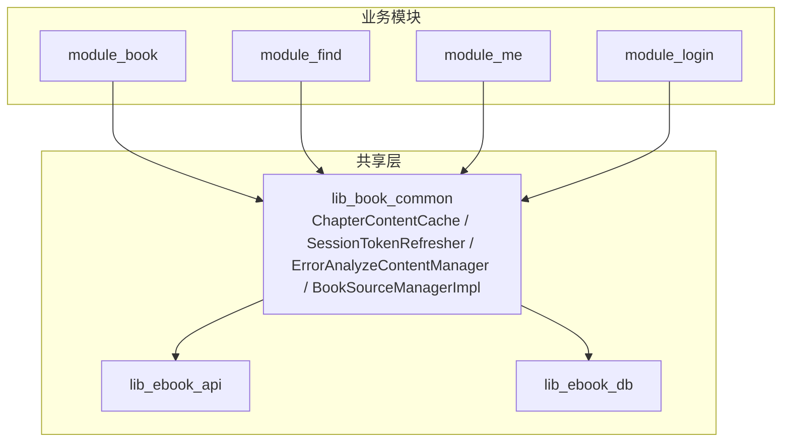
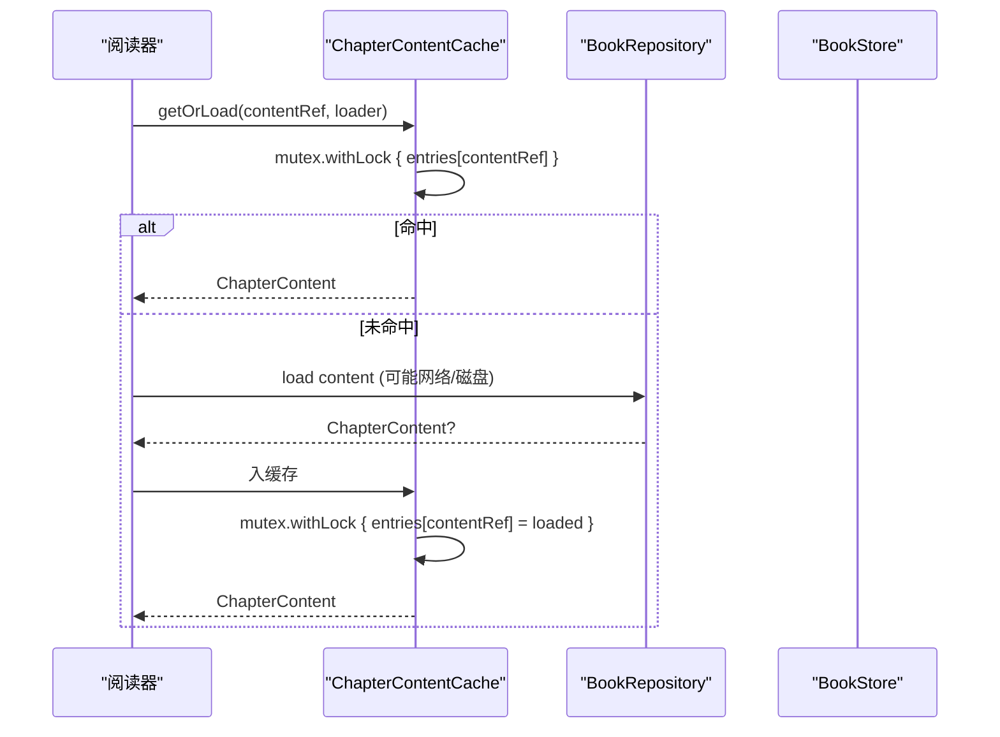
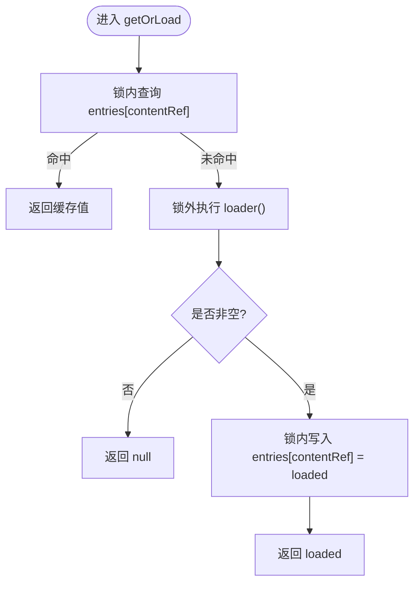
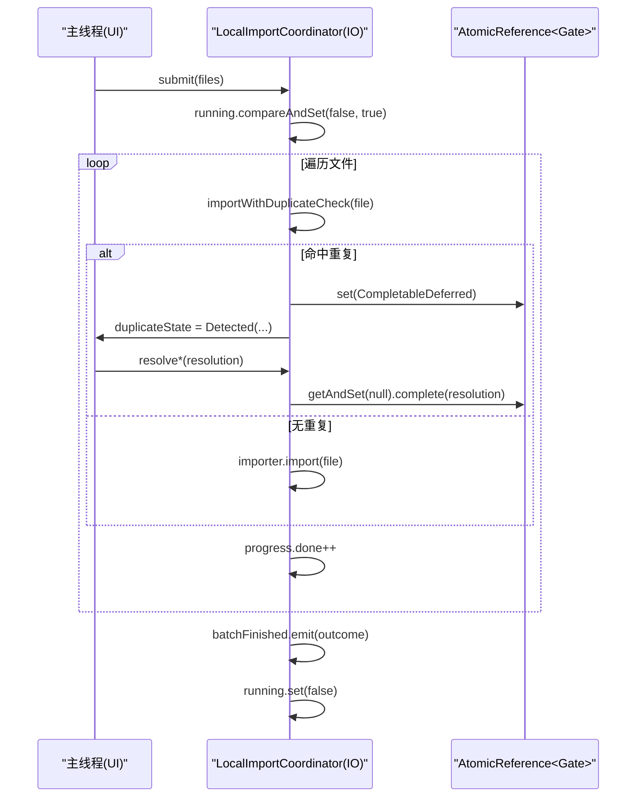
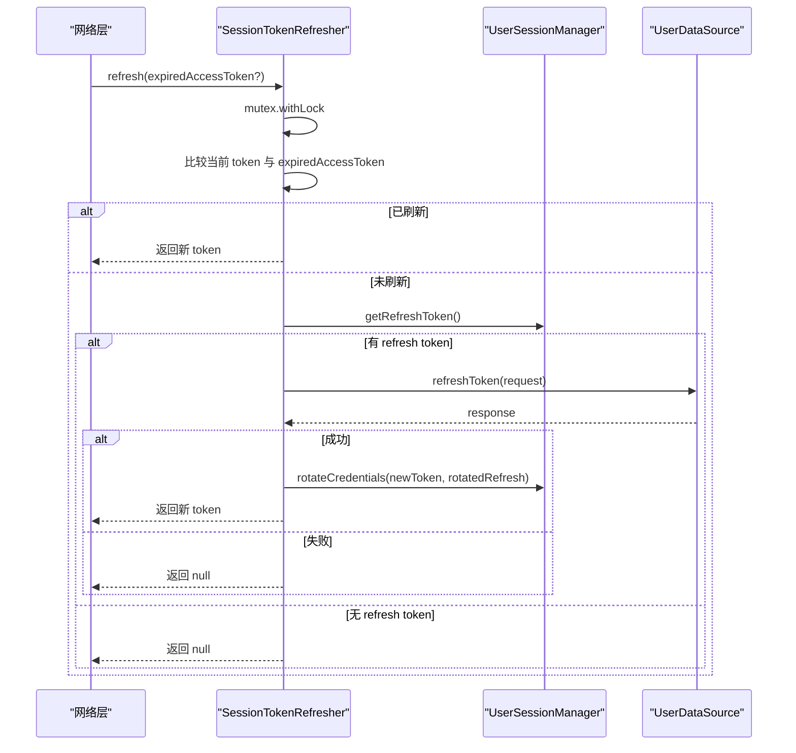
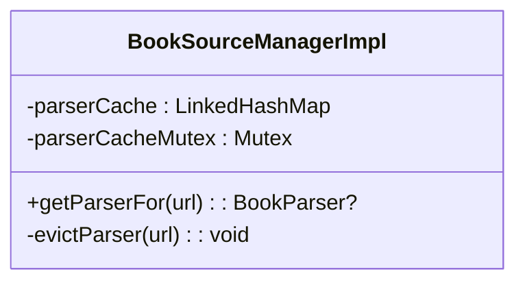
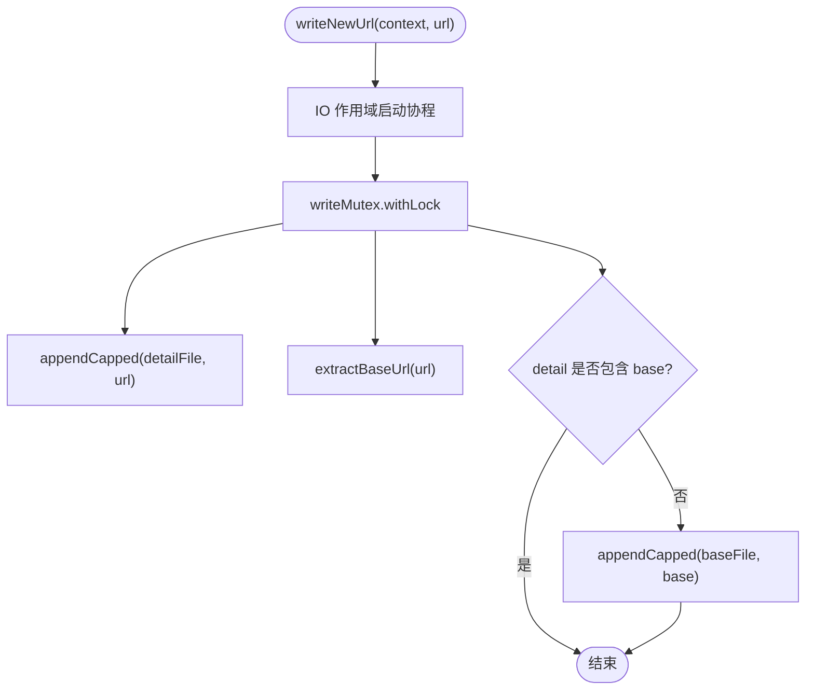
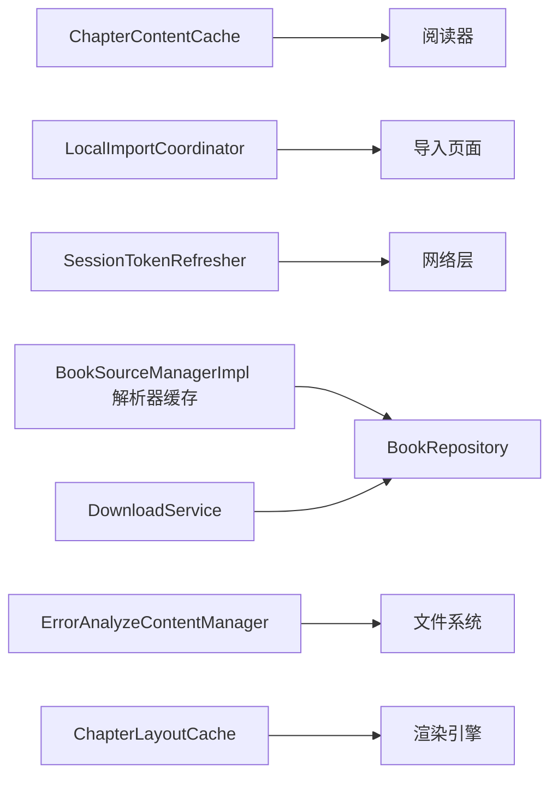

# 并发安全与线程同步

<cite>
**本文引用的文件**
- [ChapterContentCache.kt](file://lib_book_common/src/main/java/com/ebook/common/store/ChapterContentCache.kt)
- [LocalImportCoordinator.kt](file://lib_book_common/src/main/java/com/ebook/common/importer/LocalImportCoordinator.kt)
- [SessionTokenRefresher.kt](file://lib_book_common/src/main/java/com/ebook/common/domain/SessionTokenRefresher.kt)
- [BookSourceManagerImpl.kt](file://lib_book_common/src/main/java/com/ebook/common/analyze/source/BookSourceManagerImpl.kt)
- [ErrorAnalyzeContentManager.kt](file://lib_book_common/src/main/java/com/ebook/common/manager/ErrorAnalyzeContentManager.kt)
- [ChapterLayoutCache.kt](file://module_book/src/main/java/com/ebook/book/reader/ChapterLayoutCache.kt)
- [DownloadService.kt](file://module_book/src/main/java/com/ebook/book/service/DownloadService.kt)
</cite>

## 目录
1. [简介](#简介)
2. [项目结构与并发边界](#项目结构与并发边界)
3. [核心组件与并发原语总览](#核心组件与并发原语总览)
4. [架构概览：并发视图](#架构概览并发视图)
5. [详细组件分析](#详细组件分析)
6. [依赖关系与耦合分析](#依赖关系与耦合分析)
7. [性能与可扩展性考量](#性能与可扩展性考量)
8. [故障排查与常见问题](#故障排查与常见问题)
9. [结论](#结论)

## 简介
本文面向“并发安全与线程同步”主题，聚焦本仓库在以下方面的实践与保障：
- 使用 Mutex 保护 ChapterContentCache、解析器缓存等共享可变状态；
- 使用 AtomicBoolean 实现导入批次的互斥控制；
- 使用 AtomicReference 实现导入协调器的暂停门（UI 主线程与 IO 线程协作）；
- 解释共享状态的可见性问题（volatile/原子语义/内存屏障）及协程上下文切换时的安全性；
- 识别并预防竞态条件（检查-然后-动作、ABA 问题），给出可落地的避免策略；
- 提供基于 Kotlin 标准库的并发工具用法指引与自定义线程安全数据结构建议；
- 总结死锁预防与性能优化技巧。

## 项目结构与并发边界
本项目为多模块 Android 工程，关键并发代码集中在 lib_book_common（通用域逻辑）与 module_book（阅读与下载）。并发边界通常位于：
- 进程级单例/管理器（如导入协调器、错误日志写入、会话刷新）；
- 跨线程通信（IO 协程 ↔ 主线程 UI）；
- 资源访问（文件读写、Room 数据库、网络请求、内存缓存）。

**图表来源**
- [ChapterContentCache.kt:25-57](file://lib_book_common/src/main/java/com/ebook/common/store/ChapterContentCache.kt#L25-L57)
- [SessionTokenRefresher.kt:41-96](file://lib_book_common/src/main/java/com/ebook/common/domain/SessionTokenRefresher.kt#L41-L96)
- [ErrorAnalyzeContentManager.kt:26-75](file://lib_book_common/src/main/java/com/ebook/common/manager/ErrorAnalyzeContentManager.kt#L26-L75)
- [BookSourceManagerImpl.kt:180-193](file://lib_book_common/src/main/java/com/ebook/common/analyze/source/BookSourceManagerImpl.kt#L180-L193)

**章节来源**
- [ChapterContentCache.kt:25-57](file://lib_book_common/src/main/java/com/ebook/common/store/ChapterContentCache.kt#L25-L57)
- [LocalImportCoordinator.kt:100-161](file://lib_book_common/src/main/java/com/ebook/common/importer/LocalImportCoordinator.kt#L100-L161)
- [SessionTokenRefresher.kt:41-96](file://lib_book_common/src/main/java/com/ebook/common/domain/SessionTokenRefresher.kt#L41-L96)
- [BookSourceManagerImpl.kt:180-193](file://lib_book_common/src/main/java/com/ebook/common/analyze/source/BookSourceManagerImpl.kt#L180-L193)
- [ErrorAnalyzeContentManager.kt:26-75](file://lib_book_common/src/main/java/com/ebook/common/manager/ErrorAnalyzeContentManager.kt#L26-L75)

## 核心组件与并发原语总览
- 章节内容缓存：Mutex + LRU LinkedHashMap（线程安全的 getOrLoad/invalidate/clear）。
- 导入协调器：AtomicBoolean 保证同一时刻仅一批导入；AtomicReference<CompletableDeferred> 作为暂停门，协调 IO 线程与主线程。
- 会话静默刷新：Mutex 串行化刷新，避免重复刷新与并发冲突；直接调用数据源以避免循环触发。
- 书源解析器缓存：Mutex 保护的 LRU Map，确保并发下只构建一个解析器实例。
- 错误日志落盘：Mutex 串行化写文件，避免读-判-写竞态与交错追加。
- 布局缓存：synchronizedMap + synchronized 块保证 check-then-act 原子性。
- 前台下载服务：协程作用域与主线程 Handler 管理通知/回调，结合 Repository 完成队列调度。

**章节来源**
- [ChapterContentCache.kt:25-57](file://lib_book_common/src/main/java/com/ebook/common/store/ChapterContentCache.kt#L25-L57)
- [LocalImportCoordinator.kt:100-161](file://lib_book_common/src/main/java/com/ebook/common/importer/LocalImportCoordinator.kt#L100-L161)
- [SessionTokenRefresher.kt:41-96](file://lib_book_common/src/main/java/com/ebook/common/domain/SessionTokenRefresher.kt#L41-L96)
- [BookSourceManagerImpl.kt:180-193](file://lib_book_common/src/main/java/com/ebook/common/analyze/source/BookSourceManagerImpl.kt#L180-L193)
- [ErrorAnalyzeContentManager.kt:26-75](file://lib_book_common/src/main/java/com/ebook/common/manager/ErrorAnalyzeContentManager.kt#L26-L75)
- [ChapterLayoutCache.kt:35-53](file://module_book/src/main/java/com/ebook/book/reader/ChapterLayoutCache.kt#L35-L53)
- [DownloadService.kt:57-100](file://module_book/src/main/java/com/ebook/book/service/DownloadService.kt#L57-L100)

## 架构概览：并发视图
下图展示各组件间的并发交互与数据流，突出锁与原子操作的使用位置。

**图表来源**
- [ChapterContentCache.kt:41-46](file://lib_book_common/src/main/java/com/ebook/common/store/ChapterContentCache.kt#L41-L46)

**章节来源**
- [ChapterContentCache.kt:41-46](file://lib_book_common/src/main/java/com/ebook/common/store/ChapterContentCache.kt#L41-L46)

## 详细组件分析

### 章节内容缓存（ChapterContentCache）
- 设计动机：阅读器翻页频繁读取正文，若无缓存将导致重复 I/O 与解码，性能退化。LRU 容量默认 3，覆盖当前章与前后各一章。
- 并发保障：
  - 使用 Mutex 保护 LinkedHashMap 的读写，getOrLoad 中先查后写均加锁；
  - 对同一 contentRef 的加载结果入缓存，null 不入缓存以便后续读者注册表补齐时自然恢复；
  - invalidateBook 按 bookId 派生的片段批量清除，clear 清空所有条目。
- 复杂度与可见性：
  - getOrLoad 在锁外执行 loader，降低阻塞对其他章的影响；
  - 通过 withLock 建立 happens-before 关系，保证多线程可见性。

**图表来源**
- [ChapterContentCache.kt:41-46](file://lib_book_common/src/main/java/com/ebook/common/store/ChapterContentCache.kt#L41-L46)

**章节来源**
- [ChapterContentCache.kt:25-57](file://lib_book_common/src/main/java/com/ebook/common/store/ChapterContentCache.kt#L25-L57)

### 导入协调器（LocalImportCoordinator）
- 目标：进程级协调本地书籍导入，支持判重处置、批量进度与收尾事件。
- 并发原语：
  - AtomicBoolean running 用于批次互斥，compareAndSet(false, true) 确保仅一批运行；
  - AtomicReference<CompletableDeferred<DuplicateResolution?>> duplicateGate 作为暂停门，IO 线程设置门，主线程按钮回调取出并完成，幂等处理重复点击；
  - StateFlow/SharedFlow 用于 UI 状态与事件广播。
- 线程模型：
  - 自有 CoroutineScope(SupervisorJob() + Dispatchers.IO) 异步遍历文件；
  - 主线程通过 resolve* 方法唤醒等待的门，完成决策；
  - finally 中复位门与状态，防止残留状态影响后续文件。

**图表来源**
- [LocalImportCoordinator.kt:100-161](file://lib_book_common/src/main/java/com/ebook/common/importer/LocalImportCoordinator.kt#L100-L161)
- [LocalImportCoordinator.kt:186-234](file://lib_book_common/src/main/java/com/ebook/common/importer/LocalImportCoordinator.kt#L186-L234)
- [LocalImportCoordinator.kt:283-303](file://lib_book_common/src/main/java/com/ebook/common/importer/LocalImportCoordinator.kt#L283-L303)

**章节来源**
- [LocalImportCoordinator.kt:100-161](file://lib_book_common/src/main/java/com/ebook/common/importer/LocalImportCoordinator.kt#L100-L161)
- [LocalImportCoordinator.kt:186-234](file://lib_book_common/src/main/java/com/ebook/common/importer/LocalImportCoordinator.kt#L186-L234)
- [LocalImportCoordinator.kt:283-303](file://lib_book_common/src/main/java/com/ebook/common/importer/LocalImportCoordinator.kt#L283-L303)

### 会话静默刷新（SessionTokenRefresher）
- 目标：A0230 过期时静默刷新双 token，保持用户会话。
- 并发与安全：
  - Mutex 串行化 refresh 流程，避免并发刷新的竞争与旧 refresh 被硬删除导致的失败；
  - 进入锁后立即比对当前 token 与触发过期的 token，若不同则复用已刷新的 token；
  - 不套 CoroutineAdapter，直接调 UserDataSource.refreshToken，避免刷新失败再次触发刷新形成死循环；
  - 成功即 rotateCredentials 更新内存与持久化凭据，失败记录日志并返回 null。
- 取消异常处理：捕获 CancellationException 上抛，避免误判为会话不可恢复。

**图表来源**
- [SessionTokenRefresher.kt:41-96](file://lib_book_common/src/main/java/com/ebook/common/domain/SessionTokenRefresher.kt#L41-L96)

**章节来源**
- [SessionTokenRefresher.kt:41-96](file://lib_book_common/src/main/java/com/ebook/common/domain/SessionTokenRefresher.kt#L41-L96)

### 书源解析器缓存（BookSourceManagerImpl）
- 目标：避免并发下为同一 URL 多次构建解析器；LRU 容量限制。
- 并发保障：
  - parserCache 为 LinkedHashMap(accessOrder=true)，连读也会改变结构，因此必须全部在 parserCacheMutex.withLock 内访问；
  - getParserFor 整段上锁，包含查缓存、查库、放缓存；
  - evictParser 也在锁内移除对应键，避免脏数据或重复构建。
- 正确性要点：
  - “查-建-存”三段必须在同一把锁内完成，否则并发会创建多个实例并互相覆盖；
  - 默认源与普通源共用同一 LRU，配置变更时统一失效。

**图表来源**
- [BookSourceManagerImpl.kt:180-193](file://lib_book_common/src/main/java/com/ebook/common/analyze/source/BookSourceManagerImpl.kt#L180-L193)
- [BookSourceManagerImpl.kt:419-437](file://lib_book_common/src/main/java/com/ebook/common/analyze/source/BookSourceManagerImpl.kt#L419-L437)
- [BookSourceManagerImpl.kt:813-819](file://lib_book_common/src/main/java/com/ebook/common/analyze/source/BookSourceManagerImpl.kt#L813-L819)

**章节来源**
- [BookSourceManagerImpl.kt:180-193](file://lib_book_common/src/main/java/com/ebook/common/analyze/source/BookSourceManagerImpl.kt#L180-L193)
- [BookSourceManagerImpl.kt:419-437](file://lib_book_common/src/main/java/com/ebook/common/analyze/source/BookSourceManagerImpl.kt#L419-L437)
- [BookSourceManagerImpl.kt:813-819](file://lib_book_common/src/main/java/com/ebook/common/analyze/source/BookSourceManagerImpl.kt#L813-L819)

### 错误日志落盘（ErrorAnalyzeContentManager）
- 目标：记录解析失败的 URL，辅助调试书源规则与站点改版。
- 并发保障：
  - 进程级 IO 作用域，每次调用即发即忘；
  - writeMutex 串行化“读-判-写”，避免多协程同时判断不存在而各自追加；
  - 文件超过阈值轮转重写，保留最近一批失败 URL。
- 注意事项：
  - 函数体不得向外抛出异常，以免掩盖上层类型化异常；
  - 提取 baseUrl 时考虑无路径 URL 的情况，避免越界。

**图表来源**
- [ErrorAnalyzeContentManager.kt:26-75](file://lib_book_common/src/main/java/com/ebook/common/manager/ErrorAnalyzeContentManager.kt#L26-L75)
- [ErrorAnalyzeContentManager.kt:101-117](file://lib_book_common/src/main/java/com/ebook/common/manager/ErrorAnalyzeContentManager.kt#L101-L117)

**章节来源**
- [ErrorAnalyzeContentManager.kt:26-75](file://lib_book_common/src/main/java/com/ebook/common/manager/ErrorAnalyzeContentManager.kt#L26-L75)
- [ErrorAnalyzeContentManager.kt:101-117](file://lib_book_common/src/main/java/com/ebook/common/manager/ErrorAnalyzeContentManager.kt#L101-L117)

### 布局缓存（ChapterLayoutCache）
- 目标：章节布局块的 LRU 缓存，避免重复计算。
- 并发保障：
  - 使用 Collections.synchronizedMap 包装 LinkedHashMap；
  - getOrCompute 在 synchronized(entries) 块内完成 check-then-act，确保 getOrPut 的原子性。
- 适用场景：预加载上下页时可能被并发调用，需保证计算只发生一次。

**章节来源**
- [ChapterLayoutCache.kt:35-53](file://module_book/src/main/java/com/ebook/book/reader/ChapterLayoutCache.kt#L35-L53)

### 下载服务（DownloadService）
- 目标：前台服务逐章抓取正文写入文件，维护任务队列与进度。
- 并发与生命周期：
  - Service 内使用 SupervisorJob + Dispatchers.Main 的服务级作用域；
  - 通过 Notification 与 Repository 回传下载状态；
  - 前台化失败时自动续跑分支处理。
- 与缓存协作：强制刷新重抓后需失效内存缓存，保证阅读器获取最新内容。

**章节来源**
- [DownloadService.kt:57-100](file://module_book/src/main/java/com/ebook/book/service/DownloadService.kt#L57-L100)

## 依赖关系与耦合分析
- 低耦合点：
  - 缓存组件（ChapterContentCache、ChapterLayoutCache）以接口/函数式参数暴露行为，降低对外依赖；
  - 导入协调器通过 Flow 暴露状态与事件，UI 仅订阅，不持有内部锁；
  - 会话刷新独立于网络适配器，避免循环触发。
- 高耦合点：
  - 解析器缓存与 BookRepository/Dao 紧密相关，变更需同步失效逻辑；
  - 下载服务与 BookStore/JsoupSourceReader/Repository 耦合度高，需关注强一致性与异常处理。

**图表来源**
- [ChapterContentCache.kt:25-57](file://lib_book_common/src/main/java/com/ebook/common/store/ChapterContentCache.kt#L25-L57)
- [LocalImportCoordinator.kt:100-161](file://lib_book_common/src/main/java/com/ebook/common/importer/LocalImportCoordinator.kt#L100-L161)
- [SessionTokenRefresher.kt:41-96](file://lib_book_common/src/main/java/com/ebook/common/domain/SessionTokenRefresher.kt#L41-L96)
- [BookSourceManagerImpl.kt:180-193](file://lib_book_common/src/main/java/com/ebook/common/analyze/source/BookSourceManagerImpl.kt#L180-L193)
- [ErrorAnalyzeContentManager.kt:26-75](file://lib_book_common/src/main/java/com/ebook/common/manager/ErrorAnalyzeContentManager.kt#L26-L75)
- [ChapterLayoutCache.kt:35-53](file://module_book/src/main/java/com/ebook/book/reader/ChapterLayoutCache.kt#L35-L53)
- [DownloadService.kt:57-100](file://module_book/src/main/java/com/ebook/book/service/DownloadService.kt#L57-L100)

**章节来源**
- [ChapterContentCache.kt:25-57](file://lib_book_common/src/main/java/com/ebook/common/store/ChapterContentCache.kt#L25-L57)
- [LocalImportCoordinator.kt:100-161](file://lib_book_common/src/main/java/com/ebook/common/importer/LocalImportCoordinator.kt#L100-L161)
- [SessionTokenRefresher.kt:41-96](file://lib_book_common/src/main/java/com/ebook/common/domain/SessionTokenRefresher.kt#L41-L96)
- [BookSourceManagerImpl.kt:180-193](file://lib_book_common/src/main/java/com/ebook/common/analyze/source/BookSourceManagerImpl.kt#L180-L193)
- [ErrorAnalyzeContentManager.kt:26-75](file://lib_book_common/src/main/java/com/ebook/common/manager/ErrorAnalyzeContentManager.kt#L26-L75)
- [ChapterLayoutCache.kt:35-53](file://module_book/src/main/java/com/ebook/book/reader/ChapterLayoutCache.kt#L35-L53)
- [DownloadService.kt:57-100](file://module_book/src/main/java/com/ebook/book/service/DownloadService.kt#L57-L100)

## 性能与可扩展性考量
- 减少锁粒度：
  - ChapterContentCache 在锁外执行 loader，避免 I/O 阻塞其他章；
  - 解析器缓存将“查-建-存”整体置于同一锁，但尽量缩短临界区；
- 无锁/轻量原子：
  - 导入批次互斥使用 AtomicBoolean.compareAndSet，避免全局锁；
  - 暂停门使用 AtomicReference 配合 CompletableDeferred，实现高效的主/子线程协作；
- 并发安全的数据结构：
  - 对非线程安全的容器（LinkedHashMap）使用外部锁或 synchronizedMap 包装；
  - 对于“读也会改结构”的容器（accessOrder=true），务必全量加锁；
- 扩展建议：
  - 对热点路径引入细粒度分区锁（例如按 chapterId 分片）；
  - 对读多写少的缓存考虑使用 ConcurrentMap 或分段锁；
  - 对高频短任务采用无锁队列（如 Channel）替代传统队列。

[本节提供通用指导，不直接分析具体文件]

## 故障排查与常见问题
- 竞态条件识别：
  - 检查-然后-动作：如 ChapterLayoutCache.getOrCompute 需在同步块内完成 getOrPut，否则并发 miss 会重复计算；
  - ABA 问题：使用 AtomicReference<CompletableDeferred> 时，gate 的 compareAndSet(gate, null) 能避免重复消费；
- 可见性问题：
  - 原子操作提供 happens-before 保证；Mutex.withLock 建立内存屏障；
  - 主线程与 IO 线程间通过 Flow/Channel/CompletableDeferred 传递状态，避免裸 var；
- 常见症状与定位：
  - 页面不弹提示、该关的页不关：命令通道绑定失败（ViewModel 基类未继承），检查页面继承；
  - 刷新死循环：刷新链路套用了 safeApiCall，导致 A0230 再次触发刷新；应直接调数据源；
  - 下载队列卡住：失败章未出队，导致服务常驻通知不消失；需确认重试耗尽后的出队逻辑。

**章节来源**
- [ChapterLayoutCache.kt:35-53](file://module_book/src/main/java/com/ebook/book/reader/ChapterLayoutCache.kt#L35-L53)
- [SessionTokenRefresher.kt:41-96](file://lib_book_common/src/main/java/com/ebook/common/domain/SessionTokenRefresher.kt#L41-L96)
- [LocalImportCoordinator.kt:283-303](file://lib_book_common/src/main/java/com/ebook/common/importer/LocalImportCoordinator.kt#L283-L303)

## 结论
本项目在并发安全方面形成了清晰的实践范式：
- 以 Mutex 保护可变共享状态（缓存、解析器缓存、文件写入）；
- 以原子变量实现轻量互斥与状态门（导入批次、暂停门）；
- 通过协程 Flow/Channel 进行线程间通信，避免裸共享字段；
- 严格遵循“检查-然后-动作”的原子组合，防止竞态；
- 在性能与正确性之间取得平衡：锁外执行 I/O、缩小临界区、合理使用原子操作。
未来可继续细化分区锁、引入无锁数据结构与更细粒度的并发控制，以提升高并发下的吞吐与延迟表现。