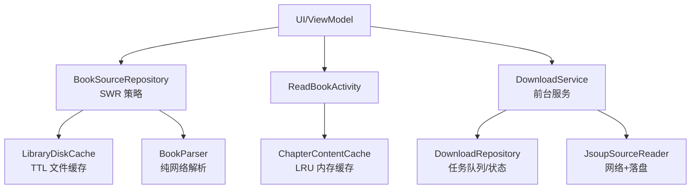
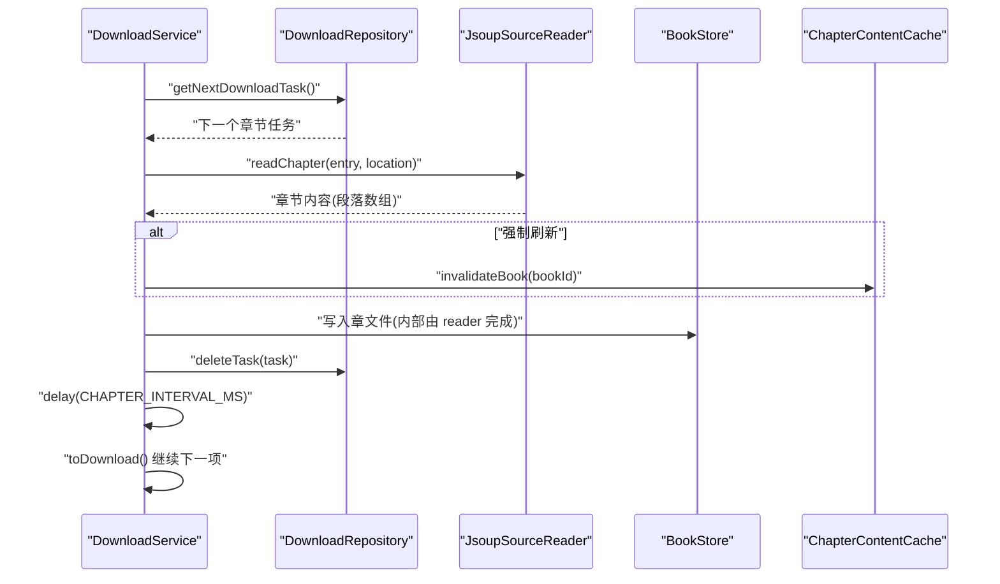
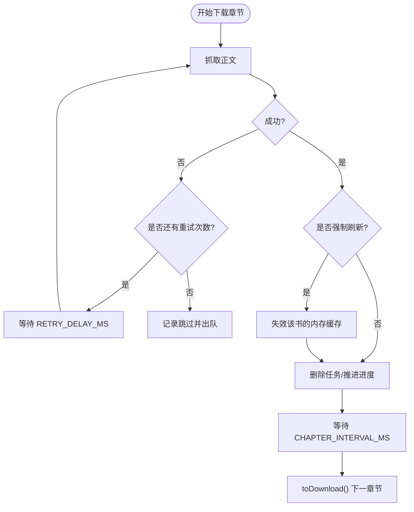
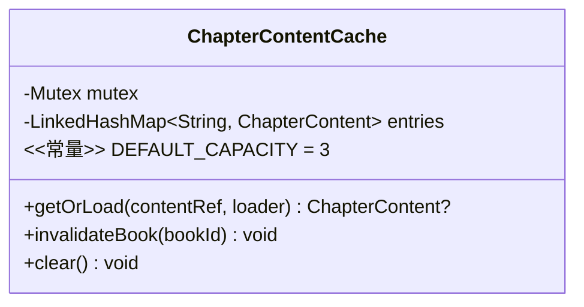
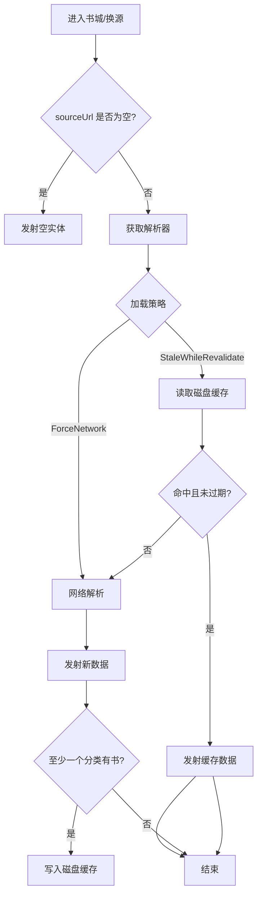
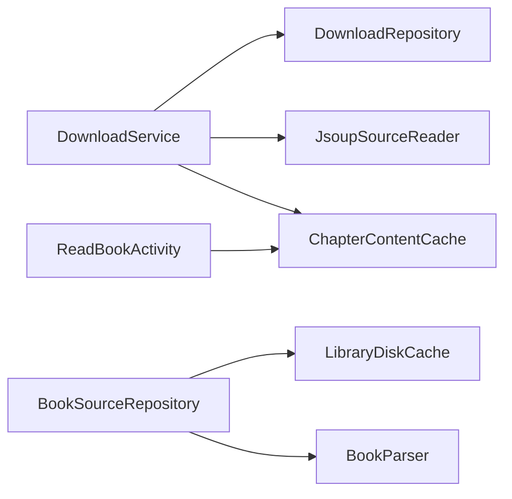

# 并发性能优化与调优

<cite>
**本文引用的文件**
- [DownloadService.kt](file://module_book/src/main/java/com/ebook/book/service/DownloadService.kt)
- [ChapterContentCache.kt](file://lib_book_common/src/main/java/com/ebook/common/store/ChapterContentCache.kt)
- [BookSourceRepository.kt](file://module_find/src/main/java/com/ebook/find/repository/BookSourceRepository.kt)
- [LibraryDiskCache.kt](file://lib_book_common/src/main/java/com/ebook/common/analyze/source/LibraryDiskCache.kt)
- [JsoupSourceReader.kt](file://lib_book_common/src/main/java/com/ebook/common/analyze/source/JsoupSourceReader.kt)
- [DownloadRepository.kt](file://module_book/src/main/java/com/ebook/book/repository/DownloadRepository.kt)
- [ReadBookActivity.kt](file://module_book/src/main/java/com/ebook/book/ReadBookActivity.kt)
- [AGENTS.md](file://AGENTS.md)
</cite>

## 目录
1. [简介](#简介)
2. [项目结构](#项目结构)
3. [核心组件](#核心组件)
4. [架构总览](#架构总览)
5. [详细组件分析](#详细组件分析)
6. [依赖关系分析](#依赖关系分析)
7. [性能考量](#性能考量)
8. [故障排查指南](#故障排查指南)
9. [结论](#结论)
10. [附录](#附录)

## 简介
本文件聚焦本项目的并发性能优化与调优，围绕下载章节的并发节流、内存缓存、书库 SWR 策略、协程执行监控与内存优化展开。目标是帮助读者理解：如何通过章节间隔与重试延迟缓解网络压力；如何设计 LRU 内存缓存并控制容量；如何在书城页面实现“先旧后新”的 SWR 体验；以及如何用协程与流式 API 进行可观测的性能分析与基准测试。

## 项目结构
本项目采用多模块架构，关键与并发相关的能力分布在以下位置：
- 下载与前台服务：module_book（DownloadService）
- 阅读内容内存缓存：lib_book_common（ChapterContentCache）
- 书城数据仓库与磁盘缓存：module_find（BookSourceRepository）、lib_book_common（LibraryDiskCache）
- 网络抓取与正文解析：lib_book_common（JsoupSourceReader）
- 下载任务编排与状态：module_book（DownloadRepository）
- 阅读器读取路径：module_book（ReadBookActivity）

图表来源
- [BookSourceRepository.kt:21-131](file://module_find/src/main/java/com/ebook/find/repository/BookSourceRepository.kt#L21-L131)
- [LibraryDiskCache.kt:13-113](file://lib_book_common/src/main/java/com/ebook/common/analyze/source/LibraryDiskCache.kt#L13-L113)
- [ChapterContentCache.kt:7-62](file://lib_book_common/src/main/java/com/ebook/common/store/ChapterContentCache.kt#L7-L62)
- [DownloadService.kt:40-77](file://module_book/src/main/java/com/ebook/book/service/DownloadService.kt#L40-L77)

章节来源
- [AGENTS.md](file://AGENTS.md)

## 核心组件
- DownloadService：前台服务逐章抓取正文，通过章节间隔与重试延迟降低对书源站点的瞬时压力，并在失败时安全出队避免阻塞后续章节。
- ChapterContentCache：进程级 LRU 内存缓存，键为 content_ref，容量默认 3（当前章 + 前后各一），命中即返回，未命中则加载并写入缓存。
- BookSourceRepository：书城数据仓库，提供两种加载策略：StaleWhileRevalidate（SWR）与 ForceNetwork（强刷），并结合 LibraryDiskCache 的 TTL 文件缓存实现“先旧后新”。
- LibraryDiskCache：按源分区的 JSON 文件缓存，带写入时间戳，读/写幂等且具备损坏自愈与原子覆盖能力。
- JsoupSourceReader：统一从书源抓取正文并写入章文件，空正文判失败，强制刷新重抓成功后失效内存缓存。
- DownloadRepository：下载任务队列与状态管理，配合服务完成入队/出队、状态广播与收尾逻辑。

章节来源
- [DownloadService.kt:249-378](file://module_book/src/main/java/com/ebook/book/service/DownloadService.kt#L249-L378)
- [ChapterContentCache.kt:7-62](file://lib_book_common/src/main/java/com/ebook/common/store/ChapterContentCache.kt#L7-L62)
- [BookSourceRepository.kt:21-146](file://module_find/src/main/java/com/ebook/find/repository/BookSourceRepository.kt#L21-L146)
- [LibraryDiskCache.kt:13-113](file://lib_book_common/src/main/java/com/ebook/common/analyze/source/LibraryDiskCache.kt#L13-L113)
- [DownloadRepository.kt](file://module_book/src/main/java/com/ebook/book/repository/DownloadRepository.kt)

## 架构总览
下图展示下载流程与缓存协作的关键调用链：服务取任务 → 抓取正文 → 写章文件 → 更新内存缓存失效 → 下一章节间隔推进。

图表来源
- [DownloadService.kt:274-378](file://module_book/src/main/java/com/ebook/book/service/DownloadService.kt#L274-L378)
- [ChapterContentCache.kt:41-57](file://lib_book_common/src/main/java/com/ebook/common/store/ChapterContentCache.kt#L41-L57)

## 详细组件分析

### DownloadService：章节间隔与重试延迟
- 章节间隔控制：每章抓取完成后，使用 Handler.postDelayed 以固定间隔推进到下一章节，降低对书源站点的请求频率，避免突发峰值导致限流或抖动。
- 重试延迟：单章抓取失败时，在下次重试前等待固定时长，避开瞬时限流与网络抖动，提高整体成功率。
- 失败出队与跳过计数：重试耗尽才出队并计入跳过数，防止队头被失败任务长期占用导致常驻通知不消失与后续章节阻塞。
- 前台服务配额超时处理：onTimeout 中只做轻量收尾，保持任务留在库中，用户回到前台后可继续下载。

图表来源
- [DownloadService.kt:274-378](file://module_book/src/main/java/com/ebook/book/service/DownloadService.kt#L274-L378)

章节来源
- [DownloadService.kt:249-378](file://module_book/src/main/java/com/ebook/book/service/DownloadService.kt#L249-L378)
- [DownloadService.kt:668-676](file://module_book/src/main/java/com/ebook/book/service/DownloadService.kt#L668-L676)

### ChapterContentCache：LRU 内存缓存与容量控制
- LRU 策略：基于 LinkedHashMap 的访问顺序淘汰最久未使用的条目，容量默认 3，满足“当前章 + 前后预读”的场景。
- 键设计：使用 content_ref（持久定位符，包含书目录名），可按书批量失效（invalidateBook），无需反向索引。
- 加载锁：getOrLoad 使用 Mutex 保证同一 key 仅一次 loader 执行，避免重复 IO 与解码。
- 失效时机：强制刷新重抓成功后失效整本书缓存，确保已打开的阅读器不再供给旧正文。

图表来源
- [ChapterContentCache.kt:7-62](file://lib_book_common/src/main/java/com/ebook/common/store/ChapterContentCache.kt#L7-L62)

章节来源
- [ChapterContentCache.kt:25-62](file://lib_book_common/src/main/java/com/ebook/common/store/ChapterContentCache.kt#L25-L62)

### BookSourceRepository：书城 SWR 缓存策略
- 双发射契约：StaleWhileRevalidate 模式下，若存在缓存则立即发射旧数据，随后尝试网络拉取并再次发射新数据；ForceNetwork 模式直接走网络并回写缓存（当有实际数据）。
- TTL 文件缓存：LibraryDiskCache 保存 Entry(savedAtMillis)，仓库层判断是否过期（6 小时），避免频繁网络请求同时保证内容相对新鲜。
- 回写守卫：只有至少一个分类包含书籍时才写缓存，防止“站点挂掉/规则失效”导致的空结果长期驻留缓存。
- 无源/坏源区分：空白 sourceUrl 发空实体；找不到 parser 抛出异常，使页面能正确引导用户重新导入或切换源。

图表来源
- [BookSourceRepository.kt:92-146](file://module_find/src/main/java/com/ebook/find/repository/BookSourceRepository.kt#L92-L146)
- [LibraryDiskCache.kt:51-94](file://lib_book_common/src/main/java/com/ebook/common/analyze/source/LibraryDiskCache.kt#L51-L94)

章节来源
- [BookSourceRepository.kt:21-146](file://module_find/src/main/java/com/ebook/find/repository/BookSourceRepository.kt#L21-L146)
- [LibraryDiskCache.kt:13-113](file://lib_book_common/src/main/java/com/ebook/common/analyze/source/LibraryDiskCache.kt#L13-L113)

### 阅读路径与缓存协同
- 阅读时每次翻页都需读取正文，若无内存缓存将导致大量 open/read/解码，性能反而下降。
- ChapterContentCache 以 content_ref 为键，命中即返回；未命中则加载并写入缓存，提升翻页流畅度。
- 强制刷新重抓成功后失效对应书的所有章节内存缓存，避免阅读器继续显示旧正文。

章节来源
- [ChapterContentCache.kt:7-24](file://lib_book_common/src/main/java/com/ebook/common/store/ChapterContentCache.kt#L7-L24)
- [ChapterContentCache.kt:41-57](file://lib_book_common/src/main/java/com/ebook/common/store/ChapterContentCache.kt#L41-L57)
- [ReadBookActivity.kt](file://module_book/src/main/java/com/ebook/book/ReadBookActivity.kt)

## 依赖关系分析
- DownloadService 依赖 DownloadRepository 管理任务与状态，依赖 JsoupSourceReader 进行网络抓取与落盘，依赖 ChapterContentCache 进行内存缓存失效。
- BookSourceRepository 依赖 BookSourceManager 获取解析器，依赖 LibraryDiskCache 做文件级缓存；解析器只负责纯网络解析，策略集中在仓库层。
- 阅读路径通过 ReadBookActivity 触发章节读取，依赖 ChapterContentCache 减少 IO 开销。

图表来源
- [DownloadService.kt:56-65](file://module_book/src/main/java/com/ebook/book/service/DownloadService.kt#L56-L65)
- [BookSourceRepository.kt:55-58](file://module_find/src/main/java/com/ebook/find/repository/BookSourceRepository.kt#L55-L58)
- [ChapterContentCache.kt:25-46](file://lib_book_common/src/main/java/com/ebook/common/store/ChapterContentCache.kt#L25-L46)

章节来源
- [DownloadService.kt:56-65](file://module_book/src/main/java/com/ebook/book/service/DownloadService.kt#L56-L65)
- [BookSourceRepository.kt:55-58](file://module_find/src/main/java/com/ebook/find/repository/BookSourceRepository.kt#L55-L58)

## 性能考量
- 并发度调优原则
  - IO 密集型（网络抓取、文件读写）：并发度通常受限于 I/O 吞吐与远端限速，不宜盲目扩大；通过章节间隔与重试延迟控制请求速率，避免触发远端限流或抖动。
  - CPU 密集型（正文解析、文本处理）：合理设置协程调度器（如 Dispatchers.Default）并利用多核；但本项目以 IO 为主，CPU 占用主要来自解析与排版，应结合缓存减少重复计算。
- 内存优化
  - 对象复用：ChapterContentCache 复用章节内容对象，避免重复分配；LibraryDiskCache 使用临时文件原子覆盖，避免半截文件导致反复解析失败。
  - 缓存大小调优：内存缓存容量默认 3，匹配“当前章 + 前后预读”场景；磁盘缓存 TTL 6 小时，平衡新鲜度与请求量。
  - 内存泄漏预防：服务销毁时取消协程作用域与移除回调；通知更新失败不影响下载流程，避免异常堆栈导致资源泄漏。
- 性能监控与分析方法
  - 协程执行时间统计：可在关键 suspend 函数入口/出口记录耗时（例如抓取正文、写入文件、缓存读写），结合 Logger 输出分段耗时。
  - 内存使用分析：关注章节正文对象的生命周期，避免长生命周期引用；使用 Android Studio Profiler 观察 RSS/堆增长。
  - CPU 占用监控：针对解析与排版热点（如 JsoupSourceReader 解析过程）进行火焰图分析，识别瓶颈点。
- 基准测试建议
  - 下载吞吐：统计单位时间内完成的章节数、平均耗时与失败率，验证 CHAPTER_INTERVAL_MS 与 RETRY_DELAY_MS 的影响。
  - 缓存命中率：统计 ChapterContentCache 的命中/未命中比例，评估容量与翻页行为。
  - SWR 效果：对比 StaleWhileRevalidate 与 ForceNetwork 的首帧时间与网络请求次数。

[本节为通用指导，不直接分析具体文件]

## 故障排查指南
- 下载卡顿或阻塞
  - 检查是否因失败任务未出队导致队头阻塞；确认重试耗尽后才出队并记录跳过数。
  - 核查章节间隔与重试延迟是否过大，影响整体吞吐。
- 网络限流或抖动
  - 调整 RETRY_DELAY_MS 与 CHAPTER_INTERVAL_MS，观察错误率与完成时间变化。
- 书城首帧白屏或假刷新
  - 确认 SWR 策略是否正确：StaleWhileRevalidate 应先发射缓存再发射网络；ForceNetwork 应绕过缓存并回写。
  - 检查 LibraryDiskCache 的 TTL 与回写守卫，避免空结果长期驻留。
- 内存压力与卡顿
  - 检查 ChapterContentCache 容量与失效时机，避免大对象长期驻留。
  - 使用 Profiler 观察堆增长与 GC 频率，定位热点对象。

章节来源
- [DownloadService.kt:249-378](file://module_book/src/main/java/com/ebook/book/service/DownloadService.kt#L249-L378)
- [BookSourceRepository.kt:92-146](file://module_find/src/main/java/com/ebook/find/repository/BookSourceRepository.kt#L92-L146)
- [LibraryDiskCache.kt:51-94](file://lib_book_common/src/main/java/com/ebook/common/analyze/source/LibraryDiskCache.kt#L51-L94)

## 结论
本项目通过章节间隔与重试延迟有效缓解网络压力，利用 LRU 内存缓存与 TTL 文件缓存提升读取与浏览体验，并以 SWR 策略改善书城首帧感知。配合严格的失败出队、通知与前台服务配额处理，保证了下载过程的稳健性。建议在后续迭代中持续监控协程耗时、内存与 CPU 指标，结合基准测试优化参数与缓存策略。

[本节为总结，不直接分析具体文件]

## 附录
- 关键常量参考
  - 章节间隔：CHAPTER_INTERVAL_MS
  - 重试延迟：RETRY_DELAY_MS
  - 重试次数：RETRY_TIMES
- 关键接口与方法
  - DownloadService.downloading / toDownload / finishDownload
  - ChapterContentCache.getOrLoad / invalidateBook
  - BookSourceRepository.getLibraryData / writeToCacheIfWorthCaching
  - LibraryDiskCache.read / write

章节来源
- [DownloadService.kt:668-676](file://module_book/src/main/java/com/ebook/book/service/DownloadService.kt#L668-L676)
- [ChapterContentCache.kt:41-57](file://lib_book_common/src/main/java/com/ebook/common/store/ChapterContentCache.kt#L41-L57)
- [BookSourceRepository.kt:92-146](file://module_find/src/main/java/com/ebook/find/repository/BookSourceRepository.kt#L92-L146)
- [LibraryDiskCache.kt:51-94](file://lib_book_common/src/main/java/com/ebook/common/analyze/source/LibraryDiskCache.kt#L51-L94)