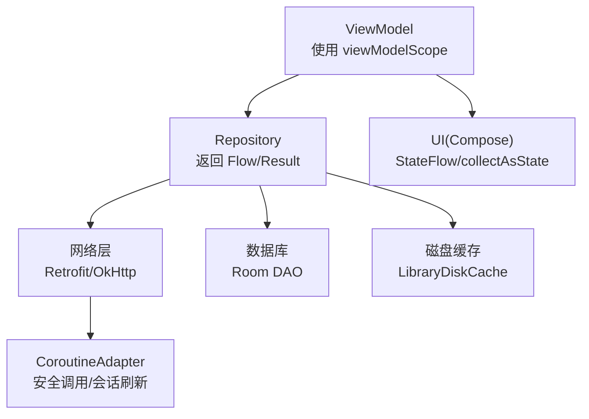
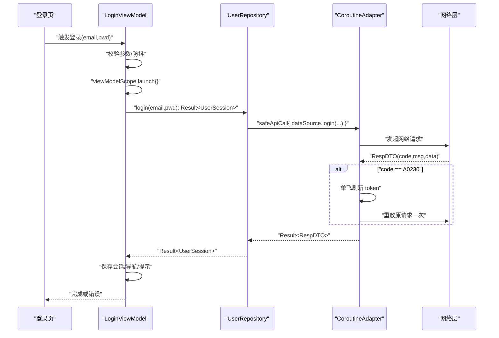
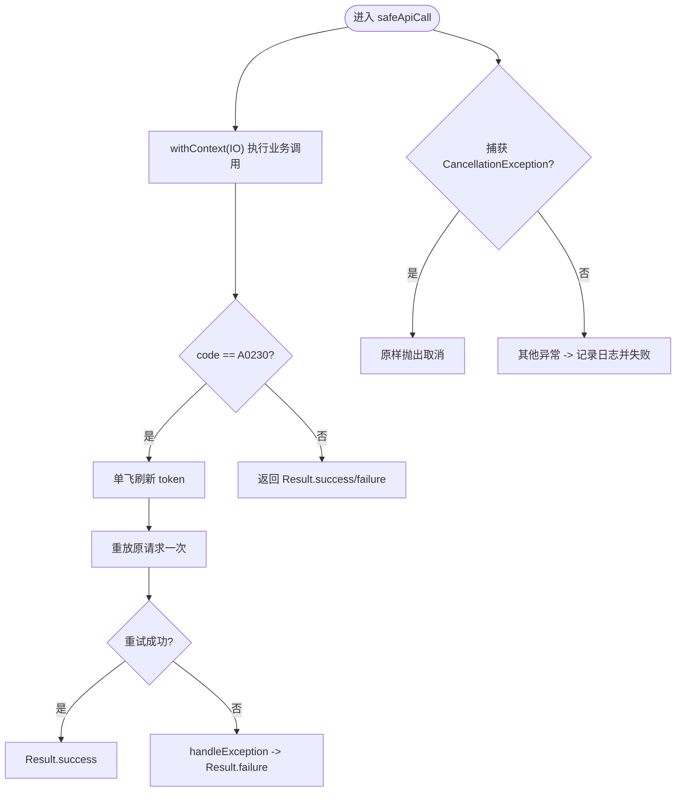
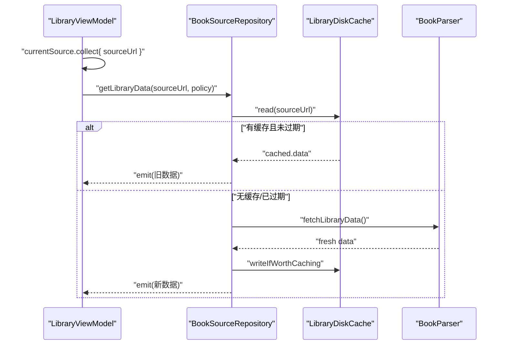
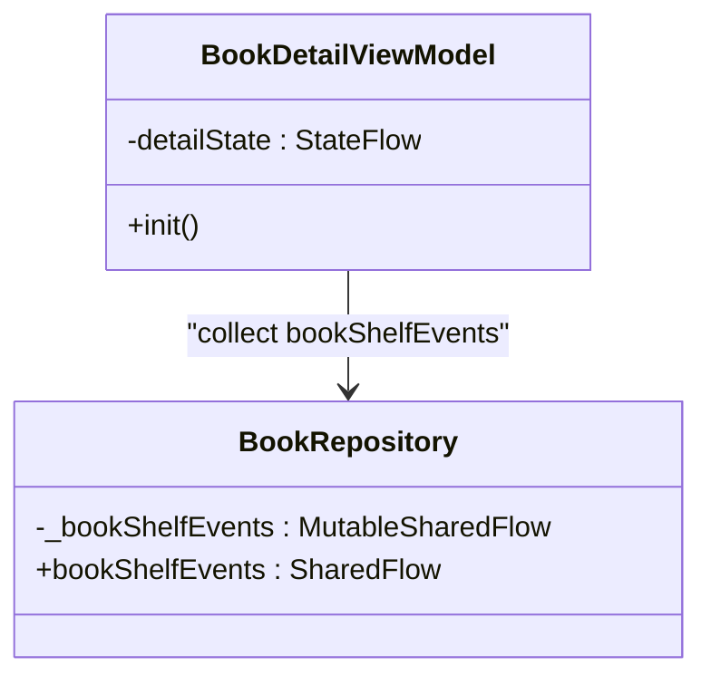
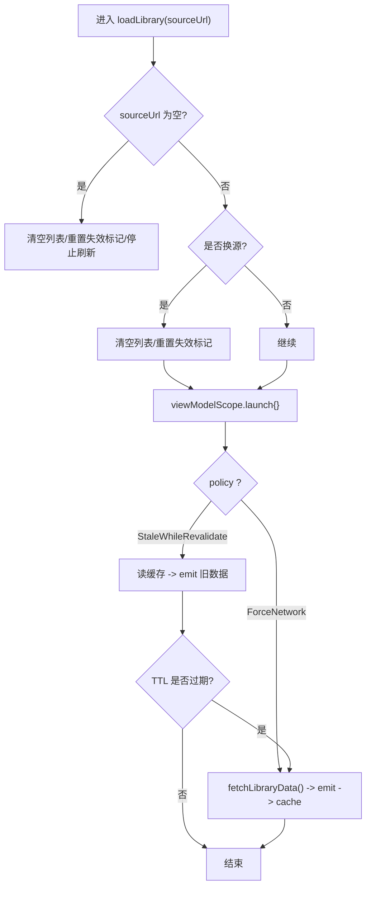
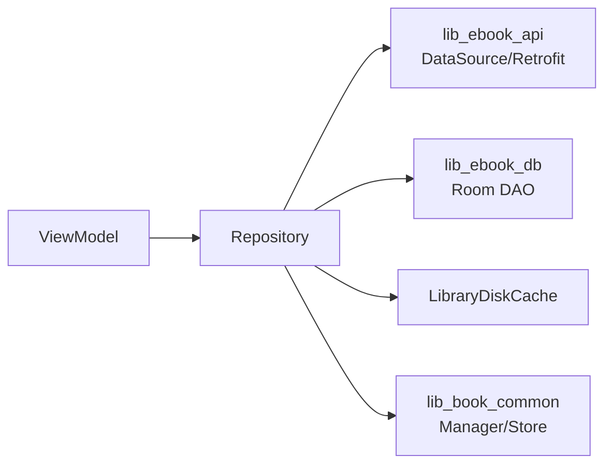

# 异步编程与协程Flow

<cite>
**本文档引用的文件**
- [LoginViewModel.kt](file://module_login/src/main/java/com/ebook/login/mvvm/viewmodel/LoginViewModel.kt)
- [UserRepository.kt](file://module_login/src/main/java/com/ebook/login/repository/UserRepository.kt)
- [CoroutineAdapter.kt](file://lib_ebook_api/src/main/java/com/ebook/api/utils/CoroutineAdapter.kt)
- [LibraryViewModel.kt](file://module_find/src/main/java/com/ebook/find/mvvm/viewmodel/LibraryViewModel.kt)
- [BookSourceRepository.kt](file://module_find/src/main/java/com/ebook/find/repository/BookSourceRepository.kt)
- [BookRepository.kt](file://lib_book_common/src/main/java/com/ebook/common/repository/BookRepository.kt)
- [BookDetailViewModel.kt](file://module_book/src/main/java/com/ebook/book/mvvm/viewmodel/BookDetailViewModel.kt)
</cite>

## 目录
1. [简介](#简介)
2. [项目结构](#项目结构)
3. [核心组件](#核心组件)
4. [架构总览](#架构总览)
5. [详细组件分析](#详细组件分析)
6. [依赖关系分析](#依赖关系分析)
7. [性能考虑](#性能考虑)
8. [故障排查指南](#故障排查指南)
9. [结论](#结论)

## 简介
本文件系统性梳理本项目中基于 Kotlin Coroutines 与 Flow 的异步编程实践，覆盖 suspend 函数设计、错误处理与取消传播、超时控制；Flow 操作符链与响应式数据流；SharedFlow 作为事件总线（背压、重试、状态同步）；作用域管理（viewModelScope/lifecycleScope/自定义作用域）；以及多任务编排（并发控制、依赖、结果聚合）。文档结合仓库中的 ViewModel、Repository、网络适配层等实际代码进行说明，并提供可视化图示与最佳实践建议。

## 项目结构
项目采用 MVVM + 模块化架构：
- UI 层（Activity/Compose）通过 viewModelScope 发起协程，订阅 StateFlow/Flow 驱动重组。
- ViewModel 负责 UI 状态组合与流程编排，调用 Repository。
- Repository 封装领域逻辑与外部依赖（网络、数据库、缓存），返回 Flow/Result。
- 网络层通过 CoroutineAdapter 统一封装安全调用、会话过期静默刷新与异常翻译。

**图表来源**
- [LibraryViewModel.kt:103-167](file://module_find/src/main/java/com/ebook/find/mvvm/viewmodel/LibraryViewModel.kt#L103-L167)
- [BookSourceRepository.kt:54-131](file://module_find/src/main/java/com/ebook/find/repository/BookSourceRepository.kt#L54-L131)
- [CoroutineAdapter.kt:29-112](file://lib_ebook_api/src/main/java/com/ebook/api/utils/CoroutineAdapter.kt#L29-L112)

**章节来源**
- [LibraryViewModel.kt:103-167](file://module_find/src/main/java/com/ebook/find/mvvm/viewmodel/LibraryViewModel.kt#L103-L167)
- [BookSourceRepository.kt:54-131](file://module_find/src/main/java/com/ebook/find/repository/BookSourceRepository.kt#L54-L131)
- [CoroutineAdapter.kt:29-112](file://lib_ebook_api/src/main/java/com/ebook/api/utils/CoroutineAdapter.kt#L29-L112)

## 核心组件
- 网络适配器 CoroutineAdapter：统一 IO 调度、业务码转换、A0230 会话过期静默刷新与重放、取消原样上抛。
- 仓库 BookSourceRepository：书库 SWR 策略（StaleWhileRevalidate/ForceNetwork）、TTL 缓存、失败兜底保留旧屏。
- 视图模型 LibraryViewModel：以 combine/map/stateIn 组合多路事实源，首帧 Unknown 占位，换源取消在途请求。
- 事件总线 BookRepository.bookShelfEvents：MutableSharedFlow 暴露 SharedFlow，用于跨模块书架事件分发。
- 详情页 BookDetailViewModel：StateFlow 驱动 UI 状态，收集 SharedFlow 实现幂等事件消费。

**章节来源**
- [CoroutineAdapter.kt:29-112](file://lib_ebook_api/src/main/java/com/ebook/api/utils/CoroutineAdapter.kt#L29-L112)
- [BookSourceRepository.kt:21-131](file://module_find/src/main/java/com/ebook/find/repository/BookSourceRepository.kt#L21-L131)
- [LibraryViewModel.kt:103-289](file://module_find/src/main/java/com/ebook/find/mvvm/viewmodel/LibraryViewModel.kt#L103-L289)
- [BookRepository.kt:75-77](file://lib_book_common/src/main/java/com/ebook/common/repository/BookRepository.kt#L75-L77)
- [BookDetailViewModel.kt:75-101](file://module_book/src/main/java/com/ebook/book/mvvm/viewmodel/BookDetailViewModel.kt#L75-L101)

## 架构总览
以下时序图展示一次登录流程中协程与 Flow 的协作：ViewModel 在 viewModelScope 中发起挂起调用，Repository 通过 CoroutineAdapter 进行安全调用与会话刷新，最终将 Result 回传并更新 UI。

**图表来源**
- [LoginViewModel.kt:45-73](file://module_login/src/main/java/com/ebook/login/mvvm/viewmodel/LoginViewModel.kt#L45-L73)
- [UserRepository.kt:50-55](file://module_login/src/main/java/com/ebook/login/repository/UserRepository.kt#L50-L55)
- [CoroutineAdapter.kt:41-112](file://lib_ebook_api/src/main/java/com/ebook/api/utils/CoroutineAdapter.kt#L41-L112)

**章节来源**
- [LoginViewModel.kt:45-73](file://module_login/src/main/java/com/ebook/login/mvvm/viewmodel/LoginViewModel.kt#L45-L73)
- [UserRepository.kt:50-55](file://module_login/src/main/java/com/ebook/login/repository/UserRepository.kt#L50-L55)
- [CoroutineAdapter.kt:41-112](file://lib_ebook_api/src/main/java/com/ebook/api/utils/CoroutineAdapter.kt#L41-L112)

## 详细组件分析

### suspend 函数设计与使用场景
- 设计原则
  - 所有网络与 IO 操作暴露为 suspend 函数，便于调用方自由组合与取消。
  - 仓库方法统一返回 Result<T>，将业务码与异常归一化，ViewModel 仅处理成败分支。
  - 取消原样上抛，避免将取消误判为业务失败。
- 典型用法
  - LoginViewModel 在 viewModelScope.launch 中调用 UserRepository.login，并处理 onSuccess/onFailure。
  - UserRepository 将所有 API 调用委托给 CoroutineAdapter.safeApiCall，内部做 IO 切换与异常处理。

**章节来源**
- [LoginViewModel.kt:45-73](file://module_login/src/main/java/com/ebook/login/mvvm/viewmodel/LoginViewModel.kt#L45-L73)
- [UserRepository.kt:35-84](file://module_login/src/main/java/com/ebook/login/repository/UserRepository.kt#L35-L84)
- [CoroutineAdapter.kt:41-62](file://lib_ebook_api/src/main/java/com/ebook/api/utils/CoroutineAdapter.kt#L41-L62)

### 错误处理、取消传播与超时控制
- 错误处理
  - 业务码 A0230 由 CoroutineAdapter 统一识别，执行单飞刷新并重放一次；刷新失败则发射 SessionExpired 事件交由全局处置。
  - 非业务异常经统一 handleException 包装为 ApiException，日志记录后返回 Result.failure。
- 取消传播
  - CancellationException 在各层不被吞掉，保持“取消即取消”的语义，防止误发会话过期事件或错误提示。
- 超时控制
  - 上层可结合 withTimeout 对耗时操作加保护（测试用例中使用），避免悬挂等待。

**图表来源**
- [CoroutineAdapter.kt:41-112](file://lib_ebook_api/src/main/java/com/ebook/api/utils/CoroutineAdapter.kt#L41-L112)

**章节来源**
- [CoroutineAdapter.kt:41-112](file://lib_ebook_api/src/main/java/com/ebook/api/utils/CoroutineAdapter.kt#L41-L112)

### Flow 操作符链与响应式数据处理
- 模式要点
  - 使用 map/filter/catch/stateIn 构建声明式数据流，保证 UI 只关注“如何渲染”。
  - SWR 策略：StaleWhileRevalidate 先命中缓存再后台重抓，下拉刷新强制网络。
  - flowOn 指定 IO 线程，确保阻塞型操作不阻塞主线程。
- 示例链路
  - BookSourceRepository.getLibraryData：按策略读取缓存/网络，发射 Flow<LibraryEntity>。
  - LibraryViewModel：combine(currentSource, _sourceUnusable) 计算页面状态；map+catch 加载分类列表；stateIn 热化流并设置初值。

**图表来源**
- [BookSourceRepository.kt:92-131](file://module_find/src/main/java/com/ebook/find/repository/BookSourceRepository.kt#L92-L131)
- [LibraryViewModel.kt:176-182](file://module_find/src/main/java/com/ebook/find/mvvm/viewmodel/LibraryViewModel.kt#L176-L182)

**章节来源**
- [BookSourceRepository.kt:21-131](file://module_find/src/main/java/com/ebook/find/repository/BookSourceRepository.kt#L21-L131)
- [LibraryViewModel.kt:103-182](file://module_find/src/main/java/com/ebook/find/mvvm/viewmodel/LibraryViewModel.kt#L103-L182)

### SharedFlow 作为事件总线
- 实现要点
  - 使用 MutableSharedFlow 暴露 SharedFlow，extraBufferCapacity 缓冲容量提升吞吐。
  - 订阅方在 viewModelScope 内 collect，确保生命周期安全与幂等消费。
- 应用场景
  - BookRepository 发布书架事件（添加/移除/进度更新/目录变更），详情页/书架页订阅并更新 UI。
  - 事件总线替代历史 RxBus，统一事件通道。

**图表来源**
- [BookRepository.kt:75-77](file://lib_book_common/src/main/java/com/ebook/common/repository/BookRepository.kt#L75-L77)
- [BookDetailViewModel.kt:75-101](file://module_book/src/main/java/com/ebook/book/mvvm/viewmodel/BookDetailViewModel.kt#L75-L101)

**章节来源**
- [BookRepository.kt:75-77](file://lib_book_common/src/main/java/com/ebook/common/repository/BookRepository.kt#L75-L77)
- [BookDetailViewModel.kt:75-101](file://module_book/src/main/java/com/ebook/book/mvvm/viewmodel/BookDetailViewModel.kt#L75-L101)

### 协程作用域管理
- viewModelScope
  - ViewModel 内统一使用 viewModelScope.launch 启动任务，随 ViewModel 销毁自动取消。
  - 登录流程、书库加载、详情初始化均遵循此模式。
- lifecycleScope
  - 在 Activity/Fragment 中可使用 lifecycleScope 绑定生命周期（本仓库更倾向 Compose + ViewModel 模式）。
- 自定义作用域
  - 对于后台任务或需要独立生命周期的场景，可创建自定义 CoroutineScope（例如服务、协调器），注意显式取消与错误边界。

**章节来源**
- [LoginViewModel.kt:55-73](file://module_login/src/main/java/com/ebook/login/mvvm/viewmodel/LoginViewModel.kt#L55-L73)
- [LibraryViewModel.kt:195-212](file://module_find/src/main/java/com/ebook/find/mvvm/viewmodel/LibraryViewModel.kt#L195-L212)
- [BookDetailViewModel.kt:75-101](file://module_book/src/main/java/com/ebook/book/mvvm/viewmodel/BookDetailViewModel.kt#L75-L101)

### 异步任务的编排与组合
- 并发控制
  - 换源时取消在途 loadJob，避免慢请求覆盖新源数据。
  - 分类入口加载失败仅记日志并返回空列表，保证页面可用性。
- 任务依赖
  - currentSource 变化驱动书库加载；switchSource 持久化默认源后，由订阅者自动拉取数据。
- 结果聚合
  - combine(currentSource, _sourceUnusable) 合成页面状态；map+catch 构建分类列表流。

**图表来源**
- [LibraryViewModel.kt:239-289](file://module_find/src/main/java/com/ebook/find/mvvm/viewmodel/LibraryViewModel.kt#L239-L289)
- [BookSourceRepository.kt:92-131](file://module_find/src/main/java/com/ebook/find/repository/BookSourceRepository.kt#L92-L131)

**章节来源**
- [LibraryViewModel.kt:195-289](file://module_find/src/main/java/com/ebook/find/mvvm/viewmodel/LibraryViewModel.kt#L195-L289)
- [BookSourceRepository.kt:92-131](file://module_find/src/main/java/com/ebook/find/repository/BookSourceRepository.kt#L92-L131)

## 依赖关系分析
- 耦合与内聚
  - ViewModel 与 Repository 松耦合：ViewModel 仅依赖抽象接口（BaseRefreshViewModel），Repository 封装具体实现。
  - 网络层与业务解耦：CoroutineAdapter 屏蔽会话刷新细节，Repository 无需感知 token 刷新。
- 外部依赖
  - Retrofit/OkHttp：通过 DataSource 暴露 suspend API。
  - Room：DAO 提供 Flow<List<T>> 供观察。
  - 缓存：LibraryDiskCache 提供文件级缓存读写。
- 循环依赖
  - 模块间依赖方向明确：业务模块 → lib_book_common → (lib_ebook_api, lib_ebook_db)，无反向依赖。

**图表来源**
- [BookSourceRepository.kt:54-131](file://module_find/src/main/java/com/ebook/find/repository/BookSourceRepository.kt#L54-L131)
- [BookRepository.kt:52-77](file://lib_book_common/src/main/java/com/ebook/common/repository/BookRepository.kt#L52-L77)

**章节来源**
- [BookSourceRepository.kt:54-131](file://module_find/src/main/java/com/ebook/find/repository/BookSourceRepository.kt#L54-L131)
- [BookRepository.kt:52-77](file://lib_book_common/src/main/java/com/ebook/common/repository/BookRepository.kt#L52-L77)

## 性能考虑
- 线程调度
  - 网络与 IO 操作通过 Dispatchers.IO 执行，避免阻塞主线程。
- 缓存策略
  - SWR 策略减少白屏与重复请求；TTL 平衡新鲜度与频率。
- 背压与缓冲
  - SharedFlow 设置 extraBufferCapacity 提高事件吞吐，避免丢失高频事件。
- 取消优化
  - 换源时 cancel 在途 Job，避免无效计算与内存泄漏。
- 资源释放
  - 流收集在 viewModelScope 内，随 VM 销毁自动取消；Service 中严格限制 onTimeout 耗时。

[本节为通用指导，无需特定文件引用]

## 故障排查指南
- 会话过期无法恢复
  - 现象：页面反复报错但不跳转登录。
  - 排查：确认 CoroutineAdapter 是否正确发射 SessionExpired 事件，全局订阅方是否清会话并跳转。
  - 参考：会话刷新失败路径与事件发射。
- 书城首帧空白或误导文案
  - 现象：冷启动显示“没有书源”或空内容。
  - 排查：确认 LibraryViewModel.sourceState 首帧为 Unknown，且 combine 正确落定 Ready/NoSource/BrokenSource。
- 换源后列表残留旧数据
  - 现象：切换书源但书目未清空。
  - 排查：确认 loadLibrary 在换源时清空列表并 cancel 旧 Job。
- 分类入口加载失败
  - 现象：分类胶囊缺失。
  - 排查：检查 catch 分支是否记录日志并返回空列表，避免中断整个流。

**章节来源**
- [CoroutineAdapter.kt:64-112](file://lib_ebook_api/src/main/java/com/ebook/api/utils/CoroutineAdapter.kt#L64-L112)
- [LibraryViewModel.kt:159-182](file://module_find/src/main/java/com/ebook/find/mvvm/viewmodel/LibraryViewModel.kt#L159-L182)
- [LibraryViewModel.kt:239-289](file://module_find/src/main/java/com/ebook/find/mvvm/viewmodel/LibraryViewModel.kt#L239-L289)

## 结论
本项目以 Coroutines + Flow 为核心构建异步与响应式体系：
- suspend 函数提供清晰的异步边界，配合 Result 统一错误处理。
- Flow 操作符链实现声明式数据流，SWR 策略与 stateIn 热化提升用户体验。
- SharedFlow 作为事件总线，支持背压与跨模块状态同步。
- 作用域管理遵循生命周期安全，取消传播正确，避免资源泄漏。
- 通过合理的并发控制与缓存策略，保障性能与稳定性。

遵循上述模式与实践，可在复杂业务场景中构建健壮、可维护的异步系统。