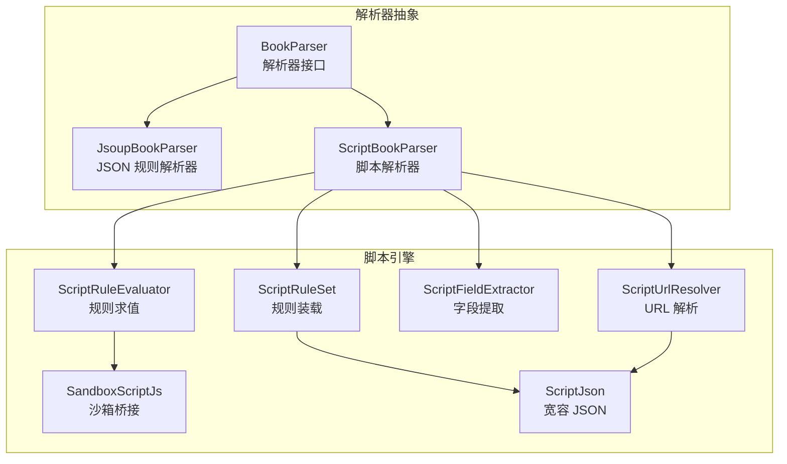
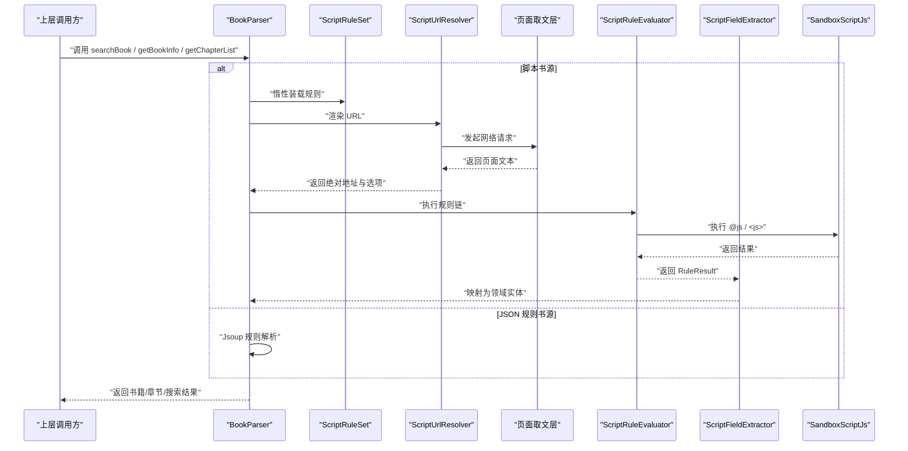
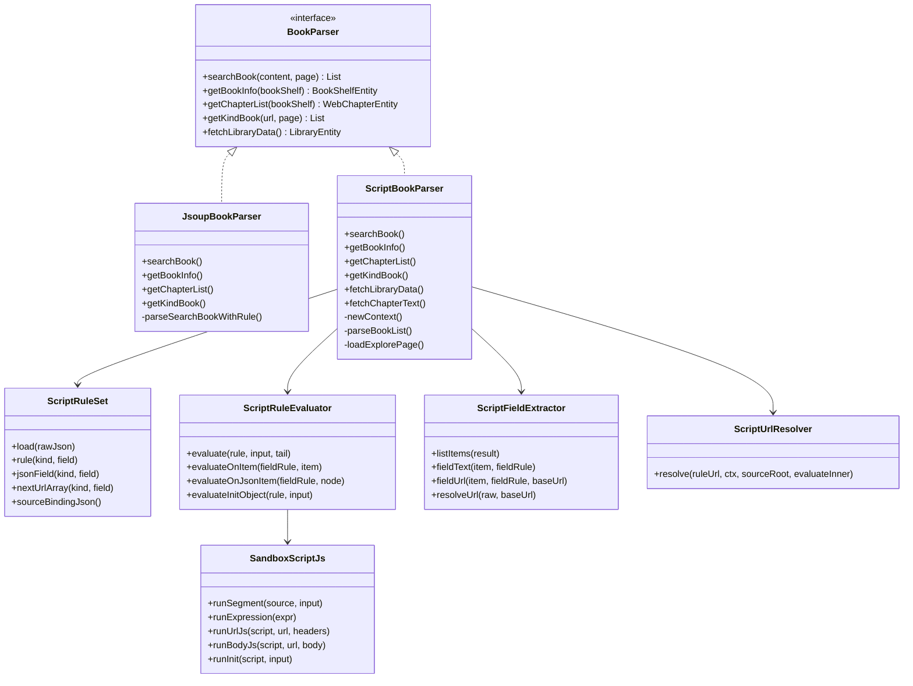
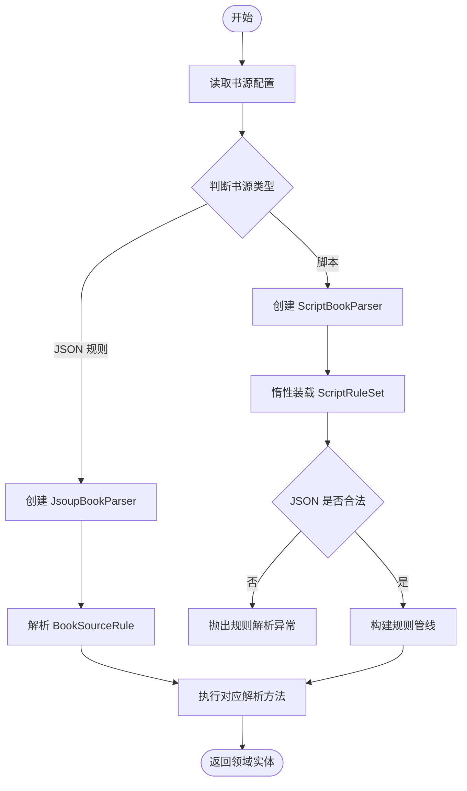

# 书源解析引擎

<cite>
**本文引用的文件**   
- [BookParser.kt](file://lib_book_source/src/main/java/com/ebook/source/analyze/BookParser.kt)
- [JsoupBookParser.kt](file://lib_book_source/src/main/java/com/ebook/source/analyze/JsoupBookParser.kt)
- [ScriptBookParser.kt](file://lib_book_source/src/main/java/com/ebook/source/analyze/ScriptBookParser.kt)
- [ScriptRuleSet.kt](file://lib_book_source/src/main/java/com/ebook/source/script/ScriptRuleSet.kt)
- [ScriptRuleEvaluator.kt](file://lib_book_source/src/main/java/com/ebook/source/script/ScriptRuleEvaluator.kt)
- [ScriptFieldExtractor.kt](file://lib_book_source/src/main/java/com/ebook/source/script/ScriptFieldExtractor.kt)
- [ScriptUrlResolver.kt](file://lib_book_source/src/main/java/com/ebook/source/script/ScriptUrlResolver.kt)
- [SandboxScriptJs.kt](file://lib_book_source/src/main/java/com/ebook/source/script/SandboxScriptJs.kt)
- [ScriptJson.kt](file://lib_book_source/src/main/java/com/ebook/source/script/ScriptJson.kt)
</cite>

## 目录

1. [引言](#引言)
2. [项目结构](#项目结构)
3. [核心组件](#核心组件)
4. [架构总览](#架构总览)
5. [详细组件分析](#详细组件分析)
6. [依赖关系分析](#依赖关系分析)
7. [性能与选择策略](#性能与选择策略)
8. [书源加载流程](#书源加载流程)
9. [声明式 JSON 语法规范](#声明式-json-语法规范)
10. [JavaScript 脚本执行上下文](#javascript-脚本执行上下文)
11. [书源开发指南](#书源开发指南)
12. [故障排查](#故障排查)
13. [结论](#结论)

## 引言

本仓库中的书源系统为“零内置书源”的扩展型阅读应用提供统一的数据接入层。它通过 `BookParser` 接口暴露搜索、详情、目录、发现书库和正文五个能力，并支持两种实现：

- **JSON 规则解析器**：基于 Jsoup 的规则驱动 HTML 解析，适合结构化、可声明的站点。
- **JavaScript 脚本解析器**：在沙箱中执行用户脚本，适合复杂动态页面、非标准结构或需要自定义网络请求行为的站点。

两者共享同一套领域模型（书籍、章节、搜索条目等），但数据获取与转换路径不同。文档后续会重点说明双引擎的设计边界、JSON 语法规则、JS 执行上下文、加载链路以及开发实践。

## 项目结构

与书源解析直接相关的代码集中在 `lib_book_source` 模块：

**图表来源**
- [BookParser.kt:1-30](file://lib_book_source/src/main/java/com/ebook/source/analyze/BookParser.kt#L1-L30)
- [JsoupBookParser.kt:1-200](file://lib_book_source/src/main/java/com/ebook/source/analyze/JsoupBookParser.kt#L1-L200)
- [ScriptBookParser.kt:1-200](file://lib_book_source/src/main/java/com/ebook/source/analyze/ScriptBookParser.kt#L1-L200)
- [ScriptRuleSet.kt:1-200](file://lib_book_source/src/main/java/com/ebook/source/script/ScriptRuleSet.kt#L1-L200)
- [ScriptRuleEvaluator.kt:1-200](file://lib_book_source/src/main/java/com/ebook/source/script/ScriptRuleEvaluator.kt#L1-L200)
- [ScriptFieldExtractor.kt:1-90](file://lib_book_source/src/main/java/com/ebook/source/script/ScriptFieldExtractor.kt#L1-L90)
- [ScriptUrlResolver.kt:1-133](file://lib_book_source/src/main/java/com/ebook/source/script/ScriptUrlResolver.kt#L1-L133)
- [SandboxScriptJs.kt:1-200](file://lib_book_source/src/main/java/com/ebook/source/script/SandboxScriptJs.kt#L1-L200)
- [ScriptJson.kt:1-11](file://lib_book_source/src/main/java/com/ebook/source/script/ScriptJson.kt#L1-L11)

**章节来源**
- [BookParser.kt:1-30](file://lib_book_source/src/main/java/com/ebook/source/analyze/BookParser.kt#L1-L30)
- [JsoupBookParser.kt:1-200](file://lib_book_source/src/main/java/com/ebook/source/analyze/JsoupBookParser.kt#L1-L200)
- [ScriptBookParser.kt:1-200](file://lib_book_source/src/main/java/com/ebook/source/analyze/ScriptBookParser.kt#L1-L200)

## 核心组件

### BookParser 解析器接口

`BookParser` 是书源对外暴露的统一能力面，所有书源都必须实现这五个方法：

| 方法 | 职责 | 输入 | 输出 |
|---|---|---|---|
| `searchBook` | 关键词搜索 | 关键词、页码 | 搜索条目列表 |
| `getBookInfo` | 获取书籍详情 | 书架实体 | 填充详情的书架实体 |
| `getChapterList` | 拉取章节目录 | 书架实体 | 带章节列表的结果 |
| `getKindBook` | 分类发现 | 分类 URL、页码 | 搜索条目列表 |
| `fetchLibraryData` | 书城首屏分类书目 | 无业务参数 | 书库实体 |

该接口把“网络获取 + 规则解析”与上层 UI、缓存、聚合搜索解耦。调用方只关心“能不能拿到书籍数据”，不关心底层是 Jsoup 还是 JavaScript。

**章节来源**
- [BookParser.kt:1-30](file://lib_book_source/src/main/java/com/ebook/source/analyze/BookParser.kt#L1-L30)

### JsoupBookParser：JSON 规则解析器

`JsoupBookParser` 是传统的声明式解析器。它接收一个 `BookSourceRule`，使用 Jsoup 解析 HTML，并通过一组规则对象完成：

- 搜索列表解析；
- 书籍详情解析；
- 目录翻页与章节收集；
- 分类发现；
- 书城书库数据抓取。

其关键设计点包括：

- 搜索 URL 支持模板变量与页码换算；
- 详情页可选 `tocUrl`，未配置时回落详情页地址；
- 目录支持反序；
- 分类发现优先使用独立 `ruleFind.ruleSearch`，否则回落到通用搜索规则；
- 书库抓取按分类逐页拉取，单个分类失败不影响其他分类。

**章节来源**
- [JsoupBookParser.kt:1-200](file://lib_book_source/src/main/java/com/ebook/source/analyze/JsoupBookParser.kt#L1-L200)

### ScriptBookParser：脚本解析器

`ScriptBookParser` 是脚本书源的 `BookParser` 实现。它负责把原始 JSON 装配成可执行的解析管线：

- 惰性装载 `ScriptRuleSet`；
- 构建页面取文门面；
- 生成允许访问的 Host 白名单；
- 管理沙箱网络守卫、会话 Cookie；
- 构造解析任务级 `EvalContext`；
- 实现搜索、详情、目录、发现、书库、正文六个入口。

脚本解析器的一个重要语义是：**构造期不抛异常**。只有真正执行解析时，才会对非法 JSON 抛出类型化错误。这样可以区分“书源行存在但 JSON 坏”和“书源不存在”。

**章节来源**
- [ScriptBookParser.kt:1-200](file://lib_book_source/src/main/java/com/ebook/source/analyze/ScriptBookParser.kt#L1-L200)
- [ScriptBookParser.kt:200-468](file://lib_book_source/src/main/java/com/ebook/source/analyze/ScriptBookParser.kt#L200-L468)

## 架构总览

书源解析引擎采用“接口抽象 + 双实现 + 规则装载 + 规则求值 + 字段提取 + URL 解析 + 沙箱桥接”的分层结构：

**图表来源**
- [ScriptBookParser.kt:1-200](file://lib_book_source/src/main/java/com/ebook/source/analyze/ScriptBookParser.kt#L1-L200)
- [ScriptRuleSet.kt:1-200](file://lib_book_source/src/main/java/com/ebook/source/script/ScriptRuleSet.kt#L1-L200)
- [ScriptUrlResolver.kt:1-133](file://lib_book_source/src/main/java/com/ebook/source/script/ScriptUrlResolver.kt#L1-L133)
- [ScriptRuleEvaluator.kt:1-200](file://lib_book_source/src/main/java/com/ebook/source/script/ScriptRuleEvaluator.kt#L1-L200)
- [ScriptFieldExtractor.kt:1-90](file://lib_book_source/src/main/java/com/ebook/source/script/ScriptFieldExtractor.kt#L1-L90)
- [SandboxScriptJs.kt:1-200](file://lib_book_source/src/main/java/com/ebook/source/script/SandboxScriptJs.kt#L1-L200)

## 详细组件分析

### 声明式 JSON 规则装载

`ScriptRuleSet` 是脚本书源规则的装载视图。它从原始 JSON 中提取：

- 顶层元信息：名称、分组、类型、启用状态；
- 顶层 URL：`searchUrl`、`exploreUrl`；
- 源级配置：`variable`、`header`、注释、登录地址、更新时间；
- 六类规则对象：搜索、发现、详情、目录、内容；
- 非常规字段与不支持能力标记。

它同时保留原始 JSON 节点，以便在求值阶段处理数组形态、未知键等“宽松语料”。

| 类别 | JSON 键 | 用途 |
|---|---|---|
| 搜索规则 | `ruleSearch` | 搜索列表与条目字段 |
| 发现规则 | `ruleExplore` | 分类发现条目字段 |
| 详情规则 | `ruleBookInfo` | 书籍详情字段与 `init` |
| 目录规则 | `ruleToc` | 章节索引与翻页 |
| 内容规则 | `ruleContent` | 正文分页与净化 |

**章节来源**
- [ScriptRuleSet.kt:1-200](file://lib_book_source/src/main/java/com/ebook/source/script/ScriptRuleSet.kt#L1-L200)

### 规则表达式求值

`ScriptRuleEvaluator` 是规则引擎的核心分发器。它负责：

- 展开 `{{}}` 占位符；
- 切分规则为 AST；
- 组合 `||`、`&&`、`%%`；
- 分发到各模式后端；
- 应用替换段 `##`；
- 回填 URL 尾段选项；
- 支持 `@put:` 与 `@get:` 变量。

支持的规则模式包括：

| 模式 | 含义 | 适用场景 |
|---|---|---|
| 默认链式 | 类似 CSS 的选择链 | HTML 元素定位 |
| CSS | 显式 CSS 选择器 | 简单选择器匹配 |
| JSONPath | 针对 JSON 节点的查询 | API 响应或内嵌 JSON |
| 正则 AllInOne | 多字段一次性正则匹配 | 传统 TXT 流站点 |
| JavaScript | 在沙箱中执行脚本 | 复杂逻辑与动态页面 |
| XPath | 尚未落地 | 未来扩展 |

当某个分支没有取值时，`||` 短路到下一个分支；全部分支都失败时，如果最后一个分支有语法错误，则抛出类型化异常而不是静默 Miss。

**章节来源**
- [ScriptRuleEvaluator.kt:1-200](file://lib_book_source/src/main/java/com/ebook/source/script/ScriptRuleEvaluator.kt#L1-L200)
- [ScriptRuleEvaluator.kt:200-367](file://lib_book_source/src/main/java/com/ebook/source/script/ScriptRuleEvaluator.kt#L200-L367)

### 字段提取与条目收敛

`ScriptFieldExtractor` 承担“列表结果 → 条目 → 字段值”的收敛工作。它统一处理四种上下文：

| 上下文 | 来源 | 典型场景 |
|---|---|---|
| DOM 元素 | 链式/CSS 规则 | HTML 列表项 |
| 正则捕获组 | AllInOne 正则 | 文本流多字段 |
| JSON 节点 | JSONPath | API 或内嵌 JSON |
| 纯文本 | 文本流规则 | TXT 站点的连续段落 |

URL 字段会通过 `resolveUrl` 做相对落位，并支持 URL 尾段选项。列表字段的末段裸词走 CSS 选择器口径，单值字段的末段裸词走属性取值器口径。

**章节来源**
- [ScriptFieldExtractor.kt:1-90](file://lib_book_source/src/main/java/com/ebook/source/script/ScriptFieldExtractor.kt#L1-L90)

### URL 解析与选项

`ScriptUrlResolver` 负责把规则中的 URL 字符串转换为“绝对地址 + 请求选项”。它的处理顺序很关键：

1. 若整条 URL 是 JS 规则，先求值出地址文本；
2. 展开 `{{}}` 占位符；
3. 剥离 URL 尾段选项；
4. 处理 `<分隔符,内容>` 页码形态；
5. 相对落位到源根；
6. 解析尾段 JSON 选项。

URL 尾段用于传递请求头、编码、POST body 等网络选项。JS 生成的 URL 同样支持尾段，但其中的 `<...,...>` 不再被当作页码段——因为那是脚本产出的数据，不是作者写的 URL 模板。

**章节来源**
- [ScriptUrlResolver.kt:1-133](file://lib_book_source/src/main/java/com/ebook/source/script/ScriptUrlResolver.kt#L1-L133)

### JavaScript 沙箱桥接

`SandboxScriptJs` 是脚本引擎与沙箱执行环境之间的桥接层。它把规则层的输入包装成沙箱能理解的帧，再把返回值还原为规则层结果。主要能力包括：

- 执行片段脚本 `runSegment`；
- 计算表达式 `runExpression`；
- 改写 URL 与请求头 `runUrlJs`；
- 改写响应体 `runBodyJs`；
- 初始化详情字段对象 `runInit`；
- 管理静态绑定与运行时绑定；
- 委派网络请求给 `JsNetworkGuard` 与 `SourceCookieJar`。

脚本可见的变量包括 `result`、`baseUrl`、`key`、`page`、`src`、`title`、`chapterJson`、`sourceJson` 等。其中部分变量只在特定链路可用，例如 `chapterJson` 和 `title` 在正文读取前通常不可用。

**章节来源**
- [SandboxScriptJs.kt:1-200](file://lib_book_source/src/main/java/com/ebook/source/script/SandboxScriptJs.kt#L1-L200)

## 依赖关系分析

**图表来源**
- [BookParser.kt:1-30](file://lib_book_source/src/main/java/com/ebook/source/analyze/BookParser.kt#L1-L30)
- [JsoupBookParser.kt:1-200](file://lib_book_source/src/main/java/com/ebook/source/analyze/JsoupBookParser.kt#L1-L200)
- [ScriptBookParser.kt:1-200](file://lib_book_source/src/main/java/com/ebook/source/analyze/ScriptBookParser.kt#L1-L200)
- [ScriptRuleSet.kt:1-200](file://lib_book_source/src/main/java/com/ebook/source/script/ScriptRuleSet.kt#L1-L200)
- [ScriptRuleEvaluator.kt:1-200](file://lib_book_source/src/main/java/com/ebook/source/script/ScriptRuleEvaluator.kt#L1-L200)
- [ScriptFieldExtractor.kt:1-90](file://lib_book_source/src/main/java/com/ebook/source/script/ScriptFieldExtractor.kt#L1-L90)
- [ScriptUrlResolver.kt:1-133](file://lib_book_source/src/main/java/com/ebook/source/script/ScriptUrlResolver.kt#L1-L133)
- [SandboxScriptJs.kt:1-200](file://lib_book_source/src/main/java/com/ebook/source/script/SandboxScriptJs.kt#L1-L200)

**章节来源**
- [BookParser.kt:1-30](file://lib_book_source/src/main/java/com/ebook/source/analyze/BookParser.kt#L1-L30)
- [ScriptBookParser.kt:1-200](file://lib_book_source/src/main/java/com/ebook/source/analyze/ScriptBookParser.kt#L1-L200)

## 性能与选择策略

### 两种解析模式对比

| 维度 | JSON 规则解析器 | JavaScript 脚本解析器 |
|---|---|---|
| 解析方式 | Jsoup + 声明式规则 | JavaScript 引擎 + 沙箱 |
| 学习成本 | 较低，规则直观 | 较高，需要理解规则链、JS 上下文、Host API |
| 表达能力 | 适合结构化 HTML 与常见列表/详情/目录 | 适合动态渲染、复杂逻辑、自定义网络行为 |
| 执行开销 | 较小，主要为 DOM 解析与规则遍历 | 较大，涉及脚本编译、沙箱隔离、可能跨进程 |
| 调试难度 | 中等，可通过规则分段测试 | 较高，需结合日志、回放与断言 |
| 安全边界 | 规则由宿主执行 | 脚本在沙箱中执行，受白名单与限流约束 |
| 维护性 | 规则变更影响范围明确 | 脚本变更可能改变整体行为，风险更高 |

### 选择策略

建议按以下优先级选择：

1. **优先使用 JSON 规则**：如果站点结构稳定、HTML 可被选择器或 JSONPath 表达，应优先写声明式规则。
2. **局部使用 JavaScript**：仅在必要位置使用 `@js:` 或 `<js>`，例如 URL 改写、正文净化、复杂条件判断。
3. **整源脚本仅用于复杂站点**：如果站点大量使用动态渲染、加密参数、非标准分页，才考虑整源脚本。
4. **避免滥用脚本**：脚本越复杂，越难回归验证；应尽量把固定逻辑下沉到规则，把可变逻辑留在脚本。

**章节来源**
- [JsoupBookParser.kt:1-200](file://lib_book_source/src/main/java/com/ebook/source/analyze/JsoupBookParser.kt#L1-L200)
- [ScriptBookParser.kt:1-200](file://lib_book_source/src/main/java/com/ebook/source/analyze/ScriptBookParser.kt#L1-L200)
- [ScriptRuleEvaluator.kt:1-200](file://lib_book_source/src/main/java/com/ebook/source/script/ScriptRuleEvaluator.kt#L1-L200)

## 书源加载流程

书源从配置到解析的执行链路如下：

**图表来源**
- [JsoupBookParser.kt:1-200](file://lib_book_source/src/main/java/com/ebook/source/analyze/JsoupBookParser.kt#L1-L200)
- [ScriptBookParser.kt:1-200](file://lib_book_source/src/main/java/com/ebook/source/analyze/ScriptBookParser.kt#L1-L200)
- [ScriptRuleSet.kt:1-200](file://lib_book_source/src/main/java/com/ebook/source/script/ScriptRuleSet.kt#L1-L200)

关键点：

- 脚本书源构造期不执行规则装载；
- 首次调用解析方法时才触发 `ScriptRuleSet.load`；
- 非法 JSON 以类型化异常报告，而不是让调用方误判为“书源不存在”；
- 网络请求统一经过沙箱网络守卫与 Host 白名单；
- URL 尾段选项在网络层消费，不在规则求值层拼接。

**章节来源**
- [ScriptBookParser.kt:1-200](file://lib_book_source/src/main/java/com/ebook/source/analyze/ScriptBookParser.kt#L1-L200)
- [ScriptRuleSet.kt:1-200](file://lib_book_source/src/main/java/com/ebook/source/script/ScriptRuleSet.kt#L1-L200)

## 声明式 JSON 语法规范

### 顶层字段

脚本书源的顶层 JSON 包含元信息与两类 URL：

| 字段 | 类型 | 说明 |
|---|---|---|
| `name` | 字符串 | 书源显示名称 |
| `group` | 字符串 | 分组名 |
| `type` | 数字 | 书源类型 |
| `enabled` | 布尔值 | 是否启用 |
| `enabledExplore` | 布尔值 | 是否启用发现 |
| `searchUrl` | 字符串 | 搜索地址模板 |
| `exploreUrl` | 字符串 | 发现地址模板 |
| `variable` | 字符串 | 源级自定义变量 JSON 串 |
| `variableComment` | 字符串 | 变量说明文本 |
| `header` | 字符串 | 请求头 JSON 串 |
| `bookSourceComment` | 字符串 | 书源注释 |
| `loginUrl` | 字符串 | 登录地址 |
| `lastUpdateTime` | 字符串 | 最后更新时间原文 |

### 规则对象

六种核心规则对象分别对应数据链路的不同阶段：

| 规则对象 | 字段示例 | 作用 |
|---|---|---|
| `ruleSearch` | `bookList`、`name`、`author`、`bookUrl`、`coverUrl`、`intro` | 搜索条目列表与字段 |
| `ruleExplore` | 同 `ruleSearch` | 分类发现条目字段 |
| `ruleBookInfo` | `name`、`author`、`intro`、`coverUrl`、`tocUrl`、`init` | 书籍详情字段与预处理 |
| `ruleToc` | `nameList`、`urlList`、`nextTocUrl` | 章节目录与翻页 |
| `ruleContent` | `content`、`nextContentUrl`、`replaceRegex` | 正文内容与下一页 |

### 字段映射

字段映射遵循“列表字段 → 条目上下文 → 子字段规则”的流程：

1. 使用列表规则取出条目集合；
2. 每个条目作为上下文；
3. 对每个字段执行字段规则；
4. URL 字段进行相对落位；
5. 空值按规格收敛为空串或空列表；
6. 最终映射为 `SearchBookEntity` 或 `BookInfoEntity`。

### 规则表达式

规则表达式支持：

- 占位符 `{{key}}`、`{{page}}`、`{{baseUrl}}`、`{{变量名}}`；
- 递归求值 `@@规则`；
- 规则组合 `||`、`&&`、`%%`；
- 链式选择器；
- CSS 选择器；
- JSONPath；
- 正则 AllInOne；
- JavaScript 片段；
- 替换段 `##`；
- URL 尾段选项。

### 数据转换

数据转换分为两个层次：

- **规则层转换**：选择、过滤、合并、替换、变量写入；
- **字段层转换**：列表收敛、URL 落位、首值取数、空值兜底。

规则层不替调用方做“单值字段取第一个”的收敛；这个动作由字段提取层统一处理。

**章节来源**
- [ScriptRuleSet.kt:1-200](file://lib_book_source/src/main/java/com/ebook/source/script/ScriptRuleSet.kt#L1-L200)
- [ScriptFieldExtractor.kt:1-90](file://lib_book_source/src/main/java/com/ebook/source/script/ScriptFieldExtractor.kt#L1-L90)
- [ScriptRuleEvaluator.kt:1-200](file://lib_book_source/src/main/java/com/ebook/source/script/ScriptRuleEvaluator.kt#L1-L200)

## JavaScript 脚本执行上下文

### 执行上下文

脚本执行通过 `EvalContext` 提供上下文信息，包括：

| 变量 | 含义 | 可用性 |
|---|---|---|
| `baseUrl` | 当前基准 URL | 始终可用 |
| `key` | 搜索关键词 | 搜索链路可用 |
| `page` | 当前页码 | 始终可用 |
| `result` | 当前输入或片段结果 | 片段脚本可用 |
| `src` | 页面原文 | 视实现而定 |
| `title` | 章名 | 正文读取前通常不可用 |
| `chapterJson` | 章节信息 JSON | 正文读取前通常不可用 |
| `sourceJson` | 书源元信息 JSON | 全局可用 |

### Host API 白名单

脚本的网络访问必须经过 Host 白名单。白名单由书源 URL 与规则文本导出，目的是限制脚本只能访问可信域名。外呼走主进程代发，不直接开放任意 Java 调用。

### 变量传递机制

变量传递有三种形态：

1. **规则级变量**：通过 `@put:{键:"规则"}` 写入 `EvalContext.variables`；
2. **源级变量**：通过 `source.variable` 声明，脚本侧通过 `source.getVariable()` 读取；
3. **上下文绑定**：通过 `EvalContext` 传入的静态绑定与运行时绑定。

`@put:` 的值是同一次求值的输入上求得的 `firstText()`，因此同名后写覆盖先写，且多匹配不会存入变量表。

### URL 与正文重写

脚本可以在 URL 层改写请求地址与请求头，也可以在正文层改写响应体：

- `runUrlJs`：返回新 URL 与新请求头；
- `runBodyJs`：返回新的正文文本；
- `runInit`：返回详情字段对象；
- `runSegment`：返回文本、文本数组或对象。

URL 改写要求返回明确的 `url`；如果没有给出，视为执行失败，而不是回退原地址。

**章节来源**
- [ScriptBookParser.kt:1-200](file://lib_book_source/src/main/java/com/ebook/source/analyze/ScriptBookParser.kt#L1-L200)
- [SandboxScriptJs.kt:1-200](file://lib_book_source/src/main/java/com/ebook/source/script/SandboxScriptJs.kt#L1-L200)
- [ScriptRuleEvaluator.kt:200-367](file://lib_book_source/src/main/java/com/ebook/source/script/ScriptRuleEvaluator.kt#L200-L367)

## 书源开发指南

### JSON 规则书源开发步骤

1. 确定站点结构：搜索页、详情页、目录页、正文页。
2. 编写 `ruleSearch.bookList`：选中列表容器。
3. 编写条目字段：`name`、`author`、`bookUrl`、`coverUrl`、`intro`。
4. 编写 `ruleBookInfo`：详情字段与可选 `init`。
5. 编写 `ruleToc`：章节列表与下一页规则。
6. 如需发现功能，补充 `ruleExplore`。
7. 如需书城首页，配置 `exploreUrl`。
8. 使用单元测试或真实语料验证。

推荐优先使用链式选择器或 JSONPath，只有在必要时才引入 JavaScript。

### JavaScript 脚本书源开发步骤

1. 确认站点是否无法用声明式规则表达。
2. 优先将固定选择逻辑放入规则，脚本只处理动态部分。
3. 使用 `@js:` 追加后处理，或使用 `<js>` 包裹中间逻辑。
4. 使用 `baseUrl`、`key`、`page` 等上下文变量。
5. 通过 URL 尾段或 `runUrlJs` 设置请求头。
6. 通过 `runBodyJs` 处理加密或压缩正文。
7. 使用 Host 白名单允许的域名。
8. 记录关键日志，避免在脚本中吞掉异常。

### 最佳实践

- 保持规则最小化：能用声明式实现的不要写脚本。
- 明确失败语义：没有结果不等于规则错误。
- 使用类型化异常区分“未配置”“语法错误”“执行失败”。
- 避免在 URL 拼接阶段二次展开占位符。
- URL 尾段只携带网络选项，不混入路径。
- 对多页翻页设置合理上限，防止死循环。
- 对正文拼接设置净化规则，避免垃圾 HTML。
- 对脚本错误保留原始规则片段，便于定位。

[本节为概念性开发指导，不直接分析具体源码文件]

## 故障排查

### 常见问题

| 现象 | 可能原因 | 排查方向 |
|---|---|---|
| 搜索返回空列表 | 未配置 `searchUrl` 或列表规则未匹配 | 检查搜索 URL 与 `bookList` |
| 详情为空 | 详情字段规则错误或 `init` 未生效 | 检查 `ruleBookInfo` 与 `init` |
| 目录不翻页 | `nextTocUrl` 为空或格式错误 | 检查目录翻页规则与 URL 尾段 |
| 正文取不到 | `content` 为空或下一页规则错误 | 检查 `ruleContent` 与 `nextContentUrl` |
| 脚本报错 | 沙箱未接线或 Host 白名单拒绝 | 检查 `JsSandboxHost` 与域名 |
| URL 跳转异常 | URL 是 JS 规则但未返回地址 | 检查 `runUrlJs` 或 JS URL 产出 |
| 中文搜索失败 | 关键词编码问题 | 检查表单百分号编码 |
| 发现分类缺失 | 分类抓取失败被记为空区块 | 检查 `exploreUrl` 与分类规则 |

### 错误分类

引擎内部对错误做了较细的划分：

- 规则解析异常：JSON 无法解析或形态不符合；
- 规则语法异常：规则标志或语法不正确；
- 不支持特性异常：例如 XPath；
- 待执行异常：沙箱未装配时的 JS 分支；
- 执行失败异常：脚本运行时错误；
- API 拒绝异常：Host API 被白名单或守卫拒绝。

这种分类有助于上层展示准确的错误提示，而不是笼统地显示“书源不可用”。

**章节来源**
- [ScriptRuleSet.kt:1-200](file://lib_book_source/src/main/java/com/ebook/source/script/ScriptRuleSet.kt#L1-L200)
- [ScriptRuleEvaluator.kt:200-367](file://lib_book_source/src/main/java/com/ebook/source/script/ScriptRuleEvaluator.kt#L200-L367)
- [ScriptUrlResolver.kt:1-133](file://lib_book_source/src/main/java/com/ebook/source/script/ScriptUrlResolver.kt#L1-L133)
- [SandboxScriptJs.kt:1-200](file://lib_book_source/src/main/java/com/ebook/source/script/SandboxScriptJs.kt#L1-L200)

## 结论

书源解析引擎通过 `BookParser` 抽象统一了两种截然不同的数据接入方式：一种是轻量、可声明、易维护的 JSON 规则解析，另一种是灵活、强大、但风险更高的 JavaScript 脚本解析。

工程上的关键决策包括：

- 以接口隔离解析实现；
- 将规则装载与规则求值分离；
- 将 URL 解析、字段提取、网络访问、沙箱执行分层；
- 对错误进行类型化区分；
- 对脚本执行施加 Host 白名单与会话隔离；
- 对 JSON 使用宽容解析，兼容真实语料中的非严格形态。

对于开发者而言，最稳妥的路径是：**先用 JSON 规则表达清晰的结构，再用 JavaScript 精确修补复杂的行为**。这样既能获得脚本引擎的灵活性，又能降低规则系统的维护成本。

[本节为总结性内容，不直接分析具体源码文件]