# 安全沙箱执行环境

<cite>
**本文引用的文件**   
- [SandboxProcess.kt](file://lib_book_source/src/main/java/com/ebook/source/sandbox/SandboxProcess.kt)
- [SandboxService.kt](file://lib_book_source/src/main/java/com/ebook/source/sandbox/SandboxService.kt)
- [JsSandboxClient.kt](file://lib_book_source/src/main/java/com/ebook/source/sandbox/JsSandboxClient.kt)
- [JsProtocol.kt](file://lib_book_source/src/main/java/com/ebook/source/sandbox/JsProtocol.kt)
- [JsRuntimeBridge.kt](file://lib_book_source/src/main/java/com/ebook/source/sandbox/JsRuntimeBridge.kt)
- [QuickJsNative.kt](file://lib_book_source/src/main/java/com/ebook/source/sandbox/QuickJsNative.kt)
- [BinderJsChannel.kt](file://lib_book_source/src/main/java/com/ebook/source/sandbox/BinderJsChannel.kt)
- [JsSandboxConnector.kt](file://lib_book_source/src/main/java/com/ebook/source/sandbox/JsSandboxConnector.kt)
- [HostDispatcher.kt](file://lib_book_source/src/main/java/com/ebook/source/sandbox/HostDispatcher.kt)
- [HostCompute.kt](file://lib_book_source/src/main/java/com/ebook/source/sandbox/HostCompute.kt)
- [JsCallbackProxy.kt](file://lib_book_source/src/main/java/com/ebook/source/sandbox/JsCallbackProxy.kt)
- [JsLimits.kt](file://lib_book_source/src/main/java/com/ebook/source/sandbox/JsLimits.kt)
- [JsNetworkGuard.kt](file://lib_book_source/src/main/java/com/ebook/source/sandbox/JsNetworkGuard.kt)
- [SourceHostAllowlist.kt](file://lib_book_source/src/main/java/com/ebook/source/sandbox/SourceHostAllowlist.kt)
- [QuickJsPrelude.kt](file://lib_book_source/src/main/java/com/ebook/source/sandbox/QuickJsPrelude.kt)
</cite>

## 目录
1. [引言](#引言)
2. [项目结构](#项目结构)
3. [核心组件](#核心组件)
4. [架构总览](#架构总览)
5. [详细组件分析](#详细组件分析)
6. [依赖关系分析](#依赖关系分析)
7. [性能与资源限制](#性能与资源限制)
8. [故障排查指南](#故障排查指南)
9. [结论](#结论)

## 引言
本文件系统化说明“书源脚本安全沙箱”的整体设计，重点围绕以下方面：
- 基于 Android `isolatedProcess` 的进程级隔离与权限收敛。
- QuickJS 引擎在独立 `:js` 进程中的集成方式、C++ 桥接层职责、内存与线程模型。
- CPU 时间、堆/栈大小、调用栈深度、Binder 事务大小等多维资源限制策略。
- Binder IPC 请求/响应协议、双向回调通道与错误分类机制。
- 沙箱生命周期：进程启动、连接建立、任务执行、资源清理。
- 网络访问拦截与安全威胁防护思路。

该文档既面向实现者，也面向需要理解系统安全边界的开发者；为避免泄露实现细节，正文不直接粘贴源码，而以文件路径与行号定位关键逻辑。

## 项目结构
沙箱相关代码集中在 `lib_book_source` 模块中，按职责划分为若干类：
- 进程与 Service：`SandboxProcess`、`SandboxService`
- 主进程客户端与连接器：`JsSandboxClient`、`JsSandboxConnector`、`BinderJsChannel`
- 协议与数据模型：`JsProtocol`、`JsLimits`
- 执行器桥接与原生接口：`JsRuntimeBridge`、`QuickJsNative`
- 宿主能力分发与计算：`HostDispatcher`、`HostCompute`
- 回调路由与网络守卫：`JsCallbackProxy`、`JsNetworkGuard`、`SourceHostAllowlist`
- 注入到 QuickJS 的全局垫片：`QuickJsPrelude`

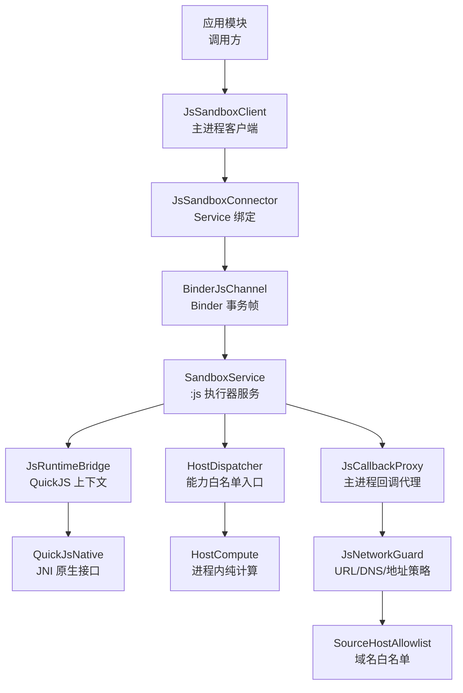

**图示来源**
- [JsSandboxClient.kt:1-185](file://lib_book_source/src/main/java/com/ebook/source/sandbox/JsSandboxClient.kt#L1-L185)
- [JsSandboxConnector.kt:1-142](file://lib_book_source/src/main/java/com/ebook/source/sandbox/JsSandboxConnector.kt#L1-L142)
- [BinderJsChannel.kt:1-132](file://lib_book_source/src/main/java/com/ebook/source/sandbox/BinderJsChannel.kt#L1-L132)
- [SandboxService.kt:1-200](file://lib_book_source/src/main/java/com/ebook/source/sandbox/SandboxService.kt#L1-L200)
- [JsRuntimeBridge.kt:1-113](file://lib_book_source/src/main/java/com/ebook/source/sandbox/JsRuntimeBridge.kt#L1-L113)
- [QuickJsNative.kt:1-59](file://lib_book_source/src/main/java/com/ebook/source/sandbox/QuickJsNative.kt#L1-L59)
- [HostDispatcher.kt:1-74](file://lib_book_source/src/main/java/com/ebook/source/sandbox/HostDispatcher.kt#L1-L74)
- [HostCompute.kt:1-200](file://lib_book_source/src/main/java/com/ebook/source/sandbox/HostCompute.kt#L1-L200)
- [JsCallbackProxy.kt:1-200](file://lib_book_source/src/main/java/com/ebook/source/sandbox/JsCallbackProxy.kt#L1-L200)
- [JsNetworkGuard.kt:1-167](file://lib_book_source/src/main/java/com/ebook/source/sandbox/JsNetworkGuard.kt#L1-L167)
- [SourceHostAllowlist.kt:1-74](file://lib_book_source/src/main/java/com/ebook/source/sandbox/SourceHostAllowlist.kt#L1-L74)

**章节来源**
- [SandboxProcess.kt:1-28](file://lib_book_source/src/main/java/com/ebook/source/sandbox/SandboxProcess.kt#L1-L28)
- [SandboxService.kt:1-200](file://lib_book_source/src/main/java/com/ebook/source/sandbox/SandboxService.kt#L1-L200)
- [JsSandboxClient.kt:1-185](file://lib_book_source/src/main/java/com/ebook/source/sandbox/JsSandboxClient.kt#L1-L185)
- [JsProtocol.kt:1-200](file://lib_book_source/src/main/java/com/ebook/source/sandbox/JsProtocol.kt#L1-L200)

## 核心组件
- **SandboxProcess**：提供“当前进程是否由系统隔离”的唯一判据，使用 `Build.VERSION.SDK_INT >= P && Process.isIsolated()`，避免用进程名做安全判断。
- **SandboxService**：`:js` 进程唯一 Service，负责 Binder 事务分诊、协议版本校验、执行调度、host 回调中继、运行时重置。
- **JsSandboxClient**：主进程侧统一执行入口，负责串行化、截止日期、断连重放、host 回调转发、主线程保护与嵌套调用防护。
- **BinderJsChannel**：Binder 通道实现，一次事务一帧，区分“传输失败”和“协议不符”。
- **JsProtocol**：跨进程 JSON 协议编解码与状态映射，集中定义请求/响应帧形态。
- **JsRuntimeBridge**：QuickJS 生命周期管理、上下文重建、描述符解析与失败归类。
- **QuickJsNative**：JNI 外部方法声明，封装 `.so` 加载与 native 调用。
- **HostDispatcher**：执行器进程内能力分发入口，二次白名单校验并区分本地计算与主进程回调。
- **HostCompute**：在 `:js` 进程内执行的纯计算 API（摘要、编码、加密等），严格参数校验。
- **JsCallbackProxy**：主进程回调代理，承载网络、Cookie、页面基准、变量与作用域语义。
- **JsNetworkGuard**：URL 准入、DNS 接入点拦截、私有/保留/不可路由地址拒绝。
- **SourceHostAllowlist**：从书源 URL 与规则文本导出 host 白名单，默认严格放行。
- **QuickJsPrelude**：QuickJS 全局垫片，装配脚本可见能力、变量绑定、不支持能力提示。

**章节来源**
- [SandboxProcess.kt:1-28](file://lib_book_source/src/main/java/com/ebook/source/sandbox/SandboxProcess.kt#L1-L28)
- [SandboxService.kt:1-200](file://lib_book_source/src/main/java/com/ebook/source/sandbox/SandboxService.kt#L1-L200)
- [JsSandboxClient.kt:1-185](file://lib_book_source/src/main/java/com/ebook/source/sandbox/JsSandboxClient.kt#L1-L185)
- [BinderJsChannel.kt:1-132](file://lib_book_source/src/main/java/com/ebook/source/sandbox/BinderJsChannel.kt#L1-L132)
- [JsProtocol.kt:1-200](file://lib_book_source/src/main/java/com/ebook/source/sandbox/JsProtocol.kt#L1-L200)
- [JsRuntimeBridge.kt:1-113](file://lib_book_source/src/main/java/com/ebook/source/sandbox/JsRuntimeBridge.kt#L1-L113)
- [QuickJsNative.kt:1-59](file://lib_book_source/src/main/java/com/ebook/source/sandbox/QuickJsNative.kt#L1-L59)
- [HostDispatcher.kt:1-74](file://lib_book_source/src/main/java/com/ebook/source/sandbox/HostDispatcher.kt#L1-L74)
- [HostCompute.kt:1-200](file://lib_book_source/src/main/java/com/ebook/source/sandbox/HostCompute.kt#L1-L200)
- [JsCallbackProxy.kt:1-200](file://lib_book_source/src/main/java/com/ebook/source/sandbox/JsCallbackProxy.kt#L1-L200)
- [JsNetworkGuard.kt:1-167](file://lib_book_source/src/main/java/com/ebook/source/sandbox/JsNetworkGuard.kt#L1-L167)
- [SourceHostAllowlist.kt:1-74](file://lib_book_source/src/main/java/com/ebook/source/sandbox/SourceHostAllowlist.kt#L1-L74)
- [QuickJsPrelude.kt:1-200](file://lib_book_source/src/main/java/com/ebook/source/sandbox/QuickJsPrelude.kt#L1-L200)

## 架构总览
沙箱采用“主进程 + 隔离 `:js` 进程”的双进程模型：
- 主进程通过 `JsSandboxClient` 发起执行请求，并通过 `JsSandboxConnector` 绑定 `SandboxService`。
- `:js` 进程由 `SandboxService` 接收 Binder 事务，校验协议后交由 `JsRuntimeBridge` 执行 QuickJS。
- 脚本若需访问网络或读取 Cookie，会通过反向 Binder 回调走回主进程，由 `JsCallbackProxy` 处理。
- 纯计算能力（摘要、编码、加密）直接在 `:js` 进程的 `HostCompute` 中完成，避免跨进程开销。

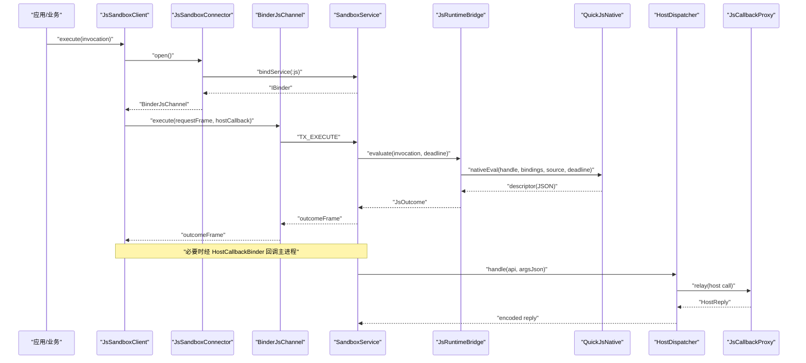

**图示来源**
- [JsSandboxClient.kt:1-185](file://lib_book_source/src/main/java/com/ebook/source/sandbox/JsSandboxClient.kt#L1-L185)
- [JsSandboxConnector.kt:1-142](file://lib_book_source/src/main/java/com/ebook/source/sandbox/JsSandboxConnector.kt#L1-L142)
- [BinderJsChannel.kt:1-132](file://lib_book_source/src/main/java/com/ebook/source/sandbox/BinderJsChannel.kt#L1-L132)
- [SandboxService.kt:1-200](file://lib_book_source/src/main/java/com/ebook/source/sandbox/SandboxService.kt#L1-L200)
- [JsRuntimeBridge.kt:1-113](file://lib_book_source/src/main/java/com/ebook/source/sandbox/JsRuntimeBridge.kt#L1-L113)
- [QuickJsNative.kt:1-59](file://lib_book_source/src/main/java/com/ebook/source/sandbox/QuickJsNative.kt#L1-L59)
- [HostDispatcher.kt:1-74](file://lib_book_source/src/main/java/com/ebook/source/sandbox/HostDispatcher.kt#L1-L74)
- [JsCallbackProxy.kt:1-200](file://lib_book_source/src/main/java/com/ebook/source/sandbox/JsCallbackProxy.kt#L1-L200)

## 详细组件分析

### 进程隔离与权限收敛
- 进程隔离判据来自 `SandboxProcess.isInIsolatedProcess`，仅在 API 28+ 上调用 `Process.isIsolated()`，避免低版本崩溃。
- `SandboxService.onBind` 再次检查当前进程是否真的被隔离；若非隔离，直接返回 null，让主进程把沙箱视为不可用，而不是在不安全的进程中运行未知脚本。
- 这种双重校验防止配置失误导致静默降级为“无边界脚本执行”。

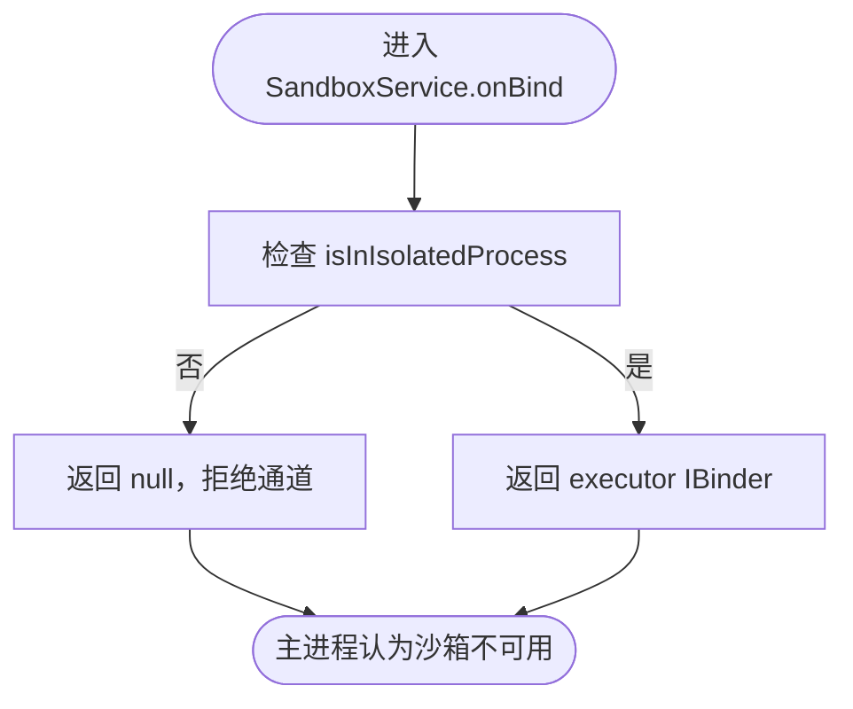

**图示来源**
- [SandboxProcess.kt:1-28](file://lib_book_source/src/main/java/com/ebook/source/sandbox/SandboxProcess.kt#L1-L28)
- [SandboxService.kt:1-200](file://lib_book_source/src/main/java/com/ebook/source/sandbox/SandboxService.kt#L1-L200)

**章节来源**
- [SandboxProcess.kt:1-28](file://lib_book_source/src/main/java/com/ebook/source/sandbox/SandboxProcess.kt#L1-L28)
- [SandboxService.kt:1-200](file://lib_book_source/src/main/java/com/ebook/source/sandbox/SandboxService.kt#L1-L200)

### Binder IPC 通信协议
协议以手写 Binder 事务形式实现，核心要素如下：
- 接口标识：`INTERFACE_TOKEN` 用于主进程到执行器的请求。
- 回调接口标识：`CALLBACK_TOKEN` 用于执行器到主进程的反向回调。
- 协议版本：`PROTOCOL_VERSION`，两侧不一致时拒绝请求或回失败帧。
- 事务码：`TX_EXECUTE`、`TX_PING` 为主进程到执行器；`TX_HOST_CALL` 为执行器到主进程。

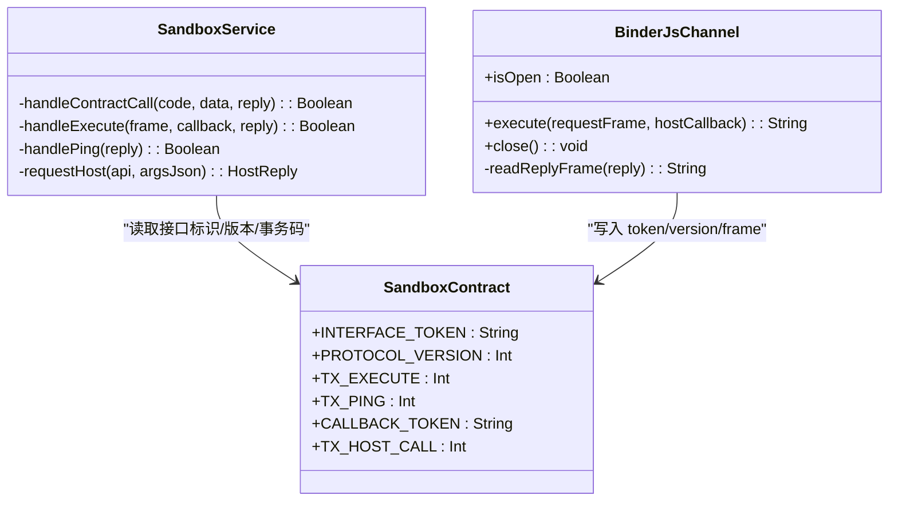

**图示来源**
- [SandboxContract.kt](file://lib_book_source/src/main/java/com/ebook/source/sandbox/SandboxContract.kt)
- [BinderJsChannel.kt:1-132](file://lib_book_source/src/main/java/com/ebook/source/sandbox/BinderJsChannel.kt#L1-L132)
- [SandboxService.kt:1-200](file://lib_book_source/src/main/java/com/ebook/source/sandbox/SandboxService.kt#L1-L200)

**章节来源**
- [BinderJsChannel.kt:1-132](file://lib_book_source/src/main/java/com/ebook/source/sandbox/BinderJsChannel.kt#L1-L132)
- [SandboxService.kt:1-200](file://lib_book_source/src/main/java/com/ebook/source/sandbox/SandboxService.kt#L1-L200)

### QuickJS 引擎集成与 C++ 桥接
- `QuickJsNative` 暴露 JNI 方法：创建 runtime、重置 context、执行脚本、销毁 handle。
- `JsRuntimeBridge` 负责：
  - 懒初始化 QuickJS runtime。
  - 将绑定值序列化为 JSON，并在求值前注入 QuickJS 垫片。
  - 解析 C++ 返回的描述符，映射为 `JsStatus`。
  - 在超时、内存耗尽、栈溢出后进行 context 重建。
- 加载失败不会抛出未类型异常，而是标记 `loaded=false`，上层统一按“不可用”处理。

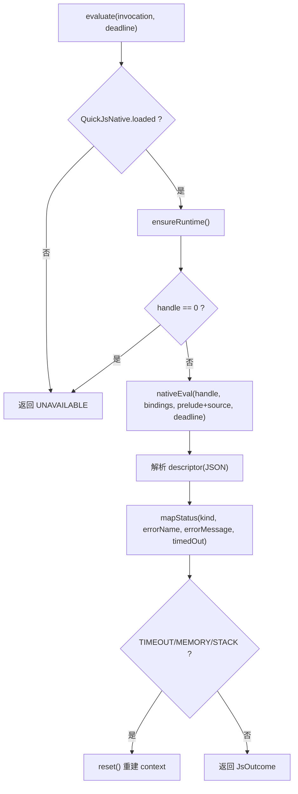

**图示来源**
- [JsRuntimeBridge.kt:1-113](file://lib_book_source/src/main/java/com/ebook/source/sandbox/JsRuntimeBridge.kt#L1-L113)
- [QuickJsNative.kt:1-59](file://lib_book_source/src/main/java/com/ebook/source/sandbox/QuickJsNative.kt#L1-L59)
- [JsProtocol.kt:1-200](file://lib_book_source/src/main/java/com/ebook/source/sandbox/JsProtocol.kt#L1-L200)

**章节来源**
- [JsRuntimeBridge.kt:1-113](file://lib_book_source/src/main/java/com/ebook/source/sandbox/JsRuntimeBridge.kt#L1-L113)
- [QuickJsNative.kt:1-59](file://lib_book_source/src/main/java/com/ebook/source/sandbox/QuickJsNative.kt#L1-L59)

### 资源限制策略
资源限制集中在 `JsLimits`，覆盖以下维度：
- **CPU 时间**：`wallClockMs`，作为绝对截止时间传入 QuickJS，由中断器比对。
- **堆大小**：`heapBytes`，QuickJS 堆上限，用于抑制指数分配。
- **栈大小**：`stackBytes`，QuickJS 栈天花板，配合线程栈余量评估。
- **Binder 事务大小**：`maxRequestBytes`、`maxOutcomeBytes`、`maxHostReplyBytes`，避免超过系统 Binder 缓冲。
- **回调深度**：`maxCallbackDepth`，防止规则递归求值造成死锁或栈爆。
- **连接超时**：`bindTimeoutMs`，控制绑定 `:js` 进程的等待时间。
- **任务网络请求次数**：`maxRequestsPerTask`，限制单任务外呼数量。

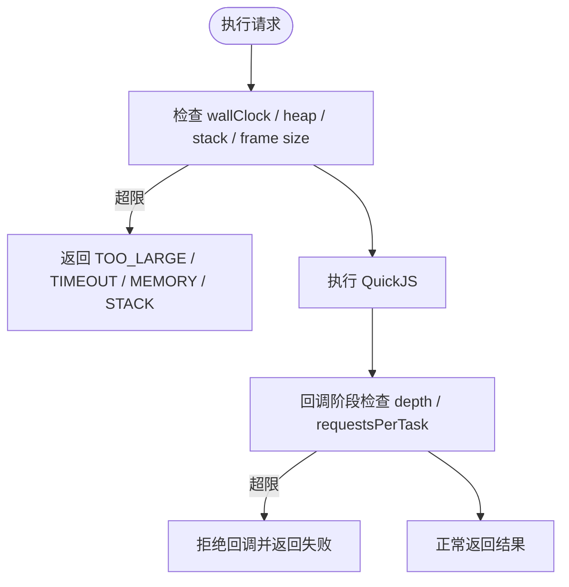

**图示来源**
- [JsLimits.kt:1-58](file://lib_book_source/src/main/java/com/ebook/source/sandbox/JsLimits.kt#L1-L58)
- [JsSandboxClient.kt:1-185](file://lib_book_source/src/main/java/com/ebook/source/sandbox/JsSandboxClient.kt#L1-L185)
- [JsRuntimeBridge.kt:1-113](file://lib_book_source/src/main/java/com/ebook/source/sandbox/JsRuntimeBridge.kt#L1-L113)
- [JsCallbackProxy.kt:1-200](file://lib_book_source/src/main/java/com/ebook/source/sandbox/JsCallbackProxy.kt#L1-L200)

**章节来源**
- [JsLimits.kt:1-58](file://lib_book_source/src/main/java/com/ebook/source/sandbox/JsLimits.kt#L1-L58)
- [JsSandboxClient.kt:1-185](file://lib_book_source/src/main/java/com/ebook/source/sandbox/JsSandboxClient.kt#L1-L185)
- [JsRuntimeBridge.kt:1-113](file://lib_book_source/src/main/java/com/ebook/source/sandbox/JsRuntimeBridge.kt#L1-L113)
- [JsCallbackProxy.kt:1-200](file://lib_book_source/src/main/java/com/ebook/source/sandbox/JsCallbackProxy.kt#L1-L200)

### 网络访问拦截
网络访问分为两层防护：
- **URL 准入**：仅允许 `http`/`https`，禁止嵌入凭证，长度限制，host 必须通过白名单。
- **DNS 与地址判定**：通过 `GuardedDns` 拦截 OkHttp 的真实 DNS 查询，拒绝内网、环回、链路本地、云元数据、CGNAT、组播与保留地址。
- 白名单来源于书源自身 URL 与规则文本中出现过的 host，默认不放行子域。

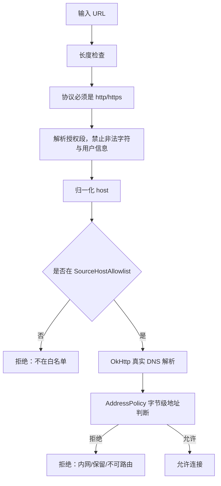

**图示来源**
- [JsNetworkGuard.kt:1-167](file://lib_book_source/src/main/java/com/ebook/source/sandbox/JsNetworkGuard.kt#L1-L167)
- [SourceHostAllowlist.kt:1-74](file://lib_book_source/src/main/java/com/ebook/source/sandbox/SourceHostAllowlist.kt#L1-L74)

**章节来源**
- [JsNetworkGuard.kt:1-167](file://lib_book_source/src/main/java/com/ebook/source/sandbox/JsNetworkGuard.kt#L1-L167)
- [SourceHostAllowlist.kt:1-74](file://lib_book_source/src/main/java/com/ebook/source/sandbox/SourceHostAllowlist.kt#L1-L74)

### 沙箱生命周期管理
生命周期可分为四个阶段：
1. **进程启动**：`SandboxService.onCreate` 安装 `HostDispatcher.relay`。
2. **连接建立**：主进程 `JsSandboxConnector.open` 绑定 Service，等待 IBinder，构造 `BinderJsChannel`。
3. **任务执行**：`JsSandboxClient.execute` 串行化请求，经过 Binder 到达 `SandboxService.handleExecute`，再交给 `JsRuntimeBridge.evaluate`。
4. **资源清理**：`SandboxService.onDestroy` 清除 relay、移除 ThreadLocal、关闭 bridge；通道 close 触发解绑。

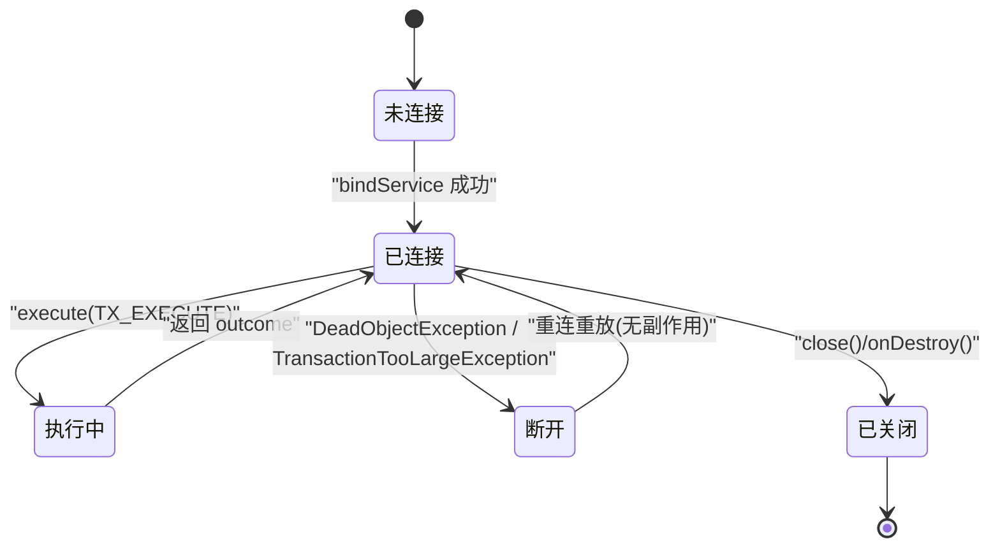

**图示来源**
- [SandboxService.kt:1-200](file://lib_book_source/src/main/java/com/ebook/source/sandbox/SandboxService.kt#L1-L200)
- [JsSandboxConnector.kt:1-142](file://lib_book_source/src/main/java/com/ebook/source/sandbox/JsSandboxConnector.kt#L1-L142)
- [BinderJsChannel.kt:1-132](file://lib_book_source/src/main/java/com/ebook/source/sandbox/BinderJsChannel.kt#L1-L132)
- [JsSandboxClient.kt:1-185](file://lib_book_source/src/main/java/com/ebook/source/sandbox/JsSandboxClient.kt#L1-L185)

**章节来源**
- [SandboxService.kt:1-200](file://lib_book_source/src/main/java/com/ebook/source/sandbox/SandboxService.kt#L1-L200)
- [JsSandboxConnector.kt:1-142](file://lib_book_source/src/main/java/com/ebook/source/sandbox/JsSandboxConnector.kt#L1-L142)
- [BinderJsChannel.kt:1-132](file://lib_book_source/src/main/java/com/ebook/source/sandbox/BinderJsChannel.kt#L1-L132)
- [JsSandboxClient.kt:1-185](file://lib_book_source/src/main/java/com/ebook/source/sandbox/JsSandboxClient.kt#L1-L185)

### 双向回调通道与错误处理
- 执行器通过 `HostCallbackBinder` 在 `TX_HOST_CALL` 上回调主进程。
- 主进程侧 `JsSandboxClient.relay` 负责：
  - 记录本次请求是否已有副作用（`attempt.relayed`）。
  - 防止回调中嵌套再次执行沙箱。
  - 对异常进行兜底，保证不抛给 `.so` 调用栈。
- 错误分类：
  - 传输失败：`ChannelDeadException`，触发重连重放。
  - 协议不符：`SandboxProtocolException`，直接上抛，避免误判为可恢复错误。
  - 业务失败：`JsOutcome.status` 明确区分超时、内存、栈、语法、运行时、不支持 API、过大、不可用。

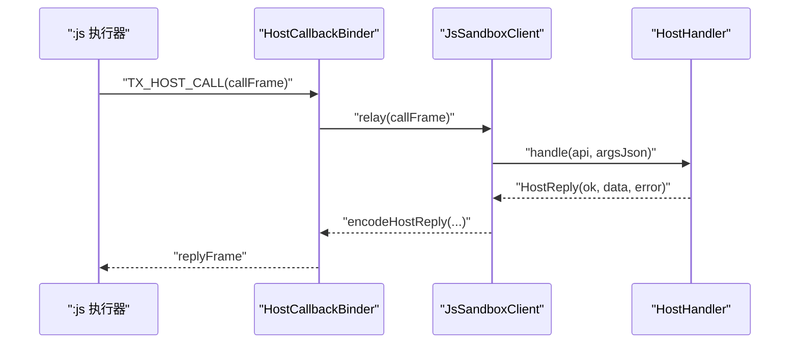

**图示来源**
- [BinderJsChannel.kt:1-132](file://lib_book_source/src/main/java/com/ebook/source/sandbox/BinderJsChannel.kt#L1-L132)
- [JsSandboxClient.kt:1-185](file://lib_book_source/src/main/java/com/ebook/source/sandbox/JsSandboxClient.kt#L1-L185)
- [JsCallbackProxy.kt:1-200](file://lib_book_source/src/main/java/com/ebook/source/sandbox/JsCallbackProxy.kt#L1-L200)

**章节来源**
- [BinderJsChannel.kt:1-132](file://lib_book_source/src/main/java/com/ebook/source/sandbox/BinderJsChannel.kt#L1-L132)
- [JsSandboxClient.kt:1-185](file://lib_book_source/src/main/java/com/ebook/source/sandbox/JsSandboxClient.kt#L1-L185)
- [JsCallbackProxy.kt:1-200](file://lib_book_source/src/main/java/com/ebook/source/sandbox/JsCallbackProxy.kt#L1-L200)

### 宿主能力分发与纯计算
- `HostDispatcher` 是唯一 JNI 入口，具备二次白名单校验。
- 能力分为两类：
  - `COMPUTE`：在 `:js` 进程内执行，零跨进程往返，由 `HostCompute.invoke` 处理。
  - `HOST`：转发到主进程回调通道，由 `JsCallbackProxy` 处理网络、Cookie、变量等。
- 所有能力调用均以 JSON 字符串进出，避免在 JNI 层暴露复杂对象。

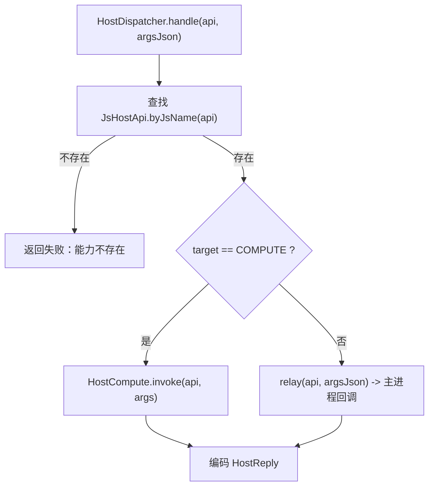

**图示来源**
- [HostDispatcher.kt:1-74](file://lib_book_source/src/main/java/com/ebook/source/sandbox/HostDispatcher.kt#L1-L74)
- [HostCompute.kt:1-200](file://lib_book_source/src/main/java/com/ebook/source/sandbox/HostCompute.kt#L1-L200)
- [JsCallbackProxy.kt:1-200](file://lib_book_source/src/main/java/com/ebook/source/sandbox/JsCallbackProxy.kt#L1-L200)

**章节来源**
- [HostDispatcher.kt:1-74](file://lib_book_source/src/main/java/com/ebook/source/sandbox/HostDispatcher.kt#L1-L74)
- [HostCompute.kt:1-200](file://lib_book_source/src/main/java/com/ebook/source/sandbox/HostCompute.kt#L1-L200)
- [JsCallbackProxy.kt:1-200](file://lib_book_source/src/main/java/com/ebook/source/sandbox/JsCallbackProxy.kt#L1-L200)

### QuickJS 垫片与能力清单
- `QuickJsPrelude.SOURCE` 在 runtime 创建时求值，装配 `java` 对象与纯计算别名。
- `BOOTSTRAP` 每次执行前置，把绑定值落成全局变量，并重新装配 `source`、`book`、`chapter` 行为面。
- 不支持能力会抛出带前缀的错误消息，供上层识别为 `UNSUPPORTED_API`。
- 所有能力均通过 `__call` → `__host_call` 进入受控通道，避免脚本直接访问 Java。

**章节来源**
- [QuickJsPrelude.kt:1-200](file://lib_book_source/src/main/java/com/ebook/source/sandbox/QuickJsPrelude.kt#L1-L200)
- [JsProtocol.kt:1-200](file://lib_book_source/src/main/java/com/ebook/source/sandbox/JsProtocol.kt#L1-L200)

## 依赖关系分析
- 主进程依赖 `JsSandboxClient` 作为统一执行入口。
- `JsSandboxClient` 依赖 `JsSandboxConnector` 与 `BinderJsChannel` 完成连接与事务。
- `SandboxService` 依赖 `JsRuntimeBridge`、`HostDispatcher`、`JsLimits`。
- `HostDispatcher` 依赖 `HostCompute` 与 `JsCallbackProxy`。
- `JsCallbackProxy` 依赖 `JsNetworkGuard`、`SourceHostAllowlist`、`ScriptTransport`。
- `JsRuntimeBridge` 依赖 `QuickJsNative` 与 `QuickJsPrelude`。

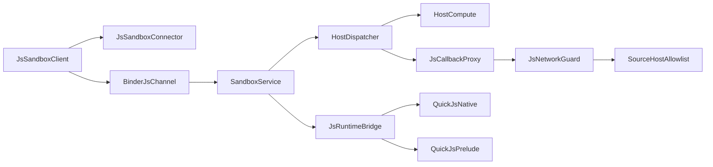

**图示来源**
- [JsSandboxClient.kt:1-185](file://lib_book_source/src/main/java/com/ebook/source/sandbox/JsSandboxClient.kt#L1-L185)
- [JsSandboxConnector.kt:1-142](file://lib_book_source/src/main/java/com/ebook/source/sandbox/JsSandboxConnector.kt#L1-L142)
- [BinderJsChannel.kt:1-132](file://lib_book_source/src/main/java/com/ebook/source/sandbox/BinderJsChannel.kt#L1-L132)
- [SandboxService.kt:1-200](file://lib_book_source/src/main/java/com/ebook/source/sandbox/SandboxService.kt#L1-L200)
- [JsRuntimeBridge.kt:1-113](file://lib_book_source/src/main/java/com/ebook/source/sandbox/JsRuntimeBridge.kt#L1-L113)
- [HostDispatcher.kt:1-74](file://lib_book_source/src/main/java/com/ebook/source/sandbox/HostDispatcher.kt#L1-L74)
- [HostCompute.kt:1-200](file://lib_book_source/src/main/java/com/ebook/source/sandbox/HostCompute.kt#L1-L200)
- [JsCallbackProxy.kt:1-200](file://lib_book_source/src/main/java/com/ebook/source/sandbox/JsCallbackProxy.kt#L1-L200)
- [JsNetworkGuard.kt:1-167](file://lib_book_source/src/main/java/com/ebook/source/sandbox/JsNetworkGuard.kt#L1-L167)
- [SourceHostAllowlist.kt:1-74](file://lib_book_source/src/main/java/com/ebook/source/sandbox/SourceHostAllowlist.kt#L1-L74)
- [QuickJsNative.kt:1-59](file://lib_book_source/src/main/java/com/ebook/source/sandbox/QuickJsNative.kt#L1-L59)
- [QuickJsPrelude.kt:1-200](file://lib_book_source/src/main/java/com/ebook/source/sandbox/QuickJsPrelude.kt#L1-L200)

**章节来源**
- [JsSandboxClient.kt:1-185](file://lib_book_source/src/main/java/com/ebook/source/sandbox/JsSandboxClient.kt#L1-L185)
- [SandboxService.kt:1-200](file://lib_book_source/src/main/java/com/ebook/source/sandbox/SandboxService.kt#L1-L200)
- [HostDispatcher.kt:1-74](file://lib_book_source/src/main/java/com/ebook/source/sandbox/HostDispatcher.kt#L1-L74)
- [JsCallbackProxy.kt:1-200](file://lib_book_source/src/main/java/com/ebook/source/sandbox/JsCallbackProxy.kt#L1-L200)

## 性能与资源限制
- **串行执行**：`JsSandboxClient.inFlight` 确保同一执行器进程同时只有一帧在飞，避免多源互抢 runtime。
- **单调时钟**：使用 `SystemClock.elapsedRealtime()` 计算截止时间，避免系统时间修改影响超时。
- **Binder 缓冲保护**：请求、响应、回调回复均按字节上限截断，避免 `TransactionTooLargeException` 暴露未类型错误。
- **快速失败**：协议不符、ABI 不匹配、`.so` 未加载等场景直接返回 `UNAVAILABLE`，不伪装成业务失败。
- **重试边界**：仅在无副作用时重连重放；一旦已转发过 host 回调，不再重放，避免重复请求。

[本节为通用性能建议，不直接分析具体文件]

## 故障排查指南
常见错误及定位要点：
- **沙箱不可用**：检查 `.so` 是否加载成功、ABI 是否匹配、Service 是否可用。参考 `JsRuntimeBridge.isReady` 与 `QuickJsNative.loadError`。
- **协议版本不合**：两侧构建不同步，应检查 `SandboxContract.PROTOCOL_VERSION` 与协议编解码位置。
- **事务失败**：可能是执行器进程被回收或 Binder 缓冲不足，查看 `BinderJsChannel.readReplyFrame` 与 `RemoteException` 分支。
- **网络被拒**：检查 URL 是否合法、host 是否在白名单、DNS 解析是否命中内网或保留地址。
- **回调嵌套**：避免在 host 回调中再次发起沙箱执行，否则会被判定为不支持的嵌套调用。
- **超时/内存/栈溢出**：根据 `JsProtocol.mapStatus` 的分类，调整 `JsLimits.wallClockMs`、`heapBytes`、`stackBytes`。

**章节来源**
- [JsRuntimeBridge.kt:1-113](file://lib_book_source/src/main/java/com/ebook/source/sandbox/JsRuntimeBridge.kt#L1-L113)
- [QuickJsNative.kt:1-59](file://lib_book_source/src/main/java/com/ebook/source/sandbox/QuickJsNative.kt#L1-L59)
- [BinderJsChannel.kt:1-132](file://lib_book_source/src/main/java/com/ebook/source/sandbox/BinderJsChannel.kt#L1-L132)
- [JsProtocol.kt:1-200](file://lib_book_source/src/main/java/com/ebook/source/sandbox/JsProtocol.kt#L1-L200)
- [JsNetworkGuard.kt:1-167](file://lib_book_source/src/main/java/com/ebook/source/sandbox/JsNetworkGuard.kt#L1-L167)
- [JsLimits.kt:1-58](file://lib_book_source/src/main/java/com/ebook/source/sandbox/JsLimits.kt#L1-L58)

## 结论
该安全沙箱通过“Android isolatedProcess + Binder IPC + QuickJS + 多层限制”的组合，将不可信书源脚本限制在最小能力范围内：
- 进程级隔离防止主进程资源与数据被直接访问。
- Binder 协议强制 token 与版本校验，避免错配与静默降级。
- QuickJS 桥接层集中管理 runtime、context 与失败分类。
- 资源限制覆盖 CPU、堆、栈、帧大小、回调深度与网络请求次数。
- 网络访问经过 URL 准入、DNS 拦截与地址策略三重过滤。
- 生命周期清晰，失败路径统一归类，便于排查与演进。

对于后续扩展，建议在保持现有契约不变的前提下：
- 继续收紧网络白名单与地址策略。
- 细化任务级限流与配额审计。
- 增强可观测性，例如输出更明确的失败根因与资源消耗指标。
- 在放宽任何能力时，同步更新 QuickJS 垫片与白名单测试。

[本节为总结性内容，不直接分析具体文件]