# 扩展开发指南

<cite>
**本文引用的文件**   
- [BookApplication.kt](file://lib_book_common/src/main/java/com/ebook/common/BookApplication.kt)
- [MyApplication.kt](file://module_app/src/main/java/com/ebook/MyApplication.kt)
- [ILoginProvider.kt](file://lib_book_common/src/main/java/com/ebook/common/provider/ILoginProvider.kt)
- [IBookProvider.kt](file://lib_book_common/src/main/java/com/ebook/common/provider/IBookProvider.kt)
- [IFindProvider.kt](file://lib_book_common/src/main/java/com/ebook/common/provider/IFindProvider.kt)
- [IMeProvider.kt](file://lib_book_common/src/main/java/com/ebook/common/provider/IMeProvider.kt)
- [LoginInterceptor.kt](file://lib_book_common/src/main/java/com/ebook/common/interceptor/LoginInterceptor.kt)
- [RouteArgs.kt](file://lib_book_common/src/main/java/com/ebook/common/event/RouteArgs.kt)
- [LoginProvider.kt](file://module_login/src/main/java/com/ebook/login/provider/LoginProvider.kt)
- [BookProvider.kt](file://module_book/src/main/java/com/ebook/book/provider/BookProvider.kt)
- [FindProvider.kt](file://module_find/src/main/java/com/ebook/find/provider/FindProvider.kt)
- [MeProvider.kt](file://module_me/src/main/java/com/ebook/me/provider/MeProvider.kt)
- [ContentStoreModule.kt](file://lib_book_common/src/main/java/com/ebook/common/di/ContentStoreModule.kt)
- [ThemeModule.kt](file://lib_book_common/src/main/java/com/ebook/common/di/ThemeModule.kt)
- [AnalyzeModule.kt](file://lib_book_common/src/main/java/com/ebook/common/di/AnalyzeModule.kt)
- [BookSourceManager.kt](file://lib_book_common/src/main/java/com/ebook/common/analyze/source/BookSourceManager.kt)
- [BookSourceManagerImpl.kt](file://lib_book_common/src/main/java/com/ebook/common/analyze/source/BookSourceManagerImpl.kt)
- [SearchActivity.kt](file://module_find/src/main/java/com/ebook/find/SearchActivity.kt)
- [BookDetailActivity.kt](file://module_book/src/main/java/com/ebook/book/BookDetailActivity.kt)
</cite>

## 目录
1. [引言](#引言)
2. [项目结构](#项目结构)
3. [核心组件](#核心组件)
4. [架构总览](#架构总览)
5. [详细组件分析](#详细组件分析)
6. [依赖关系分析](#依赖关系分析)
7. [性能与可扩展性](#性能与可扩展性)
8. [故障排查](#故障排查)
9. [结论](#结论)
10. [附录：扩展开发清单](#附录扩展开发清单)

## 引言
本指南面向需要扩展该阅读应用的开发者，聚焦以下主题：
- Provider 接口的设计模式与实现规范
- TheRouter 路由系统的注册、参数传递与跳转流程
- Hilt 依赖注入的模块定义、作用域与 EntryPoint 桥接
- Application 初始化扩展点及进程隔离注意事项
- 书源类型扩展、自定义 UI 页面与业务逻辑扩展示例
- 最佳实践与常见问题解决方案

目标是帮助你在不破坏现有模块边界的前提下，安全地新增能力。

## 项目结构
该项目采用多模块 Android/Kotlin 工程：
- lib_book_common：跨模块公共库，包含 Provider 接口、基础 Application、DI 模块、事件常量、通用拦截器、仓库与分析层接口等
- module_app：应用入口，装配 Hilt、TheRouter 拦截器、启动后任务
- module_book / module_find / module_login / module_me：按功能划分的模块，各自提供页面、视图模型、仓储以及 TheRouter SPI Provider 实现
- lib_ebook_api / lib_ebook_db / lib_book_source：网络、数据库、脚本解析等基础设施

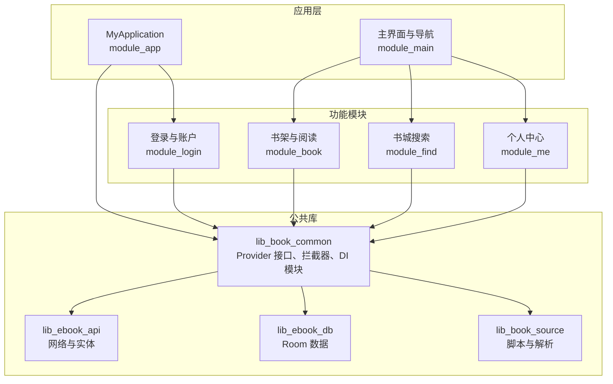

**图示来源**
- [MyApplication.kt:1-66](file://module_app/src/main/java/com/ebook/MyApplication.kt#L1-L66)
- [BookApplication.kt:1-64](file://lib_book_common/src/main/java/com/ebook/common/BookApplication.kt#L1-L64)
- [BookProvider.kt:1-16](file://module_book/src/main/java/com/ebook/book/provider/BookProvider.kt#L1-L16)
- [FindProvider.kt:1-19](file://module_find/src/main/java/com/ebook/find/provider/FindProvider.kt#L1-L19)
- [MeProvider.kt:1-20](file://module_me/src/main/java/com/ebook/me/provider/MeProvider.kt#L1-L20)
- [LoginProvider.kt:1-36](file://module_login/src/main/java/com/ebook/login/provider/LoginProvider.kt#L1-L36)

**章节来源**
- [MyApplication.kt:1-66](file://module_app/src/main/java/com/ebook/MyApplication.kt#L1-L66)
- [BookApplication.kt:1-64](file://lib_book_common/src/main/java/com/ebook/common/BookApplication.kt#L1-L64)

## 核心组件
本节聚焦扩展开发中最常用的三类抽象：
- Provider 接口：跨模块能力契约（登录、书架、书城、个人中心）
- 路由系统：基于 TheRouter 的路由注册、拦截与参数传递
- 依赖注入：Hilt 模块、作用域、EntryPoint 桥接与进程隔离下的获取方式

这些组件共同构成“宿主通过接口调用具体模块”的解耦结构。

**章节来源**
- [ILoginProvider.kt:1-19](file://lib_book_common/src/main/java/com/ebook/common/provider/ILoginProvider.kt#L1-L19)
- [IBookProvider.kt:1-23](file://lib_book_common/src/main/java/com/ebook/common/provider/IBookProvider.kt#L1-L23)
- [IFindProvider.kt:1-13](file://lib_book_common/src/main/java/com/ebook/common/provider/IFindProvider.kt#L1-L13)
- [IMeProvider.kt:1-13](file://lib_book_common/src/main/java/com/ebook/common/provider/IMeProvider.kt#L1-L13)
- [LoginInterceptor.kt:1-42](file://lib_book_common/src/main/java/com/ebook/common/interceptor/LoginInterceptor.kt#L1-L42)
- [RouteArgs.kt:1-50](file://lib_book_common/src/main/java/com/ebook/common/event/RouteArgs.kt#L1-L50)

## 架构总览
下图展示一次带登录检查的跨模块路由跳转，以及 Provider、Hilt、TheRouter 之间的协作关系。

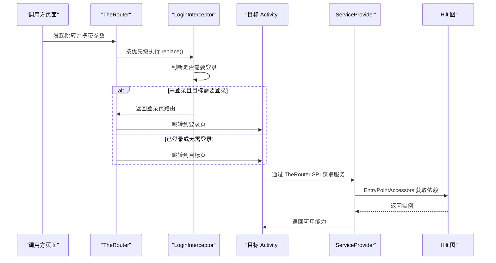

**图示来源**
- [LoginInterceptor.kt:1-42](file://lib_book_common/src/main/java/com/ebook/common/interceptor/LoginInterceptor.kt#L1-L42)
- [LoginProvider.kt:1-36](file://module_login/src/main/java/com/ebook/login/provider/LoginProvider.kt#L1-L36)
- [MyApplication.kt:24-35](file://module_app/src/main/java/com/ebook/MyApplication.kt#L24-L35)

## 详细组件分析

### Provider 接口设计与实现规范
Provider 是跨模块能力的契约层，定义在 lib_book_common，由对应模块提供实现，并通过 TheRouter 的 ServiceProvider 机制暴露给宿主。

#### Provider 接口体系
- ILoginProvider：仅暴露服务端登出能力；本地会话清理由 UserSessionManager 单点负责
- IBookProvider：返回 Composable 书架页面，允许宿主注入“去书城”回调
- IFindProvider：返回 Composable 书城主页
- IMeProvider：返回 Composable 个人中心主页

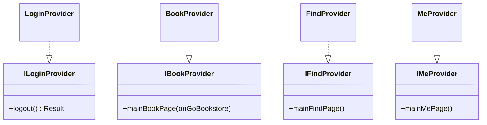

**图示来源**
- [ILoginProvider.kt:1-19](file://lib_book_common/src/main/java/com/ebook/common/provider/ILoginProvider.kt#L1-L19)
- [IBookProvider.kt:1-23](file://lib_book_common/src/main/java/com/ebook/common/provider/IBookProvider.kt#L1-L23)
- [IFindProvider.kt:1-13](file://lib_book_common/src/main/java/com/ebook/common/provider/IFindProvider.kt#L1-L13)
- [IMeProvider.kt:1-13](file://lib_book_common/src/main/java/com/ebook/common/provider/IMeProvider.kt#L1-L13)
- [LoginProvider.kt:1-36](file://module_login/src/main/java/com/ebook/login/provider/LoginProvider.kt#L1-L36)
- [BookProvider.kt:1-16](file://module_book/src/main/java/com/ebook/book/provider/BookProvider.kt#L1-L16)
- [FindProvider.kt:1-19](file://module_find/src/main/java/com/ebook/find/provider/FindProvider.kt#L1-L19)
- [MeProvider.kt:1-20](file://module_me/src/main/java/com/ebook/me/provider/MeProvider.kt#L1-L20)

#### Provider 生命周期与依赖注入
- Provider 类使用 TheRouter 的 @ServiceProvider 注解注册，由框架创建实例
- 若 Provider 需要 Hilt 管理的依赖（如 UserRepository），应通过 EntryPointAccessors 从 Hilt 图中获取，而不是在 Provider 构造时直接 @Inject
- LoginProvider 展示了这种桥接模式：init 中通过 ApplicationContext 和 UserRepositoryEntryPoint 获取仓库实例

实现建议：
- Provider 只负责暴露能力，避免持有长生命周期副作用
- 对可选能力（如独立运行时缺少登录模块）允许空实现或 null 回调
- Composable Provider 返回的是页面组合函数，ViewModel 作用域由宿主 hiltViewModel 决定

**章节来源**
- [LoginProvider.kt:1-36](file://module_login/src/main/java/com/ebook/login/provider/LoginProvider.kt#L1-L36)
- [BookProvider.kt:1-16](file://module_book/src/main/java/com/ebook/book/provider/BookProvider.kt#L1-L16)
- [FindProvider.kt:1-19](file://module_find/src/main/java/com/ebook/find/provider/FindProvider.kt#L1-L19)
- [MeProvider.kt:1-20](file://module_me/src/main/java/com/ebook/me/provider/MeProvider.kt#L1-L20)
- [IBookProvider.kt:1-23](file://lib_book_common/src/main/java/com/ebook/common/provider/IBookProvider.kt#L1-L23)

### TheRouter 路由系统扩展方式
路由系统用于跨模块页面跳转与能力访问。项目中主要使用：
- @Route 注解声明 Activity 路由
- addRouterReplaceInterceptor 注册全局拦截器
- with(Bundle)/extras 传参，并使用 RouteArgs 集中管理 key

#### 路由注册与跳转
- 目标页面使用 @Route(path = KeyCode.Xxx.PATH) 声明路径
- 调用方通过 TheRouter 打开对应路径
- 登录相关页面在注释中使用 params = ["needLogin", "true"] 标记需要登录

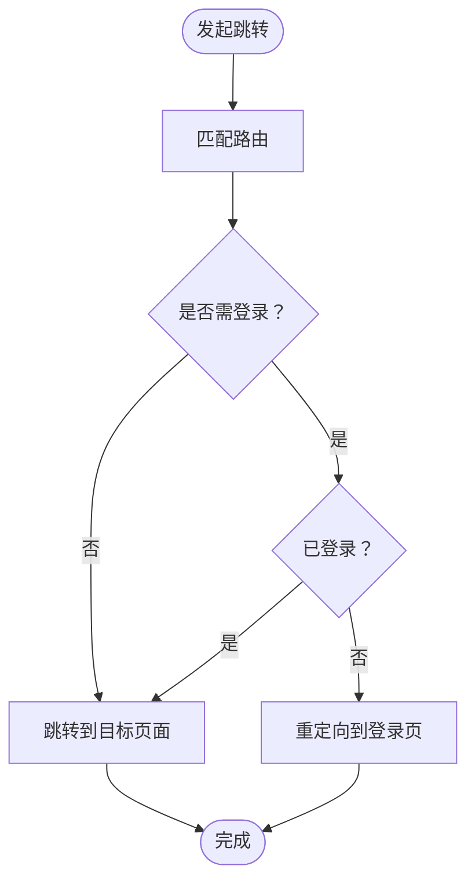

**图示来源**
- [LoginInterceptor.kt:1-42](file://lib_book_common/src/main/java/com/ebook/common/interceptor/LoginInterceptor.kt#L1-L42)
- [BookDetailActivity.kt:62-63](file://module_book/src/main/java/com/ebook/book/BookDetailActivity.kt#L62-L63)
- [SearchActivity.kt:132-133](file://module_find/src/main/java/com/ebook/find/SearchActivity.kt#L132-L133)

#### 参数传递约定
跨模块共享的 Bundle key 统一放在 RouteArgs 对象中，避免字符串字面量散落导致键名不一致。例如：
- 评论聚合键、书籍 noteUrl、恢复阅读的 noteUrl 等
- 恢复阅读场景明确说明不使用 BitIntentDataManager 暂存区，而是通过 noteUrl 现取，避免 Binder 事务过大崩溃

参数传递最佳实践：
- 所有跨模块 key 集中在 RouteArgs 定义
- 大型对象不要直接放入 Intent/Bundle，优先用 ID 或 URL 反向查询
- 接收端根据路由上下文区分同名但语义不同的 key

**章节来源**
- [RouteArgs.kt:1-50](file://lib_book_common/src/main/java/com/ebook/common/event/RouteArgs.kt#L1-L50)
- [LoginInterceptor.kt:1-42](file://lib_book_common/src/main/java/com/ebook/common/interceptor/LoginInterceptor.kt#L1-L42)

### Hilt 依赖注入配置方法
Hilt 在本项目中承担应用级与模块级依赖装配职责，常见模式包括：
- @Module + @Provides + @InstallIn(SingletonComponent::class)
- @Binds 绑定接口到实现
- @Singleton 标注单例
- EntryPointAccessors 在 Application 中按需获取依赖，避免沙箱进程崩溃

#### 典型 DI 模块
- ThemeModule：提供 ThemeModeManager，配合 BookApplication 的主题装配
- ContentStoreModule：提供 BookStore、ChapterSplitter、ChapterContentCache、ChapterReader 映射表等
- AnalyzeModule：将 BookSourceManagerImpl 绑定到 BookSourceManager 接口

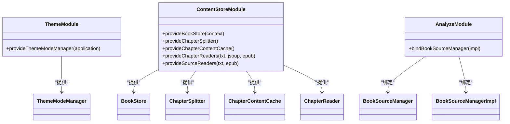

**图示来源**
- [ThemeModule.kt:1-26](file://lib_book_common/src/main/java/com/ebook/common/di/ThemeModule.kt#L1-L26)
- [ContentStoreModule.kt:1-87](file://lib_book_common/src/main/java/com/ebook/common/di/ContentStoreModule.kt#L1-L87)
- [AnalyzeModule.kt:1-18](file://lib_book_common/src/main/java/com/ebook/common/di/AnalyzeModule.kt#L1-L18)

#### Application 中的 EntryPoint 桥接
- BookApplication 使用 ThemeModeManagerEntryPoint 获取 ThemeModeManager，并在 Compose 中安装主题
- MyApplication 使用 ContentStoreEntryPoint 获取 BookRepository，用于启动后的内容仓库对账
- 这种方式避免在 Application 字段上 eager @Inject，从而让沙箱进程跳过危险初始化

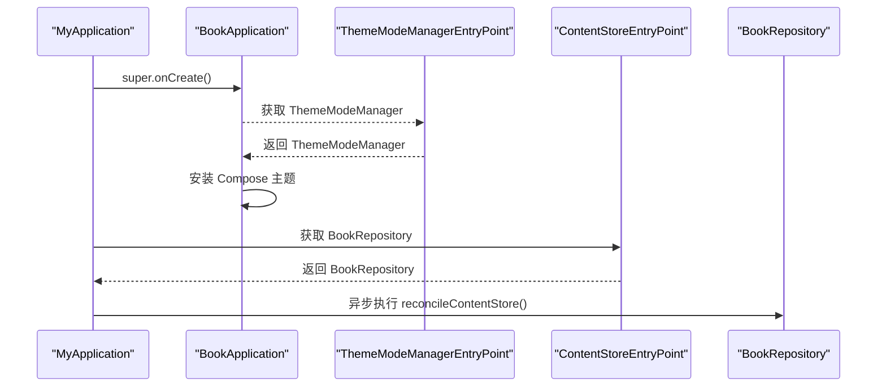

**图示来源**
- [BookApplication.kt:1-64](file://lib_book_common/src/main/java/com/ebook/common/BookApplication.kt#L1-L64)
- [MyApplication.kt:1-66](file://module_app/src/main/java/com/ebook/MyApplication.kt#L1-L66)

**章节来源**
- [ThemeModule.kt:1-26](file://lib_book_common/src/main/java/com/ebook/common/di/ThemeModule.kt#L1-L26)
- [ContentStoreModule.kt:1-87](file://lib_book_common/src/main/java/com/ebook/common/di/ContentStoreModule.kt#L1-L87)
- [AnalyzeModule.kt:1-18](file://lib_book_common/src/main/java/com/ebook/common/di/AnalyzeModule.kt#L1-L18)
- [BookApplication.kt:1-64](file://lib_book_common/src/main/java/com/ebook/common/BookApplication.kt#L1-L64)
- [MyApplication.kt:1-66](file://module_app/src/main/java/com/ebook/MyApplication.kt#L1-L66)

### 应用初始化流程与扩展点
应用初始化分为两层：
- BookApplication：负责主题装配、沙箱进程门、Compose 主题安装
- MyApplication：负责登录拦截器注册、启动后异步任务（内容仓库对账）

关键规则：
- 沙箱进程会跳过主题与持久化初始化，避免读不到 SharedPreferences
- Application 上不允许再新增 eager @Inject 字段，防止沙箱进程提前崩溃
- 登录拦截器必须在 super.onCreate() 之后注册，否则无法生效

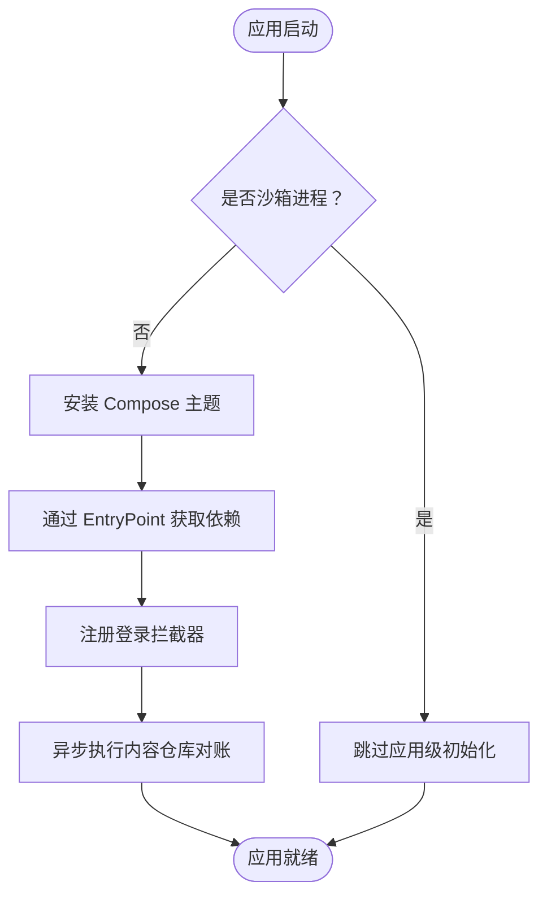

**图示来源**
- [BookApplication.kt:1-64](file://lib_book_common/src/main/java/com/ebook/common/BookApplication.kt#L1-L64)
- [MyApplication.kt:1-66](file://module_app/src/main/java/com/ebook/MyApplication.kt#L1-L66)

**章节来源**
- [BookApplication.kt:1-64](file://lib_book_common/src/main/java/com/ebook/common/BookApplication.kt#L1-L64)
- [MyApplication.kt:1-66](file://module_app/src/main/java/com/ebook/MyApplication.kt#L1-L66)

### 扩展案例一：支持新的书源类型
本项目已支持原生规则书源与脚本书源，新增书源类型的关键点是：
- 在解析层新增 Parser 实现
- 在 DI 模块中将新格式路由到对应 Reader/Parser
- 确保 BookSourceManager 的分发逻辑覆盖新 format

当前关键扩展点：
- ContentStoreModule.provideChapterReaders：按 BookFormat 路由 TXT、NETWORK、EPUB
- ContentStoreModule.provideSourceReaders：导入链路专用 Reader 映射
- AnalyzeModule.bindBookSourceManager：绑定 BookSourceManager 实现
- BookSourceManager 与 BookSourceManagerImpl：默认源选择、parser LRU、聚合搜索、格式分发

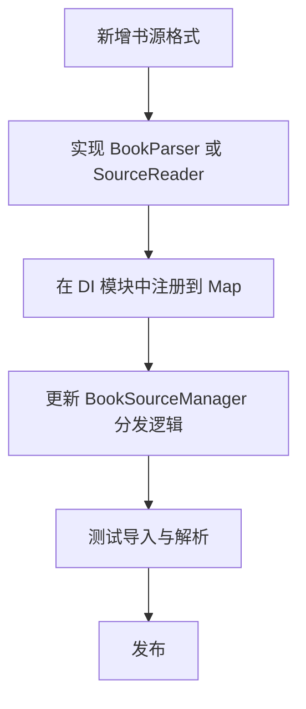

**图示来源**
- [ContentStoreModule.kt:1-87](file://lib_book_common/src/main/java/com/ebook/common/di/ContentStoreModule.kt#L1-L87)
- [AnalyzeModule.kt:1-18](file://lib_book_common/src/main/java/com/ebook/common/di/AnalyzeModule.kt#L1-L18)
- [BookSourceManager.kt:1-200](file://lib_book_common/src/main/java/com/ebook/common/analyze/source/BookSourceManager.kt#L1-L200)
- [BookSourceManagerImpl.kt:1-200](file://lib_book_common/src/main/java/com/ebook/common/analyze/source/BookSourceManagerImpl.kt#L1-L200)

**章节来源**
- [ContentStoreModule.kt:1-87](file://lib_book_common/src/main/java/com/ebook/common/di/ContentStoreModule.kt#L1-L87)
- [AnalyzeModule.kt:1-18](file://lib_book_common/src/main/java/com/ebook/common/di/AnalyzeModule.kt#L1-L18)
- [BookSourceManager.kt:1-200](file://lib_book_common/src/main/java/com/ebook/common/analyze/source/BookSourceManager.kt#L1-L200)
- [BookSourceManagerImpl.kt:1-200](file://lib_book_common/src/main/java/com/ebook/common/analyze/source/BookSourceManagerImpl.kt#L1-L200)

### 扩展案例二：自定义 UI 组件与页面
Provider 模式适合把模块页面暴露给宿主 NavHost：
- 在 lib_book_common 定义 IFindProvider / IBookProvider / IMeProvider
- 在对应模块实现 Provider，返回 Composable 页面
- 宿主通过 TheRouter SPI 获取 Provider 并组合页面

示例参考：
- FindProvider.mainFindPage 返回书城页面
- BookProvider.mainBookPage 返回书架页面，并允许宿主传入“去书城”回调
- IMeProvider 类似结构

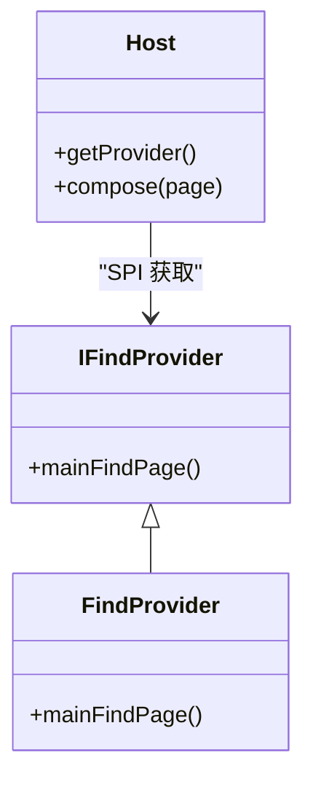

**图示来源**
- [IFindProvider.kt:1-13](file://lib_book_common/src/main/java/com/ebook/common/provider/IFindProvider.kt#L1-L13)
- [FindProvider.kt:1-19](file://module_find/src/main/java/com/ebook/find/provider/FindProvider.kt#L1-L19)
- [IBookProvider.kt:1-23](file://lib_book_common/src/main/java/com/ebook/common/provider/IBookProvider.kt#L1-L23)
- [BookProvider.kt:1-16](file://module_book/src/main/java/com/ebook/book/provider/BookProvider.kt#L1-L16)

**章节来源**
- [IFindProvider.kt:1-13](file://lib_book_common/src/main/java/com/ebook/common/provider/IFindProvider.kt#L1-L13)
- [FindProvider.kt:1-19](file://module_find/src/main/java/com/ebook/find/provider/FindProvider.kt#L1-L19)
- [IBookProvider.kt:1-23](file://lib_book_common/src/main/java/com/ebook/common/provider/IBookProvider.kt#L1-L23)
- [BookProvider.kt:1-16](file://module_book/src/main/java/com/ebook/book/provider/BookProvider.kt#L1-L16)

### 扩展案例三：业务逻辑扩展
以登录能力为例：
- 公共接口 ILoginProvider 定义 logout()
- module_login 的 LoginProvider 通过 TheRouter ServiceProvider 暴露
- LoginProvider 内部通过 EntryPointAccessors 从 Hilt 图获取 UserRepository
- 其他模块只需依赖 ILoginProvider，不直接依赖 module_login

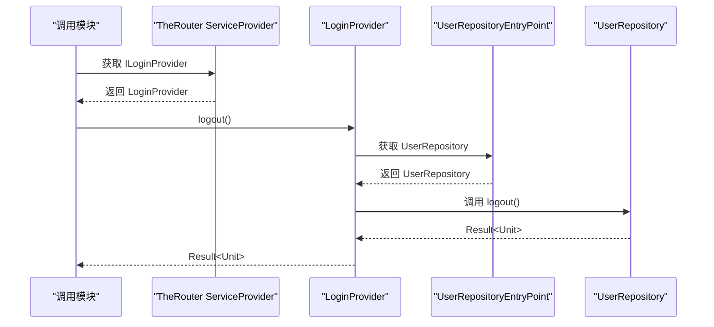

**图示来源**
- [ILoginProvider.kt:1-19](file://lib_book_common/src/main/java/com/ebook/common/provider/ILoginProvider.kt#L1-L19)
- [LoginProvider.kt:1-36](file://module_login/src/main/java/com/ebook/login/provider/LoginProvider.kt#L1-L36)

**章节来源**
- [ILoginProvider.kt:1-19](file://lib_book_common/src/main/java/com/ebook/common/provider/ILoginProvider.kt#L1-L19)
- [LoginProvider.kt:1-36](file://module_login/src/main/java/com/ebook/login/provider/LoginProvider.kt#L1-L36)

## 依赖关系分析
下图总结 Provider、拦截器、DI 模块与核心管理器之间的关系。

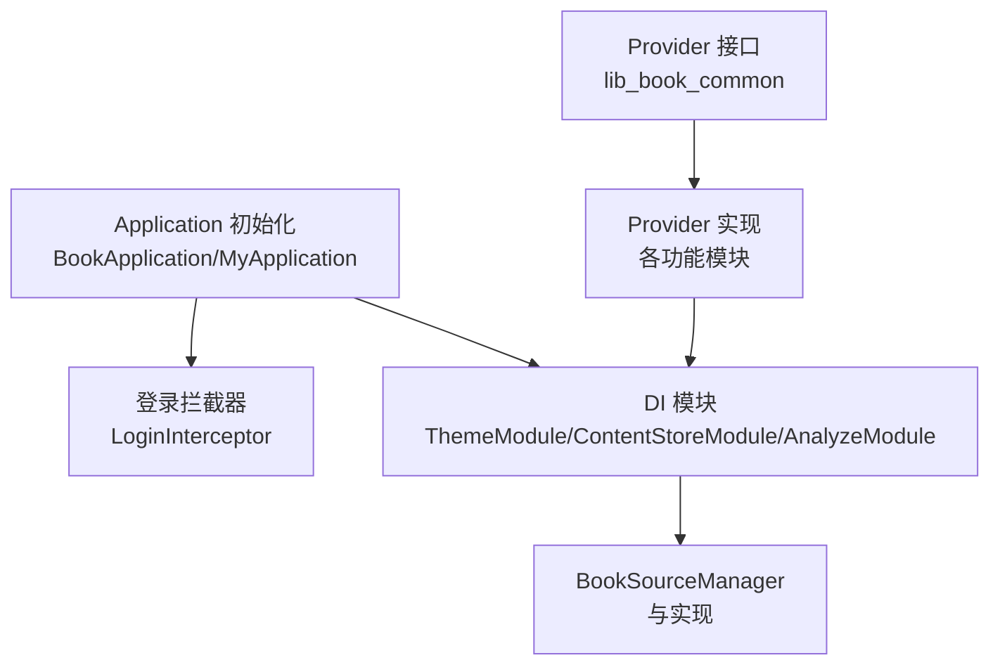

**图示来源**
- [ILoginProvider.kt:1-19](file://lib_book_common/src/main/java/com/ebook/common/provider/ILoginProvider.kt#L1-L19)
- [LoginInterceptor.kt:1-42](file://lib_book_common/src/main/java/com/ebook/common/interceptor/LoginInterceptor.kt#L1-L42)
- [ThemeModule.kt:1-26](file://lib_book_common/src/main/java/com/ebook/common/di/ThemeModule.kt#L1-L26)
- [ContentStoreModule.kt:1-87](file://lib_book_common/src/main/java/com/ebook/common/di/ContentStoreModule.kt#L1-L87)
- [AnalyzeModule.kt:1-18](file://lib_book_common/src/main/java/com/ebook/common/di/AnalyzeModule.kt#L1-L18)
- [BookSourceManager.kt:1-200](file://lib_book_common/src/main/java/com/ebook/common/analyze/source/BookSourceManager.kt#L1-L200)
- [BookApplication.kt:1-64](file://lib_book_common/src/main/java/com/ebook/common/BookApplication.kt#L1-L64)
- [MyApplication.kt:1-66](file://module_app/src/main/java/com/ebook/MyApplication.kt#L1-L66)

**章节来源**
- [LoginInterceptor.kt:1-42](file://lib_book_common/src/main/java/com/ebook/common/interceptor/LoginInterceptor.kt#L1-L42)
- [ContentStoreModule.kt:1-87](file://lib_book_common/src/main/java/com/ebook/common/di/ContentStoreModule.kt#L1-L87)
- [AnalyzeModule.kt:1-18](file://lib_book_common/src/main/java/com/ebook/common/di/AnalyzeModule.kt#L1-L18)
- [BookSourceManager.kt:1-200](file://lib_book_common/src/main/java/com/ebook/common/analyze/source/BookSourceManager.kt#L1-L200)
- [BookApplication.kt:1-64](file://lib_book_common/src/main/java/com/ebook/common/BookApplication.kt#L1-L64)
- [MyApplication.kt:1-66](file://module_app/src/main/java/com/ebook/MyApplication.kt#L1-L66)

## 性能与可扩展性
- 书源解析器缓存：BookSourceManagerImpl 使用 LRU 缓存 parser，容量较小以避免内存膨胀，同时保证并发安全
- 聚合搜索并发限制：默认并发上限为 5，避免对第三方站点造成风控风险
- 导入与正文读取分流：ContentStoreModule 区分导入期 SourceReader 与正文期 ChapterReader，降低无关依赖耦合
- 主题与依赖获取延迟：Application 中使用 EntryPoint 延迟获取依赖，避免沙箱进程崩溃

优化建议：
- 新增解析器时评估缓存策略与并发影响
- 跨模块大对象传递改用 URL/ID，避免 Binder 事务过大
- Provider 中尽量保持无状态，复杂逻辑下沉到 Repository/Service

[本节为通用指导，不直接分析具体文件]

## 故障排查
常见问题与定位思路：
- 沙箱进程崩溃：检查是否在 Application 字段上使用 eager @Inject；改为 EntryPointAccessors 延迟获取
- 路由跳转无效：确认 @Route path 是否正确，拦截器是否重定向到登录页，Bundle key 是否与 RouteArgs 一致
- Provider 为空：确认模块是否正确实现 Provider 并通过 ServiceProvider 暴露；独立运行时允许空实现
- 书源解析失败：检查 BookSourceManager 的 format 分支是否覆盖新类型；查看日志中是否有规则解析异常
- 主题不生效：确认 BookApplication 是否安装主题，ThemeModeManager 是否通过 EntryPoint 正确注入

**章节来源**
- [BookApplication.kt:1-64](file://lib_book_common/src/main/java/com/ebook/common/BookApplication.kt#L1-L64)
- [MyApplication.kt:1-66](file://module_app/src/main/java/com/ebook/MyApplication.kt#L1-L66)
- [LoginInterceptor.kt:1-42](file://lib_book_common/src/main/java/com/ebook/common/interceptor/LoginInterceptor.kt#L1-L42)
- [RouteArgs.kt:1-50](file://lib_book_common/src/main/java/com/ebook/common/event/RouteArgs.kt#L1-L50)

## 结论
该项目的扩展体系围绕 Provider 接口、TheRouter 路由与 Hilt 依赖注入展开：
- Provider 接口位于公共库，具体实现在各功能模块，宿主持有接口即可组合页面
- TheRouter 负责路由注册、拦截与参数传递，登录拦截器统一处理鉴权
- Hilt 通过 Module、@Provides、@Binds 与 EntryPoint 完成依赖装配，并与沙箱进程隔离兼容
- 书源扩展点在解析层与 DI 模块，新增格式需同步更新分发逻辑

遵循本文规范与示例，可以在不破坏现有架构的前提下，快速扩展书源、UI 与业务能力。

[本节为总结，不直接分析具体文件]

## 附录：扩展开发清单
- 新增 Provider：
  - 在 lib_book_common 定义接口
  - 在对应模块实现 Provider，并用 @ServiceProvider 暴露
  - 宿主通过 TheRouter SPI 获取并组合页面
- 新增路由：
  - 使用 @Route(path = KeyCode.Xxx.PATH) 声明
  - 如需登录保护，添加 needLogin 参数
  - 跨模块参数 key 使用 RouteArgs
- 新增依赖：
  - 在合适模块中添加 @Module，使用 @Provides 或 @Binds
  - 使用 @InstallIn(SingletonComponent::class) 与 @Singleton
  - 在 Application 中通过 EntryPointAccessors 延迟获取
- 新增书源类型：
  - 实现 BookParser 或 SourceReader
  - 在 ContentStoreModule 中注册 Reader/Parser 映射
  - 更新 BookSourceManager 的 format 分发逻辑
- 初始化扩展：
  - 在 BookApplication 中扩展主题或 Compose 装配
  - 在 MyApplication 中注册拦截器与启动任务
  - 始终考虑沙箱进程门，避免提前 IO 或持久化

[本节为清单，不直接分析具体文件]