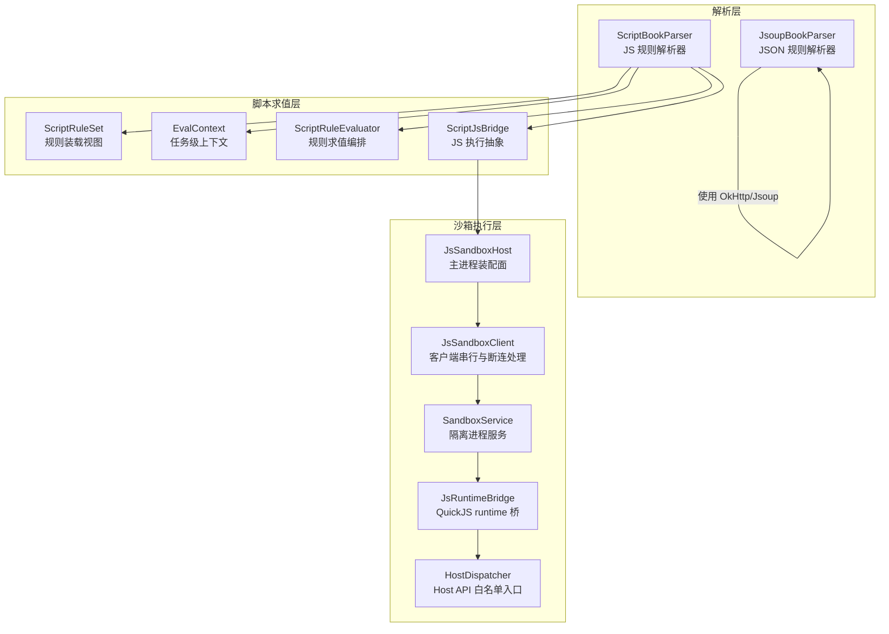
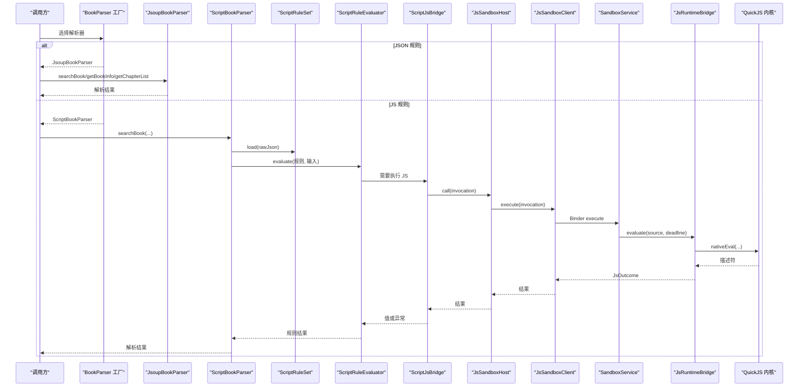
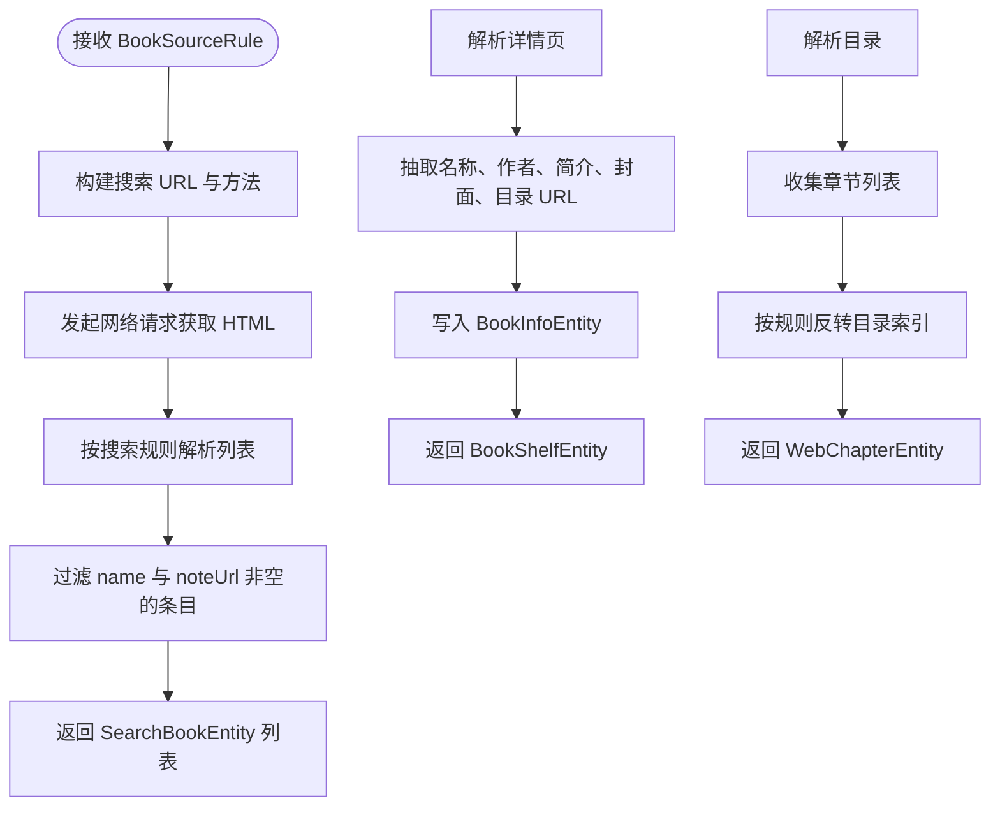
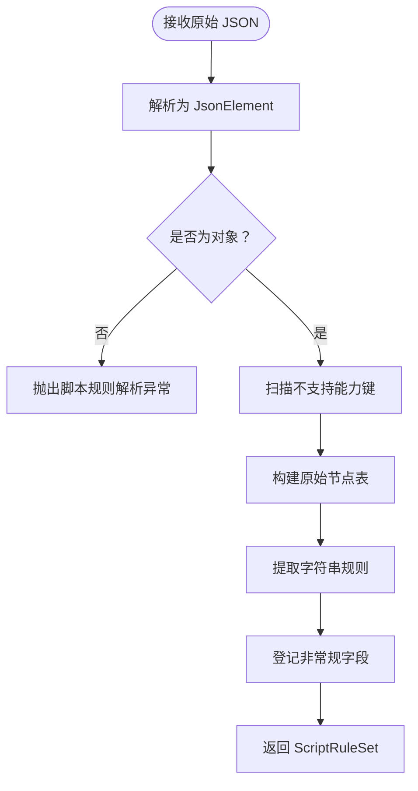
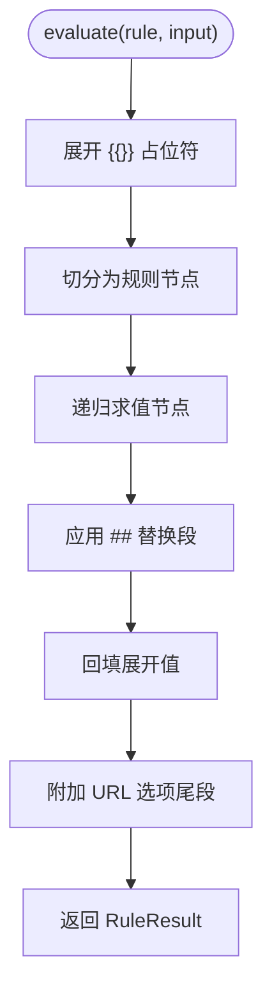
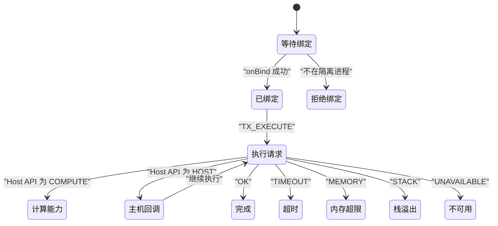
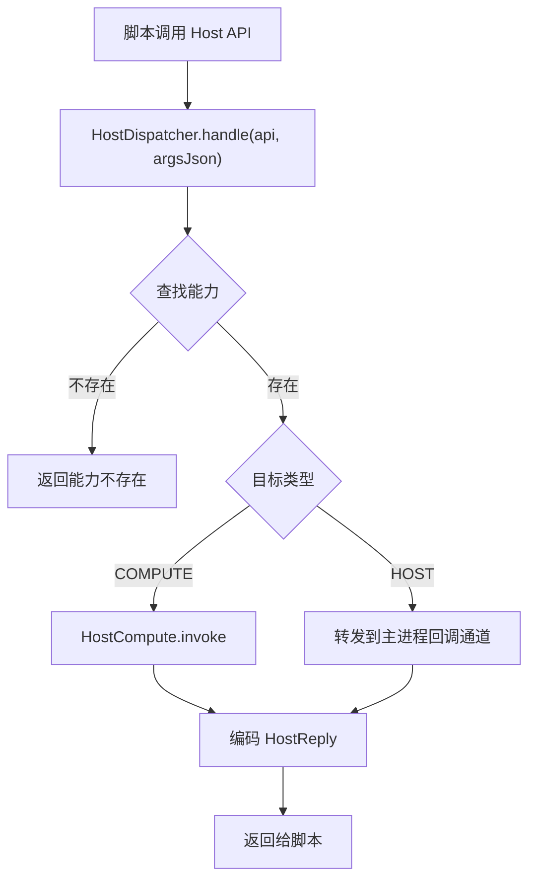
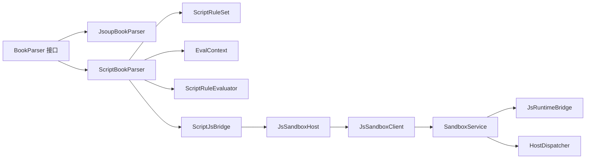
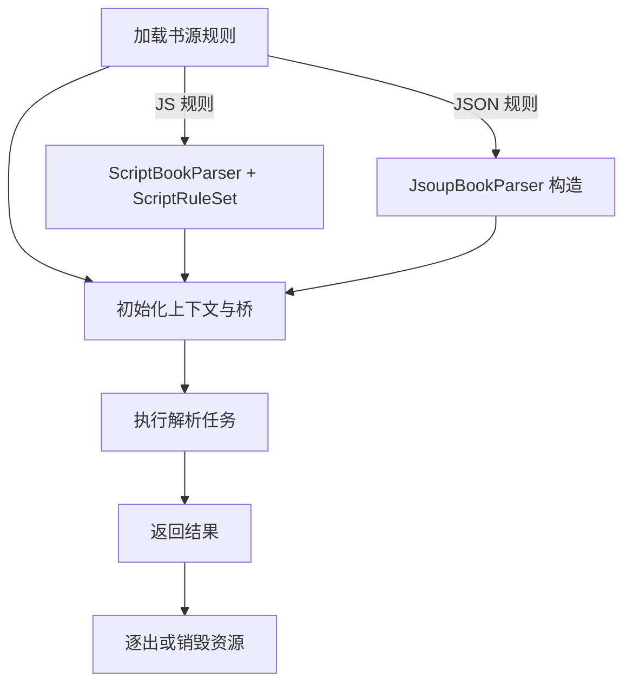

# 插件化架构

<cite>
**本文引用的文件**   
- [lib_book_source/src/main/java/com/ebook/source/analyze/ScriptBookParser.kt](file://lib_book_source/src/main/java/com/ebook/source/analyze/ScriptBookParser.kt)
- [lib_book_source/src/main/java/com/ebook/source/analyze/JsoupBookParser.kt](file://lib_book_source/src/main/java/com/ebook/source/analyze/JsoupBookParser.kt)
- [lib_book_source/src/main/java/com/ebook/source/script/ScriptRuleSet.kt](file://lib_book_source/src/main/java/com/ebook/source/script/ScriptRuleSet.kt)
- [lib_book_source/src/main/java/com/ebook/source/script/EvalContext.kt](file://lib_book_source/src/main/java/com/ebook/source/script/EvalContext.kt)
- [lib_book_source/src/main/java/com/ebook/source/script/ScriptRuleEvaluator.kt](file://lib_book_source/src/main/java/com/ebook/source/script/ScriptRuleEvaluator.kt)
- [lib_book_source/src/main/java/com/ebook/source/script/ScriptJsBridge.kt](file://lib_book_source/src/main/java/com/ebook/source/script/ScriptJsBridge.kt)
- [lib_book_source/src/main/java/com/ebook/source/sandbox/SandboxService.kt](file://lib_book_source/src/main/java/com/ebook/source/sandbox/SandboxService.kt)
- [lib_book_source/src/main/java/com/ebook/source/sandbox/JsSandboxClient.kt](file://lib_book_source/src/main/java/com/ebook/source/sandbox/JsSandboxClient.kt)
- [lib_book_source/src/main/java/com/ebook/source/sandbox/SandboxContract.kt](file://lib_book_source/src/main/java/com/ebook/source/sandbox/SandboxContract.kt)
- [lib_book_source/src/main/java/com/ebook/source/sandbox/JsRuntimeBridge.kt](file://lib_book_source/src/main/java/com/ebook/source/sandbox/JsRuntimeBridge.kt)
- [lib_book_source/src/main/java/com/ebook/source/sandbox/HostDispatcher.kt](file://lib_book_source/src/main/java/com/ebook/source/sandbox/HostDispatcher.kt)
- [lib_book_source/src/main/java/com/ebook/source/sandbox/JsSandboxHost.kt](file://lib_book_source/src/main/java/com/ebook/source/sandbox/JsSandboxHost.kt)
- [docs/adr/0028-untrusted-js-sandbox.md](file://docs/adr/0028-untrusted-js-sandbox.md)
- [docs/superpowers/plans/2026-09-09-script-source-book-parser.md](file://docs/superpowers/plans/2026-09-09-script-source-book-parser.md)
</cite>

## 目录
1. [引言](#引言)
2. [项目结构](#项目结构)
3. [核心组件](#核心组件)
4. [架构总览](#架构总览)
5. [详细组件分析](#详细组件分析)
6. [依赖关系分析](#依赖关系分析)
7. [性能与安全特性](#性能与安全特性)
8. [插件生命周期管理](#插件生命周期管理)
9. [配置管理与版本兼容](#配置管理与版本兼容)
10. [扩展点与实现规范](#扩展点与实现规范)
11. [故障排查指南](#故障排查指南)
12. [结论](#结论)

## 引言
本仓库的“书源”体系采用插件化架构：不同网站或数据源的解析逻辑以规则或脚本形式注入，而不是硬编码进应用。其关键设计是双引擎解析器——JSON 规则解析器与 JavaScript 脚本解析器——共用同一套 BookParser 接口，从而让声明式规则与可编程脚本在搜索、详情、目录、正文和发现页上统一接入聚合搜索与阅读链路。

JavaScript 侧通过 QuickJS 沙箱执行，采用独立 Android 隔离进程、零权限默认拒绝、白名单 Host API、Binder 双向协议、超时/堆/栈/字节四重限制等机制，确保不可信脚本不会访问主进程敏感资源。同时，插件（书源）具备明确的加载、初始化、执行、卸载生命周期，并通过协议版本与能力矩阵控制兼容性。

## 项目结构
与插件化书源直接相关的代码集中在 `lib_book_source` 模块中，按职责分为三层：

- **解析层（analyze）**：对外暴露 BookParser 实现，包括 JSON 规则的 JsoupBookParser 和 JS 规则的 ScriptBookParser。
- **脚本求值层（script）**：负责解析脚本规则、构建上下文、组合链式/CSS/正则/JSONPath 求值、URL 展开、翻页编排等。
- **沙箱执行层（sandbox）**：负责 QuickJS 进程隔离、Binder 协议、运行时桥接、Host API 白名单与网络守卫。

**图示来源**
- [lib_book_source/src/main/java/com/ebook/source/analyze/JsoupBookParser.kt:1-50](file://lib_book_source/src/main/java/com/ebook/source/analyze/JsoupBookParser.kt#L1-L50)
- [lib_book_source/src/main/java/com/ebook/source/analyze/ScriptBookParser.kt:1-60](file://lib_book_source/src/main/java/com/ebook/source/analyze/ScriptBookParser.kt#L1-L60)
- [lib_book_source/src/main/java/com/ebook/source/script/ScriptRuleSet.kt:1-40](file://lib_book_source/src/main/java/com/ebook/source/script/ScriptRuleSet.kt#L1-L40)
- [lib_book_source/src/main/java/com/ebook/source/script/EvalContext.kt:1-30](file://lib_book_source/src/main/java/com/ebook/source/script/EvalContext.kt#L1-L30)
- [lib_book_source/src/main/java/com/ebook/source/script/ScriptRuleEvaluator.kt:1-30](file://lib_book_source/src/main/java/com/ebook/source/script/ScriptRuleEvaluator.kt#L1-L30)
- [lib_book_source/src/main/java/com/ebook/source/sandbox/JsSandboxHost.kt:1-30](file://lib_book_source/src/main/java/com/ebook/source/sandbox/JsSandboxHost.kt#L1-L30)
- [lib_book_source/src/main/java/com/ebook/source/sandbox/JsSandboxClient.kt:1-40](file://lib_book_source/src/main/java/com/ebook/source/sandbox/JsSandboxClient.kt#L1-L40)
- [lib_book_source/src/main/java/com/ebook/source/sandbox/SandboxService.kt:1-40](file://lib_book_source/src/main/java/com/ebook/source/sandbox/SandboxService.kt#L1-L40)
- [lib_book_source/src/main/java/com/ebook/source/sandbox/JsRuntimeBridge.kt:1-30](file://lib_book_source/src/main/java/com/ebook/source/sandbox/JsRuntimeBridge.kt#L1-L30)
- [lib_book_source/src/main/java/com/ebook/source/sandbox/HostDispatcher.kt:1-30](file://lib_book_source/src/main/java/com/ebook/source/sandbox/HostDispatcher.kt#L1-L30)

**章节来源**
- [docs/superpowers/plans/2026-09-09-script-source-book-parser.md:1-60](file://docs/superpowers/plans/2026-09-09-script-source-book-parser.md#L1-L60)

## 核心组件
本节聚焦插件化架构中的关键角色及其职责。

### JSON 规则解析器：JsoupBookParser
JsoupBookParser 是基于结构化 JSON 规则的书源解析器。它根据 BookSourceRule 动态解析 HTML，支持搜索、详情、目录、分类书籍等求值面。该实现面向“声明式规则”，不需要执行任意脚本，因此不经过 QuickJS 沙箱。

主要特点：
- 以 BookSourceRule 作为输入，构造时即持有规则对象。
- 搜索页面通过 ListPageUrl 渲染 URL，并复用 method/body。
- 详情、目录、分类分别对应不同的规则字段集合。
- 失败路径通常记录日志并返回空列表，保证单源异常不影响聚合结果。

**章节来源**
- [lib_book_source/src/main/java/com/ebook/source/analyze/JsoupBookParser.kt:1-120](file://lib_book_source/src/main/java/com/ebook/source/analyze/JsoupBookParser.kt#L1-L120)

### JS 规则解析器：ScriptBookParser
ScriptBookParser 是脚本书源的 BookParser 实现，把词法、求值、取文层装配成五个求值面：搜索、详情、目录、正文、发现。它不是直接把脚本跑起来，而是先装载 ScriptRuleSet，再借助 EvalContext、ScriptRuleEvaluator、ScriptJsBridge 和沙箱执行器完成规则求值。

关键行为：
- 构造期只保存原始 JSON，规则装载惰性进行，避免 getParserFor 抛出未类型化异常。
- 首次求值时才解析 JSON；若 JSON 坏，会在求值期抛出类型化解析异常。
- 维护源级会话 Cookie，但不落盘。
- 为每次解析任务创建 EvalContext，并注入 sourceJson、chapterJson、title 等绑定。
- 提供 SourceHostAllowlist 与 JsNetworkGuard，限制沙箱外呼目标。

**章节来源**
- [lib_book_source/src/main/java/com/ebook/source/analyze/ScriptBookParser.kt:1-120](file://lib_book_source/src/main/java/com/ebook/source/analyze/ScriptBookParser.kt#L1-L120)

### 规则装载视图：ScriptRuleSet
ScriptRuleSet 是脚本书源 JSON 的规则装载视图，包含源级元数据、规则对象映射、原始节点表、非常规字段、不支持能力标记和原始 JSON 文本。

职责：
- 提供 rule(kind, field) 字符串规则读取。
- 提供 jsonField(kind, field) 原始 JsonElement 读取，供 URL 数组形态翻页消费。
- 提供 nextUrlArray(kind, field) 提取 URL 数组元素。
- 提供 sourceBindingJson() 生成脚本可见的 source 数据面。
- 扫描 loginUrl/jsLib/coverDecodeJs/exploreScreen/bookUrlPattern/ruleReview/webJs/sourceRegex/contentBatch/downloadUrls 等键，登记不支持能力。

**章节来源**
- [lib_book_source/src/main/java/com/ebook/source/script/ScriptRuleSet.kt:1-120](file://lib_book_source/src/main/java/com/ebook/source/script/ScriptRuleSet.kt#L1-L120)

### 任务上下文：EvalContext
EvalContext 表示一次解析任务的可变上下文，作用域限定为单次解析任务。它保存 baseUrl、key、page、sourceVariable、variables、js 桥，以及 withoutJs() 生成的嵌套求值视图。

重要语义：
- baseUrl 可变：翻页链每取一页就推进到该页绝对地址。
- variables 用 LinkedHashMap 保序，便于错误日志可读。
- withoutJs() 共享变量表引用，但快照 key/page/baseUrl，避免内层修改影响外层翻页基准。
- builtin(name) 仅暴露 key/page/baseUrl 等声明式子集。

**章节来源**
- [lib_book_source/src/main/java/com/ebook/source/script/EvalContext.kt:1-83](file://lib_book_source/src/main/java/com/ebook/source/script/EvalContext.kt#L1-L83)

### 规则求值编排：ScriptRuleEvaluator
ScriptRuleEvaluator 是规则求值的分发与组合中心，对应规格 §9 的处理步骤：展开占位符、切分规则、逐支求值、替换段处理、URL 尾段回附。

主要能力：
- evaluate(rule, input, tail) 处理单条规则。
- evaluateOnItem(fieldRule, item) 处理正则 AllInOne 单个条目。
- evaluateOnJsonItem(fieldRule, item) 处理 JSONPath 单个条目。
- evaluateInitObject(rule, input) 处理 init 的 JS 分支。
- 支持 ||、&&、%% 三类复合规则。
- 对语法错误、未取到值、待执行 JS 等给出类型化区分。

**章节来源**
- [lib_book_source/src/main/java/com/ebook/source/script/ScriptRuleEvaluator.kt:1-120](file://lib_book_source/src/main/java/com/ebook/source/script/ScriptRuleEvaluator.kt#L1-L120)

### JS 执行抽象：ScriptJsBridge
ScriptJsBridge 是规则层看到的“会跑 JS 的东西”，定义五种执行入口：整段脚本、表达式、URL 改写、响应体二次处理、init 对象。

关键点：
- 不泛化为 run(mode, source)，因为各入口参数与返回值语义不同。
- 失败口径统一：运行失败抛类型化异常，undefined 视作 Miss。
- 由沙箱实现 SandboxScriptJs 提供真实执行。

**章节来源**
- [lib_book_source/src/main/java/com/ebook/source/script/ScriptJsBridge.kt:1-37](file://lib_book_source/src/main/java/com/ebook/source/script/ScriptJsBridge.kt#L1-L37)

## 架构总览
下图展示插件化书源从外部调用到内部解析的双引擎分流，以及 JS 规则进入 QuickJS 沙箱的完整流程。

**图示来源**
- [lib_book_source/src/main/java/com/ebook/source/analyze/JsoupBookParser.kt:1-80](file://lib_book_source/src/main/java/com/ebook/source/analyze/JsoupBookParser.kt#L1-L80)
- [lib_book_source/src/main/java/com/ebook/source/analyze/ScriptBookParser.kt:1-120](file://lib_book_source/src/main/java/com/ebook/source/analyze/ScriptBookParser.kt#L1-L120)
- [lib_book_source/src/main/java/com/ebook/source/script/ScriptRuleSet.kt:1-60](file://lib_book_source/src/main/java/com/ebook/source/script/ScriptRuleSet.kt#L1-L60)
- [lib_book_source/src/main/java/com/ebook/source/script/ScriptRuleEvaluator.kt:1-80](file://lib_book_source/src/main/java/com/ebook/source/script/ScriptRuleEvaluator.kt#L1-L80)
- [lib_book_source/src/main/java/com/ebook/source/script/ScriptJsBridge.kt:1-37](file://lib_book_source/src/main/java/com/ebook/source/script/ScriptJsBridge.kt#L1-L37)
- [lib_book_source/src/main/java/com/ebook/source/sandbox/JsSandboxHost.kt:1-60](file://lib_book_source/src/main/java/com/ebook/source/sandbox/JsSandboxHost.kt#L1-L60)
- [lib_book_source/src/main/java/com/ebook/source/sandbox/JsSandboxClient.kt:1-120](file://lib_book_source/src/main/java/com/ebook/source/sandbox/JsSandboxClient.kt#L1-L120)
- [lib_book_source/src/main/java/com/ebook/source/sandbox/SandboxService.kt:1-120](file://lib_book_source/src/main/java/com/ebook/source/sandbox/SandboxService.kt#L1-L120)
- [lib_book_source/src/main/java/com/ebook/source/sandbox/JsRuntimeBridge.kt:1-80](file://lib_book_source/src/main/java/com/ebook/source/sandbox/JsRuntimeBridge.kt#L1-L80)

## 详细组件分析

### JSON 规则解析引擎
JsoupBookParser 的核心思路是“规则驱动 HTML 解析”。它把 BookSourceRule 中的搜索、详情、目录、分类等规则映射到具体网络请求与 Jsoup 选择器。

#### 数据处理流程

**图示来源**
- [lib_book_source/src/main/java/com/ebook/source/analyze/JsoupBookParser.kt:1-200](file://lib_book_source/src/main/java/com/ebook/source/analyze/JsoupBookParser.kt#L1-L200)

#### 复杂度与性能
- 时间复杂度主要取决于 HTML 大小、选择器匹配次数、章节页数。
- 空间复杂度取决于 DOM 树与中间解析结果。
- 对单源异常采用捕获日志并返回空集合的策略，有利于聚合搜索容错。

**章节来源**
- [lib_book_source/src/main/java/com/ebook/source/analyze/JsoupBookParser.kt:1-200](file://lib_book_source/src/main/java/com/ebook/source/analyze/JsoupBookParser.kt#L1-L200)

### JS 规则解析引擎
JS 规则解析引擎比 JSON 规则更灵活：规则本身可以是字符串、数组、对象甚至脚本片段，并由 ScriptRuleSet 与 ScriptRuleEvaluator 共同解释。

#### 规则装载与能力检查
ScriptRuleSet.load 做三件事：
1. 解析顶层 JSON。
2. 扫描不支持能力键，登记 ScriptUnsupported。
3. 构建 objects 与 rawObjects，保留字符串规则与原始节点。

**图示来源**
- [lib_book_source/src/main/java/com/ebook/source/script/ScriptRuleSet.kt:120-286](file://lib_book_source/src/main/java/com/ebook/source/script/ScriptRuleSet.kt#L120-L286)

**章节来源**
- [lib_book_source/src/main/java/com/ebook/source/script/ScriptRuleSet.kt:1-286](file://lib_book_source/src/main/java/com/ebook/source/script/ScriptRuleSet.kt#L1-L286)

#### 规则求值与组合
ScriptRuleEvaluator 负责把规则拆成节点树并按模式求值。典型流程如下：

**图示来源**
- [lib_book_source/src/main/java/com/ebook/source/script/ScriptRuleEvaluator.kt:1-120](file://lib_book_source/src/main/java/com/ebook/source/script/ScriptRuleEvaluator.kt#L1-L120)

**章节来源**
- [lib_book_source/src/main/java/com/ebook/source/script/ScriptRuleEvaluator.kt:1-200](file://lib_book_source/src/main/java/com/ebook/source/script/ScriptRuleEvaluator.kt#L1-L200)

### QuickJS 沙箱执行环境
QuickJS 沙箱是整个插件化架构的安全边界。它的核心目标是：**允许执行社区提供的脚本，但严格限制脚本能访问的资源**。

#### 安全隔离机制
- 执行器运行在 isolatedProcess 隔离进程中，零权限，SELinux 受限。
- SandboxService.onBind 自我校验是否真的处于隔离进程；如果不是，直接返回 null。
- 控制面方法 exported=false，只有同应用可绑定。
- 协议 token 与版本号校验，防止误递 binder 或两侧不同步。
- 所有能力 deny-by-default，仅注册白名单 Host API。

**图示来源**
- [lib_book_source/src/main/java/com/ebook/source/sandbox/SandboxService.kt:1-120](file://lib_book_source/src/main/java/com/ebook/source/sandbox/SandboxService.kt#L1-L120)
- [lib_book_source/src/main/java/com/ebook/source/sandbox/JsRuntimeBridge.kt:1-113](file://lib_book_source/src/main/java/com/ebook/source/sandbox/JsRuntimeBridge.kt#L1-L113)

**章节来源**
- [docs/adr/0028-untrusted-js-sandbox.md:1-65](file://docs/adr/0028-untrusted-js-sandbox.md#L1-L65)
- [lib_book_source/src/main/java/com/ebook/source/sandbox/SandboxService.kt:1-200](file://lib_book_source/src/main/java/com/ebook/source/sandbox/SandboxService.kt#L1-L200)

#### 权限控制
HostDispatcher 是脚本能力的唯一入口，按 jsName 查能力表，并区分两类目标：
- COMPUTE：纯计算类 API，如 md5、base64、对称加密、hex、时间格式化。
- HOST：需要主进程代理的能力，如受限网络、递归规则求值、变量存取。

**图示来源**
- [lib_book_source/src/main/java/com/ebook/source/sandbox/HostDispatcher.kt:1-74](file://lib_book_source/src/main/java/com/ebook/source/sandbox/HostDispatcher.kt#L1-L74)

**章节来源**
- [lib_book_source/src/main/java/com/ebook/source/sandbox/HostDispatcher.kt:1-74](file://lib_book_source/src/main/java/com/ebook/source/sandbox/HostDispatcher.kt#L1-L74)

#### 性能优化
- JsSandboxClient.execute 使用 inFlight 锁串行化执行，避免多源并发抢占同一个 runtime。
- 超时使用单调时钟 SystemClock.elapsedRealtime，跨进程可比。
- JsRuntimeBridge 复用 JSRuntime，但每次任务重建 JSContext，隔离全局状态。
- 连接期限与规则挂钟预算分离，冷启动连接失败快速失败。
- 请求/响应字节上限保护 Binder 事务缓冲，避免 TransactionTooLargeException。

**章节来源**
- [lib_book_source/src/main/java/com/ebook/source/sandbox/JsSandboxClient.kt:1-185](file://lib_book_source/src/main/java/com/ebook/source/sandbox/JsSandboxClient.kt#L1-L185)
- [lib_book_source/src/main/java/com/ebook/source/sandbox/JsRuntimeBridge.kt:1-113](file://lib_book_source/src/main/java/com/ebook/source/sandbox/JsRuntimeBridge.kt#L1-L113)

## 依赖关系分析
插件化架构的关键依赖如下：

- BookParser 是解析层对外契约，JsoupBookParser 与 ScriptBookParser 是其两个实现。
- ScriptBookParser 依赖 ScriptRuleSet、EvalContext、ScriptRuleEvaluator、ScriptJsBridge。
- ScriptJsBridge 由 JsSandboxHost 装配，最终通过 JsSandboxClient 与 SandboxService 通信。
- SandboxService 依赖 JsRuntimeBridge 与 HostDispatcher。
- HostDispatcher 依赖 JsHostApi 能力表，并将 HOST 类能力中继给主进程。

**图示来源**
- [lib_book_source/src/main/java/com/ebook/source/analyze/JsoupBookParser.kt:1-60](file://lib_book_source/src/main/java/com/ebook/source/analyze/JsoupBookParser.kt#L1-L60)
- [lib_book_source/src/main/java/com/ebook/source/analyze/ScriptBookParser.kt:1-80](file://lib_book_source/src/main/java/com/ebook/source/analyze/ScriptBookParser.kt#L1-L80)
- [lib_book_source/src/main/java/com/ebook/source/script/ScriptRuleSet.kt:1-60](file://lib_book_source/src/main/java/com/ebook/source/script/ScriptRuleSet.kt#L1-L60)
- [lib_book_source/src/main/java/com/ebook/source/script/EvalContext.kt:1-40](file://lib_book_source/src/main/java/com/ebook/source/script/EvalContext.kt#L1-L40)
- [lib_book_source/src/main/java/com/ebook/source/script/ScriptRuleEvaluator.kt:1-60](file://lib_book_source/src/main/java/com/ebook/source/script/ScriptRuleEvaluator.kt#L1-L60)
- [lib_book_source/src/main/java/com/ebook/source/script/ScriptJsBridge.kt:1-37](file://lib_book_source/src/main/java/com/ebook/source/script/ScriptJsBridge.kt#L1-L37)
- [lib_book_source/src/main/java/com/ebook/source/sandbox/JsSandboxHost.kt:1-60](file://lib_book_source/src/main/java/com/ebook/source/sandbox/JsSandboxHost.kt#L1-L60)
- [lib_book_source/src/main/java/com/ebook/source/sandbox/JsSandboxClient.kt:1-80](file://lib_book_source/src/main/java/com/ebook/source/sandbox/JsSandboxClient.kt#L1-L80)
- [lib_book_source/src/main/java/com/ebook/source/sandbox/SandboxService.kt:1-120](file://lib_book_source/src/main/java/com/ebook/source/sandbox/SandboxService.kt#L1-L120)
- [lib_book_source/src/main/java/com/ebook/source/sandbox/JsRuntimeBridge.kt:1-80](file://lib_book_source/src/main/java/com/ebook/source/sandbox/JsRuntimeBridge.kt#L1-L80)
- [lib_book_source/src/main/java/com/ebook/source/sandbox/HostDispatcher.kt:1-74](file://lib_book_source/src/main/java/com/ebook/source/sandbox/HostDispatcher.kt#L1-L74)

**章节来源**
- [lib_book_source/src/main/java/com/ebook/source/analyze/ScriptBookParser.kt:1-120](file://lib_book_source/src/main/java/com/ebook/source/analyze/ScriptBookParser.kt#L1-L120)
- [lib_book_source/src/main/java/com/ebook/source/sandbox/JsSandboxHost.kt:1-60](file://lib_book_source/src/main/java/com/ebook/source/sandbox/JsSandboxHost.kt#L1-L60)

## 性能与安全特性

### 性能特性
- 串行执行：JsSandboxClient.inFlight 保证同一时刻只有一个沙箱调用，避免多源并发争抢 runtime。
- 单调时钟：超时基于 SystemClock.elapsedRealtime，跨进程一致。
- Runtime 复用、Context 重置：JsRuntimeBridge 复用 handle，但在 TIMEOUT/MEMORY/STACK 后强制 reset。
- 连接期限独立：bindTimeoutMs 与规则挂钟预算分开，冷启动失败更快上报。
- 字节上限：Binder 事务缓冲约 1MB，请求与响应帧均受 JsLimits 限制。

### 安全特性
- 隔离进程：android:isolatedProcess=true，SELinux 受限，无 socket、无文件、无 App 数据。
- 自校验：SandboxService.onBind 判断 Process.isIsolated()，非隔离则拒绝。
- 白名单能力：HostDispatcher 只放行 JsHostApi 注册能力。
- 禁止阻塞原语：QuickJS 内核 Atomics.wait 被禁用。
- 永不加载引擎到主进程：System.loadLibrary 只在执行器侧触发。
- 协议 token 与版本校验：防止误用 binder 或两侧不同步。

**章节来源**
- [docs/adr/0028-untrusted-js-sandbox.md:1-65](file://docs/adr/0028-untrusted-js-sandbox.md#L1-L65)
- [lib_book_source/src/main/java/com/ebook/source/sandbox/JsSandboxClient.kt:1-185](file://lib_book_source/src/main/java/com/ebook/source/sandbox/JsSandboxClient.kt#L1-L185)
- [lib_book_source/src/main/java/com/ebook/source/sandbox/SandboxService.kt:1-200](file://lib_book_source/src/main/java/com/ebook/source/sandbox/SandboxService.kt#L1-L200)
- [lib_book_source/src/main/java/com/ebook/source/sandbox/HostDispatcher.kt:1-74](file://lib_book_source/src/main/java/com/ebook/source/sandbox/HostDispatcher.kt#L1-L74)

## 插件生命周期管理
这里的“插件”指一个书源规则，既可能是 JSON 规则，也可能是 JS 规则。其生命周期可以概括为加载、初始化、执行、卸载四个阶段。

### 加载阶段
- JSON 规则：BookSourceRule 由上层装配，JsoupBookParser 构造时直接持有。
- JS 规则：ScriptBookParser 构造时只保存 rawJson，ScriptRuleSet.load 在首次求值时执行。
- 加载失败：JSON 坏行在首次求值抛出 ScriptRuleParseException，而不是构造期抛。

### 初始化阶段
- EvalContext 为每次解析任务新建，baseUrl/key/page/sourceVariable/variables 初始化。
- ScriptBookParser.newContext 注入 sourceJson、chapterJson、title 等绑定。
- JsSandboxHost.bridgeFor 装配 SandboxScriptJs，并传入 guard、transport、cookies。

### 执行阶段
- JSON 规则：JsoupBookParser 直接发起网络请求并解析 HTML。
- JS 规则：ScriptRuleEvaluator 执行规则；遇到 JS 段时通过 ScriptJsBridge 调用 JsSandboxHost -> JsSandboxClient -> SandboxService -> JsRuntimeBridge -> QuickJS。
- Host API：COMPUTE 在内核进程内计算，HOST 回调到主进程受限代理。

### 卸载阶段
- ScriptBookParser 随 BookSourceManagerImpl LRU 逐出。
- SandboxService.onDestroy 清除 HostDispatcher.relay、移除 currentCallback、关闭 bridge。
- JsRuntimeBridge.close 销毁 native handle。

**图示来源**
- [lib_book_source/src/main/java/com/ebook/source/analyze/ScriptBookParser.kt:1-120](file://lib_book_source/src/main/java/com/ebook/source/analyze/ScriptBookParser.kt#L1-L120)
- [lib_book_source/src/main/java/com/ebook/source/analyze/JsoupBookParser.kt:1-80](file://lib_book_source/src/main/java/com/ebook/source/analyze/JsoupBookParser.kt#L1-L80)
- [lib_book_source/src/main/java/com/ebook/source/script/EvalContext.kt:1-83](file://lib_book_source/src/main/java/com/ebook/source/script/EvalContext.kt#L1-L83)
- [lib_book_source/src/main/java/com/ebook/source/sandbox/SandboxService.kt:120-200](file://lib_book_source/src/main/java/com/ebook/source/sandbox/SandboxService.kt#L120-L200)
- [lib_book_source/src/main/java/com/ebook/source/sandbox/JsRuntimeBridge.kt:80-113](file://lib_book_source/src/main/java/com/ebook/source/sandbox/JsRuntimeBridge.kt#L80-L113)

**章节来源**
- [lib_book_source/src/main/java/com/ebook/source/analyze/ScriptBookParser.kt:1-120](file://lib_book_source/src/main/java/com/ebook/source/analyze/ScriptBookParser.kt#L1-L120)
- [lib_book_source/src/main/java/com/ebook/source/sandbox/SandboxService.kt:1-200](file://lib_book_source/src/main/java/com/ebook/source/sandbox/SandboxService.kt#L1-L200)
- [lib_book_source/src/main/java/com/ebook/source/sandbox/JsRuntimeBridge.kt:1-113](file://lib_book_source/src/main/java/com/ebook/source/sandbox/JsRuntimeBridge.kt#L1-L113)

## 配置管理与版本兼容
### 配置管理
- JSON 规则配置：BookSourceRule 字段对应搜索、详情、目录、分类等规则。
- JS 规则配置：ScriptRuleSet 保留原始 JSON 与字符串规则，同时记录 unsupported 与 irregularFields。
- 源级变量：variable 与 variableComment 作为 sourceBindingJson 的一部分提供给脚本。
- Header、loginUrl、lastUpdateTime 等元数据也以原文形式保留，供导入报告与脚本读取。

### 版本兼容
- 沙箱协议版本：SandboxContract.PROTOCOL_VERSION 用于 Binder 控制面，不一致时直接报 UNAVAILABLE。
- 能力矩阵：ScriptUnsupported 枚举标记登录、WebJS、XPath、下载 URL、评论等暂不支持能力，导入报告可逐条提示。
- 协议 token：INTERFACE_TOKEN 与 CALLBACK_TOKEN 区分主进程与执行器两端，防止传错 binder。
- ABI 与构建：文档指出 NDK 版本与 CMake 版本钉死在版本目录，ABI 集合作为策略而非普通构建细节。

**章节来源**
- [lib_book_source/src/main/java/com/ebook/source/script/ScriptRuleSet.kt:1-120](file://lib_book_source/src/main/java/com/ebook/source/script/ScriptRuleSet.kt#L1-L120)
- [lib_book_source/src/main/java/com/ebook/source/sandbox/SandboxContract.kt:1-47](file://lib_book_source/src/main/java/com/ebook/source/sandbox/SandboxContract.kt#L1-L47)
- [docs/adr/0028-untrusted-js-sandbox.md:40-65](file://docs/adr/0028-untrusted-js-sandbox.md#L40-L65)

## 扩展点与实现规范

### 新增书源类型
当前系统至少支持两类书源：
- JSON 规则书源：通过 JsoupBookParser 解析。
- JS 规则书源：通过 ScriptBookParser 解析。

如果要新增书源类型，应遵循以下原则：
1. 实现 BookParser 接口，而不是侵入现有解析器。
2. 将新类型的识别逻辑放在 BookSourceManagerImpl 或 parserFactory 中。
3. 如果新类型涉及网络请求，优先复用现有网络抽象，而不是各自造 OkHttpClient。
4. 如果新类型需要执行脚本，优先走 ScriptJsBridge，而不是在主进程直接 eval 脚本。

**章节来源**
- [docs/superpowers/plans/2026-09-09-script-source-book-parser.md:60-140](file://docs/superpowers/plans/2026-09-09-script-source-book-parser.md#L60-L140)

### 自定义解析逻辑
对于 JS 规则，自定义解析逻辑主要通过以下方式扩展：
- 编写新的规则表达式，交给 ScriptRuleEvaluator 处理。
- 如果需要执行脚本，通过 ScriptJsBridge 的五种入口之一。
- 如果需要宿主能力，通过 HostDispatcher 注册的 JsHostApi。
- 如果需要网络访问，通过 JsSandboxHost 提供的受限传输，不得绕过 JsNetworkGuard。

**章节来源**
- [lib_book_source/src/main/java/com/ebook/source/script/ScriptJsBridge.kt:1-37](file://lib_book_source/src/main/java/com/ebook/source/script/ScriptJsBridge.kt#L1-L37)
- [lib_book_source/src/main/java/com/ebook/source/sandbox/HostDispatcher.kt:1-74](file://lib_book_source/src/main/java/com/ebook/source/sandbox/HostDispatcher.kt#L1-L74)

### 新 Host API 实现规范
新增 Host API 时应遵守：
1. 在 JsHostApi 中声明能力，明确 apiName、jsName、target。
2. 如果是纯计算，使用 JsApiTarget.COMPUTE，并在 HostCompute 中实现。
3. 如果需要访问主进程资源，使用 JsApiTarget.HOST，并通过 HostDispatcher.relay 转发。
4. 严禁新增反射、JNI、Java/Android 大 API 的直接桥接。
5. 所有失败必须类型化，不能吞异常或返回模糊错误。

**章节来源**
- [lib_book_source/src/main/java/com/ebook/source/sandbox/HostDispatcher.kt:1-74](file://lib_book_source/src/main/java/com/ebook/source/sandbox/HostDispatcher.kt#L1-L74)
- [docs/adr/0028-untrusted-js-sandbox.md:15-35](file://docs/adr/0028-untrusted-js-sandbox.md#L15-L35)

## 故障排查指南

### 常见故障定位
- “沙箱不可用”：可能原因包括 .so 未加载、协议版本不合、进程未隔离、连接超时。
- “脚本解析失败”：ScriptRuleSet.load 抛出的类型化异常，消息通常包含“脚本书源 JSON 无法解析”。
- “脚本执行超时”：wall-clock 超时，deadline 由主进程单调时钟计算。
- “内存超限”：堆上限或分配器拒分配导致，JsRuntimeBridge.reset 会重建 context。
- “栈溢出”：深递归超过内核栈上限，同样触发 reset。
- “host 回调失败”：主进程代理未接线、参数非法、回复过大、回调通道标识不符。

### 排查建议
1. 先看是否是 JSON 规则还是 JS 规则：JSON 规则优先检查规则字段；JS 规则优先检查沙箱状态。
2. 查看 SandboxService 日志，确认是否在隔离进程、协议版本是否一致。
3. 查看 JsSandboxClient 日志，确认是否发生断连、重放、主线程调用。
4. 查看 HostDispatcher 日志，确认 Host API 是否被拒绝或参数非法。
5. 对网络相关故障，确认 SourceHostAllowlist 与 JsNetworkGuard 是否限制了目标域名。

**章节来源**
- [lib_book_source/src/main/java/com/ebook/source/sandbox/SandboxService.kt:1-200](file://lib_book_source/src/main/java/com/ebook/source/sandbox/SandboxService.kt#L1-L200)
- [lib_book_source/src/main/java/com/ebook/source/sandbox/JsSandboxClient.kt:1-185](file://lib_book_source/src/main/java/com/ebook/source/sandbox/JsSandboxClient.kt#L1-L185)
- [lib_book_source/src/main/java/com/ebook/source/sandbox/HostDispatcher.kt:1-74](file://lib_book_source/src/main/java/com/ebook/source/sandbox/HostDispatcher.kt#L1-L74)
- [lib_book_source/src/main/java/com/ebook/source/script/ScriptRuleSet.kt:120-286](file://lib_book_source/src/main/java/com/ebook/source/script/ScriptRuleSet.kt#L120-L286)

## 结论
本项目的插件化架构以 BookParser 为统一入口，通过 JsoupBookParser 与 ScriptBookParser 分别承载 JSON 规则与 JS 规则。脚本规则借助 ScriptRuleSet、EvalContext、ScriptRuleEvaluator 与 ScriptJsBridge 形成清晰的解析管线，再通过 JsSandboxHost、JsSandboxClient、SandboxService、JsRuntimeBridge 与 QuickJS 内核完成安全执行。

该设计的核心价值在于：
- 双引擎解耦：声明式规则与可编程脚本互不污染。
- 安全边界明确：隔离进程、白名单能力、协议版本、字节与资源限制。
- 生命周期清晰：加载惰性、初始化任务级、执行串行可控、卸载资源回收。
- 扩展点稳定：BookParser、ScriptJsBridge、HostDispatcher 构成稳定的扩展契约。

开发者在扩展现有书源类型或新增 Host API 时，应优先复用这些已有抽象，而不是在主进程直接执行脚本或直接暴露 Java/Android API。这样既能保持系统安全性，也能降低后续维护成本。