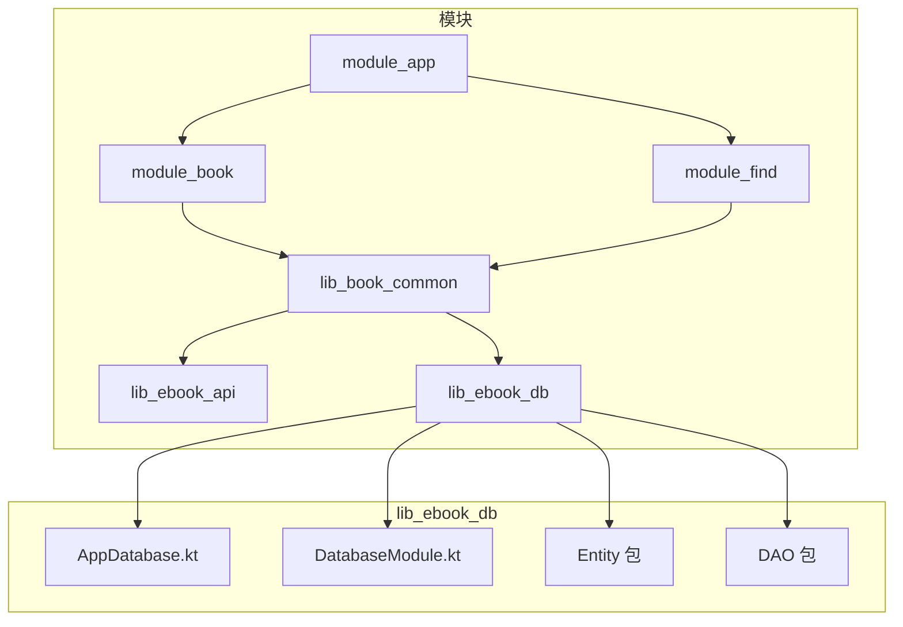
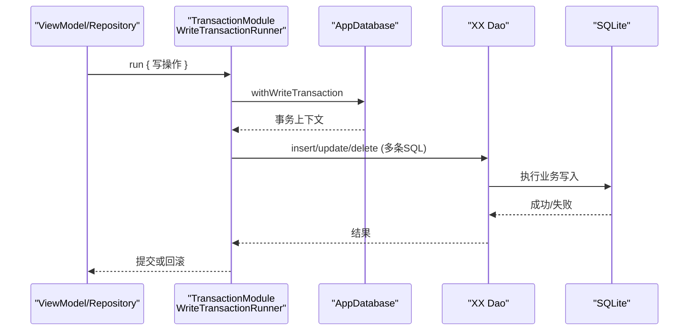
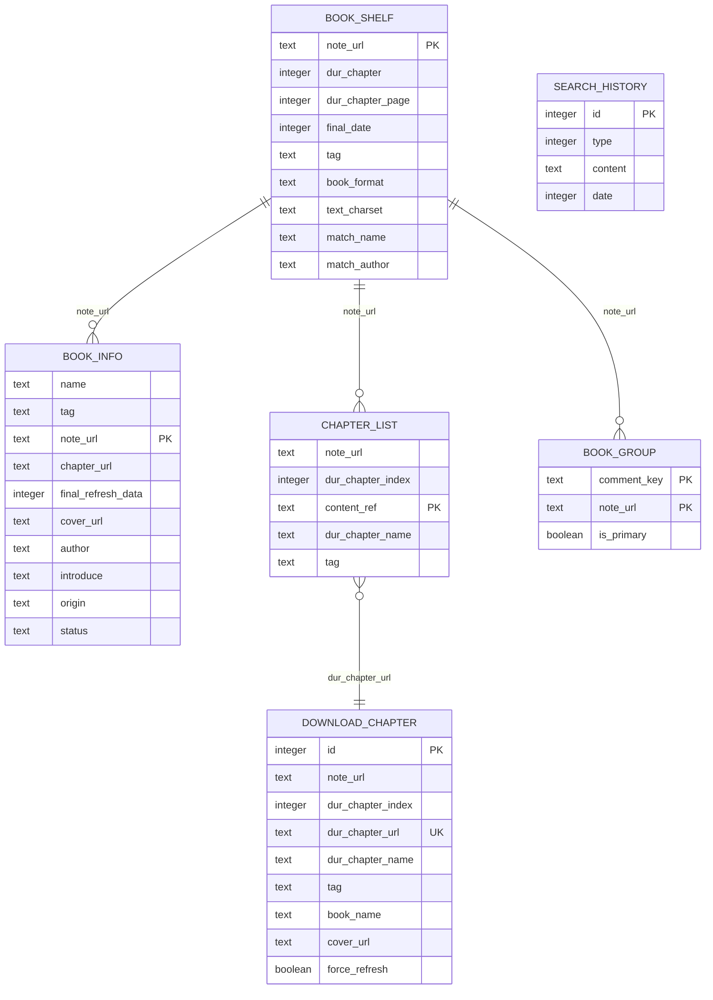
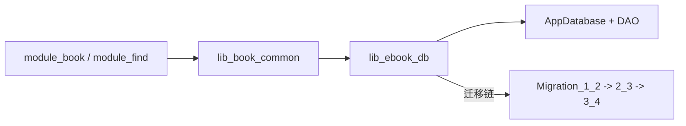
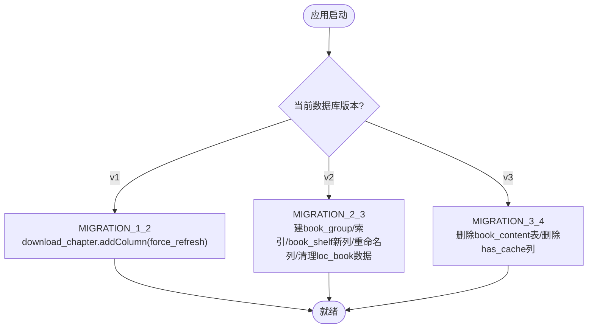

# 数据库设计

<cite>
**本文档引用的文件**
- [AppDatabase.kt](file://lib_ebook_db/src/main/java/com/ebook/db/AppDatabase.kt)
- [DatabaseModule.kt](file://lib_ebook_db/src/main/java/com/ebook/db/di/DatabaseModule.kt)
- [BookShelfEntity.kt](file://lib_ebook_db/src/main/java/com/ebook/db/entity/BookShelfEntity.kt)
- [ChapterListEntity.kt](file://lib_ebook_db/src/main/java/com/ebook/db/entity/ChapterListEntity.kt)
- [BookInfoEntity.kt](file://lib_ebook_db/src/main/java/com/ebook/db/entity/BookInfoEntity.kt)
- [BookGroupEntity.kt](file://lib_ebook_db/src/main/java/com/ebook/db/entity/BookGroupEntity.kt)
- [SearchHistoryEntity.kt](file://lib_ebook_db/src/main/java/com/ebook/db/entity/SearchHistoryEntity.kt)
- [DownloadChapterEntity.kt](file://lib_ebook_db/src/main/java/com/ebook/db/entity/DownloadChapterEntity.kt)
- [BookShelfFullInfo.kt](file://lib_ebook_db/schemas/com.ebook.db.AppDatabase/1.json)
- [BookShelfDao.kt](file://lib_ebook_db/src/main/java/com/ebook/db/dao/BookShelfDao.kt)
- [ChapterListDao.kt](file://lib_ebook_db/src/main/java/com/ebook/db/dao/ChapterListDao.kt)
- [SearchHistoryDao.kt](file://lib_ebook_db/src/main/java/com/ebook/db/dao/SearchHistoryDao.kt)
- [DownloadChapterDao.kt](file://lib_ebook_db/src/main/java/com/ebook/db/dao/DownloadChapterDao.kt)
- [BookInfoDao.kt](file://lib_ebook_db/src/main/java/com/ebook/db/dao/BookInfoDao.kt)
- [TransactionModule.kt](file://lib_book_common/src/main/java/com/ebook/common/di/TransactionModule.kt)
- [WriteTransactionRunner.kt](file://lib_book_common/src/main/java/com/ebook/common/store/WriteTransactionRunner.kt)
- [build.gradle.kts（lib_book_common）](file://lib_book_common/build.gradle.kts)
- [build.gradle.kts（lib_ebook_db）](file://lib_ebook_db/build.gradle.kts)
- [AndroidRoomConventionPlugin](file://build-logic/convention/build.gradle.kts)
- [Schema v1 JSON](file://lib_ebook_db/schemas/com.ebook.db.AppDatabase/1.json)
- [Schema v2 JSON](file://lib_ebook_db/schemas/com.ebook.db.AppDatabase/2.json)
</cite>

## 目录
1. [简介](#简介)
2. [项目结构与架构总览](#项目结构与架构总览)
3. [核心组件与职责](#核心组件与职责)
4. [体系结构与数据流](#体系结构与数据流)
5. [详细组件分析](#详细组件分析)
6. [依赖关系与耦合分析](#依赖关系与耦合分析)
7. [性能与索引优化](#性能与索引优化)
8. [CRUD 操作示例与事务用法](#crud-操作示例与事务用法)
9. [本地存储与缓存策略](#本地存储与缓存策略)
10. [数据库版本管理与迁移](#数据库版本管理与迁移)
11. [调试与性能调优指南](#调试与性能调优指南)
12. [结论与最佳实践](#结论与最佳实践)

## 简介
本设计文档面向 Android 小说阅读器的持久化层，围绕 Room 3.0.0（artifact group `androidx.room3`）在 lib_ebook_db 模块的实现展开。内容涵盖 AppDatabase 的装配与配置、实体（Entity）、数据访问对象（DAO）的设计模式，表结构及其关联、数据迁移策略、索引与查询性能优化、事务与批量操作、缓存与本地文件存储边界，以及 Schema 演进与调试方法。读者无需深入源码也能理解系统的数据组织方式与扩展点。

## 项目结构与架构总览
- 模块边界
  - lib_ebook_db：Room 数据库本体，包括 Entity、DAO、迁移与 Hilt 提供器。
  - lib_book_common：领域与仓储层，封装业务逻辑与事务运行器。
  - module_*：功能模块通过仓库与 DAO 间接使用数据库。

图表来源
- [AppDatabase.kt:34-58](file://lib_ebook_db/src/main/java/com/ebook/db/AppDatabase.kt#L34-L58)
- [DatabaseModule.kt:93-123](file://lib_ebook_db/src/main/java/com/ebook/db/di/DatabaseModule.kt#L93-L123)

章节来源
- [AppDatabase.kt:1-64](file://lib_ebook_db/src/main/java/com/ebook/db/AppDatabase.kt#L1-L64)
- [DatabaseModule.kt:1-124](file://lib_ebook_db/src/main/java/com/ebook/db/di/DatabaseModule.kt#L1-L124)

## 核心组件与职责
- AppDatabase：声明表集合、当前数据库版本与导出 Schema；暴露各 DAO 的抽象方法作为注册入口。
- DatabaseModule：使用 Hilt @Provides 注册 AppDatabase 实例与各 DAO；集中维护 Migration 列表。
- Entity：映射持久化字段（含自然主键或自增主键），标注列名、主键、唯一/普通索引等。
- DAO：基于 Room 注解的 SQL 存取接口，组合单表操作与跨表复杂查询。
- TransactionModule / WriteTransactionRunner：以 Hilt 暴露 Room 写事务包装，供上层统一提交。

章节来源
- [AppDatabase.kt:8-63](file://lib_ebook_db/src/main/java/com/ebook/db/AppDatabase.kt#L8-L63)
- [DatabaseModule.kt:23-123](file://lib_ebook_db/src/main/java/com/ebook/db/di/DatabaseModule.kt#L23-L123)
- [TransactionModule.kt:12-24](file://lib_book_common/src/main/java/com/ebook/common/di/TransactionModule.kt#L12-L24)
- [WriteTransactionRunner.kt:1-13](file://lib_book_common/src/main/java/com/ebook/common/store/WriteTransactionRunner.kt#L1-L13)

## 体系结构与数据流
- 调用链路
  - 业务 ViewModel/Repository → 仓库 → DAO → Room 生成实现 → SQLite 存储/查询。
- 依赖注入
  - AppDatabase 与 DAO 通过 Hilt 提供器注册为单例，便于上层共享。
- 读写隔离
  - 读用 Flow/Suspend 查询；写通过 withWriteTransaction 包裹以 IMMEDIATE 事务原子提交。

图表来源
- [TransactionModule.kt:17-23](file://lib_book_common/src/main/java/com/ebook/common/di/TransactionModule.kt#L17-L23)
- [DatabaseModule.kt:91-99](file://lib_ebook_db/src/main/java/com/ebook/db/di/DatabaseModule.kt#L91-L99)

## 详细组件分析

### AppDatabase 与装配
- 数据库文件名为 "ebook_db"，版本为 4，导出 schema 到模块下 schemas 目录。
- 暴露 bookShelfDao/bookInfoDao/chapterListDao/searchHistoryDao/downloadChapterDao/bookGroupDao 等访问点。
- 承载离线可读本库所需的六张表装配关系，正文不在表中（见后续“缓存”）。

章节来源
- [AppDatabase.kt:34-63](file://lib_ebook_db/src/main/java/com/ebook/db/AppDatabase.kt#L34-L63)

### DatabaseModule（Hilt + 迁移）
- 通过 Room.databaseBuilder 构建数据库，并依次添加 MIGRATION_1_2、MIGRATION_2_3、MIGRATION_3_4。
- 为每种 DAO 提供单例。
- 迁移策略采用显式 ALTER/DROP/CREATE，遵循不跳版、不删旧迁移、禁止破坏性回退的约定。

章节来源
- [DatabaseModule.kt:34-123](file://lib_ebook_db/src/main/java/com/ebook/db/di/DatabaseModule.kt#L34-L123)

### 核心实体与关系

图表来源
- [BookShelfEntity.kt:14-76](file://lib_ebook_db/src/main/java/com/ebook/db/entity/BookShelfEntity.kt#L14-L76)
- [BookInfoEntity.kt:13-69](file://lib_ebook_db/src/main/java/com/ebook/db/entity/BookInfoEntity.kt#L13-L69)
- [ChapterListEntity.kt:13-48](file://lib_ebook_db/src/main/java/com/ebook/db/entity/ChapterListEntity.kt#L13-L48)
- [DownloadChapterEntity.kt:23-86](file://lib_ebook_db/src/main/java/com/ebook/db/entity/DownloadChapterEntity.kt#L23-L86)
- [SearchHistoryEntity.kt:19-43](file://lib_ebook_db/src/main/java/com/ebook/db/entity/SearchHistoryEntity.kt#L19-L43)
- [BookGroupEntity.kt:21-37](file://lib_ebook_db/src/main/java/com/ebook/db/entity/BookGroupEntity.kt#L21-L37)

说明
- BookShelfEntity 主键为自然键 note_url，包含阅读进度、时间戳、本地书元信息（格式/编码/匹配名/作者）。
- BookInfoEntity 主键同为 note_url，存储书名、作者、封面等元数据。
- ChapterListEntity 以 content_ref 为主键（内容定位符，支持本地章路径或网络 URL），note_url 上建普通索引。
- DownloadChapterEntity 流水型任务，自增 id 主键，对 dur_chapter_url 建立唯一索引防止重复入队，note_url 有普通索引用于按书取队头。
- SearchHistoryEntity 自增 id，type 区分搜索类型，content 精确查重，date 排序。
- BookGroupEntity 复合主键 (comment_key, note_url)，记录评论桶与书架行关联，仅一行标记 is_primary。

章节来源
- [BookShelfEntity.kt:14-76](file://lib_ebook_db/src/main/java/com/ebook/db/entity/BookShelfEntity.kt#L14-L76)
- [ChapterListEntity.kt:13-48](file://lib_ebook_db/src/main/java/com/ebook/db/entity/ChapterListEntity.kt#L13-L48)
- [DownloadChapterEntity.kt:23-86](file://lib_ebook_db/src/main/java/com/ebook/db/entity/DownloadChapterEntity.kt#L23-L86)
- [SearchHistoryEntity.kt:19-43](file://lib_ebook_db/src/main/java/com/ebook/db/entity/SearchHistoryEntity.kt#L19-L43)
- [BookGroupEntity.kt:21-37](file://lib_ebook_db/src/main/java/com/ebook/db/entity/BookGroupEntity.kt#L21-L37)
- [BookInfoEntity.kt:13-69](file://lib_ebook_db/src/main/java/com/ebook/db/entity/BookInfoEntity.kt#L13-L69)

### DAO 设计与查询要点
- BookShelfDao
  - 提供全量/Flow 观察、按 URL 获取完整信息（含 Info/Chapters）、upsert/更新/删除、计数。
  - 使用 @Relation 组装 BookShelfFullInfo，并加 @Transaction 保证一次读取内一致性。
- ChapterListDao
  - 按 note_url 顺序获取章节目录、按 content_ref 查单章、批量 upsert（REPLACE 去重）。
- SearchHistoryDao
  - 按类型查看历史、精确查重插入、按类型清空/全部清空。
- DownloadChapterDao
  - 按 URL 查重入队、按书取首/尾任务、全局首任务、分组全量；count 与 Flow 观察剩余数；按主键删除单个任务；清空全部。
- BookInfoDao
  - 按 URL 查询/upsert/删除元数据。

章节来源
- [BookShelfDao.kt:19-109](file://lib_ebook_db/src/main/java/com/ebook/db/dao/BookShelfDao.kt#L19-L109)
- [ChapterListDao.kt:13-48](file://lib_ebook_db/src/main/java/com/ebook/db/dao/ChapterListDao.kt#L13-L48)
- [SearchHistoryDao.kt:17-66](file://lib_ebook_db/src/main/java/com/ebook/db/dao/SearchHistoryDao.kt#L17-L66)
- [DownloadChapterDao.kt:21-127](file://lib_ebook_db/src/main/java/com/ebook/db/dao/DownloadChapterDao.kt#L21-L127)
- [BookInfoDao.kt:13-33](file://lib_ebook_db/src/main/java/com/ebook/db/dao/BookInfoDao.kt#L13-L33)

## 依赖关系与耦合分析
- AppDatabase 对外仅提供 DAO 抽象，具体实现由 KSP 生成；外部仅依赖接口。
- 模块间依赖方向严格单向：模块 → lib_book_common → lib_ebook_db；lib_ebook_db 不含业务代码，降低循环依赖风险。
- Hilt 在 DatabaseModule 中管理生命周期，避免应用多处 new 数据库实例导致的锁冲突。

图表来源
- [DatabaseModule.kt:34-98](file://lib_ebook_db/src/main/java/com/ebook/db/di/DatabaseModule.kt#L34-L98)

章节来源
- [AppDatabase.kt:34-58](file://lib_ebook_db/src/main/java/com/ebook/db/AppDatabase.kt#L34-L58)
- [DatabaseModule.kt:91-123](file://lib_ebook_db/src/main/java/com/ebook/db/di/DatabaseModule.kt#L91-L123)

## 性能与索引优化
- 关键索引
  - chapter_list.note_url：加速按书获取目录列表。
  - download_chapter.dur_chapter_url（唯一）：确保同章仅一条排队，冲突时 REPLACE 先删后插，避免重复队列。
  - download_chapter.note_url：支撑按书取队头、取消下载。
  - book_group.note_url：加快根据书架项检索所有评论桶键。
- 查询性能要点
  - 使用 ORDER BY 明确返回顺序，特别是依赖物理顺序的场景需谨慎（如 chapter_list 默认无排序需显式指定）。
  - 批量插入时使用 REPLACE 避免逐条判断是否存在，减少往返；注意 rowid 变化导致 @Relation 需要重新排序。
  - Flow 观察仅做必要列选择，减少不必要子查询。
- 存储体积控制
  - 正文已从数据库迁至章文件（v3→v4 迁移已移除 book_content 与 has_cache），减轻数据库负担与页分裂风险。

章节来源
- [ChapterListEntity.kt:13-18](file://lib_ebook_db/src/main/java/com/ebook/db/entity/ChapterListEntity.kt#L13-L18)
- [DownloadChapterEntity.kt:23-29](file://lib_ebook_db/src/main/java/com/ebook/db/entity/DownloadChapterEntity.kt#L23-L29)
- [BookGroupEntity.kt:21-26](file://lib_ebook_db/src/main/java/com/ebook/db/entity/BookGroupEntity.kt#L21-L26)
- [ChapterListDao.kt:13-48](file://lib_ebook_db/src/main/java/com/ebook/db/dao/ChapterListDao.kt#L13-L48)
- [DatabaseModule.kt:84-89](file://lib_ebook_db/src/main/java/com/ebook/db/di/DatabaseModule.kt#L84-L89)

## CRUD 操作示例与事务用法
以下示例以“如何调用”为导向，不粘贴源码片段，给出路径参考以便查阅。

- 新建书籍信息并加入书架
  - 步骤：写入 BookInfoEntity、再写入 BookShelfEntity（upsert）、抓取目录后批量 upsert ChapterListEntity。
  - 事务：将所有写放在 withWriteTransaction 中统一提交。
  - 参考路径
    - [BookInfoDao.insert](file://lib_ebook_db/src/main/java/com/ebook/db/dao/BookInfoDao.kt#L24-L25)
    - [BookShelfDao.insertAll](file://lib_ebook_db/src/main/java/com/ebook/db/dao/BookShelfDao.kt#L82-L83)
    - [ChapterListDao.insertAll](file://lib_ebook_db/src/main/java/com/ebook/db/dao/ChapterListDao.kt#L33-L34)
    - [TransactionModule.run](file://lib_book_common/src/main/java/com/ebook/common/di/TransactionModule.kt#L21-L22)

- 更新阅读进度（书架行）
  - 步骤：构造新的 BookShelfEntity（只写进度相关字段即可，但 REPLACE 会整行覆盖，需传完整对象或使用 update 原地更新），提交。
  - 参考路径
    - [BookShelfDao.update](file://lib_ebook_db/src/main/java/com/ebook/db/dao/BookShelfDao.kt#L89-L90)
    - [BookShelfDao.insert (REPLACE)](file://lib_ebook_db/src/main/java/com/ebook/db/dao/BookShelfDao.kt#L78-L79)

- 删除一本书（从书架移除）
  - 步骤：删除 BookShelf、BookInfo、ChapterList 对应记录（DAO 无级联，需在仓库层清理）。
  - 参考路径
    - [BookShelfDao.deleteByUrl](file://lib_ebook_db/src/main/java/com/ebook/db/dao/BookShelfDao.kt#L103-L104)
    - [BookInfoDao.deleteByUrl](file://lib_ebook_db/src/main/java/com/ebook/db/dao/BookInfoDao.kt#L31-L32)
    - [ChapterListDao.deleteChaptersForBook](file://lib_ebook_db/src/main/java/com/ebook/db/dao/ChapterListDao.kt#L46-L47)

- 下载章节入队与出队
  - 入队：先按 dur_chapter_url 查重，若存在则回填 id 再做 REPLACE 覆盖；若无新增。
  - 出队：任务成功或重试耗尽后，调用 delete 移出队列。
  - 参考路径
    - [DownloadChapterDao.getChapterByUrl](file://lib_ebook_db/src/main/java/com/ebook/db/dao/DownloadChapterDao.kt#L30-L31)
    - [DownloadChapterDao.insertAll](file://lib_ebook_db/src/main/java/com/ebook/db/dao/DownloadChapterDao.kt#L105-L106)
    - [DownloadChapterDao.delete](file://lib_ebook_db/src/main/java/com/ebook/db/dao/DownloadChapterDao.kt#L115-L116)

- 搜索历史 upsert
  - 步骤：按 type+content 查找旧记录，带上其 id 再插入（REPLACE）以实现“重搜更新时间戳”。
  - 参考路径
    - [SearchHistoryDao.findByTypeAndContent](file://lib_ebook_db/src/main/java/com/ebook/db/dao/SearchHistoryDao.kt#L44-L45)
    - [SearchHistoryDao.insert](file://lib_ebook_db/src/main/java/com/ebook/db/dao/SearchHistoryDao.kt#L51-L52)

- 事务使用模板
  - 通过 WriteTransactionRunner.run 将多个 DAO 写操作打包成单一 IMMEDIATE 事务，失败自动回滚。
  - 参考路径
    - [TransactionModule.provideWriteTransactionRunner](file://lib_book_common/src/main/java/com/ebook/common/di/TransactionModule.kt#L17-L23)
    - [WriteTransactionRunner.run](file://lib_book_common/src/main/java/com/ebook/common/store/WriteTransactionRunner.kt#L11-L13)

章节来源
- 同上“引用路径”处

## 本地存储与缓存策略
- 正文书体已不再存放于数据库（v3→v4 已删除 book_content、chapter_list.has_cache 列），改用应用私有目录的章文件，并通过 BookStore/ChapterContentCache 进行加载与缓存。
- 数据库中仅保留“章节元信息/位置定位符”，即章节号、名称、所在书的 note_url 及 content_ref。
- 缓存存在性与完整性由文件系统判定，不在数据库层面维持布尔标志。
- 下载任务仍保留在数据库，体现“未完成队列”的状态机语义。

章节来源
- [AppDatabase.kt:18-24](file://lib_ebook_db/src/main/java/com/ebook/db/AppDatabase.kt#L18-L24)
- [ChapterListEntity.kt:32-40](file://lib_ebook_db/src/main/java/com/ebook/db/entity/ChapterListEntity.kt#L32-L40)
- [DownloadChapterEntity.kt:11-22](file://lib_ebook_db/src/main/java/com/ebook/db/entity/DownloadChapterEntity.kt#L11-L22)

## 数据库版本管理与迁移
- 版本与导出
  - AppDatabase.version=4；exportSchema=true，schema JSON 落盘于 lib_ebook_db/schemas。
- 迁移链（不可跳跃、不可删除旧迁移）
  - MIGRATION_1_2：为 download_chapter 增加 force_refresh 列（DEFAULT 0）。
  - MIGRATION_2_3：创建 book_group 及索引，补齐 book_shelf 本地书所需列，chapter_list 的 dur_chapter_url 更名为 content_ref；删除本地书相关的旧正文与索引数据。
  - MIGRATION_3_4：删除 book_content 表与 chapter_list.has_cache 列，正文存储边界迁移完成。
- 构建插件与规则
  - 自定义约定插件 androidRoom 启用 exportSchema，输出到模块 schemas 目录，受版本目录统一管理版本。

图表来源
- [DatabaseModule.kt:34-89](file://lib_ebook_db/src/main/java/com/ebook/db/di/DatabaseModule.kt#L34-L89)

章节来源
- [DatabaseModule.kt:34-98](file://lib_ebook_db/src/main/java/com/ebook/db/di/DatabaseModule.kt#L34-L98)
- [Schema v1 JSON](file://lib_ebook_db/schemas/com.ebook.db.AppDatabase/1.json)
- [Schema v2 JSON](file://lib_ebook_db/schemas/com.ebook.db.AppDatabase/2.json)
- [AppDatabase.kt:34-45](file://lib_ebook_db/src/main/java/com/ebook/db/AppDatabase.kt#L34-L45)
- [AndroidRoomConventionPlugin](file://build-logic/convention/build.gradle.kts#L62-L64)

## 调试与性能调优指南
- 工具与技巧
  - 使用 Room 生成的 SQL 日志（开启 DEBUG 级别）核对实际执行语句。
  - 使用 SQLite EXPLAIN QUERY PLAN 检查是否命中索引、是否存在文件扫描。
  - 使用 Room 导入 schema JSON 对比版本差异，快速识别意外列/表变更。
  - 关注 DAO 注释中的事务要求（@Transaction），避免跨子查询拼合中间态问题。
- 常见问题排查
  - “始终找不到数据”：确认是否正确传递 note_url/content_ref，并检查是否有前置 DELETE 或迁移误删。
  - “下载卡住”：确认失败任务已被出队，否则服务会无限重试队头（ADR-0018 约束）。
  - “首页空白”：搜索历史展示改为按类型全量加载，避免 WHERE content = '' 导致空集。
- 构建配置注意点
  - Room 运行时依赖在 lib_book_common 中以 implementation 引用，避免错误传递依赖造成兼容性问题。
  - 自定义 room 约定插件统一处理 schema 导出路径。

章节来源
- [DatabaseModule.kt:91-98](file://lib_ebook_db/src/main/java/com/ebook/db/di/DatabaseModule.kt#L91-L98)
- [BookShelfDao.kt:21-46](file://lib_ebook_db/src/main/java/com/ebook/db/dao/BookShelfDao.kt#L21-L46)
- [DownloadChapterDao.kt:77-127](file://lib_ebook_db/src/main/java/com/ebook/db/dao/DownloadChapterDao.kt#L77-L127)
- [build.gradle.kts（lib_book_common）:67-68](file://lib_book_common/build.gradle.kts#L67-L68)
- [build.gradle.kts（lib_ebook_db）:41-43](file://lib_ebook_db/build.gradle.kts#L41-L43)
- [AndroidRoomConventionPlugin](file://build-logic/convention/build.gradle.kts#L62-L64)

## 结论与最佳实践
- 实体设计采用“自然键 + 自增键”混合策略：稳定标识（note_url）用于业务关联，自增 id 适用于流水数据（下载、搜索历史）。
- 正文已彻底从数据库剥离，改为章文件存储，有效降低数据库体积并简化状态一致性。
- 迁移链必须严格按版本序列递增，禁止破坏性回退；每次实体变更务必同步更新版本号、追加紧邻迁移并提交 schema JSON。
- 写操作优先使用 withWriteTransaction 一次性提交，保障跨表写一致性。
- 充分利用索引：按常用过滤与 JOIN 条件建立索引，结合 ORDER BY 获得稳定有序输出。
- 使用 Flow 观察轻量计数（如下载剩余），结合 UI 动态显示角标。