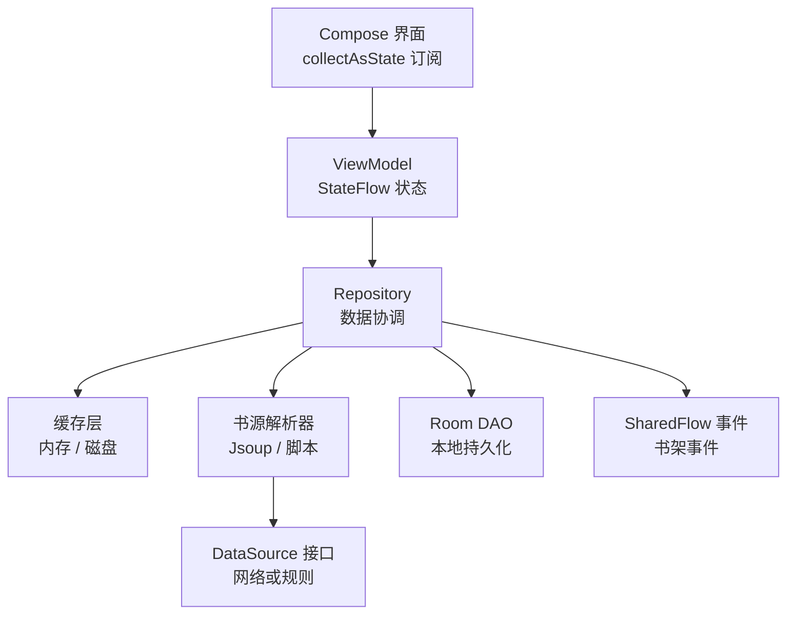
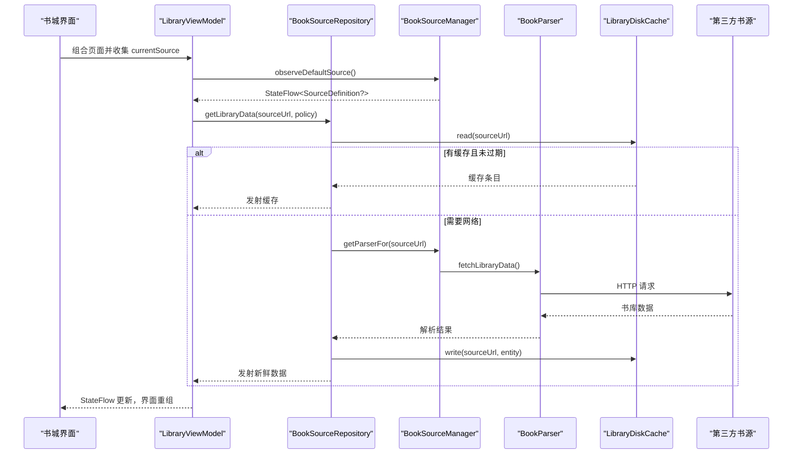
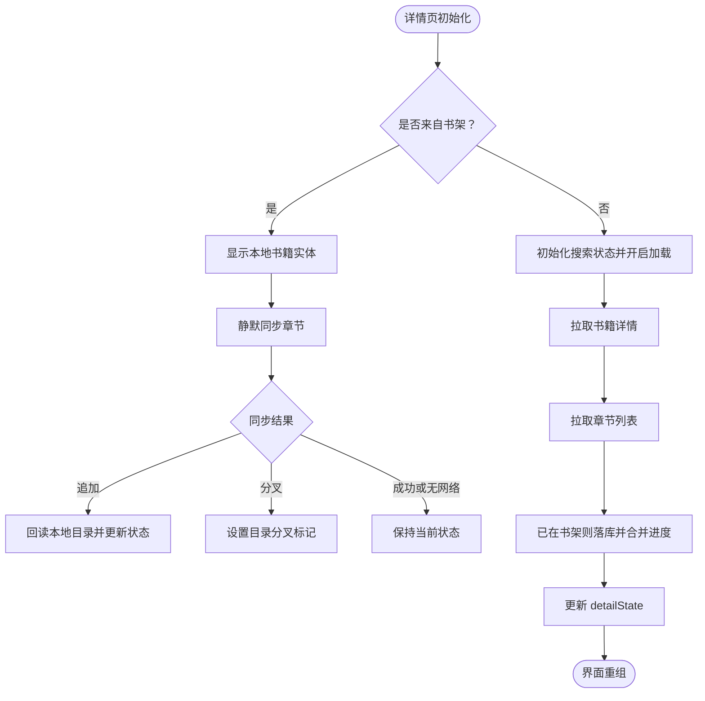
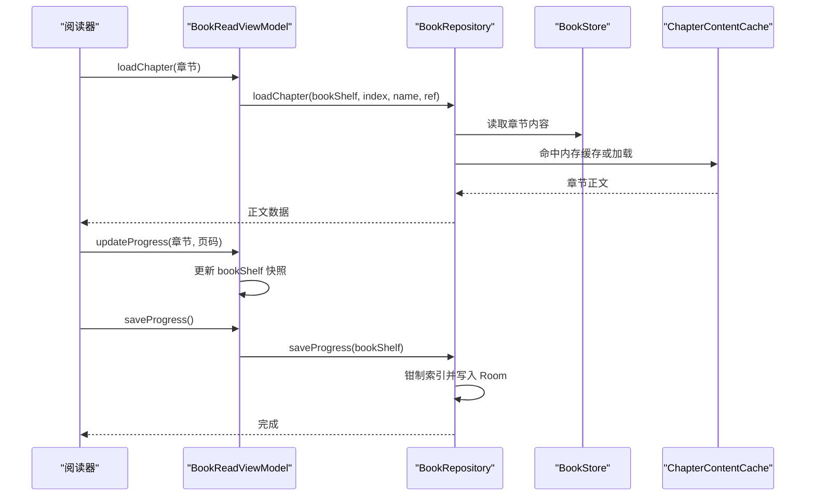
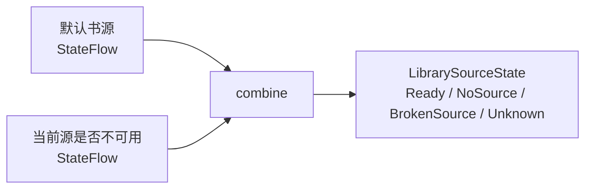
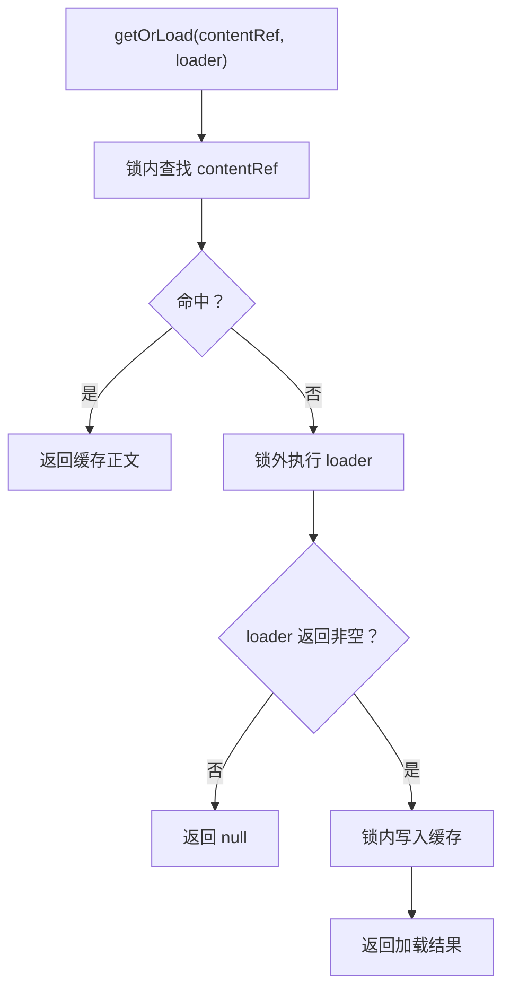
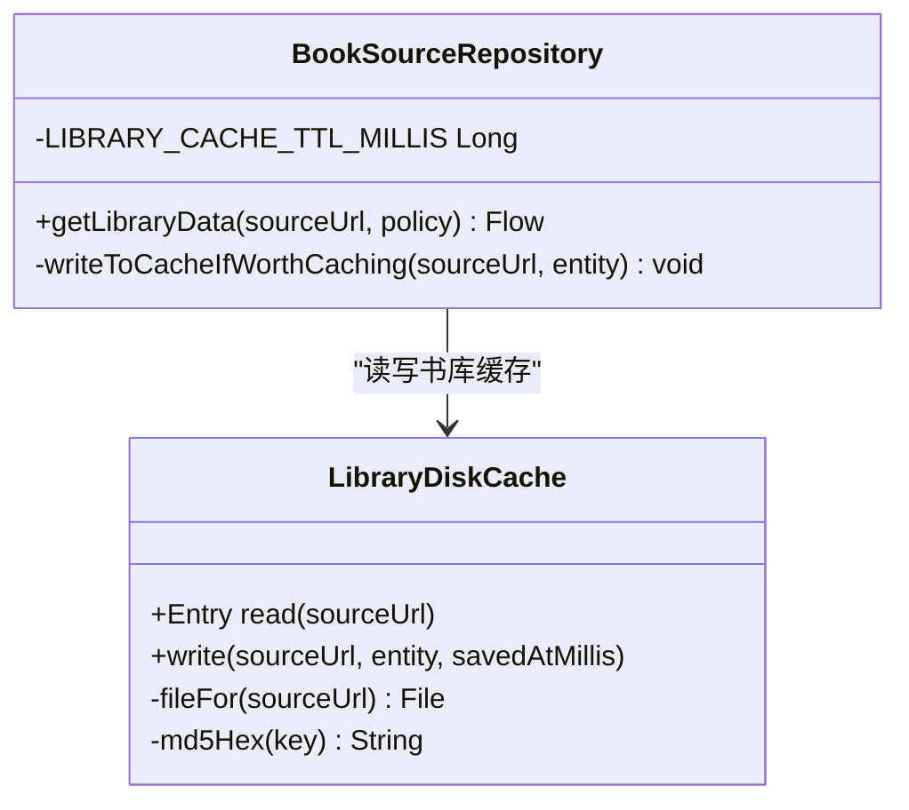
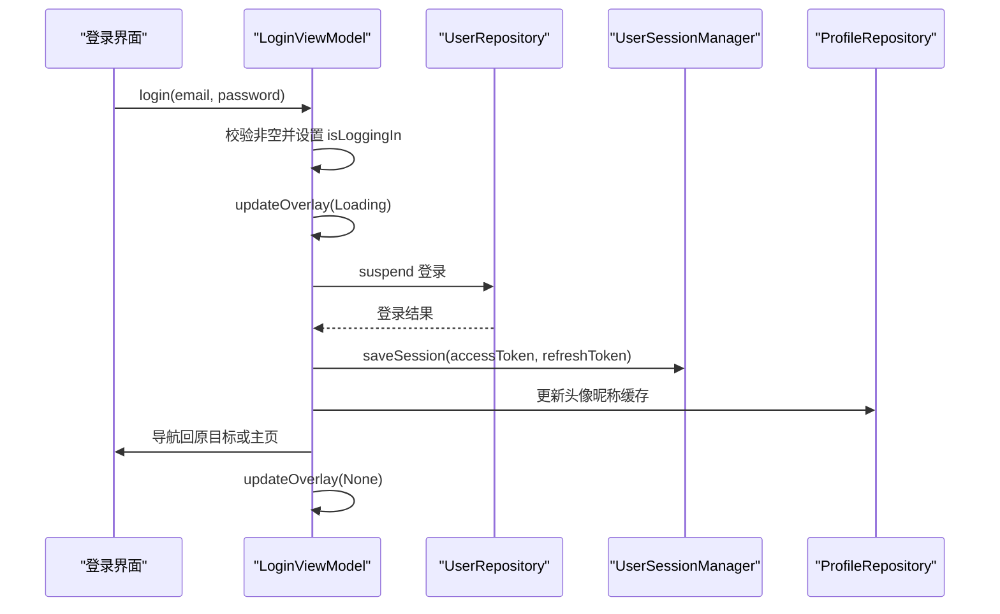
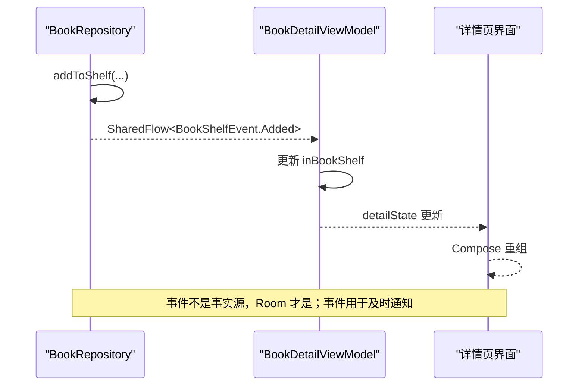
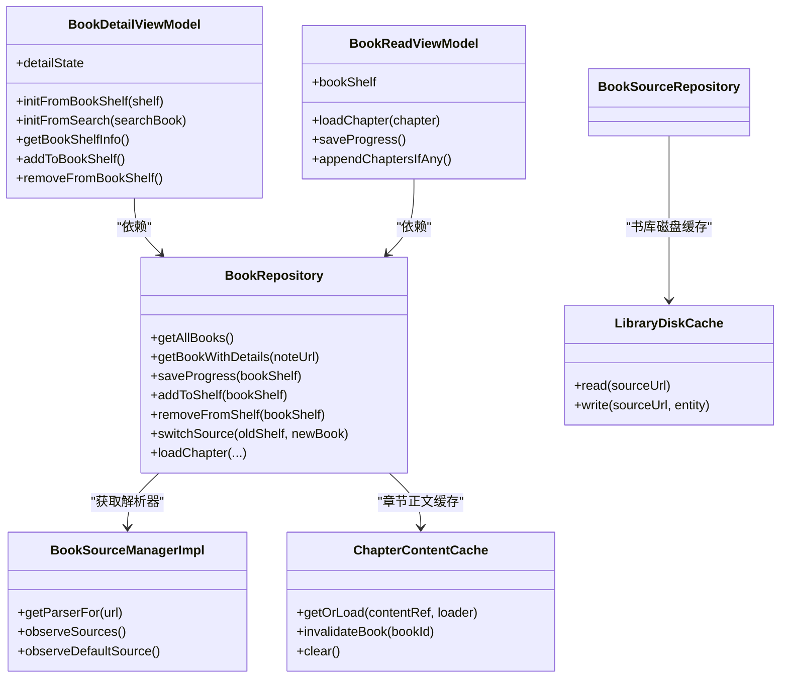

# 数据流架构

<cite>
**本文引用的文件**   
- [README.MD](file://README.MD)
- [BookRepository.kt](file://lib_book_common/src/main/java/com/ebook/common/repository/BookRepository.kt)
- [ChapterContentCache.kt](file://lib_book_common/src/main/java/com/ebook/common/store/ChapterContentCache.kt)
- [LibraryDiskCache.kt](file://lib_book_common/src/main/java/com/ebook/common/analyze/source/LibraryDiskCache.kt)
- [BookSourceManagerImpl.kt](file://lib_book_common/src/main/java/com/ebook/common/analyze/source/BookSourceManagerImpl.kt)
- [CommentDataSource.kt](file://lib_ebook_api/src/main/java/com/ebook/api/service/comment/CommentDataSource.kt)
- [UserDataSource.kt](file://lib_ebook_api/src/main/java/com/ebook/api/service/user/UserDataSource.kt)
- [BookSourceDataSource.kt](file://lib_ebook_api/src/main/java/com/ebook/api/service/source/BookSourceDataSource.kt)
- [BookDetailViewModel.kt](file://module_book/src/main/java/com/ebook/book/mvvm/viewmodel/BookDetailViewModel.kt)
- [BookReadViewModel.kt](file://module_book/src/main/java/com/ebook/book/mvvm/viewmodel/BookReadViewModel.kt)
- [LibraryViewModel.kt](file://module_find/src/main/java/com/ebook/find/mvvm/viewmodel/LibraryViewModel.kt)
- [BookSourceRepository.kt](file://module_find/src/main/java/com/ebook/find/repository/BookSourceRepository.kt)
- [LoginViewModel.kt](file://module_login/src/main/java/com/ebook/login/mvvm/viewmodel/LoginViewModel.kt)
</cite>

## 目录

1. [引言](#引言)
2. [项目结构](#项目结构)
3. [核心组件](#核心组件)
4. [架构总览](#架构总览)
5. [详细组件分析](#详细组件分析)
6. [依赖关系分析](#依赖关系分析)
7. [性能与资源管理](#性能与资源管理)
8. [故障排查指南](#故障排查指南)
9. [结论](#结论)

## 引言

该项目是一个 100% Kotlin 的 Android 小说阅读器，采用 MVVM 多模块架构：界面全部迁移到 Jetpack Compose，网络层使用 Retrofit + OkHttp，本地存储使用 Room，异步模型统一为协程与 Flow；认证、书源解析、阅读、书城、个人中心等能力分布在 `module_*` 功能模块中，公共领域逻辑收敛到 `lib_book_common`，API 契约与实体放在 `lib_ebook_api`，数据库映射放在 `lib_ebook_db`。

本文聚焦数据流架构，解释单向数据流在 MVVM 中的实现路径：UI 状态更新由 Compose 订阅 ViewModel 暴露的 `StateFlow`；ViewModel 通过 Repository 协调数据；Repository 再调度 DataSource、Parser、Room 和缓存；最终把稳定状态推回 UI。同时说明 `Flow` 与 `StateFlow` 的使用边界、多级缓存策略以及协程与线程调度的最佳实践。

**章节来源**
- [README.MD:1-212](file://README.MD#L1-L212)

## 项目结构

从数据流角度，项目可以拆成四层：

| 层级 | 职责 | 典型位置 |
|---|---|---|
| UI 层 | Compose 页面收集 `StateFlow`，触发用户动作 | `module_book/page`、`module_find/page`、`module_me/page` |
| ViewModel 层 | 维护可观察 UI 状态、编排业务调用、处理错误与提示 | `module_*/mvvm/viewmodel` |
| Repository 层 | 数据协调：缓存、网络、本地库、事件发布 | `lib_book_common/repository`、`module_find/repository` |
| DataSource / Parser / DAO 层 | 具体数据获取：网络接口、书源解析器、Room DAO | `lib_ebook_api/service/*`、`lib_book_source`、`lib_ebook_db/dao` |

**图示来源**
- [BookDetailViewModel.kt:1-120](file://module_book/src/main/java/com/ebook/book/mvvm/viewmodel/BookDetailViewModel.kt#L1-L120)
- [BookRepository.kt:1-120](file://lib_book_common/src/main/java/com/ebook/common/repository/BookRepository.kt#L1-L120)
- [BookSourceRepository.kt:1-120](file://module_find/src/main/java/com/ebook/find/repository/BookSourceRepository.kt#L1-L120)
- [CommentDataSource.kt:1-34](file://lib_ebook_api/src/main/java/com/ebook/api/service/comment/CommentDataSource.kt#L1-L34)

**章节来源**
- [README.MD:80-160](file://README.MD#L80-L160)

## 核心组件

### ViewModel 与 UI 状态

项目中 ViewModel 普遍使用 `@HiltViewModel` 注入依赖，并通过 `viewModelScope` 启动协程。UI 状态以 `data class` 封装，内部用 `MutableStateFlow` 暴露只读视图，例如详情页状态包含书籍实体、是否在书架、加载态、加载失败态和目录分叉标记。

关键点：

- 详情页面的历史问题曾由普通字段驱动 Activity 刷新，Compose 化后这些事件没有订阅者，导致网络拉取完成后页面不重组；因此收敛为单一 `StateFlow`，由 Compose 侧 `collectAsState` 订阅。
- 书架事件被收进 ViewModel 的 `init` 中收集，避免旋转重建时重复累积。
- 所有可变状态更新都通过 `update { ... }` 生成新对象，确保 `StateFlow` 判等后能正确重发。

**章节来源**
- [BookDetailViewModel.kt:1-120](file://module_book/src/main/java/com/ebook/book/mvvm/viewmodel/BookDetailViewModel.kt#L1-L120)
- [BookDetailViewModel.kt:200-339](file://module_book/src/main/java/com/ebook/book/mvvm/viewmodel/BookDetailViewModel.kt#L200-L339)
- [LoginViewModel.kt:1-107](file://module_login/src/main/java/com/ebook/login/mvvm/viewmodel/LoginViewModel.kt#L1-L107)

### Repository 数据协调

`BookRepository` 是书架与阅读相关数据的统一入口，承担以下职责：

- 书架 CRUD；
- 阅读进度保存并钳制越界索引；
- 章节正文统一读取，屏蔽本地书和网络书差异；
- 评论聚合键（M2）的主键写入与合并拆分；
- 阅读中换源；
- 内容仓库对账；
- 书架变化事件发布。

它通过 `BaseModel()` 继承基类，并使用 Hilt 注入 DAO、`BookSourceManager`、`BookStore`、`ChapterContentCache` 等依赖。

**章节来源**
- [BookRepository.kt:1-120](file://lib_book_common/src/main/java/com/ebook/common/repository/BookRepository.kt#L1-L120)

### DataSource 数据源接口

网络层使用接口抽象真实后端与 mock 实现，常见类型包括：

| 接口 | 主要职责 |
|---|---|
| `CommentDataSource` | 添加、删除、查询评论，迁移旧键到新键 |
| `UserDataSource` | 登录、注册、刷新 token、登出、改密、头像上传 |
| `BookSourceDataSource` | 按规则抓取书源页面 HTML、获取当前书源规则 |

这些接口返回统一的响应信封，便于上层区分传输、业务与客户端异常。

**章节来源**
- [CommentDataSource.kt:1-34](file://lib_ebook_api/src/main/java/com/ebook/api/service/comment/CommentDataSource.kt#L1-L34)
- [UserDataSource.kt:1-47](file://lib_ebook_api/src/main/java/com/ebook/api/service/user/UserDataSource.kt#L1-L47)
- [BookSourceDataSource.kt:1-23](file://lib_ebook_api/src/main/java/com/ebook/api/service/source/BookSourceDataSource.kt#L1-L23)

## 架构总览

下面用一个完整链路描述“书城书库加载”的数据流：

**图示来源**
- [LibraryViewModel.kt:1-120](file://module_find/src/main/java/com/ebook/find/mvvm/viewmodel/LibraryViewModel.kt#L1-L120)
- [BookSourceRepository.kt:1-199](file://module_find/src/main/java/com/ebook/find/repository/BookSourceRepository.kt#L1-L199)
- [BookSourceManagerImpl.kt:1-120](file://lib_book_common/src/main/java/com/ebook/common/analyze/source/BookSourceManagerImpl.kt#L1-L120)
- [LibraryDiskCache.kt:1-126](file://lib_book_common/src/main/java/com/ebook/common/analyze/source/LibraryDiskCache.kt#L1-L126)

这个流程体现两个重要设计：

1. **单向数据流**：UI 不直接访问网络或数据库，只收集 ViewModel 的状态；ViewModel 不直接操作 Room，而是委托 Repository。
2. **策略与实现分离**：`BookSourceRepository` 决定何时用缓存、何时走网络；`LibraryDiskCache` 只做存取，不判断 TTL。

**章节来源**
- [LibraryViewModel.kt:1-200](file://module_find/src/main/java/com/ebook/find/mvvm/viewmodel/LibraryViewModel.kt#L1-L200)
- [BookSourceRepository.kt:1-199](file://module_find/src/main/java/com/ebook/find/repository/BookSourceRepository.kt#L1-L199)

## 详细组件分析

### 单向数据流与 MVVM 状态管理

#### 详情页数据流

详情页有两个入口：

| 入口 | 行为 |
|---|---|
| 书架入口 | 先用本地实体立即渲染，随后静默重抓目录 |
| 搜索入口 | 先展示基本信息，详情和章节列表必须走网络，失败进入错误态 |

**图示来源**
- [BookDetailViewModel.kt:1-200](file://module_book/src/main/java/com/ebook/book/mvvm/viewmodel/BookDetailViewModel.kt#L1-L200)
- [BookDetailViewModel.kt:200-339](file://module_book/src/main/java/com/ebook/book/mvvm/viewmodel/BookDetailViewModel.kt#L200-L339)

需要注意的细节：

- 详情状态使用 `BookDetailUiState` 这一个不可变对象，避免多个分散字段导致重组不一致。
- 搜索入口失败时不清空已有书籍实体，防止书架入口的书拉取失败后断链。
- 已加书架时，详情页会优先使用 Room 中的目录，而不是远端目录，以避免阅读器写回的页码越界。

**章节来源**
- [BookDetailViewModel.kt:1-200](file://module_book/src/main/java/com/ebook/book/mvvm/viewmodel/BookDetailViewModel.kt#L1-L200)
- [BookDetailViewModel.kt:200-339](file://module_book/src/main/java/com/ebook/book/mvvm/viewmodel/BookDetailViewModel.kt#L200-L339)

#### 阅读器数据流

阅读器负责章节正文加载、阅读进度保存、末章追更和换源后的目录更新。其关键方法包括：

- `loadChapter`：统一章节正文读取路径；
- `saveProgress`：保存阅读进度；
- `appendChaptersIfAny`：末章静默检查目录更新；
- `refreshCurrentChapter`：刷新当前章节缓存。

**图示来源**
- [BookReadViewModel.kt:1-151](file://module_book/src/main/java/com/ebook/book/mvvm/viewmodel/BookReadViewModel.kt#L1-L151)
- [ChapterContentCache.kt:1-63](file://lib_book_common/src/main/java/com/ebook/common/store/ChapterContentCache.kt#L1-L63)
- [BookRepository.kt:1-120](file://lib_book_common/src/main/java/com/ebook/common/repository/BookRepository.kt#L1-L120)

**章节来源**
- [BookReadViewModel.kt:1-151](file://module_book/src/main/java/com/ebook/book/mvvm/viewmodel/BookReadViewModel.kt#L1-L151)

### Flow 与 StateFlow 的应用

项目中 Flow 家族的使用有明显分工：

| 类型 | 用途 | 示例 |
|---|---|---|
| `StateFlow` | 表示可观察 UI 状态，适合 `collectAsState` | `detailState`、`currentSource`、`sourceState` |
| `SharedFlow` | 一次性或一对多事件，如书架事件、下一页事件 | `_bookShelfEvents`、`nextInShelfEvent` |
| `Flow` | 可组合、可背压、支持操作符的数据流 | 书库 SWR 数据流、书架观察流 |
| `stateIn` | 把冷流变成热流，指定初始值 | 书城分类、当前书源、书库数据 |
| `combine` | 合成多个事实源为一个状态 | 当前书源与可用性标志合成 `sourceState` |

书城示例展示了 `combine` 的典型用法：默认源是否为空、当前源是否损坏是两个独立事实，最终合成一个 `LibrarySourceState`，供页面决定画引导态、错误态还是正常书库。

**图示来源**
- [LibraryViewModel.kt:1-120](file://module_find/src/main/java/com/ebook/find/mvvm/viewmodel/LibraryViewModel.kt#L1-L120)

**章节来源**
- [LibraryViewModel.kt:1-200](file://module_find/src/main/java/com/ebook/find/mvvm/viewmodel/LibraryViewModel.kt#L1-L200)
- [BookDetailViewModel.kt:1-120](file://module_book/src/main/java/com/ebook/book/mvvm/viewmodel/BookDetailViewModel.kt#L1-L120)
- [BookRepository.kt:1-120](file://lib_book_common/src/main/java/com/ebook/common/repository/BookRepository.kt#L1-L120)

### 多级缓存设计

项目实现了三层缓存语义：

| 缓存层 | 载体 | 适用场景 | 失效方式 |
|---|---|---|---|
| 内存缓存 | `LinkedHashMap` + `Mutex` | 当前章节前后各一章的阅读体验 | 按书 ID 片段失效、清空 |
| 磁盘缓存 | `cacheDir/library_cache/*.json` | 书城书库数据，TTL 约 6 小时 | 用户清理缓存、TTL 过期 |
| 网络缓存 | 第三方站点 | 最终权威数据 | 服务器变更、规则失效 |

#### 内存缓存：章节正文

`ChapterContentCache` 是章节正文的内存缓存，容量默认 3，覆盖当前章及前后各一章。它使用带访问顺序的 `LinkedHashMap`，并用协程 `Mutex` 保护并发读写。`getOrLoad` 允许 loader 返回 null 时不入缓存，这样后续补充 reader 后可以自然恢复。

**图示来源**
- [ChapterContentCache.kt:1-63](file://lib_book_common/src/main/java/com/ebook/common/store/ChapterContentCache.kt#L1-L63)

#### 磁盘缓存：书城书库

`LibraryDiskCache` 将书库数据序列化为 JSON 文件，按书源分区存放。写入采用临时文件 + 原子覆盖，避免进程崩溃留下截断文件；读取失败时按未命中处理并删除损坏文件，形成自愈。

书库缓存策略不在缓存类中判断 TTL，而是在 `BookSourceRepository` 中定义：

- `StaleWhileRevalidate`：先弹缓存，再后台重抓；
- `ForceNetwork`：跳过缓存，强制网络。

**图示来源**
- [LibraryDiskCache.kt:1-126](file://lib_book_common/src/main/java/com/ebook/common/analyze/source/LibraryDiskCache.kt#L1-L126)
- [BookSourceRepository.kt:1-199](file://module_find/src/main/java/com/ebook/find/repository/BookSourceRepository.kt#L1-L199)

**章节来源**
- [ChapterContentCache.kt:1-63](file://lib_book_common/src/main/java/com/ebook/common/store/ChapterContentCache.kt#L1-L63)
- [LibraryDiskCache.kt:1-126](file://lib_book_common/src/main/java/com/ebook/common/analyze/source/LibraryDiskCache.kt#L1-L126)
- [BookSourceRepository.kt:1-199](file://module_find/src/main/java/com/ebook/find/repository/BookSourceRepository.kt#L1-L199)

### 异步数据处理与协程使用

项目统一使用协程处理异步任务，并在不同层级选择合适的调度器：

| 场景 | 调度策略 | 理由 |
|---|---|---|
| Room 查询与写入 | `Dispatchers.IO` | 避免阻塞主线程 |
| UI 状态更新 | 主线程 | Compose 重组必须在主线程 |
| 网络请求 | 由 DataSource / OkHttp / Retrofit 管理 | 网络 I/O 不应在主线程 |
| 页面生命周期绑定 | `viewModelScope` | 随 ViewModel 销毁自动取消 |
| 一次性命令 | `tryEmit` 或 `launch` | 避免重复触发 |

登录流程展示了典型的协程使用模式：防重复点击、显示加载覆盖层、执行业务逻辑、保存会话、导航回跳、清理覆盖层。

**图示来源**
- [LoginViewModel.kt:1-107](file://module_login/src/main/java/com/ebook/login/mvvm/viewmodel/LoginViewModel.kt#L1-L107)

**章节来源**
- [LoginViewModel.kt:1-107](file://module_login/src/main/java/com/ebook/login/mvvm/viewmodel/LoginViewModel.kt#L1-L107)
- [BookReadViewModel.kt:1-151](file://module_book/src/main/java/com/ebook/book/mvvm/viewmodel/BookReadViewModel.kt#L1-L151)

### 数据流转图与状态变化时序图

#### 书架事件驱动的状态变化

`BookRepository` 通过 `SharedFlow` 广播书架事件，ViewModel 和 UI 可据此更新状态。事件包括新增、移除、阅读进度更新、章节更新等。

**图示来源**
- [BookRepository.kt:201-260](file://lib_book_common/src/main/java/com/ebook/common/repository/BookRepository.kt#L201-L260)
- [BookDetailViewModel.kt:1-120](file://module_book/src/main/java/com/ebook/book/mvvm/viewmodel/BookDetailViewModel.kt#L1-L120)

**章节来源**
- [BookRepository.kt:201-260](file://lib_book_common/src/main/java/com/ebook/common/repository/BookRepository.kt#L201-L260)
- [BookDetailViewModel.kt:1-120](file://module_book/src/main/java/com/ebook/book/mvvm/viewmodel/BookDetailViewModel.kt#L1-L120)

## 依赖关系分析

### 组件耦合与协作

**图示来源**
- [BookDetailViewModel.kt:1-120](file://module_book/src/main/java/com/ebook/book/mvvm/viewmodel/BookDetailViewModel.kt#L1-L120)
- [BookReadViewModel.kt:1-151](file://module_book/src/main/java/com/ebook/book/mvvm/viewmodel/BookReadViewModel.kt#L1-L151)
- [BookRepository.kt:1-120](file://lib_book_common/src/main/java/com/ebook/common/repository/BookRepository.kt#L1-L120)
- [BookSourceManagerImpl.kt:1-120](file://lib_book_common/src/main/java/com/ebook/common/analyze/source/BookSourceManagerImpl.kt#L1-L120)
- [ChapterContentCache.kt:1-63](file://lib_book_common/src/main/java/com/ebook/common/store/ChapterContentCache.kt#L1-L63)
- [LibraryDiskCache.kt:1-126](file://lib_book_common/src/main/java/com/ebook/common/analyze/source/LibraryDiskCache.kt#L1-L126)

### 外部依赖与集成点

| 外部依赖 | 集成方式 | 注意事项 |
|---|---|---|
| Retrofit + OkHttp | 通过 `lib_ebook_api` 暴露 DataSource 接口 | 真实后端与 mock 双构建 |
| Room | DAO 与 Entity 在 `lib_ebook_db` | 多表事务、关联查询排序需显式控制 |
| Jsoup / 脚本解析器 | `lib_book_source` | 原生规则与脚本书源共用同一 Manager |
| Hilt | `@HiltViewModel`、`@Inject` | 构造参数集中，避免隐式依赖 |
| TheRouter | 登录成功后回跳 | 区分拦截回跳与主动登录跳转 |

**章节来源**
- [README.MD:120-212](file://README.MD#L120-L212)
- [BookSourceManagerImpl.kt:1-120](file://lib_book_common/src/main/java/com/ebook/common/analyze/source/BookSourceManagerImpl.kt#L1-L120)

## 性能与资源管理

### 时间复杂度与空间复杂度

| 操作 | 时间复杂度 | 空间复杂度 | 优化点 |
|---|---|---|---|
| 章节正文缓存命中 | O(1) | 常驻内存 | 容量固定为 3 |
| 书城书库缓存命中 | O(1) 文件读取 | 磁盘文件 | TTL 6 小时降低网络频率 |
| 书架全量查询 | O(n) | Room 结果集 | 关注 `@Relation` 排序问题 |
| 末章追更 | 一次网络 + 一次 diff | 差量章节 | 单飞标志防并发 |
| 换源 | 两次网络 + 一次事务 | 新旧目录 | 事务外解析、事务内写库 |

### 线程与资源管理建议

- 所有 IO 操作应放在 `Dispatchers.IO` 或 DataSource 自身调度器中，不要在 ViewModel 中直接做网络或数据库操作。
- 使用 `viewModelScope` 管理协程生命周期，避免配置变更或页面销毁后继续执行。
- 共享可变状态使用协程安全结构，例如 `ChapterContentCache` 使用 `Mutex`。
- 大对象（书库 JSON）不要放进 SharedPreferences，应放在 `cacheDir`，以便系统回收和用户清理。
- 网络请求失败时优先保留上一屏可用数据，避免频繁切换错误态。

[本节为通用指导，不直接分析具体代码文件]

## 故障排查指南

### 常见问题与定位思路

| 现象 | 可能原因 | 排查位置 |
|---|---|---|
| 详情页网络拉取完成后不刷新 | 历史实现使用普通字段而非 `StateFlow` | `BookDetailViewModel.detailState` |
| 阅读器“读至”空白或章节加载失败 | 列表位置越界，未钳制到库内行数 | `BookRepository.saveProgress` |
| 书城一直显示无源 | 没有启用书源，或默认源尚未从 Room 回来 | `LibraryViewModel.sourceState` |
| 书城显示书源已失效 | 当前源规则解码失败或行被删除 | `BookSourceNotFoundException` |
| 书城下拉刷新无效 | 缓存命中且未过期，或刷新策略未区分 | `LibraryLoadPolicy.ForceNetwork` |
| 章节翻页卡顿 | 缺少内存缓存，每页重复读盘 | `ChapterContentCache` |
| 书城缓存无法清理 | 旧实现使用 SharedPreferences | 迁移到 `LibraryDiskCache` |

### 错误处理最佳实践

- 区分取消与失败：`CancellationException` 不应被当作业务失败，否则销毁中的页面会错误地显示加载失败。
- 区分无源与坏源：书城需要分别提示“请启用或导入书源”和“当前源已失效”。
- 区分首次加载与后台重抓：SWR 模式下缓存已上屏时，重抓失败不应让页面进入错误态。
- 事件不是事实源：书架事件用于及时通知，真正的事实源是 Room 流；短暂不一致可通过下一次任意书架事件自愈。

**章节来源**
- [BookDetailViewModel.kt:1-120](file://module_book/src/main/java/com/ebook/book/mvvm/viewmodel/BookDetailViewModel.kt#L1-L120)
- [BookRepository.kt:201-260](file://lib_book_common/src/main/java/com/ebook/common/repository/BookRepository.kt#L201-L260)
- [LibraryViewModel.kt:1-120](file://module_find/src/main/java/com/ebook/find/mvvm/viewmodel/LibraryViewModel.kt#L1-L120)
- [BookSourceRepository.kt:100-199](file://module_find/src/main/java/com/ebook/find/repository/BookSourceRepository.kt#L100-L199)

## 结论

该项目的数据流架构以 MVVM 为基础，通过 ViewModel 暴露 `StateFlow` 作为 UI 唯一可见状态，通过 Repository 统一协调缓存、网络和本地存储，通过 DataSource 和 Parser 抽象数据来源，通过 SharedFlow 传递一次性事件。

核心经验可总结为：

1. **状态不可变**：UI 状态用 data class 封装，更新时生成新对象。
2. **来源唯一**：Room 是事实源，事件只是通知。
3. **策略分层**：缓存策略在 Repository 层，缓存实现只在存储层。
4. **响应式优先**：能用 `Flow` 表达的数据流尽量用 Flow，减少手动回调。
5. **失败可恢复**：缓存兜底、旧屏保留、自愈删除损坏文件。
6. **协程边界清晰**：IO 走 IO 线程，UI 在主线程，生命周期由 `viewModelScope` 管理。

这套架构既支撑了书城、搜索、书架、阅读、评论、登录等多个功能域，也为未来扩展新的书源、新的页面和数据源提供了清晰的接入点。

[本节为总结性内容，不直接分析具体代码文件]