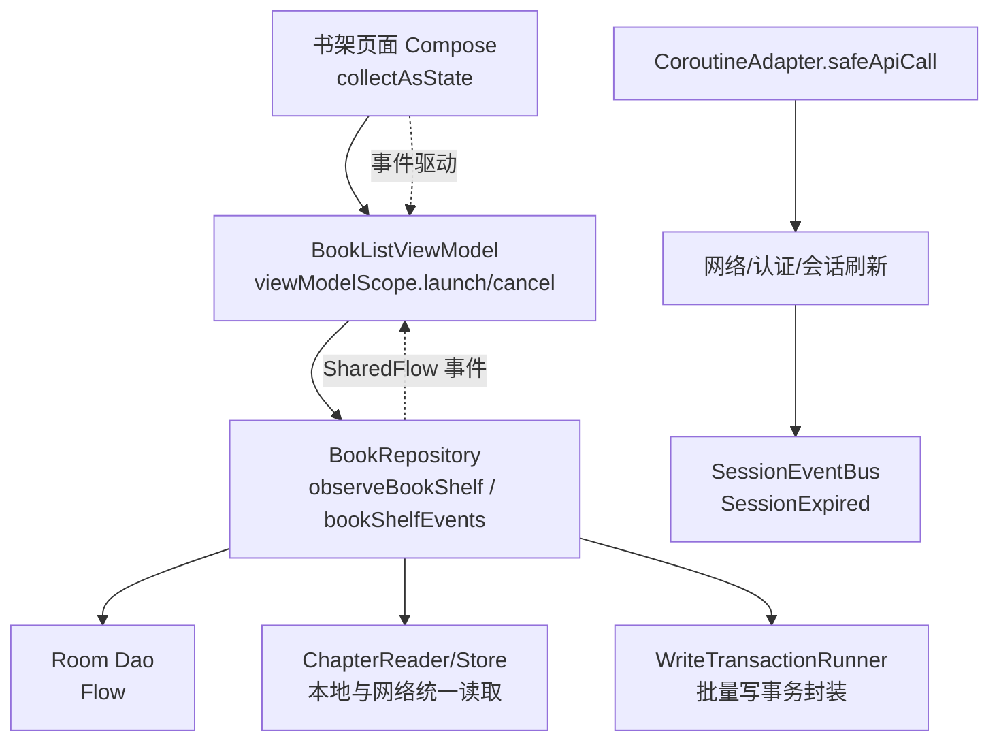
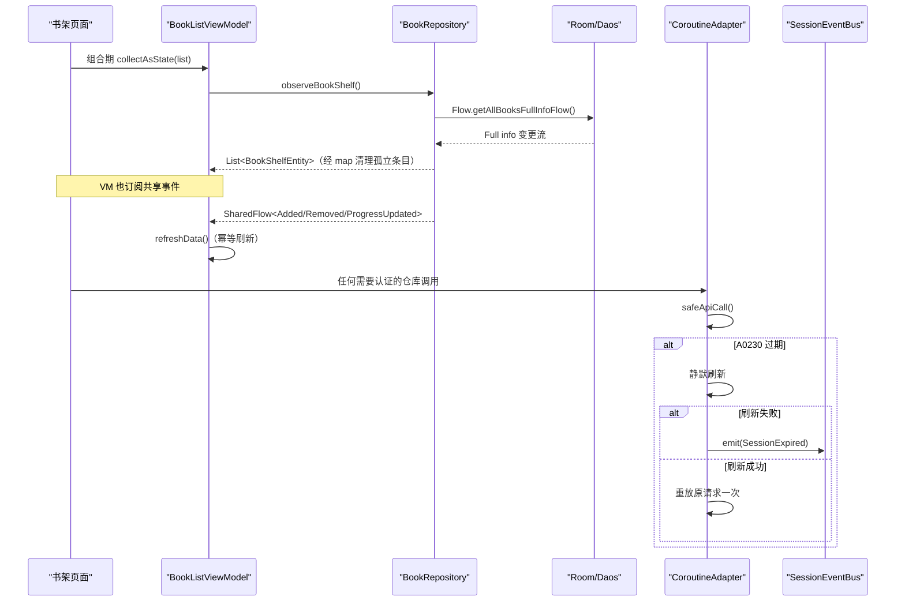
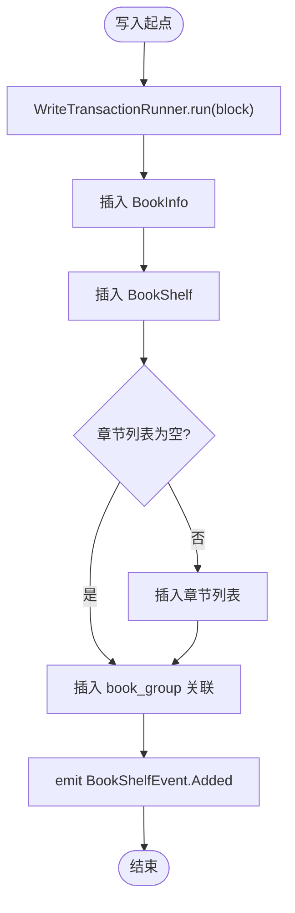
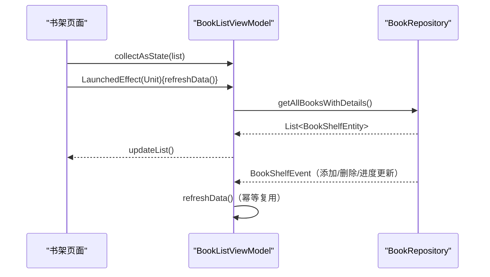
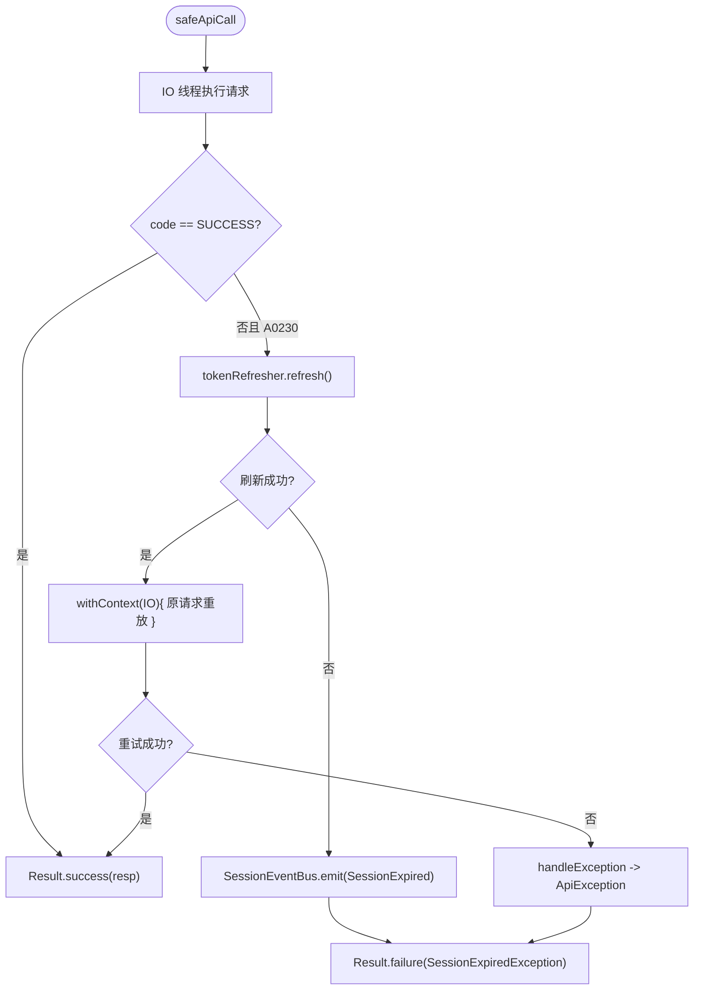
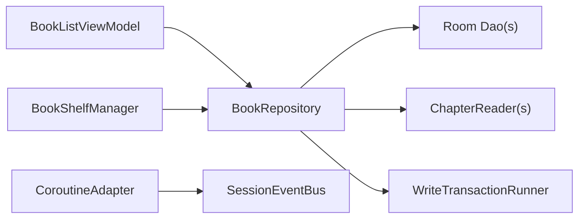
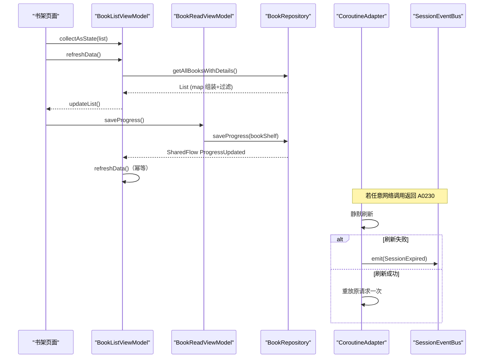

# 数据流管理

<cite>
**本文引用的文件**
- [BookRepository.kt](file://lib_book_common/src/main/java/com/ebook/common/repository/BookRepository.kt)
- [BookListViewModel.kt](file://module_book/src/main/java/com/ebook/book/mvvm/viewmodel/BookListViewModel.kt)
- [BookReadViewModel.kt](file://module_book/src/main/java/com/ebook/book/mvvm/viewmodel/BookReadViewModel.kt)
- [SessionEventBus.kt](file://lib_ebook_api/src/main/java/com/ebook/api/auth/SessionEventBus.kt)
- [CoroutineAdapter.kt](file://lib_ebook_api/src/main/java/com/ebook/api/utils/CoroutineAdapter.kt)
- [BookShelfManager.kt](file://lib_book_common/src/main/java/com/ebook/common/manager/BookShelfManager.kt)
- [WriteTransactionRunner.kt](file://lib_book_common/src/main/java/com/ebook/common/store/WriteTransactionRunner.kt)
</cite>

## 目录
1. [简介](#简介)
2. [项目结构](#项目结构)
3. [核心组件](#核心组件)
4. [架构总览](#架构总览)
5. [关键组件深度分析](#关键组件深度分析)
6. [依赖关系分析](#依赖关系分析)
7. [性能与背压](#性能与背压)
8. [故障排查](#故障排查)
9. [结论](#结论)
10. [附录：端到端响应式流程示例](#附录端到端响应式流程示例)

## 简介
本仓库采用 Kotlin Coroutines + Flow 的响应式编程范式，实现“数据获取 → 状态转换 → UI 更新”的单向数据流。以 BookRepository 为领域层枢纽，通过 SharedFlow 发布书架事件；ViewModel 作为生命周期感知的协程作用域与状态聚合点；Compose 页面通过 collectAsState 将流状态绑定到界面。会话过期等跨模块全局事件由 SessionEventBus 统一收口与分发。网络请求在 CoroutineAdapter 中完成线程切换、异常翻译与会话静默刷新策略，从而把错误处理、重试逻辑从业务代码中解耦。

## 项目结构
- 数据源层（Room DAO/网络）→ Repository → ViewModel → Compose UI。
- 事件总线（SharedFlow）用于同层/跨组件广播（书架变化、会话过期）。
- Hilt 负责依赖注入，确保单例、可替换（便于测试）。

图示来源
- [BookListViewModel.kt:28-56](file://module_book/src/main/java/com/ebook/book/mvvm/viewmodel/BookListViewModel.kt#L28-L56)
- [BookRepository.kt:50-76](file://lib_book_common/src/main/java/com/ebook/common/repository/BookRepository.kt#L50-L76)
- [SessionEventBus.kt:22-44](file://lib_ebook_api/src/main/java/com/ebook/api/auth/SessionEventBus.kt#L22-L44)
- [CoroutineAdapter.kt:41-112](file://lib_ebook_api/src/main/java/com/ebook/api/utils/CoroutineAdapter.kt#L41-L112)

章节来源
- [BookRepository.kt:30-76](file://lib_book_common/src/main/java/com/ebook/common/repository/BookRepository.kt#L30-L76)
- [BookListViewModel.kt:13-56](file://module_book/src/main/java/com/ebook/book/mvvm/viewmodel/BookListViewModel.kt#L13-L56)
- [SessionEventBus.kt:9-44](file://lib_ebook_api/src/main/java/com/ebook/api/auth/SessionEventBus.kt#L9-L44)
- [CoroutineAdapter.kt:17-112](file://lib_ebook_api/src/main/java/com/ebook/api/utils/CoroutineAdapter.kt#L17-L112)

## 核心组件
- BookRepository：书架 CRUD、阅读进度保存、章节正文统一入口；通过 SharedFlow 暴露书架变化事件；提供 Flow 观察接口 observeBookShelf。
- BookListViewModel：使用 viewModelScope 收集书架事件并触发刷新；聚合列表数据状态供 UI 展示。
- BookReadViewModel：封装阅读器相关动作（进度保存、加入书架、章节加载），内部通过 MutableSharedFlow 向 UI 发射轻量事件。
- SessionEventBus：会话级全局事件总线（如 SessionExpired），以低缓冲容量非阻塞发送，适合“风暴去重”场景。
- CoroutineAdapter：统一的网络调用适配，集中处理 IO 线程切分、业务码到 Result 的映射、A0230 会话过期的静默刷新与重试、以及失败时向 SessionEventBus 发事件。
- BookShelfManager：对“搜索结果加书架”的流程做编排，内部调用 BookRepository。
- WriteTransactionRunner：抽象批量写入事务执行接口，提升一致性与可测试性。

章节来源
- [BookRepository.kt:30-201](file://lib_book_common/src/main/java/com/ebook/common/repository/BookRepository.kt#L30-L201)
- [BookListViewModel.kt:13-56](file://module_book/src/main/java/com/ebook/book/mvvm/viewmodel/BookListViewModel.kt#L13-L56)
- [BookReadViewModel.kt:21-123](file://module_book/src/main/java/com/ebook/book/mvvm/viewmodel/BookReadViewModel.kt#L21-L123)
- [SessionEventBus.kt:9-44](file://lib_ebook_api/src/main/java/com/ebook/api/auth/SessionEventBus.kt#L9-L44)
- [CoroutineAdapter.kt:17-149](file://lib_ebook_api/src/main/java/com/ebook/api/utils/CoroutineAdapter.kt#L17-L149)
- [BookShelfManager.kt:11-62](file://lib_book_common/src/main/java/com/ebook/common/manager/BookShelfManager.kt#L11-L62)
- [WriteTransactionRunner.kt:1-13](file://lib_book_common/src/main/java/com/ebook/common/store/WriteTransactionRunner.kt#L1-L13)

## 架构总览
下图展示了从网络层到 UI 的完整响应式链路与事件流向，涵盖 Flow 观察、SharedFlow 事件分发、会话过期全局处理。

图示来源
- [BookRepository.kt:62-76](file://lib_book_common/src/main/java/com/ebook/common/repository/BookRepository.kt#L62-L76)
- [BookListViewModel.kt:28-56](file://module_book/src/main/java/com/ebook/book/mvvm/viewmodel/BookListViewModel.kt#L28-L56)
- [CoroutineAdapter.kt:41-112](file://lib_ebook_api/src/main/java/com/ebook/api/utils/CoroutineAdapter.kt#L41-L112)
- [SessionEventBus.kt:22-44](file://lib_ebook_api/src/main/java/com/ebook/api/auth/SessionEventBus.kt#L22-L44)

## 关键组件深度分析

### BookRepository：数据与事件双通道
- 数据观察：observeBookShelf 返回 Flow，底层 DAO 提供全量信息流，Repository 侧用 map 组装实体并过滤孤立条目，避免下游空引用。
- 事件总线：_bookShelfEvents 是 MutableSharedFlow，暴露只读 SharedFlow；所有改变书架状态的写操作都在同一处 emit 事件，保证事件来源稳定一致。
- 统一读取：loadChapter 通过 ChapterReader 按格式路由，再经内存缓存返回结果；既服务本地书也服务网络书。
- 事务写入：结合 WriteTransactionRunner 进行批写（例如导入路径中多表插入），保证原子性与一致性。

图示来源
- [BookRepository.kt:117-161](file://lib_book_common/src/main/java/com/ebook/common/repository/BookRepository.kt#L117-L161)
- [WriteTransactionRunner.kt:1-13](file://lib_book_common/src/main/java/com/ebook/common/store/WriteTransactionRunner.kt#L1-L13)

章节来源
- [BookRepository.kt:50-201](file://lib_book_common/src/main/java/com/ebook/common/repository/BookRepository.kt#L50-L201)
- [WriteTransactionRunner.kt:1-13](file://lib_book_common/src/main/java/com/ebook/common/store/WriteTransactionRunner.kt#L1-L13)

### BookListViewModel：事件驱动的响应刷新
- 职责：订阅 bookShelfEvents，收到 Added/Removed/ProgressUpdated 即触发 refreshData；刷新过程幂等（无论成功失败都会 stopRefresh 标志位）。
- 作用域：viewModelScope，随 ViewModel 销毁而取消，避免内存泄漏与无效计算。
- 组合模式：页面侧通过 collectAsState 把 list 暴露给 Composable，实现声明式 UI 同步。

图示来源
- [BookListViewModel.kt:28-56](file://module_book/src/main/java/com/ebook/book/mvvm/viewmodel/BookListViewModel.kt#L28-L56)

章节来源
- [BookListViewModel.kt:13-56](file://module_book/src/main/java/com/ebook/book/mvvm/viewmodel/BookListViewModel.kt#L13-L56)

### SessionEventBus：会话级事件总线
- 设计要点：单订阅语义 + 额外缓冲容量为 1，使用 tryEmit 非阻塞发送，防止并发过期风暴造成阻塞或堆积。
- 适用范围：与会话安全相关的全局动作，如“清会话 + 提示 + 跳转登录”，由上层统一订阅处理。

章节来源
- [SessionEventBus.kt:9-44](file://lib_ebook_api/src/main/java/com/ebook/api/auth/SessionEventBus.kt#L9-L44)

### CoroutineAdapter：网络、异常、重试的统一处理
- 线程模型：所有 API 调用在 Dispatchers.IO 执行，主线程不受阻塞。
- 业务码到 Result：统一封装 RespDTO.code，成功走 Success，失败抛 ApiException。
- A0230 会话过期：先尝试静默刷新；失败则向 SessionEventBus 发出 SessionExpired，由全局订阅方统一处理；成功后重放一次原始请求，减少重复调用。
- 取消透传：CancellationException 不吞掉，保持协程取消语义清晰。

图示来源
- [CoroutineAdapter.kt:41-112](file://lib_ebook_api/src/main/java/com/ebook/api/utils/CoroutineAdapter.kt#L41-L112)

章节来源
- [CoroutineAdapter.kt:17-149](file://lib_ebook_api/src/main/java/com/ebook/api/utils/CoroutineAdapter.kt#L17-L149)

### BookReadViewModel：阅读器内的响应式协作
- 进度保存：封装 saveProgress 后调用 Repository.saveProgress，避免页面直接耦合存储细节。
- 事件下发：nextInShelfEvent 为 MutableSharedFlow，配合 tryEmit 仅承载轻量 UI 信号（如入架检测完成后的通知）。
- 章节加载：统一通过 Repository.loadChapter 读取，屏蔽本地/网络差异。

章节来源
- [BookReadViewModel.kt:21-123](file://module_book/src/main/java/com/ebook/book/mvvm/viewmodel/BookReadViewModel.kt#L21-L123)

## 依赖关系分析
- BookListViewModel 依赖 BookRepository；BookRepository 依赖多个 DAO、ChapterReader、BookStore 与 WriteTransactionRunner。
- 网络侧 CoroutineAdapter 依赖 TokenRefresher 与 SessionEventBus，将“认证态”的副作用收敛在一处。
- BookShelfManager 对搜索到书架的复杂流程做编排，降低 ViewModel/页面的复杂度。

图示来源
- [BookRepository.kt:40-49](file://lib_book_common/src/main/java/com/ebook/common/repository/BookRepository.kt#L40-L49)
- [BookShelfManager.kt:18-62](file://lib_book_common/src/main/java/com/ebook/common/manager/BookShelfManager.kt#L18-L62)
- [CoroutineAdapter.kt:30-34](file://lib_ebook_api/src/main/java/com/ebook/api/utils/CoroutineAdapter.kt#L30-L34)
- [SessionEventBus.kt:30-44](file://lib_ebook_api/src/main/java/com/ebook/api/auth/SessionEventBus.kt#L30-L44)

章节来源
- [BookRepository.kt:40-201](file://lib_book_common/src/main/java/com/ebook/common/repository/BookRepository.kt#L40-L201)
- [BookShelfManager.kt:11-62](file://lib_book_common/src/main/java/com/ebook/common/manager/BookShelfManager.kt#L11-L62)
- [CoroutineAdapter.kt:30-149](file://lib_ebook_api/src/main/java/com/ebook/api/utils/CoroutineAdapter.kt#L30-L149)
- [SessionEventBus.kt:30-44](file://lib_ebook_api/src/main/java/com/ebook/api/auth/SessionEventBus.kt#L30-L44)

## 性能与背压
- 背压控制：SharedFlow 使用 extraBufferCapacity=1 或 64 等不同配置平衡“丢消息 vs 内存压力”。对于一次性全局事件（会话过期）使用 1，避免风暴堆积；对于高吞吐的书架事件使用 64，保证短时间突发不被阻塞。
- 流合并与转换：observeBookShelf 使用 map 做轻量数据拼装与过滤，属于“变换型”而非“累积型”操作符，适合频繁重组场景。
- 线程切换：Repository 中 IO 密集操作统一 via withContext(Dispatchers.IO)，视图层只在 Collect 阶段切换到主线程（compose 内默认），保证 UI 流畅。
- 取消传播：ViewModel 层使用 viewModelScope，生命周期自动回收；Cancellations 在网络层不吞没，避免误判业务错误。

章节来源
- [BookRepository.kt:51-52](file://lib_book_common/src/main/java/com/ebook/common/repository/BookRepository.kt#L51-L52)
- [BookRepository.kt:57-76](file://lib_book_common/src/main/java/com/ebook/common/repository/BookRepository.kt#L57-L76)
- [SessionEventBus.kt:33-43](file://lib_ebook_api/src/main/java/com/ebook/api/auth/SessionEventBus.kt#L33-L43)
- [CoroutineAdapter.kt:41-61](file://lib_ebook_api/src/main/java/com/ebook/api/utils/CoroutineAdapter.kt#L41-L61)
- [BookListViewModel.kt:32-40](file://module_book/src/main/java/com/ebook/book/mvvm/viewmodel/BookListViewModel.kt#L32-L40)

## 故障排查
- 症状：页面反复报错但不跳转登录页
  - 可能原因：A0230 刷新失败未正确派发 SessionEventBus；或上层未订阅 SessionEventBus.events
  - 定位位置：
    - 刷新失败出口：[CoroutineAdapter.kt:92-97](file://lib_ebook_api/src/main/java/com/ebook/api/utils/CoroutineAdapter.kt#L92-L97)
    - 事件接收器：需要在应用根或首页订阅 SessionEventBus.events
- 症状：书架事件丢失
  - SharedFlow 无 replay 属性：晚订阅会丢事件。应尽早订阅或在初始化阶段启动收集
  - 参考：[BookListViewModel.kt:32-40](file://module_book/src/main/java/com/ebook/book/mvvm/viewmodel/BookListViewModel.kt#L32-L40)
- 症状：下载任务启动后被系统拒绝导致丢任务
  - 解决：先入库任务再拉起前台服务；参考 [BookReadViewModel.kt:82-90](file://module_book/src/main/java/com/ebook/book/mvvm/viewmodel/BookReadViewModel.kt#L82-L90)

章节来源
- [CoroutineAdapter.kt:84-112](file://lib_ebook_api/src/main/java/com/ebook/api/utils/CoroutineAdapter.kt#L84-L112)
- [BookListViewModel.kt:28-56](file://module_book/src/main/java/com/ebook/book/mvvm/viewmodel/BookListViewModel.kt#L28-L56)
- [BookReadViewModel.kt:73-90](file://module_book/src/main/java/com/ebook/book/mvvm/viewmodel/BookReadViewModel.kt#L73-L90)

## 结论
本项目围绕 Kotlin Coroutines + Flow 构建清晰的响应式数据流：Repository 作为单一事实源与事件中心，ViewModel 承担状态聚合与生命周期管理，UI 通过 Compose 的集合函数被动渲染。全局会话事件通过 SharedFlow 解耦跨层协作，网络错误与会话过期则在 CoroutineAdapter 中集中处理，形成“单一真相、单一副作用出口”的架构形态，提升了可测试性与稳定性。

## 附录：端到端响应式流程示例
以下为从 UI 到数据库/网络，再到 UI 更新的完整链路说明（以“打开书架页 → 拉取书架 → 编辑进度 → 刷新列表”为例）：

1. UI（书架页面）组合期调用 collectAsState(viewModel.list) 开始订阅。
2. LaunchedEffect 首次进入时调 viewModel.refreshData()。
3. BookListViewModel.refreshData 在 viewModelScope 发起一次性查询 getAllBooksWithDetails()，完成后更新列表状态。
4. 用户滑动更新阅读进度：BookReadViewModel.saveProgress → Repository.saveProgress → DAO 写入 → Repository 通过 SharedFlow 发射 ProgressUpdated。
5. BookListViewModel 始终在后台订阅 bookShelfEvents，收到事件再次调用 refreshData() 刷新列表。
6. 若刷新过程中调用网络且遭遇 A0230：CoroutineAdapter.safeApiCall 先静默刷新，失败则向 SessionEventBus 发送 SessionExpired，由全局订阅方执行清会话与导航至登录；成功则重放请求并把数据回传给上游。
7. UI 根据最新的列表与事件状态进行最小化重组，显示最新书架内容与角标。

图示来源
- [BookListViewModel.kt:28-56](file://module_book/src/main/java/com/ebook/book/mvvm/viewmodel/BookListViewModel.kt#L28-L56)
- [BookRepository.kt:110-161](file://lib_book_common/src/main/java/com/ebook/common/repository/BookRepository.kt#L110-L161)
- [BookReadViewModel.kt:40-46](file://module_book/src/main/java/com/ebook/book/mvvm/viewmodel/BookReadViewModel.kt#L40-L46)
- [SessionEventBus.kt:33-43](file://lib_ebook_api/src/main/java/com/ebook/api/auth/SessionEventBus.kt#L33-L43)
- [CoroutineAdapter.kt:71-112](file://lib_ebook_api/src/main/java/com/ebook/api/utils/CoroutineAdapter.kt#L71-L112)