# 整体架构概览

<cite>
**本文引用的文件 **
- [README.MD](file://README.MD)
- [settings.gradle.kts](file://settings.gradle.kts)
- [build.gradle.kts](file://build.gradle.kts)
- [MyApplication.kt](file://module_app/src/main/java/com/ebook/MyApplication.kt)
- [BookApplication.kt](file://lib_book_common/src/main/java/com/ebook/common/BookApplication.kt)
- [SplashActivity.kt](file://module_main/src/main/java/com/ebook/main/SplashActivity.kt)
- [MainActivity.kt](file://module_main/src/main/java/com/ebook/main/MainActivity.kt)
- [SandboxProcess.kt](file://lib_book_source/src/main/java/com/ebook/source/sandbox/SandboxProcess.kt)
- [IBookProvider.kt](file://lib_book_common/src/main/java/com/ebook/common/provider/IBookProvider.kt)
- [ILoginProvider.kt](file://lib_book_common/src/main/java/com/ebook/common/provider/ILoginProvider.kt)
- [IMeProvider.kt](file://lib_book_common/src/main/java/com/ebook/common/provider/IMeProvider.kt)
- [IFindProvider.kt](file://lib_book_common/src/main/java/com/ebook/common/provider/IFindProvider.kt)
- [BookProvider.kt](file://module_book/src/main/java/com/ebook/book/provider/BookProvider.kt)
- [LoginProvider.kt](file://module_login/src/main/java/com/ebook/login/provider/LoginProvider.kt)
- [FindProvider.kt](file://module_find/src/main/java/com/ebook/find/provider/FindProvider.kt)
- [MeProvider.kt](file://module_me/src/main/java/com/ebook/me/provider/MeProvider.kt)
- [BookRepository.kt](file://lib_book_common/src/main/java/com/ebook/common/repository/BookRepository.kt)
- [CommentRepository.kt](file://lib_book_common/src/main/java/com/ebook/common/repository/CommentRepository.kt)
- [ProfileRepository.kt](file://lib_book_common/src/main/java/com/ebook/common/repository/ProfileRepository.kt)
- [AppDatabase.kt](file://lib_ebook_db/src/main/java/com/ebook/db/AppDatabase.kt)
- [RetrofitBuilder.kt](file://lib_ebook_api/src/main/java/com/ebook/api/RetrofitBuilder.kt)
</cite>

## 目录

1. [引言](#引言)
2. [项目结构](#项目结构)
3. [核心组件](#核心组件)
4. [架构总览](#架构总览)
5. [分层与 MVVM 设计](#分层与-mvvm-设计)
6. [模块化架构与依赖关系](#模块化架构与依赖关系)
7. [应用启动流程与初始化过程](#应用启动流程与初始化过程)
8. [详细组件分析](#详细组件分析)
9. [依赖分析](#依赖分析)
10. [性能与可靠性考量](#性能与可靠性考量)
11. [故障排查指南](#故障排查指南)
12. [结论](#结论)

## 引言

这是一个 100% Kotlin 开发的 Android 小说阅读器，采用 MVVM 架构、多模块组织方式，界面全部迁移到 Jetpack Compose。项目把“书架与阅读”“书城与搜索”“个人中心”“登录认证”作为功能模块，底层由共享库提供领域模型、网络层、数据库、书源解析引擎和沙箱执行器。

从高层看，这个系统可以理解为：

- **UI 层**：以 `module_main` 为宿主容器，通过 TheRouter + Provider 组合各业务模块的 Compose 页面。
- **业务层**：每个功能模块实现自己的 ViewModel 与 Repository，负责状态编排、跨数据源聚合和 UI 相关逻辑。
- **数据层**：`lib_book_common` 中的通用 Repository 汇聚 Room、网络 API、本地缓存和书源解析能力。
- **基础设施层**：`lib_ebook_api` 封装 Retrofit/OkHttp，`lib_ebook_db` 封装 Room 实体与 DAO，`lib_book_source` 提供书源规则解析和 JS 沙箱进程。

**章节来源**
- [README.MD:1-120](file://README.MD#L1-L120)

## 项目结构

Gradle 根工程声明了所有模块，并引入 `build-logic` 约定插件。根 `settings.gradle.kts` 中显式包含以下模块：

| 模块 | 职责 |
|---|---|
| `module_app` | 应用入口、Hilt 容器、隔离进程门、内容仓库对账 |
| `module_main` | 主页、启动页、底部 Tab 导航、会话过期统一处理 |
| `module_book` | 书架、阅读、下载、书籍元数据编辑、评论 |
| `module_find` | 书城浏览、搜索、书库缓存 |
| `module_me` | 个人中心、头像、设置、版本更新检查 |
| `module_login` | 登录、注册、修改密码、验证用户 |
| `lib_book_common` | 领域模型、Provider 接口、通用 Repository、主题管理、事件、工具类 |
| `lib_book_source` | 书源解析引擎、原生解析器、脚本解释器、QuickJS 沙箱进程 |
| `lib_ebook_api` | Retrofit 服务、数据实体、OkHttp 拦截器 |
| `lib_ebook_db` | Room 数据库、Entity、DAO、数据库迁移 |

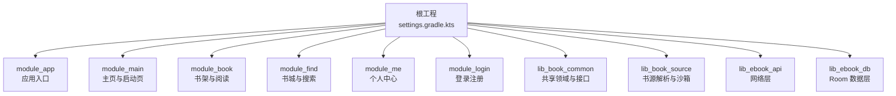

**图表来源**
- [settings.gradle.kts:52-65](file://settings.gradle.kts#L52-L65)

**章节来源**
- [settings.gradle.kts:1-65](file://settings.gradle.kts#L1-L65)
- [README.MD:120-212](file://README.MD#L120-L212)

## 核心组件

### 应用进程入口

`MyApplication` 是带 `@HiltAndroidApp` 的应用类，继承 `BookApplication`。它承担以下职责：

1. 调用父类 `onCreate`，让 Hilt 完成注入并执行基础初始化。
2. 判断是否处于隔离的沙箱进程；如果是，直接返回，不再做主进程才需要的初始化。
3. 注册路由拦截器，用于未登录时跳转登录。
4. 在后台协程中通过 Hilt EntryPoint 获取 `BookRepository`，触发内容存储目录对账，回收导入中断或删书后留下的无主目录。
5. 定义 `ContentStoreEntryPoint`，避免在 Application 字段上做早注入。

`BookApplication` 则负责更通用的应用级初始化：

1. 同样先判断是否处于隔离进程，避免在沙箱中尝试读取 SharedPreferences。
2. 通过 `AppTheme.install` 装配 Compose 主题，深色模式来自 `ThemeModeManager` 的状态流。
3. 使用 Hilt EntryPoint 取出 `ThemeModeManager`，并将其挂到伴生对象，供 Compose 重组时读取。

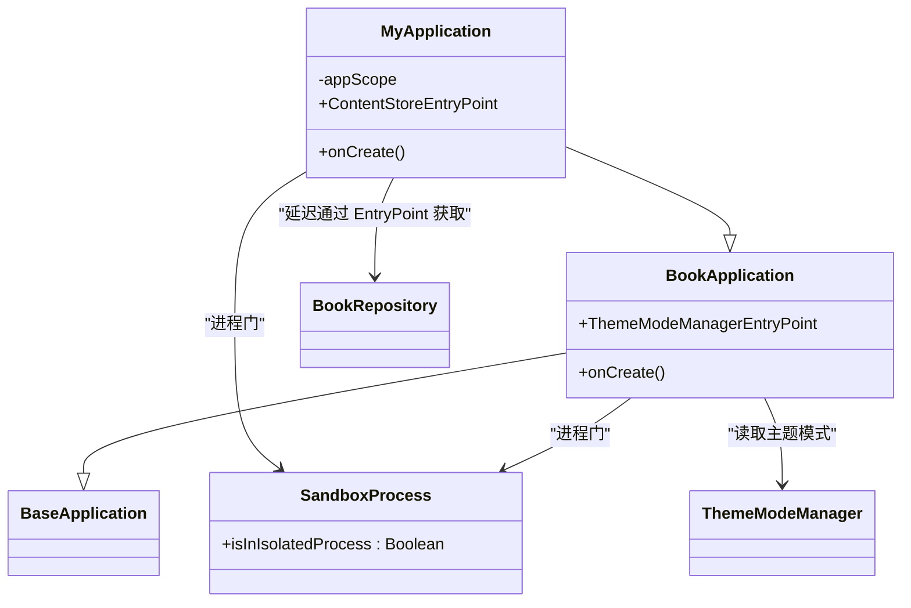

**图表来源**
- [MyApplication.kt:1-66](file://module_app/src/main/java/com/ebook/MyApplication.kt#L1-L66)
- [BookApplication.kt:1-64](file://lib_book_common/src/main/java/com/ebook/common/BookApplication.kt#L1-L64)
- [SandboxProcess.kt:1-28](file://lib_book_source/src/main/java/com/ebook/source/sandbox/SandboxProcess.kt#L1-L28)

**章节来源**
- [MyApplication.kt:1-66](file://module_app/src/main/java/com/ebook/MyApplication.kt#L1-L66)
- [BookApplication.kt:1-64](file://lib_book_common/src/main/java/com/ebook/common/BookApplication.kt#L1-L64)
- [SandboxProcess.kt:1-28](file://lib_book_source/src/main/java/com/ebook/source/sandbox/SandboxProcess.kt#L1-L28)

### Provider 接口与实现

项目用 Provider 接口作为模块间契约，避免功能模块之间互相依赖：

| 接口 | 所属模块 | 提供方 | 用途 |
|---|---|---|---|
| `IBookProvider` | `lib_book_common` | `module_book` | 暴露书架主页面 |
| `IFindProvider` | `lib_book_common` | `module_find` | 暴露书城主页面 |
| `IMeProvider` | `lib_book_common` | `module_me` | 暴露个人中心主页面 |
| `ILoginProvider` | `lib_book_common` | `module_login` | 暴露服务端登出能力 |

这些接口返回 Composable 页面或直接返回 suspend 函数结果，由宿主模块通过 TheRouter 的 `ServiceProvider` 机制获取。例如 `BookProvider` 实现 `IBookProvider`，返回 `BookShelfPage`，并把“跳转到书城”回调交给宿主注入。

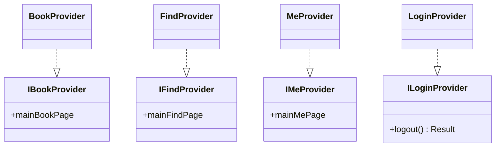

**图表来源**
- [IBookProvider.kt:1-23](file://lib_book_common/src/main/java/com/ebook/common/provider/IBookProvider.kt#L1-L23)
- [IFindProvider.kt:1-13](file://lib_book_common/src/main/java/com/ebook/common/provider/IFindProvider.kt#L1-L13)
- [IMeProvider.kt:1-13](file://lib_book_common/src/main/java/com/ebook/common/provider/IMeProvider.kt#L1-L13)
- [ILoginProvider.kt:1-19](file://lib_book_common/src/main/java/com/ebook/common/provider/ILoginProvider.kt#L1-L19)
- [BookProvider.kt:1-16](file://module_book/src/main/java/com/ebook/book/provider/BookProvider.kt#L1-L16)
- [FindProvider.kt:1-19](file://module_find/src/main/java/com/ebook/find/provider/FindProvider.kt#L1-L19)
- [MeProvider.kt:1-20](file://module_me/src/main/java/com/ebook/me/provider/MeProvider.kt#L1-L20)
- [LoginProvider.kt:1-36](file://module_login/src/main/java/com/ebook/login/provider/LoginProvider.kt#L1-L36)

**章节来源**
- [IBookProvider.kt:1-23](file://lib_book_common/src/main/java/com/ebook/common/provider/IBookProvider.kt#L1-L23)
- [ILoginProvider.kt:1-19](file://lib_book_common/src/main/java/com/ebook/common/provider/ILoginProvider.kt#L1-L19)
- [IMeProvider.kt:1-13](file://lib_book_common/src/main/java/com/ebook/common/provider/IMeProvider.kt#L1-L13)
- [IFindProvider.kt:1-13](file://lib_book_common/src/main/java/com/ebook/common/provider/IFindProvider.kt#L1-L13)
- [BookProvider.kt:1-16](file://module_book/src/main/java/com/ebook/book/provider/BookProvider.kt#L1-L16)
- [LoginProvider.kt:1-36](file://module_login/src/main/java/com/ebook/login/provider/LoginProvider.kt#L1-L36)
- [FindProvider.kt:1-19](file://module_find/src/main/java/com/ebook/find/provider/FindProvider.kt#L1-L19)
- [MeProvider.kt:1-20](file://module_me/src/main/java/com/ebook/me/provider/MeProvider.kt#L1-L20)

## 架构总览

系统整体分为四层：

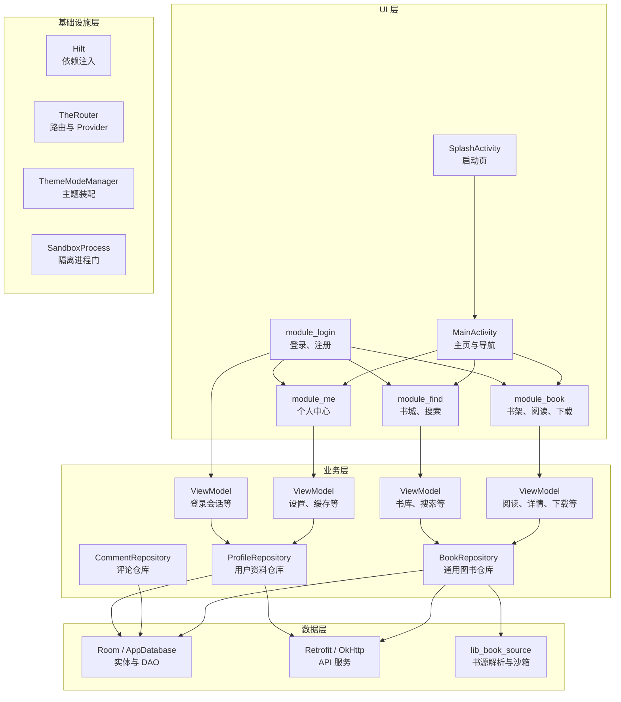

**图表来源**
- [SplashActivity.kt:1-200](file://module_main/src/main/java/com/ebook/main/SplashActivity.kt#L1-L200)
- [MainActivity.kt:1-200](file://module_main/src/main/java/com/ebook/main/MainActivity.kt#L1-L200)
- [BookRepository.kt](file://lib_book_common/src/main/java/com/ebook/common/repository/BookRepository.kt)
- [CommentRepository.kt](file://lib_book_common/src/main/java/com/ebook/common/repository/CommentRepository.kt)
- [ProfileRepository.kt](file://lib_book_common/src/main/java/com/ebook/common/repository/ProfileRepository.kt)
- [AppDatabase.kt](file://lib_ebook_db/src/main/java/com/ebook/db/AppDatabase.kt)
- [RetrofitBuilder.kt](file://lib_ebook_api/src/main/java/com/ebook/api/RetrofitBuilder.kt)
- [SandboxProcess.kt:1-28](file://lib_book_source/src/main/java/com/ebook/source/sandbox/SandboxProcess.kt#L1-L28)

## 分层与 MVVM 设计

### 分层职责

| 层次 | 主要职责 | 典型位置 |
|---|---|---|
| UI 层 | 渲染 Compose 界面、接收用户输入、展示加载与错误态 | `module_main`、`module_book`、`module_find`、`module_me`、`module_login` |
| 业务层 | 管理 UI 状态、协调多个 Repository、编排协程与 Flow | 各模块下的 `mvvm/viewmodel` |
| 数据层 | 统一访问本地数据库、网络 API、书源解析和本地缓存 | `lib_book_common/repository` |
| 基础设施层 | 依赖注入、路由、网络客户端、数据库、主题、沙箱 | Hilt、TheRouter、Retrofit、Room、`lib_book_source` |

### MVVM 的具体实现

- **View**：以 Compose 页面为主，`MainActivity` 通过 NavHost 组合各模块提供的 Composable 页面。
- **ViewModel**：按业务域划分，如 `BookReadViewModel`、`BookDetailViewModel`、`LibraryViewModel`、`SearchViewModel`、`SettingViewModel` 等，持有可观察状态并通过 Flow 暴露给 UI。
- **Model**：由 Repository 抽象数据源，向上只暴露业务语义方法，不强制 View 感知 Room、Retrofit 或书源规则。

典型数据流向是：

1. UI 调用 ViewModel 的方法。
2. ViewModel 调用 Repository。
3. Repository 选择从 Room、网络 API、书源解析或本地缓存取数据。
4. Repository 将结果转换为领域对象或 UI 状态。
5. ViewModel 通过 StateFlow/SharedFlow 通知 UI 重组。

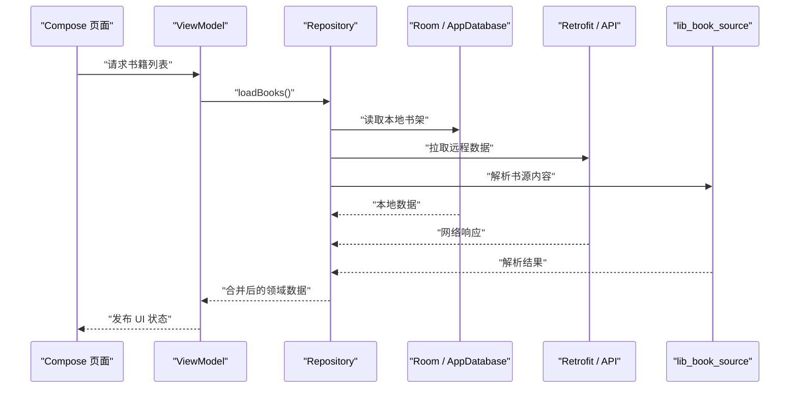

**图表来源**
- [BookRepository.kt](file://lib_book_common/src/main/java/com/ebook/common/repository/BookRepository.kt)
- [AppDatabase.kt](file://lib_ebook_db/src/main/java/com/ebook/db/AppDatabase.kt)
- [RetrofitBuilder.kt](file://lib_ebook_api/src/main/java/com/ebook/api/RetrofitBuilder.kt)
- [SandboxProcess.kt:1-28](file://lib_book_source/src/main/java/com/ebook/source/sandbox/SandboxProcess.kt#L1-L28)

**章节来源**
- [README.MD:160-212](file://README.MD#L160-L212)
- [SplashActivity.kt:1-200](file://module_main/src/main/java/com/ebook/main/SplashActivity.kt#L1-L200)
- [MainActivity.kt:1-200](file://module_main/src/main/java/com/ebook/main/MainActivity.kt#L1-L200)

## 模块化架构与依赖关系

项目的模块化思想可以概括为：

- **功能模块互不依赖**：`module_book`、`module_find`、`module_me`、`module_login` 之间不直接互相引用。
- **共享接口放在 `lib_book_common`**：Provider 接口、领域模型、通用 Repository、事件、工具类都放在这里。
- **跨模块通信走两个通道**：
  - UI 页面通过 TheRouter + Provider 接口组合。
  - 非 UI 能力通过 Repository、Domain、Event 等共享类型传递。
- **基础设施下沉**：网络、数据库、书源解析、沙箱执行器集中在底层库，被上层复用。

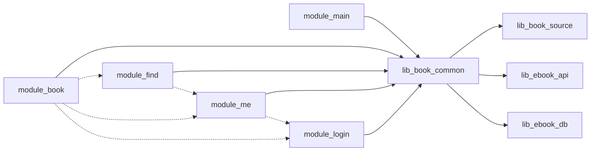

**图表来源**
- [settings.gradle.kts:52-65](file://settings.gradle.kts#L52-L65)
- [IBookProvider.kt:1-23](file://lib_book_common/src/main/java/com/ebook/common/provider/IBookProvider.kt#L1-L23)
- [ILoginProvider.kt:1-19](file://lib_book_common/src/main/java/com/ebook/common/provider/ILoginProvider.kt#L1-L19)
- [IMeProvider.kt:1-13](file://lib_book_common/src/main/java/com/ebook/common/provider/IMeProvider.kt#L1-L13)
- [IFindProvider.kt:1-13](file://lib_book_common/src/main/java/com/ebook/common/provider/IFindProvider.kt#L1-L13)

**章节来源**
- [README.MD:120-160](file://README.MD#L120-L160)
- [settings.gradle.kts:1-65](file://settings.gradle.kts#L1-L65)

## 应用启动流程与初始化过程

### 启动主流程

应用启动的关键阶段如下：

1. 系统创建 `MyApplication`。
2. `MyApplication.onCreate` 调用父类 `BookApplication.onCreate`。
3. `BookApplication` 判断是否处于隔离进程；如果不是，装配 Compose 主题并注入 `ThemeModeManager`。
4. `MyApplication` 继续执行：注册路由拦截器、启动内容仓库对账协程。
5. 系统进入 `SplashActivity`，进行最小欢迎图展示和自动登录恢复。
6. 如果上次异常关闭且阅读标记有效，尝试恢复阅读界面；否则进入 `MainActivity`。
7. `MainActivity` 订阅会话过期事件，组合三个 Tab 的 NavHost。

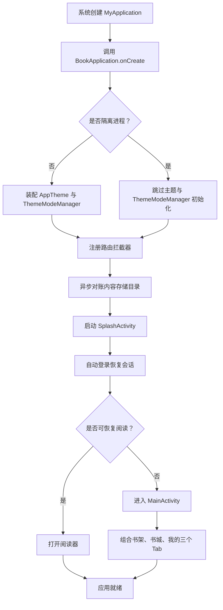

**图表来源**
- [MyApplication.kt:1-66](file://module_app/src/main/java/com/ebook/MyApplication.kt#L1-L66)
- [BookApplication.kt:1-64](file://lib_book_common/src/main/java/com/ebook/common/BookApplication.kt#L1-L64)
- [SplashActivity.kt:1-200](file://module_main/src/main/java/com/ebook/main/SplashActivity.kt#L1-L200)
- [MainActivity.kt:1-200](file://module_main/src/main/java/com/ebook/main/MainActivity.kt#L1-L200)

### Hilt 依赖注入容器的构建

- `MyApplication` 使用 `@HiltAndroidApp`，表示它是 Hilt 容器入口。
- `BookApplication` 本身不走 `@HiltAndroidApp` 注入路径，而是通过 `EntryPointAccessors` 从 `SingletonComponent` 获取 `ThemeModeManager`。
- `SplashActivity`、`MainActivity` 使用 `@AndroidEntryPoint`，通过 `@Inject` 注入 `UserSessionManager`、`BookRepository`、`SessionEventBus` 等。
- `ContentStoreEntryPoint` 把 `BookRepository` 的构造延迟到协程内部，避免沙箱进程误读 Room 库文件。

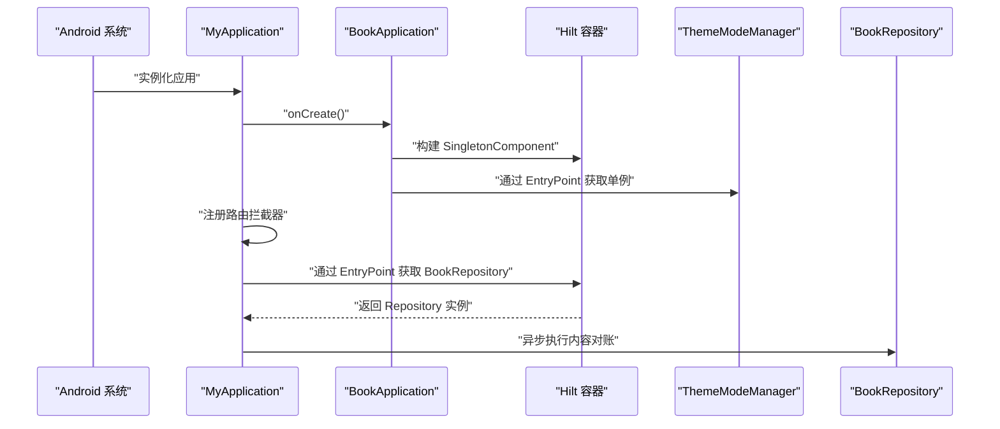

**图表来源**
- [MyApplication.kt:1-66](file://module_app/src/main/java/com/ebook/MyApplication.kt#L1-L66)
- [BookApplication.kt:1-64](file://lib_book_common/src/main/java/com/ebook/common/BookApplication.kt#L1-L64)

### 沙箱进程的启动与隔离

`SandboxProcess` 提供唯一入口 `isInIsolatedProcess`，判据是：

- SDK 版本不低于 API 28；
- 当前进程由 `Process.isIsolated()` 判定为隔离进程。

`BookApplication` 和 `MyApplication` 都用这个判据做进程门：

- 沙箱进程不装配 Compose 主题；
- 沙箱进程不读取 SharedPreferences；
- 沙箱进程不调用需要 Room 或网络能力的初始化代码。

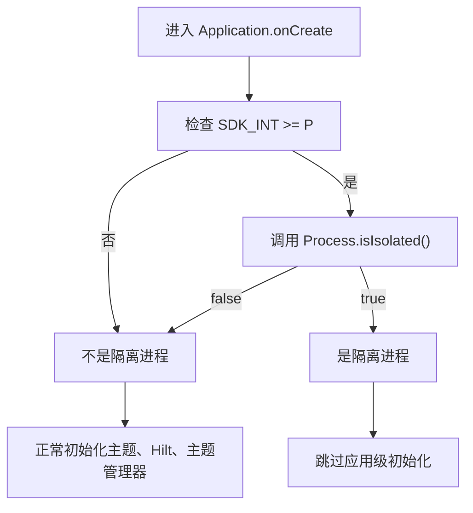

**图表来源**
- [SandboxProcess.kt:1-28](file://lib_book_source/src/main/java/com/ebook/source/sandbox/SandboxProcess.kt#L1-L28)
- [BookApplication.kt:1-64](file://lib_book_common/src/main/java/com/ebook/common/BookApplication.kt#L1-L64)
- [MyApplication.kt:1-66](file://module_app/src/main/java/com/ebook/MyApplication.kt#L1-L66)

**章节来源**
- [MyApplication.kt:1-66](file://module_app/src/main/java/com/ebook/MyApplication.kt#L1-L66)
- [BookApplication.kt:1-64](file://lib_book_common/src/main/java/com/ebook/common/BookApplication.kt#L1-L64)
- [SplashActivity.kt:1-200](file://module_main/src/main/java/com/ebook/main/SplashActivity.kt#L1-L200)
- [MainActivity.kt:1-200](file://module_main/src/main/java/com/ebook/main/MainActivity.kt#L1-L200)
- [SandboxProcess.kt:1-28](file://lib_book_source/src/main/java/com/ebook/source/sandbox/SandboxProcess.kt#L1-L28)

## 详细组件分析

### 启动页与会话恢复

`SplashActivity` 的职责不仅是显示欢迎图，还承担启动期会话预载和阅读恢复：

- 并行等待“最小展示时长”和“自动登录会话”。
- 会话超时不会阻塞启动，但会尽快放行。
- 优先尝试恢复上次异常关闭时的阅读界面；失败时再进入主页。
- 恢复时需要通过 `ReaderResumeStore` 的 `noteUrl` 查书架条目，确认书籍仍存在。

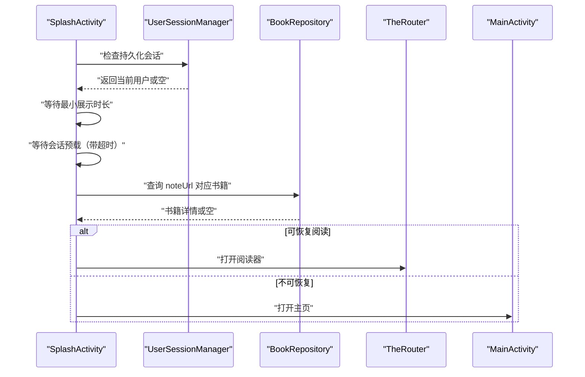

**图表来源**
- [SplashActivity.kt:1-200](file://module_main/src/main/java/com/ebook/main/SplashActivity.kt#L1-L200)
- [BookRepository.kt](file://lib_book_common/src/main/java/com/ebook/common/repository/BookRepository.kt)

**章节来源**
- [SplashActivity.kt:1-200](file://module_main/src/main/java/com/ebook/main/SplashActivity.kt#L1-L200)

### 主页与会话过期处理

`MainActivity` 是长期驻留的主容器，负责：

- 订阅 `SessionEventBus` 的会话过期事件。
- 会话过期时清除本地会话、提示用户、跳转到登录页。
- 组合三个 Tab 的 NavHost，统一管理回退栈状态。
- 通过 Provider 接口组合书架、书城、个人中心页面。

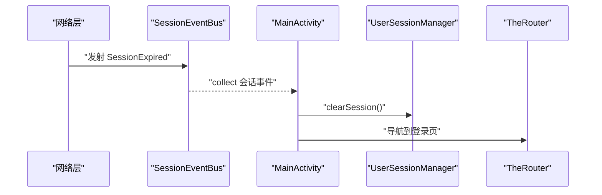

**图表来源**
- [MainActivity.kt:1-200](file://module_main/src/main/java/com/ebook/main/MainActivity.kt#L1-L200)

**章节来源**
- [MainActivity.kt:1-200](file://module_main/src/main/java/com/ebook/main/MainActivity.kt#L1-L200)

### 数据层 Repository 设计

`lib_book_common` 中的 Repository 是跨模块复用的数据门面：

- `BookRepository`：聚合书架、章节、书源、内容存储、目录同步等能力。
- `CommentRepository`：封装章节评论的网络与本地操作。
- `ProfileRepository`：封装用户资料、会话、账号相关的网络与本地操作。

它们向上只暴露业务语义方法，隐藏 Room、Retrofit、书源解析和沙箱进程细节。

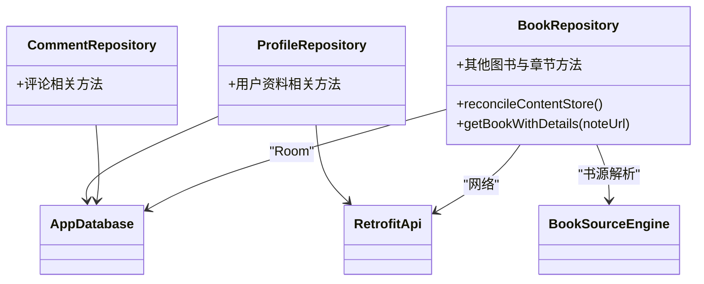

**图表来源**
- [BookRepository.kt](file://lib_book_common/src/main/java/com/ebook/common/repository/BookRepository.kt)
- [CommentRepository.kt](file://lib_book_common/src/main/java/com/ebook/common/repository/CommentRepository.kt)
- [ProfileRepository.kt](file://lib_book_common/src/main/java/com/ebook/common/repository/ProfileRepository.kt)
- [AppDatabase.kt](file://lib_ebook_db/src/main/java/com/ebook/db/AppDatabase.kt)
- [RetrofitBuilder.kt](file://lib_ebook_api/src/main/java/com/ebook/api/RetrofitBuilder.kt)

**章节来源**
- [BookRepository.kt](file://lib_book_common/src/main/java/com/ebook/common/repository/BookRepository.kt)
- [CommentRepository.kt](file://lib_book_common/src/main/java/com/ebook/common/repository/CommentRepository.kt)
- [ProfileRepository.kt](file://lib_book_common/src/main/java/com/ebook/common/repository/ProfileRepository.kt)

## 依赖分析

### 模块依赖方向

项目依赖方向遵循“功能模块 → 共享库 → 基础设施库”的单向原则：

- `module_main`、`module_book`、`module_find`、`module_me`、`module_login` 依赖 `lib_book_common`。
- `lib_book_common` 依赖 `lib_book_source`、`lib_ebook_api`、`lib_ebook_db`。
- 功能模块之间通过 `lib_book_common` 中的 Provider 接口解耦。

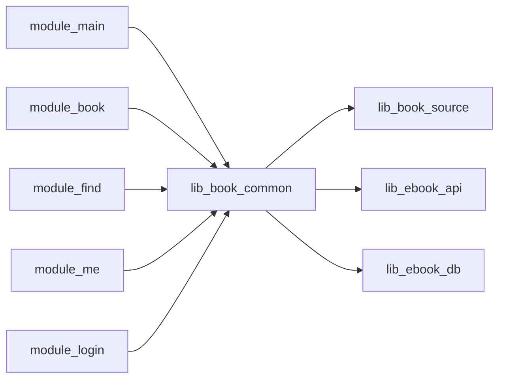

**图表来源**
- [settings.gradle.kts:52-65](file://settings.gradle.kts#L52-L65)
- [README.MD:120-160](file://README.MD#L120-L160)

**章节来源**
- [settings.gradle.kts:1-65](file://settings.gradle.kts#L1-L65)
- [README.MD:120-160](file://README.MD#L120-L160)

### 关键外部依赖

| 技术 | 作用 | 体现位置 |
|---|---|---|
| Hilt | 依赖注入容器 | `MyApplication`、`BookApplication`、各 Activity 与 ViewModel |
| TheRouter | 路由与 Provider 服务发现 | 各模块 Provider、主页导航、登录拦截 |
| Jetpack Compose | 全量 UI | 各模块页面、阅读界面、主页骨架 |
| Room | 本地数据库 | `lib_ebook_db` |
| Retrofit + OkHttp | 网络请求 | `lib_ebook_api` |
| QuickJS + JNI | 脚本书源沙箱执行器 | `lib_book_source` |

**章节来源**
- [README.MD:160-212](file://README.MD#L160-L212)

## 性能与可靠性考量

### 启动性能

- 自动登录会话有超时保护，不会因弱网无限阻塞启动。
- 内容仓库对账放在后台协程，失败只记日志，不影响启动。
- 沙箱进程尽早短路，避免无意义的 UI 和网络初始化。

### 数据一致性

- 内容存储目录对账在应用启动时执行一次，清理无主目录。
- 阅读恢复流程同时检查恢复标记和书籍实体存在性，避免残留标记导致白屏。
- 会话过期事件在长期驻留的 `MainActivity` 中统一处理，避免多处重复逻辑。

### 隔离安全性

- 脚本书源运行在独立隔离进程中，权限受限。
- 进程判断基于系统 API，而不是容易变化的进程名。
- 沙箱进程不能访问主进程 SharedPreferences 和 Room 文件。

[本节为通用架构建议，不直接分析具体代码行]

## 故障排查指南

### 应用启动崩溃

常见原因包括：

1. 在 Application 字段上做了早注入，导致沙箱进程提前访问 Room 或网络资源。
   - 解决思路：参考 `ContentStoreEntryPoint`，只在真正使用时通过 EntryPoint 获取依赖。
2. 主题装配或 `ThemeModeManager` 在沙箱进程中执行。
   - 解决思路：确保 `SandboxProcess.isInIsolatedProcess` 判断在主题初始化之前。
3. 路由拦截器或登录校验在沙箱进程中被执行。
   - 解决思路：确保沙箱进程在 `super.onCreate()` 之后立即 return。

**章节来源**
- [MyApplication.kt:1-66](file://module_app/src/main/java/com/ebook/MyApplication.kt#L1-L66)
- [BookApplication.kt:1-64](file://lib_book_common/src/main/java/com/ebook/common/BookApplication.kt#L1-L64)
- [SandboxProcess.kt:1-28](file://lib_book_source/src/main/java/com/ebook/source/sandbox/SandboxProcess.kt#L1-L28)

### 启动后无法恢复阅读

可能原因：

1. `ReaderResumeStore.pendingNoteUrl()` 为空。
2. 书籍已被删除，`BookRepository.getBookWithDetails` 返回空。
3. 阅读器路由尚未加载完成，不能用静态探测代替实际跳转。
4. 恢复逻辑与主页跳转之间存在重入守卫失效。

**章节来源**
- [SplashActivity.kt:1-200](file://module_main/src/main/java/com/ebook/main/SplashActivity.kt#L1-L200)
- [BookRepository.kt](file://lib_book_common/src/main/java/com/ebook/common/repository/BookRepository.kt)

### 会话过期后没有跳转登录

可能原因：

1. `SessionEventBus` 没有在 `MainActivity` 中订阅。
2. 网络层没有正确发射 `SessionExpired` 事件。
3. 清会话逻辑被取消或异常吞掉。
4. TheRouter 登录路由未注册。

**章节来源**
- [MainActivity.kt:1-200](file://module_main/src/main/java/com/ebook/main/MainActivity.kt#L1-L200)

## 结论

这个 Android 小说阅读器的架构以“清晰分层 + 模块化解耦 + 沙箱隔离”为核心：

- **分层明确**：UI 层专注 Compose 界面，业务层管理状态，数据层屏蔽 Room、网络和书源差异，基础设施层提供 Hilt、TheRouter、网络和数据能力。
- **MVVM 落地**：ViewModel 持有 UI 状态，Repository 统一数据源，UI 只消费可观察状态。
- **模块化设计**：功能模块通过 Provider 接口和共享领域类型协作，避免循环依赖。
- **启动流程稳健**：Hilt 容器、主题装配、沙箱进程门、路由拦截、会话恢复和内容对账都有明确的顺序和边界。
- **沙箱安全**：脚本书源在独立进程中执行，主进程通过 `SandboxProcess` 做进程门，避免误初始化。

对于新加入的开发者，建议先从 `module_main` 理解启动和导航，再从 `lib_book_common` 理解领域模型和 Repository，最后结合 `lib_ebook_api`、`lib_ebook_db`、`lib_book_source` 理解数据与书源引擎如何支撑上层业务。

[本节为总结性内容，不直接分析具体代码行]