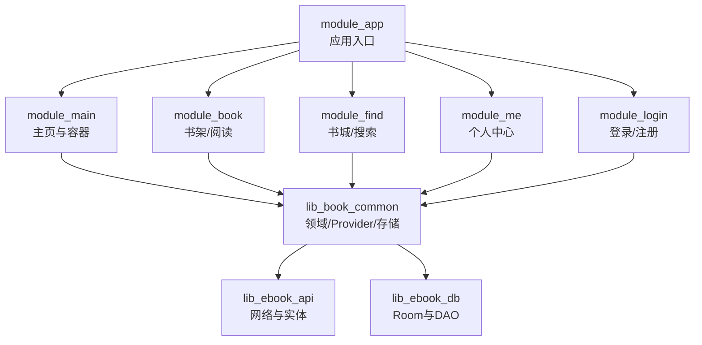
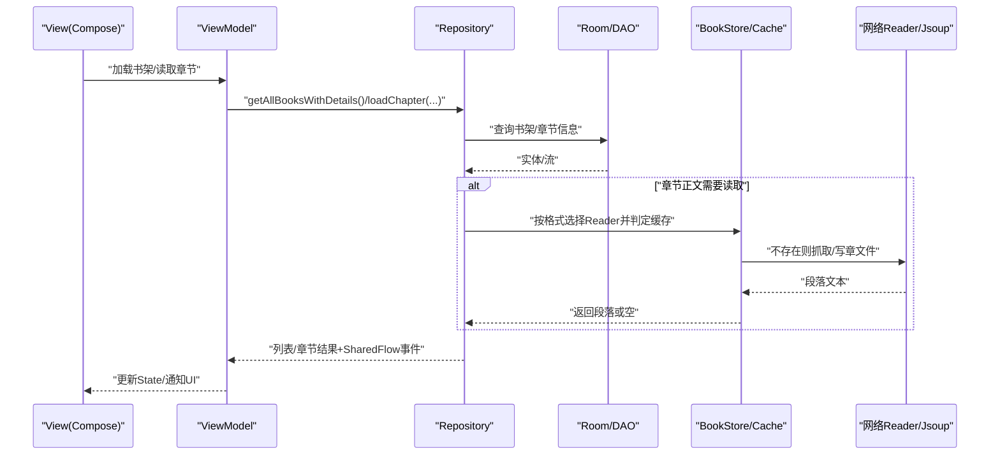
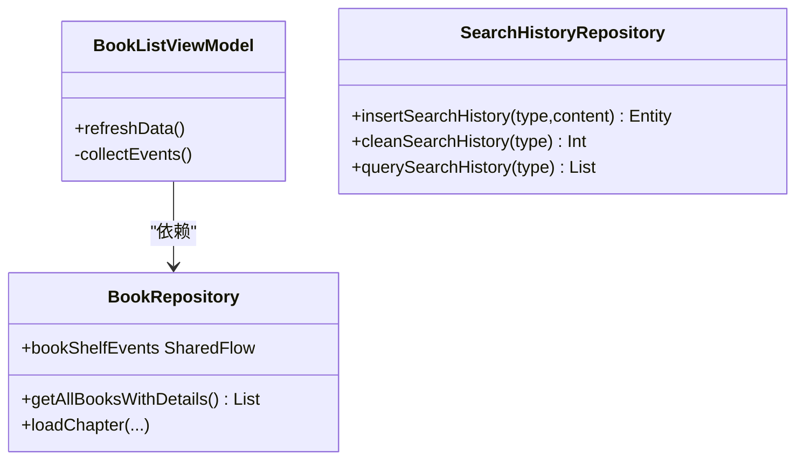
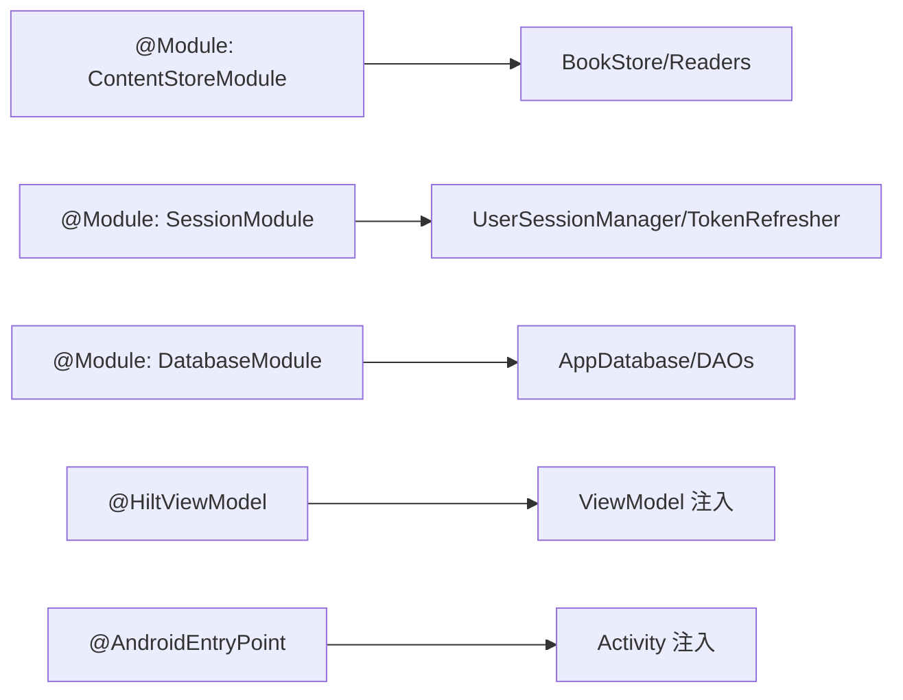
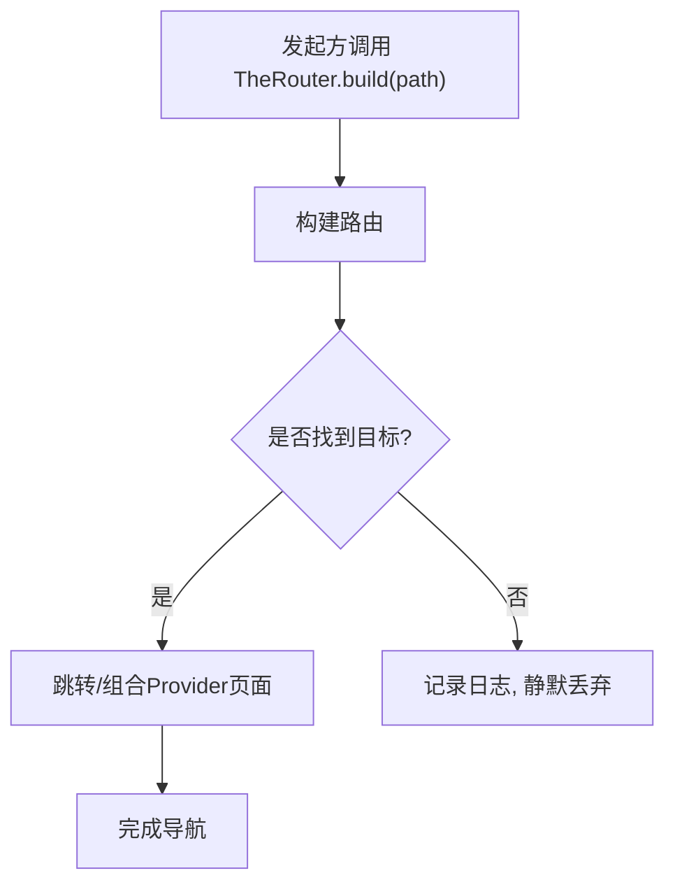
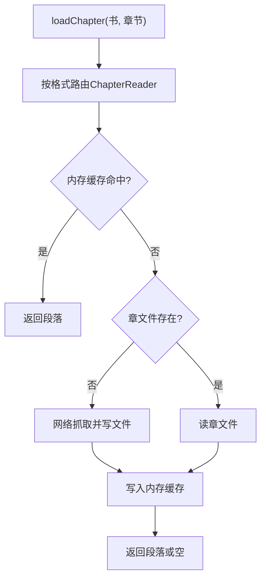
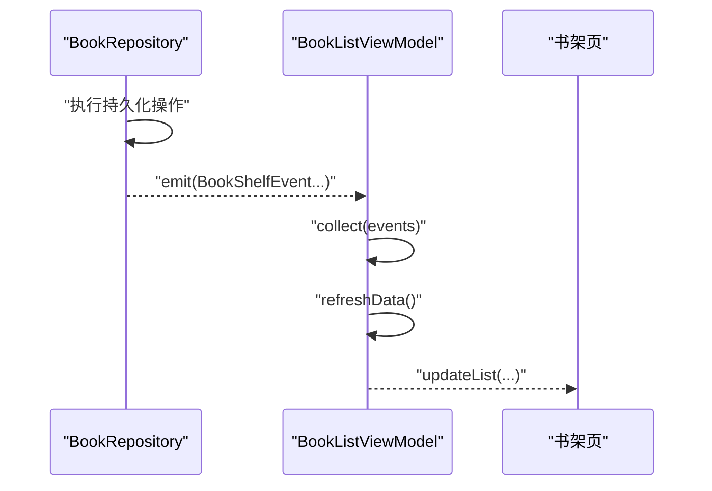
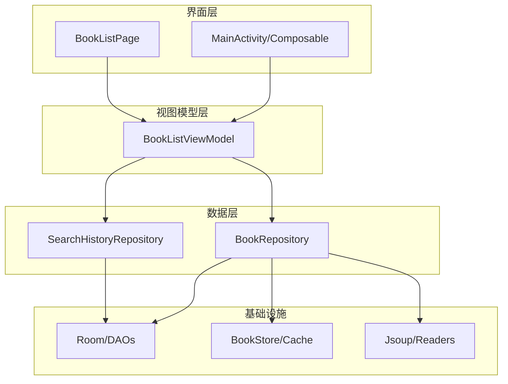

# 架构设计

<cite>
**本文引用的文件列表**   
- [lib_book_common/src/main/java/com/ebook/common/di/ContentStoreModule.kt](file://lib_book_common/src/main/java/com/ebook/common/di/ContentStoreModule.kt)
- [lib_book_common/src/main/java/com/ebook/common/di/SessionModule.kt](file://lib_book_common/src/main/java/com/ebook/common/di/SessionModule.kt)
- [lib_ebook_db/src/main/java/com/ebook/db/di/DatabaseModule.kt](file://lib_ebook_db/src/main/java/com/ebook/db/di/DatabaseModule.kt)
- [lib_book_common/src/main/java/com/ebook/common/repository/BookRepository.kt](file://lib_book_common/src/main/java/com/ebook/common/repository/BookRepository.kt)
- [module_main/src/main/java/com/ebook/main/MainActivity.kt](file://module_main/src/main/java/com/ebook/main/MainActivity.kt)
- [lib_ebook_db/src/main/java/com/ebook/db/AppDatabase.kt](file://lib_ebook_db/src/main/java/com/ebook/db/AppDatabase.kt)
- [lib_book_common/src/main/java/com/ebook/common/provider/ILoginProvider.kt](file://lib_book_common/src/main/java/com/ebook/common/provider/ILoginProvider.kt)
- [module_book/src/main/java/com/ebook/book/mvvm/viewmodel/BookListViewModel.kt](file://module_book/src/main/java/com/ebook/book/mvvm/viewmodel/BookListViewModel.kt)
- [module_find/src/main/java/com/ebook/find/repository/SearchHistoryRepository.kt](file://module_find/src/main/java/com/ebook/find/repository/SearchHistoryRepository.kt)
</cite>

## 目录
1. 引言
2. 项目结构
3. 核心组件
4. 架构总览
5. 关键组件详解
6. 依赖关系分析
7. 性能考量
8. 故障排查指南
9. 结论

## 引言
本仓库采用 MVVM 三层与多模块架构，通过 Hilt 进行依赖注入、TheRouter 进行跨模块通信、Room + 章文件 + 内存缓存组成多级数据源。响应式状态与事件统一使用 Flow（SharedFlow/StateFlow），以 BookRepository.bookShelfEvents 作为事件总线替代传统 EventBus。本文围绕 MVVM 职责分离、模块化解耦、Hilt 使用约定、跨模块 Provider 机制以及 Repository 模式的数据流展开，配合架构图说明不同层次开发者的关注点。

## 项目结构
项目遵循“业务模块 → lib_book_common → lib_ebook_api → lib_ebook_db”的分层依赖方向：
- 模块（module_*）：业务入口与页面组合，如书架、书城、我的、登录等。
- 共享库（lib_book_common）：通用领域能力、Provider 接口、章节解析与本地读取、会话管理、存储抽象。
- 网络层（lib_ebook_api）：Retrofit/OkHttp、拦截器、统一适配器与实体。
- 数据库层（lib_ebook_db）：Room 数据库与 DAO、迁移策略。

图表来源
- [module_main/src/main/java/com/ebook/main/MainActivity.kt:100-197](file://module_main/src/main/java/com/ebook/main/MainActivity.kt#L100-L197)
- [lib_book_common/src/main/java/com/ebook/common/provider/ILoginProvider.kt:1-20](file://lib_book_common/src/main/java/com/ebook/common/provider/ILoginProvider.kt#L1-L20)

章节来源
- [AGENTS.md](file://AGENTS.md)

## 核心组件
- Hilt 模块：内容存储装配（ContentStoreModule）、会话管理（SessionModule）、数据库装配（DatabaseModule）。
- Repository 层：BookRepository（书架、章节统一读取）、SearchHistoryRepository（搜索历史）。
- ViewModel 层：BookListViewModel（书架列表刷新、事件驱动）。
- UI/路由：MainActivity（宿主容器）、TheRouter 路由与 Provider。

章节来源
- [lib_book_common/src/main/java/com/ebook/common/di/ContentStoreModule.kt:21-87](file://lib_book_common/src/main/java/com/ebook/common/di/ContentStoreModule.kt#L21-L87)
- [lib_book_common/src/main/java/com/ebook/common/di/SessionModule.kt:13-37](file://lib_book_common/src/main/java/com/ebook/common/di/SessionModule.kt#L13-L37)
- [lib_ebook_db/src/main/java/com/ebook/db/di/DatabaseModule.kt:23-124](file://lib_ebook_db/src/main/java/com/ebook/db/di/DatabaseModule.kt#L23-L124)
- [lib_book_common/src/main/java/com/ebook/common/repository/BookRepository.kt:30-192](file://lib_book_common/src/main/java/com/ebook/common/repository/BookRepository.kt#L30-L192)
- [module_book/src/main/java/com/ebook/book/mvvm/viewmodel/BookListViewModel.kt:13-50](file://module_book/src/main/java/com/ebook/book/mvvm/viewmodel/BookListViewModel.kt#L13-L50)
- [module_main/src/main/java/com/ebook/main/MainActivity.kt:57-115](file://module_main/src/main/java/com/ebook/main/MainActivity.kt#L57-L115)

## 架构总览
MVVM 与 Repository 分层协同，ViewModel 仅持有状态与协调调用；Repository 统一封装数据源与事件流；UI 通过 Compose 消费 State/Flow。

图表来源
- [lib_book_common/src/main/java/com/ebook/common/repository/BookRepository.kt:68-192](file://lib_book_common/src/main/java/com/ebook/common/repository/BookRepository.kt#L68-L192)
- [lib_book_common/src/main/java/com/ebook/common/di/ContentStoreModule.kt:52-87](file://lib_book_common/src/main/java/com/ebook/common/di/ContentStoreModule.kt#L52-L87)

## 关键组件详解

### 1) MVVM 三层与职责分离
- View（Compose）：负责渲染与交互，不直接访问数据，通过 State/Flow 观察状态变化。
- ViewModel：继承 BaseRefreshViewModel/BaseViewModel，协调 Repository、收集事件、暴露 UI 状态。示例见书架列表 ViewModel 的事件驱动刷新：收集 BookRepository.bookShelfEvents，触发 refreshData()。
- Model（Repository）：实现 BaseModel 或业务仓库，封装 DB/Network/Cache 的读写及事件分发，对外暴露 suspend/Flow API。

图表来源
- [module_book/src/main/java/com/ebook/book/mvvm/viewmodel/BookListViewModel.kt:13-50](file://module_book/src/main/java/com/ebook/book/mvvm/viewmodel/BookListViewModel.kt#L13-L50)
- [lib_book_common/src/main/java/com/ebook/common/repository/BookRepository.kt:30-115](file://lib_book_common/src/main/java/com/ebook/common/repository/BookRepository.kt#L30-L115)
- [module_find/src/main/java/com/ebook/find/repository/SearchHistoryRepository.kt:11-42](file://module_find/src/main/java/com/ebook/find/repository/SearchHistoryRepository.kt#L11-L42)

章节来源
- [module_book/src/main/java/com/ebook/book/mvvm/viewmodel/BookListViewModel.kt:13-50](file://module_book/src/main/java/com/ebook/book/mvvm/viewmodel/BookListViewModel.kt#L13-L50)
- [lib_book_common/src/main/java/com/ebook/common/repository/BookRepository.kt:30-192](file://lib_book_common/src/main/java/com/ebook/common/repository/BookRepository.kt#L30-L192)
- [module_find/src/main/java/com/ebook/find/repository/SearchHistoryRepository.kt:11-42](file://module_find/src/main/java/com/ebook/find/repository/SearchHistoryRepository.kt#L11-L42)

### 2) Hilt 依赖注入
- @Module/@Provides/@InstallIn(SingletonComponent) 提供单例对象（数据库、DAO、存储、会话）。
- @Binds 将接口绑定到实现（UserSessionManager、TokenRefresher）。
- @HiltViewModel 注入 ViewModel。
- @AndroidEntryPoint 注解 Activity 启用注入。

图表来源
- [lib_book_common/src/main/java/com/ebook/common/di/ContentStoreModule.kt:27-87](file://lib_book_common/src/main/java/com/ebook/common/di/ContentStoreModule.kt#L27-L87)
- [lib_book_common/src/main/java/com/ebook/common/di/SessionModule.kt:22-37](file://lib_book_common/src/main/java/com/ebook/common/di/SessionModule.kt#L22-L37)
- [lib_ebook_db/src/main/java/com/ebook/db/di/DatabaseModule.kt:23-124](file://lib_ebook_db/src/main/java/com/ebook/db/di/DatabaseModule.kt#L23-L124)
- [module_main/src/main/java/com/ebook/main/MainActivity.kt:57-80](file://module_main/src/main/java/com/ebook/main/MainActivity.kt#L57-L80)

章节来源
- [lib_book_common/src/main/java/com/ebook/common/di/SessionModule.kt:13-37](file://lib_book_common/src/main/java/com/ebook/common/di/SessionModule.kt#L13-L37)
- [lib_book_common/src/main/java/com/ebook/common/di/ContentStoreModule.kt:21-87](file://lib_book_common/src/main/java/com/ebook/common/di/ContentStoreModule.kt#L21-L87)
- [lib_ebook_db/src/main/java/com/ebook/db/di/DatabaseModule.kt:23-124](file://lib_ebook_db/src/main/java/com/ebook/db/di/DatabaseModule.kt#L23-L124)
- [module_main/src/main/java/com/ebook/main/MainActivity.kt:57-115](file://module_main/src/main/java/com/ebook/main/MainActivity.kt#L57-L115)

### 3) TheRouter 跨模块通信与 Provider
- 跨模块 UI 与能力通过 Provider 接口暴露（如 ILoginProvider），由各模块实现并在运行时通过 TheRouter.get(Type) 获取。
- 路由跳转使用 TheRouter.build(path).navigation()，在 module_main 中为三个 Tab 容器动态组合各模块提供的 Composable 页面。
- 独立模式下若依赖未加入则取不到 Provider，需允许空处理。

图表来源
- [module_main/src/main/java/com/ebook/main/MainActivity.kt:175-194](file://module_main/src/main/java/com/ebook/main/MainActivity.kt#L175-L194)
- [lib_book_common/src/main/java/com/ebook/common/provider/ILoginProvider.kt:1-20](file://lib_book_common/src/main/java/com/ebook/common/provider/ILoginProvider.kt#L1-L20)

章节来源
- [module_main/src/main/java/com/ebook/main/MainActivity.kt:175-194](file://module_main/src/main/java/com/ebook/main/MainActivity.kt#L175-L194)
- [lib_book_common/src/main/java/com/ebook/common/provider/ILoginProvider.kt:1-20](file://lib_book_common/src/main/java/com/ebook/common/provider/ILoginProvider.kt#L1-L20)

### 4) Repository 模式与多级数据源
- Room 数据库：AppDatabase 声明实体与 DAO，提供书架/章节/搜索/下载/分组等数据访问点，版本迁移链集中维护。
- 文件系统/内存：BookStore 存放章节文件，ChapterContentCache 提供内存级段缓存；读入时先命中内存、再检查文件存在性、最后走 Reader 网络抓取。
- 网络：JsoupSourceReader/EpubSourceReader/TxtSourceReader 根据 BookFormat 路由解析；ChapterReader 接口抽象统一入口。

图表来源
- [lib_book_common/src/main/java/com/ebook/common/repository/BookRepository.kt:163-192](file://lib_book_common/src/main/java/com/ebook/common/repository/BookRepository.kt#L163-L192)
- [lib_book_common/src/main/java/com/ebook/common/di/ContentStoreModule.kt:52-87](file://lib_book_common/src/main/java/com/ebook/common/di/ContentStoreModule.kt#L52-L87)

章节来源
- [lib_ebook_db/src/main/java/com/ebook/db/AppDatabase.kt:8-64](file://lib_ebook_db/src/main/java/com/ebook/db/AppDatabase.kt#L8-L64)
- [lib_book_common/src/main/java/com/ebook/common/repository/BookRepository.kt:163-192](file://lib_book_common/src/main/java/com/ebook/common/repository/BookRepository.kt#L163-L192)
- [lib_book_common/src/main/java/com/ebook/common/di/ContentStoreModule.kt:52-87](file://lib_book_common/src/main/java/com/ebook/common/di/ContentStoreModule.kt#L52-L87)

### 5) 响应式编程与事件总线
- 使用 Flow/SharedFlow：BookRepository.bookShelfEvents 发布 Added/Removed/ProgressUpdated 事件，ViewModel 订阅驱动 UI 刷新，避免手动轮询。
- 状态通过 Compose state 暴露，ViewModel 汇总数据来源并保持幂等操作。

图表来源
- [lib_book_common/src/main/java/com/ebook/common/repository/BookRepository.kt:50-52](file://lib_book_common/src/main/java/com/ebook/common/repository/BookRepository.kt#L50-L52)
- [module_book/src/main/java/com/ebook/book/mvvm/viewmodel/BookListViewModel.kt:28-41](file://module_book/src/main/java/com/ebook/book/mvvm/viewmodel/BookListViewModel.kt#L28-L41)

章节来源
- [lib_book_common/src/main/java/com/ebook/common/repository/BookRepository.kt:50-52](file://lib_book_common/src/main/java/com/ebook/common/repository/BookRepository.kt#L50-L52)
- [module_book/src/main/java/com/ebook/book/mvvm/viewmodel/BookListViewModel.kt:28-41](file://module_book/src/main/java/com/ebook/book/mvvm/viewmodel/BookListViewModel.kt#L28-L41)

## 依赖关系分析
- 数据流向：UI → ViewModel → Repository → Room/Cache/File/Network。
- 模块耦合：功能模块仅依赖 lib_book_common 的 Provider/Repository 接口，避免直接依赖其它业务模块；跨模块通信走 TheRouter。
- DI 边界：数据库、DAO、网络客户端、存储均以 @Singleton 注入，确保全局唯一。

图表来源
- [module_main/src/main/java/com/ebook/main/MainActivity.kt:175-194](file://module_main/src/main/java/com/ebook/main/MainActivity.kt#L175-L194)
- [lib_book_common/src/main/java/com/ebook/common/repository/BookRepository.kt:68-192](file://lib_book_common/src/main/java/com/ebook/common/repository/BookRepository.kt#L68-L192)
- [lib_ebook_db/src/main/java/com/ebook/db/AppDatabase.kt:46-64](file://lib_ebook_db/src/main/java/com/ebook/db/AppDatabase.kt#L46-L64)

## 性能考量
- 数据层去重与增量更新：使用 Flow/SharedFlow 精确下发变更，避免全量刷新。
- 多级缓存：内存缓存优先，章文件次之，网络抓取兜底，减少重复请求与 IO。
- 线程切换：Repository 内 IO 操作统一在 Dispatchers.IO 执行，保证主线程不被阻塞。
- 数据库迁移：严格渐进式迁移链，禁止破坏式迁移，保证现有数据完整。
- 事件聚合：书架事件合并刷新，降低频繁重建导致的 UI 抖动。

[本节为通用指导，不引用具体源码]

## 故障排查指南
- 会话过期处理：主页容器监听 SessionEventBus，发生过期时清本地会话并跳转登录页，确保用户状态一致性。
- 数据为空问题：检查 ChapterReader 是否可按格式正确解析；确认 BookStore 是否存在章文件；查看 SharedFlow 是否漏收事件。
- 构建/路由失败：独立模式下若目标模块未编译进当前产物，TheRouter 可能找不到路由，仅记日志；需在测试宿主补齐占位路由。
- Room 迁移异常：出现 schema 不一致时，必须追加紧邻的迁移、生成新 schema JSON；严禁使用破坏性迁移。

章节来源
- [module_main/src/main/java/com/ebook/main/MainActivity.kt:68-80](file://module_main/src/main/java/com/ebook/main/MainActivity.kt#L68-L80)
- [lib_ebook_db/src/main/java/com/ebook/db/di/DatabaseModule.kt:27-89](file://lib_ebook_db/src/main/java/com/ebook/db/di/DatabaseModule.kt#L27-L89)

## 结论
本项目以清晰的 MVVM 分层与 Repository 抽象实现了高内聚低耦合的设计：ViewModel 专注状态编排，Repository 统一管理多种数据源，UI 通过 Compose + Flow 响应式呈现。Hilt 提供统一依赖装配与生命周期管理能力，TheRouter 实现了模块间松耦合的跨域协作。多层缓存与严格的数据库迁移策略保障了可用性与可演进性。后续扩展可按相同范式新增数据源或功能模块，只需扩展 Provider/Route 与 Module，保持架构一致性与团队协作效率。