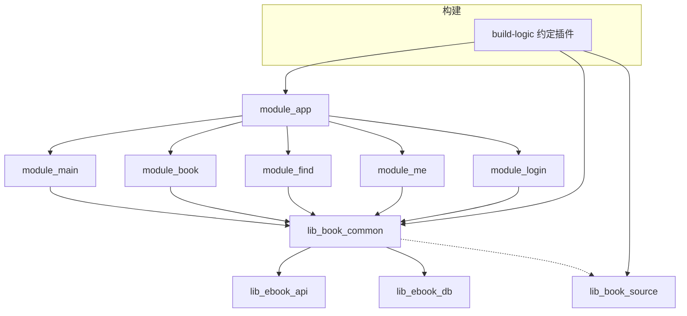
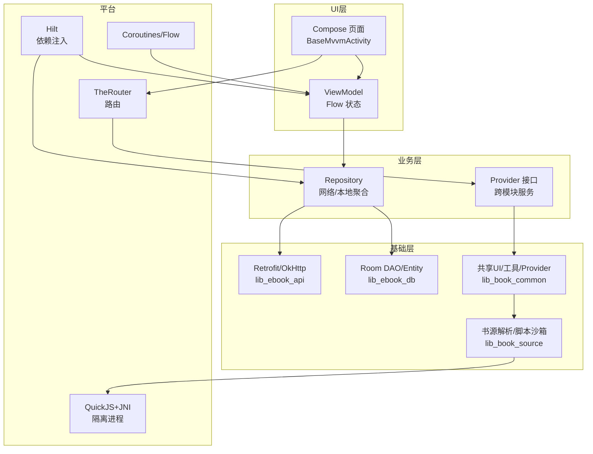
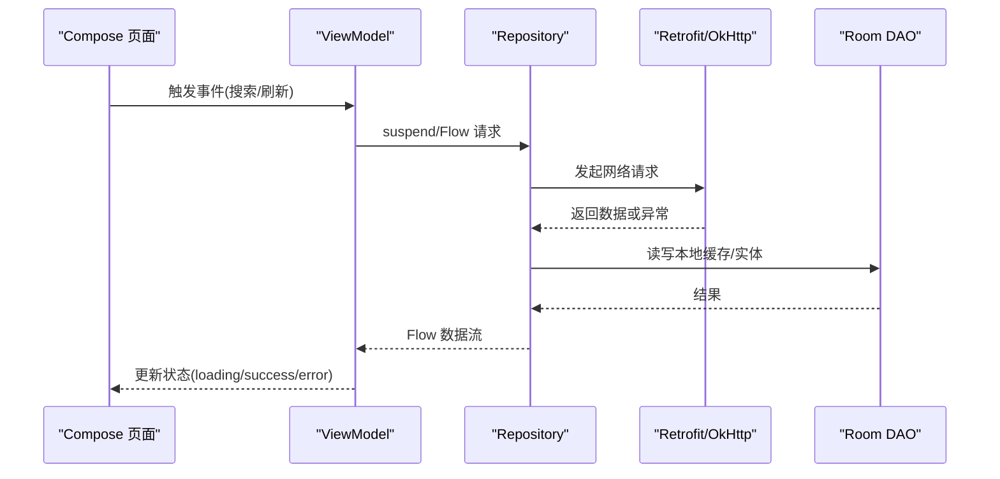
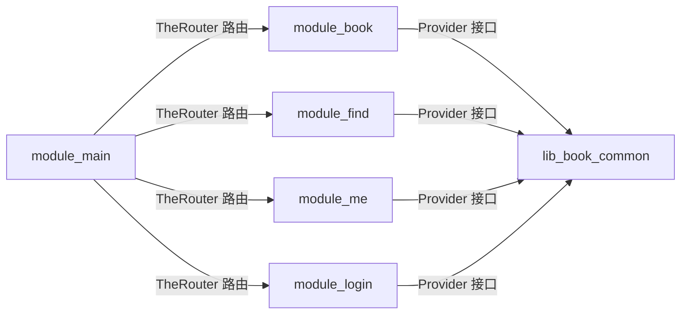
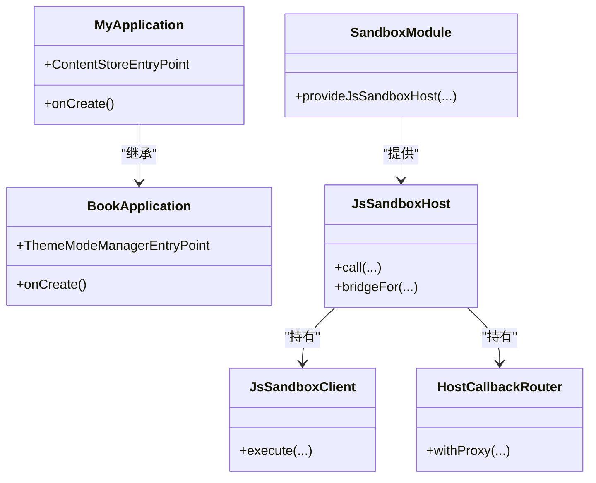
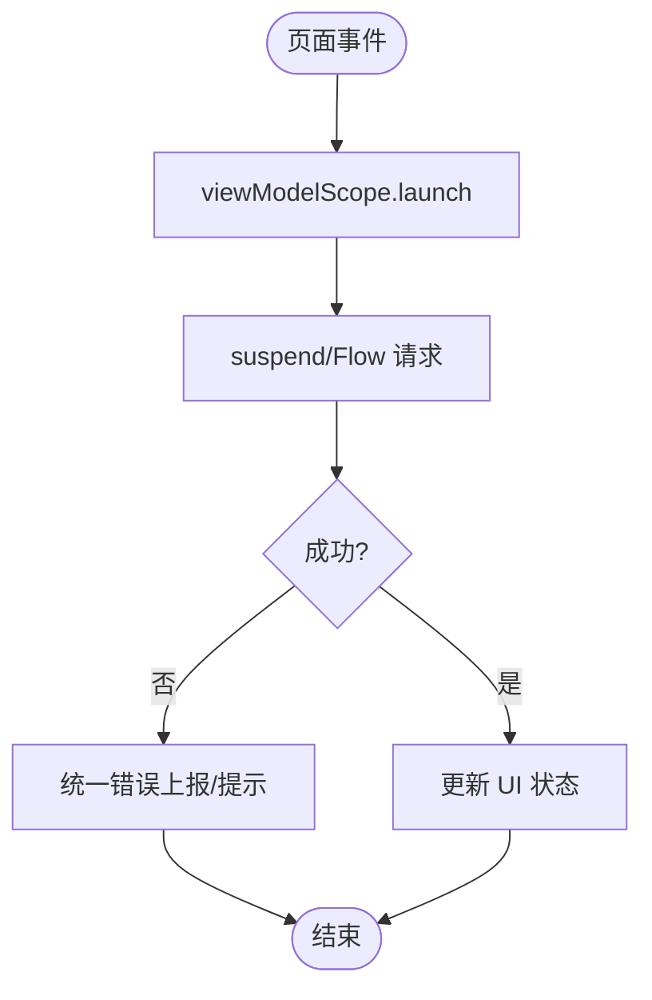
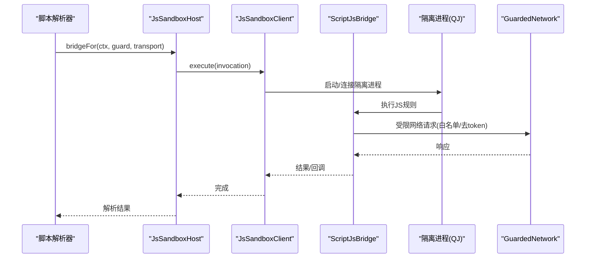
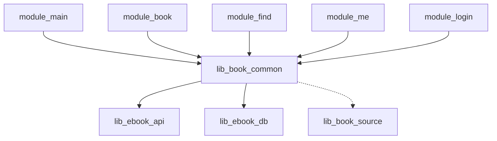

# 架构设计

<cite>
**本文引用的文件**
- [README.MD](file://README.MD)
- [settings.gradle.kts](file://settings.gradle.kts)
- [AGENTS.md](file://AGENTS.md)
- [MyApplication.kt](file://module_app/src/main/java/com/ebook/MyApplication.kt)
- [BookApplication.kt](file://lib_book_common/src/main/java/com/ebook/common/BookApplication.kt)
- [SandboxProcess.kt](file://lib_book_source/src/main/java/com/ebook/source/sandbox/SandboxProcess.kt)
- [JsSandboxHost.kt](file://lib_book_source/src/main/java/com/ebook/source/sandbox/JsSandboxHost.kt)
- [SandboxModule.kt](file://lib_book_common/src/main/java/com/ebook/common/di/SandboxModule.kt)
- [0028-untrusted-js-sandbox.adr](file://docs/adr/0028-untrusted-js-sandbox.md)
- [0029-script-book-source-import.adr](file://docs/adr/0029-script-book-source-import.md)
- [0001-compose-migration-endstate.adr](file://docs/adr/0001-compose-migration-endstate.md)
- [0004-rxbus-to-sharedflow.adr](file://docs/adr/0004-rxbus-to-sharedflow.md)
- [0015-common-lib-boundary.adr](file://docs/adr/0015-common-lib-boundary.md)
- [build.gradle.kts](file://module_app/build.gradle.kts)
- [AndroidComponentConventionPlugin.kt](file://build-logic/convention/src/main/kotlin/AndroidComponentConventionPlugin.kt)
</cite>

## 目录
1. [简介](#简介)
2. [项目结构](#项目结构)
3. [核心组件](#核心组件)
4. [架构总览](#架构总览)
5. [详细组件分析](#详细组件分析)
6. [依赖关系分析](#依赖关系分析)
7. [性能考量](#性能考量)
8. [故障排查指南](#故障排查指南)
9. [结论](#结论)
10. [附录](#附录)

## 简介
本项目为 Android 小说阅读器，采用 MVVM + 多模块架构，界面全面迁移至 Jetpack Compose；异步统一使用协程与 Flow；跨模块通过 TheRouter 路由与 Provider 接口通信；依赖注入由 Hilt 提供；书源解析支持原生与脚本模式，脚本执行在独立隔离进程内通过 QuickJS + JNI 沙箱安全运行。本文从系统边界、组件交互、数据流、MVVM 实现、模块化与跨模块通信、Hilt 使用模式、响应式编程、以及沙箱执行器等方面进行全面架构设计说明。

## 项目结构
仓库采用 Gradle 多模块组织：应用入口 module_app 组装功能模块（module_main/module_book/module_find/module_me/module_login），业务模块依赖共享库 lib_book_common，解析层 lib_book_source 提供书源解析与脚本沙箱，网络与实体定义在 lib_ebook_api，持久化在 lib_ebook_db。构建逻辑集中在 build-logic 约定插件中，统一工程配置与特性开关。

图示来源
- [settings.gradle.kts:55-65](file://settings.gradle.kts#L55-L65)
- [build-logic 约定插件](file://build-logic/convention/src/main/kotlin/AndroidComponentConventionPlugin.kt)

章节来源
- [README.MD:86-103](file://README.MD#L86-L103)
- [settings.gradle.kts:55-65](file://settings.gradle.kts#L55-L65)
- [AGENTS.md:模块架构](file://AGENTS.md)

## 核心组件
- 应用装配与主题：MyApplication 负责启动拦截与内容仓库对账；BookApplication 负责主题装配与沙箱进程门。
- 跨模块路由与服务：TheRouter + Provider 接口暴露页面与服务能力，解耦模块间直接依赖。
- 依赖注入：Hilt @HiltAndroidApp、@Singleton、@Inject、@HiltViewModel、EntryPointAccessors 用于按需获取重对象。
- 响应式与异步：协程 + Flow（SharedFlow）替代 RxJava；ViewModel 管理 UI 状态流。
- 书源解析与脚本沙箱：lib_book_source 提供原生与脚本解析，脚本执行在隔离进程，QuickJS + JNI 桥接，GuardedNetwork 白名单与限制。
- 构建与模块化：build-logic 约定插件统一 AGP/KSP/Hilt 配置，isModule 开关使模块可独立运行调试。

章节来源
- [MyApplication.kt:19-66](file://module_app/src/main/java/com/ebook/MyApplication.kt#L19-L66)
- [BookApplication.kt:17-64](file://lib_book_common/src/main/java/com/ebook/common/BookApplication.kt#L17-L64)
- [AGENTS.md:MVVM 架构约定/Hilt 注入模式](file://AGENTS.md)
- [AGENTS.md:响应式编程约定](file://AGENTS.md)
- [AGENTS.md:领域文档/脚本沙箱约定](file://AGENTS.md)

## 架构总览
整体遵循“业务模块 → 共享库 → 基础库”的单向依赖，跨模块通过 TheRouter 路由跳转与 Provider 接口调用服务；UI 层全部基于 Compose，ViewModel 持有状态并通过 Flow 暴露；数据层由 Repository 聚合网络与本地存储；脚本解析在独立进程执行，主进程仅承担编排与回调。

图示来源
- [AGENTS.md:MVVM 架构约定](file://AGENTS.md)
- [AGENTS.md:跨模块通信/Provider](file://AGENTS.md)
- [AGENTS.md:脚本沙箱约定](file://AGENTS.md)
- [README.MD:技术栈](file://README.MD#L105-L118)

## 详细组件分析

### MVVM 架构实现（Model-ViewModel-View）
- View：Compose 页面通过 BaseMvvmActivity/BaseMvvmRefreshActivity 统一 Toolbar、覆盖层与生命周期绑定；状态以 mutableStateOf 管理。
- ViewModel：继承 BaseViewModel/BaseRefreshViewModel，使用协程与 Flow 驱动 UI 状态；无 Model 门面时使用 NoOpModel 占位。
- Model/Repository：封装网络与本地访问，提供 suspend 函数与 Flow；跨模块能力通过 Provider 暴露。

图示来源
- [AGENTS.md:MVVM 架构约定](file://AGENTS.md)
- [AGENTS.md:响应式编程约定](file://AGENTS.md)

章节来源
- [AGENTS.md:MVVM 架构约定](file://AGENTS.md)

### 模块化架构与跨模块通信（TheRouter + Provider）
- 模块职责清晰：module_main/module_book/module_find/module_me/module_login 各自承载业务域，互不直接依赖。
- 路由：TheRouter 负责页面导航，每个模块注册路由表；独立模式下需占位路由避免静默失败。
- Provider：模块对外暴露服务接口（如跨模块页面组合、服务调用），由 TheRouter 创建并注入依赖；页面级 Hilt ViewModel 注入所需仓库。

图示来源
- [AGENTS.md:跨模块通信/Provider](file://AGENTS.md)
- [README.MD:项目结构](file://README.MD#L86-L103)

章节来源
- [AGENTS.md:跨模块通信/Provider](file://AGENTS.md)

### Hilt 依赖注入模式与最佳实践
- Application 标记 @HiltAndroidApp，全局组件生命周期由框架管理。
- 组件注入：@Singleton 单例、@Inject 构造函数注入、@HiltViewModel 注入 ViewModel。
- EntryPointAccessors：在 Application 或基类中按需获取重对象（如 ThemeModeManager、BookRepository），避免进程级 eager 注入导致沙箱进程崩溃。
- 模块装配：SandboxModule 提供 JsSandboxHost，按命名客户端区分不同信任域（source/release）。

图示来源
- [MyApplication.kt:19-66](file://module_app/src/main/java/com/ebook/MyApplication.kt#L19-L66)
- [BookApplication.kt:17-64](file://lib_book_common/src/main/java/com/ebook/common/BookApplication.kt#L17-L64)
- [SandboxModule.kt:18-56](file://lib_book_common/src/main/java/com/ebook/common/di/SandboxModule.kt#L18-L56)
- [JsSandboxHost.kt:21-60](file://lib_book_source/src/main/java/com/ebook/source/sandbox/JsSandboxHost.kt#L21-L60)

章节来源
- [AGENTS.md:Hilt 注入模式](file://AGENTS.md)
- [SandboxModule.kt:18-56](file://lib_book_common/src/main/java/com/ebook/common/di/SandboxModule.kt#L18-L56)

### 响应式编程与协程/Flow
- 统一使用协程与 Flow 进行异步数据处理；事件总线使用 SharedFlow 替代 RxBus。
- ViewModel 中通过 viewModelScope.launch 发起任务，将结果以 StateFlow 暴露给 Compose 订阅。
- 错误处理与重试策略在 Repository/ViewModel 层集中管理，UI 层只关注展示。

图示来源
- [AGENTS.md:响应式编程约定](file://AGENTS.md)
- [AGENTS.md:MVVM 架构约定](file://AGENTS.md)

章节来源
- [AGENTS.md:响应式编程约定](file://AGENTS.md)

### 跨模块通信机制（Provider 接口规范）
- 模块通过 Provider 接口暴露跨模块能力（页面组合、服务调用），避免直接依赖。
- 接口定义位于 lib_book_common，实现由各模块提供；TheRouter 负责创建实例并注入依赖。
- 独立模式下需在宿主模块提供占位实现，保证路由可解析且行为可预期。

章节来源
- [AGENTS.md:跨模块通信/Provider](file://AGENTS.md)
- [README.MD:项目结构](file://README.MD#L86-L103)

### 沙箱执行器架构（QuickJS + JNI 桥 + 安全隔离）
- 隔离进程：通过 android:isolatedProcess="true" 的进程运行脚本执行器，与主进程资源隔离。
- 进程门：BookApplication 与 MyApplication 在 onCreate 中使用 SandboxProcess.isInIsolatedProcess 判断是否跳过初始化，避免在无权限进程执行无效 IO。
- 主进程侧装配：JsSandboxHost 持有 JsSandboxClient 与 HostCallbackRouter，首次执行时才建立连接；通过 GuardedNetwork 限制脚本外呼域名与协议。
- 桥接与回调：ScriptJsBridge 将规则求值转换为 JS 调用，回调经 HostCallbackRouter 路由到当前任务代理，确保任务级上下文正确。
- 安全策略：白名单主机、禁止私网访问、超时与内存限制、禁止携带用户 token 等。

图示来源
- [SandboxProcess.kt:23-28](file://lib_book_source/src/main/java/com/ebook/source/sandbox/SandboxProcess.kt#L23-L28)
- [BookApplication.kt:17-49](file://lib_book_common/src/main/java/com/ebook/common/BookApplication.kt#L17-L49)
- [JsSandboxHost.kt:21-60](file://lib_book_source/src/main/java/com/ebook/source/sandbox/JsSandboxHost.kt#L21-L60)
- [AGENTS.md:脚本沙箱约定](file://AGENTS.md)

章节来源
- [AGENTS.md:脚本沙箱约定](file://AGENTS.md)
- [0028-untrusted-js-sandbox.adr](file://docs/adr/0028-untrusted-js-sandbox.md)
- [0029-script-book-source-import.adr](file://docs/adr/0029-script-book-source-import.md)

## 依赖关系分析
- 依赖方向严格单向：业务模块 → lib_book_common → lib_ebook_api / lib_ebook_db；lib_book_source 为解析专用层，被 lib_book_common 间接引用。
- 跨模块通信通过 TheRouter 与 Provider 接口，避免循环依赖。
- Hilt 在各模块内装配依赖，Application 级别统一初始化。
- 构建约定插件统一 AGP/KSP/Hilt 配置，isModule 开关控制模块独立运行。

图示来源
- [settings.gradle.kts:55-65](file://settings.gradle.kts#L55-L65)
- [AGENTS.md:模块架构](file://AGENTS.md)

章节来源
- [AGENTS.md:模块架构](file://AGENTS.md)
- [settings.gradle.kts:55-65](file://settings.gradle.kts#L55-L65)

## 性能考量
- 冷启动优化：沙箱连接延迟建立，仅在首次脚本执行时 bind；Hilt 按需注入重对象。
- 网络优化：使用 @Named("source") 纯净客户端避免携带用户 token；GuardedNetwork 限制无效请求。
- 数据库优化：Room 实体迁移链保证升级稳定；自然键与自增键策略减少冲突。
- UI 渲染：Compose 状态驱动减少冗余重建；翻页/滚屏模式统一分块链提升流畅度。
- 构建优化：KSP 替代 KAPT；约定插件统一配置减少重复编译。

## 故障排查指南
- 沙箱进程崩溃：检查 SandboxProcess 进程门是否在 Application 中正确使用；确认未在隔离进程中进行无效 IO。
- 路由失效：独立模式下确保占位路由存在；TheRouter 找不到路由仅记日志不报错。
- Hilt 注入问题：确认 @HiltAndroidApp、@Inject、@HiltViewModel 正确标注；EntryPointAccessors 使用场景符合约束。
- 网络异常：检查 GuardedNetwork 白名单与 @Named("source") 客户端配置；确认未误带用户 token。
- 数据库迁移：遵循 Room 迁移链，version +1 并追加紧邻迁移；禁止 fallbackToDestructiveMigration。

章节来源
- [AGENTS.md:脚本沙箱约定](file://AGENTS.md)
- [AGENTS.md:提交规范/构建约定](file://AGENTS.md)
- [BookApplication.kt:17-49](file://lib_book_common/src/main/java/com/ebook/common/BookApplication.kt#L17-L49)
- [MyApplication.kt:19-66](file://module_app/src/main/java/com/ebook/MyApplication.kt#L19-L66)

## 结论
本项目采用清晰的 MVVM + 多模块架构，结合 TheRouter 与 Provider 实现松耦合跨模块通信；Hilt 提供类型安全的依赖注入；协程与 Flow 统一异步模型；脚本解析在隔离进程中通过 QuickJS + JNI 安全执行。构建约定插件提升工程一致性，Mock/Real 双构建支持离线开发。整体设计兼顾可扩展性、安全性与可维护性，适合持续迭代与团队协作。

## 附录
- 技术选型权衡：
  - TheRouter 替代 ARouter：活跃维护与社区生态更优。
  - Coroutines/Flow 替代 RxJava：语言原生支持，学习成本低。
  - Room 替代 ObjectBox/greenDAO：官方支持，迁移成本低。
  - Compose 统一 UI：声明式 UI，状态驱动，易于测试与维护。
- 约束条件：
  - 禁止重新引入 RxJava。
  - 禁止在主线程调用沙箱。
  - 禁止在 Application 中 eager @Inject。
  - 必须遵循 Room 迁移链。
  - 脚本请求必须走 GuardedNetwork。