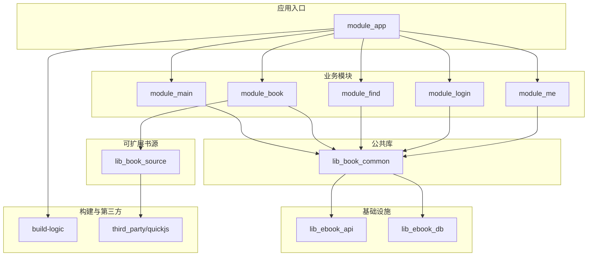
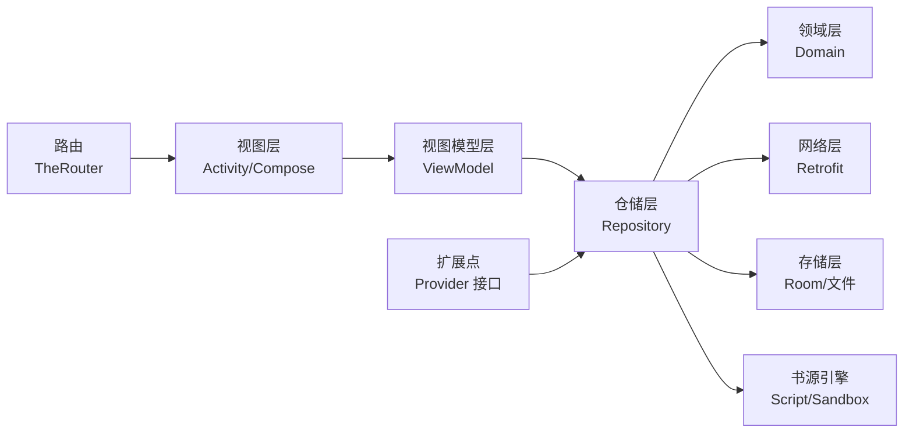
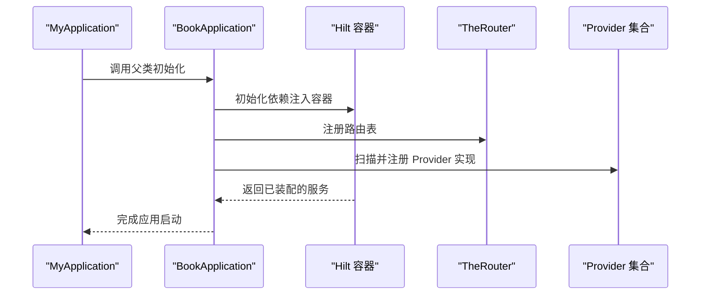
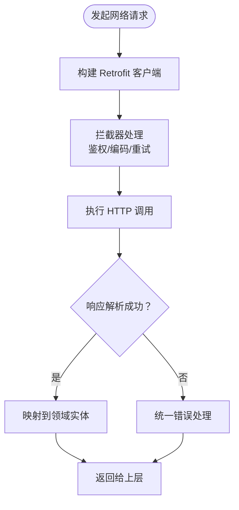
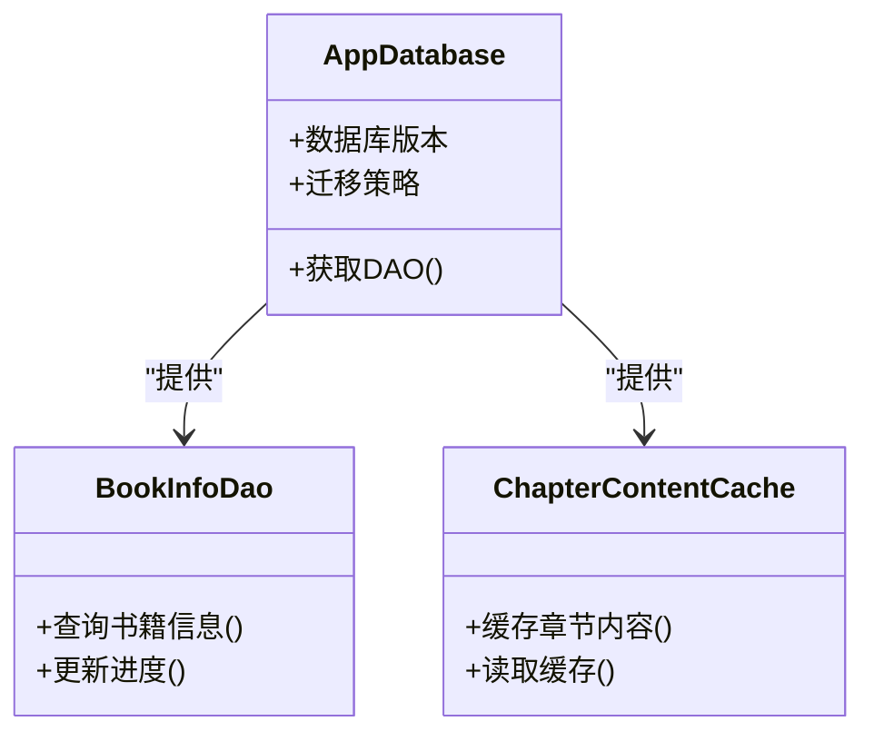
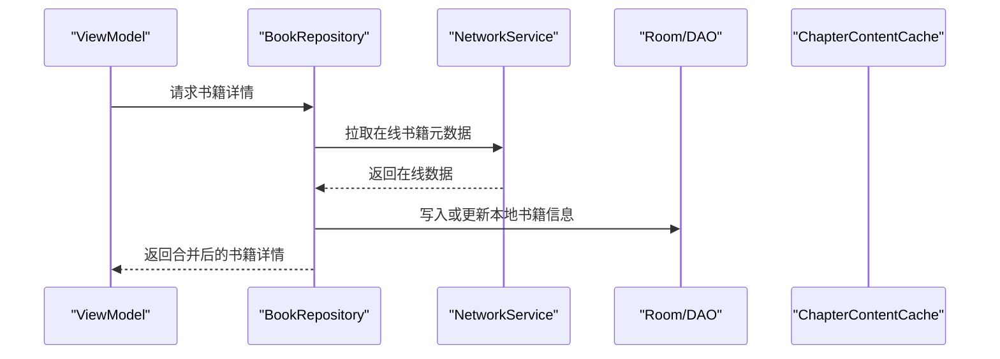
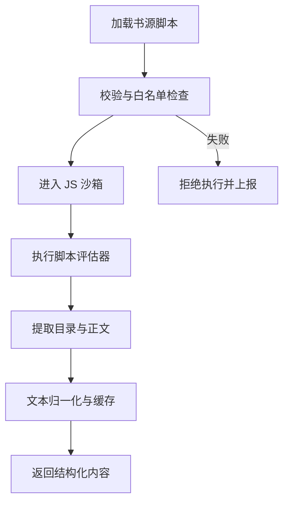
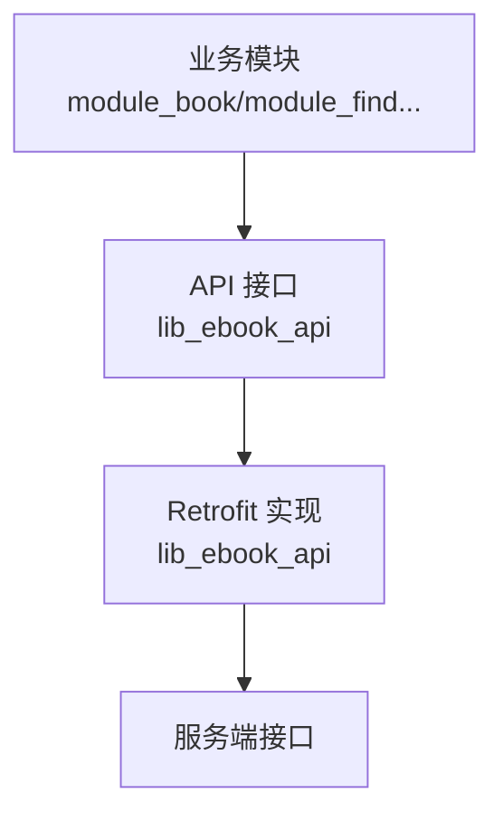
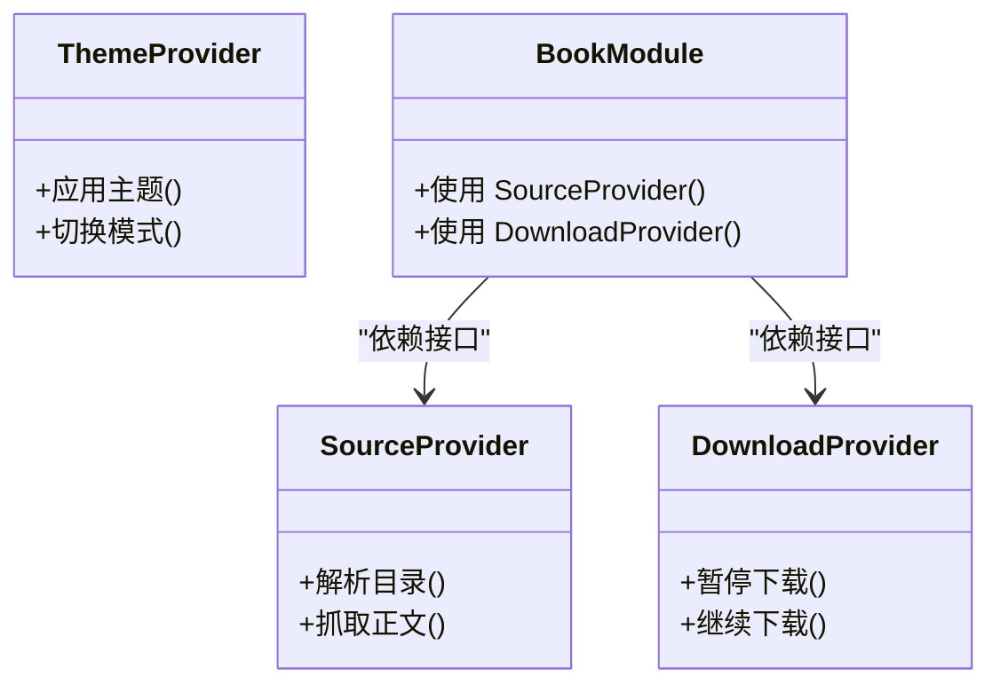
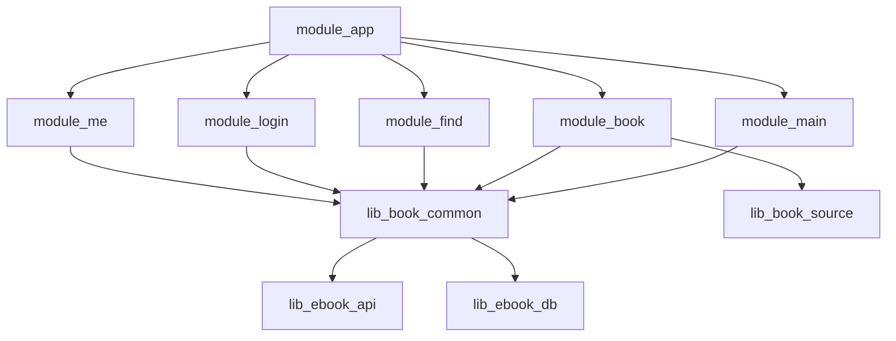

# 架构设计

<cite>
**本文引用的文件**
- [README.MD](file://README.MD)
- [settings.gradle.kts](file://settings.gradle.kts)
- [build.gradle.kts](file://build.gradle.kts)
- [BookApplication.kt](file://lib_book_common/src/main/java/com/ebook/common/BookApplication.kt)
- [MyApplication.kt](file://module_app/src/main/java/com/ebook/MyApplication.kt)
- [HiltConventionPlugin.kt](file://build-logic/build-logic/convention/src/main/kotlin/HiltConventionPlugin.kt)
- [RetrofitBuilder.kt](file://lib_ebook_api/src/main/java/com/ebook/api/RetrofitBuilder.kt)
- [AppDatabase.kt](file://lib_ebook_db/src/main/java/com/ebook/db/AppDatabase.kt)
- [BookRepositoryTest.kt](file://lib_book_common/src/test/java/com/ebook/common/repository/BookRepositoryTest.kt)
- [0028-untrusted-js-sandbox.md](file://docs/docs/adr/0028-untrusted-js-sandbox.md)
- [script-source-evaluator.md](file://docs/superpowers/plans/2026-09-08/script-source-evaluator.md)
- [js-sandbox-executor.md](file://docs/superpowers/plans/2026-09-09/js-sandbox-executor.md)
- [quickjs.h](file://third_party/third_party/quickjs/quickjs.h)
</cite>

## 目录
1. [引言](#引言)
2. [项目结构](#项目结构)
3. [核心组件](#核心组件)
4. [架构总览](#架构总览)
5. [详细组件分析](#详细组件分析)
6. [依赖分析](#依赖分析)
7. [性能考量](#性能考量)
8. [故障排查指南](#故障排查指南)
9. [结论](#结论)
10. [附录](#附录)

## 引言
本项目是一个面向 Android 的小说阅读器，采用 MVVM + 模块化 + Provider 接口解耦的总体架构。业务模块（书架、阅读、发现、登录、我的）通过统一的公共库与基础设施库协作；书源解析引擎以脚本插件形式运行在 JavaScript 沙箱中；网络层采用前后端分离的 Retrofit 封装；数据持久化基于 Room；依赖注入使用 Hilt；跨模块路由使用 TheRouter；模块间能力扩展通过 Provider 接口实现。该文档从系统上下文、模块关系、数据流、关键决策、性能与安全等角度进行分层说明，帮助不同经验水平的开发者快速理解与上手。

## 项目结构
仓库采用多模块 Gradle 工程：
- 应用入口模块 module_app 负责 Application 启动、构建变体与全局初始化。
- 业务功能模块包括 module_main、module_book、module_find、module_login、module_me，各自持有 Activity、ViewModel、页面与本地 UI 逻辑。
- 基础能力模块 lib_book_common 提供领域模型、仓储抽象、事件总线、Provider 接口、通用 UI 与工具。
- 基础设施模块 lib_ebook_api 暴露统一网络 API 与实体；lib_ebook_db 封装 Room 数据库、DAO 与迁移。
- 可扩展书源模块 lib_book_source 提供脚本解析器、JavaScript 沙箱执行环境与 QuickJS 原生桥接。
- build-logic 集中配置 AGP、Compose、Room、Hilt 等构建约定。
- third_party/third_party/quickjs 集成 QuickJS C 运行时，为 JS 沙箱提供高性能执行环境。
- docs 包含 ADR 与超能力计划，记录架构决策与设计演进。

```mermaid
graph TB
    subgraph "应用入口"
        APP["module_app"]
    end
    subgraph "业务模块"
        MAIN["module_main"]
        BOOK["module_book"]
        FIND["module_find"]
        LOGIN["module_login"]
        ME["module_me"]
    end
    subgraph "公共库"
        COMMON["lib_book_common"]
    end
    subgraph "基础设施"
        API["lib_ebook_api"]
        DB["lib_ebook_db"]
    end
    subgraph "可扩展书源"
        SOURCE["lib_book_source"]
    end
    subgraph "构建与第三方"
        BUILD["build-logic"]
        QJS["third_party/quickjs"]
    end

    APP --> MAIN
    APP --> BOOK
    APP --> FIND
    APP --> LOGIN
    APP --> ME
    MAIN --> COMMON
    BOOK --> COMMON
    FIND --> COMMON
    LOGIN --> COMMON
    ME --> COMMON
    COMMON --> API
    COMMON --> DB
    BOOK --> SOURCE
    SOURCE --> QJS
    APP --> BUILD
```

**图示来源**
- [settings.gradle.kts](file://settings.gradle.kts)
- [build.gradle.kts](file://build.gradle.kts)

**章节来源**
- [settings.gradle.kts](file://settings.gradle.kts)
- [build.gradle.kts](file://build.gradle.kts)
- [README.MD](file://README.MD)

## 核心组件
- 应用生命周期与初始化：
  - lib_book_common 中的 BookApplication 作为公共应用基类，完成依赖注入、路由注册与模块能力装配。
  - module_app 中的 MyApplication 继承并扩展应用初始化流程，承担真实环境下的网络模块、日志、埋点等装配。
- 网络层：
  - lib_ebook_api 提供 RetrofitBuilder 与统一的 Service 接口，将前端请求与后端服务解耦，便于测试与替换实现。
- 数据持久化：
  - lib_ebook_db 定义 AppDatabase、Entity、Dao 与迁移，提供稳定的本地存储契约。
- 领域与仓储：
  - lib_book_common 暴露领域模型、仓储接口与通用 UI 组件，供各业务模块消费。
- 书源解析引擎：
  - lib_book_source 提供脚本解析器、JS 沙箱执行器与 QuickJS 桥接，使书源以脚本插件方式动态加载。
- 依赖注入与构建约定：
  - build-logic 的 HiltConventionPlugin 为各模块统一启用 Hilt，减少样板配置。

**章节来源**
- [BookApplication.kt](file://lib_book_common/src/main/java/com/ebook/common/BookApplication.kt)
- [MyApplication.kt](file://module_app/src/main/java/com/ebook/MyApplication.kt)
- [RetrofitBuilder.kt](file://lib_ebook_api/src/main/java/com/ebook/api/RetrofitBuilder.kt)
- [AppDatabase.kt](file://lib_ebook_db/src/main/java/com/ebook/db/AppDatabase.kt)
- [HiltConventionPlugin.kt](file://build-logic/build-logic/convention/src/main/kotlin/HiltConventionPlugin.kt)

## 架构总览
整体遵循 MVVM 分层：
- View/Compose 层：各业务模块的 Activity 与 Compose 页面负责渲染与用户交互。
- ViewModel 层：管理页面状态、协调用例与仓储，发出可观察状态。
- Repository 层：聚合多个数据源（本地数据库、远程 API、缓存），对外暴露领域级接口。
- Domain 层：领域模型、规则与用例（位于 lib_book_common）。
- Infrastructure 层：网络、数据库、文件系统、沙箱执行器等。

跨模块通信：
- TheRouter 用于页面级跳转，避免直接耦合 Activity。
- Provider 接口用于能力扩展（如书源、主题、下载策略等），由具体模块实现并通过 DI 注册。
- SharedFlow / 事件总线用于跨组件状态同步。

```mermaid
graph LR
    VIEW["视图层<br/>Activity/Compose"] --> VM["视图模型层<br/>ViewModel"]
    VM --> REPO["仓储层<br/>Repository"]
    REPO --> DOMAIN["领域层<br/>Domain"]
    REPO --> NET["网络层<br/>Retrofit"]
    REPO --> STORE["存储层<br/>Room/文件"]
    REPO --> SRC["书源引擎<br/>Script/Sandbox"]
    ROUTE["路由<br/>TheRouter"] --> VIEW
    PROVIDER["扩展点<br/>Provider 接口"] --> REPO
```

[本图为概念性架构图，不直接映射具体源码文件]

## 详细组件分析

### 应用初始化与依赖注入
- BookApplication 负责公共能力初始化，包括依赖注入容器、路由、Provider 注册。
- MyApplication 在真实构建变体中注入网络模块与其他环境相关依赖。
- HiltConventionPlugin 在各模块统一启用 Hilt，保证依赖图一致性与可测试性。

```mermaid
sequenceDiagram
    participant App as "MyApplication"
    participant BaseApp as "BookApplication"
    participant DI as "Hilt 容器"
    participant Router as "TheRouter"
    participant Providers as "Provider 集合"

    App->>BaseApp: 调用父类初始化
    BaseApp->>DI: 初始化依赖注入容器
    BaseApp->>Router: 注册路由表
    BaseApp->>Providers: 扫描并注册 Provider 实现
    DI-->>BaseApp: 返回已装配的服务
    BaseApp-->>App: 完成应用启动
```

**图示来源**
- [BookApplication.kt](file://lib_book_common/src/main/java/com/ebook/common/BookApplication.kt)
- [MyApplication.kt](file://module_app/src/main/java/com/ebook/MyApplication.kt)
- [HiltConventionPlugin.kt](file://build-logic/build-logic/convention/src/main/kotlin/HiltConventionPlugin.kt)

**章节来源**
- [BookApplication.kt](file://lib_book_common/src/main/java/com/ebook/common/BookApplication.kt)
- [MyApplication.kt](file://module_app/src/main/java/com/ebook/MyApplication.kt)
- [HiltConventionPlugin.kt](file://build-logic/build-logic/convention/src/main/kotlin/HiltConventionPlugin.kt)

### 网络层：前后端分离的 Retrofit 封装
- RetrofitBuilder 负责创建 Retrofit 实例、拦截器链、序列化配置与错误处理。
- lib_ebook_api 定义统一的 Service 接口与实体类型，业务模块仅依赖接口而不关心实现细节。
- 支持测试替换：在 mock 变体中注入假网络实现，提高单元测试覆盖率。

```mermaid
flowchart TD
    Start(["发起网络请求"]) --> Build["构建 Retrofit 客户端"]
    Build --> Interceptor["拦截器处理<br/>鉴权/编码/重试"]
    Interceptor --> Call["执行 HTTP 调用"]
    Call --> Parse{"响应解析成功？"}
    Parse -->|是| Map["映射到领域实体"]
    Parse -->|否| HandleErr["统一错误处理"]
    Map --> Return["返回给上层"]
    HandleErr --> Return
```

**图示来源**
- [RetrofitBuilder.kt](file://lib_ebook_api/src/main/java/com/ebook/api/RetrofitBuilder.kt)

**章节来源**
- [RetrofitBuilder.kt](file://lib_ebook_api/src/main/java/com/ebook/api/RetrofitBuilder.kt)

### 数据持久化：Room 与迁移
- AppDatabase 定义数据库版本、DAO 与迁移策略，确保数据结构的向后兼容。
- Entity 与 Dao 分层清晰，Repository 聚合多种数据源并提供一致性接口。
- 测试覆盖 DAO 行为与迁移场景，保障数据安全。

```mermaid
classDiagram
    class AppDatabase {
        +数据库版本
        +迁移策略
        +获取DAO()
    }
    class BookInfoDao {
        +查询书籍信息()
        +更新进度()
    }
    class ChapterContentCache {
        +缓存章节内容()
        +读取缓存()
    }
    AppDatabase --> BookInfoDao : "提供"
    AppDatabase --> ChapterContentCache : "提供"
```

**图示来源**
- [AppDatabase.kt](file://lib_ebook_db/src/main/java/com/ebook/db/AppDatabase.kt)

**章节来源**
- [AppDatabase.kt](file://lib_ebook_db/src/main/java/com/ebook/db/AppDatabase.kt)

### 领域与仓储：用例驱动的数据访问
- Repository 将网络、本地存储与缓存组合成用例，对外暴露稳定接口。
- 单元测试覆盖切换书源、目录同步、增量追加、读取本地内容等边界场景。

```mermaid
sequenceDiagram
    participant VM as "ViewModel"
    participant Repo as "BookRepository"
    participant Net as "NetworkService"
    participant DB as "Room/DAO"
    participant Cache as "ChapterContentCache"

    VM->>Repo: 请求书籍详情
    Repo->>Net: 拉取在线书籍元数据
    Net-->>Repo: 返回在线数据
    Repo->>DB: 写入或更新本地书籍信息
    Repo-->>VM: 返回合并后的书籍详情
```

**图示来源**
- [BookRepositoryTest.kt](file://lib_book_common/src/test/java/com/ebook/common/repository/BookRepositoryTest.kt)

**章节来源**
- [BookRepositoryTest.kt](file://lib_book_common/src/test/java/com/ebook/common/repository/BookRepositoryTest.kt)

### 书源解析引擎：插件化与 JavaScript 沙箱
- 书源以脚本形式定义，通过脚本评估器与沙箱执行器运行，具备热插拔能力。
- 安全方面，ADR 明确“不受信任的 JS 沙箱”策略，限制危险 API 与资源访问。
- 性能上，QuickJS 提供轻量且高效的 JS 引擎，C 层桥接提升执行效率。

```mermaid
flowchart TD
    Load["加载书源脚本"] --> Validate["校验与白名单检查"]
    Validate --> Sandbox["进入 JS 沙箱"]
    Sandbox --> Evaluate["执行脚本评估器"]
    Evaluate --> Extract["提取目录与正文"]
    Extract --> Normalize["文本归一化与缓存"]
    Normalize --> Result["返回结构化内容"]
    Validate -->|失败| Reject["拒绝执行并上报"]
```

**图示来源**
- [0028-untrusted-js-sandbox.md](file://docs/docs/adr/0028-untrusted-js-sandbox.md)
- [script-source-evaluator.md](file://docs/superpowers/plans/2026-09-08/script-source-evaluator.md)
- [js-sandbox-executor.md](file://docs/superpowers/plans/2026-09-09/js-sandbox-executor.md)

**章节来源**
- [0028-untrusted-js-sandbox.md](file://docs/docs/adr/0028-untrusted-js-sandbox.md)
- [script-source-evaluator.md](file://docs/superpowers/plans/2026-09-08/script-source-evaluator.md)
- [js-sandbox-executor.md](file://docs/superpowers/plans/2026-09-09/js-sandbox-executor.md)

### 前后端分离的网络层设计
- 前端（业务模块）只依赖 lib_ebook_api 定义的 Service 接口与实体。
- 后端（Retrofit 实现）集中在 lib_ebook_api，便于统一拦截、错误处理与测试替换。
- 这种分离提升了可测试性与可维护性，同时降低业务模块对网络实现的耦合。

```mermaid
graph TB
    Frontend["业务模块<br/>module_book/module_find..."] --> API["API 接口<br/>lib_ebook_api"]
    API --> Impl["Retrofit 实现<br/>lib_ebook_api"]
    Impl --> Server["服务端接口"]
```

[本图为概念性架构图，不直接映射具体源码文件]

### Provider 接口与模块解耦
- Provider 接口作为扩展点，允许不同模块实现特定能力（如书源、主题、下载策略）。
- 模块通过 DI 注册 Provider 实现，其他模块仅依赖接口，从而降低耦合度。
- TheRouter 负责页面跳转，避免模块间的直接 Activity 引用。

```mermaid
classDiagram
    class SourceProvider {
        +解析目录()
        +抓取正文()
    }
    class ThemeProvider {
        +应用主题()
        +切换模式()
    }
    class DownloadProvider {
        +暂停下载()
        +继续下载()
    }
    class BookModule {
        +使用 SourceProvider()
        +使用 DownloadProvider()
    }
    BookModule --> SourceProvider : "依赖接口"
    BookModule --> DownloadProvider : "依赖接口"
```

[本图为概念性类图，不直接映射具体源码文件]

## 依赖分析
模块间依赖方向清晰：
- 业务模块依赖 lib_book_common 与 lib_ebook_api。
- lib_book_common 依赖 lib_ebook_api 与 lib_ebook_db。
- lib_book_source 独立于业务模块，被 book 模块按需引用。
- module_app 聚合所有模块并完成应用初始化。

```mermaid
graph TB
    APP["module_app"] --> MAIN["module_main"]
    APP --> BOOK["module_book"]
    APP --> FIND["module_find"]
    APP --> LOGIN["module_login"]
    APP --> ME["module_me"]
    MAIN --> COMMON["lib_book_common"]
    BOOK --> COMMON
    FIND --> COMMON
    LOGIN --> COMMON
    ME --> COMMON
    COMMON --> API["lib_ebook_api"]
    COMMON --> DB["lib_ebook_db"]
    BOOK --> SOURCE["lib_book_source"]
```

**图示来源**
- [settings.gradle.kts](file://settings.gradle.kts)
- [build.gradle.kts](file://build.gradle.kts)

**章节来源**
- [settings.gradle.kts](file://settings.gradle.kts)
- [build.gradle.kts](file://build.gradle.kts)

## 性能考量
- 脚本执行性能：
  - 使用 QuickJS 提供高效 JS 引擎，C 层桥接减少语言切换开销。
  - 沙箱隔离与白名单校验在执行前进行，避免无效脚本消耗资源。
- 网络与缓存：
  - Retrofit 拦截器统一处理编码与错误，减少重复逻辑。
  - 章节内容缓存与本地读取优化翻页体验。
- 数据库：
  - Room DAO 分层与事务控制保障读写性能与一致性。
- 构建与打包：
  - build-logic 统一配置减少样板代码，加快编译速度。

**章节来源**
- [quickjs.h](file://third_party/third_party/quickjs/quickjs.h)
- [RetrofitBuilder.kt](file://lib_ebook_api/src/main/java/com/ebook/api/RetrofitBuilder.kt)
- [AppDatabase.kt](file://lib_ebook_db/src/main/java/com/ebook/db/AppDatabase.kt)

## 故障排查指南
- 网络异常：
  - 检查 Retrofit 拦截器链是否正确注入，确认鉴权与编码拦截器生效。
  - 查看统一错误处理分支是否捕获并上报异常。
- 数据库迁移失败：
  - 核对 AppDatabase 的版本号与迁移脚本，确保与旧数据兼容。
  - 参考 DAO 测试用例验证迁移后数据的正确性。
- 书源脚本执行失败：
  - 确认脚本已通过白名单校验与沙箱限制。
  - 检查脚本评估器与沙箱执行器的日志输出，定位解析与提取问题。
- Provider 未注册：
  - 检查 Provider 实现是否在应用启动时被注册。
  - 确认 DI 容器中是否存在对应接口的实现绑定。

**章节来源**
- [RetrofitBuilder.kt](file://lib_ebook_api/src/main/java/com/ebook/api/RetrofitBuilder.kt)
- [AppDatabase.kt](file://lib_ebook_db/src/main/java/com/ebook/db/AppDatabase.kt)
- [0028-untrusted-js-sandbox.md](file://docs/docs/adr/0028-untrusted-js-sandbox.md)

## 结论
该项目通过 MVVM + 模块化 + Provider 接口解耦实现了高内聚、低耦合的架构。网络层前后端分离、数据层 Room 标准化、书源引擎脚本化与沙箱化，共同支撑了可扩展性与安全性。Hilt 与 build-logic 提升了可维护性与构建效率。未来可在以下方面持续优化：
- 进一步细化 Provider 接口规范，增强类型安全与版本兼容性。
- 引入更完善的监控与诊断机制，辅助定位性能瓶颈与异常路径。
- 持续完善 ADR 与设计文档，沉淀技术决策与最佳实践。

## 附录
- 架构决策记录（ADR）与超能力计划提供了关键设计动机与演进路线，建议新成员优先阅读相关文档，以理解当前架构的历史背景与权衡取舍。

**章节来源**
- [0028-untrusted-js-sandbox.md](file://docs/docs/adr/0028-untrusted-js-sandbox.md)
- [script-source-evaluator.md](file://docs/superpowers/plans/2026-09-08/script-source-evaluator.md)
- [js-sandbox-executor.md](file://docs/superpowers/plans/2026-09-09/js-sandbox-executor.md)