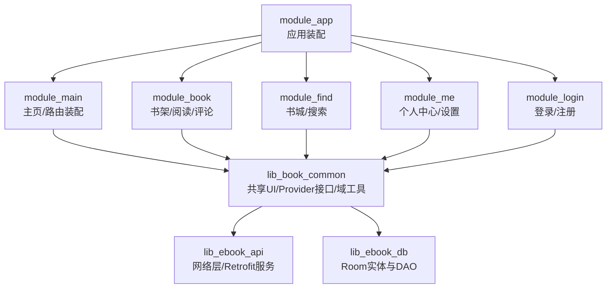
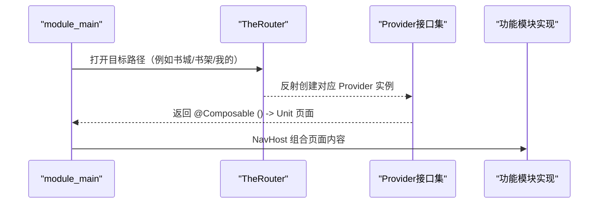
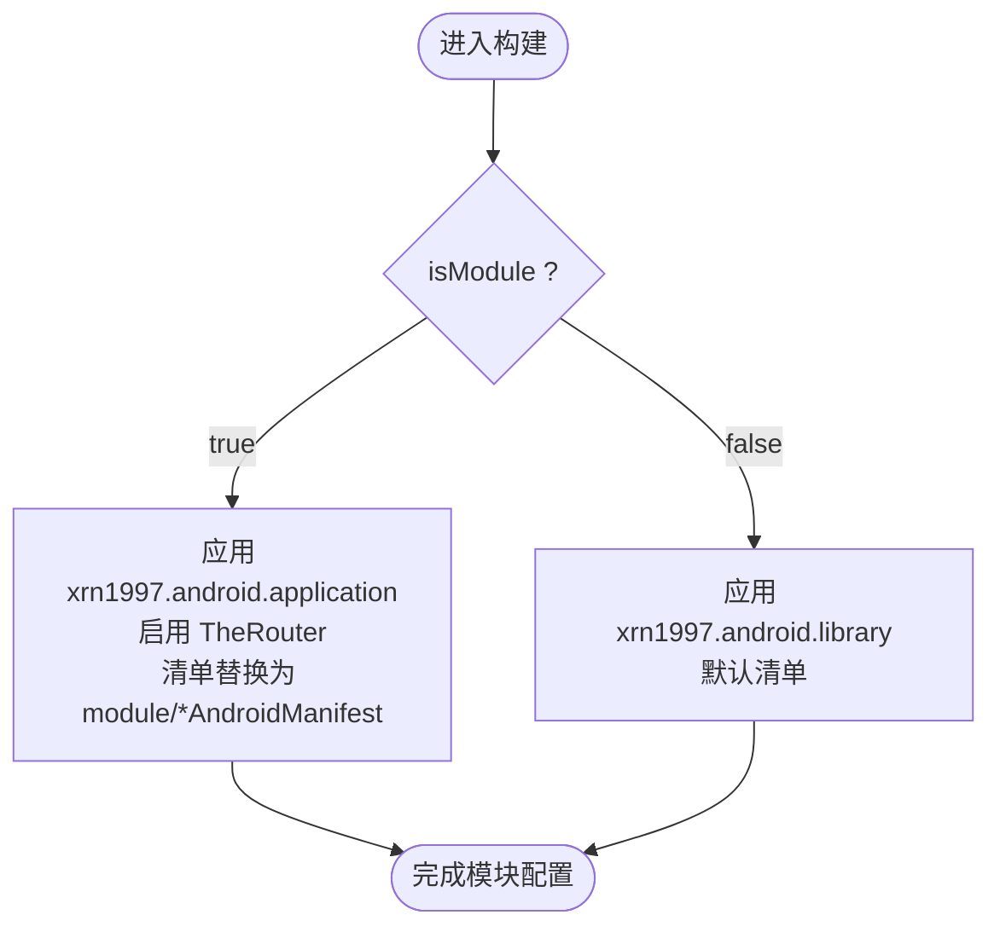
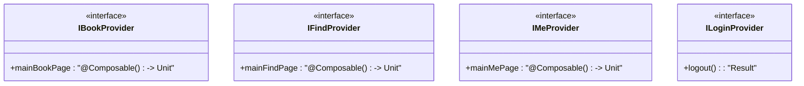
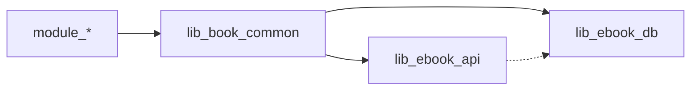
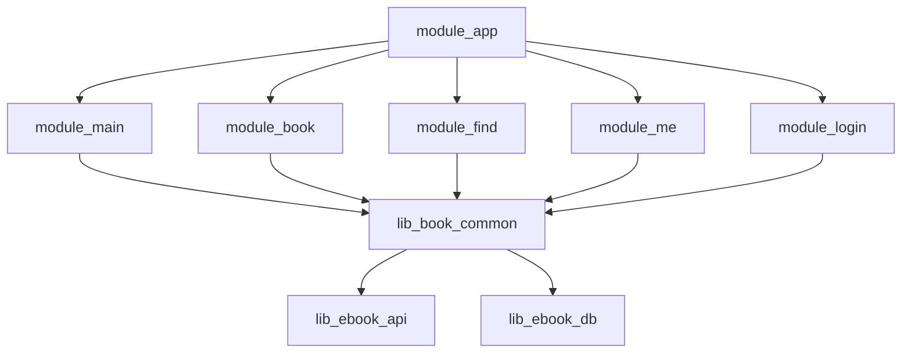
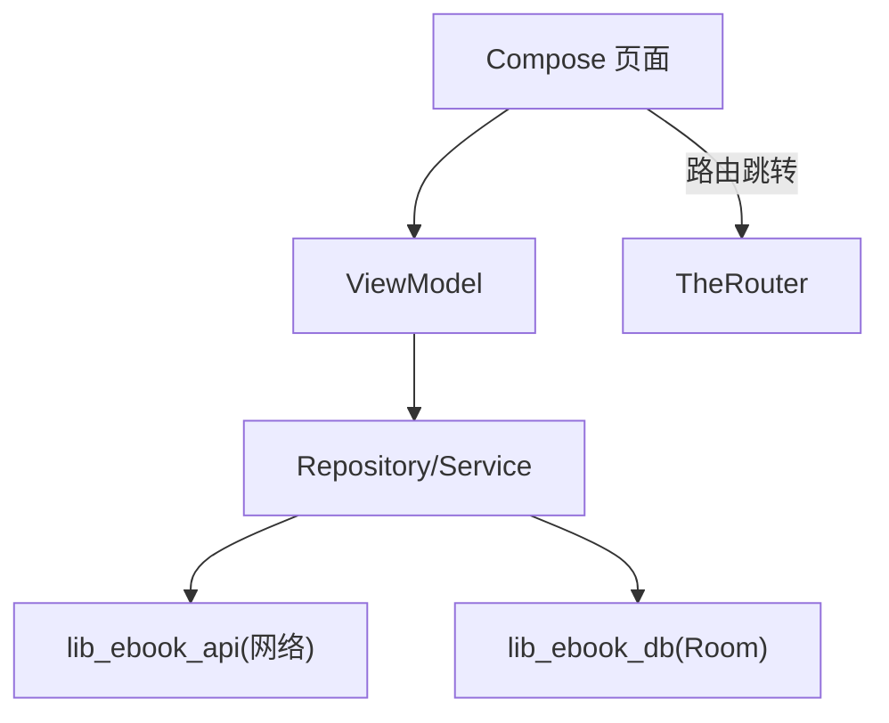

# 模块化架构

<cite>
**本文引用的文件**   
- [settings.gradle.kts](file://settings.gradle.kts)
- [根构建脚本 build.gradle.kts](file://build.gradle.kts)
- [module_app 构建脚本](file://module_app/build.gradle.kts)
- [lib_book_common 构建脚本](file://lib_book_common/build.gradle.kts)
- [lib_ebook_api 构建脚本](file://lib_ebook_api/build.gradle.kts)
- [lib_ebook_db 构建脚本](file://lib_ebook_db/build.gradle.kts)
- [Android 组件约定插件 AndroidComponentConventionPlugin.kt](file://build-logic/convention/src/main/kotlin/AndroidComponentConventionPlugin.kt)
- [约定插件注册 build-logic/convention/build.gradle.kts](file://build-logic/convention/build.gradle.kts)
- [IBookProvider.kt](file://lib_book_common/src/main/java/com/ebook/common/provider/IBookProvider.kt)
- [IFindProvider.kt](file://lib_book_common/src/main/java/com/ebook/common/provider/IFindProvider.kt)
- [ILoginProvider.kt](file://lib_book_common/src/main/java/com/ebook/common/provider/ILoginProvider.kt)
- [IMeProvider.kt](file://lib_book_common/src/main/java/com/ebook/common/provider/IMeProvider.kt)
</cite>

## 目录
1. [简介](#简介)
2. [项目结构](#项目结构)
3. [核心组件与模块职责](#核心组件与模块职责)
4. [架构总览](#架构总览)
5. [详细组件分析](#详细组件分析)
6. [依赖关系与数据流向分析](#依赖关系与数据流向分析)
7. [性能与构建特性](#性能与构建特性)
8. [故障排查指南](#故障排查指南)
9. [结论](#结论)

## 简介
本项目为基于 Android 的小说阅读器，采用多模块 Gradle 工程组织，业务侧通过 TheRouter 进行跨模块通信，以 Provider 接口暴露页面与服务能力；基础网络与数据库分别收敛在 lib_ebook_api 与 lib_ebook_db；通用 UI、领域共享与跨模块契约沉淀在 lib_book_common。构建系统统一由 build-logic 中的 xrn1997.android.* 约定插件提供，支持 isModule 开关下的「独立开发」与「集成构建」双模式。

## 项目结构
- 工程包含应用入口 module_app、功能模块 module_main/module_book/module_find/module_me/module_login 以及三个共享库 lib_book_common/lib_ebook_api/lib_ebook_db。
- 所有仓库坐标解析、依赖版本与插件 ID 集中于根设置与构建脚本，模块只负责自身职责声明。

**图表来源**
- [settings.gradle.kts:55-64](file://settings.gradle.kts#L55-L64)

**章节来源**
- [settings.gradle.kts:55-64](file://settings.gradle.kts#L55-L64)
- [根构建脚本 build.gradle.kts:1-15](file://build.gradle.kts#L1-L15)

## 核心组件与模块职责
- module_app：聚合产物与应用清单、Flavor（real/mock）与最小权限面；集成期引入全部功能模块以完成组装。
- module_main：作为 Tab/导航宿主组合各模块提供的 Compose 页面；通过 TheRouter 管理页面路由，使用 Provider 注入具体页。
- module_book：书架、阅读、评论与下载管理等书籍相关能力，对外暴露 BookProvider。
- module_find：书城浏览与搜索能力，对外暴露 FindProvider。
- module_me：个人中心、设置、版本检查等，对外暴露 MeProvider。
- module_login：登录/注册/密码管理，对外暴露 LoginProvider（服务端侧登出）。
- lib_book_common：跨模块契约（Provider 接口）、共享 UI 组件、领域模型、通用工具与事件总线等。
- lib_ebook_api：Retrofit API、OkHttp 拦截器、JSON/HTML 处理与服务端地址配置。
- lib_ebook_db：Room 实体与 DAO，供其他模块持久化访问。

依赖方向约束：功能模块 → lib_book_common → (lib_ebook_api, lib_ebook_db)。功能模块之间不互相直接依赖，通过 TheRouter + Provider 解耦。

**章节来源**
- [module_app/build.gradle.kts:47-57](file://module_app/build.gradle.kts#L47-L57)
- [lib_book_common/build.gradle.kts:34-69](file://lib_book_common/build.gradle.kts#L34-L69)
- [lib_ebook_api/build.gradle.kts:48-72](file://lib_ebook_api/build.gradle.kts#L48-L72)
- [lib_ebook_db/build.gradle.kts:38-52](file://lib_ebook_db/build.gradle.kts#L38-L52)

## 架构总览
TheRouter 承担模块间页面的“按需发现+加载”能力，Provider 将模块内的 Composable 页面或轻量服务以接口形式暴露到共享层，被宿主页主消费，实现“编译期无交叉引用、运行时动态装配”。构建层通过 xrn1997.android.component 插件根据 isModule 自动切换 application/library 形态与清单源，从而支撑单模块独立调试。

**图表来源**
- [IBookProvider.kt:5-13](file://lib_book_common/src/main/java/com/ebook/common/provider/IBookProvider.kt#L5-L13)
- [IFindProvider.kt:5-13](file://lib_book_common/src/main/java/com/ebook/common/provider/IFindProvider.kt#L5-L13)
- [IMeProvider.kt:5-13](file://lib_book_common/src/main/java/com/ebook/common/provider/IMeProvider.kt#L5-L13)
- [ILoginProvider.kt:3-19](file://lib_book_common/src/main/java/com/ebook/common/provider/ILoginProvider.kt#L3-L19)

**章节来源**
- [AndroidComponentConventionPlugin.kt:9-33](file://build-logic/convention/src/main/kotlin/AndroidComponentConventionPlugin.kt#L9-L33)
- [module_main/build.gradle.kts:43-56](file://module_main/build.gradle.kts#L43-L56)

## 详细组件分析

### 约定插件 xrn1997.android.* 与 isModule 双模式
- xrn1997.android.application / library / room / lint / compose 等约定插件在 build-logic 中统一注册并对外暴露唯一插件 ID，避免在各模块散落配置。
- AndroidComponentConventionPlugin 读取 gradle.properties 的 isModule：
  - isModule=true：按 Application 模式构建，启用 theRouter 注解处理器，并将清单指向 src/main/module/AndroidManifest.xml，同时把测试目录加入 Kotlin 源码集，以便独立运行与测试桩存在。
  - isModule=false：按 Library 模式构建，清单使用默认 src/main/AndroidManifest.xml。
- 此机制使每个业务模块既能独立调试，又能无缝集成到 module_app。

**图表来源**
- [AndroidComponentConventionPlugin.kt:9-33](file://build-logic/convention/src/main/kotlin/AndroidComponentConventionPlugin.kt#L9-L33)
- [约定插件注册 build-logic/convention/build.gradle.kts:40-74](file://build-logic/convention/build.gradle.kts#L40-L74)

**章节来源**
- [AndroidComponentConventionPlugin.kt:9-33](file://build-logic/convention/src/main/kotlin/AndroidComponentConventionPlugin.kt#L9-L33)
- [约定插件注册 build-logic/convention/build.gradle.kts:40-74](file://build-logic/convention/build.gradle.kts#L40-L74)
- [module_main/build.gradle.kts:43-56](file://module_main/build.gradle.kts#L43-L56)

### 跨模块 Provider 接口设计
- IBookProvider / IFindProvider / IMeProvider：暴露 Compose 页回调，便于 host 组合页面；实现位于各自业务模块。
- ILoginProvider：仅暴露服务端侧的登出能力，避免在共享层耦合会话细节；实现位于 module_login。
- 调用方在 module_main 或其他位置通过 TheRouter 获取 Provider 实例，再调用其方法，达到编译期零耦合。

**图表来源**
- [IBookProvider.kt:5-13](file://lib_book_common/src/main/java/com/ebook/common/provider/IBookProvider.kt#L5-L13)
- [IFindProvider.kt:5-13](file://lib_book_common/src/main/java/com/ebook/common/provider/IFindProvider.kt#L5-L13)
- [IMeProvider.kt:5-13](file://lib_book_common/src/main/java/com/ebook/common/provider/IMeProvider.kt#L5-L13)
- [ILoginProvider.kt:3-19](file://lib_book_common/src/main/java/com/ebook/common/provider/ILoginProvider.kt#L3-L19)

**章节来源**
- [IBookProvider.kt:5-13](file://lib_book_common/src/main/java/com/ebook/common/provider/IBookProvider.kt#L5-L13)
- [IFindProvider.kt:5-13](file://lib_book_common/src/main/java/com/ebook/common/provider/IFindProvider.kt#L5-L13)
- [IMeProvider.kt:5-13](file://lib_book_common/src/main/java/com/ebook/common/provider/IMeProvider.kt#L5-L13)
- [ILoginProvider.kt:3-19](file://lib_book_common/src/main/java/com/ebook/common/provider/ILoginProvider.kt#L3-L19)

### 模块依赖矩阵与解耦策略
- 解耦要点：
  - 模块依赖单向收敛于 lib_book_common，再向下依赖 lib_ebook_api 与 lib_ebook_db。
  - 模块之间不直接相互依赖，导航靠 TheRouter，服务暴露靠 Provider 接口。
  - Flavor 维度 network(real/mock) 在 module_app 控制网络栈，业务模块不感知真实后端或 mock。
- 结果：新增/替换业务模块对其它模块透明，仅需补充 Provider 实现与路由注册。

**图表来源**
- [lib_book_common/build.gradle.kts:34-69](file://lib_book_common/build.gradle.kts#L34-L69)
- [lib_ebook_api/build.gradle.kts:48-72](file://lib_ebook_api/build.gradle.kts#L48-L72)
- [lib_ebook_db/build.gradle.kts:38-52](file://lib_ebook_db/build.gradle.kts#L38-L52)

**章节来源**
- [settings.gradle.kts:55-64](file://settings.gradle.kts#L55-L64)
- [module_app/build.gradle.kts:47-57](file://module_app/build.gradle.kts#L47-L57)

## 依赖关系与数据流向分析

### 模块依赖图

**图表来源**
- [settings.gradle.kts:55-64](file://settings.gradle.kts#L55-L64)
- [module_app/build.gradle.kts:47-57](file://module_app/build.gradle.kts#L47-L57)
- [lib_book_common/build.gradle.kts:34-69](file://lib_book_common/build.gradle.kts#L34-L69)

### 数据流与分层
- 界面层：各模块 Compose 页面，通过 Provider 暴露给 module_main 组合。
- 视图模型：ViewModel 从 Repository 或本地状态获取数据，驱动页面状态更新。
- 数据源：lib_ebook_api 提供网络能力，lib_ebook_db 提供 Room 存取，二者被 lib_book_common 聚合后向外暴露统一接口。
- TheRouter：用于页面级跳转，不承载业务流程数据，降低业务复杂度。

**图表来源**
- [lib_book_common/build.gradle.kts:34-69](file://lib_book_common/build.gradle.kts#L34-L69)
- [lib_ebook_api/build.gradle.kts:48-72](file://lib_ebook_api/build.gradle.kts#L48-L72)
- [lib_ebook_db/build.gradle.kts:38-52](file://lib_ebook_db/build.gradle.kts#L38-L52)

**章节来源**
- [lib_book_common/build.gradle.kts:34-69](file://lib_book_common/build.gradle.kts#L34-L69)

## 性能与构建特性
- 构建时：
  - 根仓库集中配置插件与 Maven 镜像，提升同步稳定性。
  - 通过 version catalog 统一管理第三方依赖版本，减少重复与漂移风险。
  - 使用 built-in Kotlin（AGP 9），无需单独声明 KGP，缩短构建链。
- 运行期：
  - Compose 全栈替代传统 View，配合 Hilt 与 TheRouter，模块内聚、界面轻耦合。
  - Flavor real/mock 在不改动业务代码前提下切换数据源，提升调试效率。

[本节未直接分析具体文件]

## 故障排查指南
- isModule 误配：
  - 症状：模块独立构建异常或集成构建缺失功能。
  - 排查：确认 gradle.properties 中 isModule 与预期一致；独立运行时允许模块有独立的 Manifest。
- Provider 空实现：
  - 现象：路由存在但页面未渲染或功能不可用。
  - 排查：确保 TheRouter 已正确扫描 Provider 实现；独立模式下需在 debug/test source set 放置占位路由。
- 权限/前台服务异常：
  - 涉及下载等服务场景请先检查 manifest 声明及 runtime 权限授予情况。

[本节为通用排查指引，不包含具体文件片段]

## 结论
该项目以 lib_book_common 为契约与共享中心，通过 TheRouter + Provider 机制实现了模块间的强解耦；xrn1997.android.* 约定插件统一了构建配置，结合 isModule 开关兼顾了独立开发与整体集成；网络与持久化分别收敛于 lib_ebook_api 与 lib_ebook_db，形成清晰的分层与单向依赖链。该架构具备良好的可扩展性与可维护性，适合持续迭代与多人协作。