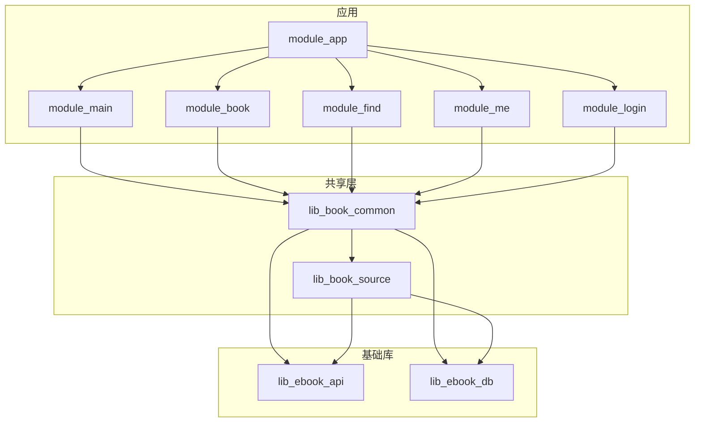
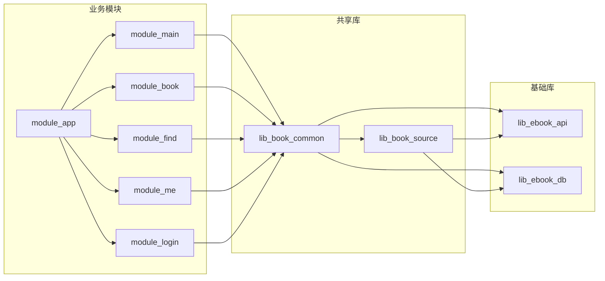
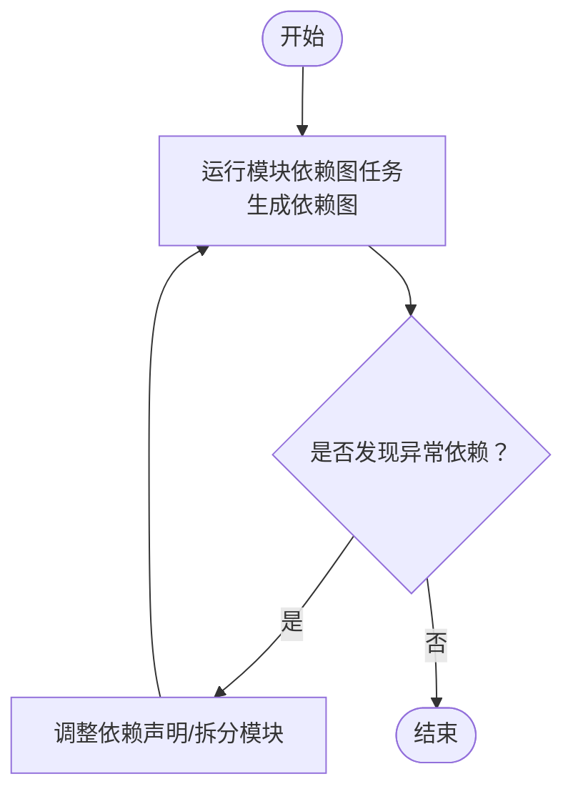

# 依赖分析与优化

<cite>
**本文引用的文件**   
- [settings.gradle.kts](file://settings.gradle.kts)
- [gradle/libs.versions.toml](file://gradle/libs.versions.toml)
- [build.gradle.kts](file://build.gradle.kts)
- [module_app/build.gradle.kts](file://module_app/build.gradle.kts)
- [lib_book_common/build.gradle.kts](file://lib_book_common/build.gradle.kts)
- [lib_book_source/build.gradle.kts](file://lib_book_source/build.gradle.kts)
- [lib_ebook_api/build.gradle.kts](file://lib_ebook_api/build.gradle.kts)
- [lib_ebook_db/build.gradle.kts](file://lib_ebook_db/build.gradle.kts)
- [module_main/build.gradle.kts](file://module_main/build.gradle.kts)
- [gradle.properties](file://gradle.properties)
</cite>

## 目录
1. [简介](#简介)
2. [项目结构与模块边界](#项目结构与模块边界)
3. [核心组件与依赖关系](#核心组件与依赖关系)
4. [架构总览](#架构总览)
5. [详细组件分析](#详细组件分析)
6. [依赖图生成与分析方法](#依赖图生成与分析方法)
7. [依赖深度、循环依赖与冗余识别](#依赖深度循环依赖与冗余识别)
8. [构建性能优化](#构建性能优化)
9. [APK 体积优化](#apk-体积优化)
10. [内存使用优化](#内存使用优化)
11. [优化工具与方法](#优化工具与方法)
12. [依赖审计（安全/合规/质量）](#依赖审计安全合规质量)
13. [结论](#结论)

## 简介
本文件围绕项目的多模块 Gradle 工程，提供一套完整的“依赖分析与优化”实践指南：从如何生成并解读依赖图，到识别深度依赖、循环依赖和冗余依赖；从增量编译、并行构建、缓存利用的构建优化，到 APK 体积与运行时内存优化；再到依赖审计（安全漏洞、许可证合规、依赖质量评估）。内容结合仓库现有配置与约定插件，给出可落地的步骤与检查清单。

## 项目结构与模块边界
- 根工程通过 settings 集中管理仓库源与模块声明，所有依赖版本由版本目录 libs.versions.toml 统一管理。
- 业务模块（module_app、module_main、module_book、module_find、module_me、module_login）依赖共享库 lib_book_common。
- 共享库 lib_book_common 对外暴露领域 UI、Provider 接口、通用工具，并以 api 方式透出 lib_book_source 以便上层仅依赖它即可编译通过。
- lib_book_source 为书源解析专用层（原生解析器 + 脚本解析器 + JS 沙箱执行器），依赖网络与数据库契约。
- lib_ebook_api 负责网络层（Retrofit、OkHttp、拦截器、实体）。
- lib_ebook_db 负责 Room 数据模型与 DAO。
- build-logic 提供统一约定插件，收敛 AGP/KSP/Hilt/Room/Compose/Native 等构建配置。

图表来源
- [settings.gradle.kts:56-65](file://settings.gradle.kts#L56-L65)
- [lib_book_common/build.gradle.kts:37-44](file://lib_book_common/build.gradle.kts#L37-L44)
- [lib_book_source/build.gradle.kts:33-41](file://lib_book_source/build.gradle.kts#L33-L41)
- [lib_ebook_api/build.gradle.kts:40-58](file://lib_ebook_api/build.gradle.kts#L40-L58)
- [lib_ebook_db/build.gradle.kts:29-34](file://lib_ebook_db/build.gradle.kts#L29-L34)

章节来源
- [settings.gradle.kts:1-65](file://settings.gradle.kts#L1-L65)
- [gradle/libs.versions.toml:1-237](file://gradle/libs.versions.toml#L1-L237)

## 核心组件与依赖关系
- 依赖方向约束：业务模块 → lib_book_common → lib_book_source → lib_ebook_api / lib_ebook_db（并列依赖）。lib_ebook_api 与 lib_ebook_db 之间不存在反向依赖。
- 公共依赖管理：
  - 版本集中：libs.versions.toml 中定义所有第三方库版本，模块内仅引用别名。
  - 仓库集中：settings 中启用依赖解析模式 FAIL_ON_PROJECT_REPOS，强制统一仓库源。
- 插件与特性：
  - 使用 module-graph 插件生成模块依赖图。
  - Hilt、KSP、Room、Compose、Native（QuickJS）等由约定插件统一接入。

章节来源
- [gradle/libs.versions.toml:75-237](file://gradle/libs.versions.toml#L75-L237)
- [build.gradle.kts:1-15](file://build.gradle.kts#L1-L15)
- [settings.gradle.kts:28-43](file://settings.gradle.kts#L28-L43)

## 架构总览
下图展示“模块—库—基础库”的分层以及关键依赖边，便于定位潜在瓶颈与优化点。

图表来源
- [module_app/build.gradle.kts:48-58](file://module_app/build.gradle.kts#L48-L58)
- [module_main/build.gradle.kts:49-59](file://module_main/build.gradle.kts#L49-L59)
- [lib_book_common/build.gradle.kts:37-44](file://lib_book_common/build.gradle.kts#L37-L44)
- [lib_book_source/build.gradle.kts:33-41](file://lib_book_source/build.gradle.kts#L33-L41)
- [lib_ebook_api/build.gradle.kts:40-58](file://lib_ebook_api/build.gradle.kts#L40-L58)
- [lib_ebook_db/build.gradle.kts:29-34](file://lib_ebook_db/build.gradle.kts#L29-L34)

## 详细组件分析
### module_app（应用入口）
- 职责：组装功能模块、设置 product flavor（real/mock）、开启 release 混淆。
- 依赖：实现依赖 lib_book_common，并在集成态依赖各功能模块。
- 优化要点：
  - 保持 isModule=false 提交态，避免空壳 App。
  - 混淆规则以 consumer-rules.pro 为主，mapping.txt 用于崩溃排查。

章节来源
- [module_app/build.gradle.kts:17-35](file://module_app/build.gradle.kts#L17-L35)
- [module_app/build.gradle.kts:48-64](file://module_app/build.gradle.kts#L48-L64)

### lib_book_common（共享库）
- 职责：统一 Compose UI、Provider 接口、通用工具；以 api 透出 lib_book_source 以简化上层依赖。
- 依赖：common（android-practice）、lib_ebook_api、lib_ebook_db、lib_book_source、AndroidX、Hilt、Router、Coil、Jsoup、Serialization、PermissionX。
- 优化要点：
  - 谨慎使用 api 传递依赖，避免下游被不必要地绑定版本。
  - KSP 注解处理器（Router、Hilt）集中启用，确保增量编译生效。

章节来源
- [lib_book_common/build.gradle.kts:3-9](file://lib_book_common/build.gradle.kts#L3-L9)
- [lib_book_common/build.gradle.kts:37-95](file://lib_book_common/build.gradle.kts#L37-L95)

### lib_book_source（书源解析层）
- 职责：原生解析器、脚本解析器、JS 沙箱执行器（QuickJS）。
- 依赖：lib_ebook_api、lib_ebook_db、jsoup（implementation）、common、kotlinx-serialization-json（implementation）。
- 优化要点：
  - 将 jsoup 等内部依赖声明为 implementation，避免污染下游类路径。
  - NDK ABI 在 debug 放宽 x86_64，release 最小集仅 arm64-v8a，减少包体。

章节来源
- [lib_book_source/build.gradle.kts:13-25](file://lib_book_source/build.gradle.kts#L13-L25)
- [lib_book_source/build.gradle.kts:33-51](file://lib_book_source/build.gradle.kts#L33-L51)

### lib_ebook_api（网络层）
- 职责：Retrofit、OkHttp、实体、拦截器。
- 依赖：AndroidX、Material、Annotations、Retrofit、OkHttp Logging、kotlinx-serialization-json（implementation）、Jsoup（api）、common（api）。
- 优化要点：
  - 将 JSON 解析库声明为 implementation，避免下游被绑定版本。
  - 通过 @Named("source") 与 @Named("release") 客户端隔离不同信任域请求。

章节来源
- [lib_ebook_api/build.gradle.kts:4-10](file://lib_ebook_api/build.gradle.kts#L4-L10)
- [lib_ebook_api/build.gradle.kts:40-64](file://lib_ebook_api/build.gradle.kts#L40-L64)

### lib_ebook_db（数据库层）
- 职责：Room 实体与 DAO，Bundled SQLite Driver。
- 依赖：AndroidX、sqlite-bundled（implementation）、JVM 变体用于单测。
- 优化要点：
  - 显式声明 sqlite-bundled 以避免传递依赖变化带来的风险。
  - 单元测试使用 Robolectric 与 JVM 版 native 驱动进行回归测试。

章节来源
- [lib_ebook_db/build.gradle.kts:29-51](file://lib_ebook_db/build.gradle.kts#L29-L51)

### module_main（主页/启动页）
- 职责：导航、启动流程、Compose 页面。
- 依赖：lib_book_common、AndroidX、Navigation Compose、Router、Hilt。
- 优化要点：
  - 独立态开启 R8 尽早暴露规则缺口；集成态关闭避免 library R8 剥离影响上游。

章节来源
- [module_main/build.gradle.kts:24-35](file://module_main/build.gradle.kts#L24-L35)
- [module_main/build.gradle.kts:49-62](file://module_main/build.gradle.kts#L49-L62)

## 依赖图生成与分析方法
- 使用 Gradle Module Graph 插件生成依赖图，可视化模块间依赖关系，辅助发现过深依赖链或异常边。
- 建议每次引入新依赖后，重新生成并比对差异，确保依赖边界清晰。

[此图为概念流程，不直接映射具体源码]

## 依赖深度、循环依赖与冗余识别
### 依赖深度分析
- 目标：限制最大依赖深度（例如业务模块不应直接依赖基础库之外的深层库）。
- 方法：
  - 通过模块图观察最长链路，必要时抽取中间层或重组依赖。
  - 对跨模块共用的重型依赖（如 Jsoup、序列化）尽量下沉至 lib_book_common 或 lib_ebook_api，避免每个业务模块重复引入。

### 循环依赖检测
- 目标：确保无环依赖（A→B→C→A）。
- 方法：
  - 模块图插件支持断言依赖关系，可在 CI 中失败阻断合并。
  - 若出现环，优先通过接口抽象、事件总线或 Provider 解耦。

### 冗余依赖识别
- 目标：移除未被使用的依赖，减少编译产物与运行时开销。
- 方法：
  - 使用 Android Studio 的 Analyze Dependencies 或外部工具扫描 unused dependencies。
  - 检查 implementation vs api 的使用：仅在公开 API 暴露时才用 api，否则用 implementation 缩小传递范围。
  - 关注版本冲突与重复传递依赖（如多个库携带相同 transitive dependency 的不同版本）。

章节来源
- [gradle/libs.versions.toml:75-237](file://gradle/libs.versions.toml#L75-L237)
- [settings.gradle.kts:28-43](file://settings.gradle.kts#L28-L43)

## 构建性能优化
### 增量编译
- 启用 KSP 增量编译与日志，提升注解处理速度。
- 合理划分模块，使小改动仅触发必要子树重编译。
- 避免不必要的 api 依赖扩大编译范围。

### 并行构建
- 启用 Gradle 并行构建与守护进程，提高吞吐。
- 在 CI 中按需并行化测试与构建任务。

### 缓存利用
- 使用 Gradle Build Cache，配合远程缓存（CI 环境）加速重复构建。
- 利用 AGP 缓存（包括资源与字节码），避免全量重建。

### 配置参考
- 已在 gradle.properties 中启用 KSP 增量与日志。
- 可通过 Gradle Daemon 与并行参数进一步调优。

章节来源
- [gradle.properties:16-20](file://gradle.properties#L16-L20)
- [gradle.properties:30-35](file://gradle.properties#L30-L35)

## APK 体积优化
### 代码混淆与压缩
- 应用层 release 开启混淆与 R8；功能模块独立态开启，集成态关闭以避免 library R8 剥离影响。
- 统一维护 consumer-rules.pro，随 AAR 传播；proguard-rules.pro 仅含 include 避免重复。

### 资源压缩
- 启用资源压缩（AGP 默认已优化），清理未使用资源与冗余图片。
- 按密度提供资源，避免重复大图。

### 无用依赖移除
- 将内部实现依赖声明为 implementation，减少下游传递。
- 定期审计 unused dependencies，移除未使用的库。

章节来源
- [module_app/build.gradle.kts:27-35](file://module_app/build.gradle.kts#L27-L35)
- [module_main/build.gradle.kts:24-35](file://module_main/build.gradle.kts#L24-L35)
- [lib_book_common/build.gradle.kts:37-95](file://lib_book_common/build.gradle.kts#L37-L95)
- [lib_book_source/build.gradle.kts:33-51](file://lib_book_source/build.gradle.kts#L33-L51)

## 内存使用优化
### 依赖注入的性能影响
- Hilt 注入本身开销较小，但应避免在 Application 中 eager 注入导致初始化膨胀。
- 需要时通过 EntryPointAccessors 延迟获取，降低冷启动压力。

### 内存泄漏防护
- 在调试阶段可启用 LeakCanary（当前注释掉），定位潜在泄漏。
- 避免长生命周期对象持有短生命周期上下文；正确使用 ViewModel 与协程作用域。
- 注意沙箱进程中的 Hilt 与进程门，避免主线程阻塞与错误装配。

章节来源
- [lib_book_common/build.gradle.kts:94-95](file://lib_book_common/build.gradle.kts#L94-L95)

## 优化工具与方法
### 构建分析
- 使用 Android Studio 的 Build Analyzer 分析构建耗时与瓶颈。
- 结合 Gradle Profile 查看任务级耗时。

### APK 分析
- 使用 APK Analyzer 分析包体构成，识别大依赖与大资源。
- 对比不同构建变体的差异，定位体积增长原因。

### 内存分析
- 使用 Memory Profiler 与 LeakCanary（调试）定位内存峰值与泄漏。
- 结合 GC 日志与 Heap Dump 分析对象生命周期。

### 依赖审计
- 使用依赖树查看传递依赖，消除重复与冲突。
- 引入安全扫描（如 Dependabot、Snyk）与许可证检查（License Gradle Plugin）纳入 CI。

[本节为通用指导，不直接映射具体源码]

## 依赖审计（安全/合规/质量）
### 安全漏洞扫描
- 在 CI 中集成安全扫描（Dependabot/Snyk），对已知漏洞告警并升级依赖。
- 关注第三方库的安全公告，及时更新版本。

### 许可证合规检查
- 使用 License Gradle Plugin 汇总依赖许可证，确保合规。
- 对开源依赖进行登记与审批，避免法律风险。

### 依赖质量评估
- 评估依赖活跃度、维护状态、文档完整性。
- 优先选择稳定、活跃、社区支持的库，避免冷门库带来维护成本。

[本节为通用指导，不直接映射具体源码]

## 结论
本项目采用清晰的多模块分层与统一的依赖管理策略，具备良好的可扩展性与可维护性。通过依赖图分析、深度与循环依赖检测、冗余依赖识别，以及构建性能、APK 体积、内存使用与依赖审计的系统化优化，可以持续提升构建效率与产品体验。建议在团队中建立“变更即验证”的流程：每次依赖变更均需生成依赖图、运行测试与构建分析，确保质量与性能双达标。