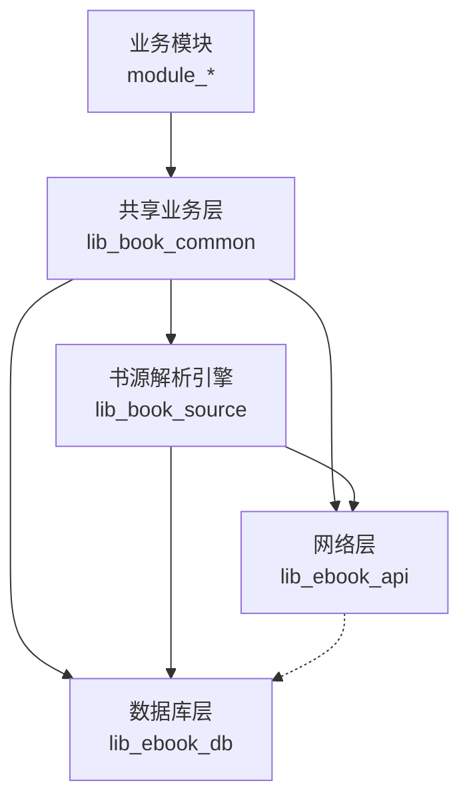
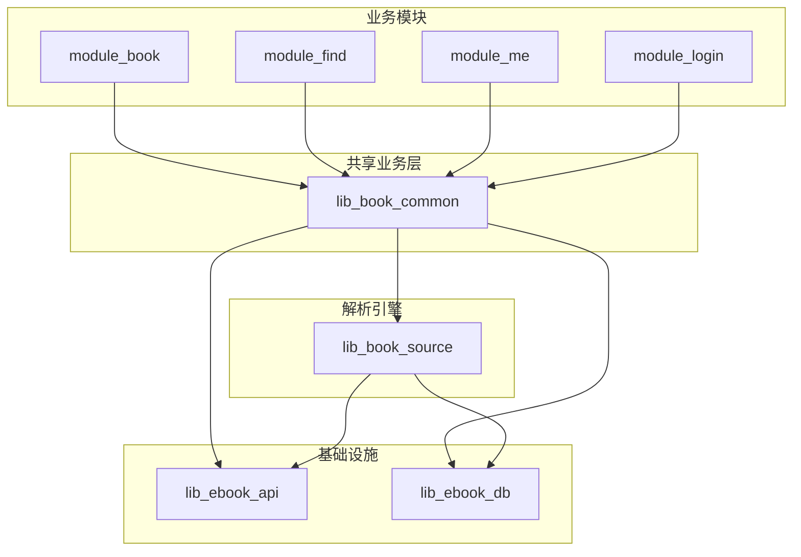
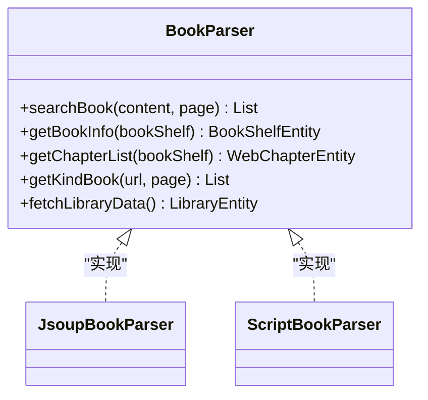
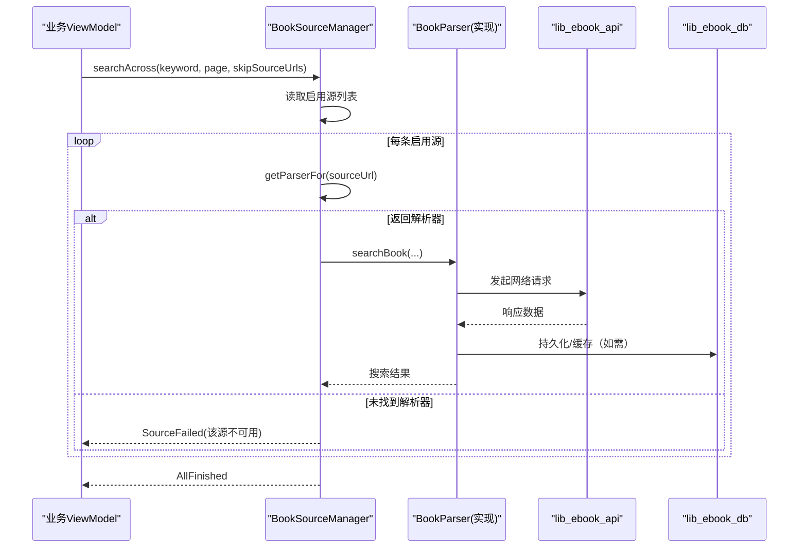
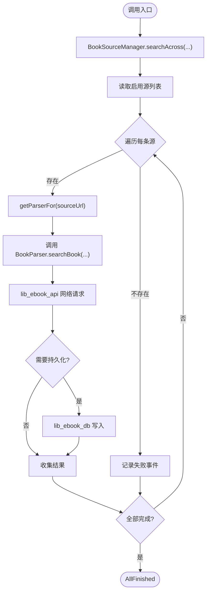
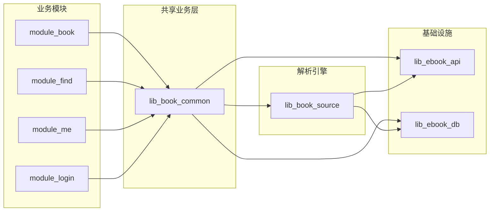

# 依赖层次设计

<cite>
**本文引用的文件**   
- [settings.gradle.kts](file://settings.gradle.kts)
- [lib_book_common/build.gradle.kts](file://lib_book_common/build.gradle.kts)
- [lib_book_source/build.gradle.kts](file://lib_book_source/build.gradle.kts)
- [lib_ebook_api/build.gradle.kts](file://lib_ebook_api/build.gradle.kts)
- [lib_ebook_db/build.gradle.kts](file://lib_ebook_db/build.gradle.kts)
- [module_book/build.gradle.kts](file://module_book/build.gradle.kts)
- [BookParser.kt](file://lib_book_source/src/main/java/com/ebook/source/analyze/BookParser.kt)
- [BookSourceManager.kt](file://lib_book_common/src/main/java/com/ebook/common/analyze/source/BookSourceManager.kt)
- [RetrofitBuilder.kt](file://lib_ebook_api/src/main/java/com/ebook/api/RetrofitBuilder.kt)
- [AppDatabase.kt](file://lib_ebook_db/src/main/java/com/ebook/db/AppDatabase.kt)
</cite>

## 目录
1. [引言](#引言)
2. [项目结构](#项目结构)
3. [核心组件](#核心组件)
4. [架构总览](#架构总览)
5. [详细组件分析](#详细组件分析)
6. [依赖关系分析](#依赖关系分析)
7. [性能与可维护性考虑](#性能与可维护性考虑)
8. [故障排查指南](#故障排查指南)
9. [结论](#结论)

## 引言
本文档面向本项目的四层依赖架构：业务模块（module_*）位于最上层，通过 lib_book_common 获取通用能力；lib_book_common 封装核心业务逻辑并向下依赖基础设施库；lib_book_source 作为书源解析引擎具备独立性与可插拔性，通过接口抽象与业务层解耦；lib_ebook_api 与 lib_ebook_db 作为基础设施层，分别承担网络请求封装与数据持久化抽象。文档将明确每层的职责边界、接口契约、扩展点与依赖方向，并通过图示与调用序列说明各层通信机制与约束。

## 项目结构
本项目采用多模块 Gradle 工程，顶层 settings 声明了根项目与各子模块的包含关系，从而形成稳定的模块装配面。关键模块如下：
- 业务模块：module_app、module_main、module_book、module_find、module_me、module_login
- 共享与基础库：lib_book_common、lib_book_source、lib_ebook_api、lib_ebook_db
- 构建约定：build-logic（统一插件）、gradle/libs.versions.toml（版本集中管理）

图表来源
- [settings.gradle.kts:55-65](file://settings.gradle.kts#L55-L65)

章节来源
- [settings.gradle.kts:55-65](file://settings.gradle.kts#L55-L65)

## 核心组件
- 业务模块（module_*）：承载 UI 与业务流程编排，依赖 lib_book_common 暴露的通用能力（UI 组件、Provider 接口、领域工具等），不直接耦合底层实现细节。
- 共享业务层（lib_book_common）：聚合领域通用能力与跨模块复用逻辑，向上为业务模块提供稳定 API，向下组合基础设施库（网络与数据库）。同时对外暴露 BookSourceManager 以屏蔽书源解析的具体实现。
- 书源解析引擎（lib_book_source）：提供 BookParser 接口及多种解析器实现（原生 Jsoup 解析器、脚本解析器等），支持按书绑定解析器，具备强可扩展性。
- 基础设施层
  - lib_ebook_api：Retrofit 服务定义、实体模型、拦截器与客户端配置，封装对后端的 HTTP 访问。
  - lib_ebook_db：Room 实体、DAO、迁移与数据库装配，负责本地持久化。

章节来源
- [lib_book_common/build.gradle.kts:37-90](file://lib_book_common/build.gradle.kts#L37-L90)
- [lib_book_source/build.gradle.kts:33-50](file://lib_book_source/build.gradle.kts#L33-L50)
- [lib_ebook_api/build.gradle.kts:40-64](file://lib_ebook_api/build.gradle.kts#L40-L64)
- [lib_ebook_db/build.gradle.kts:29-51](file://lib_ebook_db/build.gradle.kts#L29-L51)

## 架构总览
下图展示四层之间的依赖方向与通信要点：
- 依赖方向严格自上而下：业务模块 → 共享业务层 → 解析引擎 / 基础设施
- 解析引擎与基础设施并列依赖，避免业务层被具体网络或存储实现“污染”
- 通过接口抽象（BookParser、BookSourceManager）达成可插拔与解耦

图表来源
- [lib_book_common/build.gradle.kts:37-44](file://lib_book_common/build.gradle.kts#L37-L44)
- [lib_book_source/build.gradle.kts:33-36](file://lib_book_source/build.gradle.kts#L33-L36)

## 详细组件分析

### 业务模块（module_*）依赖 lib_book_common 的方式
- 依赖策略：业务模块仅依赖 lib_book_common，不直接依赖 lib_book_source、lib_ebook_api、lib_ebook_db，从而避免耦合到具体解析器与底层设施。
- 典型依赖：Hilt、Compose、Router、ViewModel 基类等通用能力由 lib_book_common 统一透出。
- 示例路径：[module_book/build.gradle.kts:58-64](file://module_book/build.gradle.kts#L58-L64)

章节来源
- [module_book/build.gradle.kts:58-64](file://module_book/build.gradle.kts#L58-L64)

### 共享业务层（lib_book_common）的职责与边界
- 职责：
  - 向上提供统一的业务入口（如 BookSourceManager），屏蔽解析器差异
  - 向下组合网络与数据库能力（api 依赖 lib_ebook_api、lib_ebook_db）
  - 提供跨模块复用的 UI 组件、工具类、领域模型与事件通道
- 依赖声明：同时 api 依赖解析引擎与两个基础设施库，确保业务模块只需依赖本层即可编译
- 示例路径：[lib_book_common/build.gradle.kts:37-44](file://lib_book_common/build.gradle.kts#L37-L44)

章节来源
- [lib_book_common/build.gradle.kts:37-44](file://lib_book_common/build.gradle.kts#L37-L44)

### 书源解析引擎（lib_book_source）的独立性与可插拔设计
- 接口抽象：BookParser 定义了搜索、详情、目录、分类、书库拉取等统一能力，所有解析器必须实现该接口
- 实现多样：JsoupBookParser（原生规则）、ScriptBookParser（脚本规则）等均可接入
- 惰性装载：脚本解析器的规则装载在首次求值时进行，避免冷启动开销与无谓失败
- 扩展点：新增解析器只需实现 BookParser 并注册到管理器，业务侧无需改动
- 示例路径：
  - 接口定义：[BookParser.kt:8-29](file://lib_book_source/src/main/java/com/ebook/source/analyze/BookParser.kt#L8-L29)
  - 模块依赖：[lib_book_source/build.gradle.kts:33-50](file://lib_book_source/build.gradle.kts#L33-L50)

图表来源
- [BookParser.kt:8-29](file://lib_book_source/src/main/java/com/ebook/source/analyze/BookParser.kt#L8-L29)

章节来源
- [BookParser.kt:8-29](file://lib_book_source/src/main/java/com/ebook/source/analyze/BookParser.kt#L8-L29)
- [lib_book_source/build.gradle.kts:33-50](file://lib_book_source/build.gradle.kts#L33-L50)

### 基础设施层职责边界
- lib_ebook_api（网络层）
  - 职责：Retrofit 服务定义、实体模型、拦截器、客户端配置（含编码、日志、认证白名单等）
  - 边界：不感知业务语义，只暴露干净的 HTTP 调用面；不同信任域使用不同客户端（如 source/release）
  - 示例路径：[lib_ebook_api/build.gradle.kts:40-64](file://lib_ebook_api/build.gradle.kts#L40-L64)、[RetrofitBuilder.kt](file://lib_ebook_api/src/main/java/com/ebook/api/RetrofitBuilder.kt)
- lib_ebook_db（数据库层）
  - 职责：Room 实体、DAO、迁移、数据库装配；主键策略与 upsert 规范遵循迁移链与并发冲突处理
  - 边界：仅提供数据存取抽象，不包含业务编排；schema 演进需配合迁移与生成 JSON
  - 示例路径：[lib_ebook_db/build.gradle.kts:29-51](file://lib_ebook_db/build.gradle.kts#L29-L51)、[AppDatabase.kt](file://lib_ebook_db/src/main/java/com/ebook/db/AppDatabase.kt)

章节来源
- [lib_ebook_api/build.gradle.kts:40-64](file://lib_ebook_api/build.gradle.kts#L40-L64)
- [lib_ebook_db/build.gradle.kts:29-51](file://lib_ebook_db/build.gradle.kts#L29-L51)

### 接口契约与扩展点（BookSourceManager）
- 角色：多书源共存清单的唯一入口，屏蔽 DAO 与解析器细节，向上提供统一查询与管理能力
- 关键契约：
  - getParserFor(sourceUrl)：按 URL 取解析器（带 LRU），null 表示不存在或坏行，脚本行永不 null 且惰性装载
  - searchAcross(keyword, page, skipSourceUrls)：并发聚合搜索，控制上限、错误收敛与流完成
  - observeDefaultSource() / observeSources()：默认源与清单的 Flow 订阅，区分格式与启用态
  - addSource/addScriptSource/removeSource/setEnabled/setDefaultSource：书源增删改查与默认源设置
- 示例路径：[BookSourceManager.kt:51-277](file://lib_book_common/src/main/java/com/ebook/common/analyze/source/BookSourceManager.kt#L51-L277)

图表来源
- [BookSourceManager.kt:114-155](file://lib_book_common/src/main/java/com/ebook/common/analyze/source/BookSourceManager.kt#L114-L155)
- [BookParser.kt:12-29](file://lib_book_source/src/main/java/com/ebook/source/analyze/BookParser.kt#L12-L29)

章节来源
- [BookSourceManager.kt:114-155](file://lib_book_common/src/main/java/com/ebook/common/analyze/source/BookSourceManager.kt#L114-L155)
- [BookParser.kt:12-29](file://lib_book_source/src/main/java/com/ebook/source/analyze/BookParser.kt#L12-L29)

### 数据流向与通信机制
- 业务模块通过 lib_book_common 的 BookSourceManager 发起搜索/详情/目录等请求
- 解析器根据书源类型选择实现，调用 lib_ebook_api 的网络层与 lib_ebook_db 的数据层
- 结果回传至业务模块，用于 UI 渲染或进一步编排
- 通信约束：
  - 解析器内部不应持有状态（分页游标、会话等）由调用方管理
  - 网络异常与资源不可用应在解析器内收敛为明确的空结果或类型化异常
  - 默认源与清单的 Flow 订阅保证响应式更新

图表来源
- [BookSourceManager.kt:114-155](file://lib_book_common/src/main/java/com/ebook/common/analyze/source/BookSourceManager.kt#L114-L155)
- [BookParser.kt:12-29](file://lib_book_source/src/main/java/com/ebook/source/analyze/BookParser.kt#L12-L29)

## 依赖关系分析
- 依赖方向图（代码级映射）

图表来源
- [lib_book_common/build.gradle.kts:37-44](file://lib_book_common/build.gradle.kts#L37-L44)
- [lib_book_source/build.gradle.kts:33-36](file://lib_book_source/build.gradle.kts#L33-L36)

- 耦合与内聚
  - 高内聚：各层职责清晰，解析器聚焦数据解析，网络层聚焦 HTTP，数据库层聚焦持久化
  - 低耦合：业务层不感知具体实现，通过接口与管理器间接依赖
  - 环依赖规避：lib_ebook_api 与 lib_ebook_db 之间无直接依赖（或极弱），解析引擎与基础设施并列依赖，避免循环

- 外部依赖与集成点
  - Retrofit/OkHttp（网络）
  - Room/SQLite（数据库）
  - QuickJS（脚本沙箱，仅在解析引擎中）
  - Hilt/Router（注入与路由，主要在业务与共享层）

章节来源
- [lib_book_common/build.gradle.kts:37-90](file://lib_book_common/build.gradle.kts#L37-L90)
- [lib_book_source/build.gradle.kts:33-69](file://lib_book_source/build.gradle.kts#L33-L69)
- [lib_ebook_api/build.gradle.kts:40-64](file://lib_ebook_api/build.gradle.kts#L40-L64)
- [lib_ebook_db/build.gradle.kts:29-51](file://lib_ebook_db/build.gradle.kts#L29-L51)

## 性能与可维护性考虑
- 解析器惰性装载：脚本解析器规则在首次求值时加载，减少冷启动开销
- 并发控制：聚合搜索限制并发上限，避免对第三方站点造成压力
- 缓存策略：书库数据解析纯网络，缓存策略集中在调用方（如 module_find），避免解析器持有状态
- 模块化隔离：基础设施层变更不影响业务模块；新增解析器无需修改业务代码
- 版本管理：通过 libs.versions.toml 统一管理依赖版本，降低升级成本

## 故障排查指南
- 常见问题定位
  - 书源解析失败：检查 BookParser 实现是否正确处理空结果与异常；确认 getParserFor 返回与规则装载时机
  - 网络请求异常：检查 lib_ebook_api 的客户端配置与拦截器；确认不同信任域的客户端是否正确使用
  - 数据库写入失败：检查 Room 迁移链与主键策略；确认 upsert 是否先查旧行回填主键
- 调试建议
  - 开启 OkHttp 日志观察请求与响应
  - 通过 Flow 订阅观察搜索过程的事件流（SourceFailed/SourceFinished/AllFinished）
  - 校验默认源与清单的 Flow 输出，确认 Room 事实源一致

章节来源
- [BookSourceManager.kt:114-155](file://lib_book_common/src/main/java/com/ebook/common/analyze/source/BookSourceManager.kt#L114-L155)
- [lib_ebook_api/build.gradle.kts:40-64](file://lib_ebook_api/build.gradle.kts#L40-L64)
- [lib_ebook_db/build.gradle.kts:29-51](file://lib_ebook_db/build.gradle.kts#L29-L51)

## 结论
本项目采用清晰的四层依赖架构：业务模块依赖共享业务层，后者再组合解析引擎与基础设施库。通过 BookParser 与 BookSourceManager 的接口抽象，实现了书源解析引擎的独立性与可插拔性，使业务层与底层实现解耦。lib_ebook_api 与 lib_ebook_db 作为基础设施层，分别承担网络与持久化的职责边界。依赖方向严格自上而下，避免了循环依赖与过度耦合，提升了系统的可维护性与扩展性。未来新增解析器或调整基础设施实现时，仅需关注对应层的接口契约与依赖声明，业务模块无需改动。