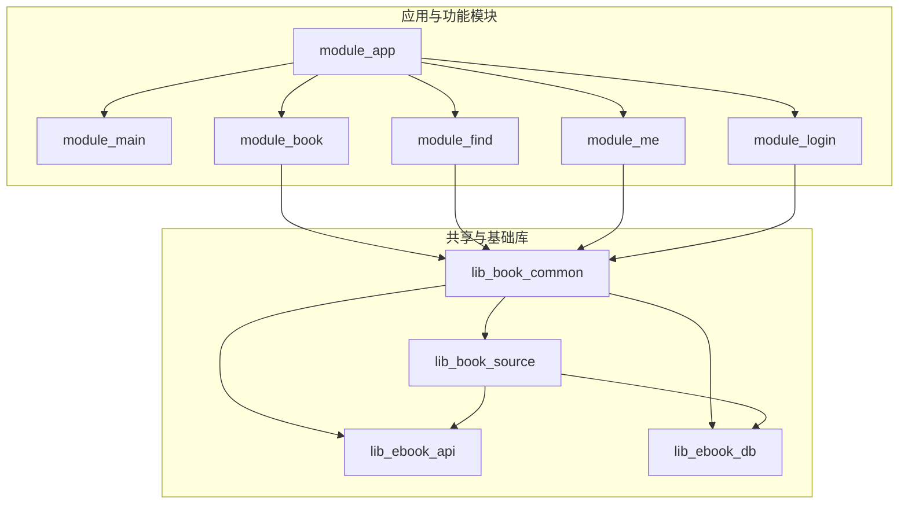
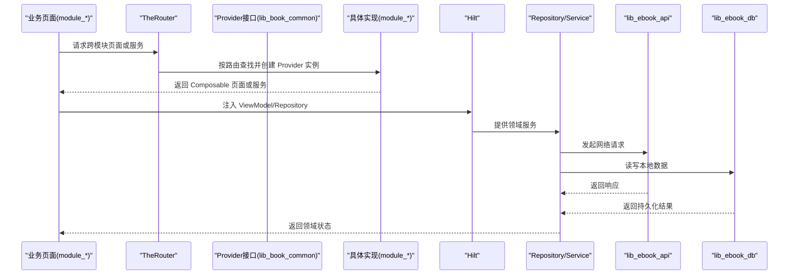
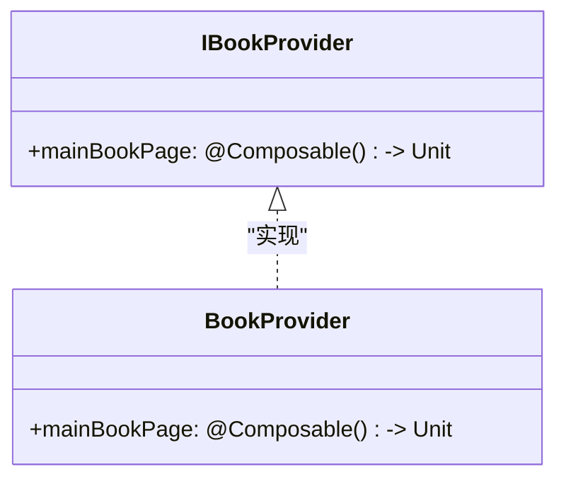
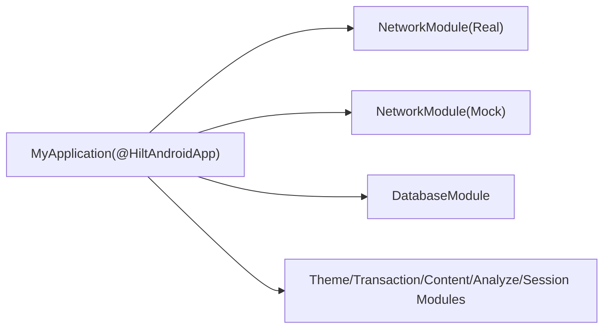
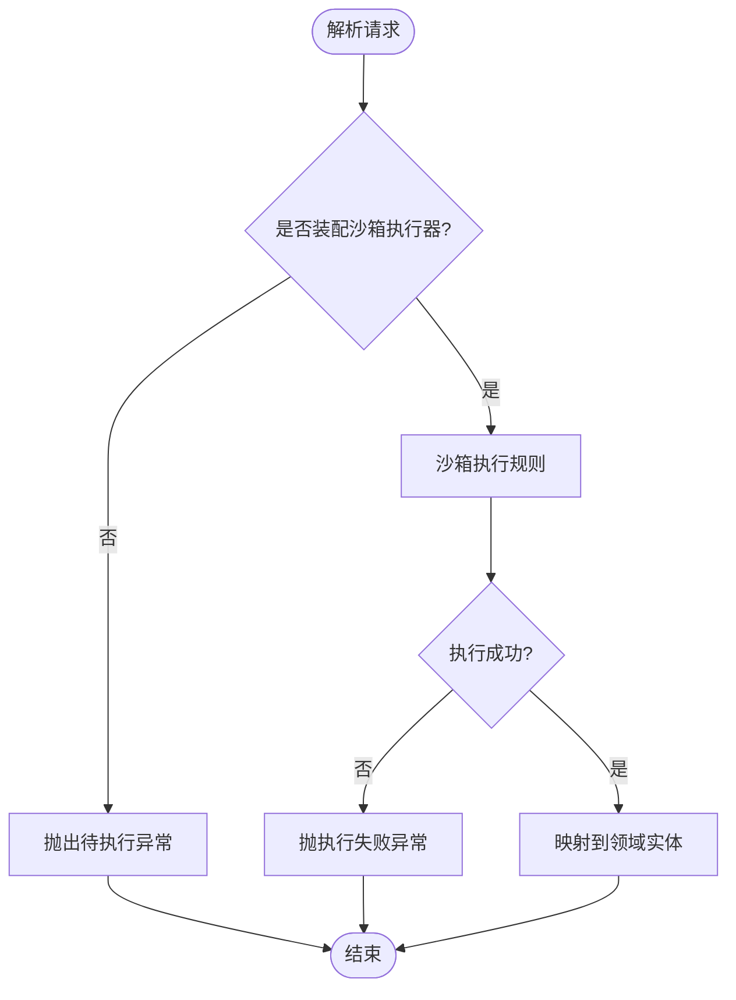
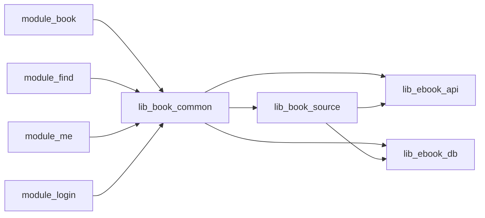

# 依赖管理与解耦策略

<cite>
**本文引用的文件**   
- [settings.gradle.kts](file://settings.gradle.kts)
- [lib_book_common/build.gradle.kts](file://lib_book_common/build.gradle.kts)
- [lib_book_source/build.gradle.kts](file://lib_book_source/build.gradle.kts)
- [lib_ebook_api/build.gradle.kts](file://lib_ebook_api/build.gradle.kts)
- [lib_ebook_db/build.gradle.kts](file://lib_ebook_db/build.gradle.kts)
- [gradle/libs.versions.toml](file://gradle/libs.versions.toml)
- [IBookProvider.kt](file://lib_book_common/src/main/java/com/ebook/common/provider/IBookProvider.kt)
- [BookProvider.kt](file://module_book/src/main/java/com/ebook/book/provider/BookProvider.kt)
- [MyApplication.kt](file://module_app/src/main/java/com/ebook/MyApplication.kt)
- [NetworkModule.kt](file://module_app/src/real/java/com/ebook/di/NetworkModule.kt)
- [NetworkModule.kt](file://module_app/src/mock/java/com/ebook/di/NetworkModule.kt)
- [DatabaseModule.kt](file://lib_ebook_db/src/main/java/com/ebook/db/di/DatabaseModule.kt)
- [SandboxModule.kt](file://lib_book_common/src/main/java/com/ebook/common/di/SandboxModule.kt)
- [ThemeModule.kt](file://lib_book_common/src/main/java/com/ebook/common/di/ThemeModule.kt)
- [TransactionModule.kt](file://lib_book_common/src/main/java/com/ebook/common/di/TransactionModule.kt)
- [ContentStoreModule.kt](file://lib_book_common/src/main/java/com/ebook/common/di/ContentStoreModule.kt)
- [AnalyzeModule.kt](file://lib_book_common/src/main/java/com/ebook/common/di/AnalyzeModule.kt)
- [SessionModule.kt](file://lib_book_common/src/main/java/com/ebook/common/di/SessionModule.kt)
</cite>

## 目录
1. [简介](#简介)
2. [项目结构与模块边界](#项目结构与模块边界)
3. [核心组件与职责分层](#核心组件与职责分层)
4. [架构总览](#架构总览)
5. [详细组件分析](#详细组件分析)
6. [依赖关系与耦合度分析](#依赖关系与耦合度分析)
7. [性能与构建特性对依赖的影响](#性能与构建特性对依赖的影响)
8. [故障诊断与排错指南](#故障诊断与排错指南)
9. [结论](#结论)

## 简介
本文件聚焦本项目在依赖管理与解耦方面的整体策略，围绕“业务模块 → lib_book_common → lib_book_source → lib_ebook_api / lib_ebook_db”的依赖层次展开，说明每层职责、约束与演进原则。文档同时覆盖：
- 如何避免循环依赖并检测
- Provider 接口模式在解耦中的应用
- Hilt 模块化依赖注入与作用域管理
- 统一版本管理与升级兼容性
- 常见依赖问题的诊断与处理

## 项目结构与模块边界
项目采用多模块 Gradle 工程，根配置集中声明仓库与模块包含关系，并通过约定插件统一构建行为。关键边界如下：
- 应用入口 module_app 装配各功能模块与基础库
- 功能模块（module_main、module_book、module_find、module_me、module_login）仅依赖共享基座 lib_book_common，互不直接依赖
- lib_book_common 作为业务共享层，向上暴露领域能力与 UI 组件，向下依赖解析与数据层
- lib_book_source 专注书源解析（原生解析器与脚本沙箱），对外暴露解析契约
- lib_ebook_api 提供网络与实体模型
- lib_ebook_db 提供 Room 数据库实体与 DAO

**图表来源**
- [settings.gradle.kts:56-65](file://settings.gradle.kts#L56-L65)

**章节来源**
- [settings.gradle.kts:1-65](file://settings.gradle.kts#L1-L65)

## 核心组件与职责分层
- 业务模块层（module_*）
  - 负责页面与业务流程编排，通过 TheRouter 进行跨模块导航
  - 通过 Provider 接口组合宿主页面，实现模块间解耦
  - 使用 Hilt 注入 ViewModel、Repository 等依赖
- 共享层（lib_book_common）
  - 定义 Provider 接口与通用 UI、工具、事件、存储、分析等能力
  - 聚合解析与数据访问能力，对外暴露 BookSourceManager 等门面
- 解析层（lib_book_source）
  - 实现书源解析契约，支持原生解析器与脚本沙箱执行器
  - 将解析结果映射为领域实体，隔离第三方站点差异
- 数据与网络层（lib_ebook_api、lib_ebook_db）
  - lib_ebook_api：Retrofit 服务、实体、拦截器
  - lib_ebook_db：Room 实体、DAO、迁移与数据库模块

**章节来源**
- [lib_book_common/build.gradle.kts:37-95](file://lib_book_common/build.gradle.kts#L37-L95)
- [lib_book_source/build.gradle.kts:33-69](file://lib_book_source/build.gradle.kts#L33-L69)
- [lib_ebook_api/build.gradle.kts:40-64](file://lib_ebook_api/build.gradle.kts#L40-L64)
- [lib_ebook_db/build.gradle.kts:29-51](file://lib_ebook_db/build.gradle.kts#L29-L51)

## 架构总览
依赖方向严格单向：上层依赖下层，同层互不依赖；Provider 接口在上层定义、在下层或业务模块中实现，配合 TheRouter 完成运行时绑定。Hilt 负责对象生命周期与作用域管理，确保模块内依赖可替换与测试隔离。

**图表来源**
- [IBookProvider.kt:5-13](file://lib_book_common/src/main/java/com/ebook/common/provider/IBookProvider.kt#L5-L13)
- [BookProvider.kt:8-15](file://module_book/src/main/java/com/ebook/book/provider/BookProvider.kt#L8-L15)
- [DatabaseModule.kt](file://lib_ebook_db/src/main/java/com/ebook/db/di/DatabaseModule.kt)

## 详细组件分析

### Provider 接口模式与解耦
- 设计原则
  - 以 @Composable () -> Unit 暴露页面级服务，避免 Fragment 耦合
  - 接口定义在 lib_book_common，实现位于业务模块，通过 TheRouter 组装
  - 页面级 ViewModel 作用域由宿主 NavHost 与 hiltViewModel 决定
- 实现分离
  - IBookProvider 定义主页书架页面的组合函数
  - BookProvider 实现该接口，实际组合 BookShelfPage
- 测试隔离
  - 可通过替换 Provider 实现或使用 mock 路由占位，保证独立模块开发时不会因缺失路由而中断

**图表来源**
- [IBookProvider.kt:5-13](file://lib_book_common/src/main/java/com/ebook/common/provider/IBookProvider.kt#L5-L13)
- [BookProvider.kt:8-15](file://module_book/src/main/java/com/ebook/book/provider/BookProvider.kt#L8-L15)

**章节来源**
- [IBookProvider.kt:5-13](file://lib_book_common/src/main/java/com/ebook/common/provider/IBookProvider.kt#L5-L13)
- [BookProvider.kt:8-15](file://module_book/src/main/java/com/ebook/book/provider/BookProvider.kt#L8-L15)

### Hilt 模块与作用域管理
- 应用入口
  - module_app 的 MyApplication 作为 Hilt Android 应用入口，负责全局装配
- 模块划分
  - lib_ebook_db 提供 DatabaseModule 装配 Room 相关依赖
  - lib_book_common 提供主题、事务、内容存储、分析、会话等模块
  - module_app 提供 NetworkModule（real/mock）用于不同运行环境
- 作用域与注入
  - 使用 @Singleton 等注解控制对象生命周期
  - ViewModel 通过 Hilt 注入，Activity/Fragment 通过 @AndroidEntryPoint 获取

**图表来源**
- [MyApplication.kt](file://module_app/src/main/java/com/ebook/MyApplication.kt)
- [NetworkModule.kt](file://module_app/src/real/java/com/ebook/di/NetworkModule.kt)
- [NetworkModule.kt](file://module_app/src/mock/java/com/ebook/di/NetworkModule.kt)
- [DatabaseModule.kt](file://lib_ebook_db/src/main/java/com/ebook/db/di/DatabaseModule.kt)
- [ThemeModule.kt](file://lib_book_common/src/main/java/com/ebook/common/di/ThemeModule.kt)
- [TransactionModule.kt](file://lib_book_common/src/main/java/com/ebook/common/di/TransactionModule.kt)
- [ContentStoreModule.kt](file://lib_book_common/src/main/java/com/ebook/common/di/ContentStoreModule.kt)
- [AnalyzeModule.kt](file://lib_book_common/src/main/java/com/ebook/common/di/AnalyzeModule.kt)
- [SessionModule.kt](file://lib_book_common/src/main/java/com/ebook/common/di/SessionModule.kt)

**章节来源**
- [MyApplication.kt](file://module_app/src/main/java/com/ebook/MyApplication.kt)
- [NetworkModule.kt](file://module_app/src/real/java/com/ebook/di/NetworkModule.kt)
- [NetworkModule.kt](file://module_app/src/mock/java/com/ebook/di/NetworkModule.kt)
- [DatabaseModule.kt](file://lib_ebook_db/src/main/java/com/ebook/db/di/DatabaseModule.kt)
- [ThemeModule.kt](file://lib_book_common/src/main/java/com/ebook/common/di/ThemeModule.kt)
- [TransactionModule.kt](file://lib_book_common/src/main/java/com/ebook/common/di/TransactionModule.kt)
- [ContentStoreModule.kt](file://lib_book_common/src/main/java/com/ebook/common/di/ContentStoreModule.kt)
- [AnalyzeModule.kt](file://lib_book_common/src/main/java/com/ebook/common/di/AnalyzeModule.kt)
- [SessionModule.kt](file://lib_book_common/src/main/java/com/ebook/common/di/SessionModule.kt)

### 解析层与沙箱执行器
- 解析契约
  - lib_book_source 实现解析器族，对外暴露 BookParser 等契约，供 lib_book_common 调用
- 沙箱执行器
  - 脚本规则通过 JS 沙箱执行，避免主线程阻塞与安全泄露
  - 未装配执行器时抛出类型化异常，便于上层区分“待装配”与“执行失败”

**图表来源**
- [lib_book_source/build.gradle.kts:33-69](file://lib_book_source/build.gradle.kts#L33-L69)
- [SandboxModule.kt](file://lib_book_common/src/main/java/com/ebook/common/di/SandboxModule.kt)

**章节来源**
- [lib_book_source/build.gradle.kts:33-69](file://lib_book_source/build.gradle.kts#L33-L69)

## 依赖关系与耦合度分析
- 依赖方向与约束
  - 业务模块仅依赖 lib_book_common，不直接依赖 lib_book_source/lib_ebook_api/lib_ebook_db
  - lib_book_common 通过 api 暴露解析与数据层契约，使业务模块能编译通过
  - lib_book_source 依赖 lib_ebook_api 与 lib_ebook_db，但不对下游传递 jsoup 等内部依赖（implementation）
- 循环依赖防护
  - 所有依赖均为单向；若新增反向引用需评估重构方案
  - 通过约定插件与模块边界检查，结合单元测试与构建任务验证
- 耦合点与控制
  - Provider 接口降低页面级耦合
  - Hilt 模块隔离外部依赖（网络、数据库、主题等）
  - 解析契约集中在 lib_book_source，业务侧只依赖抽象

**图表来源**
- [lib_book_common/build.gradle.kts:37-95](file://lib_book_common/build.gradle.kts#L37-L95)
- [lib_book_source/build.gradle.kts:33-69](file://lib_book_source/build.gradle.kts#L33-L69)

**章节来源**
- [lib_book_common/build.gradle.kts:37-95](file://lib_book_common/build.gradle.kts#L37-L95)
- [lib_book_source/build.gradle.kts:33-69](file://lib_book_source/build.gradle.kts#L33-L69)

## 性能与构建特性对依赖的影响
- 构建优化
  - 使用版本目录集中管理依赖版本，减少重复与冲突
  - 约定插件统一 Kotlin/Compose/Hilt/Room 配置，降低模块差异带来的构建问题
- 运行时性能
  - 解析器与沙箱执行器避免在主线程执行，防止卡顿
  - 数据库使用 Room 与事务模块，确保一致性并减少锁竞争
- 资源与体积
  - 仅在必要模块引入重型依赖（如 jsoup 仅解析层使用）
  - 沙箱内核 ABI 最小化，调试期按需放宽

**章节来源**
- [gradle/libs.versions.toml:1-237](file://gradle/libs.versions.toml#L1-L237)
- [lib_book_source/build.gradle.kts:13-25](file://lib_book_source/build.gradle.kts#L13-L25)

## 故障诊断与排错指南
- 依赖冲突
  - 症状：编译时报类版本不一致或方法签名冲突
  - 排查：检查版本目录别名是否一致，确认 implementation/api 使用是否正确
  - 处理：统一版本别名，必要时在冲突模块显式声明所需版本
- 版本不兼容
  - 症状：运行时出现 NoSuchMethodError 或 ClassCastException
  - 排查：核对依赖树与 AGP/Kotlin/Compose BOM 版本对齐
  - 处理：升级或降级至兼容版本，重新生成 schema（Room）
- 内存泄漏
  - 症状：长时间运行后内存增长
  - 排查：检查 Hilt 作用域、单例持有上下文、长生命周期对象
  - 处理：缩小作用域、避免静态引用、及时释放监听器
- 沙箱执行失败
  - 症状：脚本规则执行抛异常或静默失败
  - 排查：确认沙箱执行器已装配、主机白名单、回调线程模型
  - 处理：修复规则语法、补充执行器、调整回调逻辑

**章节来源**
- [lib_book_source/build.gradle.kts:33-69](file://lib_book_source/build.gradle.kts#L33-L69)
- [SandboxModule.kt](file://lib_book_common/src/main/java/com/ebook/common/di/SandboxModule.kt)

## 结论
本项目通过清晰的模块边界、Provider 接口模式与 Hilt 依赖注入，实现了高内聚低耦合的架构。依赖方向严格单向，解析与数据层职责明确，版本统一管理降低了维护成本。遵循上述策略可有效避免循环依赖、提升可测试性与可维护性，并为后续扩展（如新解析器、新数据源）提供稳定基础。