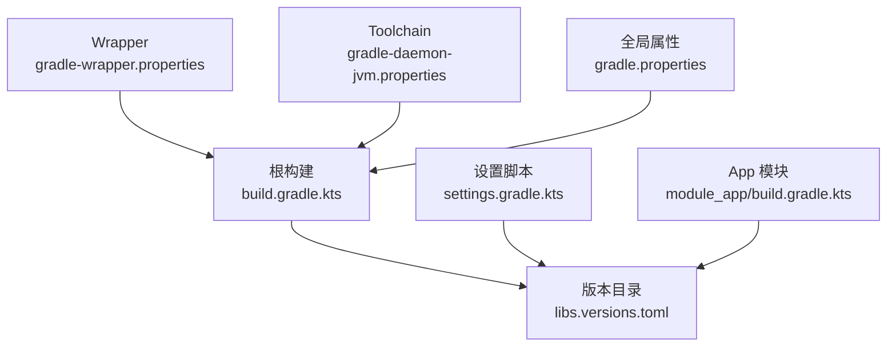
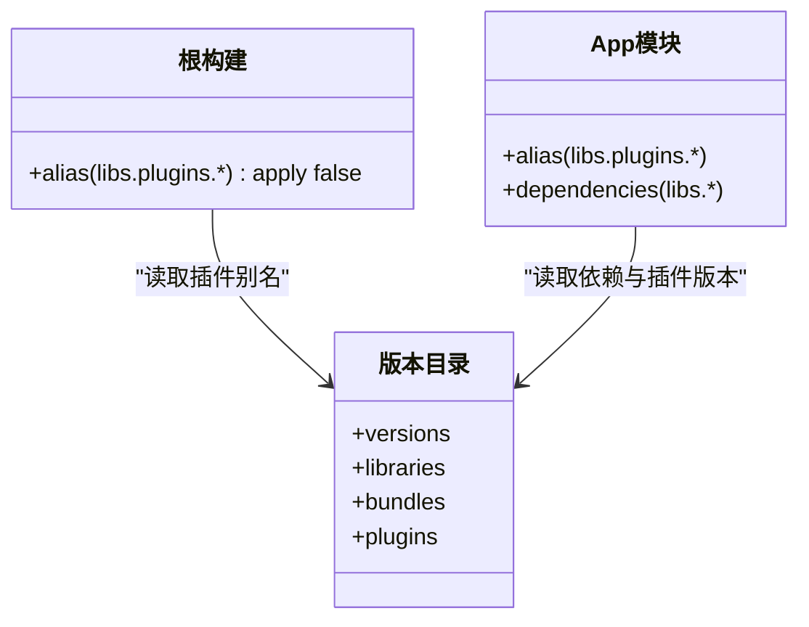

# 版本管理与兼容性

<cite>
**本文引用的文件**
- [gradle/libs.versions.toml](file://gradle/libs.versions.toml)
- [settings.gradle.kts](file://settings.gradle.kts)
- [gradle/wrapper/gradle-wrapper.properties](file://gradle/wrapper/gradle-wrapper.properties)
- [gradle/gradle-daemon-jvm.properties](file://gradle/gradle-daemon-jvm.properties)
- [gradle.properties](file://gradle.properties)
- [build.gradle.kts](file://build.gradle.kts)
- [module_app/build.gradle.kts](file://module_app/build.gradle.kts)
</cite>

## 目录
1. [简介](#简介)
2. [项目结构](#项目结构)
3. [核心组件](#核心组件)
4. [架构总览](#架构总览)
5. [详细组件分析](#详细组件分析)
6. [依赖关系分析](#依赖关系分析)
7. [性能与构建稳定性考量](#性能与构建稳定性考量)
8. [故障排查指南](#故障排查指南)
9. [结论](#结论)
10. [附录：升级检查清单](#附录升级检查清单)

## 简介
本文件围绕 Gradle 版本目录（Version Catalog）在仓库中的统一版本控制实践，系统性说明 libs.versions.toml 的职责、配置方式与使用规范；阐述大版本/小版本/安全补丁的升级策略；给出向后兼容、向前兼容与横向兼容的测试策略；提供依赖冲突检测与解决流程；并给出 Gradle 插件、Kotlin、第三方库升级的最佳实践与破坏性变更迁移方法。内容严格基于仓库内现有构建脚本与约定，避免臆测。

## 项目结构
仓库采用多模块结构，所有依赖与插件版本集中在版本目录中统一管理，根构建脚本通过 alias 引用，确保全仓一致性与可维护性。关键文件与职责如下：
- gradle/libs.versions.toml：集中定义 versions、libraries、bundles、plugins 及自定义插件 ID 映射
- settings.gradle.kts：统一仓库源、工具链下载源、包含子模块
- build.gradle.kts：根级声明各插件应用范围（apply false），由模块按需引入
- module_app/build.gradle.kts：示例模块通过 alias(libs.plugins.*) 引用插件，不写死版本
- gradle/wrapper/gradle-wrapper.properties：锁定 Gradle 发行版
- gradle/gradle-daemon-jvm.properties：Gradle 守护进程自动拉取 JDK toolchain
- gradle.properties：构建期开关与 JVM 参数



**图表来源**
- [build.gradle.kts:1-14](file://build.gradle.kts#L1-L14)
- [gradle/libs.versions.toml:214-237](file://gradle/libs.versions.toml#L214-L237)
- [settings.gradle.kts:24-43](file://settings.gradle.kts#L24-L43)
- [gradle/wrapper/gradle-wrapper.properties:1-7](file://gradle/wrapper/gradle-wrapper.properties#L1-L7)
- [gradle/gradle-daemon-jvm.properties:1-12](file://gradle/gradle-daemon-jvm.properties#L1-L12)
- [gradle.properties:14-36](file://gradle.properties#L14-L36)

**章节来源**
- [build.gradle.kts:1-14](file://build.gradle.kts#L1-L14)
- [settings.gradle.kts:1-66](file://settings.gradle.kts#L1-L66)
- [gradle/libs.versions.toml:1-237](file://gradle/libs.versions.toml#L1-L237)
- [gradle/wrapper/gradle-wrapper.properties:1-7](file://gradle/wrapper/gradle-wrapper.properties#L1-L7)
- [gradle/gradle-daemon-jvm.properties:1-12](file://gradle/gradle-daemon-jvm.properties#L1-L12)
- [gradle.properties:14-36](file://gradle.properties#L14-L36)

## 核心组件
- 版本目录（Version Catalog）：单一事实源，涵盖 Android 工具链、Kotlin、AndroidX、Compose、网络与数据库等全部依赖与插件
- 插件别名：通过 plugins 块以 alias 方式引用，禁止硬编码版本
- 模块依赖：模块仅通过 libs.* 引用版本目录中的库，不在 build.gradle.kts 中写版本号
- 工具链管理：Wrapper 固定 Gradle 版本；Daemon JVM 通过 foojay resolver 自动拉取指定版本 JDK

**章节来源**
- [gradle/libs.versions.toml:1-237](file://gradle/libs.versions.toml#L1-L237)
- [build.gradle.kts:1-14](file://build.gradle.kts#L1-L14)
- [module_app/build.gradle.kts:1-8](file://module_app/build.gradle.kts#L1-L8)
- [gradle/wrapper/gradle-wrapper.properties:1-7](file://gradle/wrapper/gradle-wrapper.properties#L1-L7)
- [gradle/gradle-daemon-jvm.properties:1-12](file://gradle/gradle-daemon-jvm.properties#L1-L12)

## 架构总览
版本管理的关键路径：
- 开发者修改版本：仅在 libs.versions.toml 中调整
- 模块编译时解析：build.gradle.kts 通过 alias(libs.plugins.*) 与 dependencies 中的 libs.* 读取版本
- 工具链与 Wrapper：Gradle 版本由 wrapper 锁定；JDK 版本由 daemon toolchain 管理
- 仓库源与镜像：settings 中统一声明，保证一致的解析行为

```mermaid
sequenceDiagram
    Dev as "开发者"
    VC as "版本目录<br/>libs.versions.toml"
    Root as "根构建<br/>build.gradle.kts"
    Mod as "模块构建<br/>module_app/build.gradle.kts"
    Repo as "仓库源<br/>settings.gradle.kts"
    Tool as "工具链<br/>wrapper/daemon"

    Dev->>VC: 修改版本
    Root->>Mod: 通过 alias(libs.plugins.*) 引用插件
    Mod->>Repo: 解析依赖与插件（含镜像）
    Repo-->>Mod: 返回制品
    Tool-->>Root: 按 wrapper/daemon 启动构建
    Root-->>Dev: 输出构建结果
```

**图表来源**
- [gradle/libs.versions.toml:214-237](file://gradle/libs.versions.toml#L214-L237)
- [build.gradle.kts:1-14](file://build.gradle.kts#L1-L14)
- [module_app/build.gradle.kts:1-8](file://module_app/build.gradle.kts#L1-L8)
- [settings.gradle.kts:24-43](file://settings.gradle.kts#L24-L43)
- [gradle/wrapper/gradle-wrapper.properties:1-7](file://gradle/wrapper/gradle-wrapper.properties#L1-L7)
- [gradle/gradle-daemon-jvm.properties:1-12](file://gradle/gradle-daemon-jvm.properties#L1-L12)

## 详细组件分析

### 版本目录结构与使用
- versions：集中声明所有版本常量（AGP、Kotlin、AndroidX、Compose、Hilt、Room、Retrofit、OkHttp、测试框架等）
- libraries：将 group/name 与版本绑定为命名库，供模块直接使用
- bundles：聚合常用依赖组（如 Compose UI Test）
- plugins：统一插件 ID 与版本映射，支持第三方插件与本地约定插件
- 模块引用：通过 alias(libs.plugins.*) 与 libs.* 获取版本，杜绝硬编码

最佳实践
- 新增依赖时，先在 versions 中声明版本，再在 libraries 中注册，最后模块引用
- 升级依赖时只改 versions 一处，确保一致性
- 对需强一致的组件（如 AGP 与 Kotlin、Compose BOM 相关）应协同升级并在注释中注明约束

**章节来源**
- [gradle/libs.versions.toml:1-237](file://gradle/libs.versions.toml#L1-L237)

### 插件版本管理
- 根构建仅声明插件应用范围（apply false），具体应用由各模块完成
- 所有插件均通过版本目录别名引用，包括 Android、Kotlin、Hilt、KSP、Room、TheRouter、Compose 编译器、Baseline Profile、Module Graph 等
- 本地约定插件（xrn1997.*）也通过版本目录暴露，便于集中管理

升级注意
- 升级插件前确认其与 Kotlin/AGP 的兼容性矩阵
- 若插件存在 breaking change，优先在测试覆盖范围内灰度验证

**章节来源**
- [build.gradle.kts:1-14](file://build.gradle.kts#L1-L14)
- [gradle/libs.versions.toml:214-237](file://gradle/libs.versions.toml#L214-L237)

### 工具链版本控制
- Gradle 版本：由 gradle-wrapper.properties 锁定，保证 CI/本地一致
- JDK Toolchain：由 gradle-daemon-jvm.properties 指定版本并通过 foojay resolver 自动下载，无需本地预装
- Java/Kotlin 目标：模块 compileOptions/kotlin.compilerOptions 统一为 17（符合 AGP 内置 Kotlin 的新 DSL）

升级注意
- 升级 Gradle 时需同步评估 AGP/Kotlin 兼容性
- 升级 JDK 时需确认 Android SDK/NDK 与 NDK/CMake 的 ABI 和工具链匹配

**章节来源**
- [gradle/wrapper/gradle-wrapper.properties:1-7](file://gradle/wrapper/gradle-wrapper.properties#L1-L7)
- [gradle/gradle-daemon-jvm.properties:1-12](file://gradle/gradle-daemon-jvm.properties#L1-L12)
- [module_app/build.gradle.kts:37-45](file://module_app/build.gradle.kts#L37-L45)

### 仓库源与依赖解析
- settings 中集中声明多个 Maven 源（含 Google、Central、阿里云镜像、JitPack、Snapshots 等），并启用 FAIL_ON_PROJECT_REPOS，禁止模块私自添加仓库
- 该策略避免“同一份代码在不同环境解析到不同版本”的风险

升级注意
- 新增第三方库需确保其仓库已纳入统一源列表
- 快照依赖需谨慎使用，建议在特定分支或任务中临时开启

**章节来源**
- [settings.gradle.kts:1-43](file://settings.gradle.kts#L1-L43)

### 构建期开关与兼容性
- gradle.properties 中保留必要的 AGP 9 兼容项（如 nonTransitiveRClass、useAndroidX、KSP 增量）
- isModule 控制功能模块独立运行模式，提交态必须为 false
- R8 与资源优化相关开关遵循 AGP 默认值，避免过时选项

**章节来源**
- [gradle.properties:14-36](file://gradle.properties#L14-L36)

## 依赖关系分析
版本目录与模块的依赖关系如下：



**图表来源**
- [build.gradle.kts:1-14](file://build.gradle.kts#L1-L14)
- [gradle/libs.versions.toml:1-237](file://gradle/libs.versions.toml#L1-L237)
- [module_app/build.gradle.kts:1-8](file://module_app/build.gradle.kts#L1-L8)

**章节来源**
- [build.gradle.kts:1-14](file://build.gradle.kts#L1-L14)
- [gradle/libs.versions.toml:1-237](file://gradle/libs.versions.toml#L1-L237)
- [module_app/build.gradle.kts:1-8](file://module_app/build.gradle.kts#L1-L8)

## 性能与构建稳定性考量
- 依赖版本收敛：通过版本目录与统一仓库源减少版本碎片化，降低依赖树爆炸风险
- 工具链稳定：Wrapper 固定 Gradle，Daemon Toolchain 自动拉取 JDK，提升跨机器一致性
- 构建缓存：启用 KSP 增量与合理 JVM 参数，缩短迭代时间
- 模块隔离：FAIL_ON_PROJECT_REPOS 防止模块私自引入仓库导致的不一致

[本节为通用指导，不直接分析具体文件]

## 故障排查指南
常见问题与定位思路
- 依赖版本不一致：检查是否有人在模块内硬编码版本或未走版本目录
- 插件不兼容：核对 AGP、Kotlin、插件三者版本矩阵；必要时回滚或分批升级
- 仓库解析失败：确认 settings 中仓库源可用；清理 Gradle 缓存后重试
- Toolchain 下载失败：检查网络连接与 foojay resolver；必要时手动安装指定 JDK

定位步骤
- 查看构建日志中的依赖解析与插件加载信息
- 使用 ./gradlew --dry-run 检查依赖图变化
- 对比升级前后的 libs.versions.toml 差异，定位潜在 breaking change

**章节来源**
- [settings.gradle.kts:24-43](file://settings.gradle.kts#L24-L43)
- [gradle/libs.versions.toml:1-237](file://gradle/libs.versions.toml#L1-L237)

## 结论
本项目通过版本目录实现了统一的依赖与插件版本管理，结合 Wrapper 与 Toolchain 管理确保了构建环境的一致性。配合严格的仓库源策略与构建期开关，有效降低了版本漂移带来的风险。后续升级应遵循“先小版本、后大版本；先非关键、后关键”的原则，并以测试覆盖作为升级通过的硬性条件。

[本节为总结，不直接分析具体文件]

## 附录：升级检查清单

- 版本目录维护
  - 仅在 versions 中更新版本号，保持 libraries/plugins 对应引用不变
  - 对强耦合组件（AGP/Kotlin/Compose）协同升级，并在注释中记录约束

- 插件升级
  - 确认插件与 Kotlin/AGP 兼容
  - 在测试集覆盖范围内先行验证（单元/集成/UI 自动化）
  - 若涉及 breaking change，分步迁移并保留过渡期

- 第三方库升级
  - 评估 API 变动、ABI 影响与运行时行为变化
  - 优先选择向后兼容的小版本；安全补丁优先处理
  - 升级后执行全量测试与静态检查（Lint/混淆/ProGuard/R8 规则）

- 工具链升级
  - Gradle：升级前先评估与 AGP/Kotlin 的兼容性；更新 wrapper 版本
  - JDK：更新 toolchain 版本并确保 Android SDK/NDK 适配
  - 更新后在 CI 与本地同时验证构建与打包

- 兼容性测试策略
  - 向后兼容：旧接口仍可用，新增可选能力；通过 API 契约测试保障
  - 向前兼容：新客户端能降级消费旧服务端；通过 mock 与契约测试验证
  - 横向兼容：多模块/多平台/多 ABI 并行验证；确保无 ABI 断裂

- 依赖冲突检测与解决
  - 使用 ./gradlew app:dependencies 等命令分析依赖树
  - 发现冲突时优先统一版本；必要时使用 exclude 或 force 策略（谨慎）
  - 对传递依赖进行重写（如通过版本目录统一）

- 破坏性变更迁移
  - 标记废弃 API 并提供替代方案
  - 分阶段迁移：双实现并存 → 逐步切换调用方 → 移除旧实现
  - 文档与测试同步更新，确保回归用例覆盖

- 升级后的验证
  - 构建：./gradlew clean assembleDebug/Release
  - 测试：./gradlew test connectedAndroidTest lint
  - 产物校验：APK/AAR 签名、混淆映射、资源合并结果
  - 关键路径冒烟：登录、书城、阅读、下载、设置等核心流程

[本节为操作指引，不直接分析具体文件]