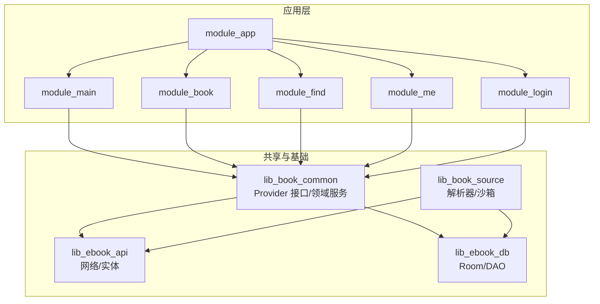
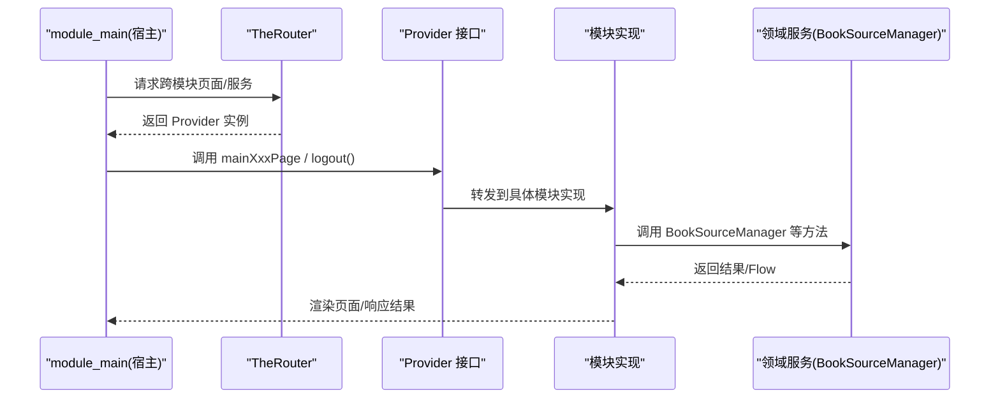
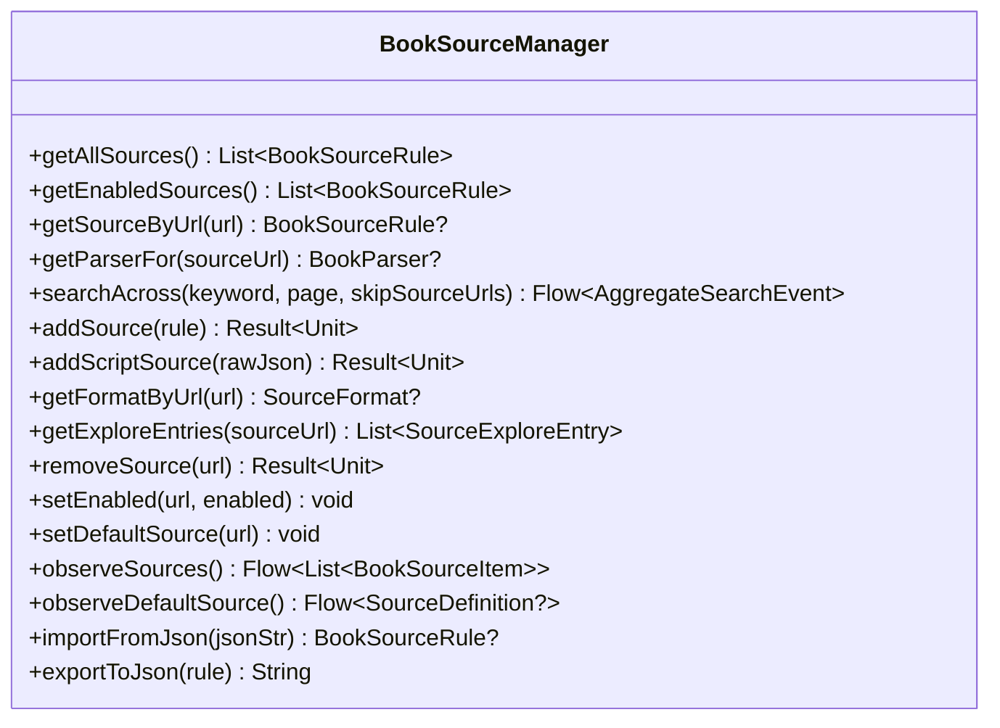
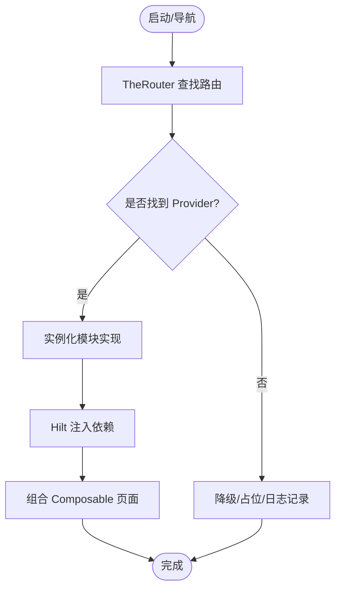
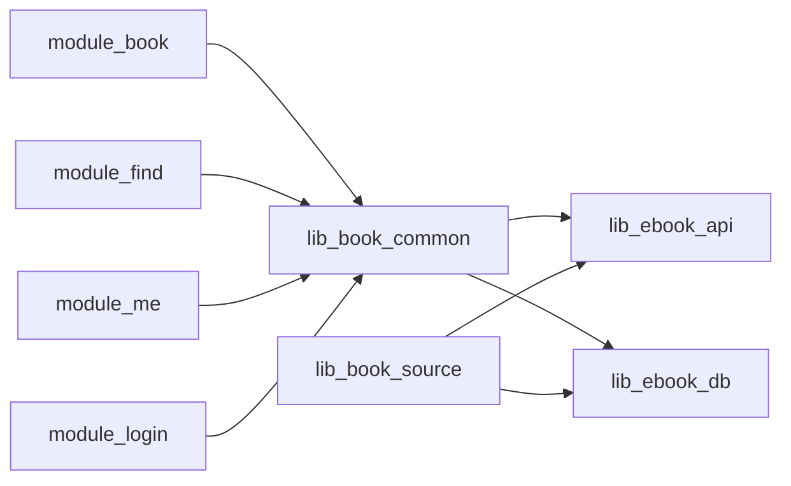

# 解耦策略实现

<cite>
**本文引用的文件**
- [IBookProvider.kt](file://lib_book_common/src/main/java/com/ebook/common/provider/IBookProvider.kt)
- [IFindProvider.kt](file://lib_book_common/src/main/java/com/ebook/common/provider/IFindProvider.kt)
- [IMeProvider.kt](file://lib_book_common/src/main/java/com/ebook/common/provider/IMeProvider.kt)
- [ILoginProvider.kt](file://lib_book_common/src/main/java/com/ebook/common/provider/ILoginProvider.kt)
- [BookSourceManager.kt](file://lib_book_common/src/main/java/com/ebook/common/analyze/source/BookSourceManager.kt)
- [BookSourceManagerImpl.kt](file://lib_book_common/src/main/java/com/ebook/common/analyze/source/BookSourceManagerImpl.kt)
- [HiltConventionPlugin.kt](file://build-logic/convention/src/main/kotlin/HiltConventionPlugin.kt)
- [MyApplication.kt](file://module_app/src/main/java/com/module_app/MyApplication.kt)
- [MainActivity.kt](file://module_main/src/main/java/com/module_main/src/main/java/com/ebook/module_main/MainActivity.kt)
- [FakeBookSourceManager.kt](file://module_me/src/test/java/com/ebook/me/mvvm/viewmodel/FakeBookSourceManager.kt)
</cite>

## 目录
1. [引言](#引言)
2. [项目结构](#项目结构)
3. [核心组件](#核心组件)
4. [架构总览](#架构总览)
5. [关键组件详解](#关键组件详解)
6. [依赖关系分析](#依赖关系分析)
7. [性能与可维护性考量](#性能与可维护性考量)
8. [故障排查指南](#故障排查指南)
9. [结论](#结论)

## 引言
本文聚焦于本项目的解耦策略，重点说明 Provider 接口模式在模块化开发中的应用，剖析 BookSourceManager 等核心接口的抽象设计、注册机制、依赖隔离与测试隔离实践，并解释 Hilt 在作用域管理、生命周期控制与错误处理方面的角色。目标是帮助读者理解如何通过“面向接口编程 + 依赖注入 + 模块边界”实现松耦合、可替换、可测试的系统。

## 项目结构
本项目采用多模块 Gradle 工程：
- 业务模块（module_app/module_main/module_book/module_find/module_me/module_login）通过 TheRouter 进行跨模块导航与服务发现。
- 共享能力集中在 lib_book_common，暴露跨模块可见的 Provider 接口与领域服务（如 BookSourceManager）。
- 解析与执行层集中在 lib_book_source（含脚本解析器与沙箱），网络与数据库分别由 lib_ebook_api 与 lib_ebook_db 提供。
- 构建配置集中在 build-logic，统一应用插件与约定。

图表来源
- [HiltConventionPlugin.kt:1-200](file://build-logic/convention/src/main/kotlin/HiltConventionPlugin.kt#L1-L200)
- [MyApplication.kt:1-200](file://module_app/src/main/java/com/module_app/MyApplication.kt#L1-L200)
- [MainActivity.kt:1-200](file://module_main/src/main/java/com/module_main/src/main/java/com/ebook/module_main/MainActivity.kt#L1-L200)

章节来源
- [HiltConventionPlugin.kt:1-200](file://build-logic/convention/src/main/kotlin/HiltConventionPlugin.kt#L1-L200)
- [MyApplication.kt:1-200](file://module_app/src/main/java/com/module_app/MyApplication.kt#L1-L200)
- [MainActivity.kt:1-200](file://module_main/src/main/java/com/module_main/src/main/java/com/ebook/module_main/MainActivity.kt#L1-L200)

## 核心组件
- Provider 接口族：IBookProvider、IFindProvider、IMeProvider、ILoginProvider，定义跨模块能力边界，屏蔽具体模块实现细节。
- BookSourceManager：书源管理的唯一入口，封装对 book_source 表的读写、默认源策略、聚合搜索与分类条目获取，屏蔽 DAO 与解析器细节。
- Hilt：作为依赖注入框架，配合约定插件在各模块装配与注入依赖，支持作用域与生命周期管理。

章节来源
- [IBookProvider.kt:1-13](file://lib_book_common/src/main/java/com/ebook/common/provider/IBookProvider.kt#L1-L13)
- [IFindProvider.kt:1-13](file://lib_book_common/src/main/java/com/ebook/common/provider/IFindProvider.kt#L1-L13)
- [IMeProvider.kt:1-13](file://lib_book_common/src/main/java/com/ebook/common/provider/IMeProvider.kt#L1-L13)
- [ILoginProvider.kt:1-19](file://lib_book_common/src/main/java/com/ebook/common/provider/ILoginProvider.kt#L1-L19)
- [BookSourceManager.kt:1-277](file://lib_book_common/src/main/java/com/ebook/common/analyze/source/BookSourceManager.kt#L1-L277)

## 架构总览
系统以“接口即契约、实现即模块”的方式组织：
- 跨模块页面与服务通过 Provider 接口暴露，宿主（module_main）通过路由创建并组合 Composable 页面，避免硬依赖。
- 领域服务（如 BookSourceManager）由 lib_book_common 定义，业务模块仅依赖接口；实现类负责协调 DAO、解析器、缓存与默认源策略。
- Hilt 在各模块中按作用域装配实例，Activity/ViewModel 通过注入获得依赖，降低耦合度并便于测试替换。

图表来源
- [MainActivity.kt:1-200](file://module_main/src/main/java/com/module_main/src/main/java/com/ebook/module_main/MainActivity.kt#L1-L200)
- [IBookProvider.kt:1-13](file://lib_book_common/src/main/java/com/ebook/common/provider/IBookProvider.kt#L1-L13)
- [ILoginProvider.kt:1-19](file://lib_book_common/src/main/java/com/ebook/common/provider/ILoginProvider.kt#L1-L19)
- [BookSourceManager.kt:1-277](file://lib_book_common/src/main/java/com/ebook/common/analyze/source/BookSourceManager.kt#L1-L277)

## 关键组件详解

### Provider 接口模式与模块解耦
- 接口定义原则
  - 最小化：每个 Provider 只暴露必要的跨模块能力（例如 ILoginProvider 仅暴露服务端登出，本地会话清理交由统一管理器）。
  - 明确职责：IBookProvider/IFindProvider/IMeProvider 暴露页面级 Composable，供宿主 NavHost 直接组合；ILoginProvider 暴露服务端会话作废。
  - 可空与容错：独立运行时可能取不到实现，调用方需允许空实现或降级行为（如登录模块未启用时静默跳过）。
- 方法签名约定
  - 页面级 Provider 返回 @Composable () -> Unit，便于宿主直接组合，ViewModel 作用域绑定调用处的 NavBackStackEntry。
  - 服务端操作使用 suspend 函数，返回 Result<T> 以显式表达成功/失败路径，避免吞异常。
- 异常处理策略
  - 网络或业务失败返回 Result.failure，由调用方决定是否提示；本地会话清理走单点，避免重复与不一致。

章节来源
- [IBookProvider.kt:1-13](file://lib_book_common/src/main/java/com/ebook/common/provider/IBookProvider.kt#L1-L13)
- [IFindProvider.kt:1-13](file://lib_book_common/src/main/java/com/ebook/common/provider/IFindProvider.kt#L1-L13)
- [IMeProvider.kt:1-13](file://lib_book_common/src/main/java/com/ebook/common/provider/IMeProvider.kt#L1-L13)
- [ILoginProvider.kt:1-19](file://lib_book_common/src/main/java/com/ebook/common/provider/ILoginProvider.kt#L1-L19)

### BookSourceManager 接口设计与职责边界
- 抽象设计要点
  - 唯一入口：所有对 book_source 表的读/写都经过该接口，业务模块不直调 DAO，避免绕过规则解码与状态同步。
  - 异步与流：全部读面为挂起或 Flow，默认源与清单均通过 Room 实时获取，杜绝内存快照导致的第二事实源。
  - 类型化分离：规则类型化读面（getAllSources/getEnabledSources/getSourceByUrl）只返回原生规则；默认源载体为 SourceDefinition，兼容脚本行。
- 方法签名约定
  - 查询类方法返回 List/Flow/Optional，空表/无可用默认源语义清晰（零书源、null 表示无可用）。
  - 变更类方法返回 Result，将失败原因交由调用方决定处理（导入、删除、启用/禁用）。
  - 解析器获取 getParserFor 严格区分 null（不存在/坏行）与类型化异常（脚本装载失败/不支持能力）。
- 异常处理策略
  - 聚合搜索中单源失败收敛为事件流中的 SourceFailed/SourceFinished，取消异常原样上抛，保证流的可控终止。
  - 脚本行首次求值才抛类型化异常，避免在缓存读取阶段污染 LRU 流程。

图表来源
- [BookSourceManager.kt:1-277](file://lib_book_common/src/main/java/com/ebook/common/analyze/source/BookSourceManager.kt#L1-L277)

章节来源
- [BookSourceManager.kt:1-277](file://lib_book_common/src/main/java/com/ebook/common/analyze/source/BookSourceManager.kt#L1-L277)

### Provider 注册机制：静态注册与动态发现
- 静态注册
  - 通过 Hilt 在 Application 与模块 DI 图中声明 Provider 的具体实现，并在需要处注入。适用于同进程、同作用域的稳定依赖。
- 动态发现
  - 跨模块页面与服务通过 TheRouter 进行运行时发现与创建，Provider 接口仅暴露能力，实现位于各自模块，宿主按需组合。
- 混合模式
  - 页面级 Provider 通常由 TheRouter 创建；页面内 ViewModel 仍可通过 Hilt 注入领域服务（如 BookSourceManager），兼顾灵活性与类型安全。

图表来源
- [MainActivity.kt:1-200](file://module_main/src/main/java/com/module_main/src/main/java/com/ebook/module_main/MainActivity.kt#L1-L200)
- [HiltConventionPlugin.kt:1-200](file://build-logic/convention/src/main/kotlin/HiltConventionPlugin.kt#L1-L200)

章节来源
- [MainActivity.kt:1-200](file://module_main/src/main/java/com/module_main/src/main/java/com/ebook/module_main/MainActivity.kt#L1-L200)
- [HiltConventionPlugin.kt:1-200](file://build-logic/convention/src/main/kotlin/HiltConventionPlugin.kt#L1-L200)

### 依赖倒置与实践
- 依赖倒置原则
  - 上层模块（业务模块）仅依赖 lib_book_common 的接口（Provider、BookSourceManager），不感知具体实现。
  - 下层模块（各功能模块）提供具体实现并通过 Hilt/TheRouter 装配。
- 实践方式
  - 接口隔离：按职责拆分 Provider 接口，减少不必要依赖。
  - 注入点：Activity/ViewModel 通过 Hilt 注入接口，避免 new 实现。
  - 数据流向：调用方发起请求 → 领域服务协调 DAO/解析器 → 返回结果/Flow → UI 消费。

章节来源
- [BookSourceManager.kt:1-277](file://lib_book_common/src/main/java/com/ebook/common/analyze/source/BookSourceManager.kt#L1-L277)
- [IBookProvider.kt:1-13](file://lib_book_common/src/main/java/com/ebook/common/provider/IBookProvider.kt#L1-L13)

### 测试隔离策略
- Mock 对象创建
  - 使用 FakeBookSourceManager 或其他内联实现替代真实依赖，隔离 DAO/网络/解析器副作用。
- 测试数据准备
  - 针对 BookSourceManager 的查询/变更方法构造最小数据集（空库、单条启用源、脚本源等），验证默认源回落与列表排序。
- 断言验证
  - 断言 Flow 发射序列（如 searchAcross 的事件顺序）、Result 成功/失败分支、默认源为 null 时的引导态。
- 示例路径
  - 参考 module_me 测试中的 FakeBookSourceManager 与相关 VM 测试用例，覆盖默认源、切换源、聚合搜索等场景。

章节来源
- [FakeBookSourceManager.kt:1-200](file://module_me/src/test/java/com/ebook/me/mvvm/viewmodel/FakeBookSourceManager.kt#L1-L200)
- [BookSourceManager.kt:1-277](file://lib_book_common/src/main/java/com/ebook/common/analyze/source/BookSourceManager.kt#L1-L277)

### 自定义 Provider、依赖注入与单元测试示例
- 自定义 Provider
  - 在 lib_book_common 定义新接口（如 ISettingsProvider），暴露必要能力（如设置项获取/更新）。
  - 在目标模块（如 module_me）提供实现类 SettingsProviderImpl，并使用 Hilt 注解装配。
  - 宿主通过 TheRouter 注册路由并返回 Provider 实例，页面组合其 Composable。
- 依赖注入
  - 在 Activity/ViewModel 中使用 @Inject 或 @HiltViewModel 注入 BookSourceManager 等接口，确保可替换与可测试。
- 单元测试
  - 使用 FakeBookSourceManager 模拟不同书源状态（空库、启用/禁用、脚本源），断言 UI 状态与行为（引导态、列表渲染、搜索结果）。

章节来源
- [BookSourceManager.kt:1-277](file://lib_book_common/src/main/java/com/ebook/common/analyze/source/BookSourceManager.kt#L1-L277)
- [IBookProvider.kt:1-13](file://lib_book_common/src/main/java/com/ebook/common/provider/IBookProvider.kt#L1-L13)

### Hilt 的作用域管理、生命周期控制与错误处理
- 作用域管理
  - 通过 Hilt 约定插件统一注入配置，Application 级别装配全局依赖，模块级装配局部依赖。
- 生命周期控制
  - ViewModel 与页面级依赖随生命周期自动释放，避免内存泄漏；跨模块 Provider 由路由创建与销毁。
- 错误处理
  - 注入失败会提前暴露（编译期或运行期 DI 图错误），结合 Result 返回的细粒度错误（如网络/业务失败）形成双层防护。

章节来源
- [HiltConventionPlugin.kt:1-200](file://build-logic/convention/src/main/kotlin/HiltConventionPlugin.kt#L1-L200)
- [MyApplication.kt:1-200](file://module_app/src/main/java/com/module_app/MyApplication.kt#L1-L200)

## 依赖关系分析
- 模块间依赖方向：业务模块 → lib_book_common → lib_ebook_api/lib_ebook_db；lib_book_source 专用于解析与沙箱。
- Provider 接口作为稳定边界，屏蔽实现模块变化；BookSourceManager 作为领域服务入口，屏蔽 DAO/解析器细节。
- Hilt 在各模块中按作用域装配依赖，减少 new 与静态单例带来的耦合。

图表来源
- [HiltConventionPlugin.kt:1-200](file://build-logic/convention/src/main/kotlin/HiltConventionPlugin.kt#L1-L200)
- [BookSourceManager.kt:1-277](file://lib_book_common/src/main/java/com/ebook/common/analyze/source/BookSourceManager.kt#L1-L277)

章节来源
- [HiltConventionPlugin.kt:1-200](file://build-logic/convention/src/main/kotlin/HiltConventionPlugin.kt#L1-L200)
- [BookSourceManager.kt:1-277](file://lib_book_common/src/main/java/com/ebook/common/analyze/source/BookSourceManager.kt#L1-L277)

## 性能与可维护性考量
- 性能
  - BookSourceManager 的 getParserFor 使用 LRU 缓存，避免重复加载解析器；聚合搜索并发上限受控（默认 5），降低第三方站点风控风险。
  - 默认源与清单通过 Room 订阅，避免内存快照导致的数据不一致与二次拉取。
- 可维护性
  - 接口隔离与依赖倒置使模块易于替换与扩展；Provider 接口最小化，职责单一。
  - 通过 Hilt 统一装配，集中管理依赖生命周期与作用域，降低散落的 new 与静态单例。

[本节为通用指导，无需特定文件引用]

## 故障排查指南
- 常见问题
  - 跨模块路由不可用：独立模式下路由缺失会静默失败，需在测试宿主添加占位路由并重新构建生成 routeMap。
  - 默认源为空：检查是否有启用源；若全禁用，observeDefaultSource 返回 null，UI 应展示引导态。
  - 聚合搜索无结果：确认 skipSourceUrls 是否正确推进；软 404 场景需按 noteUrl 去重判断到底。
- 调试建议
  - 使用 FakeBookSourceManager 模拟极端场景（空库、脚本源、脏规则）验证 UI 分支。
  - 关注 Result 失败分支与 Flow 事件，确保异常不被吞掉且用户得到明确反馈。

章节来源
- [BookSourceManager.kt:1-277](file://lib_book_common/src/main/java/com/ebook/common/analyze/source/BookSourceManager.kt#L1-L277)
- [FakeBookSourceManager.kt:1-200](file://module_me/src/test/java/com/ebook/me/mvvm/viewmodel/FakeBookSourceManager.kt#L1-L200)

## 结论
本项目通过 Provider 接口模式、BookSourceManager 领域服务抽象与 Hilt 依赖注入，实现了清晰的模块边界与松耦合架构。接口隔离与依赖倒置使模块可独立演进；流式 API 与 LRU 缓存保障性能；Mock 与测试替身支撑高覆盖率测试。遵循这些策略，可在保持可维护性的同时快速扩展新功能与新增书源。