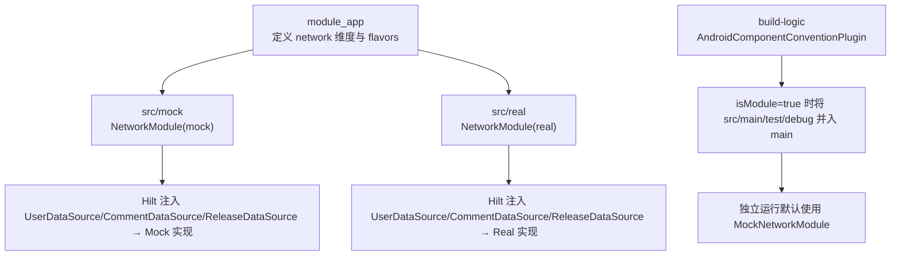
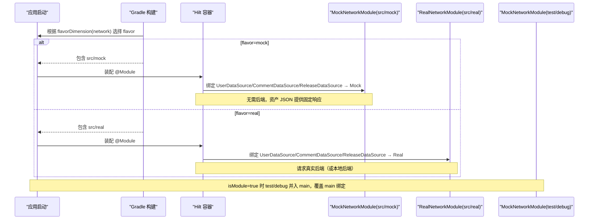
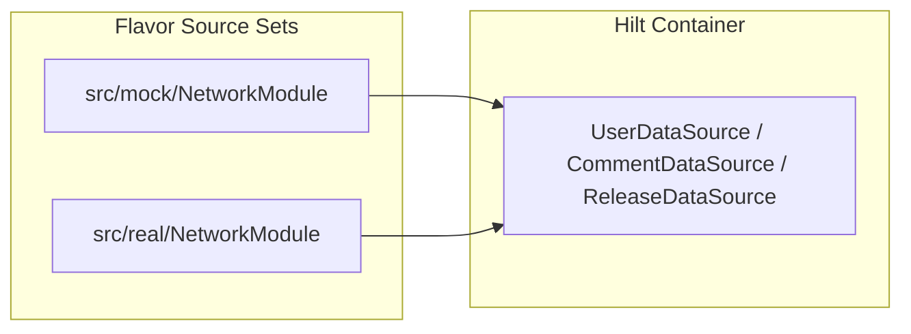

# Product Flavor 配置

<cite>
**本文引用的文件**
- [build.gradle.kts](file://module_app/build.gradle.kts)
- [NetworkModule.kt（mock flavor）](file://module_app/src/mock/java/com/ebook/di/NetworkModule.kt)
- [NetworkModule.kt（real flavor）](file://module_app/src/real/java/com/ebook/di/NetworkModule.kt)
- [MockNetworkModule.kt（独立运行 debug）](file://module_book/src/main/test/debug/MockNetworkModule.kt)
- [AndroidComponentConventionPlugin.kt](file://build-logic/convention/src/main/kotlin/AndroidComponentConventionPlugin.kt)
</cite>

## 目录
1. [简介](#简介)
2. [项目结构](#项目结构)
3. [核心组件](#核心组件)
4. [架构总览](#架构总览)
5. [详细组件分析](#详细组件分析)
6. [依赖关系分析](#依赖关系分析)
7. [性能与构建特性](#性能与构建特性)
8. [故障排查指南](#故障排查指南)
9. [结论](#结论)
10. [附录](#附录)

## 简介
本文面向工程中的 network flavor，系统性说明 real 与 mock 两种风味在应用标识、依赖注入、网络实现与 source set 组织上的差异与切换机制；并给出新增 flavor 的步骤、测试策略与常见问题解决方案。目标是让读者在不深入源码的前提下也能正确理解、维护与扩展 flavor 体系。

## 项目结构
- 根构建脚本统一声明插件与版本目录，模块级构建脚本负责 flavor 维度与具体风味定义。
- module_app 中通过 productFlavors 声明 network 维度下的 real 与 mock 两种风味，并为 mock 追加 applicationIdSuffix。
- 通过 Hilt 的 @Module + @Binds 在不同 flavor 的 source set 下绑定不同的 Network 实现：
  - mock flavor：指向内存 Mock 实现（UserNetworkTest/CommentNetworkTest/ReleaseNetworkTest），无需后端即可全链路调试。
  - real flavor：指向真实网络实现（UserNetwork/CommentNetwork/ReleaseNetwork），连接线上或本地后端。
- 独立模块模式（isModule=true）时，约定插件会将 src/main/test/debug 作为额外 Kotlin 源码目录并入 main，使该目录下的 MockNetworkModule 参与编译并绑定 mock，从而在无后端环境下独立调试各功能模块。

图表来源
- [build.gradle.kts:17-26](file://module_app/build.gradle.kts#L17-L26)
- [NetworkModule.kt（mock flavor）:14-37](file://module_app/src/mock/java/com/ebook/di/NetworkModule.kt#L14-L37)
- [NetworkModule.kt（real flavor）:14-35](file://module_app/src/real/java/com/ebook/di/NetworkModule.kt#L14-L35)
- [AndroidComponentConventionPlugin.kt](file://build-logic/convention/src/main/kotlin/AndroidComponentConventionPlugin.kt)

章节来源
- [build.gradle.kts:17-26](file://module_app/build.gradle.kts#L17-L26)

## 核心组件
- network 风味维度与产品风味：
  - dimension 为 network。
  - real：默认 applicationId，直连后端。
  - mock：applicationIdSuffix=".mock"，用于与 real 包名区分，便于同机并行安装与调试。
- 依赖注入与网络实现切换：
  - mock flavor 的 NetworkModule 将数据源接口绑定到内存 Mock 实现，载荷来自 assets JSON，无需后端。
  - real flavor 的 NetworkModule 将数据源接口绑定到真实网络实现，基址由 API 层配置注入。
- 独立运行时的 mock 绑定：
  - isModule=true 时，约定插件将 src/main/test/debug 并入 main 源码目录，其中的 MockNetworkModule 会覆盖 main 的同名绑定，确保独立运行默认走 mock。

章节来源
- [build.gradle.kts:17-26](file://module_app/build.gradle.kts#L17-L26)
- [NetworkModule.kt（mock flavor）:14-37](file://module_app/src/mock/java/com/ebook/di/NetworkModule.kt#L14-L37)
- [NetworkModule.kt（real flavor）:14-35](file://module_app/src/real/java/com/ebook/di/NetworkModule.kt#L14-L35)
- [MockNetworkModule.kt（独立运行 debug）:12-27](file://module_book/src/main/test/debug/MockNetworkModule.kt#L12-L27)

## 架构总览
下图展示不同 flavor 与 source set 如何影响运行时行为：

图表来源
- [build.gradle.kts:17-26](file://module_app/build.gradle.kts#L17-L26)
- [NetworkModule.kt（mock flavor）:14-37](file://module_app/src/mock/java/com/ebook/di/NetworkModule.kt#L14-L37)
- [NetworkModule.kt（real flavor）:14-35](file://module_app/src/real/java/com/ebook/di/NetworkModule.kt#L14-L35)
- [MockNetworkModule.kt（独立运行 debug）:12-27](file://module_book/src/main/test/debug/MockNetworkModule.kt#L12-L27)

## 详细组件分析

### flavor 维度与产品风味
- 维度名称：network。
- real flavor：无后缀，applicationId 与 defaultConfig 一致。
- mock flavor：applicationIdSuffix=".mock"，便于与 real 共存安装。
- 构建类型：debug/release 可与 flavor 组合，形成如 assembleMockDebug、assembleRealRelease 等任务。

章节来源
- [build.gradle.kts:17-26](file://module_app/build.gradle.kts#L17-L26)

### 依赖注入与网络实现切换
- mock flavor 的 NetworkModule 将三类数据源绑定到 Mock 实现：
  - UserDataSource → UserNetworkTest
  - CommentDataSource → CommentNetworkTest
  - ReleaseDataSource → ReleaseNetworkTest（固定资产，不依赖外网可达性）
- real flavor 的 NetworkModule 将同类接口绑定到真实网络实现：
  - UserDataSource → UserNetwork
  - CommentDataSource → CommentNetwork
  - ReleaseDataSource → ReleaseNetwork（公开 Releases API）
- 两个 NetworkModule 位于同名包路径但不同 flavor source set，互斥生效。

章节来源
- [NetworkModule.kt（mock flavor）:14-37](file://module_app/src/mock/java/com/ebook/di/NetworkModule.kt#L14-L37)
- [NetworkModule.kt（real flavor）:14-35](file://module_app/src/real/java/com/ebook/di/NetworkModule.kt#L14-L35)

### 独立运行模式的 mock 绑定
- 当 isModule=true 时，约定插件将 src/main/test/debug 作为额外 Kotlin 源码目录并入 main。
- 该目录下的 MockNetworkModule 将 UserDataSource/CommentDataSource 绑定到 Mock 实现，使功能模块可独立运行并无需后端。
- 注意：test/debug 是目录命名约定，并非 source set 优先级本身；其参与编译是由约定插件主动添加源码目录所致。

章节来源
- [MockNetworkModule.kt（独立运行 debug）:12-27](file://module_book/src/main/test/debug/MockNetworkModule.kt#L12-L27)
- [AndroidComponentConventionPlugin.kt](file://build-logic/convention/src/main/kotlin/AndroidComponentConventionPlugin.kt)

### Source Set 组织结构
- 集成态（isModule=false）：
  - mock flavor：编译 module_app/src/mock 下的代码，替换网络绑定。
  - real flavor：编译 module_app/src/real 下的代码，替换网络绑定。
- 独立态（isModule=true）：
  - 约定插件将各模块 src/main/test/debug 并入 main，其中的 MockNetworkModule 生效，默认走 mock。
- 资源与清单：
  - 两份 Manifest 是替换关系：独立态只生效 src/main/module/AndroidManifest.xml，集成态只生效 src/main/AndroidManifest.xml。Activity 声明及其属性需两处同步修改，避免行为不一致。

章节来源
- [AndroidComponentConventionPlugin.kt](file://build-logic/convention/src/main/kotlin/AndroidComponentConventionPlugin.kt)

### 构建类型与 flavor 的组合
- 常见组合：
  - assembleMockDebug：mock flavor + debug 构建类型，适合本地开发调试，启用日志与调试工具。
  - assembleMockRelease：mock flavor + release 构建类型，可用于离线演示或 CI 验证 UI 流程。
  - assembleRealDebug：real flavor + debug 构建类型，连接本地或远程后端进行联调。
  - assembleRealRelease：real flavor + release 构建类型，发布或预发环境构建。
- 签名与混淆：
  - release 构建类型开启混淆（R8）。
  - 如需对特定 flavor 定制签名或混淆规则，可在对应 flavor 块内覆盖。

章节来源
- [build.gradle.kts:27-35](file://module_app/build.gradle.kts#L27-L35)

## 依赖关系分析
- Hilt 模块按 flavor 隔离：
  - src/mock/NetworkModule 与 src/real/NetworkModule 同名包同文件名，但属于不同 source set，互斥生效。
- 独立运行时通过约定插件将 test/debug 目录并入 main，使 MockNetworkModule 覆盖 main 的默认绑定。
- 依赖方向遵循业务模块 → lib_book_common → lib_ebook_api/lib_ebook_db 的约定，flavor 仅影响网络实现绑定。

图表来源
- [NetworkModule.kt（mock flavor）:14-37](file://module_app/src/mock/java/com/ebook/di/NetworkModule.kt#L14-L37)
- [NetworkModule.kt（real flavor）:14-35](file://module_app/src/real/java/com/ebook/di/NetworkModule.kt#L14-L35)

章节来源
- [NetworkModule.kt（mock flavor）:14-37](file://module_app/src/mock/java/com/ebook/di/NetworkModule.kt#L14-L37)
- [NetworkModule.kt（real flavor）:14-35](file://module_app/src/real/java/com/ebook/di/NetworkModule.kt#L14-L35)

## 性能与构建特性
- 构建产物：
  - mock flavor 的 applicationId 带 .mock 后缀，避免与 real 冲突，支持同机并行安装。
- 构建优化：
  - 通过 flavor source set 隔离实现类，减少无关代码进入最终 APK。
  - 独立运行模式通过约定插件动态加入 test/debug 源码，避免在主分支引入多余条件判断。
- 混淆与发布：
  - release 构建类型开启混淆；mapping.txt 保留于 build/outputs/mapping/ 以便崩溃定位。

章节来源
- [build.gradle.kts:17-26](file://module_app/build.gradle.kts#L17-L26)
- [build.gradle.kts:27-35](file://module_app/build.gradle.kts#L27-L35)

## 故障排查指南
- 问题：同机无法同时安装 mock 与 real 版本
  - 现象：安装时报签名或包名冲突。
  - 排查：确认 mock flavor 已设置 applicationIdSuffix=".mock"。
  - 参考：[build.gradle.kts:17-26](file://module_app/build.gradle.kts#L17-L26)
- 问题：独立运行仍请求后端
  - 现象：isModule=true 时仍然发起网络请求。
  - 排查：检查约定插件是否已将 src/main/test/debug 并入 main；确认 MockNetworkModule 存在且未被其他 @Module 覆盖。
  - 参考：[MockNetworkModule.kt（独立运行 debug）:12-27](file://module_book/src/main/test/debug/MockNetworkModule.kt#L12-L27)
- 问题：更新检查在 mock flavor 依赖外网
  - 现象：CI 或离线环境不稳定。
  - 排查：确认 ReleaseDataSource 在 mock flavor 下绑定到 ReleaseNetworkTest（固定资产），而非 ReleaseNetwork。
  - 参考：[NetworkModule.kt（mock flavor）:14-37](file://module_app/src/mock/java/com/ebook/di/NetworkModule.kt#L14-L37)
- 问题：两份清单不一致导致页面行为差异
  - 现象：独立模式与集成模式跳转逻辑不同。
  - 排查：核对 src/main/module/AndroidManifest.xml 与 src/main/AndroidManifest.xml 的 Activity 声明与属性是否同步。
  - 参考：[AndroidComponentConventionPlugin.kt](file://build-logic/convention/src/main/kotlin/AndroidComponentConventionPlugin.kt)

## 结论
本项目通过 network flavor 维度将“真实网络”和“内存 mock”两种实现解耦，结合 Hilt 依赖注入与约定插件的源码目录管理，既满足集成态的真实联调，又保障独立态的离线开发与调试。real 与 mock 的差异集中在 applicationIdSuffix、网络实现绑定与 source set 组织上；通过清晰的分层与约定，新增 flavor 与维护现有风味变得可控且可预测。

## 附录

### 新增 flavor 的步骤（示例：增加 staging flavor）
- 在 module_app 的 flavorDimensions 中添加新维度或复用已有 network 维度。
- 在 productFlavors 中创建 staging flavor，按需设置 applicationIdSuffix、manifestPlaceholders、buildConfigField 等。
- 若需要独立网络实现：
  - 在 src/staging 下新建与 src/mock/src/real 相同包路径的 NetworkModule，完成接口绑定。
- 若需要独立资源或清单：
  - 在 src/staging/res 与 src/staging/AndroidManifest.xml 提供差异化资源与清单项。
- 若需要在独立模式下也使用 staging 行为：
  - 在相应模块的 src/main/test/staging 下提供对应的 Mock/StagingNetworkModule，并确保约定插件将其并入 main（或在约定插件中扩展 source set 映射）。
- 验证：
  - 执行 assembleStagingDebug/assembleStagingRelease 构建与安装，确认注入与网络行为符合预期。

### 测试策略
- 单元测试：
  - 在各模块 src/test/java 下编写针对 ViewModel、Repository 等的单测，尽量依赖接口以利于替换实现。
- 集成测试：
  - 使用 Android Instrumented Tests（androidTest）验证端到端流程；可配合不同 flavor 构建产物执行。
- 独立运行测试：
  - isModule=true 时，利用 src/main/test/debug 下的 MockNetworkModule 快速验证 UI 与交互。
- 回归与冒烟：
  - 在 CI 中对 mock flavor 做快速冒烟；对 real flavor 做关键路径联调。

### 常见问题速查
- 依赖冲突：
  - 同一接口多个实现被重复绑定：检查 flavor source set 与 test/debug 是否意外同时生效，确保互斥。
- 资源覆盖：
  - 不同 flavor 的资源覆盖顺序：确认资源在对应 flavor 的 res 目录下；必要时使用限定符避免歧义。
- 签名配置：
  - 为特定 flavor 定制签名：在对应 flavor 块内配置 signingConfig，或从 gradle.properties/local.properties 注入密钥信息。