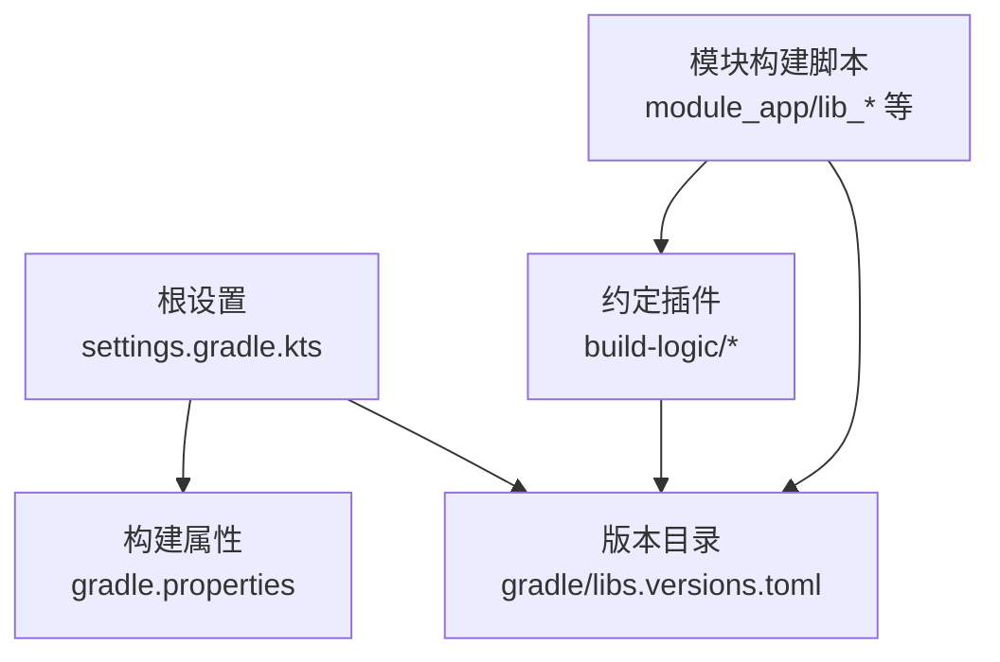
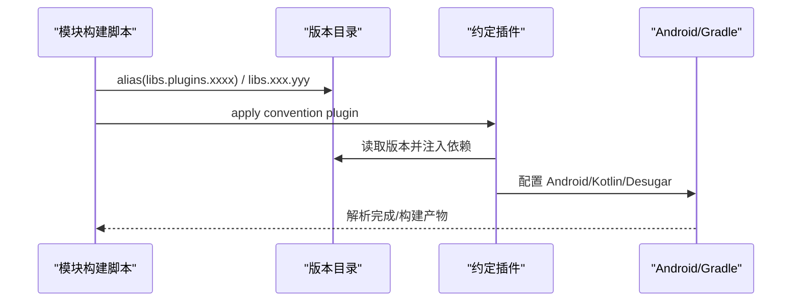
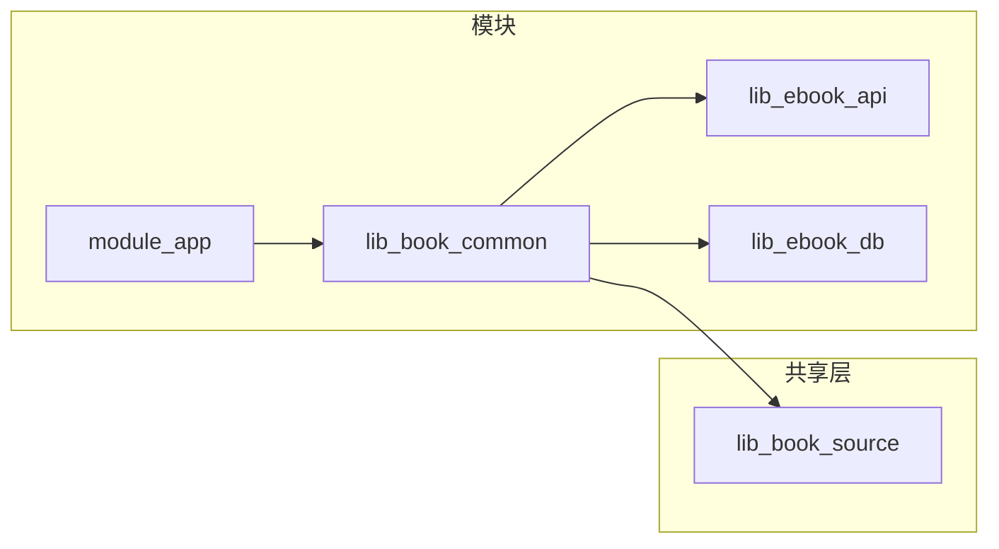

# 依赖版本管理

<cite>
**本文引用的文件**
- [gradle/libs.versions.toml](file://gradle/libs.versions.toml)
- [settings.gradle.kts](file://settings.gradle.kts)
- [gradle.properties](file://gradle.properties)
- [module_app/build.gradle.kts](file://module_app/build.gradle.kts)
- [lib_book_common/build.gradle.kts](file://lib_book_common/build.gradle.kts)
- [lib_ebook_api/build.gradle.kts](file://lib_ebook_api/build.gradle.kts)
- [lib_ebook_db/build.gradle.kts](file://lib_ebook_db/build.gradle.kts)
- [build-logic/convention/src/main/kotlin/com/xrn1997/convention/KotlinAndroid.kt](file://build-logic/convention/src/main/kotlin/com/xrn1997/convention/KotlinAndroid.kt)
</cite>

## 目录
1. [简介](#简介)
2. [项目结构](#项目结构)
3. [核心组件](#核心组件)
4. [架构总览](#架构总览)
5. [详细组件分析](#详细组件分析)
6. [依赖关系分析](#依赖关系分析)
7. [性能考量](#性能考量)
8. [故障排查指南](#故障排查指南)
9. [结论](#结论)
10. [附录](#附录)

## 简介
本文面向本仓库的 Gradle Version Catalogs（版本目录）使用规范与最佳实践，围绕 gradle/libs.versions.toml 的结构组织、依赖引入方式、版本升级流程、AGP/Kotlin/Compose BOM 的版本对齐策略、工具链锁定、冲突解决与性能优化展开。目标是让读者在不深入代码细节的情况下，也能安全、一致地维护项目的依赖体系。

## 项目结构
- 版本目录集中位于 gradle/libs.versions.toml，统一声明 [versions]、[libraries]、[bundles]、[plugins] 及本项目自定义插件 ID。
- 各模块通过 alias(libs.plugins.xxx) 引用插件，通过 libs.xxx.yyy 引用库，避免在构建脚本中硬编码版本号。
- 根级 settings.gradle.kts 集中管理仓库源与 includeBuild；gradle.properties 管理构建期 JVM 与开关项。
- build-logic 中的约定插件统一 Kotlin/Android 编译选项，并通过 Version Catalog 注入公共依赖（如 Desugar）。

图表来源
- [settings.gradle.kts:28-43](file://settings.gradle.kts#L28-L43)
- [gradle/libs.versions.toml:1-238](file://gradle/libs.versions.toml#L1-L238)

章节来源
- [settings.gradle.kts:1-66](file://settings.gradle.kts#L1-L66)
- [gradle/libs.versions.toml:1-238](file://gradle/libs.versions.toml#L1-L238)
- [gradle.properties:16-36](file://gradle.properties#L16-L36)

## 核心组件
- 版本目录（Version Catalog）：单一事实源，统一管理所有第三方库、插件与版本。
- 约定插件：封装 AGP/Kotlin/测试设备等通用配置，并通过 Version Catalog 注入依赖。
- 模块构建脚本：仅声明“需要什么”，不关心“具体版本”和“重复配置”。

章节来源
- [gradle/libs.versions.toml:72-238](file://gradle/libs.versions.toml#L72-L238)
- [build-logic/convention/src/main/kotlin/com/xrn1997/convention/KotlinAndroid.kt:34-56](file://build-logic/convention/src/main/kotlin/com/xrn1997/convention/KotlinAndroid.kt#L34-L56)

## 架构总览
版本目录作为“单一事实源”，被约定插件与各模块共同消费。插件通过 alias(libs.plugins.*) 引用；模块通过 libs.* 引用库；BOM 用于对齐 Compose 族库版本；工具链与仓库源在 settings/gradle 属性中集中管理。

图表来源
- [gradle/libs.versions.toml:214-238](file://gradle/libs.versions.toml#L214-L238)
- [build-logic/convention/src/main/kotlin/com/xrn1997/convention/KotlinAndroid.kt:51-55](file://build-logic/convention/src/main/kotlin/com/xrn1997/convention/KotlinAndroid.kt#L51-L55)
- [module_app/build.gradle.kts:3-8](file://module_app/build.gradle.kts#L3-L8)

## 详细组件分析

### 版本目录结构与命名约定
- [versions]：集中声明所有版本字符串，包括 AGP、Kotlin、AndroidX、Compose BOM、第三方库、工具链等。
- [libraries]：以“语义化别名”暴露可复用依赖，建议按领域分组（androidx-*、hilt-*、retrofit-*、room-*、test-* 等），便于跨模块引用。
- [bundles]：将常用组合打包为 bundle，减少多处重复声明（例如 Compose UI 测试套件）。
- [plugins]：统一声明应用插件与 KSP/Hilt/Room 等工具插件，避免在各模块散落版本。

命名建议
- 库别名：模块名 + 功能后缀，如 androidx-core-ktx、kotlinx-coroutines-android。
- 插件别名：保持与官方 id 相近但更短，如 compose-compiler、ksp。
- 版本键：以业务域或技术栈分组，如 androidxComposeBom、androidGradlePlugin、kotlin。

章节来源
- [gradle/libs.versions.toml:1-71](file://gradle/libs.versions.toml#L1-L71)
- [gradle/libs.versions.toml:72-213](file://gradle/libs.versions.toml#L72-L213)
- [gradle/libs.versions.toml:214-238](file://gradle/libs.versions.toml#L214-L238)

### 依赖引入最佳实践
- 插件引用：统一使用 alias(libs.plugins.xxx)，禁止在模块脚本中写死插件版本。
- 库引用：统一使用 libs.xxx.yyy，禁止在模块脚本中写死 group/name/version。
- 依赖作用域：优先使用 implementation，仅在需要向下游暴露时使用 api（如 lib_book_common 对上游能力的公开面）。
- 测试依赖：集中在 testImplementation/androidTestImplementation，避免污染生产包体。

示例路径
- 模块应用插件引用：参见 [module_app/build.gradle.kts:3-8](file://module_app/build.gradle.kts#L3-L8)
- 模块库引用：参见 [module_app/build.gradle.kts:48-64](file://module_app/build.gradle.kts#L48-L64)
- 约定插件通过目录注入依赖：参见 [build-logic/convention/src/main/kotlin/com/xrn1997/convention/KotlinAndroid.kt:51-55](file://build-logic/convention/src/main/kotlin/com/xrn1997/convention/KotlinAndroid.kt#L51-L55)

章节来源
- [module_app/build.gradle.kts:3-8](file://module_app/build.gradle.kts#L3-L8)
- [module_app/build.gradle.kts:48-64](file://module_app/build.gradle.kts#L48-L64)
- [lib_book_common/build.gradle.kts:37-95](file://lib_book_common/build.gradle.kts#L37-L95)
- [lib_ebook_api/build.gradle.kts:40-64](file://lib_ebook_api/build.gradle.kts#L40-L64)
- [lib_ebook_db/build.gradle.kts:29-51](file://lib_ebook_db/build.gradle.kts#L29-L51)

### 版本对齐原则（AGP/Kotlin/Compose BOM）
- AGP 与 Kotlin 需协同升级，保持兼容矩阵；本仓库通过 versions 集中管理。
- Compose 相关库通过 Compose BOM 进行版本对齐，避免手工维护多库版本。
- Room/Retrofit/OkHttp 等网络与持久化栈需关注传递依赖兼容性，必要时显式声明。

章节来源
- [gradle/libs.versions.toml:1-71](file://gradle/libs.versions.toml#L1-L71)
- [lib_book_common/build.gradle.kts:57-64](file://lib_book_common/build.gradle.kts#L57-L64)

### 工具链与仓库源
- Gradle 工具链：由 foojay resolver 自动下载，无需本地预装 JDK。
- 仓库源：根级 settings 中集中声明镜像与中央仓库，保证一致性与可用性。
- JVM 目标：全仓统一 JvmTarget=17，由约定插件统一配置。

章节来源
- [settings.gradle.kts:1-26](file://settings.gradle.kts#L1-L26)
- [settings.gradle.kts:28-43](file://settings.gradle.kts#L28-L43)
- [gradle.properties:30](file://gradle.properties#L30)
- [build-logic/convention/src/main/kotlin/com/xrn1997/convention/KotlinAndroid.kt:44-48](file://build-logic/convention/src/main/kotlin/com/xrn1997/convention/KotlinAndroid.kt#L44-L48)
- [build-logic/convention/src/main/kotlin/com/xrn1997/convention/KotlinAndroid.kt:73-90](file://build-logic/convention/src/main/kotlin/com/xrn1997/convention/KotlinAndroid.kt#L73-L90)

### 依赖冲突解决指南
- 版本范围冲突：优先通过统一升级到最新版本；若存在不兼容，先在 [versions] 中固定到兼容版本，再逐步推进。
- 传递性依赖冲突：在模块中显式声明所需版本（如 sqlite-bundled/jvm 变体），避免隐式传递导致类加载顺序问题。
- 平台/BOM 覆盖：Compose 等采用 BOM 对齐；其他库如需强制版本，可在模块内显式声明。
- 验证手段：使用 ./gradlew :module:dependencies 查看依赖树，定位冲突点。

章节来源
- [lib_ebook_db/build.gradle.kts:32-42](file://lib_ebook_db/build.gradle.kts#L32-L42)
- [gradle/libs.versions.toml:197-203](file://gradle/libs.versions.toml#L197-L203)

### 版本升级流程（安全升级）
- 变更入口：仅在 gradle/libs.versions.toml 修改版本，不在模块脚本中散落版本。
- 步骤
  1) 评估影响范围：grep 受影响的模块与依赖树。
  2) 单步升级：一次只改一个主依赖，降低回归风险。
  3) 本地构建与测试：./gradlew clean build test 确保编译与单元测试通过。
  4) 运行验证：关键链路（启动、阅读、下载、登录）在设备/模拟器上验证。
  5) 提交与 CI：提交 PR，CI 通过后合并。
- 不兼容处理：若出现 API 不兼容，优先回退到上一稳定版本；确认修复方案后再推进。

章节来源
- [gradle/libs.versions.toml:1-238](file://gradle/libs.versions.toml#L1-L238)
- [settings.gradle.kts:28-43](file://settings.gradle.kts#L28-L43)

### 项目特有策略
- 内置 Kotlin：AGP 提供 Kotlin 支持，不再单独应用 KGP 插件；顶层 kotlin { } 仍可用。
- 源码目录：新增 Kotlin 源码目录使用 sourceSets.kotlin.directories.add(...)，避免 Java 目录混用。
- 原生构建：Ndk/CMake 版本在版本目录中锁定，避免不同机器产出差异。

章节来源
- [gradle/libs.versions.toml:3-9](file://gradle/libs.versions.toml#L3-L9)
- [build-logic/convention/src/main/kotlin/com/xrn1997/convention/KotlinAndroid.kt:34-55](file://build-logic/convention/src/main/kotlin/com/xrn1997/convention/KotlinAndroid.kt#L34-L55)

## 依赖关系分析
- 模块对共享库的依赖方向清晰：业务模块 → lib_book_common → lib_book_source / lib_ebook_api / lib_ebook_db。
- 版本目录作为唯一事实源，所有模块通过 alias/libs 引用，避免重复定义。
- 约定插件统一注入公共依赖（如 Desugar），减少样板代码。

图表来源
- [lib_book_common/build.gradle.kts:37-44](file://lib_book_common/build.gradle.kts#L37-L44)

章节来源
- [lib_book_common/build.gradle.kts:37-95](file://lib_book_common/build.gradle.kts#L37-L95)
- [lib_ebook_api/build.gradle.kts:40-64](file://lib_ebook_api/build.gradle.kts#L40-L64)
- [lib_ebook_db/build.gradle.kts:29-51](file://lib_ebook_db/build.gradle.kts#L29-L51)

## 性能考量
- 依赖缓存：使用阿里云镜像与中央仓库混合，提升拉取速度；启用 Gradle 守护进程与并行构建。
- 增量编译：KSP 增量开启（见 gradle.properties），减少全量编译开销。
- R8/Proguard：集成态关闭 library 的 R8 剥离，独立态开启尽早暴露规则缺口，减少后期成本。
- 资源压缩：遵循 AGP 默认优化，避免额外开关引起的不必要开销。

章节来源
- [settings.gradle.kts:28-43](file://settings.gradle.kts#L28-L43)
- [gradle.properties:16-20](file://gradle.properties#L16-L20)
- [gradle.properties:30-36](file://gradle.properties#L30-L36)

## 故障排查指南
- 依赖解析失败：检查根仓库源配置与网络连通性；必要时切换到备用镜像。
- 版本冲突：使用 ./gradlew :module:dependencies 查看依赖树，定位重复/冲突坐标，并在版本目录或模块中显式声明。
- 构建不一致：确认 NDK/CMake/AGP/Kotlin 版本在版本目录中锁定，避免工具链漂移。
- 运行时崩溃：核对混淆规则与依赖自带 consumer 规则，避免误删反射面。

章节来源
- [settings.gradle.kts:28-43](file://settings.gradle.kts#L28-L43)
- [gradle/libs.versions.toml:3-9](file://gradle/libs.versions.toml#L3-L9)
- [lib_ebook_db/build.gradle.kts:32-42](file://lib_ebook_db/build.gradle.kts#L32-L42)

## 结论
本仓库通过 Gradle Version Catalogs 实现了依赖版本的集中化、规范化与可追溯化管理。结合约定插件与 BOM，既保证了跨模块的一致性，又降低了升级与维护成本。遵循本文的引入规范与升级流程，可在不影响稳定性的前提下持续演进依赖体系。

## 附录
- 常见操作
  - 新增依赖：在 [libraries] 添加条目，并在模块 dependencies 中使用 libs.* 引用。
  - 新增插件：在 [plugins] 添加条目，模块使用 alias(libs.plugins.*) 应用。
  - 批量依赖：在 [bundles] 组合常用依赖，模块直接引用 bundle。
- 参考路径
  - 版本目录：[gradle/libs.versions.toml](file://gradle/libs.versions.toml)
  - 仓库源与工具链：[settings.gradle.kts](file://settings.gradle.kts)
  - 构建属性：[gradle.properties](file://gradle.properties)
  - 约定插件注入依赖：[KotlinAndroid.kt](file://build-logic/convention/src/main/kotlin/com/xrn1997/convention/KotlinAndroid.kt)