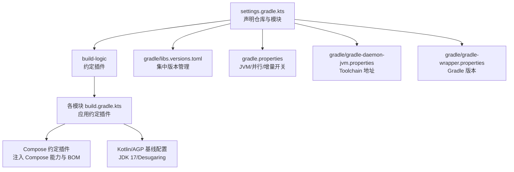
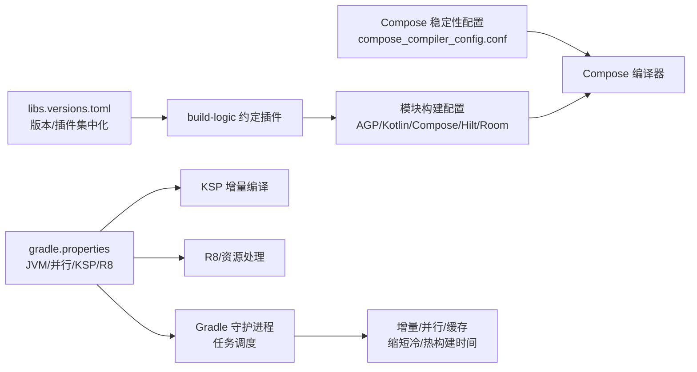
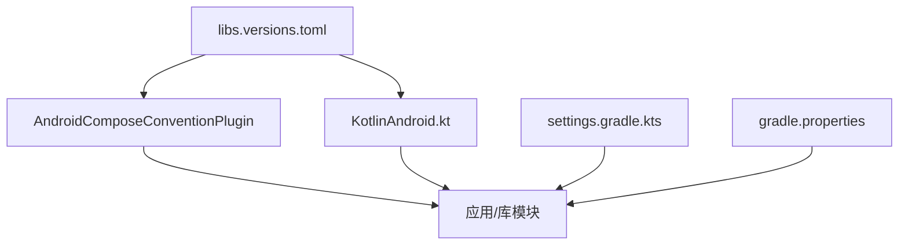

# 构建性能优化

<cite>
**本文引用的文件**
- [gradle.properties](file://gradle.properties)
- [compose_compiler_config.conf](file://compose_compiler_config.conf)
- [gradle/libs.versions.toml](file://gradle/libs.versions.toml)
- [gradle/gradle-wrapper.properties](file://gradle/gradle-wrapper.properties)
- [gradle/gradle-daemon-jvm.properties](file://gradle/gradle-daemon-jvm.properties)
- [settings.gradle.kts](file://settings.gradle.kts)
- [build.gradle.kts](file://build.gradle.kts)
- [AndroidComposeConventionPlugin.kt](file://build-logic/convention/src/main/kotlin/AndroidComposeConventionPlugin.kt)
- [AndroidCompose.kt](file://build-logic/convention/src/main/kotlin/com/xrn1997/convention/AndroidCompose.kt)
- [KotlinAndroid.kt](file://build-logic/convention/src/main/kotlin/com/xrn1997/convention/KotlinAndroid.kt)
</cite>

## 目录
1. [简介](#简介)
2. [项目结构](#项目结构)
3. [核心组件](#核心组件)
4. [架构总览](#架构总览)
5. [详细组件分析](#详细组件分析)
6. [依赖关系分析](#依赖关系分析)
7. [性能考量](#性能考量)
8. [故障排查指南](#故障排查指南)
9. [结论](#结论)
10. [附录](#附录)

## 简介
本文件聚焦于本项目在 Gradle 构建阶段的性能优化策略，围绕以下目标展开：
- 解释 gradle.properties 中的并行与 JVM 内存、增量编译等关键配置。
- 阐述 KSP（Kotlin Symbol Processing）的增量编译参数及其作用。
- 说明 Compose 编译器优化配置（含稳定性配置文件）。
- 解析构建缓存机制（本地与远程）的工作原理与配置方法。
- 提供构建性能监控与分析工具的使用建议。
- 归纳常见问题诊断与解决方案，以及构建脚本调试技巧。

## 项目结构
项目采用多模块架构，并通过 build-logic 统一约定插件管理 Android、Kotlin、Compose、Hilt、Room、Native 等构建能力；版本通过 libs.versions.toml 集中管理；Gradle Wrapper 与 Toolchain 自动下载由 foojay resolver 驱动。根级 settings 集中声明仓库源与模块清单，便于快速定位构建入口。

图表来源
- [settings.gradle.kts:1-66](file://settings.gradle.kts#L1-L66)
- [gradle/libs.versions.toml:1-238](file://gradle/libs.versions.toml#L1-L238)
- [gradle.properties:14-36](file://gradle.properties#L14-L36)
- [gradle/gradle-daemon-jvm.properties:1-13](file://gradle/gradle-daemon-jvm.properties#L1-L13)
- [gradle/gradle-wrapper.properties:1-20](file://gradle/gradle-wrapper.properties#L1-L20)

章节来源
- [settings.gradle.kts:1-66](file://settings.gradle.kts#L1-L66)
- [gradle/libs.versions.toml:1-238](file://gradle/libs.versions.toml#L1-L238)
- [gradle.properties:14-36](file://gradle.properties#L14-L36)
- [gradle/gradle-daemon-jvm.properties:1-13](file://gradle/gradle-daemon-jvm.properties#L1-L13)
- [gradle/gradle-wrapper.properties:1-20](file://gradle/gradle-wrapper.properties#L1-L20)

## 核心组件
- 版本与依赖管理：libs.versions.toml 统一管理 AGP、Kotlin、Compose、Hilt、Room 等版本与插件 ID，减少硬编码与版本漂移风险。
- 构建逻辑复用：build-logic 提供 xrn1997.* 约定插件，集中处理 Android、Compose、Kotlin、Hilt、Room、Native 等通用配置。
- Compose 能力装配：通过 AndroidComposeConventionPlugin 和 configureAndroidCompose 将 Compose 编译能力与 BOM、Tooling 依赖注入到应用或库模块。
- Kotlin/AGP 基线：统一设置 compileSdk/minSdk、JDK 17、Desugaring 与 Kotlin 编译器选项。
- 构建环境：gradle.properties 控制 JVM 内存、KSP 增量、R8 行为等；gradle-daemon-jvm.properties 指定 Toolchain 下载源；gradle-wrapper.properties 锁定 Gradle 版本。

章节来源
- [gradle/libs.versions.toml:1-238](file://gradle/libs.versions.toml#L1-L238)
- [AndroidComposeConventionPlugin.kt:25-60](file://build-logic/convention/src/main/kotlin/AndroidComposeConventionPlugin.kt#L25-L60)
- [AndroidCompose.kt:29-75](file://build-logic/convention/src/main/kotlin/com/xrn1997/convention/AndroidCompose.kt#L29-L75)
- [KotlinAndroid.kt:34-91](file://build-logic/convention/src/main/kotlin/com/xrn1997/convention/KotlinAndroid.kt#L34-L91)
- [gradle.properties:14-36](file://gradle.properties#L14-L36)
- [gradle/gradle-daemon-jvm.properties:1-13](file://gradle/gradle-daemon-jvm.properties#L1-L13)
- [gradle/gradle-wrapper.properties:1-20](file://gradle/gradle-wrapper.properties#L1-L20)

## 架构总览
下图展示了“配置项 → 构建阶段”的作用路径：gradle.properties 影响 Gradle Daemon 与任务执行；KSP 增量开关影响符号处理阶段；Compose 稳定性配置影响 UI 编译图生成；build-logic 约定插件为各模块注入统一的编译与依赖策略。

图表来源
- [gradle.properties:14-36](file://gradle.properties#L14-L36)
- [gradle/libs.versions.toml:1-238](file://gradle/libs.versions.toml#L1-L238)
- [AndroidComposeConventionPlugin.kt:25-60](file://build-logic/convention/src/main/kotlin/AndroidComposeConventionPlugin.kt#L25-L60)
- [AndroidCompose.kt:54-75](file://build-logic/convention/src/main/kotlin/com/xrn1997/convention/AndroidCompose.kt#L54-L75)

## 详细组件分析

### Gradle 构建环境与并行
- Gradle 版本与 Wrapper：通过 gradle-wrapper.properties 锁定版本，确保团队一致性与可复现性。
- Toolchain 自动下载：gradle-daemon-jvm.properties 声明了不同平台与架构的 JDK 下载地址（foojay），避免本地未安装 JDK 导致的同步失败。
- 仓库镜像加速：settings.gradle.kts 中配置阿里云等 Maven 镜像与 google/central，减少依赖解析耗时与网络失败概率。
- 并发与隔离：通过 gradle.properties 的 org.gradle.jvmargs 为守护进程与 Kotlin 守护进程分配足够堆空间，缓解大项目 OOM；并行默认由 Gradle 决定，可按需开启。

章节来源
- [gradle/gradle-wrapper.properties:1-20](file://gradle/gradle-wrapper.properties#L1-L20)
- [gradle/gradle-daemon-jvm.properties:1-13](file://gradle/gradle-daemon-jvm.properties#L1-L13)
- [settings.gradle.kts:1-66](file://settings.gradle.kts#L1-L66)
- [gradle.properties:30-36](file://gradle.properties#L30-L36)

### KSP 增量编译配置
- ksp.incremental=true：启用 KSP 增量处理，仅在受影响的源上重新运行处理器，显著缩短二次构建时间。
- ksp.incremental.log=true：输出增量决策日志，便于定位为何某些模块未被判定为增量命中。
- ksp.incremental.intermodule=true：允许跨模块增量，当依赖模块仅发生兼容变更时仍可复用结果，进一步提升增量收益。

章节来源
- [gradle.properties:18-20](file://gradle.properties#L18-L20)

### Compose 编译器优化
- 稳定性配置文件：compose_compiler_config.conf 声明稳定类集合，帮助 Compose 编译器减少重组范围，提升 UI 渲染与编译性能。
- 稳定性配置注入：AndroidCompose.kt 中将根目录的 compose_compiler_config.conf 加入 stabilityConfigurationFiles，使所有启用 Compose 的模块共享同一份稳定性策略。
- 指标与报告：通过 enableComposeCompilerMetrics/Reports 属性将指标与报告输出至根 build 目录下对应子目录，用于分析重组热点与编译成本。

章节来源
- [compose_compiler_config.conf:1-12](file://compose_compiler_config.conf#L1-L12)
- [AndroidCompose.kt:54-75](file://build-logic/convention/src/main/kotlin/com/xrn1997/convention/AndroidCompose.kt#L54-L75)

### Kotlin/AGP 基线与编译优化
- JDK 17 与 Desugaring：KotlinAndroid.kt 统一设置 source/targetCompatibility=17，并启用 coreLibraryDesugaring，保证语言特性与运行时兼容性。
- 编译警告策略：warningsAsErrors 可通过 gradle 属性覆盖，保持代码质量与构建严格度。
- Compose/Android 插件集成：AndroidComposeConventionPlugin 根据 isModule 动态选择 application/library 基础插件，并注入 Compose 能力，避免重复配置与冲突。

章节来源
- [KotlinAndroid.kt:34-91](file://build-logic/convention/src/main/kotlin/com/xrn1997/convention/KotlinAndroid.kt#L34-L91)
- [AndroidComposeConventionPlugin.kt:37-60](file://build-logic/convention/src/main/kotlin/AndroidComposeConventionPlugin.kt#L37-L60)

### 构建缓存机制与配置
- 本地缓存：Gradle 与 AGP 默认启用本地构建缓存，位于用户 Home 目录下的 .gradle/caches/build-cache-1。对干净构建、CI 场景可显著提升速度。
- 远程缓存：可在 CI 或团队内配置远程构建缓存（如 Artifactory/GCS），通过 Gradle 构建缓存协议共享中间产物，减少重复计算。
- 配置要点：
  - 使用 --build-cache 启用缓存写入/读取（默认已开启）。
  - 通过 gradle.properties 的 org.gradle.caching=true 显式启用。
  - 远程缓存需在 settings/build 中配置缓存服务端点与鉴权。
  - 注意缓存键与输入变更（如环境变量、工具链版本）的一致性，避免脏读。

[本节为通用指导，不直接分析具体文件]

### 构建性能监控与分析
- Gradle Profiler：通过官方 Profiler 生成火焰图，识别慢任务与瓶颈阶段（如 KSP、R8、打包）。
- Android Studio Build Analyzer：查看每个阶段的耗时、缓存命中率与任务依赖图，辅助定位增量失效原因。
- Compose 指标/报告：启用 enableComposeCompilerMetrics/Reports 后，分析重组热点与编译成本分布。
- KSP 增量日志：开启 ksp.incremental.log 观察增量决策过程，定位跨模块增量未命中的根因。

[本节为通用指导，不直接分析具体文件]

### 常见构建问题与解决方案
- 内存溢出（OOM）：提高 org.gradle.jvmargs 与 Kotlin 守护进程堆大小；必要时增加 MaxMetaspaceSize；检查是否启用了不必要的 lint/test/transform。
- 编译缓慢：确认 KSP 增量开启；减少全量编译范围（只构建受影响模块）；关闭无关的 debugImplementation 工具集；合并重复依赖。
- 依赖解析超时：使用本地 Maven 镜像；固定 Gradle/AGP/Kotlin 版本；减少外部仓库数量；避免频繁切换分支导致缓存失效。
- Compose 重组过多：完善稳定性配置（compose_compiler_config.conf），减少状态对象重建；使用 remember 与稳定 key。
- 构建缓存无效：检查输入是否包含不稳定因素（时间戳、随机数、绝对路径）；清理缓存并验证键变化；CI 中持久化缓存目录。

[本节为通用指导，不直接分析具体文件]

### 构建脚本调试技巧
- 详细日志：--info/--debug/--scan 逐步提升日志级别；结合 Build Scan 获取完整依赖图与任务树。
- 增量失效定位：观察 KSP 增量日志与 Compose 报告，确认是否因上游 API 变更引发下游重算。
- 任务裁剪：只构建目标模块与变体；排除无关测试；按需启用 lint/check。
- 并行与线程：合理设置 CPU 核心数与 Gradle 工作线程；避免过度并行导致 I/O 争用。

[本节为通用指导，不直接分析具体文件]

## 依赖关系分析
- 版本集中化：libs.versions.toml 作为单一事实源，所有模块通过 alias 引用，降低版本漂移风险。
- 约定插件解耦：AndroidComposeConventionPlugin 与 configureAndroidCompose 将 Compose 能力与依赖注入从业务模块中剥离，实现横切关注点集中管理。
- 插件与模块耦合：根 build.gradle.kts 声明插件应用策略，配合 settings.gradle.kts 的模块清单，形成清晰的分层与职责边界。

图表来源
- [gradle/libs.versions.toml:1-238](file://gradle/libs.versions.toml#L1-L238)
- [AndroidComposeConventionPlugin.kt:25-60](file://build-logic/convention/src/main/kotlin/AndroidComposeConventionPlugin.kt#L25-L60)
- [KotlinAndroid.kt:34-91](file://build-logic/convention/src/main/kotlin/com/xrn1997/convention/KotlinAndroid.kt#L34-L91)
- [settings.gradle.kts:1-66](file://settings.gradle.kts#L1-L66)
- [gradle.properties:14-36](file://gradle.properties#L14-L36)

章节来源
- [gradle/libs.versions.toml:1-238](file://gradle/libs.versions.toml#L1-L238)
- [AndroidComposeConventionPlugin.kt:25-60](file://build-logic/convention/src/main/kotlin/AndroidComposeConventionPlugin.kt#L25-L60)
- [KotlinAndroid.kt:34-91](file://build-logic/convention/src/main/kotlin/com/xrn1997/convention/KotlinAndroid.kt#L34-L91)
- [settings.gradle.kts:1-66](file://settings.gradle.kts#L1-L66)
- [gradle.properties:14-36](file://gradle.properties#L14-L36)

## 性能考量
- 并行与增量：确保 KSP 增量开启，配合跨模块增量，最大化二次构建收益；合理使用 Gradle 并行与任务隔离。
- 内存与工具链：为守护进程与 Kotlin 守护进程分配足够堆；利用 foojay toolchain 自动下载，避免本地环境差异。
- Compose 稳定性：通过稳定性配置文件缩小重组范围，减少 UI 编译与运行时开销。
- 缓存与镜像：使用本地/远程缓存与 Maven 镜像，降低网络波动与重复计算的影响。
- 依赖收敛：集中版本管理与依赖去重，减少解析与编译负担。

[本节为通用指导，不直接分析具体文件]

## 故障排查指南
- 构建卡顿：启用 KSP 增量日志与 Compose 报告，定位增量失效与重组热点；检查是否存在全量编译或任务串行化。
- 内存不足：调整 org.gradle.jvmargs 与 Kotlin 守护进程堆；关闭不必要的 lint/test；减少并行度。
- 解析失败：切换镜像仓库；固定版本；减少仓库数量；检查代理与证书配置。
- 缓存污染：清理 Gradle 缓存并重建；检查输入稳定性（时间戳、路径）；在 CI 中持久化缓存目录。
- Compose 异常：核对稳定性配置是否正确加载；检查 BOM 与依赖版本一致性；查看指标与报告定位问题。

[本节为通用指导，不直接分析具体文件]

## 结论
本项目通过集中化的版本管理、约定插件体系、KSP 增量与 Compose 稳定性配置，构建了高效且可维护的构建系统。配合合理的 JVM 内存、缓存与镜像策略，能够在大型多模块项目中获得稳定的构建性能与开发体验。持续通过监控与分析工具定位瓶颈，并按需调优，是保持长期高性能的关键。

[本节为总结性内容，不直接分析具体文件]

## 附录
- 常用命令（参考仓库 README.MD）：构建、单模块构建、清理、测试、Lint 等。
- ADR 与规范：涉及构建相关决策请参考 docs/adr 与仓库指南中的构建约定。

[本节为补充信息，不直接分析具体文件]