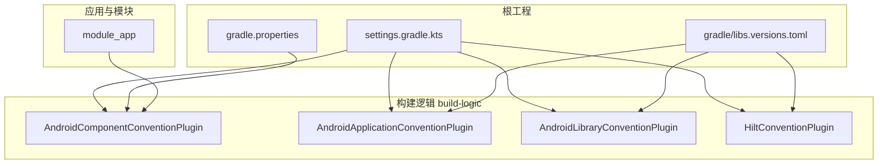
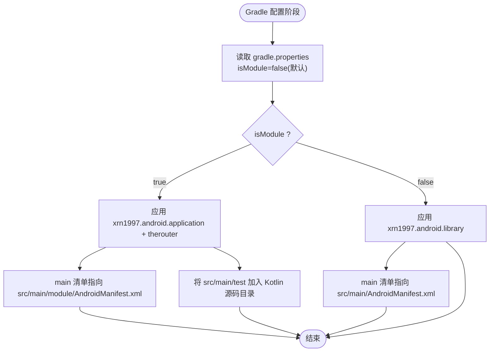
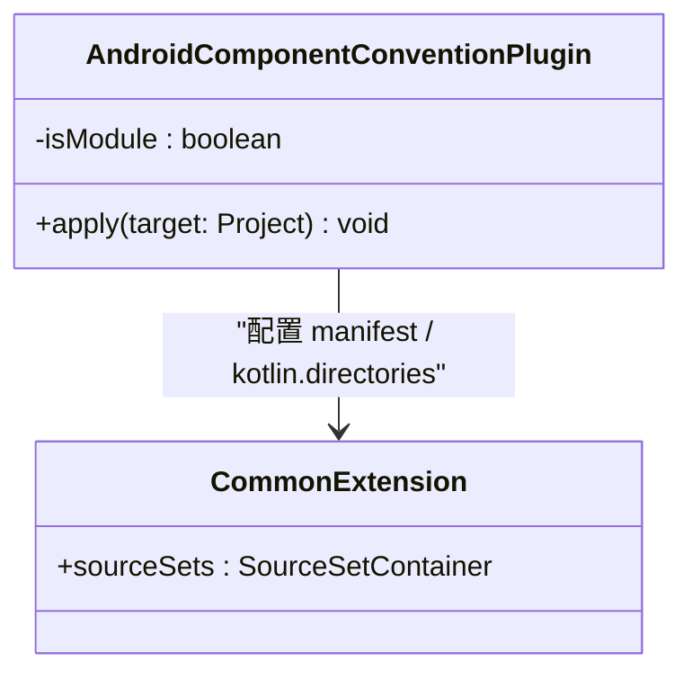
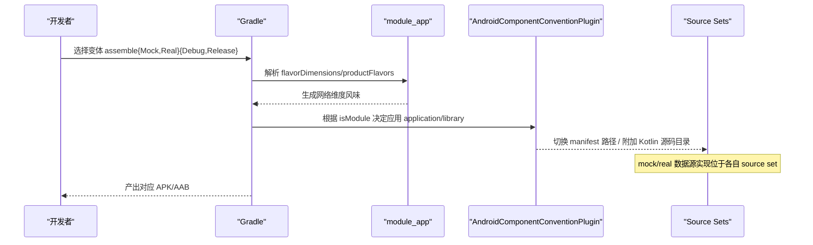
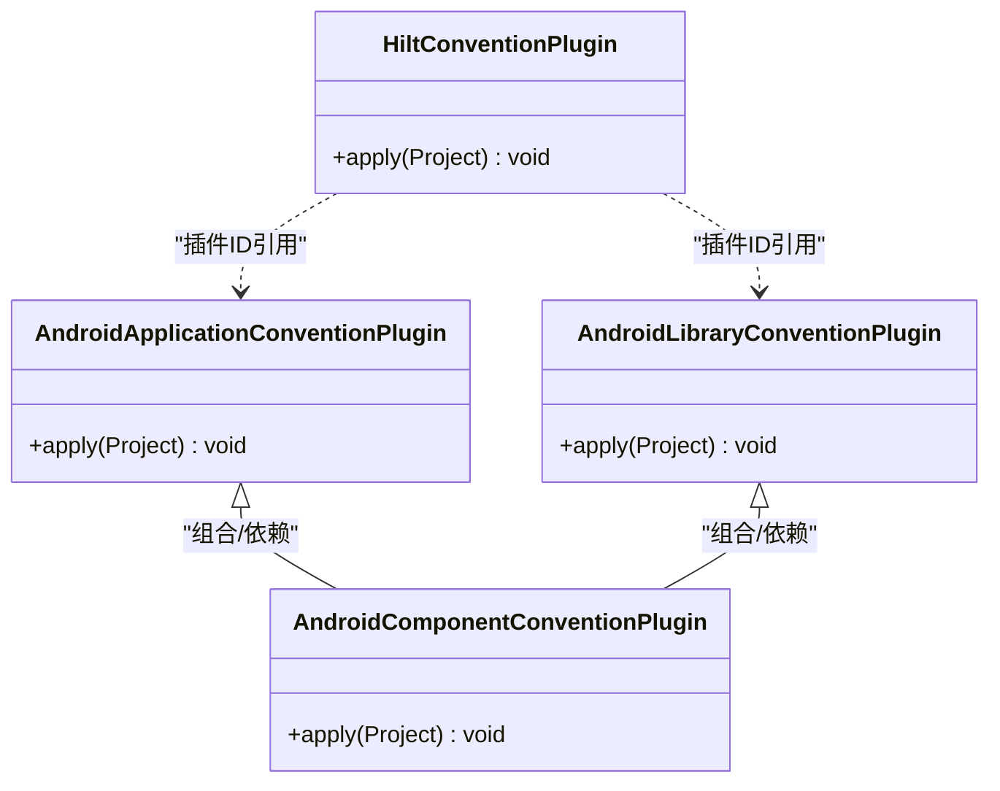
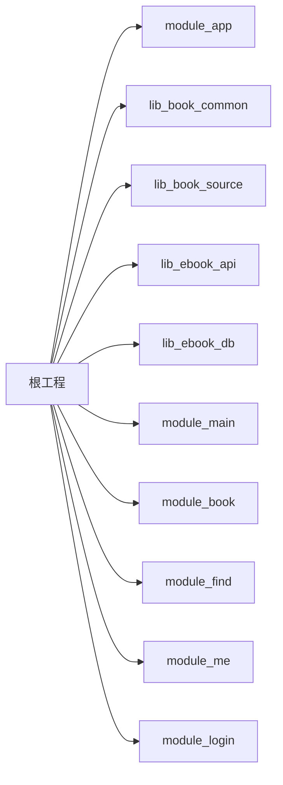

# 构建配置与模块化

<cite>
**本文引用的文件**
- [settings.gradle.kts](file://settings.gradle.kts)
- [gradle.properties](file://gradle.properties)
- [gradle/libs.versions.toml](file://gradle/libs.versions.toml)
- [AndroidComponentConventionPlugin.kt](file://build-logic/convention/src/main/kotlin/AndroidComponentConventionPlugin.kt)
- [AndroidApplicationConventionPlugin.kt](file://build-logic/convention/src/main/kotlin/AndroidApplicationConventionPlugin.kt)
- [AndroidLibraryConventionPlugin.kt](file://build-logic/convention/src/main/kotlin/AndroidLibraryConventionPlugin.kt)
- [HiltConventionPlugin.kt](file://build-logic/convention/src/main/kotlin/HiltConventionPlugin.kt)
- [module_app/build.gradle.kts](file://module_app/build.gradle.kts)
</cite>

## 目录
1. [简介](#简介)
2. [项目结构](#项目结构)
3. [核心组件](#核心组件)
4. [架构总览](#架构总览)
5. [详细组件分析](#详细组件分析)
6. [依赖分析](#依赖分析)
7. [性能考虑](#性能考虑)
8. [故障排查指南](#故障排查指南)
9. [结论](#结论)
10. [附录](#附录)

## 简介
本文件聚焦 Gradle 多模块项目的构建架构与模块化策略，系统性说明：
- isModule 切换机制及其对 AndroidComponentConventionPlugin 的影响范围
- product flavor 与 source set 管理（mock/real 数据源切换）
- 自定义约定插件 xrn1997.android.* 系列的设计与作用域
- 版本目录 libs.versions.toml 的规范与升级流程
- 并行构建、增量编译与缓存等构建性能优化措施
- 构建调试与问题定位方法

## 项目结构
根工程通过 settings 统一声明仓库、插件解析与模块集合；build-logic 集中封装约定插件；业务与应用模块通过约定插件获得一致的构建行为。

图表来源
- [settings.gradle.kts:1-66](file://settings.gradle.kts#L1-L66)
- [AndroidComponentConventionPlugin.kt:1-35](file://build-logic/convention/src/main/kotlin/AndroidComponentConventionPlugin.kt#L1-L35)
- [AndroidApplicationConventionPlugin.kt:28-49](file://build-logic/convention/src/main/kotlin/AndroidApplicationConventionPlugin.kt#L28-L49)
- [AndroidLibraryConventionPlugin.kt:30-69](file://build-logic/convention/src/main/kotlin/AndroidLibraryConventionPlugin.kt#L30-L69)
- [HiltConventionPlugin.kt:24-49](file://build-logic/convention/src/main/kotlin/HiltConventionPlugin.kt#L24-L49)
- [gradle/libs.versions.toml:214-237](file://gradle/libs.versions.toml#L214-L237)

章节来源
- [settings.gradle.kts:1-66](file://settings.gradle.kts#L1-L66)
- [gradle.properties:1-36](file://gradle.properties#L1-L36)
- [gradle/libs.versions.toml:1-237](file://gradle/libs.versions.toml#L1-L237)

## 核心组件
- 约定插件族：xrn1997.android.application/library/lint/hilt/component/native 等，在 build-logic 中统一实现并对外暴露插件 ID。
- 组件开关：isModule 控制功能模块在“独立运行”和“集成库”两种形态之间切换。
- 产品风味：network 维度下的 real/mock，配合 source set 提供 mock/real 数据源注入。
- 版本目录：libs.versions.toml 集中管理依赖与插件版本，模块脚本通过 alias 引用。

章节来源
- [AndroidComponentConventionPlugin.kt:1-35](file://build-logic/convention/src/main/kotlin/AndroidComponentConventionPlugin.kt#L1-L35)
- [AndroidApplicationConventionPlugin.kt:28-49](file://build-logic/convention/src/main/kotlin/AndroidApplicationConventionPlugin.kt#L28-L49)
- [AndroidLibraryConventionPlugin.kt:30-69](file://build-logic/convention/src/main/kotlin/AndroidLibraryConventionPlugin.kt#L30-L69)
- [HiltConventionPlugin.kt:24-49](file://build-logic/convention/src/main/kotlin/HiltConventionPlugin.kt#L24-L49)
- [gradle/libs.versions.toml:214-237](file://gradle/libs.versions.toml#L214-L237)

## 架构总览
下图展示 isModule 开关如何影响 AndroidComponentConventionPlugin 的行为，以及 module_app 如何通过 product flavor 与 source set 选择 mock/real 网络层。

图表来源
- [AndroidComponentConventionPlugin.kt:9-32](file://build-logic/convention/src/main/kotlin/AndroidComponentConventionPlugin.kt#L9-L32)
- [gradle.properties:21-29](file://gradle.properties#L21-L29)

章节来源
- [AndroidComponentConventionPlugin.kt:9-32](file://build-logic/convention/src/main/kotlin/AndroidComponentConventionPlugin.kt#L9-L32)
- [gradle.properties:21-29](file://gradle.properties#L21-L29)

## 详细组件分析

### isModule 切换机制与 AndroidComponentConventionPlugin
- 读取方式：从项目属性 isModule 读取布尔值，默认 false。
- 行为分支：
  - isModule=true：应用 application 插件与路由插件；manifest 指向 module 清单；将 src/main/test 作为额外 Kotlin 源码目录并入 main，使独立运行的测试宿主参与编译。
  - isModule=false：应用 library 插件；manifest 指向常规清单；不额外添加 test 目录。
- 影响范围：该插件仅作用于“被其 applied 的功能模块”，不影响库模块或应用模块自身的构建配置（它们由对应的约定插件处理）。

图表来源
- [AndroidComponentConventionPlugin.kt:1-35](file://build-logic/convention/src/main/kotlin/AndroidComponentConventionPlugin.kt#L1-L35)

章节来源
- [AndroidComponentConventionPlugin.kt:1-35](file://build-logic/convention/src/main/kotlin/AndroidComponentConventionPlugin.kt#L1-L35)
- [gradle.properties:21-29](file://gradle.properties#L21-L29)

### Product Flavor 与 Source Set 管理（mock/real 数据源）
- 维度与风味：在 module_app 中定义 network 维度，创建 real 与 mock 两个风味；mock 风味追加 applicationIdSuffix 以区分安装名。
- 构建类型：release 开启混淆与 R8 规则合并。
- 数据源切换：
  - 集成构建（isModule=false）：assembleRealDebug 走真实后端；assembleMockDebug 使用内存 mock 数据源。
  - 独立构建（isModule=true）：约定插件将 src/main/test 纳入 main 源码集，其 debug/ 子目录中的 MockNetworkModule 等参与编译绑定 mock。
- 清单分离：独立态使用 src/main/module/AndroidManifest.xml，集成态使用 src/main/AndroidManifest.xml，两份清单是替换关系，需保持关键 Activity 声明一致。

图表来源
- [module_app/build.gradle.kts:17-36](file://module_app/build.gradle.kts#L17-L36)
- [AndroidComponentConventionPlugin.kt:19-32](file://build-logic/convention/src/main/kotlin/AndroidComponentConventionPlugin.kt#L19-L32)
- [gradle.properties:21-29](file://gradle.properties#L21-L29)

章节来源
- [module_app/build.gradle.kts:17-36](file://module_app/build.gradle.kts#L17-L36)
- [AndroidComponentConventionPlugin.kt:19-32](file://build-logic/convention/src/main/kotlin/AndroidComponentConventionPlugin.kt#L19-L32)
- [gradle.properties:21-29](file://gradle.properties#L21-L29)

### 自定义 Gradle 约定插件设计（xrn1997.android.*）
- AndroidApplicationConventionPlugin
  - 应用 com.android.application 与 xrn1997.android.lint
  - 配置 targetSdk、applicationId、测试选项、Managed Devices、APK 打印任务
- AndroidLibraryConventionPlugin
  - 应用 com.android.library 与 xrn1997.android.lint
  - 配置测试 SDK、动画禁用、Managed Devices、单元测试依赖注入
- HiltConventionPlugin
  - 自动启用 KSP 与 Hilt 编译器依赖
  - 对 Android 模块应用 Hilt 插件并注入运行时依赖
  - 对 JVM 模块注入 Hilt Core
- AndroidComponentConventionPlugin
  - 依据 isModule 动态切换 application/library 插件
  - 调整 manifest 与 Kotlin 源码目录

图表来源
- [AndroidApplicationConventionPlugin.kt:28-49](file://build-logic/convention/src/main/kotlin/AndroidApplicationConventionPlugin.kt#L28-L49)
- [AndroidLibraryConventionPlugin.kt:30-69](file://build-logic/convention/src/main/kotlin/AndroidLibraryConventionPlugin.kt#L30-L69)
- [HiltConventionPlugin.kt:24-49](file://build-logic/convention/src/main/kotlin/HiltConventionPlugin.kt#L24-L49)
- [AndroidComponentConventionPlugin.kt:9-32](file://build-logic/convention/src/main/kotlin/AndroidComponentConventionPlugin.kt#L9-L32)

章节来源
- [AndroidApplicationConventionPlugin.kt:28-49](file://build-logic/convention/src/main/kotlin/AndroidApplicationConventionPlugin.kt#L28-L49)
- [AndroidLibraryConventionPlugin.kt:30-69](file://build-logic/convention/src/main/kotlin/AndroidLibraryConventionPlugin.kt#L30-L69)
- [HiltConventionPlugin.kt:24-49](file://build-logic/convention/src/main/kotlin/HiltConventionPlugin.kt#L24-L49)
- [AndroidComponentConventionPlugin.kt:9-32](file://build-logic/convention/src/main/kotlin/AndroidComponentConventionPlugin.kt#L9-L32)

### 依赖版本管理策略（版本目录）
- 单一事实源：所有依赖与插件版本集中在 gradle/libs.versions.toml
- 模块引用：模块脚本通过 alias(libs.plugins.*) 与 libs.xxx 引用，避免硬编码版本号
- 插件注册：根 settings 与 build-logic 通过 plugins 块引入约定插件 ID（xrn1997.*），由版本目录映射到实际插件坐标
- 升级流程建议：
  - 修改版本目录中的版本号或新增条目
  - 在模块脚本中使用 alias/lib 的方式引用
  - 全量构建验证（含依赖解析、编译、测试）
  - 对原生/AGP/KSP 等关键工具链升级后，检查 C++ 构建与 KSP 生成代码是否受影响

章节来源
- [gradle/libs.versions.toml:1-237](file://gradle/libs.versions.toml#L1-L237)
- [settings.gradle.kts:4-26](file://settings.gradle.kts#L4-L26)

### 构建性能优化措施
- 并行构建与守护进程：gradle.properties 中配置 JVM 参数与可选的并行开关，减少冷启动时间
- 增量编译与 KSP 优化：启用 KSP 增量与跨模块日志，缩短二次构建耗时
- AGP 内置 Kotlin：不再单独应用 KGP，减少插件加载与编译开销
- 资源与产物优化：非必要的 Android 测试在库模块中被禁用，减少无用构建
- 依赖解析加速：根 settings 配置多个 Maven 镜像与 Central，提升仓库解析稳定性与速度

章节来源
- [gradle.properties:16-20](file://gradle.properties#L16-L20)
- [AndroidLibraryConventionPlugin.kt:51-63](file://build-logic/convention/src/main/kotlin/AndroidLibraryConventionPlugin.kt#L51-L63)
- [settings.gradle.kts:4-19](file://settings.gradle.kts#L4-L19)

## 依赖分析
- 模块包含：根 settings 明确 include 各模块，形成清晰的模块边界
- 应用装配：module_app 在集成态依赖全部功能模块，独立态仅自身可运行
- 插件依赖：约定插件通过版本目录统一管理，保证一致性

图表来源
- [settings.gradle.kts:55-66](file://settings.gradle.kts#L55-L66)
- [module_app/build.gradle.kts:47-58](file://module_app/build.gradle.kts#L47-L58)

章节来源
- [settings.gradle.kts:55-66](file://settings.gradle.kts#L55-L66)
- [module_app/build.gradle.kts:47-58](file://module_app/build.gradle.kts#L47-L58)

## 性能考虑
- 使用 isModule=false 进行集成构建时，会一次性编译更多模块；开发期建议按需只构建目标模块
- 利用 KSP 增量与跨模块日志定位重复编译点
- 合理设置 gradle.properties 的 JVM 参数，避免 GC 抖动
- 在库模块禁用不必要的 androidTest 以减少构建负担
- 使用 flavor 切换 mock/real，避免为不同后端维护多套分支

[本节为通用指导，无需具体文件引用]

## 故障排查指南
- 构建失败
  - 症状：命令行 -PisModule=true 导致 includeBuild 联动模块被错误地应用 application 插件
  - 排查：确认 gradle.properties 的 isModule 字段；避免使用 -P 覆盖
  - 参考
    - [gradle.properties:21-29](file://gradle.properties#L21-L29)
- 清单不一致
  - 症状：独立模式与集成模式行为差异
  - 排查：对比 src/main/module/ 与 src/main/ 下 AndroidManifest.xml 的关键 Activity 声明
  - 参考
    - [AndroidComponentConventionPlugin.kt:19-32](file://build-logic/convention/src/main/kotlin/AndroidComponentConventionPlugin.kt#L19-L32)
- 路由丢失
  - 症状：独立模式下跨模块跳转静默失效
  - 排查：在独立模式宿主补充占位路由；注意 TheRouter 回写 routeMap 需二次构建
  - 参考
    - [module_app/build.gradle.kts:6-8](file://module_app/build.gradle.kts#L6-L8)
- 依赖冲突
  - 症状：版本不匹配导致编译失败
  - 排查：统一在版本目录中升级；使用 ./gradlew dependencies 查看冲突树
  - 参考
    - [gradle/libs.versions.toml:1-237](file://gradle/libs.versions.toml#L1-L237)
- 性能瓶颈
  - 症状：构建缓慢
  - 排查：启用 KSP 增量日志、减少无关 androidTest、使用并行构建
  - 参考
    - [gradle.properties:16-20](file://gradle.properties#L16-L20)
    - [AndroidLibraryConventionPlugin.kt:51-63](file://build-logic/convention/src/main/kotlin/AndroidLibraryConventionPlugin.kt#L51-L63)

章节来源
- [gradle.properties:21-29](file://gradle.properties#L21-L29)
- [AndroidComponentConventionPlugin.kt:19-32](file://build-logic/convention/src/main/kotlin/AndroidComponentConventionPlugin.kt#L19-L32)
- [module_app/build.gradle.kts:6-8](file://module_app/build.gradle.kts#L6-L8)
- [gradle/libs.versions.toml:1-237](file://gradle/libs.versions.toml#L1-L237)
- [gradle.properties:16-20](file://gradle.properties#L16-L20)
- [AndroidLibraryConventionPlugin.kt:51-63](file://build-logic/convention/src/main/kotlin/AndroidLibraryConventionPlugin.kt#L51-L63)

## 结论
本项目通过 build-logic 集中化的约定插件族与 isModule 开关，实现了“功能模块既可独立运行又可作为库被集成”的双态构建；借助 product flavor 与 source set 完成 mock/real 数据源的无缝切换；版本目录统一管理依赖与插件版本，降低升级与维护成本；同时通过 KSP 增量、并行构建与测试裁剪等手段优化构建性能。遵循上述约定可在多模块协作中保持构建一致性与可维护性。

[本节为总结，无需具体文件引用]

## 附录
- 常用命令
  - 集成构建：./gradlew :module_app:assembleRealDebug
  - Mock 构建：./gradlew :module_app:assembleMockDebug
  - 清理构建：./gradlew clean
  - 全量测试：./gradlew test
- 快速定位技巧
  - 使用 ./gradlew :module:tasks 查看可用任务
  - 使用 ./gradlew :module:dependencies --configuration debugRuntimeClasspath 查看依赖树
  - 在模块 build.gradle.kts 中临时输出变量帮助定位 isModule 与 flavor 生效情况

[本节为补充信息，无需具体文件引用]