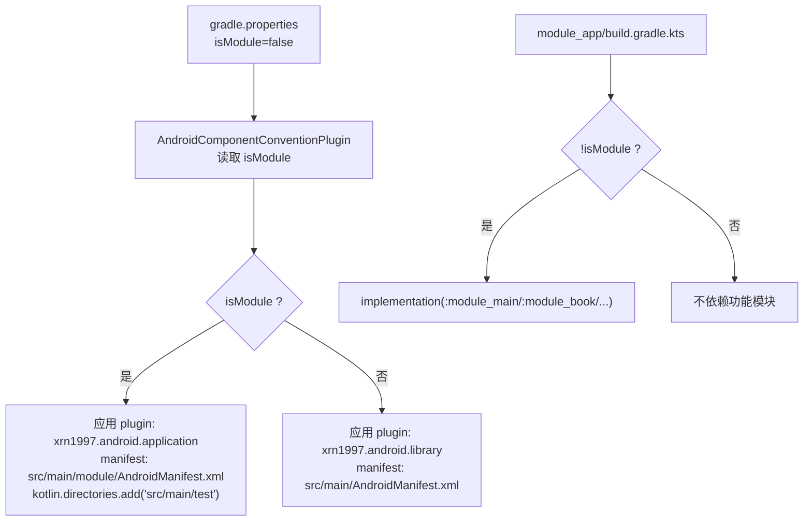
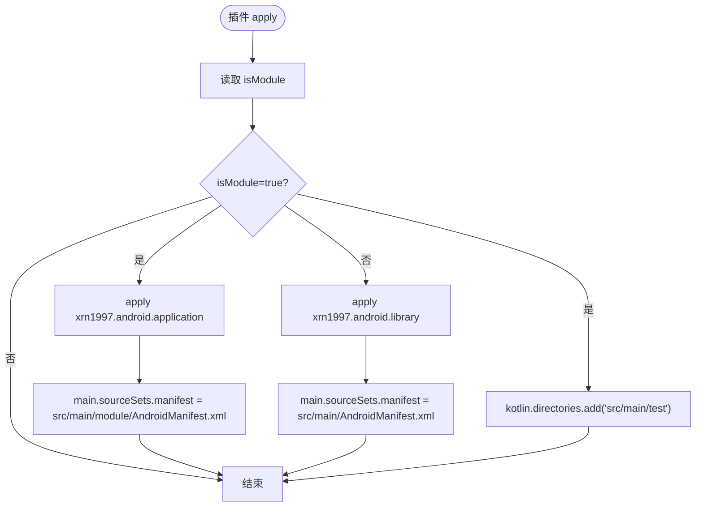
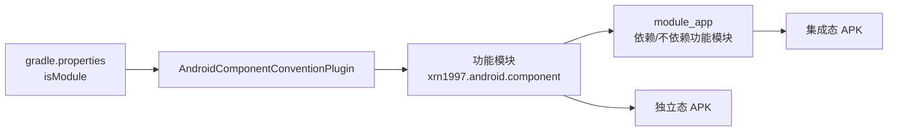
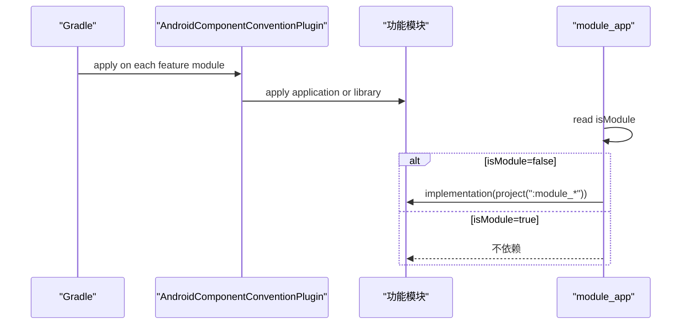
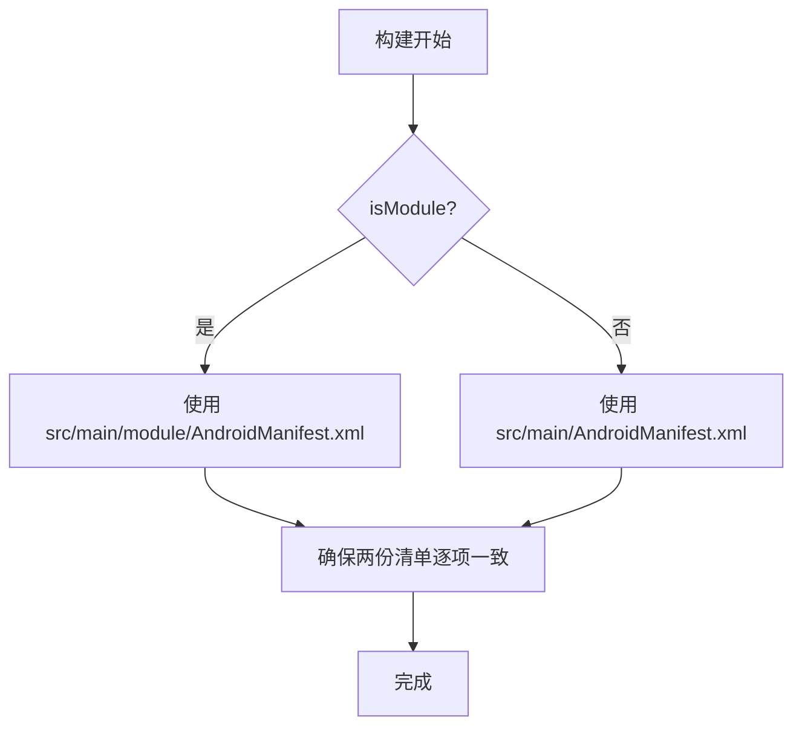
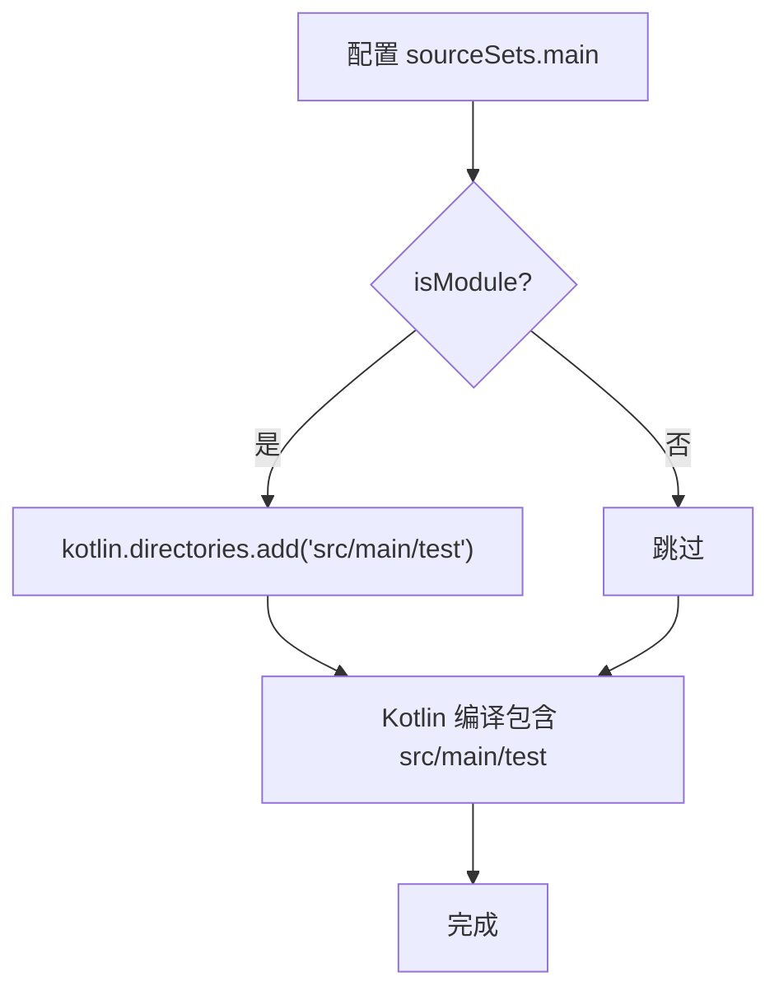
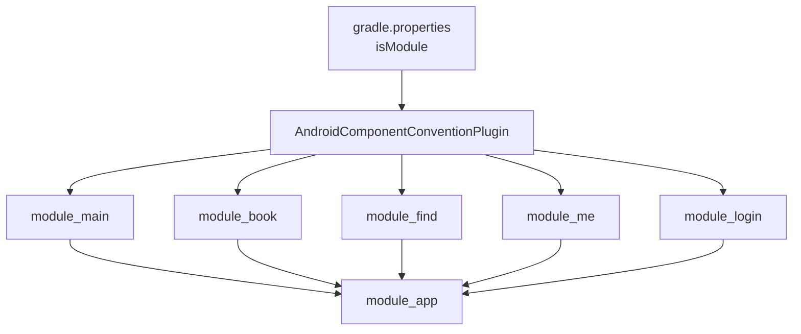

# 模块切换机制（isModule）

<cite>
**本文引用的文件**
- [AndroidComponentConventionPlugin.kt](file://build-logic/convention/src/main/kotlin/AndroidComponentConventionPlugin.kt)
- [gradle.properties](file://gradle.properties)
- [settings.gradle.kts](file://settings.gradle.kts)
- [module_app/build.gradle.kts](file://module_app/build.gradle.kts)
- [module_main/build.gradle.kts](file://module_main/build.gradle.kts)
- [module_main/src/main/AndroidManifest.xml](file://module_main/src/main/AndroidManifest.xml)
- [module_main/src/main/module/AndroidManifest.xml](file://module_main/src/main/module/AndroidManifest.xml)
</cite>

## 目录
1. [简介](#简介)
2. [项目结构与触发点](#项目结构与触发点)
3. [核心组件：AndroidComponentConventionPlugin](#核心组件androidcomponentconventionplugin)
4. [架构总览](#架构总览)
5. [详细组件分析](#详细组件分析)
6. [依赖关系与耦合分析](#依赖关系与耦合分析)
7. [性能与构建特性](#性能与构建特性)
8. [独立模块开发工作流](#独立模块开发工作流)
9. [常见问题诊断](#常见问题诊断)
10. [结论](#结论)

## 简介
本文件围绕 isModule 属性，系统性说明 Android 功能模块在“集成态”和“独立态”两种构建形态下的行为差异，以及如何在 build-logic 约定插件中通过 isModule 控制应用/库切换、清单选择与 Kotlin 源码目录合并。文档同时给出使用规范、约束条件、常见故障排查方法，帮助开发者在双态下安全、可预期地开发与调试。

## 项目结构与触发点
- isModule 的默认值与使用说明位于根 gradle.properties；提交态必须为 false，临时调试可改为 true，但禁止通过命令行 -P 覆盖。
- settings.gradle.kts 负责 include 各模块；当启用 includeBuild("lib-common-build") 时，-P 会穿透到被 includeBuild 的子构建，导致 lib_common 被错误套上 application 插件而冲突。
- module_app 在 isModule=false 时依赖所有功能模块，true 时不依赖任何功能模块（产出空壳 App）。
- 功能模块统一通过约定插件 xrn1997.android.component 接入 isModule 控制逻辑。

图表来源
- [gradle.properties:21-29](file://gradle.properties#L21-L29)
- [AndroidComponentConventionPlugin.kt:9-33](file://build-logic/convention/src/main/kotlin/AndroidComponentConventionPlugin.kt#L9-L33)
- [module_app/build.gradle.kts:47-58](file://module_app/build.gradle.kts#L47-L58)

章节来源
- [gradle.properties:21-29](file://gradle.properties#L21-L29)
- [settings.gradle.kts:46-53](file://settings.gradle.kts#L46-L53)
- [module_app/build.gradle.kts:47-58](file://module_app/build.gradle.kts#L47-L58)

## 核心组件：AndroidComponentConventionPlugin
该约定插件是所有功能模块的统一入口，依据 isModule 决定：
- 插件类型：application 或 library
- Manifest 文件：独立态使用 src/main/module/AndroidManifest.xml，集成态使用 src/main/AndroidManifest.xml
- Kotlin 源码目录：独立态将 src/main/test 作为额外 Kotlin 源码目录并入 main source set，使 test/debug 下的宿主代码参与编译（注意：仅影响 Kotlin 编译任务，KSP 仍可见 java.srcDirs，因此必须用 kotlin.directories）

图表来源
- [AndroidComponentConventionPlugin.kt:9-33](file://build-logic/convention/src/main/kotlin/AndroidComponentConventionPlugin.kt#L9-L33)

章节来源
- [AndroidComponentConventionPlugin.kt:9-33](file://build-logic/convention/src/main/kotlin/AndroidComponentConventionPlugin.kt#L9-L33)

## 架构总览
isModule 从配置到产物贯穿以下链路：
- 配置层：gradle.properties 提供 isModule；settings.gradle.kts 管理 include 与 includeBuild；module_app 根据 isModule 决定是否依赖功能模块
- 约定层：AndroidComponentConventionPlugin 在 each 功能模块上生效，切换 application/library、清单路径与 Kotlin 源码目录
- 产物层：独立态以 application 形式输出 APK，包含独立运行所需 Activity 与路由占位；集成态以 library 形式输出 AAR，由 module_app 组装完整应用

图表来源
- [gradle.properties:21-29](file://gradle.properties#L21-L29)
- [AndroidComponentConventionPlugin.kt:9-33](file://build-logic/convention/src/main/kotlin/AndroidComponentConventionPlugin.kt#L9-L33)
- [module_app/build.gradle.kts:47-58](file://module_app/build.gradle.kts#L47-L58)

## 详细组件分析

### 应用/库切换（application vs library）
- isModule=true：对每个功能模块应用 xrn1997.android.application，使其成为可独立运行的 Application
- isModule=false：应用 xrn1997.android.library，作为 AAR 被 module_app 依赖
- module_app 中按 isModule 决定是否依赖 :module_main/:module_book/:module_find/:module_me/:module_login，true 时不依赖（产出空壳），false 时依赖全部

图表来源
- [AndroidComponentConventionPlugin.kt:9-17](file://build-logic/convention/src/main/kotlin/AndroidComponentConventionPlugin.kt#L9-L17)
- [module_app/build.gradle.kts:47-58](file://module_app/build.gradle.kts#L47-L58)

章节来源
- [AndroidComponentConventionPlugin.kt:9-17](file://build-logic/convention/src/main/kotlin/AndroidComponentConventionPlugin.kt#L9-L17)
- [module_app/build.gradle.kts:47-58](file://module_app/build.gradle.kts#L47-L58)

### Manifest 文件选择（双清单）
- isModule=true：main 的 manifest 指向 src/main/module/AndroidManifest.xml
- isModule=false：main 的 manifest 指向 src/main/AndroidManifest.xml
- 两份清单是替换关系，Activity 声明及其属性（launchMode/theme/label/exported 等）必须同步修改，否则两种模式行为不一致

图表来源
- [AndroidComponentConventionPlugin.kt:19-31](file://build-logic/convention/src/main/kotlin/AndroidComponentConventionPlugin.kt#L19-L31)
- [module_main/src/main/AndroidManifest.xml:1-27](file://module_main/src/main/AndroidManifest.xml#L1-L27)
- [module_main/src/main/module/AndroidManifest.xml:1-28](file://module_main/src/main/module/AndroidManifest.xml#L1-L28)

章节来源
- [AndroidComponentConventionPlugin.kt:19-31](file://build-logic/convention/src/main/kotlin/AndroidComponentConventionPlugin.kt#L19-L31)
- [module_main/src/main/AndroidManifest.xml:1-27](file://module_main/src/main/AndroidManifest.xml#L1-L27)
- [module_main/src/main/module/AndroidManifest.xml:1-28](file://module_main/src/main/module/AndroidManifest.xml#L1-L28)

### Kotlin 源码目录配置（src/main/test 并入 main）
- isModule=true：将 src/main/test 加入 main 的 kotlin.directories，使该目录下的 Kotlin 源码（尤其是 debug/ 下的 TestApplication、MockNetworkModule、占位 Activity 等）参与编译并绑定 mock
- 注意：只影响 Kotlin 编译任务；java.srcDirs 不会被 Kotlin 编译拾取（但 KSP 仍可见），因此必须使用 kotlin.directories
- 集成态（isModule=false）不会编译 src/main/test，避免与 main 抢类

图表来源
- [AndroidComponentConventionPlugin.kt:19-31](file://build-logic/convention/src/main/kotlin/AndroidComponentConventionPlugin.kt#L19-L31)

章节来源
- [AndroidComponentConventionPlugin.kt:19-31](file://build-logic/convention/src/main/kotlin/AndroidComponentConventionPlugin.kt#L19-L31)

### module_app 的依赖注入开关
- isModule=false：module_app 依赖所有功能模块，形成完整应用
- isModule=true：不依赖任何功能模块，产出空壳 App（用于独立调试某个模块）

章节来源
- [module_app/build.gradle.kts:47-58](file://module_app/build.gradle.kts#L47-L58)

### 混淆与 R8 行为
- 功能模块 release 的 isMinifyEnabled=isModule：独立态开启 R8 尽早暴露规则缺口；集成态关闭以避免 AGP 对 library 执行 R8 剥离类导致 module_app 的 R8 找不到依赖

章节来源
- [module_main/build.gradle.kts:24-35](file://module_main/build.gradle.kts#L24-L35)

## 依赖关系与耦合分析
- 松耦合：isModule 通过约定插件集中处理，业务模块只需遵循“双清单同步”“测试源集命名约定”即可
- 关键耦合点：
  - gradle.properties 的 isModule 是唯一事实源
  - AndroidComponentConventionPlugin 是行为分叉的唯一入口
  - module_app 的依赖开关影响最终 APK 组成
  - 双清单与路由占位需人工同步

图表来源
- [gradle.properties:21-29](file://gradle.properties#L21-L29)
- [AndroidComponentConventionPlugin.kt:9-33](file://build-logic/convention/src/main/kotlin/AndroidComponentConventionPlugin.kt#L9-L33)
- [module_app/build.gradle.kts:47-58](file://module_app/build.gradle.kts#L47-L58)

## 性能与构建特性
- AGP 内置 Kotlin：添加 Kotlin 源码目录必须走 kotlin.directories，避免 java.srcDirs 不被 Kotlin 编译拾取的错位
- 独立态 R8：提前暴露混淆规则问题，有利于早发现问题
- 双清单：减少运行时行为差异，降低回归风险

[本节为通用指导，无需具体文件引用]

## 独立模块开发工作流
- 准备
  - 将 gradle.properties 中的 isModule 临时改为 true（调试完成后改回 false，不要提交）
  - 切勿使用 ./gradlew -PisModule=true，以免渗入 includeBuild(lib-common-build) 导致 lib_common 插件冲突
- 清单同步
  - 在 src/main/module/AndroidManifest.xml 与 src/main/AndroidManifest.xml 中保持 Activity 声明及属性一致
- Mock 数据源装配
  - 在 src/main/test/debug/ 下提供 TestApplication、MockNetworkModule 等，独立态随 kotlin.directories 并入 main 编译
- 路由占位实现
  - 跨模块路由在独立模式下静默丢失，需在 src/main/test/debug/ 中以 @Route 挂同名路径占位
  - 新增/改动 @Route 后，routeMap 资产由 TheRouter transform 回写，需再构建一次才生效
- 验证
  - 单独运行目标模块，确认页面、路由、mock 数据正常
  - 切回 isModule=false，验证集成态不受影响

[本节为流程性说明，无特定代码片段引用]

## 常见问题诊断
- 路由丢失
  - 症状：独立模式下跳转其他模块路由无效
  - 原因：未在该模块 src/main/test/debug/ 提供 @Route 占位
  - 处理：补齐占位并重新构建
- 清单权限不同步
  - 症状：独立态与集成态表现不一致
  - 原因：两份清单未逐项对齐
  - 处理：同步修改并核对合并后的清单
- 依赖冲突
  - 症状：includeBuild(lib-common-build) 时出现 application/library 冲突
  - 原因：使用 -PisModule=true 覆盖导致 lib_common 也被套上 application 插件
  - 处理：改用 gradle.properties 直接修改 isModule，并恢复默认 false
- 构建成功但页面空白/无数据
  - 症状：页面不闪退、数据永远加载不出来
  - 可能原因：路由未注册、mock 数据源未装配、清单权限缺失
  - 处理：检查路由、mock、清单权限，逐一验证

[本节基于仓库约定与插件行为的总结性指导]

## 结论
isModule 是本项目模块化构建的核心开关，通过单一约定插件集中控制应用/库切换、清单选择与 Kotlin 源码目录合并。严格遵循“提交态 false、临时调试真、禁用 -P 覆盖、双清单同步、路由占位补齐”的规范，可以在集成与独立两种形态下高效、稳定地开发功能模块。遇到路由、清单、依赖相关问题时，优先从上述关键点入手定位与修复。