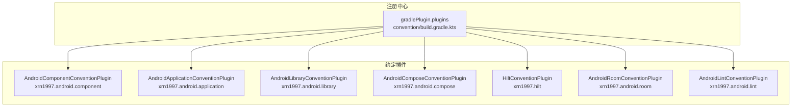
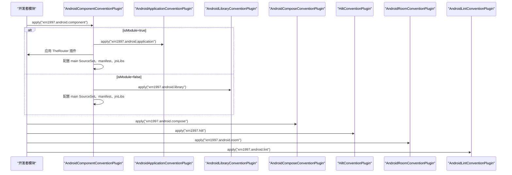
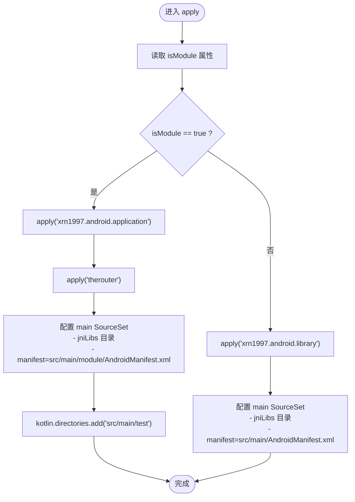
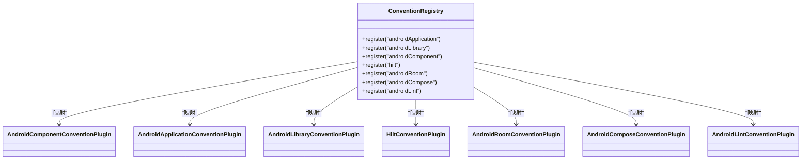

# 自定义 Gradle 约定插件

<cite>
**本文引用的文件**   
- [AndroidComponentConventionPlugin.kt](file://build-logic/convention/src/main/kotlin/AndroidComponentConventionPlugin.kt)
- [AndroidApplicationConventionPlugin.kt](file://build-logic/convention/src/main/kotlin/AndroidApplicationConventionPlugin.kt)
- [AndroidLibraryConventionPlugin.kt](file://build-logic/convention/src/main/kotlin/AndroidLibraryConventionPlugin.kt)
- [HiltConventionPlugin.kt](file://build-logic/convention/src/main/kotlin/HiltConventionPlugin.kt)
- [AndroidComposeConventionPlugin.kt](file://build-logic/convention/src/main/kotlin/AndroidComposeConventionPlugin.kt)
- [AndroidRoomConventionPlugin.kt](file://build-logic/convention/src/main/kotlin/AndroidRoomConventionPlugin.kt)
- [AndroidLintConventionPlugin.kt](file://build-logic/convention/src/main/kotlin/AndroidLintConventionPlugin.kt)
- [convention/build.gradle.kts](file://build-logic/convention/build.gradle.kts)
</cite>

## 目录
1. [简介](#简介)
2. [项目结构](#项目结构)
3. [核心组件](#核心组件)
4. [架构总览](#架构总览)
5. [详细组件分析](#详细组件分析)
6. [依赖关系分析](#依赖关系分析)
7. [性能与构建特性](#性能与构建特性)
8. [常见问题排查](#常见问题排查)
9. [结论](#结论)
10. [附录：插件开发指南](#附录：插件开发指南)

## 简介
本仓库通过 build-logic/convention 模块集中封装 Android 项目的通用构建逻辑，并以 xrn1997.* 系列插件 ID 对外暴露。其设计目标是：
- 将重复的 AGP、Kotlin、Compose、Hilt、Room、Lint 等配置收敛到约定插件中，减少各模块 build.gradle.kts 的样板代码
- 以 isModule 开关实现“功能模块独立运行”和“作为 library 被应用集成”的双态构建
- 用最小侵入的方式自动装配注解处理器（如 KSP）与依赖注入工具链（Hilt）
- 提供可扩展的模块化约定，便于后续新增原生构建、测试设备等能力

## 项目结构
约定插件集中在 build-logic/convention/src/main/kotlin 下，每个 Kotlin 文件对应一个约定插件或一组相关扩展；插件 ID 在 convention 模块的 build.gradle.kts 中以 gradlePlugin.plugins 注册表统一声明。

图表来源
- [convention/build.gradle.kts:40-79](file://build-logic/convention/build.gradle.kts#L40-L79)

章节来源
- [convention/build.gradle.kts:1-79](file://build-logic/convention/build.gradle.kts#L1-L79)

## 核心组件
- AndroidComponentConventionPlugin：根据 isModule 动态决定应用 application 或 library 基础插件，并配置 SourceSet、清单、JNI 库目录等
- AndroidApplicationConventionPlugin：为 Application 模块统一配置 targetSdk、applicationId、测试设备、打印 APK 任务等
- AndroidLibraryConventionPlugin：为 Library 模块统一配置测试、依赖注入、测试设备与可选 androidTest 依赖
- HiltConventionPlugin：启用 KSP，按 Android/JVM 分别注入 Hilt 运行时与编译器
- AndroidComposeConventionPlugin：按 isModule 套入 application/library 基础插件，并开启 Compose 编译能力
- AndroidRoomConventionPlugin：启用 Room3 与 KSP，生成 Kotlin 源码并输出 schema 目录
- AndroidLintConventionPlugin：统一 Lint 报告与依赖检查策略

章节来源
- [AndroidComponentConventionPlugin.kt:7-34](file://build-logic/convention/src/main/kotlin/AndroidComponentConventionPlugin.kt#L7-L34)
- [AndroidApplicationConventionPlugin.kt:28-49](file://build-logic/convention/src/main/kotlin/AndroidApplicationConventionPlugin.kt#L28-L49)
- [AndroidLibraryConventionPlugin.kt:30-69](file://build-logic/convention/src/main/kotlin/AndroidLibraryConventionPlugin.kt#L30-L69)
- [HiltConventionPlugin.kt:24-49](file://build-logic/convention/src/main/kotlin/HiltConventionPlugin.kt#L24-L49)
- [AndroidComposeConventionPlugin.kt:37-58](file://build-logic/convention/src/main/kotlin/AndroidComposeConventionPlugin.kt#L37-L58)
- [AndroidRoomConventionPlugin.kt:26-52](file://build-logic/convention/src/main/kotlin/AndroidRoomConventionPlugin.kt#L26-L52)
- [AndroidLintConventionPlugin.kt:25-47](file://build-logic/convention/src/main/kotlin/AndroidLintConventionPlugin.kt#L25-L47)

## 架构总览
约定插件以“可组合”的方式工作：AndroidComponentConventionPlugin 充当“入口”，依据 isModule 选择 application 或 library 约定，再叠加 Compose/Hilt/Room/Lint 等横切能力。各插件之间通过 Gradle PluginManager 与 Extension DSL 协作，避免相互直接耦合。

图表来源
- [AndroidComponentConventionPlugin.kt:9-33](file://build-logic/convention/src/main/kotlin/AndroidComponentConventionPlugin.kt#L9-L33)
- [AndroidApplicationConventionPlugin.kt:29-47](file://build-logic/convention/src/main/kotlin/AndroidApplicationConventionPlugin.kt#L29-L47)
- [AndroidLibraryConventionPlugin.kt:31-54](file://build-logic/convention/src/main/kotlin/AndroidLibraryConventionPlugin.kt#L31-L54)
- [AndroidComposeConventionPlugin.kt:38-57](file://build-logic/convention/src/main/kotlin/AndroidComposeConventionPlugin.kt#L38-L57)
- [HiltConventionPlugin.kt:25-47](file://build-logic/convention/src/main/kotlin/HiltConventionPlugin.kt#L25-L47)
- [AndroidRoomConventionPlugin.kt:28-49](file://build-logic/convention/src/main/kotlin/AndroidRoomConventionPlugin.kt#L28-L49)
- [AndroidLintConventionPlugin.kt:26-41](file://build-logic/convention/src/main/kotlin/AndroidLintConventionPlugin.kt#L26-L41)

## 详细组件分析

### AndroidComponentConventionPlugin：双态模块入口
- 作用
  - 读取 isModule 属性，true 时应用 application 基础插件并附加 TheRouter；false 时应用 library 基础插件
  - 基于 AGP 9 CommonExtension 配置 main SourceSet：添加 jniLibs 目录、切换 manifest 路径
  - 在独立模式下额外将 src/main/test 加入 kotlin.directories，使调试宿主参与编译
- 关键行为
  - isModule=true：manifest 指向 src/main/module/AndroidManifest.xml，并将 test 目录并入 Kotlin 编译源集
  - isModule=false：manifest 指向 src/main/AndroidManifest.xml
- 复杂度与影响
  - 时间复杂度 O(1)，空间复杂度 O(1)
  - 注意：AGP 9 内置 Kotlin 下应使用 kotlin.directories 而非 java.srcDirs，否则会出现 KSP 生成代码而 Kotlin 未编译的错位

章节来源
- [AndroidComponentConventionPlugin.kt:7-34](file://build-logic/convention/src/main/kotlin/AndroidComponentConventionPlugin.kt#L7-L34)

#### 流程图：isModule 分支与 SourceSet 配置

图表来源
- [AndroidComponentConventionPlugin.kt:9-33](file://build-logic/convention/src/main/kotlin/AndroidComponentConventionPlugin.kt#L9-L33)

### AndroidApplicationConventionPlugin vs AndroidLibraryConventionPlugin
- AndroidApplicationConventionPlugin
  - 目标：Application 模块的统一基线
  - 关键点：targetSdk 固定、applicationId 默认等于 namespace、启用测试设备管理、打印 APK 任务
- AndroidLibraryConventionPlugin
  - 目标：Library 模块的统一基线
  - 关键点：testOptions 返回默认值、注入 junit 与 kotlin-test、仅当存在 androidTest 时才注入 androidTest 依赖、禁用不必要的 androidTest 变体
- 适用场景
  - 业务入口模块使用 application 约定
  - 功能/基础库使用 library 约定
  - 两者都可通过 isModule 在独立运行与集成构建间切换

章节来源
- [AndroidApplicationConventionPlugin.kt:28-49](file://build-logic/convention/src/main/kotlin/AndroidApplicationConventionPlugin.kt#L28-L49)
- [AndroidLibraryConventionPlugin.kt:30-69](file://build-logic/convention/src/main/kotlin/AndroidLibraryConventionPlugin.kt#L30-L69)

### HiltConventionPlugin：自动化依赖注入配置
- 作用
  - 启用 KSP，并注入 Hilt 编译器与元数据依赖
  - 若检测到 JVM 模块（org.jetbrains.kotlin.jvm），注入 Hilt Core
  - 若检测到 Android 基础插件（com.android.base），注入 Hilt Android 插件与运行时依赖
- 优点
  - 模块只需 apply("xrn1997.hilt") 即可获得完整的 Hilt 构建支持，无需手写 KSP/依赖
- 注意事项
  - 需要确保模块类型正确（Android 或 JVM），否则不会注入相应依赖

章节来源
- [HiltConventionPlugin.kt:24-49](file://build-logic/convention/src/main/kotlin/HiltConventionPlugin.kt#L24-L49)

### AndroidComposeConventionPlugin：Compose 能力装配
- 作用
  - 根据 isModule 套入 application 或 library 基础插件，保证模块可独立运行
  - 启用 org.jetbrains.kotlin.plugin.compose
  - 通过 CommonExtension 统一配置 Compose 能力（版本/BOM 等由外部扩展提供）
- 特点
  - 与 AndroidComponentConventionPlugin 协同，但职责更聚焦于 Compose 能力

章节来源
- [AndroidComposeConventionPlugin.kt:37-58](file://build-logic/convention/src/main/kotlin/AndroidComposeConventionPlugin.kt#L37-L58)

### AndroidRoomConventionPlugin：Room 与 Schema
- 作用
  - 启用 androidx.room3 与 KSP，设置 room.generateKotlin=true
  - 配置 schemaDirectory 为 schemas 目录，便于自动生成迁移
  - 注入 Room 运行时、编译器与 sqlite-bundled
- 适用场景
  - 任何需要 Room 持久化的模块，apply("xrn1997.android.room") 即可

章节来源
- [AndroidRoomConventionPlugin.kt:26-52](file://build-logic/convention/src/main/kotlin/AndroidRoomConventionPlugin.kt#L26-L52)

### AndroidLintConventionPlugin：Lint 统一策略
- 作用
  - 对 Application/Library/纯 Lint 三种情况分别配置 Lint
  - 统一开启 XML 报告与依赖检查
- 价值
  - 避免各模块重复配置 Lint 行为，保证质量门禁一致

章节来源
- [AndroidLintConventionPlugin.kt:25-47](file://build-logic/convention/src/main/kotlin/AndroidLintConventionPlugin.kt#L25-L47)

## 依赖关系分析
约定插件之间的耦合度低，主要通过 Gradle 插件机制与 Extension 进行协作：
- AndroidComponentConventionPlugin 负责“路由”到 application 或 library 约定
- Hilt/Room/Compose/Lint 均为横切能力，按需应用
- 所有插件 ID 在 convention/build.gradle.kts 中注册，形成单一事实源

图表来源
- [convention/build.gradle.kts:40-79](file://build-logic/convention/build.gradle.kts#L40-L79)

章节来源
- [convention/build.gradle.kts:1-79](file://build-logic/convention/build.gradle.kts#L1-L79)

## 性能与构建特性
- AGP 9 内置 Kotlin：不再单独应用 Kotlin Android 插件，减少插件加载开销
- 仅在必要时注入依赖：例如 AndroidLibraryConventionPlugin 仅在存在 androidTest 时才注入 androidTest 依赖，避免无意义的警告与任务
- 测试设备与 APK 打印：统一通过扩展方法配置，减少各模块差异
- 插件验证：convention 模块启用了 validatePlugins 严格校验，有助于尽早发现不兼容问题

[本节为通用指导，不直接分析具体文件]

## 常见问题排查
- 插件加载失败
  - 现象：找不到 xrn1997.* 插件 ID
  - 排查：确认 build-logic 已包含进 settings 并通过 convention 模块注册了相应插件 ID
  - 参考：[convention/build.gradle.kts:40-79](file://build-logic/convention/build.gradle.kts#L40-L79)
- isModule 导致构建异常
  - 现象：独立模式或集成模式行为不一致、清单缺失、Activity 未注册
  - 排查：确认 isModule 是否被意外提交为 true；核对两份 Manifest 是否同步；确认 src/main/test 下的调试宿主是否生效
  - 参考：[AndroidComponentConventionPlugin.kt:9-33](file://build-logic/convention/src/main/kotlin/AndroidComponentConventionPlugin.kt#L9-L33)
- KSP 生成代码未被 Kotlin 编译
  - 现象：KSP 生成了代码但编译期找不到类
  - 原因：使用了 java.srcDirs 而不是 kotlin.directories
  - 处理：在独立模式下将调试源集添加到 kotlin.directories
  - 参考：[AndroidComponentConventionPlugin.kt:22-27](file://build-logic/convention/src/main/kotlin/AndroidComponentConventionPlugin.kt#L22-L27)
- Hilt 注入失效
  - 现象：@Inject 字段未注入或运行时找不到组件
  - 排查：确认已 apply("xrn1997.hilt") 且模块类型匹配（Android/JVM）；确认 KSP 已启用
  - 参考：[HiltConventionPlugin.kt:25-47](file://build-logic/convention/src/main/kotlin/HiltConventionPlugin.kt#L25-L47)
- Room Schema 未更新
  - 现象：迁移失败或无法自动生成迁移
  - 排查：确认已 apply("xrn1997.android.room") 且 schemaDirectory 配置正确
  - 参考：[AndroidRoomConventionPlugin.kt:34-43](file://build-logic/convention/src/main/kotlin/AndroidRoomConventionPlugin.kt#L34-L43)
- Lint 检查不一致
  - 现象：不同模块 lint 行为不一致
  - 排查：确认已应用 xrn1997.android.lint，XML 报告与依赖检查已开启
  - 参考：[AndroidLintConventionPlugin.kt:26-47](file://build-logic/convention/src/main/kotlin/AndroidLintConventionPlugin.kt#L26-L47)

章节来源
- [convention/build.gradle.kts:40-79](file://build-logic/convention/build.gradle.kts#L40-L79)
- [AndroidComponentConventionPlugin.kt:9-33](file://build-logic/convention/src/main/kotlin/AndroidComponentConventionPlugin.kt#L9-L33)
- [HiltConventionPlugin.kt:25-47](file://build-logic/convention/src/main/kotlin/HiltConventionPlugin.kt#L25-L47)
- [AndroidRoomConventionPlugin.kt:34-43](file://build-logic/convention/src/main/kotlin/AndroidRoomConventionPlugin.kt#L34-L43)
- [AndroidLintConventionPlugin.kt:26-47](file://build-logic/convention/src/main/kotlin/AndroidLintConventionPlugin.kt#L26-L47)

## 结论
通过 xrn1997.* 系列约定插件，本项目实现了：
- 统一的 Android 构建基线（Application/Library）
- 灵活的 isModule 双态构建（独立运行与集成构建）
- 自动化的依赖注入（Hilt）、数据库（Room）、UI（Compose）、质量门禁（Lint）配置
- 低耦合、可扩展的模块化约定体系，便于持续演进与团队复用

[本节为总结性内容，不直接分析具体文件]

## 附录：插件开发指南
- 创建新插件步骤
  - 在 convention 模块新增 Kotlin 文件，实现 org.gradle.api.Plugin<Project>
  - 在 convention/build.gradle.kts 的 gradlePlugin.plugins 中注册新的插件 ID 与实现类
  - 在模块中通过 apply("xrn1997.xxx") 使用
- 测试方法
  - 单元测试：验证插件 apply 后的 Extension 状态（如 sourceSets、dependencies）
  - 集成测试：在 sample 模块中应用约定插件，执行 assemble/test/lint 等任务
- 最佳实践
  - 遵循“单一职责”：每个插件只做一件事（如 Hilt、Room、Compose、Lint）
  - 通过 withPlugin 探测模块类型再注入依赖，避免误配
  - 使用 Kotlin DSL 与 Extension 进行配置，保持可读性与稳定性
  - 对 AGP 9 的新 DSL（CommonExtension）保持一致的配置方式
  - 谨慎修改 isModule 分支，确保独立与集成两种模式均稳定

[本节为通用指导，不直接分析具体文件]