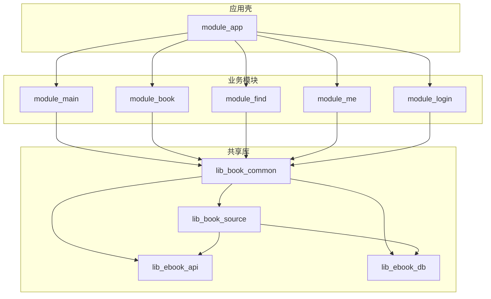
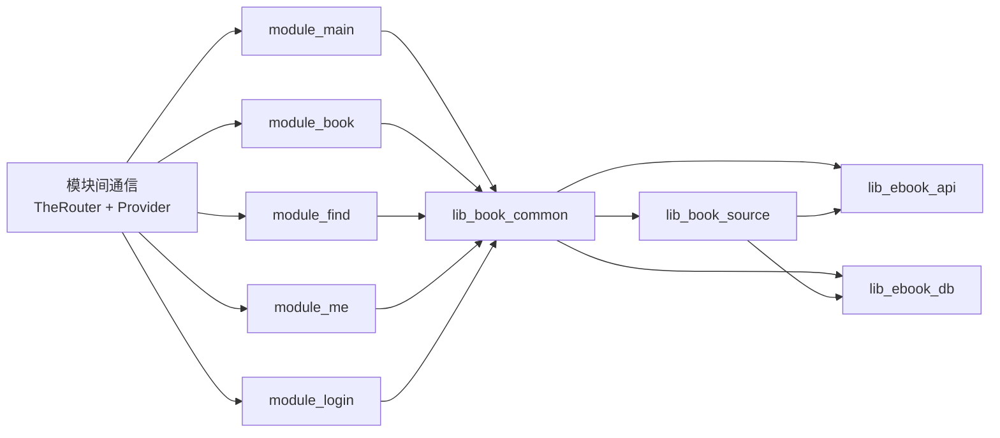
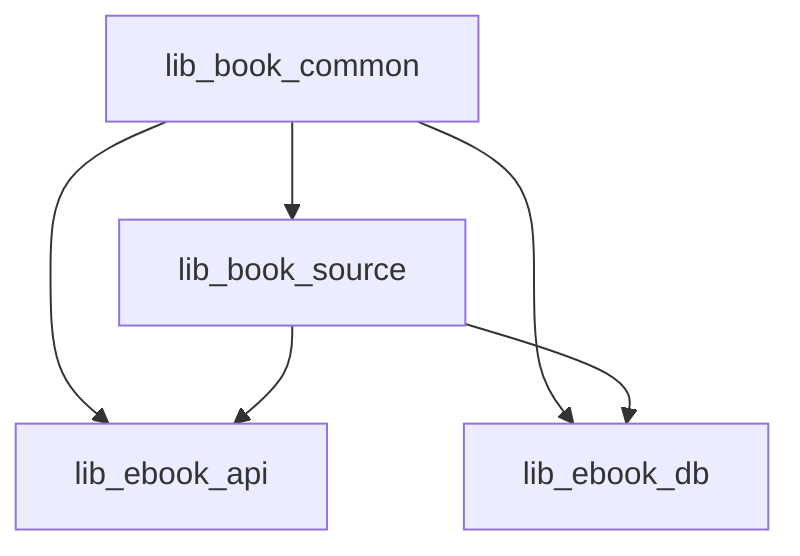
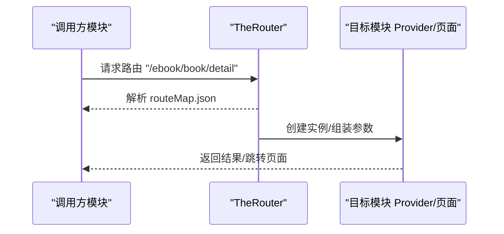
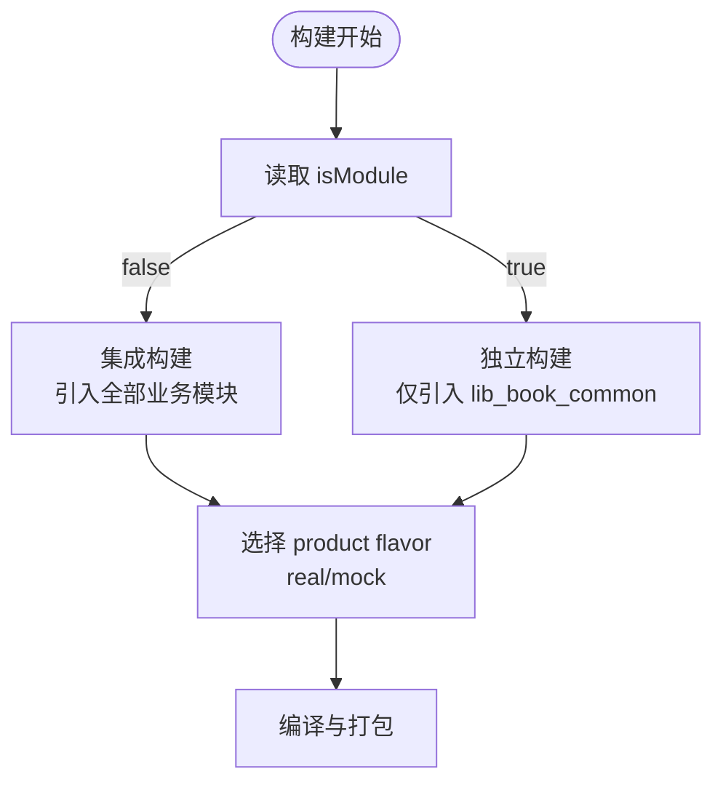
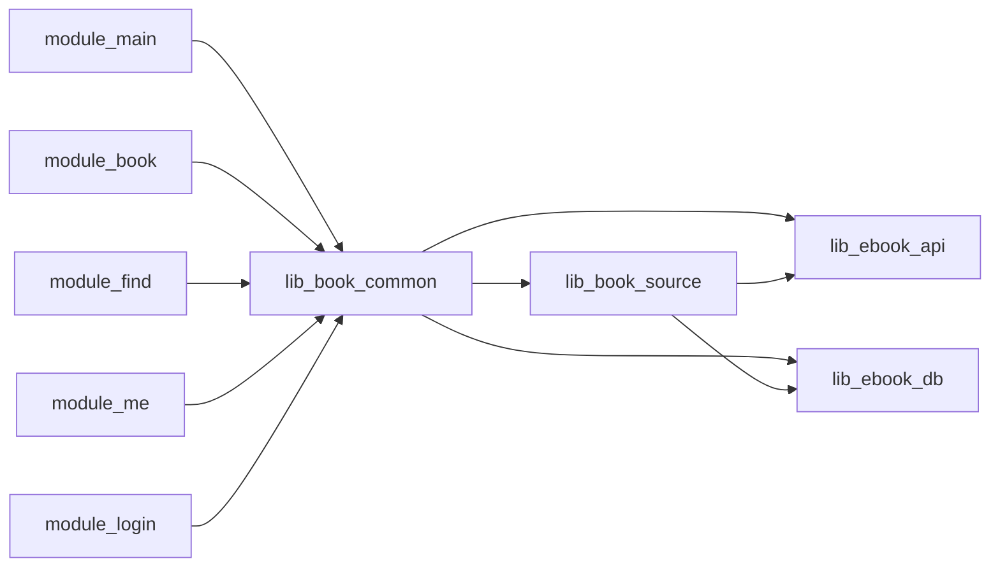

# 模块化架构设计

<cite>
**本文引用的文件**   
- [settings.gradle.kts](file://settings.gradle.kts)
- [gradle.properties](file://gradle.properties)
- [build.gradle.kts](file://build.gradle.kts)
- [module_app/build.gradle.kts](file://module_app/build.gradle.kts)
- [lib_book_common/build.gradle.kts](file://lib_book_common/build.gradle.kts)
- [lib_book_source/build.gradle.kts](file://lib_book_source/build.gradle.kts)
- [lib_ebook_api/build.gradle.kts](file://lib_ebook_api/build.gradle.kts)
- [lib_ebook_db/build.gradle.kts](file://lib_ebook_db/build.gradle.kts)
- [module_main/build.gradle.kts](file://module_main/build.gradle.kts)
- [module_app/src/main/assets/therouter/routeMap.json](file://module_app/src/main/assets/therouter/routeMap.json)
</cite>

## 目录
1. [简介](#简介)
2. [项目结构](#项目结构)
3. [核心组件](#核心组件)
4. [架构总览](#架构总览)
5. [详细组件分析](#详细组件分析)
6. [依赖关系分析](#依赖关系分析)
7. [性能与构建特性](#性能与构建特性)
8. [故障排查指南](#故障排查指南)
9. [结论](#结论)
10. [附录：独立开发与调试要点](#附录独立开发与调试要点)

## 简介
本文件面向读者对项目的模块划分原则、业务模块职责边界、共享库设计目标与依赖方向、跨模块通信机制（TheRouter 路由、Provider 接口、模块间数据传递）、构建时模块化配置（isModule 切换、product flavor、source set 管理）、以及模块解耦策略进行系统性说明，并给出模块依赖图与架构图，帮助团队在大型 Android 多模块工程中实现高内聚、低耦合、可独立开发、可独立测试的工程化能力。

## 项目结构
仓库采用“应用壳 + 功能模块 + 共享库”的多模块组织方式：
- 应用壳 module_app：装配所有功能模块、网络后端选择（real/mock）、统一入口与打包产物。
- 业务模块：module_main、module_book、module_find、module_me、module_login，各自负责一个业务域，互不直接依赖。
- 共享库：lib_book_common（通用 UI/领域基础/Provider 接口等）、lib_book_source（书源解析与脚本沙箱）、lib_ebook_api（网络层与实体）、lib_ebook_db（Room 数据库）。
- build-logic：统一 Gradle 约定插件，支撑 isModule 双态、Compose/Hilt/Room/Native 等工程化能力。

图表来源
- [settings.gradle.kts:56-65](file://settings.gradle.kts#L56-L65)
- [module_app/build.gradle.kts:48-58](file://module_app/build.gradle.kts#L48-L58)
- [lib_book_common/build.gradle.kts:37-44](file://lib_book_common/build.gradle.kts#L37-L44)
- [lib_book_source/build.gradle.kts:33-42](file://lib_book_source/build.gradle.kts#L33-L42)
- [lib_ebook_api/build.gradle.kts:40-58](file://lib_ebook_api/build.gradle.kts#L40-L58)
- [lib_ebook_db/build.gradle.kts:29-42](file://lib_ebook_db/build.gradle.kts#L29-L42)

章节来源
- [settings.gradle.kts:56-65](file://settings.gradle.kts#L56-L65)
- [module_app/build.gradle.kts:48-58](file://module_app/build.gradle.kts#L48-L58)

## 核心组件
- 应用壳 module_app
  - 作用：聚合功能模块、定义 product flavor（real/mock），控制是否将各业务模块纳入最终 APK；提供 Hilt 全局装配点。
  - 关键行为：当 isModule=false 时，引入 module_main/module_book/module_find/module_me/module_login；当 isModule=true 时仅保留 lib_book_common 作为独立应用壳。
- 业务模块（module_main、module_book、module_find、module_me、module_login）
  - 作用：各自实现单一业务域，通过 Provider 暴露页面/服务，通过 TheRouter 声明路由路径；彼此之间不直接依赖。
  - 典型职责：
    - module_main：启动流程、主页导航容器（NavHost）。
    - module_book：书籍阅读、评论、下载管理等。
    - module_find：书城搜索、分类浏览。
    - module_me：个人中心、缓存管理、版本更新检查。
    - module_login：登录、注册、修改密码等认证相关页面。
- 共享库
  - lib_book_common：公共 UI 组件、领域基类、Provider 接口、事件总线、工具类等；对外以 api 形式透出 lib_book_source、lib_ebook_api、lib_ebook_db 的契约类型，使业务模块仅依赖本库即可编译通过。
  - lib_book_source：书源解析器族（原生解析器、脚本书源解释器、沙箱执行器），只依赖网络/数据库契约与通用工具，不反向依赖业务模块。
  - lib_ebook_api：Retrofit 服务、OkHttp 拦截器、数据实体、网络适配器等。
  - lib_ebook_db：Room 数据库实体、DAO、迁移与 schema。

章节来源
- [module_app/build.gradle.kts:17-26](file://module_app/build.gradle.kts#L17-L26)
- [module_app/build.gradle.kts:48-58](file://module_app/build.gradle.kts#L48-L58)
- [lib_book_common/build.gradle.kts:37-44](file://lib_book_common/build.gradle.kts#L37-L44)
- [lib_book_source/build.gradle.kts:33-42](file://lib_book_source/build.gradle.kts#L33-L42)
- [lib_ebook_api/build.gradle.kts:40-58](file://lib_ebook_api/build.gradle.kts#L40-L58)
- [lib_ebook_db/build.gradle.kts:29-42](file://lib_ebook_db/build.gradle.kts#L29-L42)

## 架构总览
下图展示编译期与运行期的依赖方向与通信机制：
- 依赖方向：业务模块 → lib_book_common → (lib_book_source | lib_ebook_api | lib_ebook_db)；lib_book_source 也依赖 lib_ebook_api 与 lib_ebook_db。
- 通信机制：
  - TheRouter：基于 assets/therouter/routeMap.json 的路由表，模块通过 @Route 声明路径，被其他模块调用。
  - Provider：业务模块在 provider/ 下暴露接口，由 TheRouter 创建实例，供其他模块调用。
  - 数据传递：跨模块数据通过路由参数或 Provider 返回值传递，避免全局单例耦合。

图表来源
- [module_app/src/main/assets/therouter/routeMap.json:1-149](file://module_app/src/main/assets/therouter/routeMap.json#L1-L149)
- [lib_book_common/build.gradle.kts:37-44](file://lib_book_common/build.gradle.kts#L37-L44)
- [lib_book_source/build.gradle.kts:33-42](file://lib_book_source/build.gradle.kts#L33-L42)

## 详细组件分析

### 业务模块职责边界与交互
- module_main
  - 职责：启动页、主 Tab/导航容器，组合来自 Provider 的 Composable 页面。
  - 交互：通过 TheRouter 加载其他模块页面；使用 Navigation Compose 管理路由栈。
- module_book
  - 职责：书籍详情、阅读器、评论、下载管理。
  - 交互：通过 Provider 暴露 Reader/Detail 等页面；通过 TheRouter 接收外部跳转。
- module_find
  - 职责：书城搜索、分类浏览、书库条目展示。
  - 交互：通过 Provider 暴露 Search/ChoiceBook 页面；访问 lib_book_common 的 Repository/ViewModel。
- module_me
  - 职责：个人中心、缓存管理、版本更新检查。
  - 交互：通过 Provider 暴露 Setting/CacheManage 等页面；访问 release 更新接口（纯净客户端）。
- module_login
  - 职责：登录、注册、验证用户、修改密码。
  - 交互：通过 Provider 暴露 LoginActivity/RegisterActivity 等；触发会话刷新与鉴权流程。

章节来源
- [module_main/build.gradle.kts:49-58](file://module_main/build.gradle.kts#L49-L58)
- [module_app/src/main/assets/therouter/routeMap.json:1-149](file://module_app/src/main/assets/therouter/routeMap.json#L1-L149)

### 共享库设计目标与依赖方向
- lib_book_common
  - 设计目标：提供跨模块复用的 UI 组件、MVVM 基类、Provider 接口、事件总线、工具类；对外以 api 透出契约类型，降低业务模块编译依赖。
  - 依赖方向：api 指向 lib_book_source、lib_ebook_api、lib_ebook_db；内部实现依赖这些库的具体类型。
- lib_book_source
  - 设计目标：书源解析专用层，支持原生解析器与脚本解析器（含 JS 沙箱）；与业务解耦，只关注解析契约与数据实体。
  - 依赖方向：api 指向 lib_ebook_api 与 lib_ebook_db；内部实现使用 jsoup、序列化等。
- lib_ebook_api
  - 设计目标：网络层封装，统一 Retrofit/OkHttp、拦截器、DTO、错误处理。
  - 依赖方向：无业务模块依赖，仅依赖通用库与网络组件。
- lib_ebook_db
  - 设计目标：Room 数据库抽象，实体/DAO/迁移集中管理。
  - 依赖方向：无业务模块依赖，仅依赖 SQLite 驱动与通用库。

图表来源
- [lib_book_common/build.gradle.kts:37-44](file://lib_book_common/build.gradle.kts#L37-L44)
- [lib_book_source/build.gradle.kts:33-42](file://lib_book_source/build.gradle.kts#L33-L42)

章节来源
- [lib_book_common/build.gradle.kts:37-44](file://lib_book_common/build.gradle.kts#L37-L44)
- [lib_book_source/build.gradle.kts:33-42](file://lib_book_source/build.gradle.kts#L33-L42)
- [lib_ebook_api/build.gradle.kts:40-58](file://lib_ebook_api/build.gradle.kts#L40-L58)
- [lib_ebook_db/build.gradle.kts:29-42](file://lib_ebook_db/build.gradle.kts#L29-L42)

### 跨模块通信机制
- TheRouter 路由系统
  - 路由表位于 module_app 的 assets/therouter/routeMap.json，由各模块的 @Route 注解经 TheRouter 生成。
  - 路由路径命名规范：/ebook/<domain>/<action>，如 /ebook/book/detail、/ebook/find/search。
  - 参数与权限：部分路由带有 needLogin 等参数，用于拦截未登录用户。
- Provider 接口模式
  - 各模块在 provider/ 下暴露接口，TheRouter 创建实例供调用方使用。
  - 优势：隐藏具体实现，便于替换 mock、独立开发。
- 模块间数据传递
  - 通过路由参数传递轻量数据；复杂对象建议通过 Provider 返回或持久化后读取。

图表来源
- [module_app/src/main/assets/therouter/routeMap.json:1-149](file://module_app/src/main/assets/therouter/routeMap.json#L1-L149)

章节来源
- [module_app/src/main/assets/therouter/routeMap.json:1-149](file://module_app/src/main/assets/therouter/routeMap.json#L1-L149)

### 构建时的模块化配置
- isModule 切换
  - gradle.properties 中 isModule=false 为集成构建，true 为独立模块调试。
  - module_app 根据 isModule 决定是否引入业务模块；功能模块也可独立运行（需配合约定插件）。
- product flavor
  - module_app 定义 real/mock 两种 flavor，分别连接真实后端或使用内存 mock 数据源。
- source set 管理
  - 约定插件在独立模式下将 src/main/test/debug 并入 main，便于独立运行时提供宿主与 mock 实现。
  - 两份 Manifest 是替换关系：独立态使用 src/main/module/AndroidManifest.xml，集成态使用 src/main/AndroidManifest.xml。

图表来源
- [gradle.properties:21-29](file://gradle.properties#L21-L29)
- [module_app/build.gradle.kts:17-26](file://module_app/build.gradle.kts#L17-L26)
- [module_app/build.gradle.kts:48-58](file://module_app/build.gradle.kts#L48-L58)

章节来源
- [gradle.properties:21-29](file://gradle.properties#L21-L29)
- [module_app/build.gradle.kts:17-26](file://module_app/build.gradle.kts#L17-L26)
- [module_app/build.gradle.kts:48-58](file://module_app/build.gradle.kts#L48-L58)

## 依赖关系分析
- 业务模块之间互不依赖，均依赖 lib_book_common。
- lib_book_common 依赖 lib_book_source、lib_ebook_api、lib_ebook_db，形成“业务 → 共享 → 基础设施”的单向依赖链。
- lib_book_source 同时依赖 lib_ebook_api 与 lib_ebook_db，保持解析层的独立性。
- 不存在循环依赖：任何模块不会反向依赖上层模块。

图表来源
- [module_app/build.gradle.kts:48-58](file://module_app/build.gradle.kts#L48-L58)
- [lib_book_common/build.gradle.kts:37-44](file://lib_book_common/build.gradle.kts#L37-L44)
- [lib_book_source/build.gradle.kts:33-42](file://lib_book_source/build.gradle.kts#L33-L42)

章节来源
- [module_app/build.gradle.kts:48-58](file://module_app/build.gradle.kts#L48-L58)
- [lib_book_common/build.gradle.kts:37-44](file://lib_book_common/build.gradle.kts#L37-L44)
- [lib_book_source/build.gradle.kts:33-42](file://lib_book_source/build.gradle.kts#L33-L42)

## 性能与构建特性
- 构建优化
  - 使用 Gradle 守护进程与 Kotlin 增量编译；KSP 增量与跨模块启用。
  - AGP 9 内置 Kotlin，无需重复声明 Kotlin 插件；构建脚本简洁。
- 混淆与资源裁剪
  - module_app release 开启 R8；功能模块独立态开启 R8 以尽早暴露规则缺口。
  - consumer-rules.pro 随 AAR 传播，proguard-rules.pro 仅在独立态生效。
- Native 构建
  - lib_book_source 通过约定插件编译 C++ 沙箱库；debug 放宽 ABI 以支持模拟器调试。

章节来源
- [gradle.properties:14-20](file://gradle.properties#L14-L20)
- [module_main/build.gradle.kts:24-34](file://module_main/build.gradle.kts#L24-L34)
- [lib_book_source/build.gradle.kts:13-17](file://lib_book_source/build.gradle.kts#L13-L17)

## 故障排查指南
- 路由丢失
  - 症状：独立模式下跳转静默失败。
  - 排查：确认路由是否在 routeMap.json 中；新增/改动路由后需重新构建以回写路由表。
- 网络问题
  - 症状：页面不闪退但数据永远加载不出来。
  - 排查：检查本地服务器地址注入、权限与代理；确认 flavor 是否正确选择 real/mock。
- 构建失败
  - 症状：isModule=true 时 lib_common 冲突。
  - 排查：勿使用命令行 -P 覆盖 isModule；确保提交态 isModule=false。

章节来源
- [module_app/src/main/assets/therouter/routeMap.json:1-149](file://module_app/src/main/assets/therouter/routeMap.json#L1-L149)
- [gradle.properties:21-29](file://gradle.properties#L21-L29)

## 结论
本项目通过清晰的多模块分层、严格的依赖方向约束、TheRouter 与 Provider 的解耦通信机制，以及灵活的 isModule/flavor/source set 构建配置，实现了业务域的高内聚与低耦合。共享库承担通用能力下沉，业务模块专注领域实现，整体架构具备良好的可扩展性、可维护性与独立开发能力。

## 附录：独立开发与调试要点
- 独立模块调试
  - 临时将 isModule 改为 true，单独运行某个模块；调试完成后务必改回 false。
  - 使用 src/main/module/AndroidManifest.xml 与 src/main/AndroidManifest.xml 同步清单，避免行为不一致。
- Mock 数据源
  - 使用 module_app 的 mock flavor 快速联调；新增接口方法需同步 mock 实现。
- 路由占位
  - 在独立模式的 test/debug 宿主上挂同名路由占位，避免跳转静默失败。

章节来源
- [gradle.properties:21-29](file://gradle.properties#L21-L29)
- [module_app/build.gradle.kts:17-26](file://module_app/build.gradle.kts#L17-L26)