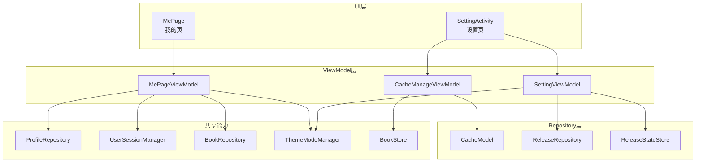
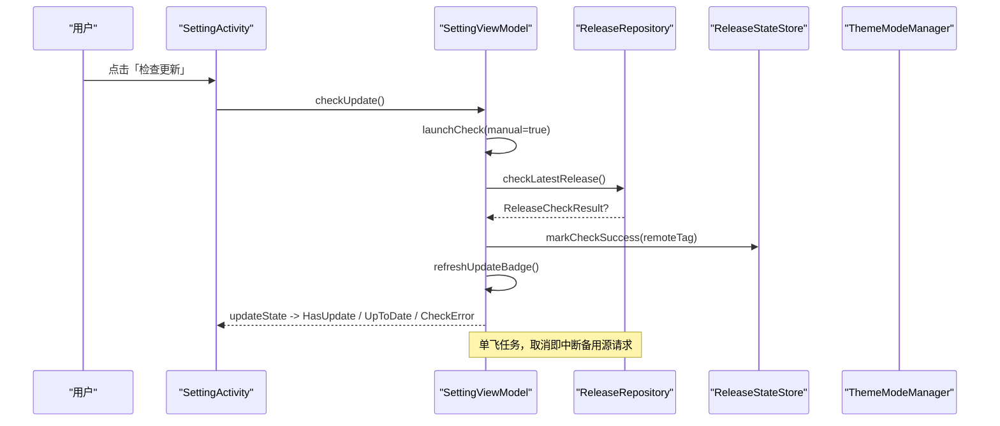
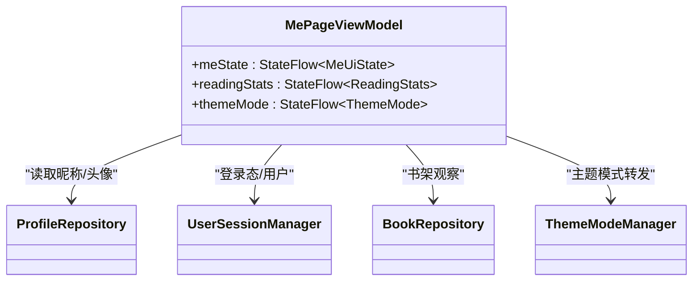
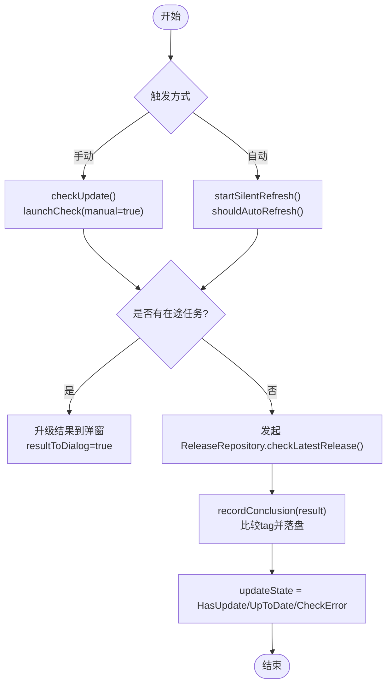
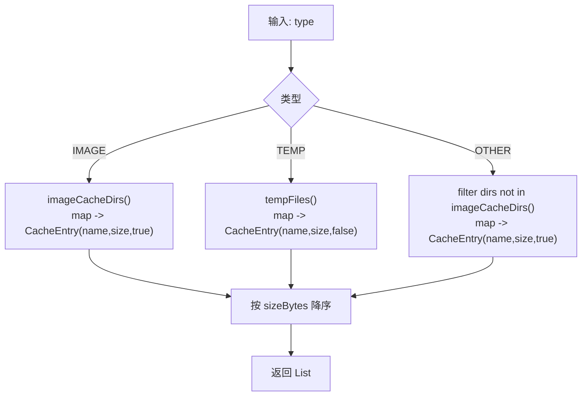
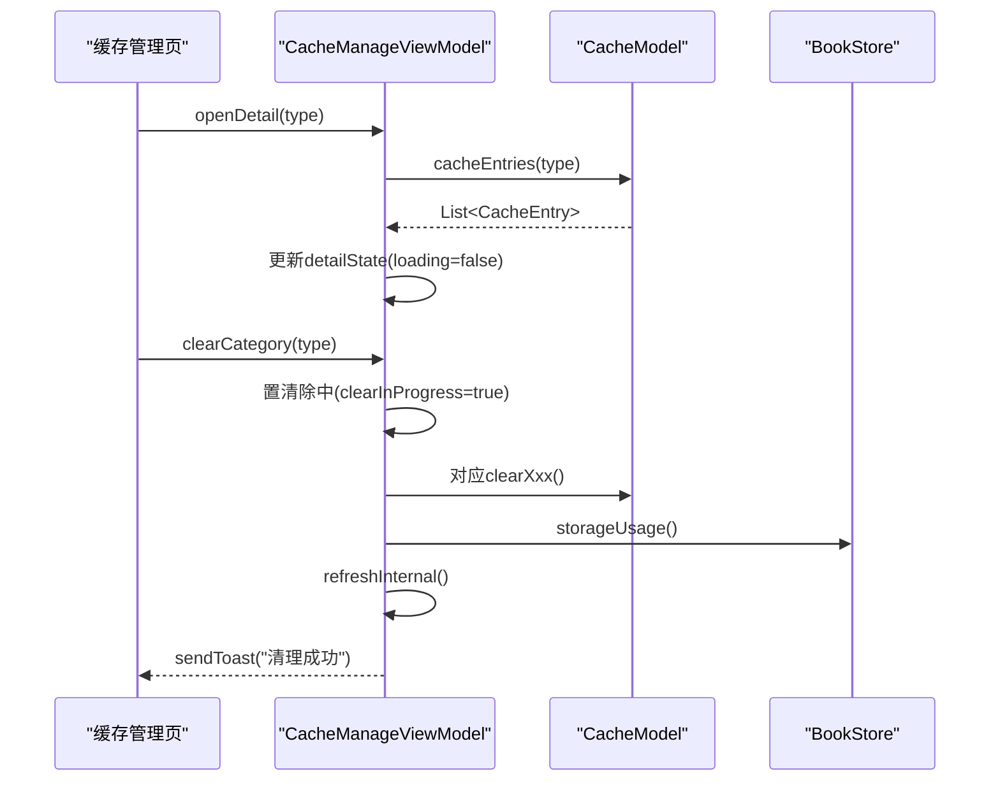
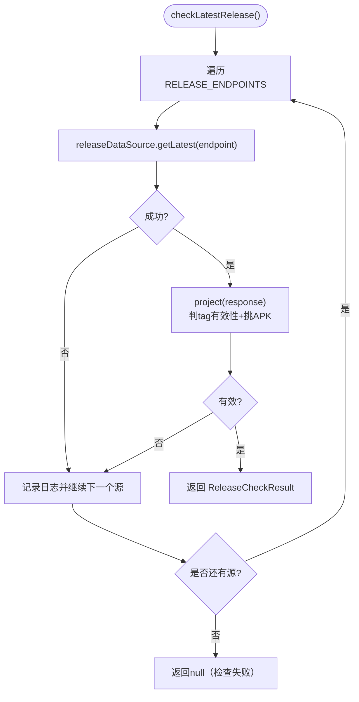
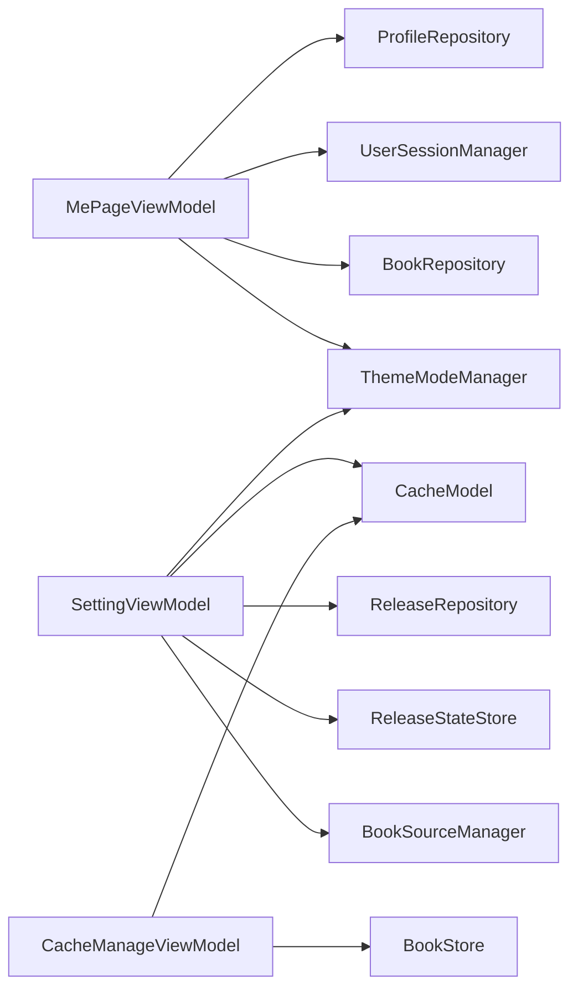
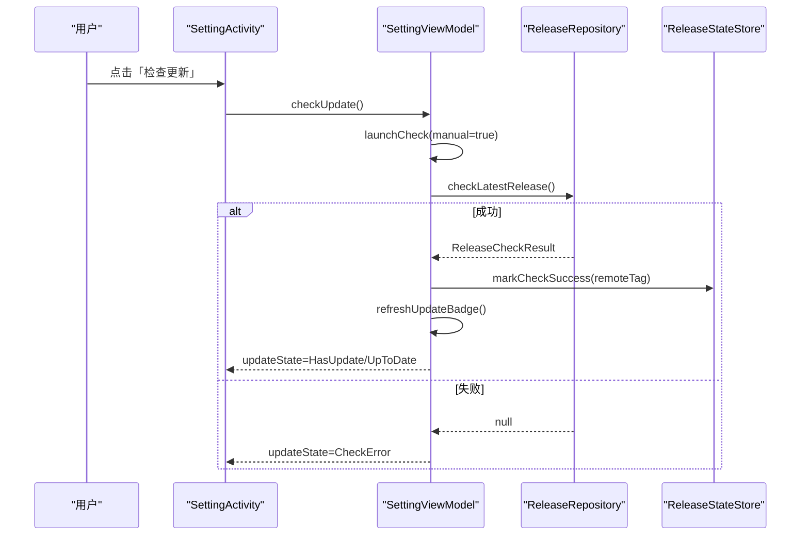
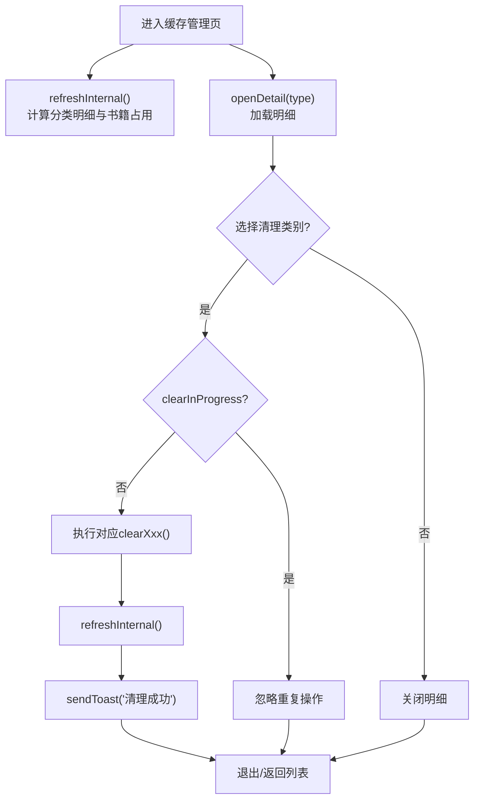

# 个人中心模块 (module_me)

<cite>
**本文引用的文件**
- [MePageViewModel.kt](file://module_me/src/main/java/com/ebook/me/mvvm/viewmodel/MePageViewModel.kt)
- [MePage.kt](file://module_me/src/main/java/com/ebook/me/page/MePage.kt)
- [SettingViewModel.kt](file://module_me/src/main/java/com/ebook/me/mvvm/viewmodel/SettingViewModel.kt)
- [SettingActivity.kt](file://module_me/src/main/java/com/ebook/me/view/SettingActivity.kt)
- [CacheModel.kt](file://module_me/src/main/java/com/ebook/me/repository/CacheModel.kt)
- [CacheManageViewModel.kt](file://module_me/src/main/java/com/ebook/me/mvvm/viewmodel/CacheManageViewModel.kt)
- [ReleaseRepository.kt](file://module_me/src/main/java/com/ebook/me/repository/ReleaseRepository.kt)
- [ReleaseStateStore.kt](file://module_me/src/main/java/com/ebook/me/repository/ReleaseStateStore.kt)
</cite>

## 目录
1. [简介](#简介)
2. [项目结构](#项目结构)
3. [核心组件](#核心组件)
4. [架构总览](#架构总览)
5. [详细组件分析](#详细组件分析)
6. [依赖关系分析](#依赖关系分析)
7. [性能与资源管理](#性能与资源管理)
8. [故障排查指南](#故障排查指南)
9. [结论](#结论)
10. [附录：数据模型与流程图](#附录数据模型与流程图)

## 简介
本模块负责“我的”个人主页、设置页、缓存管理与版本更新检查等用户配置与管理功能。其职责边界清晰：
- 用户信息与阅读概览：由 MePageViewModel 聚合登录态、个人资料与书架统计，供 Compose 页面展示。
- 设置管理：SettingViewModel 统一处理外观主题、缓存入口、版本检查、退出登录与书源数量展示。
- 缓存管理：CacheModel 实现 cacheDir 的占用计算、分类明细与清理；CacheManageViewModel 编排 UI 状态与操作。
- 版本更新：ReleaseRepository 负责发布源策略（多端点 failover、APK 过滤），ReleaseStateStore 持久化上次检查 tag 与时间戳并派生角标。
- 同步与离线：本模块不直接持有用户数据同步逻辑；通过 lib_book_common 的 ProfileRepository、UserSessionManager、BookRepository 获取资料与本地书架数据，满足离线可用性与一致性要求。

## 项目结构
module_me 采用 MVVM + Repository 分层：
- viewmodel：业务编排与 UI 状态（MePageViewModel、SettingViewModel、CacheManageViewModel）
- repository：领域策略与数据访问（CacheModel、ReleaseRepository、ReleaseStateStore）
- page：Compose 页面（MePage）
- view：基于 Activity 的设置页（SettingActivity）
- util/domain：版本工具、校验器与领域对象（AppVersion、BookSourceValidator 等）

图表来源
- [MePageViewModel.kt:69-119](file://module_me/src/main/java/com/ebook/me/mvvm/viewmodel/MePageViewModel.kt#L69-L119)
- [SettingViewModel.kt:62-71](file://module_me/src/main/java/com/ebook/me/mvvm/viewmodel/SettingViewModel.kt#L62-L71)
- [CacheManageViewModel.kt:35-40](file://module_me/src/main/java/com/ebook/me/mvvm/viewmodel/CacheManageViewModel.kt#L35-L40)

章节来源
- [MePageViewModel.kt:19-119](file://module_me/src/main/java/com/ebook/me/mvvm/viewmodel/MePageViewModel.kt#L19-L119)
- [SettingViewModel.kt:34-71](file://module_me/src/main/java/com/ebook/me/mvvm/viewmodel/SettingViewModel.kt#L34-L71)
- [CacheManageViewModel.kt:23-40](file://module_me/src/main/java/com/ebook/me/mvvm/viewmodel/CacheManageViewModel.kt#L23-L40)

## 核心组件
- MePageViewModel：合并登录态、个人资料与书架统计，提供 meState、readingStats、themeMode 三条 StateFlow。
- SettingViewModel：缓存大小、版本检查（主动/静默）、主题切换、退出登录、书源计数。
- CacheModel：cacheDir 占用计算、分类明细、按类清理与全量清理。
- CacheManageViewModel：缓存管理页状态机，含明细弹窗、清理闸门与重算流程。
- ReleaseRepository：发布源顺序与 failover、APK 附件过滤、结果投影。
- ReleaseStateStore：上次成功检查 tag、限频判断、角标派生。

章节来源
- [MePageViewModel.kt:69-119](file://module_me/src/main/java/com/ebook/me/mvvm/viewmodel/MePageViewModel.kt#L69-L119)
- [SettingViewModel.kt:62-71](file://module_me/src/main/java/com/ebook/me/mvvm/viewmodel/SettingViewModel.kt#L62-L71)
- [CacheModel.kt:57-144](file://module_me/src/main/java/com/ebook/me/repository/CacheModel.kt#L57-L144)
- [CacheManageViewModel.kt:35-186](file://module_me/src/main/java/com/ebook/me/mvvm/viewmodel/CacheManageViewModel.kt#L35-L186)
- [ReleaseRepository.kt:35-111](file://module_me/src/main/java/com/ebook/me/repository/ReleaseRepository.kt#L35-L111)
- [ReleaseStateStore.kt:32-129](file://module_me/src/main/java/com/ebook/me/repository/ReleaseStateStore.kt#L32-L129)

## 架构总览
本模块遵循 MVVM 与 Repository 模式，ViewModel 仅做编排与状态管理，Repository 承载领域策略与 IO。跨模块能力通过 Hilt 注入或 Provider（如 ILoginProvider）使用。

图表来源
- [SettingViewModel.kt:204-257](file://module_me/src/main/java/com/ebook/me/mvvm/viewmodel/SettingViewModel.kt#L204-L257)
- [ReleaseRepository.kt:40-70](file://module_me/src/main/java/com/ebook/me/repository/ReleaseRepository.kt#L40-L70)
- [ReleaseStateStore.kt:88-101](file://module_me/src/main/java/com/ebook/me/repository/ReleaseStateStore.kt#L88-L101)

章节来源
- [SettingActivity.kt:116-141](file://module_me/src/main/java/com/ebook/me/view/SettingActivity.kt#L116-L141)
- [SettingViewModel.kt:204-290](file://module_me/src/main/java/com/ebook/me/mvvm/viewmodel/SettingViewModel.kt#L204-L290)

## 详细组件分析

### MePageViewModel：用户信息与阅读统计
- 用户信息展示：
  - meState 合并 UserSessionManager 与 ProfileRepository 的数据，昵称/头像以 ProfileRepository 为主，会话兜底。
  - themeMode 转发 ThemeModeManager.themeMode，用于头部渐变与状态栏图标适配。
- 阅读统计：
  - readingStats 来自 BookRepository.observeBookShelf()，按 finalDate 倒序取最近在读书名与藏书数。
- 生命周期与并发：
  - 使用 stateIn(WhileSubscribed(5s))，切走 Tab 停止合并，返回时即时刷新，兼顾省电与体验。

图表来源
- [MePageViewModel.kt:69-119](file://module_me/src/main/java/com/ebook/me/mvvm/viewmodel/MePageViewModel.kt#L69-L119)

章节来源
- [MePageViewModel.kt:19-119](file://module_me/src/main/java/com/ebook/me/mvvm/viewmodel/MePageViewModel.kt#L19-L119)
- [MePage.kt:77-94](file://module_me/src/main/java/com/ebook/me/page/MePage.kt#L77-L94)

### SettingViewModel：设置管理与版本更新
- 缓存：显示 cacheDir 总占用（字符串形式），实际清理在缓存管理页完成。
- 版本更新：
  - 主动检查：立即发起并弹窗展示结果。
  - 静默检查：进入设置页且距上次 ≥7 天则后台刷新角标。
  - 单飞任务：同一时刻最多一个检查任务，关闭弹窗可取消在途任务。
  - 失败不覆盖：解析不到版本或本地版本不可读时，按错误处置且不写成功时间戳。
- 主题模式：暴露并写入 ThemeModeManager，应用级主题装配由 Application 监听变化。
- 退出登录：跨模块 provider 调用后清本地会话，提示并关页，防重复提交。

图表来源
- [SettingViewModel.kt:214-257](file://module_me/src/main/java/com/ebook/me/mvvm/viewmodel/SettingViewModel.kt#L214-L257)
- [ReleaseRepository.kt:40-70](file://module_me/src/main/java/com/ebook/me/repository/ReleaseRepository.kt#L40-L70)

章节来源
- [SettingViewModel.kt:62-344](file://module_me/src/main/java/com/ebook/me/mvvm/viewmodel/SettingViewModel.kt#L62-L344)
- [SettingActivity.kt:89-141](file://module_me/src/main/java/com/ebook/me/view/SettingActivity.kt#L89-L141)

### CacheModel：缓存管理实现
- 分类策略：
  - IMAGE：Coil 图片缓存目录（含老版本 Glide 残留）。
  - TEMP：cacheDir 根下松散文件（如裁剪产物）。
  - OTHER：除图片外的其余子目录。
- 能力：
  - cacheSizeBytes：递归计算占用。
  - cacheBreakdown：一次遍历分档累加，总量恒等于三档之和。
  - clearImageCache/clearTempFiles/clearOtherCache：按类清理。
  - cacheEntries(type)：列出某分类明细（降序），供 BottomSheet 展示。

图表来源
- [CacheModel.kt:118-133](file://module_me/src/main/java/com/ebook/me/repository/CacheModel.kt#L118-L133)

章节来源
- [CacheModel.kt:10-144](file://module_me/src/main/java/com/ebook/me/repository/CacheModel.kt#L10-L144)

### CacheManageViewModel：缓存管理页状态编排
- 状态：
  - cacheState：分类条目 + 总占用 + 书籍内容占用与册数（只读展示，不参与清理）。
  - detailState：打开某分类的明细弹窗（加载态、列表、合计大小）。
- 清理闸门：clearInProgress 防止重复清理导致重复提示与状态错乱。
- 交互：
  - openDetail(type)：异步加载明细，完成后替换临时大小文案。
  - clearCategory(type)/clearAll()：执行清理后重算明细并提示。
  - dismissDetail()：关闭明细弹窗。

图表来源
- [CacheManageViewModel.kt:90-186](file://module_me/src/main/java/com/ebook/me/mvvm/viewmodel/CacheManageViewModel.kt#L90-L186)

章节来源
- [CacheManageViewModel.kt:23-186](file://module_me/src/main/java/com/ebook/me/mvvm/viewmodel/CacheManageViewModel.kt#L23-L186)

### ReleaseRepository：版本更新检测机制
- 发布源顺序：GitHub latest 优先，Gitcode latest 作为国内兜底。
- 失败策略：任一源解析异常或返回空 tag 则继续下一个；全部失败返回 null。
- APK 过滤：仅接受 .apk 扩展名附件，无 APK 不影响“有新版本”的判断。
- 取消传播：CancellationException 原样抛出，确保备用源不再执行。

图表来源
- [ReleaseRepository.kt:40-70](file://module_me/src/main/java/com/ebook/me/repository/ReleaseRepository.kt#L40-L70)
- [ReleaseRepository.kt:72-88](file://module_me/src/main/java/com/ebook/me/repository/ReleaseRepository.kt#L72-L88)

章节来源
- [ReleaseRepository.kt:13-127](file://module_me/src/main/java/com/ebook/me/repository/ReleaseRepository.kt#L13-L127)

### ReleaseStateStore：本地状态与限频
- 存储事实：上次成功检查到的远端 tag 与时间戳。
- 角标派生：hasUpdateAvailable 每次用当前版本与上次 tag 现场比较，避免结论过期。
- 限频窗口：默认 7 天，shouldAutoRefresh 控制进设置页是否静默刷新。
- 安全失败：失败不调 markCheckSuccess，保持旧结论与时间戳。

章节来源
- [ReleaseStateStore.kt:12-129](file://module_me/src/main/java/com/ebook/me/repository/ReleaseStateStore.kt#L12-L129)

## 依赖关系分析
- MePageViewModel 依赖 ProfileRepository、UserSessionManager、BookRepository、ThemeModeManager，纯展示型 VM 使用 NoOpModel 占位。
- SettingViewModel 组合 CacheModel、ReleaseRepository、ReleaseStateStore、ThemeModeManager 与 BookSourceManager（只读计数）。
- CacheManageViewModel 组合 CacheModel 与 BookStore（只读存储用量）。
- ReleaseRepository 依赖 ReleaseDataSource（网络契约在 lib_ebook_api），本模块专注策略。

图表来源
- [MePageViewModel.kt:69-119](file://module_me/src/main/java/com/ebook/me/mvvm/viewmodel/MePageViewModel.kt#L69-L119)
- [SettingViewModel.kt:62-71](file://module_me/src/main/java/com/ebook/me/mvvm/viewmodel/SettingViewModel.kt#L62-L71)
- [CacheManageViewModel.kt:35-40](file://module_me/src/main/java/com/ebook/me/mvvm/viewmodel/CacheManageViewModel.kt#L35-L40)

章节来源
- [MePageViewModel.kt:69-119](file://module_me/src/main/java/com/ebook/me/mvvm/viewmodel/MePageViewModel.kt#L69-L119)
- [SettingViewModel.kt:62-161](file://module_me/src/main/java/com/ebook/me/mvvm/viewmodel/SettingViewModel.kt#L62-L161)
- [CacheManageViewModel.kt:35-80](file://module_me/src/main/java/com/ebook/me/mvvm/viewmodel/CacheManageViewModel.kt#L35-L80)

## 性能与资源管理
- Flow 优化：
  - meState、readingStats、themeMode 使用 stateIn(WhileSubscribed(5s))，避免后台持续订阅造成耗电。
  - sourcesCount 使用 WhileSubscribed(5s) 避免长时间驻留时的 Room 监听浪费。
- IO 线程：
  - CacheModel 所有磁盘操作均切换到 Dispatchers.IO，避免阻塞主线程。
- 单飞任务：
  - 版本检查共用 Job，防止连点重复请求；关闭弹窗可取消在途任务。
- 清理幂等性：
  - 清理操作有 clearInProgress 闸门，避免重复编排与重复提示。
- 展示降级：
  - 未登录或数据为空时，UI 回退到默认头像与占位文案，保证界面稳定。

[本节为通用指导，不直接分析具体文件]

## 故障排查指南
- 版本检查无结果：
  - 确认 ReleaseRepository 两个端点均可达；若全部失败将返回 null，SettingViewModel 会显示“检查失败”。
  - 若远端响应 tag 为空或本地版本不可解析，recordConclusion 返回 null，不写盘也不影响下次重试。
- 角标不消失：
  - hasUpdateAvailable 由 currentVersion 与 lastCheckedTag 现场比较；安装新版本后需回到设置页触发 refreshUpdateBadge。
- 缓存清理无效：
  - 确认 CacheModel 分类目录存在；IMAGE 包含 image_cache 与历史 image_manager_disk_cache；TEMP 为根下松散文件。
  - 清理后需重新调用 refresh 以更新明细与总计。
- 退出登录无效果：
  - 服务端登出失败不会阻塞本地清理；若页面旋转导致作用域销毁，收尾在 VM 内仍会执行。
  - 若独立运行（isModule=true）无 module_login 依赖，provider 为 null，仅执行本地清理。

章节来源
- [SettingViewModel.kt:214-344](file://module_me/src/main/java/com/ebook/me/mvvm/viewmodel/SettingViewModel.kt#L214-L344)
- [ReleaseRepository.kt:40-88](file://module_me/src/main/java/com/ebook/me/repository/ReleaseRepository.kt#L40-L88)
- [CacheModel.kt:61-144](file://module_me/src/main/java/com/ebook/me/repository/CacheModel.kt#L61-L144)

## 结论
module_me 围绕“我的”与“设置”两大场景，提供稳定的用户信息管理、设置与缓存管理、以及可靠的版本更新检测。通过 ViewModel 的状态流聚合与 Repository 的策略封装，实现了清晰的职责边界与良好的可测试性。缓存管理采用一次遍历分档与闸门保护，版本更新采用多源 failover 与严格失败不覆盖策略，整体具备高鲁棒性与良好用户体验。

[本节为总结，不直接分析具体文件]

## 附录：数据模型与流程图

### 数据模型设计
- MeUiState：登录态、昵称、账号名、头像 URL。
- ReadingStats：书架藏书数、最近在读书名。
- CacheBreakdown：图片、临时、其他三类占用字节与总量。
- CacheEntry：名称、大小、是否目录。
- ReleaseCheckResult：远端 tag、发布说明、APK 下载链接。
- UpdateState：Idle/Checking/UpToDate/HasUpdate/ChekError 五种状态。

章节来源
- [MePageViewModel.kt:27-47](file://module_me/src/main/java/com/ebook/me/mvvm/viewmodel/MePageViewModel.kt#L27-L47)
- [CacheModel.kt:20-43](file://module_me/src/main/java/com/ebook/me/repository/CacheModel.kt#L20-L43)
- [ReleaseRepository.kt:122-127](file://module_me/src/main/java/com/ebook/me/repository/ReleaseRepository.kt#L122-L127)
- [SettingViewModel.kt:346-360](file://module_me/src/main/java/com/ebook/me/mvvm/viewmodel/SettingViewModel.kt#L346-L360)

### 用户操作流程：设置页检查更新

图表来源
- [SettingActivity.kt:116-141](file://module_me/src/main/java/com/ebook/me/view/SettingActivity.kt#L116-L141)
- [SettingViewModel.kt:214-257](file://module_me/src/main/java/com/ebook/me/mvvm/viewmodel/SettingViewModel.kt#L214-L257)
- [ReleaseRepository.kt:40-70](file://module_me/src/main/java/com/ebook/me/repository/ReleaseRepository.kt#L40-L70)
- [ReleaseStateStore.kt:88-101](file://module_me/src/main/java/com/ebook/me/repository/ReleaseStateStore.kt#L88-L101)

### 缓存清理流程

图表来源
- [CacheManageViewModel.kt:86-186](file://module_me/src/main/java/com/ebook/me/mvvm/viewmodel/CacheManageViewModel.kt#L86-L186)
- [CacheModel.kt:61-144](file://module_me/src/main/java/com/ebook/me/repository/CacheModel.kt#L61-L144)