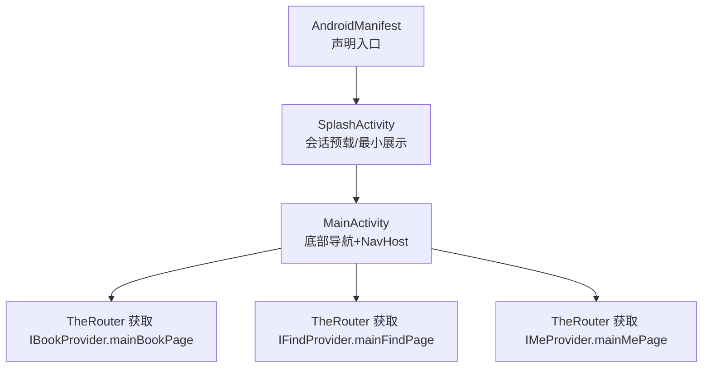
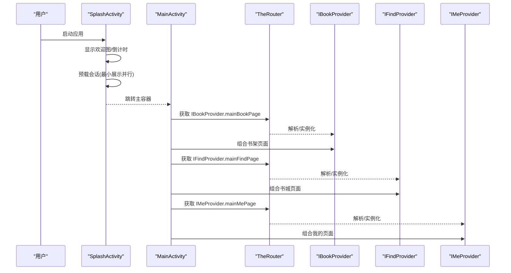
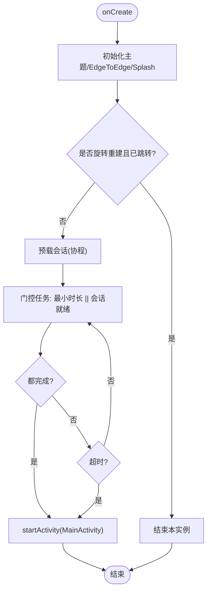
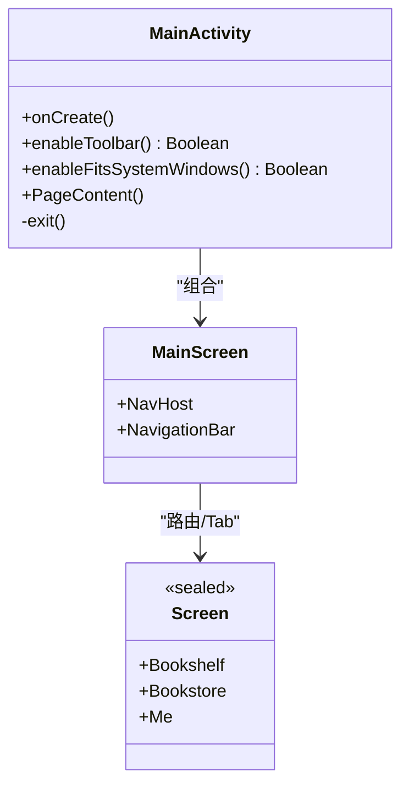
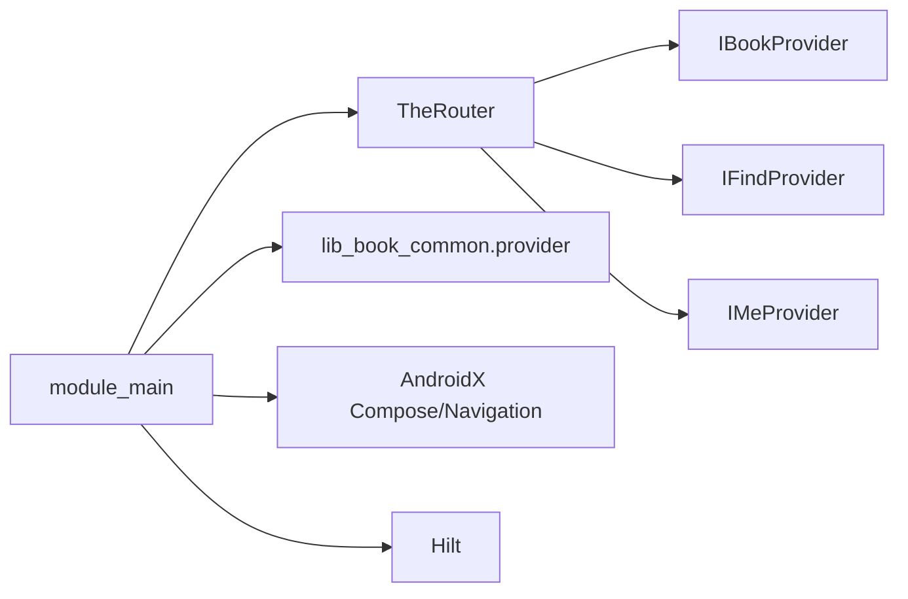

# 主界面模块 (module_main)

<cite>
**本文引用的文件**
- [MainActivity.kt](file://module_main/src/main/java/com/ebook/main/MainActivity.kt)
- [SplashActivity.kt](file://module_main/src/main/java/com/ebook/main/SplashActivity.kt)
- [AndroidManifest.xml](file://module_main/src/main/AndroidManifest.xml)
- [routeMap.json](file://module_main/src/main/assets/therouter/routeMap.json)
- [IBookProvider.kt](file://lib_book_common/src/main/java/com/ebook/common/provider/IBookProvider.kt)
- [IFindProvider.kt](file://lib_book_common/src/main/java/com/ebook/common/provider/IFindProvider.kt)
- [IMeProvider.kt](file://lib_book_common/src/main/java/com/ebook/common/provider/IMeProvider.kt)
</cite>

## 目录
1. [简介](#简介)
2. [项目结构](#项目结构)
3. [核心组件](#核心组件)
4. [架构总览](#架构总览)
5. [详细组件分析](#详细组件分析)
6. [依赖关系分析](#依赖关系分析)
7. [性能与内存优化](#性能与内存优化)
8. [故障排查指南](#故障排查指南)
9. [结论](#结论)
10. [附录](#附录)

## 简介
本模块是应用的主入口与导航中心，承担以下职责：
- 启动页 SplashActivity：负责欢迎图展示、会话预载（自动登录恢复）、最小展示时长控制，并在完成后跳转到主容器。
- 主容器 MainActivity：作为底部导航栏宿主，管理三个 Tab（书架、书城、我的）的页面组合与状态同步；订阅会话过期事件并统一处理跳转登录。
- 跨模块路由：通过 TheRouter 将各功能模块的 Compose 页面以 Provider 接口暴露给主容器组合，实现解耦与独立运行。
- 主题与沉浸体验：使用统一主题装配点与 Edge-to-Edge 方案，保证启动页与主界面风格一致。

## 项目结构
module_main 包含两个 Activity 与资源清单：
- MainActivity：Compose 实现的底部导航 + NavHost 容器。
- SplashActivity：Compose 实现的启动页，负责会话预载与跳转门控。
- AndroidManifest：声明 Launcher 入口、主题、屏幕方向等。
- therouter routeMap：注册主入口路由。

图示来源
- [AndroidManifest.xml:12-24](file://module_main/src/main/AndroidManifest.xml#L12-L24)
- [SplashActivity.kt:83-119](file://module_main/src/main/java/com/ebook/main/SplashActivity.kt#L83-L119)
- [MainActivity.kt:139-197](file://module_main/src/main/java/com/ebook/main/MainActivity.kt#L139-L197)
- [IBookProvider.kt:11-13](file://lib_book_common/src/main/java/com/ebook/common/provider/IBookProvider.kt#L11-L13)
- [IFindProvider.kt:11-13](file://lib_book_common/src/main/java/com/ebook/common/provider/IFindProvider.kt#L11-L13)
- [IMeProvider.kt:11-13](file://lib_book_common/src/main/java/com/ebook/common/provider/IMeProvider.kt#L11-L13)

章节来源
- [AndroidManifest.xml:1-26](file://module_main/src/main/AndroidManifest.xml#L1-L26)
- [SplashActivity.kt:54-119](file://module_main/src/main/java/com/ebook/main/SplashActivity.kt#L54-L119)
- [MainActivity.kt:45-115](file://module_main/src/main/java/com/ebook/main/MainActivity.kt#L45-L115)

## 核心组件
- SplashActivity：启动流程编排者，协调“最小展示时长”和“会话预载”，完成后跳转 MainActivity。
- MainActivity：主容器，负责：
  - 底部导航栏与三个 Tab 的切换与状态保持（launchSingleTop、restoreState）。
  - 通过 TheRouter 注入各模块的 Compose 页面（非 Fragment），避免强耦合。
  - 订阅会话过期事件，统一清会话并跳转登录。
  - 关闭基类 insets 偏移，交由各 Tab 自行避让系统栏，保证沉浸式顶栏效果。
- Provider 接口（IBookProvider/IFindProvider/IMeProvider）：定义跨模块页面契约，返回 @Composable 页面函数，由各自模块实现并通过 TheRouter 注册。

章节来源
- [MainActivity.kt:57-115](file://module_main/src/main/java/com/ebook/main/MainActivity.kt#L57-L115)
- [MainActivity.kt:123-197](file://module_main/src/main/java/com/ebook/main/MainActivity.kt#L123-L197)
- [IBookProvider.kt:11-13](file://lib_book_common/src/main/java/com/ebook/common/provider/IBookProvider.kt#L11-L13)
- [IFindProvider.kt:11-13](file://lib_book_common/src/main/java/com/ebook/common/provider/IFindProvider.kt#L11-L13)
- [IMeProvider.kt:11-13](file://lib_book_common/src/main/java/com/ebook/common/provider/IMeProvider.kt#L11-L13)

## 架构总览
模块采用“启动页 → 主容器 → 各功能模块页面”的分层设计：
- 启动页仅关注启动体验与会话预载，不承载业务逻辑。
- 主容器专注导航与全局事件（如会话过期）处理，页面内容由其他模块提供。
- 通过 TheRouter + Provider 接口实现模块间松耦合通信。

图示来源
- [SplashActivity.kt:83-119](file://module_main/src/main/java/com/ebook/main/SplashActivity.kt#L83-L119)
- [MainActivity.kt:186-194](file://module_main/src/main/java/com/ebook/main/MainActivity.kt#L186-L194)
- [IBookProvider.kt:11-13](file://lib_book_common/src/main/java/com/ebook/common/provider/IBookProvider.kt#L11-L13)
- [IFindProvider.kt:11-13](file://lib_book_common/src/main/java/com/ebook/common/provider/IFindProvider.kt#L11-L13)
- [IMeProvider.kt:11-13](file://lib_book_common/src/main/java/com/ebook/common/provider/IMeProvider.kt#L11-L13)

## 详细组件分析

### SplashActivity：启动流程与会话预载
- 入口与主题：设置 Edge-to-Edge、安装系统 Splash、状态栏浅色图标适配。
- 启动门控：
  - 最小展示时长：确保欢迎图至少展示固定时长。
  - 会话预载：读取本地持久化会话，若有则视为就绪；无则直接放行。
  - 超时保护：自动登录等待超时后仍放行，避免弱网卡死启动。
- 防重复跳转：使用持久化标志位防止旋转重建导致二次跳转。
- 跳转行为：完成后启动 MainActivity 并结束自身。

图示来源
- [SplashActivity.kt:83-119](file://module_main/src/main/java/com/ebook/main/SplashActivity.kt#L83-L119)
- [SplashActivity.kt:127-146](file://module_main/src/main/java/com/ebook/main/SplashActivity.kt#L127-L146)
- [SplashActivity.kt:148-156](file://module_main/src/main/java/com/ebook/main/SplashActivity.kt#L148-L156)

章节来源
- [SplashActivity.kt:54-169](file://module_main/src/main/java/com/ebook/main/SplashActivity.kt#L54-L169)

### MainActivity：底部导航、Tab 管理与状态同步
- 导航结构：
  - 使用 NavigationBar + NavHost，三个 Tab 对应不同路由。
  - 选中态由回退栈派生，避免额外本地状态导致不一致。
  - 切换时启用 launchSingleTop、restoreState/saveState，保证切 Tab 保留状态。
- 页面组合：
  - 通过 TheRouter.get(...) 获取 Provider 暴露的 Compose 页面函数并组合，解耦模块边界。
- 全局事件：
  - 订阅 SessionEventBus，当会话过期时清除会话、提示用户并跳转登录页。
- 系统与 UI：
  - 禁用基类 Toolbar 与 insets 偏移，由各 Tab 页面自行处理系统栏避让，保证沉浸式顶栏与渐变头部连贯。
  - 退出逻辑：双击返回提示，再次点击退出进程。

图示来源
- [MainActivity.kt:57-115](file://module_main/src/main/java/com/ebook/main/MainActivity.kt#L57-L115)
- [MainActivity.kt:123-197](file://module_main/src/main/java/com/ebook/main/MainActivity.kt#L123-L197)

章节来源
- [MainActivity.kt:45-197](file://module_main/src/main/java/com/ebook/main/MainActivity.kt#L45-L197)

### 跨模块路由与 Provider 机制
- 主容器通过 TheRouter 按路径获取 Provider 接口实例，再调用其 mainXxxPage 属性获取 Compose 页面函数并组合。
- 各功能模块在各自模块内实现 Provider，并以 TheRouter 注解注册路径，主容器无需感知具体实现类。
- 优势：模块可独立编译/运行，路由缺失时不会崩溃（仅记录日志），便于调试与灰度。

章节来源
- [MainActivity.kt:186-194](file://module_main/src/main/java/com/ebook/main/MainActivity.kt#L186-L194)
- [IBookProvider.kt:11-13](file://lib_book_common/src/main/java/com/ebook/common/provider/IBookProvider.kt#L11-L13)
- [IFindProvider.kt:11-13](file://lib_book_common/src/main/java/com/ebook/common/provider/IFindProvider.kt#L11-L13)
- [IMeProvider.kt:11-13](file://lib_book_common/src/main/java/com/ebook/common/provider/IMeProvider.kt#L11-L13)
- [routeMap.json:1-9](file://module_main/src/main/assets/therouter/routeMap.json#L1-L9)

## 依赖关系分析
- 运行时依赖：
  - AndroidX Compose/Navigaton：构建底部导航与页面栈。
  - Hilt：注入 SessionEventBus、UserSessionManager。
  - TheRouter：跨模块路由与服务发现。
  - lib_book_common.provider.*：Provider 接口契约。
- 模块间耦合：
  - module_main 不直接依赖业务模块的具体类，仅依赖 Provider 接口与路由路径常量，降低耦合度。

图示来源
- [MainActivity.kt:186-194](file://module_main/src/main/java/com/ebook/main/MainActivity.kt#L186-L194)
- [IBookProvider.kt:11-13](file://lib_book_common/src/main/java/com/ebook/common/provider/IBookProvider.kt#L11-L13)
- [IFindProvider.kt:11-13](file://lib_book_common/src/main/java/com/ebook/common/provider/IFindProvider.kt#L11-L13)
- [IMeProvider.kt:11-13](file://lib_book_common/src/main/java/com/ebook/common/provider/IMeProvider.kt#L11-L13)

章节来源
- [MainActivity.kt:186-194](file://module_main/src/main/java/com/ebook/main/MainActivity.kt#L186-L194)

## 性能与内存优化
- 启动性能：
  - 最小展示时长与会话预载并行执行，避免串行阻塞；会话预载超时兜底，保障冷启动可控。
  - 启动页仅做必要初始化与轻量 UI，重活后置到主页。
- 导航状态：
  - 使用 NavHost 的 restoreState/saveState 与 launchSingleTop，减少重建开销并保持 Tab 状态。
- 主题与渲染：
  - 统一主题装配点，避免重复包裹 MaterialTheme；Edge-to-Edge 配合系统栏颜色设置，减少重绘区域。
- 内存管理：
  - SplashActivity 的协程作用域在 onDestroy 中取消，避免后台残留。
  - 主容器长驻但仅持有导航控制器与少量状态，页面内容按需组合，减少常驻对象。

[本节为通用指导，不直接分析具体文件]

## 故障排查指南
- 启动后未进入主页：
  - 检查会话预载是否卡住（网络/超时），确认 AUTO_LOGIN_TIMEOUT_MS 合理。
  - 确认 startMainActivity 被调用且未被 finish/isFinishing 拦截。
- 会话过期未跳转登录：
  - 确认 SessionEventBus 订阅已建立（onCreate 生命周期内）。
  - 确认 userSessionManager.clearSession 与跳转 LOGIN_PATH 被执行。
- 底部 Tab 状态丢失：
  - 确认 navigate 参数中 launchSingleTop、restoreState/saveState 正确配置。
- 跨模块页面无法加载：
  - 检查 TheRouter 是否在目标模块注册了对应 Provider 与路由路径。
  - 独立模式下需有占位路由，否则路由查找会静默失败。

章节来源
- [SplashActivity.kt:83-119](file://module_main/src/main/java/com/ebook/main/SplashActivity.kt#L83-L119)
- [SplashActivity.kt:127-146](file://module_main/src/main/java/com/ebook/main/SplashActivity.kt#L127-L146)
- [MainActivity.kt:68-79](file://module_main/src/main/java/com/ebook/main/MainActivity.kt#L68-L79)
- [MainActivity.kt:160-167](file://module_main/src/main/java/com/ebook/main/MainActivity.kt#L160-L167)

## 结论
module_main 作为应用主容器与导航中心，通过清晰的职责划分与模块化路由实现了高内聚、低耦合的架构：
- SplashActivity 专注于启动体验与会话预载，保障首帧可用。
- MainActivity 负责导航与全局事件处理，页面内容由其他模块以 Provider 形式注入。
- 基于 TheRouter 的跨模块通信使模块可独立开发、测试与发布，同时保持整体一致性。
- 主题与沉浸式体验通过统一装配点与 Edge-to-Edge 策略保持一致性，提升用户体验。

[本节为总结性内容，不直接分析具体文件]

## 附录
- 关键交互场景参考路径：
  - 启动页会话预载与跳转：[SplashActivity.kt:83-119](file://module_main/src/main/java/com/ebook/main/SplashActivity.kt#L83-L119)
  - 主容器底部导航与 Tab 切换：[MainActivity.kt:139-197](file://module_main/src/main/java/com/ebook/main/MainActivity.kt#L139-L197)
  - 跨模块 Provider 页面组合：[MainActivity.kt:186-194](file://module_main/src/main/java/com/ebook/main/MainActivity.kt#L186-L194)
  - 会话过期统一处置：[MainActivity.kt:68-79](file://module_main/src/main/java/com/ebook/main/MainActivity.kt#L68-L79)