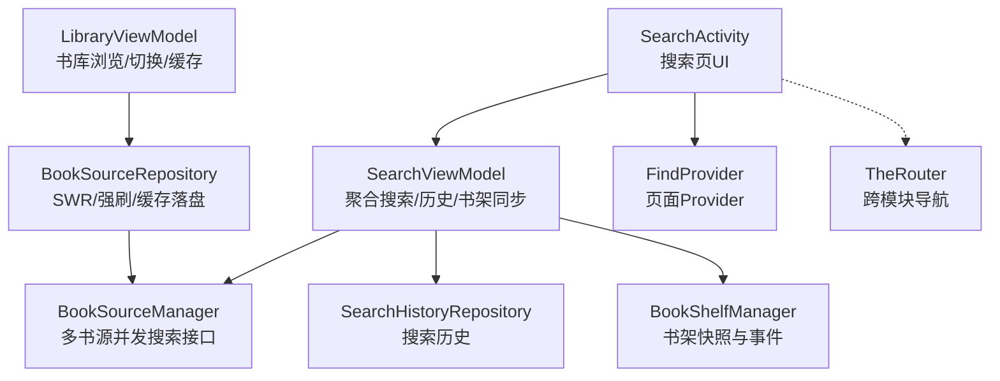
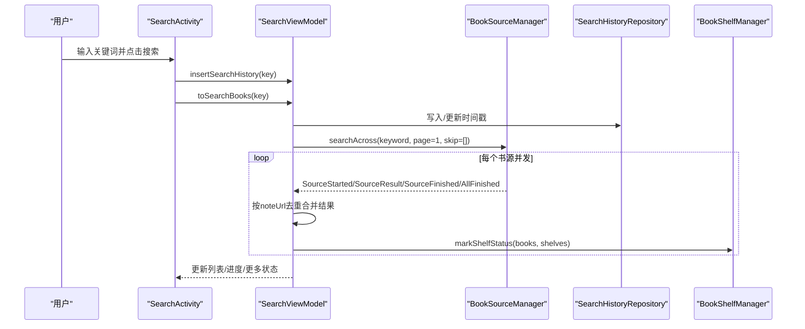
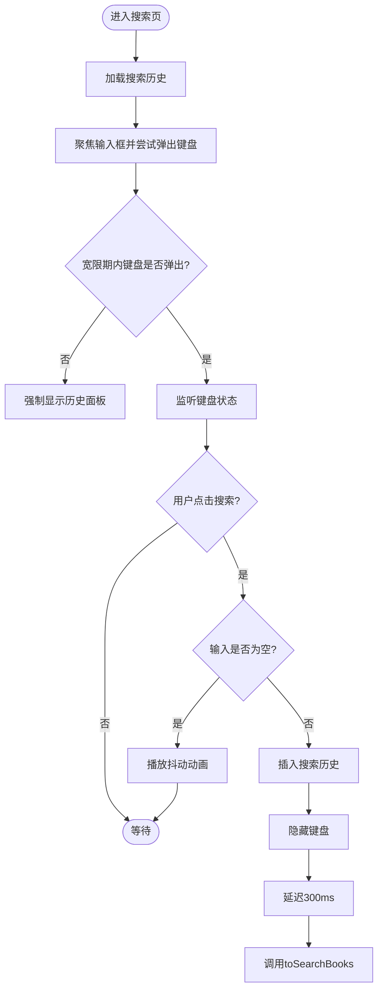
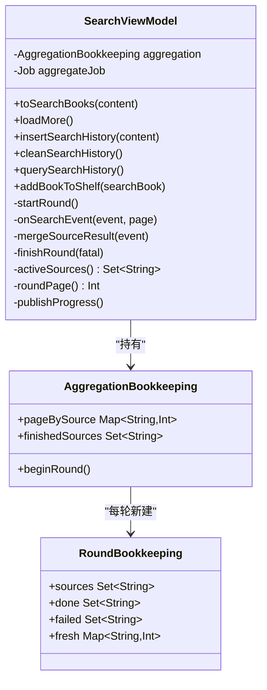
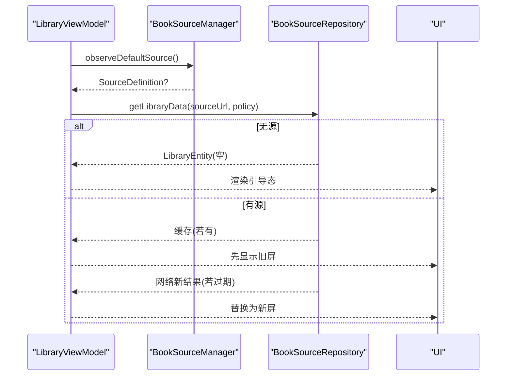
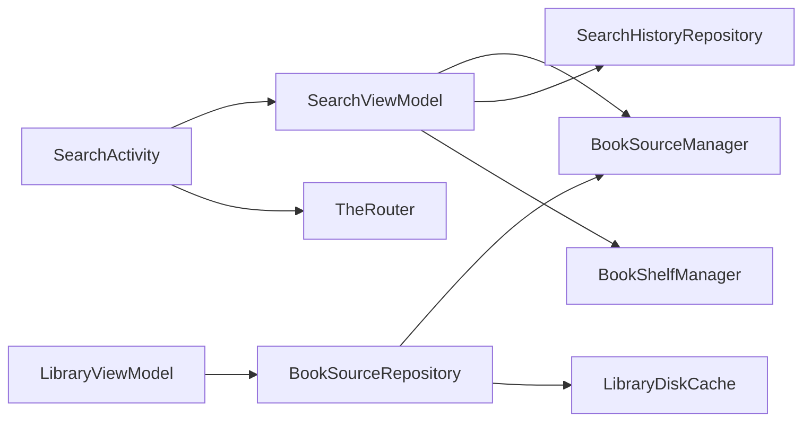

# 书城搜索模块 (module_find)

<cite>
**本文引用的文件**   
- [SearchActivity.kt](file://module_find/src/main/java/com/ebook/find/SearchActivity.kt)
- [SearchViewModel.kt](file://module_find/src/main/java/com/ebook/find/mvvm/viewmodel/SearchViewModel.kt)
- [LibraryViewModel.kt](file://module_find/src/main/java/com/ebook/find/mvvm/viewmodel/LibraryViewModel.kt)
- [BookSourceRepository.kt](file://module_find/src/main/java/com/ebook/find/repository/BookSourceRepository.kt)
- [SearchHistoryRepository.kt](file://module_find/src/main/java/com/ebook/find/repository/SearchHistoryRepository.kt)
- [BookPageMerge.kt](file://module_find/src/main/java/com/ebook/find/mvvm/viewmodel/BookPageMerge.kt)
- [SearchBookItem.kt](file://module_find/src/main/java/com/ebook/find/view/SearchBookItem.kt)
- [FindProvider.kt](file://module_find/src/main/java/com/ebook/find/provider/FindProvider.kt)
- [BookstorePage.kt](file://module_find/src/main/java/com/ebook/find/page/BookstorePage.kt)
- [LibraryCacheModule.kt](file://module_find/src/main/java/com/ebook/find/di/LibraryCacheModule.kt)
- [BookType.kt](file://module_find/src/main/java/com/ebook/find/entity/BookType.kt)
</cite>

## 目录
1. [简介](#简介)
2. [项目结构](#项目结构)
3. [核心组件](#核心组件)
4. [架构总览](#架构总览)
5. [详细组件分析](#详细组件分析)
6. [依赖关系分析](#依赖关系分析)
7. [性能与优化](#性能与优化)
8. [故障排查指南](#故障排查指南)
9. [结论](#结论)
10. [附录](#附录)

## 简介
本模块负责书城搜索与书库浏览，围绕“多书源聚合搜索”和“书库缓存+分类浏览”两大职责展开：
- SearchActivity 作为入口页面，承载搜索输入、历史面板与结果列表。
- SearchViewModel 实现跨书源的并发搜索、结果合并、分页与进度展示，维护书架状态同步与搜索历史。
- LibraryViewModel 管理书库数据流、分类入口、当前书源切换与缓存策略（SWR/强刷）。
- BookSourceRepository 封装书库缓存策略与解析器调用；SearchHistoryRepository 提供搜索历史的增删查。

该设计将“界面状态”与“业务状态”解耦，通过 Flow 驱动 UI，保证在弱网、部分源失败、软 404 等场景下的稳定体验。

## 项目结构
module_find 采用 MVVM + Repository 分层：
- UI 层：SearchActivity（Compose），使用 BaseMvvmRefreshActivity 统一加载态、加载更多与主题。
- ViewModel 层：SearchViewModel、LibraryViewModel，组织数据流与状态机。
- Repository 层：BookSourceRepository（书库缓存与解析）、SearchHistoryRepository（历史存储）。
- Provider/Router：FindProvider 暴露 Compose 页面，TheRouter 路由跳转。
- DI：LibraryCacheModule 注入缓存相关对象。

图表来源
- [SearchActivity.kt:129-131](file://module_find/src/main/java/com/ebook/find/SearchActivity.kt#L129-L131)
- [SearchViewModel.kt:55-61](file://module_find/src/main/java/com/ebook/find/mvvm/viewmodel/SearchViewModel.kt#L55-L61)
- [BookSourceRepository.kt:54-58](file://module_find/src/main/java/com/ebook/find/repository/BookSourceRepository.kt#L54-L58)
- [FindProvider.kt](file://module_find/src/main/java/com/ebook/find/provider/FindProvider.kt)

章节来源
- [SearchActivity.kt:129-131](file://module_find/src/main/java/com/ebook/find/SearchActivity.kt#L129-L131)
- [BookSourceRepository.kt:54-58](file://module_find/src/main/java/com/ebook/find/repository/BookSourceRepository.kt#L54-L58)

## 核心组件
- SearchActivity：纯 Compose 搜索页，处理输入、键盘交互、历史面板揭示动画与搜索结果列表渲染。
- SearchViewModel：聚合搜索的核心编排者，订阅 BookSourceManager.searchAcross 事件流，按 noteUrl 去重合并结果，维护分页游标与进度。
- LibraryViewModel：书库浏览的响应式 VM，基于 currentSource 驱动分类与书库数据，支持 SWR 与下拉强刷。
- BookSourceRepository：书库缓存策略（TTL=6h）、解析器选择、分类条目与书籍列表读取。
- SearchHistoryRepository：搜索历史的 upsert 语义、清空与查询。

章节来源
- [SearchActivity.kt:168-236](file://module_find/src/main/java/com/ebook/find/SearchActivity.kt#L168-L236)
- [SearchViewModel.kt:29-54](file://module_find/src/main/java/com/ebook/find/mvvm/viewmodel/SearchViewModel.kt#L29-L54)
- [LibraryViewModel.kt:78-101](file://module_find/src/main/java/com/ebook/find/mvvm/viewmodel/LibraryViewModel.kt#L78-L101)
- [BookSourceRepository.kt:21-53](file://module_find/src/main/java/com/ebook/find/repository/BookSourceRepository.kt#L21-L53)
- [SearchHistoryRepository.kt:11-16](file://module_find/src/main/java/com/ebook/find/repository/SearchHistoryRepository.kt#L11-L16)

## 架构总览
书城搜索遵循 MVVM + Flow 的数据流模式：
- Activity 仅持有输入状态与 UI 交互，委托 ViewModel 执行业务。
- ViewModel 通过 Hilt 注入 BookSourceManager、BookShelfManager、Repository，组织异步任务与状态。
- Repository 屏蔽网络与缓存细节，向 VM 暴露稳定的 Flow/API。
- 跨模块导航通过 TheRouter 完成，页面由 Provider 组合。

图表来源
- [SearchActivity.kt:365-379](file://module_find/src/main/java/com/ebook/find/SearchActivity.kt#L365-L379)
- [SearchViewModel.kt:212-226](file://module_find/src/main/java/com/ebook/find/mvvm/viewmodel/SearchViewModel.kt#L212-L226)
- [SearchViewModel.kt:261-284](file://module_find/src/main/java/com/ebook/find/mvvm/viewmodel/SearchViewModel.kt#L261-L284)

## 详细组件分析

### SearchActivity：搜索入口与UI编排
- 职责边界：只负责输入框、历史面板、结果列表渲染与用户交互；不直接发起网络或复杂逻辑。
- 搜索触发流程：空输入抖动提示；非空则插入历史、隐藏键盘、延迟后调用 toSearchBooks。
- 历史面板：由键盘弹出/收起驱动显示/隐藏；无键盘环境宽限期兜底显示历史面板。
- 列表项：以 noteUrl 为 key 避免重复崩溃；点击跳转到详情页；可加入书架。

图表来源
- [SearchActivity.kt:187-194](file://module_find/src/main/java/com/ebook/find/SearchActivity.kt#L187-L194)
- [SearchActivity.kt:365-379](file://module_find/src/main/java/com/ebook/find/SearchActivity.kt#L365-L379)

章节来源
- [SearchActivity.kt:168-236](file://module_find/src/main/java/com/ebook/find/SearchActivity.kt#L168-L236)
- [SearchActivity.kt:354-379](file://module_find/src/main/java/com/ebook/find/SearchActivity.kt#L354-L379)

### SearchViewModel：多书源聚合搜索与分页
- 搜索请求分发：取消上一轮聚合任务，重置簿记，startRound 订阅 searchAcross 事件流。
- 结果合并：对每源结果先标记书架状态，再按 noteUrl 全局去重，追加到列表。
- 分页处理：每源独立游标；当某源 hasMore 且本轮新增 > 0 时翻页，否则将该源加入 finishedSources；loadMore 仅对未结束源继续翻。
- 进度展示：每收到 SourceStarted/SourceFinished/AllFinished 更新进度，全部结束时隐藏进度条。
- 错误处理：单源失败仅记录日志；整流出问题或所有源失败才进入网络错误覆盖态。

图表来源
- [SearchViewModel.kt:55-61](file://module_find/src/main/java/com/ebook/find/mvvm/viewmodel/SearchViewModel.kt#L55-L61)
- [SearchViewModel.kt:408-460](file://module_find/src/main/java/com/ebook/find/mvvm/viewmodel/SearchViewModel.kt#L408-L460)

章节来源
- [SearchViewModel.kt:130-167](file://module_find/src/main/java/com/ebook/find/mvvm/viewmodel/SearchViewModel.kt#L130-L167)
- [SearchViewModel.kt:208-226](file://module_find/src/main/java/com/ebook/find/mvvm/viewmodel/SearchViewModel.kt#L208-L226)
- [SearchViewModel.kt:261-375](file://module_find/src/main/java/com/ebook/find/mvvm/viewmodel/SearchViewModel.kt#L261-L375)

### LibraryViewModel：书库管理与缓存
- 当前书源：currentSource 来自 Manager 观察；首帧 Unknown，Room 返回后落定 Ready/NoSource/BrokenSource。
- 分类入口：随 currentSource 变化重算，空白标题过滤；异常捕获返回空列表。
- 书库数据：SWR 进页/换源，下拉刷新走 ForceNetwork；缓存 TTL 6 小时，回写需至少一个分类有书。
- 错误分支：源不可用抛出 BookSourceNotFoundException 置位 BrokenSource；无源不发请求并清空列表。

图表来源
- [LibraryViewModel.kt:127-167](file://module_find/src/main/java/com/ebook/find/mvvm/viewmodel/LibraryViewModel.kt#L127-L167)
- [BookSourceRepository.kt:92-131](file://module_find/src/main/java/com/ebook/find/repository/BookSourceRepository.kt#L92-L131)

章节来源
- [LibraryViewModel.kt:169-289](file://module_find/src/main/java/com/ebook/find/mvvm/viewmodel/LibraryViewModel.kt#L169-L289)
- [BookSourceRepository.kt:21-53](file://module_find/src/main/java/com/ebook/find/repository/BookSourceRepository.kt#L21-L53)

### 搜索算法与去重策略
- 关键词匹配：由各书源解析器实现，本模块不介入具体匹配逻辑。
- 相关性排序：由各书源返回顺序决定；本模块保持原序追加，不做跨源重排。
- 去重策略：按 noteUrl 全局去重，保留同名不同源的条目以便后续换源；列表 key 使用 noteUrl 避免 Compose 异常。
- 分页判断：hasMore 且本轮新增 > 0 才翻页；软 404（重复首页）通过去重计数判定到底。

章节来源
- [SearchViewModel.kt:48-54](file://module_find/src/main/java/com/ebook/find/mvvm/viewmodel/SearchViewModel.kt#L48-L54)
- [SearchViewModel.kt:323-342](file://module_find/src/main/java/com/ebook/find/mvvm/viewmodel/SearchViewModel.kt#L323-L342)
- [SearchActivity.kt:270-281](file://module_find/src/main/java/com/ebook/find/SearchActivity.kt#L270-L281)

### MVVM 状态管理与数据流
- StateFlow/SharedFlow：searchProgress、list、successEvent 驱动 UI 更新；书架事件通过 SharedFlow 同步。
- 生命周期安全：aggregateJob 在新一轮搜索前取消；换源时 cancel 旧 loadJob 防止覆盖。
- 错误收敛：单源失败记录日志；整流出问题或全源失败才进入 NetworkError；会话过期经 reportFailure 统一处理。

章节来源
- [SearchViewModel.kt:89-101](file://module_find/src/main/java/com/ebook/find/mvvm/viewmodel/SearchViewModel.kt#L89-L101)
- [SearchViewModel.kt:103-128](file://module_find/src/main/java/com/ebook/find/mvvm/viewmodel/SearchViewModel.kt#L103-L128)
- [SearchViewModel.kt:352-375](file://module_find/src/main/java/com/ebook/find/mvvm/viewmodel/SearchViewModel.kt#L352-L375)

## 依赖关系分析
- SearchActivity 依赖 SearchViewModel 与 TheRouter；SearchViewModel 依赖 BookSourceManager、BookShelfManager、SearchHistoryRepository。
- LibraryViewModel 依赖 BookSourceManager、BookSourceRepository；后者依赖 LibraryDiskCache 与解析器。
- 模块间通过 Provider 暴露 Compose 页面，避免硬耦合。

图表来源
- [SearchActivity.kt:129-131](file://module_find/src/main/java/com/ebook/find/SearchActivity.kt#L129-L131)
- [SearchViewModel.kt:55-61](file://module_find/src/main/java/com/ebook/find/mvvm/viewmodel/SearchViewModel.kt#L55-L61)
- [BookSourceRepository.kt:54-58](file://module_find/src/main/java/com/ebook/find/repository/BookSourceRepository.kt#L54-L58)

章节来源
- [FindProvider.kt](file://module_find/src/main/java/com/ebook/find/provider/FindProvider.kt)
- [LibraryCacheModule.kt](file://module_find/src/main/java/com/ebook/find/di/LibraryCacheModule.kt)

## 性能与优化
- 并发聚合：searchAcross 并发请求各书源，边收边追加，减少首屏等待。
- 去重优化：按 noteUrl 去重避免重复渲染与内存浪费；distinctBy 提升性能。
- 分页控制：仅对活跃源翻页，避免无效请求；软 404 通过 fresh 计数判定到底。
- 缓存策略：书库 SWR 秒开旧屏，后台静默刷新；TTL 6 小时平衡新鲜度与请求频率。
- UI 性能：历史面板圆形裁剪仅在布局期计算半径，避免逐帧重组；列表 item key 稳定避免重排。

章节来源
- [SearchViewModel.kt:323-342](file://module_find/src/main/java/com/ebook/find/mvvm/viewmodel/SearchViewModel.kt#L323-L342)
- [BookSourceRepository.kt:61-70](file://module_find/src/main/java/com/ebook/find/repository/BookSourceRepository.kt#L61-L70)
- [SearchActivity.kt:305-352](file://module_find/src/main/java/com/ebook/find/SearchActivity.kt#L305-L352)

## 故障排查指南
- 搜索无结果：检查 BookSourceManager 是否返回空事件流；确认 skipSourceUrls 是否正确排除已结束源。
- 列表重复崩溃：确保 item key 使用 noteUrl；检查去重逻辑是否生效。
- 历史面板不显示：确认键盘状态监听与宽限期逻辑；物理键盘环境下 panelForcedOpen 应生效。
- 书库白屏：检查 currentSource 是否为 null；BookSourceNotFoundException 是否被正确捕获并置位 BrokenSource。
- 缓存未更新：确认 LibraryLoadPolicy 是否为 ForceNetwork；TTL 是否过期；writeToCacheIfWorthCaching 条件是否满足。

章节来源
- [SearchViewModel.kt:352-375](file://module_find/src/main/java/com/ebook/find/mvvm/viewmodel/SearchViewModel.kt#L352-L375)
- [LibraryViewModel.kt:274-289](file://module_find/src/main/java/com/ebook/find/mvvm/viewmodel/LibraryViewModel.kt#L274-L289)
- [BookSourceRepository.kt:133-146](file://module_find/src/main/java/com/ebook/find/repository/BookSourceRepository.kt#L133-L146)

## 结论
module_find 通过清晰的 MVVM 分层与 Flow 驱动，实现了稳定高效的书城搜索与书库浏览功能。SearchActivity 专注 UI 编排，SearchViewModel 承担聚合搜索与分页逻辑，LibraryViewModel 管理书库缓存与切换，Repository 屏蔽底层细节。去重策略与分页控制保证了性能与用户体验，错误处理与状态机避免了常见陷阱。

## 附录
- 典型搜索场景：用户输入关键词 → 插入历史 → 多源并发搜索 → 结果去重合并 → 显示进度与列表 → 触底加载更多 → 全部源结束后隐藏进度。
- 代码片段路径：
  - 搜索触发：[SearchActivity.kt:365-379](file://module_find/src/main/java/com/ebook/find/SearchActivity.kt#L365-L379)
  - 聚合搜索：[SearchViewModel.kt:261-284](file://module_find/src/main/java/com/ebook/find/mvvm/viewmodel/SearchViewModel.kt#L261-L284)
  - 结果合并：[SearchViewModel.kt:323-342](file://module_find/src/main/java/com/ebook/find/mvvm/viewmodel/SearchViewModel.kt#L323-L342)
  - 书库缓存：[BookSourceRepository.kt:92-131](file://module_find/src/main/java/com/ebook/find/repository/BookSourceRepository.kt#L92-L131)