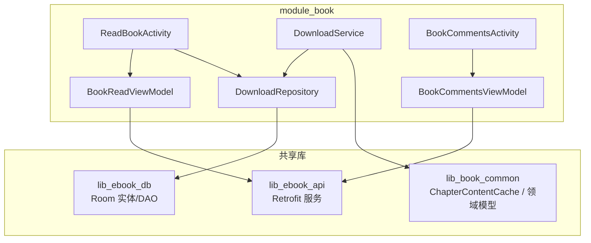
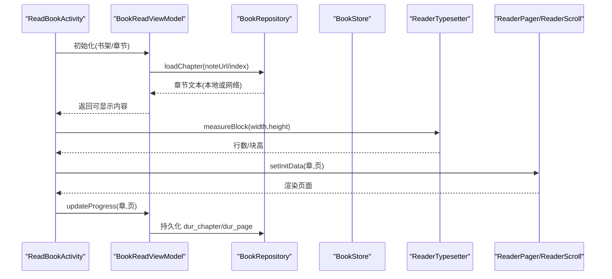
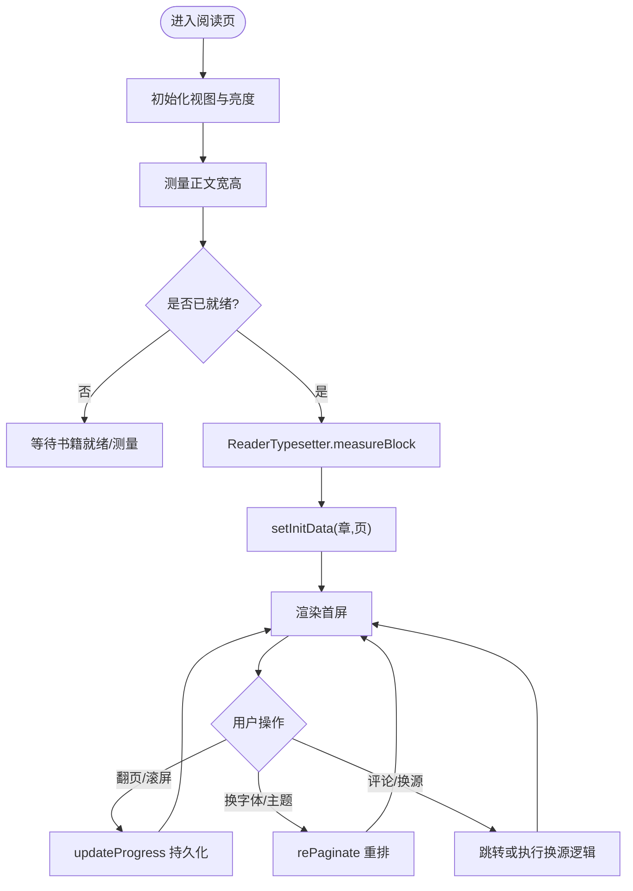
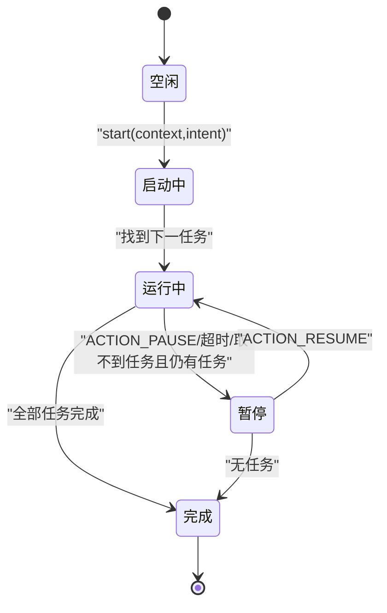
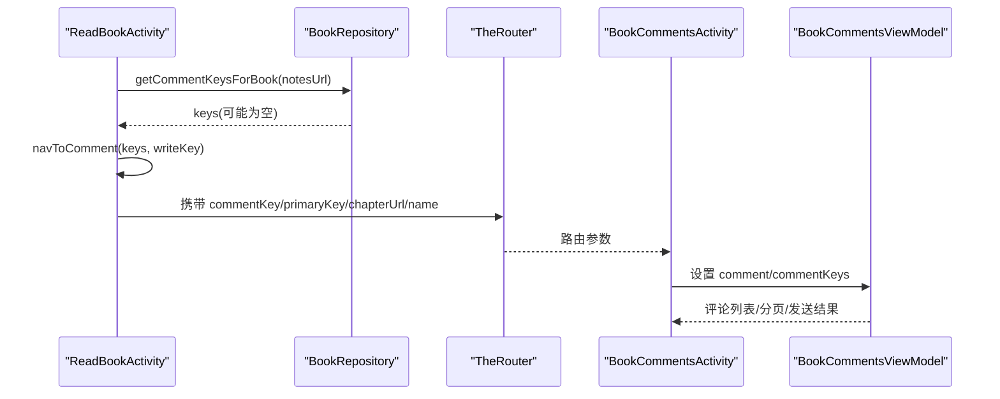
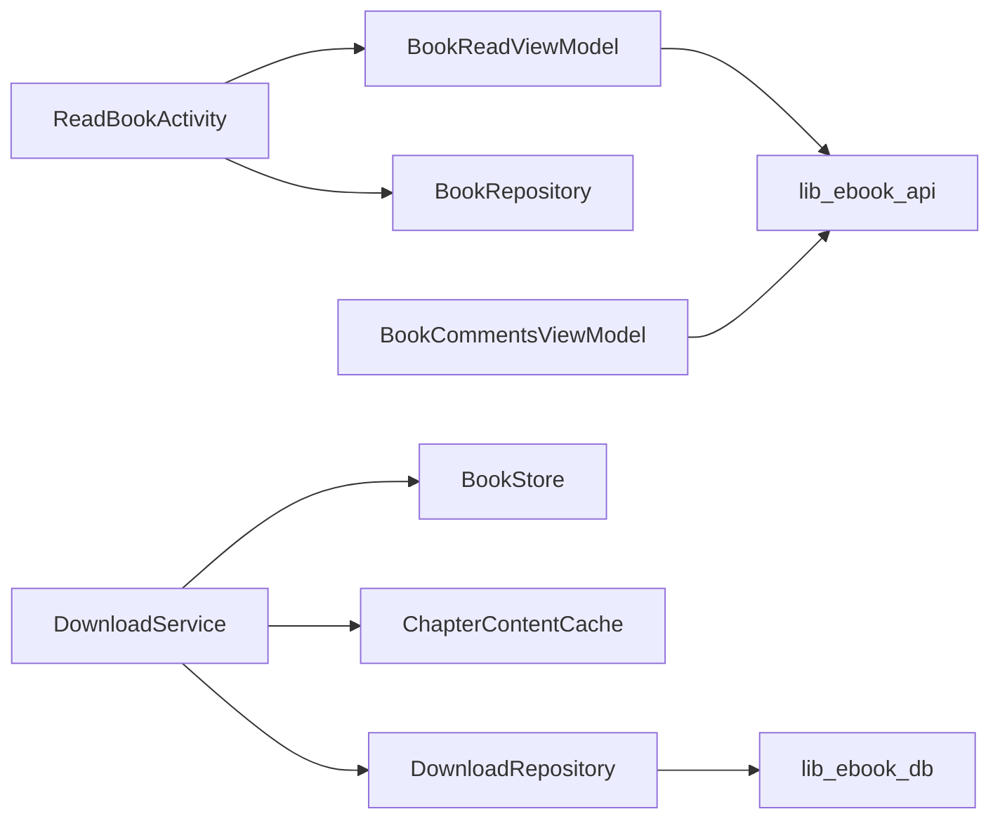

# 书籍阅读模块 (module_book)

<cite>
**本文引用的文件**
- [ReadBookActivity.kt](file://module_book/src/main/java/com/ebook/book/ReadBookActivity.kt)
- [DownloadService.kt](file://module_book/src/main/java/com/ebook/book/service/DownloadService.kt)
- [BitIntentDataManager.kt](file://module_book/src/main/java/com/ebook/book/manager/BitIntentDataManager.kt)
- [BookCommentsActivity.kt](file://module_book/src/main/java/com/ebook/book/BookCommentsActivity.kt)
- [DownloadRepository.kt](file://module_book/src/main/java/com/ebook/book/repository/DownloadRepository.kt)
- [DownloadManageActivity.kt](file://module_book/src/main/java/com/ebook/book/DownloadManageActivity.kt)
- [ChapterContentCache.kt](file://lib_book_common/src/main/java/com/ebook/common/store/ChapterContentCache.kt)
- [AppDatabase.kt](file://lib_ebook_db/src/main/java/com/ebook/db/AppDatabase.kt)
- [DownloadChapterEntity.kt](file://lib_ebook_db/src/main/java/com/ebook/db/entity/DownloadChapterEntity.kt)
- [DownloadChapterDao.kt](file://lib_ebook_db/src/main/java/com/ebook/db/dao/DownloadChapterDao.kt)
- [0018-download-foreground-service-data-sync-quota.md](file://docs/adr/0018-download-foreground-service-data-sync-quota.md)
- [0036-download-pause-per-book.md](file://docs/adr/0036-download-pause-per-book.md)
- [reader-scroll-mode-design.md](file://docs/superpowers/specs/2026-09-13-reader-scroll-mode-design.md)
</cite>

## 目录
1. [简介](#简介)
2. [项目结构](#项目结构)
3. [核心组件](#核心组件)
4. [架构总览](#架构总览)
5. [详细组件分析](#详细组件分析)
6. [依赖关系分析](#依赖关系分析)
7. [性能考虑](#性能考虑)
8. [故障排查指南](#故障排查指南)
9. [结论](#结论)
10. [附录](#附录)

## 简介
本模块负责“书籍阅读”的完整体验：从书籍导入、章节缓存与进度管理，到阅读器翻页/滚屏、字体与主题切换、评论系统以及离线下载前台服务。文档围绕 module_book 的职责边界展开，重点说明 ReadBookActivity 的阅读体验实现、下载服务的前台设计与并发控制、评论系统的跨源集成，并给出状态图与关键流程的代码级映射。

## 项目结构
module_book 是业务功能模块，包含阅读活动、下载服务、评论页面、MVVM ViewModel、仓库与资源等。它依赖 lib_book_common（通用领域与UI）、lib_ebook_api（网络接口）与 lib_ebook_db（数据库实体/DAO）。模块内以 Activity/Service/ViewModel/Repository 分层组织，UI 全面采用 Compose。

图示来源
- [ReadBookActivity.kt:86-154](file://module_book/src/main/java/com/ebook/book/ReadBookActivity.kt#L86-L154)
- [DownloadService.kt:40-77](file://module_book/src/main/java/com/ebook/book/service/DownloadService.kt#L40-L77)
- [BookCommentsActivity.kt:55-110](file://module_book/src/main/java/com/ebook/book/BookCommentsActivity.kt#L55-L110)
- [ChapterContentCache.kt](file://lib_book_common/src/main/java/com/ebook/common/store/ChapterContentCache.kt)
- [DownloadChapterEntity.kt](file://lib_ebook_db/src/main/java/com/ebook/db/entity/DownloadChapterEntity.kt)
- [DownloadChapterDao.kt](file://lib_ebook_db/src/main/java/com/ebook/db/dao/DownloadChapterDao.kt)

章节来源
- [ReadBookActivity.kt:86-154](file://module_book/src/main/java/com/ebook/book/ReadBookActivity.kt#L86-L154)
- [DownloadService.kt:40-77](file://module_book/src/main/java/com/ebook/book/service/DownloadService.kt#L40-L77)
- [BookCommentsActivity.kt:55-110](file://module_book/src/main/java/com/ebook/book/BookCommentsActivity.kt#L55-L110)

## 核心组件
- ReadBookActivity：Compose 版阅读器入口，承载翻页/滚屏模式、正文排版、菜单面板、音量键交互、进度保存与换源/评论跳转。
- DownloadService：离线下载前台服务，维护任务队列、单章重试、通知更新、配额超时处理与按书暂停策略。
- BookCommentsActivity：章节评论区，支持列表刷新、分页加载、评论发布与删除。
- BitIntentDataManager：大对象（含目录）跨 Activity 传递的进程内暂存区，避免 Binder 缓冲溢出。
- DownloadRepository：下载任务入库、取篇、状态回传与清理；配合 Room 表完成持久化。

章节来源
- [ReadBookActivity.kt:98-154](file://module_book/src/main/java/com/ebook/book/ReadBookActivity.kt#L98-L154)
- [DownloadService.kt:56-88](file://module_book/src/main/java/com/ebook/book/service/DownloadService.kt#L56-L88)
- [BookCommentsActivity.kt:77-110](file://module_book/src/main/java/com/ebook/book/BookCommentsActivity.kt#L77-L110)
- [BitIntentDataManager.kt:5-23](file://module_book/src/main/java/com/ebook/book/manager/BitIntentDataManager.kt#L5-L23)
- [DownloadRepository.kt](file://module_book/src/main/java/com/ebook/book/repository/DownloadRepository.kt)

## 架构总览
阅读与下载两条主线：
- 阅读主线：ReadBookActivity → BookReadViewModel → 数据源（本地章文件/网络解析）→ ReaderTypesetter 排版 → ReaderPager/ReaderScroll 渲染 → 进度落库。
- 下载主线：DownloadRepository.startDownload → DownloadService → JsoupSourceReader 抓取 → BookStore 写入章文件 → ChapterContentCache 失效 → 通知与状态回传。

图示来源
- [ReadBookActivity.kt:251-377](file://module_book/src/main/java/com/ebook/book/ReadBookActivity.kt#L251-L377)
- [DownloadService.kt:274-378](file://module_book/src/main/java/com/ebook/book/service/DownloadService.kt#L274-L378)

章节来源
- [ReadBookActivity.kt:251-377](file://module_book/src/main/java/com/ebook/book/ReadBookActivity.kt#L251-L377)
- [DownloadService.kt:274-378](file://module_book/src/main/java/com/ebook/book/service/DownloadService.kt#L274-L378)

## 详细组件分析

### ReadBookActivity：阅读体验实现
- 翻页/滚屏模式：通过 ReaderPagerController 与 ReaderScrollController 双控制器共存，当前模式由 turnModeIndex 决定；音量键事件根据非空控制器转发到对应方式。
- 排版与行数测算：使用 ReaderTypesetter.measureBlock 获取精确行高与每屏行数；布局尺寸变化时 rePaginate 重算，保证两种模式一致的分片口径。
- 字体设置与主题切换：正文层颜色/背景来自 ReadBookControl（四档纸张色），不随深浅主题切换；顶底栏/抽屉/面板继承全局 Material 主题，随系统外观切换。
- 进度管理：onProgress 回调统一写 dur_chapter/dur_page，进入/暂停时持久化，防止异常退出丢失。
- 章节缓存与正文加载：loadPage 统一走 BookRepository.loadChapter（本地章文件 + 内存缓存），排版偏移用 ChapterLayoutKey 缓存，减少重复计算。
- 评论与换源：顶部评论按钮聚合跨源 book_group 键，跳转到 BookCommentsActivity；换源通过 SourceSwitchSheet 完成“先插新后删旧”，替换 viewModel.bookShelf 为唯一事实源。

图示来源
- [ReadBookActivity.kt:149-154](file://module_book/src/main/java/com/ebook/book/ReadBookActivity.kt#L149-L154)
- [ReadBookActivity.kt:251-273](file://module_book/src/main/java/com/ebook/book/ReadBookActivity.kt#L251-L273)
- [ReadBookActivity.kt:308-377](file://module_book/src/main/java/com/ebook/book/ReadBookActivity.kt#L308-L377)
- [ReadBookActivity.kt:423-430](file://module_book/src/main/java/com/ebook/book/ReadBookActivity.kt#L423-L430)

章节来源
- [ReadBookActivity.kt:98-154](file://module_book/src/main/java/com/ebook/book/ReadBookActivity.kt#L98-L154)
- [ReadBookActivity.kt:251-377](file://module_book/src/main/java/com/ebook/book/ReadBookActivity.kt#L251-L377)
- [ReadBookActivity.kt:423-430](file://module_book/src/main/java/com/ebook/book/ReadBookActivity.kt#L423-L430)
- [ReadBookActivity.kt:600-688](file://module_book/src/main/java/com/ebook/book/ReadBookActivity.kt#L600-L688)

### DownloadService：下载服务设计
- 任务队列与并发控制：按“书架第一本非本地书里 dur_chapter_index 最小”的顺序取篇；单章循环重试 RETRY_TIMES 次，失败耗尽出队并计数；章间间隔 CHAPTER_INTERVAL_MS 降低对站点压力。
- 断点续传与按书暂停：暂停只置 isStartDownload=false，不出队；恢复时重新取篇继续；按书暂停由 DownloadRepository.getNextDownloadTask 在遍历时跳过 paused_book 任务。
- 通知与配额超时：dataSync 类型前台服务受 6h/24h 配额限制，onTimeout 仅做数秒收尾；常驻通知与完成通知分离通道；通知不可用时不影响下载流程。
- 缓存失效：强制刷新成功后调用 ChapterContentCache.invalidateBook，确保已打开阅读器读到新正文。
- 失败与异常：取消异常放行，普通异常记录日志并重试；重试耗尽才出队，避免队头阻塞后续章节。

图示来源
- [DownloadService.kt:126-206](file://module_book/src/main/java/com/ebook/book/service/DownloadService.kt#L126-L206)
- [DownloadService.kt:212-247](file://module_book/src/main/java/com/ebook/book/service/DownloadService.kt#L212-L247)
- [DownloadService.kt:274-378](file://module_book/src/main/java/com/ebook/book/service/DownloadService.kt#L274-L378)
- [DownloadService.kt:380-420](file://module_book/src/main/java/com/ebook/book/service/DownloadService.kt#L380-L420)
- [DownloadService.kt:646-666](file://module_book/src/main/java/com/ebook/book/service/DownloadService.kt#L646-L666)

章节来源
- [DownloadService.kt:56-88](file://module_book/src/main/java/com/ebook/book/service/DownloadService.kt#L56-L88)
- [DownloadService.kt:126-206](file://module_book/src/main/java/com/ebook/book/service/DownloadService.kt#L126-L206)
- [DownloadService.kt:274-378](file://module_book/src/main/java/com/ebook/book/service/DownloadService.kt#L274-L378)
- [DownloadService.kt:380-420](file://module_book/src/main/java/com/ebook/book/service/DownloadService.kt#L380-L420)
- [DownloadService.kt:646-666](file://module_book/src/main/java/com/ebook/book/service/DownloadService.kt#L646-L666)

### 评论系统集成
- 跨源合并：阅读器传入逗号分隔的多个 chapterKeys（每个 bookKey+“#”+durChapter），接收方拆分为 key 列表进行并集查询；写入键优先使用主键行（is_primary），避免误写旧桶。
- 评论页面：BaseMvvmActivity + Compose 列表，支持下拉刷新、加载更多、发送评论、长按删除本人评论；软键盘收起由事件驱动。
- 与阅读器的衔接：点击评论按钮时收集 book_group 关联键，构建 Bundle 并通过 TheRouter 跳转；若无 book_group 则回落到当前书信息计算一个键。

图示来源
- [ReadBookActivity.kt:213-235](file://module_book/src/main/java/com/ebook/book/ReadBookActivity.kt#L213-L235)
- [BookCommentsActivity.kt:82-104](file://module_book/src/main/java/com/ebook/book/BookCommentsActivity.kt#L82-L104)
- [BookCommentsActivity.kt:161-173](file://module_book/src/main/java/com/ebook/book/BookCommentsActivity.kt#L161-L173)

章节来源
- [ReadBookActivity.kt:213-235](file://module_book/src/main/java/com/ebook/book/ReadBookActivity.kt#L213-L235)
- [BookCommentsActivity.kt:77-110](file://module_book/src/main/java/com/ebook/book/BookCommentsActivity.kt#L77-L110)
- [BookCommentsActivity.kt:161-173](file://module_book/src/main/java/com/ebook/book/BookCommentsActivity.kt#L161-L173)

### 书籍管理能力（本地导入、在线下载、章节缓存、进度管理）
- 本地导入：ReadBookActivity.openBookFromOther 通过 BookImportRepository.import 将 URI 导入为书架条目，随后检查归属并进入阅读。
- 在线下载：DownloadRepository.startDownload 先将任务入库再拉起 DownloadService；服务按队列取篇并抓取正文写入章文件。
- 章节缓存：ChapterContentCache 进程级缓存，强制刷新成功时按 noteUrl 失效，保证阅读器读到最新正文。
- 进度管理：ReadBookActivity.onProgress/updateProgress/saveProgress 统一持久化 dur_chapter/dur_page；换源后重置为第一页并按新样式重排。

章节来源
- [ReadBookActivity.kt:190-211](file://module_book/src/main/java/com/ebook/book/ReadBookActivity.kt#L190-L211)
- [ReadBookActivity.kt:544-581](file://module_book/src/main/java/com/ebook/book/ReadBookActivity.kt#L544-L581)
- [DownloadService.kt:274-378](file://module_book/src/main/java/com/ebook/book/service/DownloadService.kt#L274-L378)
- [ChapterContentCache.kt](file://lib_book_common/src/main/java/com/ebook/common/store/ChapterContentCache.kt)

### 下载服务的状态图与关键业务逻辑
- 状态流转：空闲→启动中→运行中↔暂停→完成；超时触发 Paused 并停服，保留任务供前台恢复。
- 关键逻辑：
  - 取篇顺序与按书暂停：getNextDownloadTask 跳过 paused_book 任务。
  - 重试与出队：downloading 循环重试，耗尽后 deleteTask 并计数 skippedCount。
  - 缓存失效：forceRefresh 成功后 invalidateBook，避免旧正文命中。
  - 通知：buildOngoingNotification/postCompletedNotification/postAttentionNotification 分别处理进行中/完成/注意类提示。

章节来源
- [DownloadService.kt:212-247](file://module_book/src/main/java/com/ebook/book/service/DownloadService.kt#L212-L247)
- [DownloadService.kt:274-378](file://module_book/src/main/java/com/ebook/book/service/DownloadService.kt#L274-L378)
- [DownloadService.kt:444-464](file://module_book/src/main/java/com/ebook/book/service/DownloadService.kt#L444-L464)
- [DownloadService.kt:557-577](file://module_book/src/main/java/com/ebook/book/service/DownloadService.kt#L557-L577)

## 依赖关系分析
- 模块内依赖：ReadBookActivity 依赖 BookReadViewModel、BookRepository；DownloadService 依赖 DownloadRepository、JsoupSourceReader、BookStore、ChapterContentCache；BookCommentsActivity 依赖 BookCommentsViewModel。
- 跨模块依赖：lib_book_common 提供 ChapterContentCache 与领域模型；lib_ebook_api 提供网络服务；lib_ebook_db 提供 Room 实体/DAO。
- 外部约束：前台服务 dataSync 配额（ADR-0018）、按书暂停（ADR-0036）、滚动模式规格（reader-scroll-mode-design）。

图示来源
- [ReadBookActivity.kt:98-154](file://module_book/src/main/java/com/ebook/book/ReadBookActivity.kt#L98-L154)
- [DownloadService.kt:56-88](file://module_book/src/main/java/com/ebook/book/service/DownloadService.kt#L56-L88)
- [DownloadChapterEntity.kt](file://lib_ebook_db/src/main/java/com/ebook/db/entity/DownloadChapterEntity.kt)
- [DownloadChapterDao.kt](file://lib_ebook_db/src/main/java/com/ebook/db/dao/DownloadChapterDao.kt)

章节来源
- [ReadBookActivity.kt:98-154](file://module_book/src/main/java/com/ebook/book/ReadBookActivity.kt#L98-L154)
- [DownloadService.kt:56-88](file://module_book/src/main/java/com/ebook/book/service/DownloadService.kt#L56-L88)
- [DownloadChapterDao.kt](file://lib_ebook_db/src/main/java/com/ebook/db/dao/DownloadChapterDao.kt)

## 性能考虑
- 内存管理：
  - 大对象跨进程传递使用 BitIntentDataManager 暂存区，避免 Intent extra 的 Binder 缓冲溢出（TransactionTooLargeException）。
  - 下载服务使用 Handler 与 CoroutineScope 管理生命周期，避免泄漏；onDestroy 移除回调并 cancel 作用域。
- 图片与正文加载：
  - 正文读取统一走 BookRepository.loadChapter（本地章文件 + 内存缓存），减少重复 I/O。
  - 强制刷新成功后调用 ChapterContentCache.invalidateBook，确保已打开阅读器读到新正文。
- 数据库查询优化：
  - 下载取篇顺序明确（按 dur_chapter_index 最小），避免全表扫描低效路径。
  - 房间表主键策略遵循自然键 REPLACE，自增流水表 upsert 回填主键避免重复插入。
- 渲染与排版：
  - 使用 ReaderTypesetter.measureBlock 实测行数与块高，避免心算行高误差；同章翻页通过 ChapterLayoutKey 缓存排版偏移。
  - 两种翻页模式共用同一分片链，切换时按行号换算落点，避免错位与重排浪费。

章节来源
- [BitIntentDataManager.kt:5-23](file://module_book/src/main/java/com/ebook/book/manager/BitIntentDataManager.kt#L5-L23)
- [DownloadService.kt:89-94](file://module_book/src/main/java/com/ebook/book/service/DownloadService.kt#L89-L94)
- [DownloadService.kt:325-339](file://module_book/src/main/java/com/ebook/book/service/DownloadService.kt#L325-L339)
- [ReadBookActivity.kt:251-273](file://module_book/src/main/java/com/ebook/book/ReadBookActivity.kt#L251-L273)
- [ReadBookActivity.kt:308-377](file://module_book/src/main/java/com/ebook/book/ReadBookActivity.kt#L308-L377)

## 故障排查指南
- 阅读页空白/加载失败：
  - 检查书源是否失效（BookSourceNotFoundException），此时会报告 failure 并提示用户重新导入或换源。
  - 确认 readerTypesetter 已就绪、pageLineCount > 0；若为 null 或 0，需等待测量回调或重组。
- 下载中断/不继续：
  - 前台服务配额用尽（dataSync）会进入 Paused 并提示回到应用；检查 onTimeout 分支与通知。
  - 按书暂停导致 getNextDownloadTask 跳过该书；需在下载管理页恢复或取消。
- 通知异常：
  - Android 13+ 未授权时 notify 被静默丢弃，但下载不受影响；检查 areNotificationsEnabled 分支。
- 评论无法写入：
  - 确认传入的主键（PRIMARY_COMMENT_KEY）是否正确；若无 book_group 行，回落到当前书信息计算的键。

章节来源
- [ReadBookActivity.kt:308-377](file://module_book/src/main/java/com/ebook/book/ReadBookActivity.kt#L308-L377)
- [DownloadService.kt:115-124](file://module_book/src/main/java/com/ebook/book/service/DownloadService.kt#L115-L124)
- [DownloadService.kt:534-549](file://module_book/src/main/java/com/ebook/book/service/DownloadService.kt#L534-L549)
- [BookCommentsActivity.kt:82-104](file://module_book/src/main/java/com/ebook/book/BookCommentsActivity.kt#L82-L104)

## 结论
module_book 以 ReadBookActivity 为核心阅读入口，结合 BookReadViewModel 与排版引擎提供稳定流畅的翻页/滚屏体验；下载服务以 DownloadService 为中心，严格管理任务队列、重试与通知，并遵守前台服务配额约束；评论系统通过跨源键聚合与主键写入保障一致性。整体架构清晰、职责边界明确，适合持续迭代与扩展。

## 附录
- ADR 参考：
  - 前台服务配额：[0018-download-foreground-service-data-sync-quota.md](file://docs/adr/0018-download-foreground-service-data-sync-quota.md)
  - 按书暂停：[0036-download-pause-per-book.md](file://docs/adr/0036-download-pause-per-book.md)
  - 滚动模式规格：[reader-scroll-mode-design.md](file://docs/superpowers/specs/2026-09-13-reader-scroll-mode-design.md)