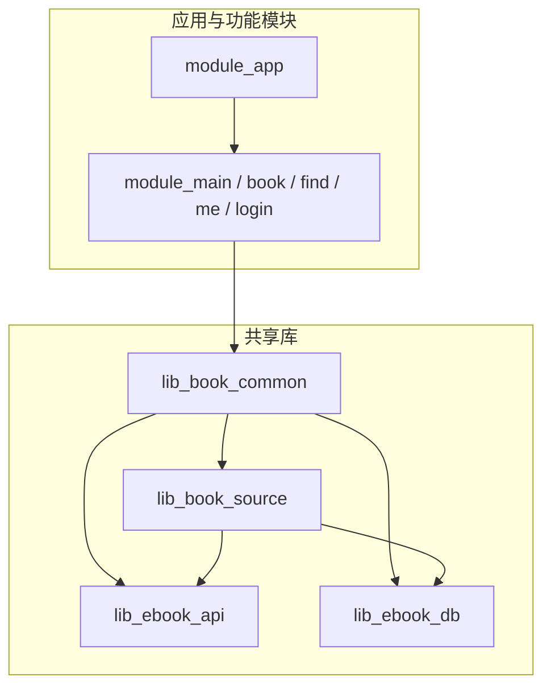
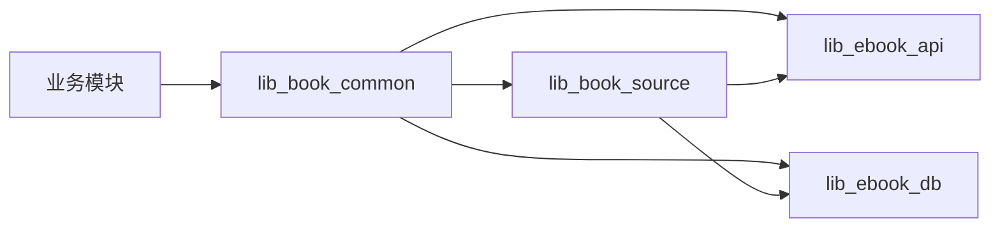
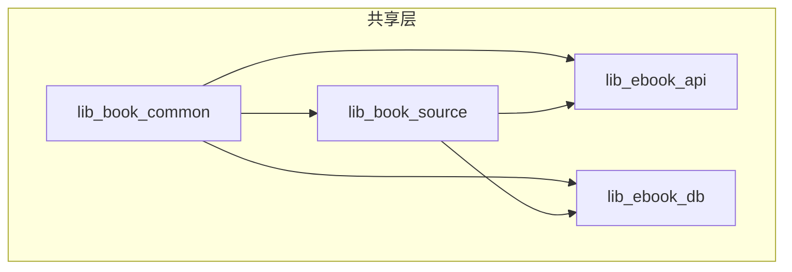

# 共享库设计

<cite>
**本文引用的文件**   
- [lib_book_common/build.gradle.kts](file://lib_book_common/build.gradle.kts)
- [lib_book_source/build.gradle.kts](file://lib_book_source/build.gradle.kts)
- [lib_ebook_api/build.gradle.kts](file://lib_ebook_api/build.gradle.kts)
- [lib_ebook_db/build.gradle.kts](file://lib_ebook_db/build.gradle.kts)
- [IBookProvider.kt](file://lib_book_common/src/main/java/com/ebook/common/provider/IBookProvider.kt)
- [UserSessionManager.kt](file://lib_book_common/src/main/java/com/ebook/common/domain/UserSessionManager.kt)
- [RetrofitBuilder.kt](file://lib_ebook_api/src/main/java/com/ebook/api/RetrofitBuilder.kt)
- [AppDatabase.kt](file://lib_ebook_db/src/main/java/com/ebook/db/AppDatabase.kt)
</cite>

## 目录
1. [简介](#简介)
2. [项目结构](#项目结构)
3. [核心组件](#核心组件)
4. [架构总览](#架构总览)
5. [详细组件分析](#详细组件分析)
6. [依赖关系分析](#依赖关系分析)
7. [性能与稳定性考虑](#性能与稳定性考虑)
8. [故障排查指南](#故障排查指南)
9. [结论](#结论)
10. [附录：API 使用示例与最佳实践](#附录api-使用示例与最佳实践)

## 简介
本文件聚焦四个共享库的设计目标、职责边界与依赖约束：
- lib_book_common：业务共享组件库，提供跨模块的 Provider 接口、通用业务逻辑（会话/主题/导入等）与基础工具。
- lib_book_source：书源解析引擎，支持 JSON 规则解析、脚本规则求值与 JavaScript 沙箱执行。
- lib_ebook_api：网络层封装，统一 Retrofit 服务定义、数据实体模型与 OkHttp 拦截器。
- lib_ebook_db：数据库层，基于 Room 的实体建模、DAO 接口设计与迁移策略。

文档同时给出依赖方向图、避免循环依赖的策略、关键流程时序图，以及各库 API 的使用示例与最佳实践。

## 项目结构
仓库采用多模块 Gradle 工程，核心共享库为四个 Android Library：
- lib_ebook_db：纯数据层，无上层业务依赖。
- lib_ebook_api：网络层，依赖数据库与通用库，不依赖业务实现。
- lib_book_source：解析层，依赖网络层与数据库以复用实体与 DAO。
- lib_book_common：业务共享层，聚合上述三层能力并向上暴露 Provider 接口与通用 UI/工具。

图表来源
- [lib_book_common/build.gradle.kts:37-44](file://lib_book_common/build.gradle.kts#L37-L44)
- [lib_book_source/build.gradle.kts:33-50](file://lib_book_source/build.gradle.kts#L33-L50)
- [lib_ebook_api/build.gradle.kts:40-58](file://lib_ebook_api/build.gradle.kts#L40-L58)
- [lib_ebook_db/build.gradle.kts:29-42](file://lib_ebook_db/build.gradle.kts#L29-L42)

章节来源
- [lib_book_common/build.gradle.kts:37-44](file://lib_book_common/build.gradle.kts#L37-L44)
- [lib_book_source/build.gradle.kts:33-50](file://lib_book_source/build.gradle.kts#L33-L50)
- [lib_ebook_api/build.gradle.kts:40-58](file://lib_ebook_api/build.gradle.kts#L40-L58)
- [lib_ebook_db/build.gradle.kts:29-42](file://lib_ebook_db/build.gradle.kts#L29-L42)

## 核心组件
- lib_book_common
  - 职责：跨模块共享的 Provider 接口、用户会话管理、主题模式、导入协调、通用 UI 与工具；对外暴露页面级 Composable 入口供宿主组合。
  - 关键类型：Provider 接口（如 IBookProvider）、UserSessionManager、ThemeModeManager 等。
- lib_book_source
  - 职责：书源解析引擎，包括原生解析器、脚本规则解析与求值、JavaScript 沙箱执行（QuickJS + JNI）。
  - 关键能力：JSON 规则装载、ScriptRuleSet 词法/求值、URL 解析与取文、内容解析对接 BookParser 契约。
- lib_ebook_api
  - 职责：网络层封装，统一 Retrofit/Kotlinx Serialization、OkHttp 拦截器、数据实体模型与请求适配。
  - 关键能力：服务端地址注入、客户端装配、响应编码处理、认证 token 附加。
- lib_ebook_db
  - 职责：Room 数据库抽象，实体建模、DAO 接口、Schema 迁移与事务封装。
  - 关键能力：AppDatabase、迁移链、BundledSQLiteDriver、JVM 测试变体。

章节来源
- [IBookProvider.kt:5-13](file://lib_book_common/src/main/java/com/ebook/common/provider/IBookProvider.kt#L5-L13)
- [UserSessionManager.kt:5-62](file://lib_book_common/src/main/java/com/ebook/common/domain/UserSessionManager.kt#L5-L62)
- [RetrofitBuilder.kt](file://lib_ebook_api/src/main/java/com/ebook/api/RetrofitBuilder.kt)
- [AppDatabase.kt](file://lib_ebook_db/src/main/java/com/ebook/db/AppDatabase.kt)

## 架构总览
整体分层清晰：
- 应用与功能模块仅依赖 lib_book_common。
- lib_book_common 聚合 lib_book_source、lib_ebook_api、lib_ebook_db，向上提供 Provider 与通用能力。
- lib_book_source 依赖 lib_ebook_api 与 lib_ebook_db，但不反向依赖业务模块。
- lib_ebook_api 与 lib_ebook_db 之间无业务耦合，彼此独立可复用。

图表来源
- [lib_book_common/build.gradle.kts:37-44](file://lib_book_common/build.gradle.kts#L37-L44)
- [lib_book_source/build.gradle.kts:33-50](file://lib_book_source/build.gradle.kts#L33-L50)

章节来源
- [lib_book_common/build.gradle.kts:37-44](file://lib_book_common/build.gradle.kts#L37-L44)
- [lib_book_source/build.gradle.kts:33-50](file://lib_book_source/build.gradle.kts#L33-L50)

## 详细组件分析

### lib_book_common：业务共享组件库
- Provider 接口
  - 以 IBookProvider 为代表，向外暴露页面级 @Composable 入口，由宿主通过路由创建并直接组合，解耦页面与模块。
- 通用业务逻辑
  - 用户会话：UserSessionManager 作为认证状态的唯一 seam，暴露登录态、当前会话、保存/轮换凭证、清除会话、获取 token 等能力。
  - 主题与 UI：统一的 Compose 主题接入点与共享 UI 组件，保证全仓视觉一致性。
  - 导入与存储：本地书籍导入协调、缓存与存储路径约定。
- 依赖约束
  - api 依赖 lib_ebook_api、lib_ebook_db、lib_book_source，以便业务模块仅依赖本库即可编译通过。
  - 对底层库使用 api 而非 implementation，确保下游能直接使用其公开类型（如解析器类型、DAO 接口）。

章节来源
- [IBookProvider.kt:5-13](file://lib_book_common/src/main/java/com/ebook/common/provider/IBookProvider.kt#L5-L13)
- [UserSessionManager.kt:5-62](file://lib_book_common/src/main/java/com/ebook/common/domain/UserSessionManager.kt#L5-L62)
- [lib_book_common/build.gradle.kts:37-44](file://lib_book_common/build.gradle.kts#L37-L44)

### lib_book_source：书源解析引擎
- 设计目标
  - 将“书源规则”与“解析实现”解耦：同一 BookParser 契约下，既支持原生解析器，也支持脚本规则解析。
  - 引入 JavaScript 沙箱执行器，使复杂解析逻辑可配置化、可热更新。
- 关键能力
  - JSON 规则解析：加载规则、校验字段、构建 ScriptRuleSet。
  - 脚本规则求值：链式规则、CSS/正则后端、变量插值、索引语义。
  - URL 解析与取文：根据规则生成请求 URL，按 charset 解码响应文本。
  - 正文读取：按章节翻页策略拼接正文，保持与原生解析一致的边界条件。
- 沙箱执行
  - QuickJS 内核 vendored，C++ JNI 桥接；进程隔离，主线程守卫，白名单限制外呼。
  - 错误分类：未装配执行器抛类型化异常；执行失败带内核原文。

章节来源
- [lib_book_source/build.gradle.kts:33-50](file://lib_book_source/build.gradle.kts#L33-L50)

### lib_ebook_api：网络层封装
- 设计目标
  - 统一网络栈与数据契约：Retrofit + Kotlinx Serialization + OkHttp，集中处理序列化、拦截、编码与错误映射。
- 关键能力
  - Retrofit 服务定义：按领域划分 service 包，声明 suspend 函数返回 Flow/Result。
  - 数据实体：DTO 与 RespDTO 信封，字段级 @SerialName 映射。
  - 拦截器：编码拦截器（强制 UTF-8）、认证拦截器（token 附加到白名单 host）。
  - 客户端装配：@Named("source") 纯净客户端用于第三方站点；release 专用客户端不带 token。
- 配置注入
  - 服务端地址从 local.properties 注入 BuildConfig，便于本机调试与真机联调。

章节来源
- [lib_ebook_api/build.gradle.kts:12-24](file://lib_ebook_api/build.gradle.kts#L12-L24)
- [lib_ebook_api/build.gradle.kts:40-58](file://lib_ebook_api/build.gradle.kts#L40-L58)
- [RetrofitBuilder.kt](file://lib_ebook_api/src/main/java/com/ebook/api/RetrofitBuilder.kt)

### lib_ebook_db：数据库设计
- 设计目标
  - 以 Room 为中心的数据持久化抽象，提供稳定的 DAO 接口与 Schema 演进机制。
- 关键能力
  - AppDatabase：集中注册实体与 DAO，配置迁移链。
  - 实体建模：自然键表与自增流水表的主键策略区分，UP/SERT 行为明确。
  - 迁移策略：禁止 destructive migration，每次变更 version+1 并追加紧邻 MIGRATION_n_n+1，提交生成的 schema JSON。
  - 驱动与测试：生产使用 BundledSQLiteDriver；JVM 测试使用同引擎桌面变体，保证迁移 SQL 在真实引擎上执行。

章节来源
- [lib_ebook_db/build.gradle.kts:29-42](file://lib_ebook_db/build.gradle.kts#L29-L42)
- [AppDatabase.kt](file://lib_ebook_db/src/main/java/com/ebook/db/AppDatabase.kt)

## 依赖关系分析
- 依赖方向
  - 业务模块 → lib_book_common
  - lib_book_common → lib_book_source、lib_ebook_api、lib_ebook_db（并列 api）
  - lib_book_source → lib_ebook_api、lib_ebook_db
  - lib_ebook_api 与 lib_ebook_db 无业务耦合
- 避免循环依赖策略
  - 所有业务逻辑收敛在 lib_book_common；解析层不反向依赖业务模块。
  - 网络层与数据库层保持最小依赖面，仅被共享层与解析层引用。
  - Provider 接口位于 lib_book_common，由业务模块实现并通过路由装配，避免库间互相知道具体实现类。

图表来源
- [lib_book_common/build.gradle.kts:37-44](file://lib_book_common/build.gradle.kts#L37-L44)
- [lib_book_source/build.gradle.kts:33-50](file://lib_book_source/build.gradle.kts#L33-L50)

章节来源
- [lib_book_common/build.gradle.kts:37-44](file://lib_book_common/build.gradle.kts#L37-L44)
- [lib_book_source/build.gradle.kts:33-50](file://lib_book_source/build.gradle.kts#L33-L50)

## 性能与稳定性考虑
- 解析性能
  - 脚本规则求值走沙箱时，严禁在主线程调用；回调回主进程需经 binder 线程池，避免死锁。
  - 规则装载与求值应做结果缓存（LRU），减少重复解析开销。
- 网络性能
  - 统一 OkHttp 连接池与拦截器链；对第三方站点使用纯净客户端，避免不必要的认证头。
  - 编码拦截器确保正确解码，避免因乱码导致的二次重试。
- 数据库性能
  - 批量写入使用事务；UP/SERT 注意主键回填，避免“先删后插”导致唯一索引冲突。
  - 迁移只在启动时执行一次，避免频繁 IO。

[本节为通用指导，无需特定文件引用]

## 故障排查指南
- 会话过期
  - 现象：页面不闪退但数据始终为空。
  - 排查：检查认证拦截器是否对白名单 host 附加 token；确认 TokenHolder 刷新流程与事件上报。
- 脚本沙箱执行失败
  - 现象：规则段含 JS 时报错或静默失败。
  - 排查：确认执行器已装配；区分“未装配执行器”与“执行失败”两类异常；查看白名单与私网访问限制。
- 网络乱码
  - 现象：第三方站点返回 gbk/utf-8 不一致导致乱码。
  - 排查：确认编码拦截器生效；取文层按选项 charset 显式字节解码，不走 body.string()。
- 数据库迁移
  - 现象：升级后崩溃或数据丢失。
  - 排查：确认版本递增、迁移链完整且顺序相邻；不要启用 destructive migration；在 JVM 测试中用 BundledSQLiteDriver 验证迁移 SQL。

章节来源
- [lib_ebook_api/build.gradle.kts:12-24](file://lib_ebook_api/build.gradle.kts#L12-L24)
- [lib_ebook_db/build.gradle.kts:29-42](file://lib_ebook_db/build.gradle.kts#L29-L42)

## 结论
本项目通过清晰的四层共享库划分，实现了业务、解析、网络与数据的解耦：
- lib_book_common 作为业务共享枢纽，提供 Provider 接口与通用能力，屏蔽下层细节。
- lib_book_source 将书源规则与实现解耦，支持脚本化与沙箱执行，提升扩展性与可维护性。
- lib_ebook_api 统一网络契约与拦截策略，保障编码、认证与错误处理的一致性。
- lib_ebook_db 提供稳定的数据抽象与迁移策略，确保数据演进的可靠性。

依赖方向严格单向，避免循环依赖；通过 Provider 与接口隔离，业务模块仅依赖共享层即可获得全部能力。

## 附录：API 使用示例与最佳实践

- 使用 lib_book_common 的 Provider
  - 在宿主中通过路由解析得到 Provider，直接组合其 @Composable 页面。
  - 页面内通过 Hilt 注入 ViewModel，ViewModel 再注入 Repository/Manager。
  - 参考：IBookProvider 的 mainBookPage 即为页面级 Composable 入口。

- 使用 UserSessionManager
  - 观察 isLoggedIn/currentUser 状态流，进行登录态驱动的 UI 切换。
  - 登录成功后调用 saveSession，退出调用 clearSession；刷新 token 使用 rotateCredentials。

- 使用 lib_ebook_api 的网络能力
  - 通过 Retrofit 服务接口发起请求，返回协程/Flow；使用 @Named("source") 客户端访问第三方站点。
  - 注意服务端地址来自 BuildConfig，便于本地调试；认证头由拦截器自动附加至白名单 host。

- 使用 lib_ebook_db 的数据能力
  - 通过 DAO 接口进行查询与写入；批量操作包裹事务；迁移时遵循 version+1 与紧邻迁移链。
  - 单元测试使用 BundledSQLiteDriver 的 JVM 变体验证迁移 SQL。

- 使用 lib_book_source 的解析能力
  - 通过 BookSourceManager.getParserFor(url) 获取解析器；原生与脚本规则统一进入解析链路。
  - 脚本规则中的 JS 片段交由沙箱执行，确保主线程安全与白名单控制。

章节来源
- [IBookProvider.kt:5-13](file://lib_book_common/src/main/java/com/ebook/common/provider/IBookProvider.kt#L5-L13)
- [UserSessionManager.kt:5-62](file://lib_book_common/src/main/java/com/ebook/common/domain/UserSessionManager.kt#L5-L62)
- [lib_ebook_api/build.gradle.kts:12-24](file://lib_ebook_api/build.gradle.kts#L12-L24)
- [lib_ebook_db/build.gradle.kts:29-42](file://lib_ebook_db/build.gradle.kts#L29-L42)
- [lib_book_source/build.gradle.kts:33-50](file://lib_book_source/build.gradle.kts#L33-L50)