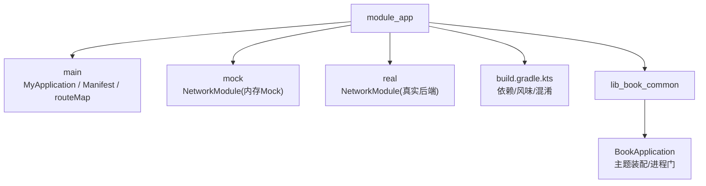
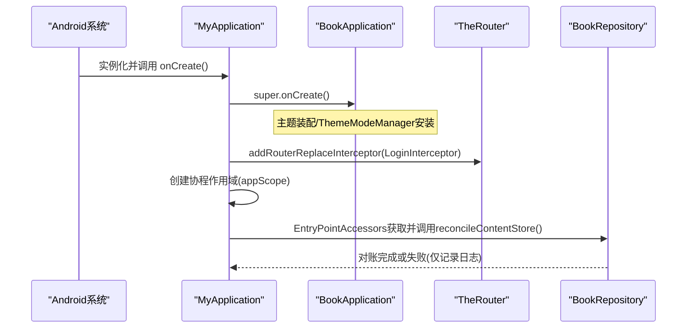
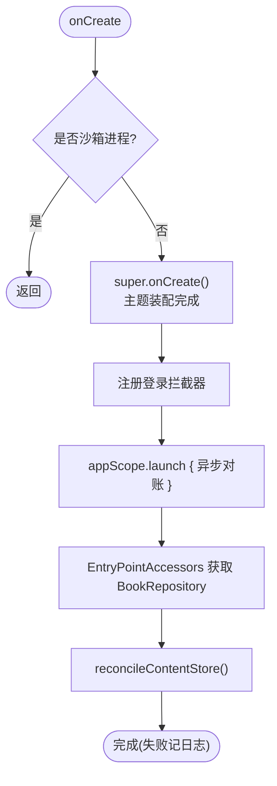
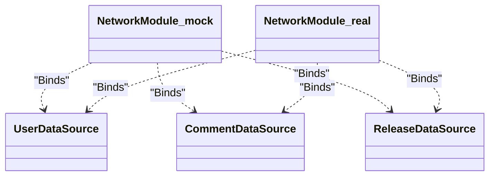
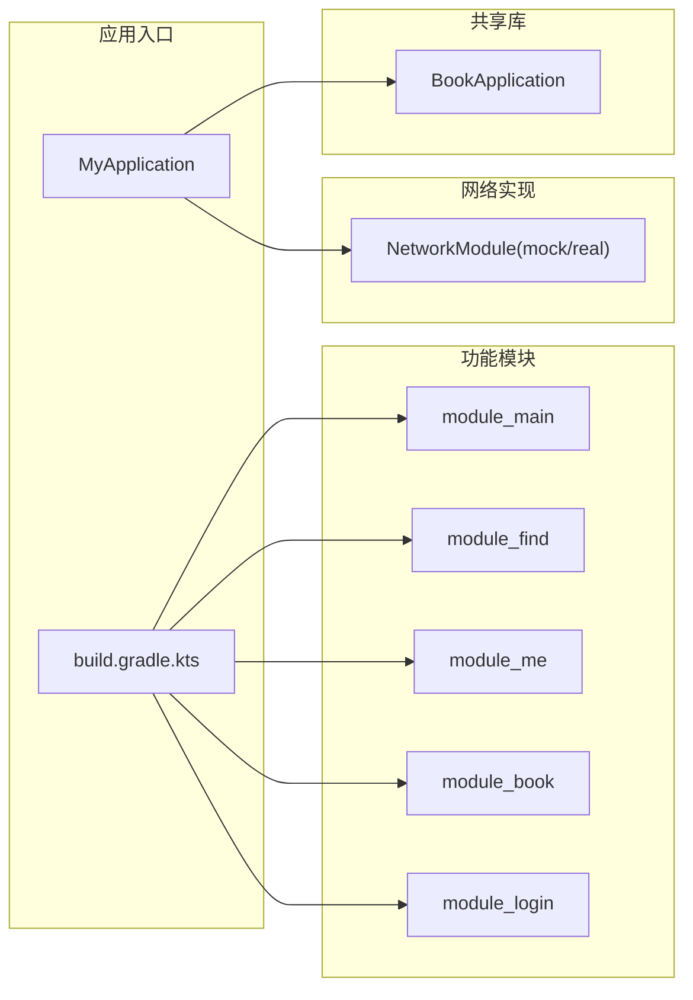

# 应用入口模块 (module_app)

<cite>
**本文引用的文件**
- [MyApplication.kt](file://module_app/src/main/java/com/ebook/MyApplication.kt)
- [build.gradle.kts](file://module_app/build.gradle.kts)
- [AndroidManifest.xml](file://module_app/src/main/AndroidManifest.xml)
- [NetworkModule（mock）.kt](file://module_app/src/mock/java/com/ebook/di/NetworkModule.kt)
- [NetworkModule（real）.kt](file://module_app/src/real/java/com/ebook/di/NetworkModule.kt)
- [BookApplication.kt](file://lib_book_common/src/main/java/com/ebook/common/BookApplication.kt)
- [libs.versions.toml](file://gradle/libs.versions.toml)
- [proguard-rules.pro](file://module_app/proguard-rules.pro)
- [routeMap.json](file://module_app/src/main/assets/therouter/routeMap.json)
</cite>

## 目录
1. [简介](#简介)
2. [项目结构](#项目结构)
3. [核心组件](#核心组件)
4. [架构总览](#架构总览)
5. [详细组件分析](#详细组件分析)
6. [依赖关系分析](#依赖关系分析)
7. [性能考虑](#性能考虑)
8. [故障排查指南](#故障排查指南)
9. [结论](#结论)
10. [附录](#附录)

## 简介
本模块是应用的唯一入口与装配中心，承担以下职责：
- 定义并启动应用进程（声明 Application、权限、网络策略等）
- 通过 Hilt 配置依赖注入图，并在应用初始化时完成关键基础设施的装配
- 统一注册路由（TheRouter），并接入登录拦截器
- 在启动期异步执行内容存储对账，回收无主目录，保障磁盘空间与数据一致性
- 通过 product flavor 切换网络实现（mock/real），屏蔽后端差异以支持离线开发调试
- 集中管理构建配置（依赖版本、资源处理、混淆规则）

该模块不直接承载业务页面，而是作为“胶水层”将各功能模块组装为可运行的应用。

## 项目结构
module_app 采用 Android 标准多源集组织方式：
- main：应用入口类、清单、资源、路由表
- mock/real：按产品风味提供不同网络实现绑定（Hilt Module）
- build.gradle.kts：统一依赖、风味维度、混淆与编译选项

图示来源
- [MyApplication.kt:19-43](file://module_app/src/main/java/com/ebook/MyApplication.kt#L19-L43)
- [BookApplication.kt:17-49](file://lib_book_common/src/main/java/com/ebook/common/BookApplication.kt#L17-L49)
- [build.gradle.kts:17-36](file://module_app/build.gradle.kts#L17-L36)

章节来源
- [MyApplication.kt:19-65](file://module_app/src/main/java/com/ebook/MyApplication.kt#L19-L65)
- [AndroidManifest.xml:31-43](file://module_app/src/main/AndroidManifest.xml#L31-L43)
- [build.gradle.kts:1-64](file://module_app/build.gradle.kts#L1-L64)

## 核心组件
- MyApplication：应用唯一入口，负责 Hilt 初始化、路由拦截、内容存储对账
- BookApplication：基类，负责沙箱进程门、主题装配、ThemeModeManager 挂载
- NetworkModule（mock/real）：按风味绑定 User/Comment/Release 数据源到对应实现
- routeMap.json：TheRouter 路由表，声明跨模块页面路径与参数约束
- build.gradle.kts：定义 applicationId、version、flavorDimensions、minifyEnabled、依赖范围
- proguard-rules.pro：混淆与反射保留规则（TheRouter、行号属性等）

章节来源
- [MyApplication.kt:19-65](file://module_app/src/main/java/com/ebook/MyApplication.kt#L19-L65)
- [BookApplication.kt:17-49](file://lib_book_common/src/main/java/com/ebook/common/BookApplication.kt#L17-L49)
- [NetworkModule（mock）.kt:14-37](file://module_app/src/mock/java/com/ebook/di/NetworkModule.kt#L14-L37)
- [NetworkModule（real）.kt:14-35](file://module_app/src/real/java/com/ebook/di/NetworkModule.kt#L14-L35)
- [routeMap.json:1-150](file://module_app/src/main/assets/therouter/routeMap.json#L1-L150)
- [build.gradle.kts:1-64](file://module_app/build.gradle.kts#L1-L64)
- [proguard-rules.pro:1-34](file://module_app/proguard-rules.pro#L1-L34)

## 架构总览
应用启动时，Android 框架实例化清单中声明的 Application，随后进入 MyApplication.onCreate。该流程由三层构成：
- 进程门：隔离进程（如 :js 沙箱）提前返回，避免在主进程之外的环境执行 UI/存储相关逻辑
- 基础初始化：父类 BookApplication 完成主题装配、ThemeModeManager 挂入 Compose 重组链
- 应用级装配：注册 TheRouter 登录拦截器；异步触发内容存储对账

图示来源
- [MyApplication.kt:24-43](file://module_app/src/main/java/com/ebook/MyApplication.kt#L24-L43)
- [BookApplication.kt:17-49](file://lib_book_common/src/main/java/com/ebook/common/BookApplication.kt#L17-L49)

## 详细组件分析

### MyApplication：应用启动与装配
- 入口标注 @HiltAndroidApp，启用 Hilt 生成代码并构建 DI 图
- 进程门：SandboxProcess.isInIsolatedProcess 为真时立即 return，避免在非 UI 进程执行
- 路由拦截：addRouterReplaceInterceptor(LoginInterceptor)，未登录访问受限页面将被重定向
- 内容存储对账：在 IO 协程中通过 EntryPointAccessors 获取 BookRepository 并调用 reconcileContentStore()，对账失败仅记录日志不影响启动
- Hilt EntryPoint：为避免 Application 字段注入在沙箱进程崩溃，使用 @EntryPoint + InstallIn(SingletonComponent) 延迟取用仓库

图示来源
- [MyApplication.kt:24-61](file://module_app/src/main/java/com/ebook/MyApplication.kt#L24-L61)

章节来源
- [MyApplication.kt:19-65](file://module_app/src/main/java/com/ebook/MyApplication.kt#L19-L65)

### BookApplication：基类初始化与主题装配
- 进程门：同样检查沙箱进程，避免非 UI 进程执行主题与存储相关逻辑
- 主题装配：通过 AppTheme.install 注入 MyApplicationTheme，并按 ThemeModeManager 的持久化模式决定深浅色
- 主题管理器挂载：通过 EntryPointAccessors 从 SingletonComponent 取出 ThemeModeManager 并 installIntoCompanion，供 Compose 重组读取

章节来源
- [BookApplication.kt:17-59](file://lib_book_common/src/main/java/com/ebook/common/BookApplication.kt#L17-L59)

### 双构建模式（mock/real）与网络模块切换
- 通过 productFlavors 定义 network 维度下的 real 与 mock 两种风味
- 同名接口在不同 source set 提供不同实现：
  - mock：User/Comment/Release 指向内存或静态资产实现，无需后端
  - real：指向真实网络实现，基址通过 BuildConfig 注入
- 两个 NetworkModule 互斥，编译时仅包含当前风味对应的实现

图示来源
- [NetworkModule（mock）.kt:14-37](file://module_app/src/mock/java/com/ebook/di/NetworkModule.kt#L14-L37)
- [NetworkModule（real）.kt:14-35](file://module_app/src/real/java/com/ebook/di/NetworkModule.kt#L14-L35)

章节来源
- [build.gradle.kts:17-26](file://module_app/build.gradle.kts#L17-L26)
- [NetworkModule（mock）.kt:14-37](file://module_app/src/mock/java/com/ebook/di/NetworkModule.kt#L14-L37)
- [NetworkModule（real）.kt:14-35](file://module_app/src/real/java/com/ebook/di/NetworkModule.kt#L14-L35)

### TheRouter 路由注册
- 应用通过 addRouterReplaceInterceptor 注入登录拦截器，确保需要登录的路由在未登录时重定向
- routeMap.json 声明跨模块 Activity 路由路径与 needLogin 等参数，由 TheRouter transform 生成运行时路由表
- 独立模式下需在同名路径占位以避免路由静默丢失

章节来源
- [MyApplication.kt:29-30](file://module_app/src/main/java/com/ebook/MyApplication.kt#L29-L30)
- [routeMap.json:1-150](file://module_app/src/main/assets/therouter/routeMap.json#L1-L150)

### 构建配置与依赖管理
- 应用包名与版本：applicationId、versionCode、versionName
- 风味维度：network（real/mock），mock 附加 .mock 后缀便于区分
- 混淆：release 开启 isMinifyEnabled，使用默认优化规则与本模块 proguard-rules.pro
- 依赖范围：集成态下 module_app 依赖所有功能模块；独立态仅编译自身
- 编译目标：JVM 17，Kotlin jvmTarget 17
- 版本目录：所有依赖版本来自 libs.versions.toml，保证统一管理与升级

章节来源
- [build.gradle.kts:1-64](file://module_app/build.gradle.kts#L1-L64)
- [libs.versions.toml:1-237](file://gradle/libs.versions.toml#L1-L237)

### 混淆规则
- 行号属性保留 SourceFile, LineNumberTable 并通过 -renamesourcefileattribute 隐藏源文件名，配合 mapping.txt 还原崩溃栈
- TheRouter 相关反射与注解保留，避免运行时 Class.forName 找不到类
- 功能模块的反射面规则由各模块 consumer-rules.pro 传播，module_app 不重复书写第三方库规则

章节来源
- [proguard-rules.pro:1-34](file://module_app/proguard-rules.pro#L1-L34)

## 依赖关系分析
- module_app 依赖 lib_book_common（共享基类、领域模型、工具）
- 集成态依赖全部功能模块（module_main、module_find、module_me、module_book、module_login）
- 通过 Hilt 注入网络实现（由风味 source set 决定）
- 通过 TheRouter 进行跨模块导航（路由表集中管理）

图示来源
- [build.gradle.kts:48-58](file://module_app/build.gradle.kts#L48-L58)
- [NetworkModule（mock）.kt:14-37](file://module_app/src/mock/java/com/ebook/di/NetworkModule.kt#L14-L37)
- [NetworkModule（real）.kt:14-35](file://module_app/src/real/java/com/ebook/di/NetworkModule.kt#L14-L35)

章节来源
- [build.gradle.kts:48-58](file://module_app/build.gradle.kts#L48-L58)

## 性能考虑
- 内容存储对账放在 IO 协程中执行，避免阻塞主线程；失败仅记录日志，不影响冷启动体验
- 使用 EntryPointAccessors 延迟获取 BookRepository，减少不必要初始化开销，同时规避沙箱进程问题
- 主题装配在基类中集中完成，避免各页面重复设置导致重复计算
- release 构建开启 R8 优化，减少体积并提升运行效率

[本节为通用指导，不直接分析具体文件]

## 故障排查指南
- 启动即崩溃（沙箱进程）
  - 现象：进程启动后立刻退出或 Binder 超时
  - 原因：Application 存在 eager @Inject 字段，Hilt 在 super.onCreate() 内注入，早于进程门
  - 解决：移除 Application 字段注入，改用 EntryPointAccessors 在用到时获取（参考 ContentStoreEntryPoint）
  - 参考
    - [MyApplication.kt:46-61](file://module_app/src/main/java/com/ebook/MyApplication.kt#L46-L61)

- 路由跳转无效（独立模式）
  - 现象：跨模块路由无响应且仅日志
  - 原因：独立模式缺少其他模块，路由不存在
  - 解决：在独立宿主 src/main/test/debug/ 提供同名 @Route 占位
  - 参考
    - [routeMap.json:1-150](file://module_app/src/main/assets/therouter/routeMap.json#L1-L150)

- 网络请求异常（本地后端）
  - 现象：页面加载不出数据但无崩溃
  - 原因：Android 17+ 访问本地地址需额外权限或使用回环地址；本项目建议 adb reverse + 127.0.0.1
  - 解决：使用 adb reverse tcp:端口 tcp:端口，并将服务端 host 设置为 127.0.0.1
  - 参考
    - [libs.versions.toml 中 okhttp/retrofit 版本](file://gradle/libs.versions.toml#L150-L190)

- 混淆后崩溃（无法还原堆栈）
  - 现象：线上崩溃堆栈不可读
  - 原因：未保留行号或 mapping 缺失
  - 解决：确认 release 开启 isMinifyEnabled 并包含行号属性与 mapping 文件
  - 参考
    - [build.gradle.kts:27-35](file://module_app/build.gradle.kts#L27-L35)
    - [proguard-rules.pro:12-14](file://module_app/proguard-rules.pro#L12-L14)

- 对账失败影响启动
  - 现象：首次启动偶发卡顿或提示
  - 说明：对账失败仅记录日志，不应影响启动；若出现阻塞，检查是否在 IO 协程外调用
  - 参考
    - [MyApplication.kt:31-43](file://module_app/src/main/java/com/ebook/MyApplication.kt#L31-L43)

章节来源
- [MyApplication.kt:24-61](file://module_app/src/main/java/com/ebook/MyApplication.kt#L24-L61)
- [routeMap.json:1-150](file://module_app/src/main/assets/therouter/routeMap.json#L1-L150)
- [build.gradle.kts:27-35](file://module_app/build.gradle.kts#L27-L35)
- [proguard-rules.pro:12-14](file://module_app/proguard-rules.pro#L12-L14)

## 结论
module_app 作为应用入口模块，承担了应用生命周期起点、依赖注入装配、路由与安全拦截、内容存储对账以及构建产物控制等核心职责。其设计通过分层初始化、延迟注入与风味切换，兼顾了可维护性、可扩展性与开发调试效率。遵循本文档的约定与排查指引，可快速定位常见问题并确保应用稳定启动。

[本节为总结性内容，不直接分析具体文件]

## 附录

### 应用启动流程关键点（代码片段路径）
- 应用入口与 Hilt 初始化：[MyApplication.kt:19-27](file://module_app/src/main/java/com/ebook/MyApplication.kt#L19-L27)
- 进程门与登录拦截：[MyApplication.kt:24-30](file://module_app/src/main/java/com/ebook/MyApplication.kt#L24-L30)
- 内容存储对账（异步）：[MyApplication.kt:31-43](file://module_app/src/main/java/com/ebook/MyApplication.kt#L31-L43)
- 延迟注入（EntryPoint）：[MyApplication.kt:46-61](file://module_app/src/main/java/com/ebook/MyApplication.kt#L46-L61)
- 主题装配（基类）：[BookApplication.kt:17-49](file://lib_book_common/src/main/java/com/ebook/common/BookApplication.kt#L17-L49)
- 风味与依赖（构建脚本）：[build.gradle.kts:17-58](file://module_app/build.gradle.kts#L17-L58)
- 网络实现切换（mock/real）：
  - [NetworkModule（mock）.kt:14-37](file://module_app/src/mock/java/com/ebook/di/NetworkModule.kt#L14-L37)
  - [NetworkModule（real）.kt:14-35](file://module_app/src/real/java/com/ebook/di/NetworkModule.kt#L14-L35)
- 路由表（TheRouter）：[routeMap.json:1-150](file://module_app/src/main/assets/therouter/routeMap.json#L1-L150)
- 混淆规则（R8）：[proguard-rules.pro:1-34](file://module_app/proguard-rules.pro#L1-L34)

[本节为索引用途，不直接分析具体文件]