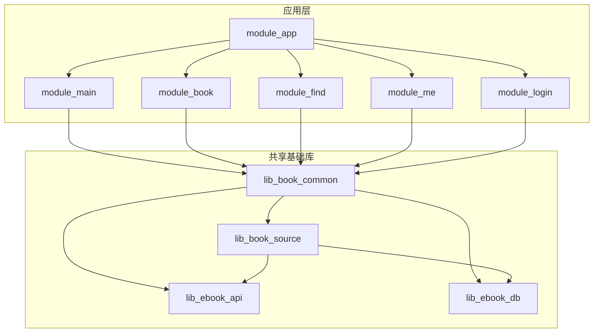
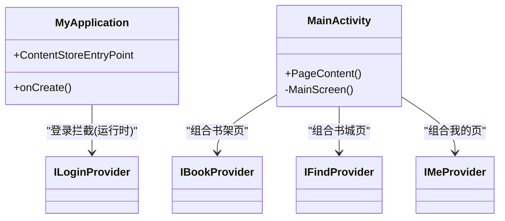
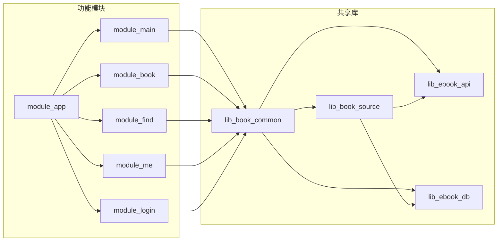

# 模块边界与职责划分

<cite>
**本文引用的文件**
- [settings.gradle.kts](file://settings.gradle.kts)
- [module_app/build.gradle.kts](file://module_app/build.gradle.kts)
- [module_main/build.gradle.kts](file://module_main/build.gradle.kts)
- [module_book/build.gradle.kts](file://module_book/build.gradle.kts)
- [lib_book_common/build.gradle.kts](file://lib_book_common/build.gradle.kts)
- [lib_book_source/build.gradle.kts](file://lib_book_source/build.gradle.kts)
- [MyApplication.kt](file://module_app/src/main/java/com/ebook/MyApplication.kt)
- [MainActivity.kt](file://module_main/src/main/java/com/ebook/main/MainActivity.kt)
- [SplashActivity.kt](file://module_main/src/main/java/com/ebook/main/SplashActivity.kt)
- [IMeProvider.kt](file://lib_book_common/src/main/java/com/ebook/common/provider/IMeProvider.kt)
- [ILoginProvider.kt](file://lib_book_common/src/main/java/com/ebook/common/provider/ILoginProvider.kt)
- [IFindProvider.kt](file://lib_book_common/src/main/java/com/ebook/common/provider/IFindProvider.kt)
- [IBookProvider.kt](file://lib_book_common/src/main/java/com/ebook/common/provider/IBookProvider.kt)
</cite>

## 目录
1. [简介](#简介)
2. [项目结构](#项目结构)
3. [核心组件](#核心组件)
4. [架构总览](#架构总览)
5. [详细组件分析](#详细组件分析)
6. [依赖关系分析](#依赖关系分析)
7. [性能与构建特性](#性能与构建特性)
8. [故障排查指南](#故障排查指南)
9. [结论](#结论)
10. [附录：模块职责变更评估与迁移指南](#附录模块职责变更评估与迁移指南)

## 简介
本文件面向读者说明本项目的模块化边界与各业务模块的单一职责，重点阐述：
- module_app 作为应用入口的职责（Hilt 装配、双构建模式支持、启动期初始化）
- module_main 的主界面容器职责（底部导航、启动页处理、路由注册）
- 各功能模块（module_book、module_find、module_me、module_login）的独立性与互不依赖原则，以及通过 Provider 接口暴露能力的规范
- 共享库 lib_book_common、lib_book_source、lib_ebook_api、lib_ebook_db 的设计目标与依赖方向约束
- 编译期与运行时的依赖关系图，以及如何避免循环依赖与设计反模式
- 模块职责变更时的评估标准与迁移路径

## 项目结构
项目采用多模块 Gradle 工程，根配置声明了所有子模块。应用入口为 module_app，聚合多个功能模块；功能模块之间互不直接依赖，统一通过 lib_book_common 提供的公共能力与 Provider 接口进行解耦。

图表来源
- [settings.gradle.kts:56-65](file://settings.gradle.kts#L56-L65)
- [module_app/build.gradle.kts:48-58](file://module_app/build.gradle.kts#L48-L58)
- [lib_book_common/build.gradle.kts:37-44](file://lib_book_common/build.gradle.kts#L37-L44)
- [lib_book_source/build.gradle.kts:33-42](file://lib_book_source/build.gradle.kts#L33-L42)

章节来源
- [settings.gradle.kts:56-65](file://settings.gradle.kts#L56-L65)

## 核心组件
- module_app：应用入口，装配 Hilt 与登录拦截，负责双 flavor（real/mock）网络后端切换，并在启动时执行内容仓库对账等一次性任务。
- module_main：主界面容器，承载三个 Tab（书架、书城、我的）的底部导航与页面组合；启动页 SplashActivity 承担启动期会话预载与跳转门控。
- module_book：书籍阅读与管理相关页面（阅读器、导入、编辑元数据、评论、下载管理等）。
- module_find：书城、搜索、书库浏览等发现类页面。
- module_me：个人中心、设置、版本更新检查、缓存管理等。
- module_login：登录、注册、密码修改、用户验证等认证流程。
- lib_book_common：共享 UI 组件、Provider 接口、通用工具与基类；对外暴露书源解析器抽象与跨模块能力。
- lib_book_source：书源解析专用层（原生解析器、脚本书源解释器、沙箱执行器），依赖 api/db 契约。
- lib_ebook_api：网络层（Retrofit、实体、拦截器）。
- lib_ebook_db：Room 数据库实体与 DAO。

章节来源
- [MyApplication.kt:19-65](file://module_app/src/main/java/com/ebook/MyApplication.kt#L19-L65)
- [MainActivity.kt:45-197](file://module_main/src/main/java/com/ebook/main/MainActivity.kt#L45-L197)
- [SplashActivity.kt:54-237](file://module_main/src/main/java/com/ebook/main/SplashActivity.kt#L54-L237)

## 架构总览
整体遵循 MVVM + 模块化 + Provider 解耦的架构。功能模块只依赖 lib_book_common，并通过 TheRouter + Provider 接口进行跨模块通信；共享库明确分层：lib_book_common 聚合 lib_book_source、lib_ebook_api、lib_ebook_db 的能力，而 lib_book_source 仅依赖 api/db 契约，避免反向耦合。

图表来源
- [MyApplication.kt:19-65](file://module_app/src/main/java/com/ebook/MyApplication.kt#L19-L65)
- [MainActivity.kt:175-197](file://module_main/src/main/java/com/ebook/main/MainActivity.kt#L175-L197)
- [IBookProvider.kt:11](file://lib_book_common/src/main/java/com/ebook/common/provider/IBookProvider.kt#L11)
- [IFindProvider.kt:11](file://lib_book_common/src/main/java/com/ebook/common/provider/IFindProvider.kt#L11)
- [IMeProvider.kt:11](file://lib_book_common/src/main/java/com/ebook/common/provider/IMeProvider.kt#L11)
- [ILoginProvider.kt:12](file://lib_book_common/src/main/java/com/ebook/common/provider/ILoginProvider.kt#L12)

## 详细组件分析

### module_app：应用入口与装配
- 职责
  - 作为 @HiltAndroidApp 的应用入口，完成 Hilt 组件图的初始化。
  - 注册登录拦截器，实现未登录访问保护。
  - 在启动后异步执行内容仓库对账，修复中断导入导致的无主目录。
  - 支持 real/mock 双 flavor 的网络后端切换（通过 productFlavors 与 source set 隔离 NetworkModule）。
- 关键点
  - Application 上禁止 eager @Inject 字段，使用 EntryPointAccessors 延迟取用 BookRepository，避免沙箱进程崩溃。
  - 双构建模式：集成态（isModule=false）聚合所有功能模块；独立态（isModule=true）用于单模块调试。
- 风险与约束
  - 若误删 super.onCreate() 会破坏 Hilt 注入顺序，导致异常或状态不一致。
  - 内容仓库对账失败不影响启动，但需记录日志以便排查。

章节来源
- [module_app/build.gradle.kts:17-58](file://module_app/build.gradle.kts#L17-L58)
- [MyApplication.kt:19-65](file://module_app/src/main/java/com/ebook/MyApplication.kt#L19-L65)

### module_main：主界面容器与启动页
- 职责
  - 提供三个 Tab 的宿主容器，使用 NavigationBar + NavHost 组合各模块页面。
  - 通过 Provider 接口获取各模块的 Compose 页面并挂载到 NavHost。
  - 处理会话过期事件：清会话、提示并跳转登录页。
  - 启动页 SplashActivity 负责最小展示时长与会话预载，完成后跳转到主页。
- 关键点
  - 底部导航选中态由回退栈派生，避免双份状态不同步。
  - 系统栏 insets 由各 Tab 自行避让，保证沉浸式顶栏渲染一致。
  - 启动页主题通过 AppTheme.Content 装配，确保品牌策略一致。
- 风险与约束
  - 独立模式下跨模块路由可能静默丢失，需占位路由保证可运行性。
  - 会话过期处置必须幂等，避免重复跳转或状态错乱。

章节来源
- [module_main/build.gradle.kts:49-59](file://module_main/build.gradle.kts#L49-L59)
- [MainActivity.kt:45-197](file://module_main/src/main/java/com/ebook/main/MainActivity.kt#L45-L197)
- [SplashActivity.kt:54-237](file://module_main/src/main/java/com/ebook/main/SplashActivity.kt#L54-L237)

### module_book：书籍阅读与管理
- 职责
  - 提供阅读器、导入、编辑元数据、评论、下载管理等页面。
  - 通过 Provider 暴露主书架页供 module_main 组合。
- 关键点
  - 全部基于 Compose，无 ViewBinding/XML 残留。
  - 依赖 lib_book_common，不直接依赖其他业务模块。
- 风险与约束
  - 独立运行时需保证路由占位可用，否则跳转链断裂。

章节来源
- [module_book/build.gradle.kts:58-96](file://module_book/build.gradle.kts#L58-L96)

### module_find：书城与搜索
- 职责
  - 提供书城分类、搜索、书库浏览等页面。
  - 通过 Provider 暴露主书城页供 module_main 组合。
- 关键点
  - 依赖 lib_book_common，不直接依赖其他业务模块。
- 风险与约束
  - 默认源首帧未知时整片留空，等待 Room 答复后再落定。

章节来源
- [module_find/build.gradle.kts](file://module_find/build.gradle.kts)

### module_me：个人中心与设置
- 职责
  - 提供头像、评论管理、版本更新检查、缓存管理等页面。
  - 通过 Provider 暴露主“我的”页供 module_main 组合。
- 关键点
  - 依赖 lib_book_common，不直接依赖其他业务模块。
- 风险与约束
  - 缓存管理页仅清理 cacheDir，不删除书籍内容；删除书籍唯一入口在书架长按。

章节来源
- [module_me/build.gradle.kts](file://module_me/build.gradle.kts)

### module_login：登录与注册
- 职责
  - 提供登录、注册、密码修改、用户验证等页面。
  - 通过 Provider 暴露登录相关能力，被登录拦截器与主页会话过期处理调用。
- 关键点
  - 依赖 lib_book_common，不直接依赖其他业务模块。
- 风险与约束
  - 会话过期后应幂等地清会话并跳转登录页。

章节来源
- [module_login/build.gradle.kts](file://module_login/build.gradle.kts)

### 共享库设计目标与依赖约束
- lib_book_common
  - 目标：提供共享 UI 组件、Provider 接口、通用工具与基类；对外暴露书源解析器抽象。
  - 依赖：lib_ebook_api、lib_ebook_db、lib_book_source（api 传递，使业务模块仅依赖本模块即可编译）。
- lib_book_source
  - 目标：书源解析专用层（原生解析器、脚本书源解释器、沙箱执行器）。
  - 依赖：lib_ebook_api、lib_ebook_db（仅契约），不引入业务模块。
- lib_ebook_api
  - 目标：网络层（Retrofit、实体、拦截器）。
  - 依赖：无业务模块。
- lib_ebook_db
  - 目标：Room 数据库实体与 DAO。
  - 依赖：无业务模块。

章节来源
- [lib_book_common/build.gradle.kts:37-44](file://lib_book_common/build.gradle.kts#L37-L44)
- [lib_book_source/build.gradle.kts:33-42](file://lib_book_source/build.gradle.kts#L33-L42)

## 依赖关系分析
- 编译期依赖
  - module_app 依赖 lib_book_common 与所有功能模块（集成态）。
  - 功能模块依赖 lib_book_common。
  - lib_book_common 依赖 lib_book_source、lib_ebook_api、lib_ebook_db。
  - lib_book_source 依赖 lib_ebook_api、lib_ebook_db。
- 运行时依赖
  - module_main 通过 Provider 接口组合各功能模块页面。
  - module_app 通过登录拦截器与 SessionEventBus 驱动登录流程与会话管理。

图表来源
- [settings.gradle.kts:56-65](file://settings.gradle.kts#L56-L65)
- [module_app/build.gradle.kts:48-58](file://module_app/build.gradle.kts#L48-L58)
- [lib_book_common/build.gradle.kts:37-44](file://lib_book_common/build.gradle.kts#L37-L44)
- [lib_book_source/build.gradle.kts:33-42](file://lib_book_source/build.gradle.kts#L33-L42)

章节来源
- [settings.gradle.kts:56-65](file://settings.gradle.kts#L56-L65)
- [module_app/build.gradle.kts:48-58](file://module_app/build.gradle.kts#L48-L58)

## 性能与构建特性
- 双构建模式
  - 集成态（isModule=false）：module_app 聚合所有功能模块，适合全量构建与发布。
  - 独立态（isModule=true）：功能模块可作为 application 独立运行，便于单模块调试。
- 混淆与资源
  - 独立态开启 R8 以尽早暴露规则缺口；集成态由 module_app 统一执行 R8。
  - consumer-rules.pro 随 AAR 传播，proguard-rules.pro 仅在独立态生效。
- 原生沙箱
  - lib_book_source 包含 C++ 模块，debug 放宽 ABI 以支持模拟器调试。
  - 桌面 JS 库按需构建，避免无工具链环境下的构建失败。

章节来源
- [module_main/build.gradle.kts:24-35](file://module_main/build.gradle.kts#L24-L35)
- [module_book/build.gradle.kts:24-35](file://module_book/build.gradle.kts#L24-L35)
- [lib_book_source/build.gradle.kts:13-25](file://lib_book_source/build.gradle.kts#L13-L25)

## 故障排查指南
- 启动崩溃
  - 检查是否误删 super.onCreate() 导致 Hilt 注入失败。
  - 确认 Application 上无 eager @Inject 字段，避免沙箱进程崩溃。
- 页面不显示或路由失效
  - 独立模式下跨模块路由可能静默丢失，需在 test/debug 宿主补充占位路由。
  - 检查 TheRouter 路由表是否已回写，必要时重新构建。
- 会话过期处理
  - 确认 SessionEventBus 事件被正确消费，清会话并跳转登录页。
- 数据加载不出
  - 检查网络客户端是否正确携带 token（白名单 host），第三方站点不得携带 token。
  - 本地网络访问需 adb reverse，避免 EPERM 错误。

章节来源
- [MyApplication.kt:19-65](file://module_app/src/main/java/com/ebook/MyApplication.kt#L19-L65)
- [MainActivity.kt:68-80](file://module_main/src/main/java/com/ebook/main/MainActivity.kt#L68-L80)

## 结论
本项目通过清晰的模块边界与 Provider 接口解耦，实现了高内聚、低耦合的模块化架构。module_app 作为应用入口负责装配与启动期初始化，module_main 作为主界面容器协调各功能模块页面，功能模块间互不依赖，共享库提供稳定的能力契约。这种设计有效避免了循环依赖，提升了可维护性与可测试性。

## 附录：模块职责变更评估与迁移指南
- 评估标准
  - 新增功能是否属于当前模块职责范围？若跨模块，优先考虑通过 Provider 接口暴露能力。
  - 是否引入新的依赖方向？需确保不破坏现有依赖层次（功能模块 → lib_book_common → 共享库）。
  - 是否影响双构建模式？需验证集成态与独立态行为一致。
- 迁移步骤
  - 若将逻辑从业务模块下沉至共享库：先定义稳定接口，再逐步迁移实现，保留旧接口兼容期。
  - 若调整 Provider 接口：同步更新所有实现与调用方，补充测试用例覆盖。
  - 若新增模块：在 settings.gradle.kts 中注册，并在 module_app 中按需依赖（集成态）。
- 风险控制
  - 保持路由与 Provider 接口的稳定性，避免破坏跨模块通信。
  - 变更前后执行全量构建与关键路径测试，确保无回归。

章节来源
- [settings.gradle.kts:56-65](file://settings.gradle.kts#L56-L65)
- [module_app/build.gradle.kts:48-58](file://module_app/build.gradle.kts#L48-L58)