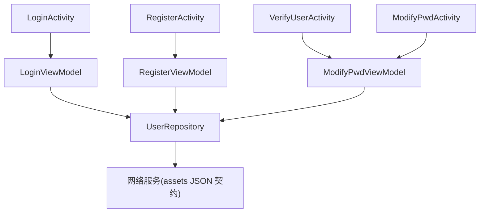
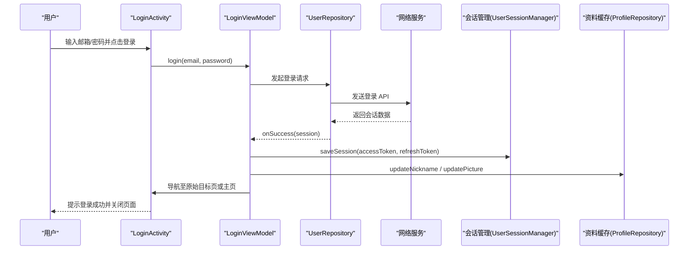
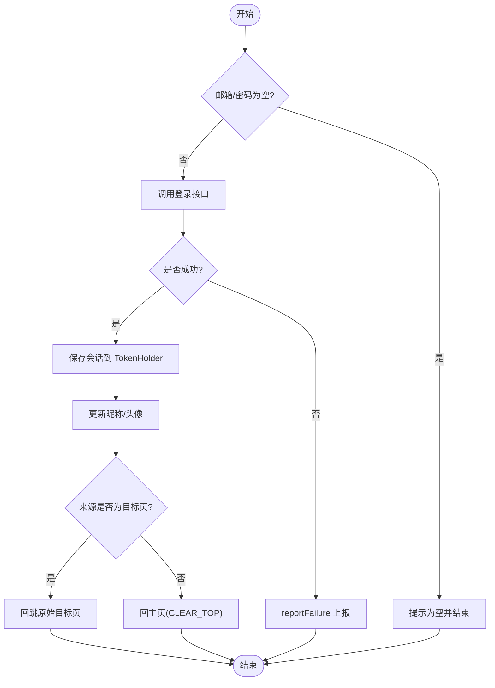
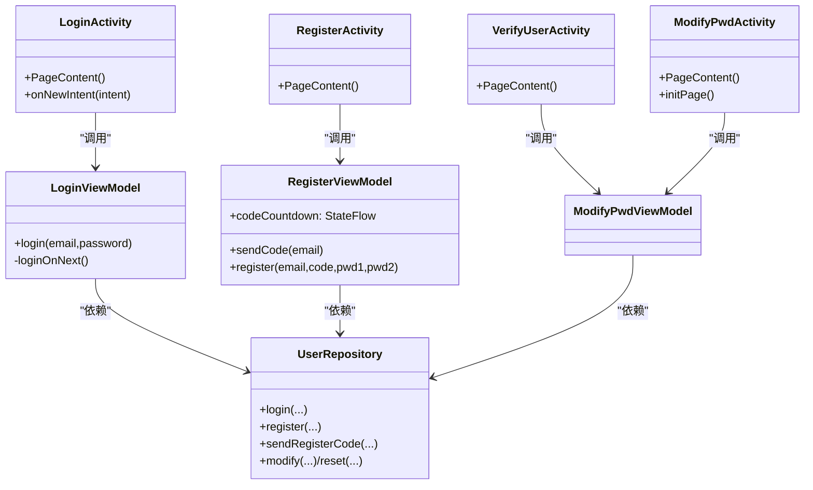
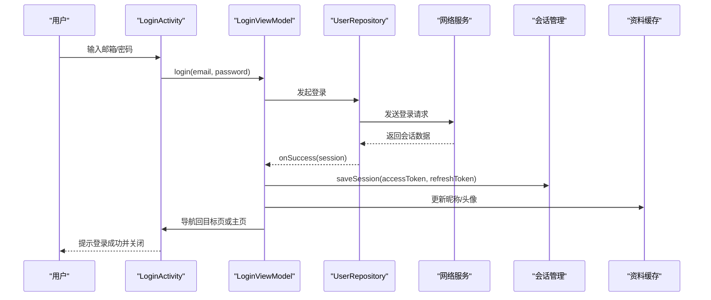
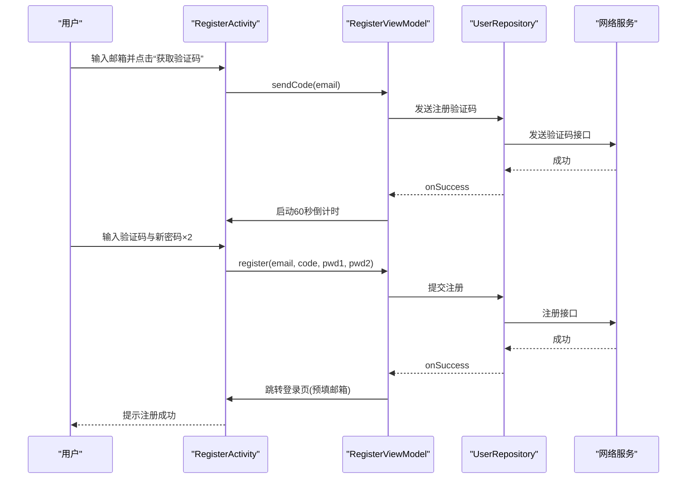
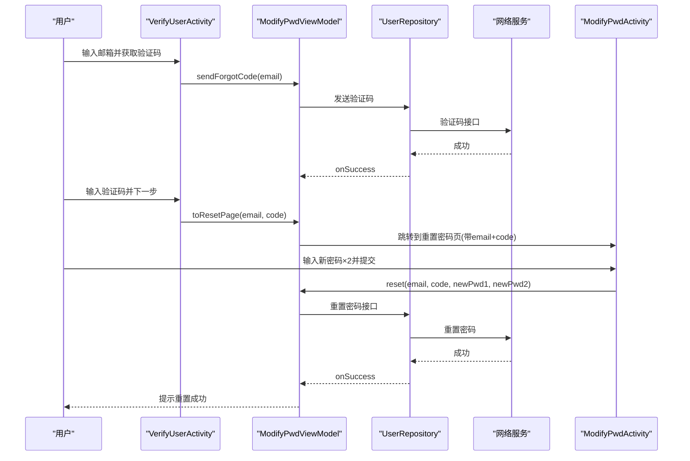

# 登录认证模块 (module_login)

<cite>
**本文引用的文件**
- [LoginActivity.kt](file://module_login/src/main/java/com/ebook/login/LoginActivity.kt)
- [LoginViewModel.kt](file://module_login/src/main/java/com/ebook/login/mvvm/viewmodel/LoginViewModel.kt)
- [RegisterActivity.kt](file://module_login/src/main/java/com/ebook/login/RegisterActivity.kt)
- [RegisterViewModel.kt](file://module_login/src/main/java/com/ebook/login/mvvm/viewmodel/RegisterViewModel.kt)
- [VerifyUserActivity.kt](file://module_login/src/main/java/com/ebook/login/VerifyUserActivity.kt)
- [ModifyPwdActivity.kt](file://module_login/src/main/java/com/ebook/login/ModifyPwdActivity.kt)
- [UserRepository.kt](file://module_login/src/main/java/com/ebook/login/repository/UserRepository.kt)
- [user_send_code.json](file://lib_ebook_api/src/main/assets/lib_ebook_api/src/main/assets/user_send_code.json)
- [user_register.json](file://lib_ebook_api/src/main/assets/lib_ebook_api/src/main/assets/user_register.json)
- [user_modify_pwd.json](file://lib_ebook_api/src/main/assets/lib_ebook_api/src/main/assets/user_modify_pwd.json)
- [user_reset_password.json](file://lib_ebook_api/src/main/assets/lib_ebook_api/src/main/assets/user_reset_password.json)
- [login-modernization-spec.md](file://docs/docs/login-modernization-spec.md)
</cite>

## 目录
1. [简介](#简介)
2. [项目结构](#项目结构)
3. [核心组件](#核心组件)
4. [架构总览](#架构总览)
5. [详细组件分析](#详细组件分析)
6. [依赖关系分析](#依赖关系分析)
7. [性能与可用性](#性能与可用性)
8. [故障排查指南](#故障排查指南)
9. [结论](#结论)
10. [附录：关键流程与时序图](#附录关键流程与时序图)

## 简介
本模块为应用的“登录认证域”，提供邮箱验证码注册、邮箱+密码登录、忘记密码重置以及已登录状态下的修改密码能力。遵循以下设计要点：
- 邮箱为登录主标识（用户名仅展示用、可重复）。
- 客户端只做非空/长度等基础校验，业务正确性交由服务端处理。
- 登录成功后建立会话并刷新本地资料缓存；失败时统一上报错误，由上层做恢复。
- 注册过程不发 token，注册完成后跳转登录页预填邮箱，由用户主动登录。
- 忘记密码流程分两步：先邮箱验证码验证身份，再进入重置密码页完成新密码设置。

## 项目结构
module_login 采用 MVVM + Compose 的组织方式：
- 页面层：LoginActivity、RegisterActivity、VerifyUserActivity、ModifyPwdActivity
- 视图模型层：LoginViewModel、RegisterViewModel、ModifyPwdViewModel
- 数据访问层：UserRepository（封装登录、注册、发码、改密等接口）
- 资源与路由：通过 TheRouter 暴露路径，使用 Material3 构建表单 UI

图表来源
- [LoginActivity.kt:49-193](file://module_login/src/main/java/com/ebook/login/LoginActivity.kt#L49-L193)
- [LoginViewModel.kt:29-107](file://module_login/src/main/java/com/ebook/login/mvvm/viewmodel/LoginViewModel.kt#L29-L107)
- [RegisterActivity.kt:52-71](file://module_login/src/main/java/com/ebook/login/RegisterActivity.kt#L52-L71)
- [RegisterViewModel.kt:30-139](file://module_login/src/main/java/com/ebook/login/mvvm/viewmodel/RegisterViewModel.kt#L30-L139)
- [VerifyUserActivity.kt:47-66](file://module_login/src/main/java/com/ebook/login/VerifyUserActivity.kt#L47-L66)
- [ModifyPwdActivity.kt:48-96](file://module_login/src/main/java/com/ebook/login/ModifyPwdActivity.kt#L48-L96)
- [UserRepository.kt](file://module_login/src/main/java/com/ebook/login/repository/UserRepository.kt)

章节来源
- [LoginActivity.kt:49-193](file://module_login/src/main/java/com/ebook/login/LoginActivity.kt#L49-L193)
- [LoginViewModel.kt:29-107](file://module_login/src/main/java/com/ebook/login/mvvm/viewmodel/LoginViewModel.kt#L29-L107)
- [RegisterActivity.kt:52-71](file://module_login/src/main/java/com/ebook/login/RegisterActivity.kt#L52-L71)
- [RegisterViewModel.kt:30-139](file://module_login/src/main/java/com/ebook/login/mvvm/viewmodel/RegisterViewModel.kt#L30-L139)
- [VerifyUserActivity.kt:47-66](file://module_login/src/main/java/com/ebook/login/VerifyUserActivity.kt#L47-L66)
- [ModifyPwdActivity.kt:48-96](file://module_login/src/main/java/com/ebook/login/ModifyPwdActivity.kt#L48-L96)

## 核心组件
- LoginActivity：标准 M3 登录表单（邮箱+密码），支持单例复用与参数预填，点击登录调用 LoginViewModel.login。
- LoginViewModel：登录流程编排，包含防重提交、加载态、成功保存会话并导航回原目标或主页。
- RegisterActivity/RegisterViewModel：三步注册（邮箱→验证码→密码），含 60 秒发码倒计时，注册成功跳转登录页预填邮箱。
- VerifyUserActivity：忘记密码第一步，邮箱验证码验证身份，通过后进入 ModifyPwdActivity。
- ModifyPwdActivity：双模式改密/重置（已登录改密需旧密码；忘记密码重置仅需新密码）。
- UserRepository：对外的认证数据访问抽象（登录、注册、发码、改密/重置）。

章节来源
- [LoginActivity.kt:49-193](file://module_login/src/main/java/com/ebook/login/LoginActivity.kt#L49-L193)
- [LoginViewModel.kt:29-107](file://module_login/src/main/java/com/ebook/login/mvvm/viewmodel/LoginViewModel.kt#L29-L107)
- [RegisterActivity.kt:52-71](file://module_login/src/main/java/com/ebook/login/RegisterActivity.kt#L52-L71)
- [RegisterViewModel.kt:30-139](file://module_login/src/main/java/com/ebook/login/mvvm/viewmodel/RegisterViewModel.kt#L30-L139)
- [VerifyUserActivity.kt:47-66](file://module_login/src/main/java/com/ebook/login/VerifyUserActivity.kt#L47-L66)
- [ModifyPwdActivity.kt:48-96](file://module_login/src/main/java/com/ebook/login/ModifyPwdActivity.kt#L48-L96)
- [UserRepository.kt](file://module_login/src/main/java/com/ebook/login/repository/UserRepository.kt)

## 架构总览
认证域以 ViewModel 为中心协调 UI 与 Repository，通过 TheRouter 进行跨模块导航，并通过 UserSessionManager/ProfileRepository 更新会话与资料。网络层在 lib_ebook_api 中以 assets 资产定义接口契约（用于测试与 Mock）。

图表来源
- [LoginActivity.kt:68-173](file://module_login/src/main/java/com/ebook/login/LoginActivity.kt#L68-L173)
- [LoginViewModel.kt:45-106](file://module_login/src/main/java/com/ebook/login/mvvm/viewmodel/LoginViewModel.kt#L45-L106)
- [UserRepository.kt](file://module_login/src/main/java/com/ebook/login/repository/UserRepository.kt)

章节来源
- [LoginActivity.kt:68-173](file://module_login/src/main/java/com/ebook/login/LoginActivity.kt#L68-L173)
- [LoginViewModel.kt:45-106](file://module_login/src/main/java/com/ebook/login/mvvm/viewmodel/LoginViewModel.kt#L45-L106)

## 详细组件分析

### LoginActivity：登录入口与表单交互
- 职责边界：仅负责渲染表单、收集输入、触发登录命令；不做业务校验（格式交给服务端）。
- 行为要点：
  - 禁用 Toolbar，内容延伸至状态栏并手动避让。
  - singleTask 模式下通过 onNewIntent 预填邮箱，避免 LaunchedEffect 不重跑导致的状态丢失。
  - 登录按钮调用 LoginViewModel.login，并在失败时由 ViewModel 统一处理。

章节来源
- [LoginActivity.kt:49-193](file://module_login/src/main/java/com/ebook/login/LoginActivity.kt#L49-L193)

### LoginViewModel：认证状态与会话管理
- 登录流程：
  - 防重提交：isLoggingIn 防止并发点击。
  - 基础校验：邮箱/密码非空。
  - 调用 UserRepository.login 发起认证。
  - 成功：保存会话（TokenHolder 同步）、更新昵称头像、根据路由来源决定回跳目标页或主页。
  - 失败：统一 reportFailure 上报。
- 导航策略：
  - 被拦截回跳：恢复到被拦截的原始页面。
  - 主动跳登录：CLEAR_TOP 回到主页，清理中间链路页面。

图表来源
- [LoginViewModel.kt:45-106](file://module_login/src/main/java/com/ebook/login/mvvm/viewmodel/LoginViewModel.kt#L45-L106)

章节来源
- [LoginViewModel.kt:29-107](file://module_login/src/main/java/com/ebook/login/mvvm/viewmodel/LoginViewModel.kt#L29-L107)

### RegisterActivity/RegisterViewModel：注册与验证码倒计时
- 注册流程：
  - 发送验证码：校验邮箱非空，成功后启动 60 秒倒计时（与服务端频控对齐）。
  - 提交注册：校验邮箱、6 位验证码、两次密码一致且非空，成功后跳转登录页并预填邮箱。
- 用户体验：
  - 倒计时期间禁用“获取验证码”按钮，避免频繁触发。
  - 横竖屏切换不丢进度（倒计时驻留 ViewModel）。

章节来源
- [RegisterActivity.kt:52-71](file://module_login/src/main/java/com/ebook/login/RegisterActivity.kt#L52-L71)
- [RegisterViewModel.kt:30-139](file://module_login/src/main/java/com/ebook/login/mvvm/viewmodel/RegisterViewModel.kt#L30-L139)

### VerifyUserActivity：忘记密码第一步（邮箱验证码）
- 功能：输入邮箱并获取验证码，验证身份后进入 ModifyPwdActivity 的重置模式。
- 与 ModifyPwdActivity 的路由分工明确：VerifyUserActivity 持有 MODIFY_PATH，ModifyPwdActivity 持有 MODIFY_PWD_PATH。

章节来源
- [VerifyUserActivity.kt:47-66](file://module_login/src/main/java/com/ebook/login/VerifyUserActivity.kt#L47-L66)

### ModifyPwdActivity：改密与重置双模式
- 双模式：
  - 已登录改密：需要旧密码+新密码×2，走“修改密码”端点。
  - 忘记密码重置：来自 VerifyUserActivity 携带 email+code，仅新密码×2，走“重置密码”端点。
- 标题动态调整：RESET 模式覆盖 Toolbar 标题为“重置密码”。

章节来源
- [ModifyPwdActivity.kt:48-96](file://module_login/src/main/java/com/ebook/login/ModifyPwdActivity.kt#L48-L96)

### UserRepository：认证数据访问抽象
- 对外方法包括登录、注册、发送验证码、修改/重置密码等。具体实现位于该文件，供各 ViewModel 调用。

章节来源
- [UserRepository.kt](file://module_login/src/main/java/com/ebook/login/repository/UserRepository.kt)

## 依赖关系分析
- UI 层（Activity）仅持有 ViewModel 引用，职责单一。
- ViewModel 依赖 UserRepository 与通用组件（UserSessionManager、ProfileRepository、TheRouter）。
- 网络契约通过 lib_ebook_api 的 assets 文件表达（用于测试/Mock），实际调用由 Repository 内部装配。

图表来源
- [LoginActivity.kt:49-193](file://module_login/src/main/java/com/ebook/login/LoginActivity.kt#L49-L193)
- [LoginViewModel.kt:29-107](file://module_login/src/main/java/com/ebook/login/mvvm/viewmodel/LoginViewModel.kt#L29-L107)
- [RegisterActivity.kt:52-71](file://module_login/src/main/java/com/ebook/login/RegisterActivity.kt#L52-L71)
- [RegisterViewModel.kt:30-139](file://module_login/src/main/java/com/ebook/login/mvvm/viewmodel/RegisterViewModel.kt#L30-L139)
- [VerifyUserActivity.kt:47-66](file://module_login/src/main/java/com/ebook/login/VerifyUserActivity.kt#L47-L66)
- [ModifyPwdActivity.kt:48-96](file://module_login/src/main/java/com/ebook/login/ModifyPwdActivity.kt#L48-L96)
- [UserRepository.kt](file://module_login/src/main/java/com/ebook/login/repository/UserRepository.kt)

章节来源
- [LoginActivity.kt:49-193](file://module_login/src/main/java/com/ebook/login/LoginActivity.kt#L49-L193)
- [LoginViewModel.kt:29-107](file://module_login/src/main/java/com/ebook/login/mvvm/viewmodel/LoginViewModel.kt#L29-L107)
- [RegisterActivity.kt:52-71](file://module_login/src/main/java/com/ebook/login/RegisterActivity.kt#L52-L71)
- [RegisterViewModel.kt:30-139](file://module_login/src/main/java/com/ebook/login/mvvm/viewmodel/RegisterViewModel.kt#L30-L139)
- [VerifyUserActivity.kt:47-66](file://module_login/src/main/java/com/ebook/login/VerifyUserActivity.kt#L47-L66)
- [ModifyPwdActivity.kt:48-96](file://module_login/src/main/java/com/ebook/login/ModifyPwdActivity.kt#L48-L96)
- [UserRepository.kt](file://module_login/src/main/java/com/ebook/login/repository/UserRepository.kt)

## 性能与可用性
- 防重提交：LoginViewModel 的 isLoggingIn 防止重复触发登录请求。
- 加载态：所有异步操作前后切换 Overlay.Loading/None，避免 UI 无反馈。
- 倒计时：RegisterViewModel 将倒计时置于 ViewModel，横竖屏不丢进度，提升体验。
- 导航优化：登录成功后依据来源决定是否回跳原始目标页或清栈回主页，减少多余页面滞留。

[本节为通用指导，无需代码引用]

## 故障排查指南
- 登录失败：
  - 检查邮箱/密码是否为空（客户端前置校验）。
  - 查看 reportFailure 上报日志，定位服务端业务码。
  - 确认会话过期由网络层统一处理（静默刷新失败则全局处置）。
- 注册失败：
  - 验证码位数必须为 6 位，两次密码需一致。
  - 发送验证码后 60 秒内不可重复发送，注意按钮禁用状态。
- 忘记密码失败：
  - 邮箱验证码由服务端校验，若失败请重新获取验证码。
  - 重置模式下只需新密码×2，确保输入完整。
- 导航异常：
  - 若登录后未回到预期页面，检查来源路径是否正确注入 bundle。
  - 独立模式下路由缺失会静默丢弃，需在调试宿主占位对应路由。

章节来源
- [LoginViewModel.kt:45-106](file://module_login/src/main/java/com/ebook/login/mvvm/viewmodel/LoginViewModel.kt#L45-L106)
- [RegisterViewModel.kt:53-131](file://module_login/src/main/java/com/ebook/login/mvvm/viewmodel/RegisterViewModel.kt#L53-L131)
- [VerifyUserActivity.kt:52-65](file://module_login/src/main/java/com/ebook/login/VerifyUserActivity.kt#L52-L65)
- [ModifyPwdActivity.kt:63-78](file://module_login/src/main/java/com/ebook/login/ModifyPwdActivity.kt#L63-L78)

## 结论
module_login 以清晰的 MVVM 分层与 Compose UI 实现了完整的认证闭环：登录、注册、忘记密码与改密。通过统一的错误上报与会话管理机制，保证用户体验的一致性与安全性。后续可扩展第三方登录、多因素认证等能力，同时保持现有边界与约定不变。

[本节为总结，无需代码引用]

## 附录：关键流程与时序图

### 登录流程时序

图表来源
- [LoginActivity.kt:68-173](file://module_login/src/main/java/com/ebook/login/LoginActivity.kt#L68-L173)
- [LoginViewModel.kt:45-106](file://module_login/src/main/java/com/ebook/login/mvvm/viewmodel/LoginViewModel.kt#L45-L106)
- [UserRepository.kt](file://module_login/src/main/java/com/ebook/login/repository/UserRepository.kt)

### 注册流程时序

图表来源
- [RegisterActivity.kt:58-70](file://module_login/src/main/java/com/ebook/login/RegisterActivity.kt#L58-L70)
- [RegisterViewModel.kt:53-131](file://module_login/src/main/java/com/ebook/login/mvvm/viewmodel/RegisterViewModel.kt#L53-L131)
- [UserRepository.kt](file://module_login/src/main/java/com/ebook/login/repository/UserRepository.kt)

### 忘记密码流程时序

图表来源
- [VerifyUserActivity.kt:52-65](file://module_login/src/main/java/com/ebook/login/VerifyUserActivity.kt#L52-L65)
- [ModifyPwdActivity.kt:63-78](file://module_login/src/main/java/com/ebook/login/ModifyPwdActivity.kt#L63-L78)
- [UserRepository.kt](file://module_login/src/main/java/com/ebook/login/repository/UserRepository.kt)

### 安全考虑
- 敏感信息：密码仅在内存中短暂存在，不落盘；token 管理由 UserSessionManager/TokenHolder 负责。
- 网络安全：网络请求由 lib_ebook_api 统一管理，拦截器负责附加 token 与编码处理。
- 会话安全：access token 只驻内存；冷启动为空，首个请求经 A0230 静默刷新补全；过期由网络层统一处理。
- 表单安全：客户端仅做基础校验，业务校验在服务端完成，避免前端绕过风险。

[本节为通用指导，无需代码引用]