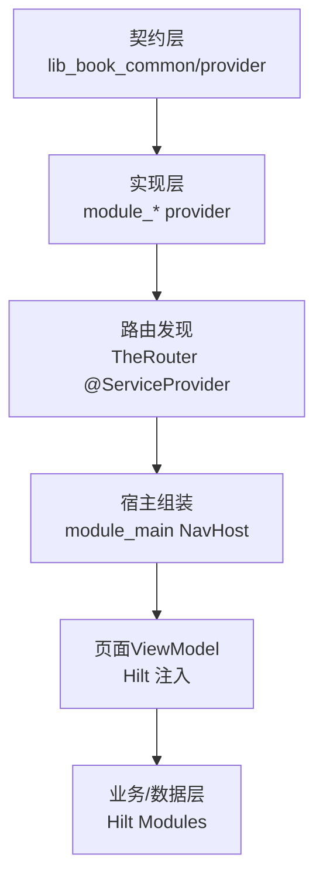
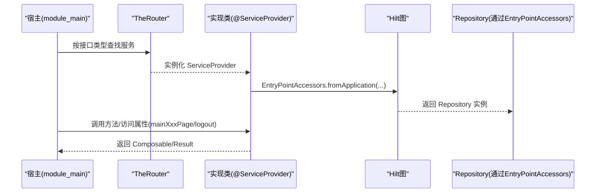
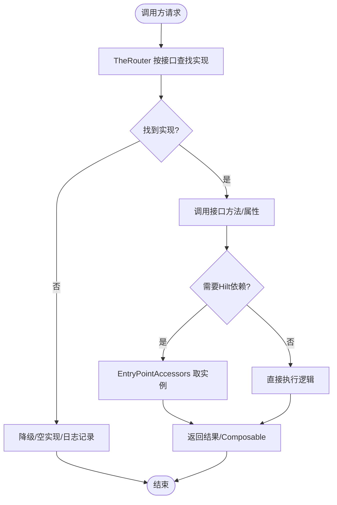
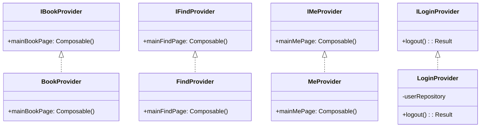

# Provider 接口模式

<cite>
**本文引用的文件**
- [ILoginProvider.kt](file://lib_book_common/src/main/java/com/ebook/common/provider/ILoginProvider.kt)
- [IBookProvider.kt](file://lib_book_common/src/main/java/com/ebook/common/provider/IBookProvider.kt)
- [IFindProvider.kt](file://lib_book_common/src/main/java/com/ebook/common/provider/IFindProvider.kt)
- [IMeProvider.kt](file://lib_book_common/src/main/java/com/ebook/common/provider/IMeProvider.kt)
- [LoginProvider.kt](file://module_login/src/main/java/com/ebook/login/provider/LoginProvider.kt)
- [BookProvider.kt](file://module_book/src/main/java/com/ebook/book/provider/BookProvider.kt)
- [FindProvider.kt](file://module_find/src/main/java/com/ebook/find/provider/FindProvider.kt)
- [MeProvider.kt](file://module_me/src/main/java/com/ebook/me/provider/MeProvider.kt)
- [MyApplication.kt](file://module_app/src/main/java/com/ebook/MyApplication.kt)
- [BookApplication.kt](file://lib_book_common/src/main/java/com/ebook/common/BookApplication.kt)
- [AGENTS.md](file://AGENTS.md)
</cite>

## 目录
1. [简介](#简介)
2. [项目结构](#项目结构)
3. [核心组件](#核心组件)
4. [架构总览](#架构总览)
5. [详细组件分析](#详细组件分析)
6. [依赖关系分析](#依赖关系分析)
7. [性能与并发考量](#性能与并发考量)
8. [故障排查指南](#故障排查指南)
9. [结论](#结论)
10. [附录：扩展开发指南](#附录：扩展开发指南)

## 简介
本文件系统性梳理本项目中的 Provider 接口模式，聚焦于“语义化接口设计、命名规范、跨模块调用、注册与发现机制（TheRouter SPI + Hilt）、错误处理与异步约定”，并给出扩展新接口的完整实践指南。该模式以 lib_book_common 暴露最小稳定契约，各功能模块提供实现并通过 TheRouter 在服务端注册；业务侧通过接口解耦调用，结合 Hilt 完成具体服务注入与生命周期管理。

## 项目结构
- 契约层：lib_book_common 定义跨模块可见的 Provider 接口（如 IBookProvider、IFindProvider、IMeProvider、ILoginProvider），仅暴露稳定的能力边界。
- 实现层：各功能模块（module_book、module_find、module_me、module_login）提供具体实现类（BookProvider、FindProvider、MeProvider、LoginProvider），并通过 TheRouter 的 @ServiceProvider 注解进行服务注册。
- 宿主层：module_app 作为应用入口，使用 TheRouter 动态发现并组合页面级 Provider 返回的 Composable；同时使用 Hilt 管理业务服务与数据层对象的生命周期与装配。
- 工具与基座：lib_book_common 提供基础 Application、Hilt 模块与通用约定；AGENTS.md 沉淀了构建、测试、依赖与运行时约束。

图示来源
- [MyApplication.kt:1-200](file://module_app/src/main/java/com/ebook/MyApplication.kt#L1-L200)
- [BookApplication.kt:1-200](file://lib_book_common/src/main/java/com/ebook/common/BookApplication.kt#L1-L200)
- [AGENTS.md:1-300](file://AGENTS.md#L1-L300)

章节来源
- [AGENTS.md:1-300](file://AGENTS.md#L1-L300)

## 核心组件
- 契约接口（位于 lib_book_common/provider）
  - IBookProvider：暴露书架主页面（Compose）。
  - IFindProvider：暴露书城主页面（Compose）。
  - IMeProvider：暴露个人中心主页面（Compose）。
  - ILoginProvider：暴露登录域服务端能力（如登出），由调用方负责本地会话清理。
- 实现类（位于各 module 的 provider 包）
  - BookProvider / FindProvider / MeProvider：返回 Composable 页面，交由宿主 NavHost 组合。
  - LoginProvider：桥接 Hilt 获取 UserRepository，暴露服务端登出能力。
- 发现与注入
  - TheRouter：@ServiceProvider 将实现类注册为可发现的服务。
  - Hilt：业务服务与数据层通过 @Module/@Provides 或构造注入；Provider 本身由 TheRouter 创建，内部再经 EntryPointAccessors 从 Hilt 图取实例。

章节来源
- [IBookProvider.kt:1-14](file://lib_book_common/src/main/java/com/ebook/common/provider/IBookProvider.kt#L1-L14)
- [IFindProvider.kt:1-14](file://lib_book_common/src/main/java/com/ebook/common/provider/IFindProvider.kt#L1-L14)
- [IMeProvider.kt:1-14](file://lib_book_common/src/main/java/com/ebook/common/provider/IMeProvider.kt#L1-L14)
- [ILoginProvider.kt:1-20](file://lib_book_common/src/main/java/com/ebook/common/provider/ILoginProvider.kt#L1-L20)
- [BookProvider.kt:1-16](file://module_book/src/main/java/com/ebook/book/provider/BookProvider.kt#L1-L16)
- [FindProvider.kt:1-20](file://module_find/src/main/java/com/ebook/find/provider/FindProvider.kt#L1-L20)
- [MeProvider.kt:1-21](file://module_me/src/main/java/com/ebook/me/provider/MeProvider.kt#L1-L21)
- [LoginProvider.kt:1-36](file://module_login/src/main/java/com/ebook/login/provider/LoginProvider.kt#L1-L36)

## 架构总览
Provider 模式在本项目承担两大职责：
- 页面级导航：以 Composable 为单位暴露模块主页，宿主统一组合，避免模块间直接耦合。
- 能力级服务：以函数式 API 暴露领域能力（如登出），跨模块调用时不感知具体实现位置。

图示来源
- [LoginProvider.kt:21-35](file://module_login/src/main/java/com/ebook/login/provider/LoginProvider.kt#L21-L35)
- [BookProvider.kt:8-15](file://module_book/src/main/java/com/ebook/book/provider/BookProvider.kt#L8-L15)
- [FindProvider.kt:14-19](file://module_find/src/main/java/com/ebook/find/provider/FindProvider.kt#L14-L19)
- [MeProvider.kt:15-20](file://module_me/src/main/java/com/ebook/me/provider/MeProvider.kt#L15-L20)

## 详细组件分析

### 契约接口设计与命名规范
- 命名约定
  - 接口前缀 I 表示能力契约（IBookProvider、IFindProvider、IMeProvider、ILoginProvider）。
  - 属性/方法语义清晰：页面级使用 mainXxxPage，能力级使用动词短语（如 logout）。
- 参数与返回值约定
  - 页面级：返回 @Composable () -> Unit，无参、无副作用，由宿主控制组合时机。
  - 能力级：使用 suspend 函数 + Result<T> 明确异步与错误边界；失败由调用方决定提示策略。
- 职责边界
  - 契约层不持有状态，不感知实现细节；仅描述“能做什么”。

章节来源
- [IBookProvider.kt:5-13](file://lib_book_common/src/main/java/com/ebook/common/provider/IBookProvider.kt#L5-L13)
- [IFindProvider.kt:5-13](file://lib_book_common/src/main/java/com/ebook/common/provider/IFindProvider.kt#L5-L13)
- [IMeProvider.kt:5-13](file://lib_book_common/src/main/java/com/ebook/common/provider/IMeProvider.kt#L5-L13)
- [ILoginProvider.kt:3-19](file://lib_book_common/src/main/java/com/ebook/common/provider/ILoginProvider.kt#L3-L19)

### 实现类与注册机制
- 页面级 Provider
  - BookProvider、FindProvider、MeProvider 均标注 @ServiceProvider，暴露 Composable 页面。
  - 每次组合会创建新的页面实例，ViewModel 作用域由 hiltViewModel 绑定到调用处的 NavBackStackEntry。
- 能力级 Provider
  - LoginProvider 通过 TheRouter 创建，内部用 EntryPointAccessors 从 Hilt 图中取 UserRepository，实现与服务端交互。
- 独立运行兼容
  - 当模块独立运行时（isModule=true），若目标模块未参与构建，其 Provider 不可用；调用方需容忍空实现或降级行为（例如登录态调试无需作废服务端会话）。

章节来源
- [BookProvider.kt:8-15](file://module_book/src/main/java/com/ebook/book/provider/BookProvider.kt#L8-L15)
- [FindProvider.kt:14-19](file://module_find/src/main/java/com/ebook/find/provider/FindProvider.kt#L14-L19)
- [MeProvider.kt:15-20](file://module_me/src/main/java/com/ebook/me/provider/MeProvider.kt#L15-L20)
- [LoginProvider.kt:11-35](file://module_login/src/main/java/com/ebook/login/provider/LoginProvider.kt#L11-L35)
- [ILoginProvider.kt:9-19](file://lib_book_common/src/main/java/com/ebook/common/provider/ILoginProvider.kt#L9-L19)

### 跨模块调用流程
- 页面组合：宿主通过 TheRouter 按接口类型查找对应实现，拿到 Composable 后交给 NavHost 组合。
- 能力调用：调用方通过接口方法发起请求，内部可能经由 Hilt 获取 Repository 等依赖；异常以 Result 返回，由调用方统一处理。
- 代理生成：TheRouter 在编译/运行时扫描 @ServiceProvider 并建立映射；调用方无需硬编码类名。

图示来源
- [LoginProvider.kt:21-35](file://module_login/src/main/java/com/ebook/login/provider/LoginProvider.kt#L21-L35)
- [BookProvider.kt:8-15](file://module_book/src/main/java/com/ebook/book/provider/BookProvider.kt#L8-L15)

### 错误处理与兼容性
- 异步与错误
  - 能力型接口统一返回 Result<T>，区分成功与失败；调用方可据此决定是否提示用户。
  - 网络/业务异常由 Repository 抛出类型化异常，上层不做过度包装，便于定位根因。
- 独立运行兼容
  - 当 isModule=true 且目标模块未包含时，Provider 不可用；调用方应允许空实现或跳过服务端失效步骤（如登出），因为调试宿主通常不连后端。
- 会话清理边界
  - 服务端会话失效由 ILoginProvider.logout 负责；本地清理由 UserSessionManager.clearSession 单点处理，避免重复清理导致状态不一致。

章节来源
- [ILoginProvider.kt:12-19](file://lib_book_common/src/main/java/com/ebook/common/provider/ILoginProvider.kt#L12-L19)
- [LoginProvider.kt:21-35](file://module_login/src/main/java/com/ebook/login/provider/LoginProvider.kt#L21-L35)

### 版本与兼容性处理
- 契约稳定性：接口变更需谨慎，优先新增而非修改已有成员；旧实现保持向后兼容。
- 运行时发现：TheRouter 基于注解扫描，新增实现需保证注解正确、包路径可被扫描。
- 多形态构建：isModule 切换影响可用 Provider 集合；发布态默认 false，独立调试时可临时改为 true，但提交态必须为 false。

章节来源
- [AGENTS.md:1-300](file://AGENTS.md#L1-L300)

## 依赖关系分析
- 模块依赖方向：业务模块 → lib_book_common（契约与共享件）→ 其他库（API/DB）。
- Provider 关系：
  - 契约在 lib_book_common，实现在各 module；调用方只依赖契约。
  - 能力型 Provider（如 LoginProvider）通过 EntryPointAccessors 间接依赖 Hilt 提供的 Repository。
- 宿主装配：
  - MyApplication 作为应用入口，启动 Hilt 图；TheRouter 负责服务发现与页面组合。

图示来源
- [IBookProvider.kt:5-13](file://lib_book_common/src/main/java/com/ebook/common/provider/IBookProvider.kt#L5-L13)
- [IFindProvider.kt:5-13](file://lib_book_common/src/main/java/com/ebook/common/provider/IFindProvider.kt#L5-L13)
- [IMeProvider.kt:5-13](file://lib_book_common/src/main/java/com/ebook/common/provider/IMeProvider.kt#L5-L13)
- [ILoginProvider.kt:12-19](file://lib_book_common/src/main/java/com/ebook/common/provider/ILoginProvider.kt#L12-L19)
- [BookProvider.kt:8-15](file://module_book/src/main/java/com/ebook/book/provider/BookProvider.kt#L8-L15)
- [FindProvider.kt:14-19](file://module_find/src/main/java/com/ebook/find/provider/FindProvider.kt#L14-L19)
- [MeProvider.kt:15-20](file://module_me/src/main/java/com/ebook/me/provider/MeProvider.kt#L15-L20)
- [LoginProvider.kt:21-35](file://module_login/src/main/java/com/ebook/login/provider/LoginProvider.kt#L21-L35)

章节来源
- [AGENTS.md:1-300](file://AGENTS.md#L1-L300)

## 性能与并发考量
- 页面组合开销：每个 Provider 返回的 Composable 按需组合，避免不必要的重建；ViewModel 作用域绑定到页面栈项，减少状态抖动。
- 异步与线程：
  - 能力型接口使用 suspend 函数，配合协程模型，避免阻塞主线程。
  - 沙箱相关（脚本执行）严禁在主线程调用，确保回调回主进程时的线程安全（见 AGENTS.md 对沙箱执行的约束）。
- 缓存与复用：
  - 解析器与缓存策略集中在相应模块（如书库缓存），Provider 层只做调度，不引入额外内存压力。

章节来源
- [AGENTS.md:1-300](file://AGENTS.md#L1-L300)

## 故障排查指南
- 路由丢失（独立模式）：
  - 现象：跨模块路由在独立模式下静默丢失，TheRouter 找不到路由只记一行日志。
  - 解决：在 src/main/test/debug 下添加占位路由，确保独立模式可调试；重新构建一次使 routeMap 生效。
- Provider 不可用：
  - 现象：isModule=true 时某些 Provider 未参与构建，调用方无法获取实现。
  - 解决：确认目标模块已加入构建；必要时在调用方增加空实现或降级分支。
- 会话清理不一致：
  - 现象：服务端 token 已失效但“我的”页仍显示旧身份。
  - 解决：统一通过 UserSessionManager.clearSession 清理三处镜像（SP、内存、Profile），禁止调用方自行补调。
- 沙箱执行失败：
  - 现象：未装配执行器抛特定异常；执行失败抛内核原文异常。
  - 解决：区分“未装配”和“执行失败”，不要混同成“源失效”；确保仅在非主线程调用沙箱。

章节来源
- [AGENTS.md:1-300](file://AGENTS.md#L1-L300)
- [ILoginProvider.kt:9-19](file://lib_book_common/src/main/java/com/ebook/common/provider/ILoginProvider.kt#L9-L19)
- [LoginProvider.kt:21-35](file://module_login/src/main/java/com/ebook/login/provider/LoginProvider.kt#L21-L35)

## 结论
Provider 接口模式在本项目中实现了清晰的跨模块边界：契约层稳定、实现层可插拔、宿主层统一组合。通过 TheRouter 的服务发现与 Hilt 的依赖注入，既保证了模块间的松耦合，又提供了灵活的扩展点。遵循本文的设计原则与最佳实践，可在不破坏现有约定的前提下持续演进系统能力。

## 附录：扩展开发指南

### 新增页面级 Provider
- 定义接口：在 lib_book_common/provider 新增接口（如 INewProvider），暴露 mainNewPage 属性。
- 编写实现：在新模块 provider 包中实现接口，标注 @ServiceProvider，返回 Composable 页面。
- 宿主集成：确保 TheRouter 能扫描到新实现；宿主通过接口获取并组合页面。

章节来源
- [IBookProvider.kt:5-13](file://lib_book_common/src/main/java/com/ebook/common/provider/IBookProvider.kt#L5-L13)
- [BookProvider.kt:8-15](file://module_book/src/main/java/com/ebook/book/provider/BookProvider.kt#L8-L15)

### 新增能力型 Provider
- 定义接口：在 lib_book_common/provider 新增接口（如 IAuthProvider），定义 suspend 方法与 Result 返回值。
- 编写实现：在对应模块 provider 包中实现接口，必要时通过 EntryPointAccessors 从 Hilt 获取 Repository。
- 调用方接入：调用方依赖接口发起请求，统一处理 Result 的成功与失败分支。

章节来源
- [ILoginProvider.kt:12-19](file://lib_book_common/src/main/java/com/ebook/common/provider/ILoginProvider.kt#L12-L19)
- [LoginProvider.kt:21-35](file://module_login/src/main/java/com/ebook/login/provider/LoginProvider.kt#L21-L35)

### 测试用例设计
- 单元测试：针对接口契约与实现的核心逻辑编写 JUnit 测试，覆盖正常路径与异常分支。
- Mock 数据源：利用 product flavor 与 source set 切换 mock/real 数据源，确保离线开发与调试。
- 集成测试：在 module_app 的 real/mock 源集配置 NetworkModule，验证端到端流程。

章节来源
- [AGENTS.md:1-300](file://AGENTS.md#L1-L300)

### 最佳实践清单
- 接口稳定：避免破坏性变更，优先新增而非修改。
- 语义清晰：命名体现职责（mainXxxPage、logout 等）。
- 异步统一：suspend + Result，避免隐式线程切换。
- 错误收敛：网络与业务异常尽量透出类型化信息，调用方统一处理。
- 独立兼容：isModule=true 时考虑空实现与降级。
- 沙箱安全：禁止主线程调用沙箱，严格白名单与权限控制。

章节来源
- [AGENTS.md:1-300](file://AGENTS.md#L1-L300)