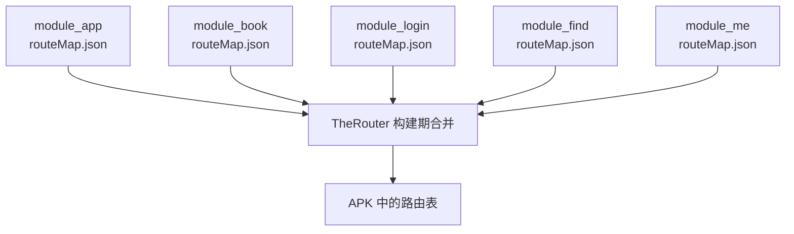
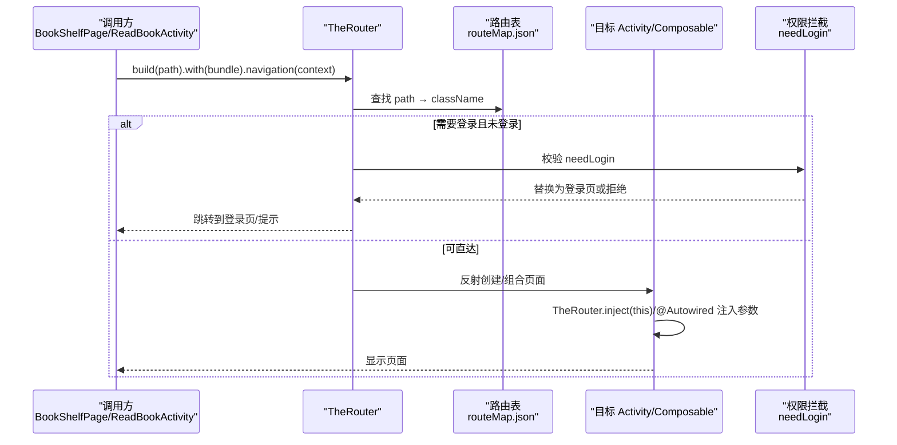
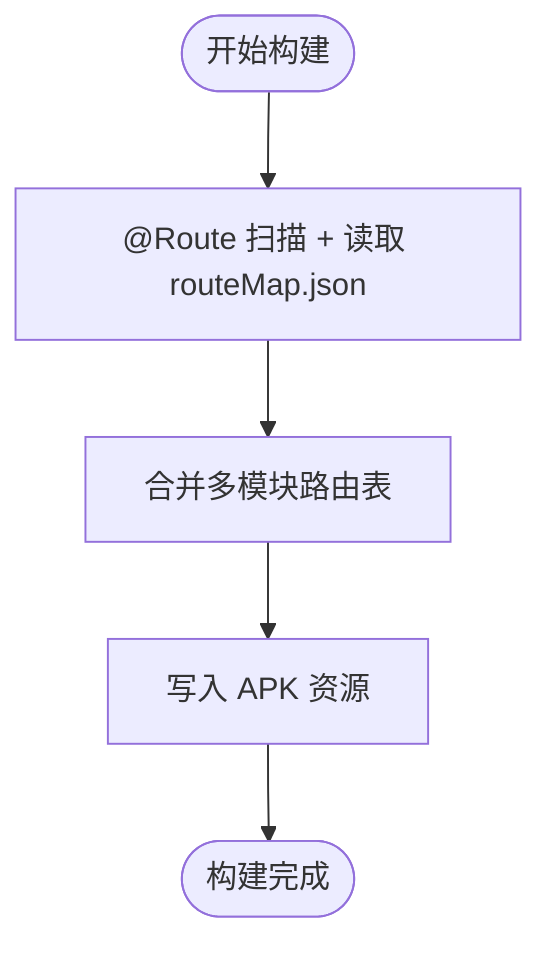
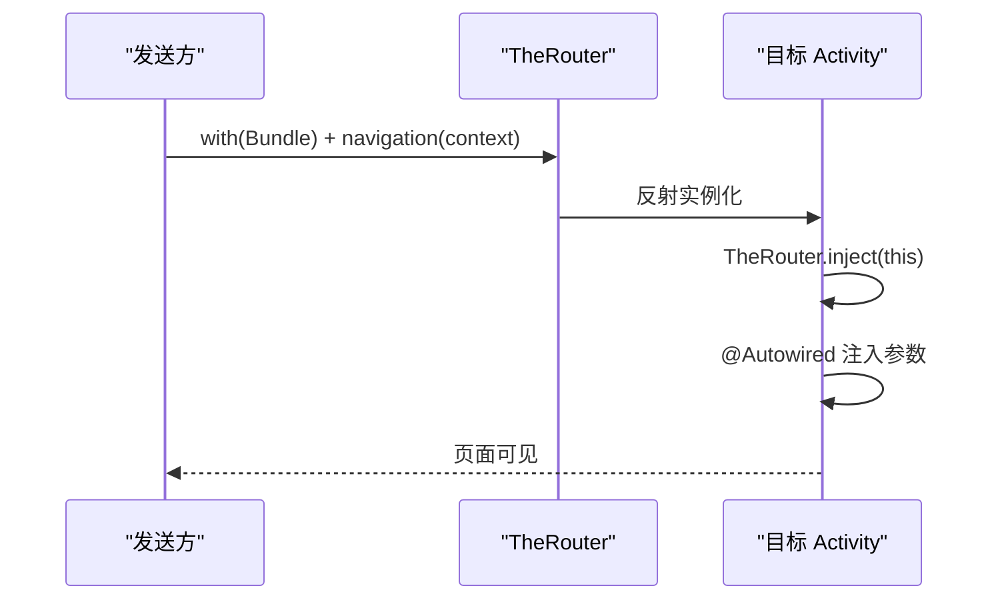
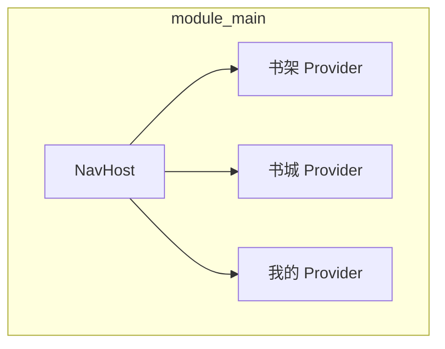
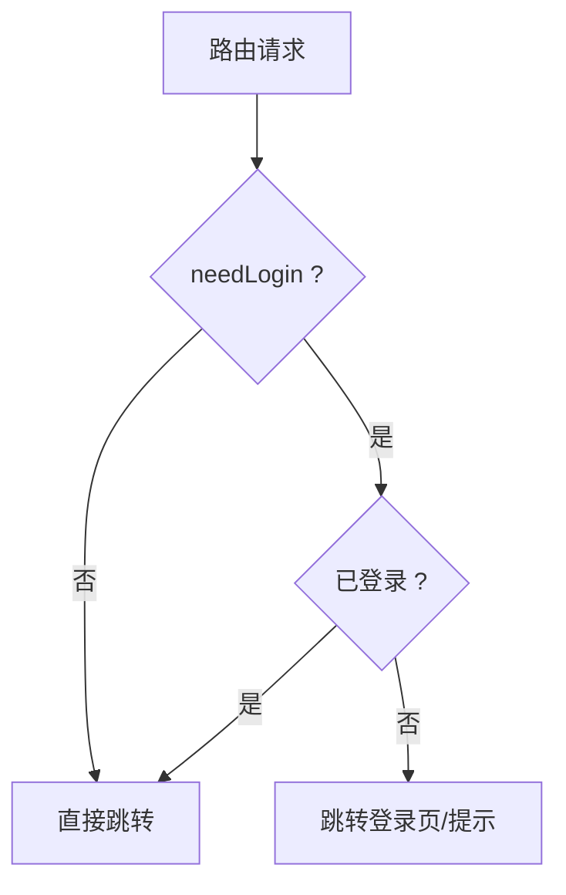
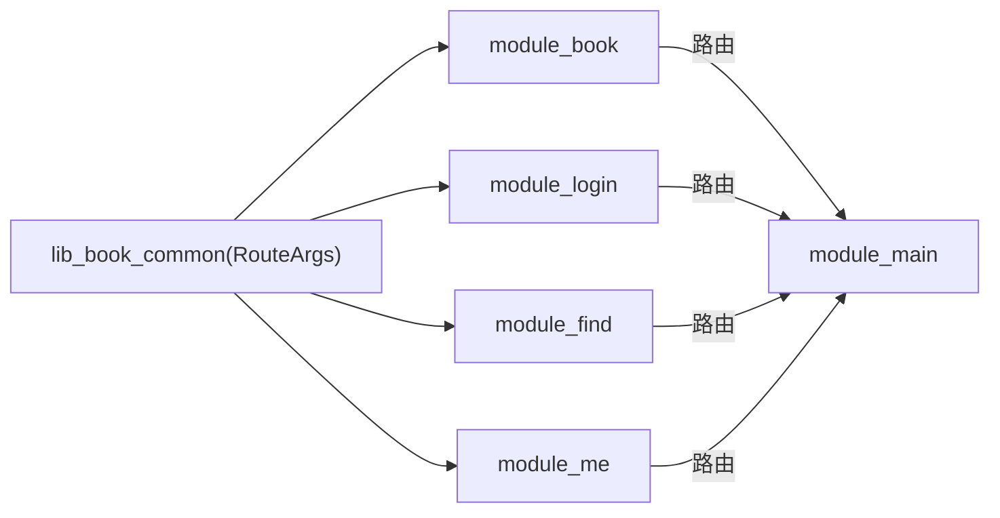

# TheRouter 路由系统

<cite>
**本文引用的文件**   
- [module_app/src/main/assets/therouter/routeMap.json](file://module_app/src/main/assets/therouter/routeMap.json)
- [module_book/src/main/assets/therouter/routeMap.json](file://module_book/src/main/assets/therouter/routeMap.json)
- [module_login/src/main/assets/therouter/routeMap.json](file://module_login/src/main/assets/therouter/routeMap.json)
- [lib_book_common/src/main/java/com/ebook/common/event/RouteArgs.kt](file://lib_book_common/src/main/java/com/ebook/common/event/RouteArgs.kt)
- [module_book/src/main/java/com/ebook/book/BookDetailActivity.kt](file://module_book/src/main/java/com/ebook/book/BookDetailActivity.kt)
- [module_book/src/main/java/com/ebook/book/page/BookShelfPage.kt](file://module_book/src/main/java/com/ebook/book/page/BookShelfPage.kt)
- [module_book/src/main/java/com/ebook/book/ReadBookActivity.kt](file://module_book/src/main/java/com/ebook/book/ReadBookActivity.kt)
- [module_main/src/main/java/com/ebook/main/MainActivity.kt](file://module_main/src/main/java/com/ebook/main/MainActivity.kt)
- [module_main/src/main/java/com/ebook/main/SplashActivity.kt](file://module_main/src/main/java/com/ebook/main/SplashActivity.kt)
- [module_me/src/main/java/com/ebook/me/view/SettingActivity.kt](file://module_me/src/main/java/com/ebook/me/view/SettingActivity.kt)
- [module_find/src/main/java/com/ebook/find/SearchActivity.kt](file://module_find/src/main/java/com/ebook/find/SearchActivity.kt)
- [module_login/src/main/java/com/ebook/login/LoginActivity.kt](file://module_login/src/main/java/com/ebook/login/LoginActivity.kt)
- [module_login/src/main/test/debug/TestInterruptActivity.kt](file://module_login/src/main/test/debug/TestInterruptActivity.kt)
</cite>

## 目录
1. [简介](#简介)
2. [项目结构与路由位置](#项目结构与路由位置)
3. [核心组件与职责](#核心组件与职责)
4. [架构总览](#架构总览)
5. [详细组件分析](#详细组件分析)
6. [依赖关系分析](#依赖关系分析)
7. [性能与可靠性考量](#性能与可靠性考量)
8. [故障排查指南](#故障排查指南)
9. [结论](#结论)
10. [附录：配置示例与最佳实践](#附录：配置示例与最佳实践)

## 简介
本文件系统化梳理本项目中基于 TheRouter 的跨模块路由体系，覆盖路由表结构定义与自动生成机制、路由注册流程、参数传递与类型安全、页面导航实现（含 Compose 组合与生命周期管理）、拦截器使用场景、调试与测试方法，以及复杂导航场景的最佳实践。文档面向不同技术背景的读者，提供由浅入深的说明与图示。

## 项目结构与路由位置
项目在多个功能模块中各自维护一份路由清单，构建期通过 TheRouter Transform 将各模块声明的 @Route 注解与 routeMap 资产合并到最终 APK。关键路径如下：
- 应用入口模块 module_app：包含集成态的全量路由清单
- 业务模块 module_book/module_login/module_find/module_me：各自声明本模块的页面路由
- 公共常量 lib_book_common：集中定义跨模块路由传参 key，避免字符串散落导致键名不一致

**图表来源**
- [module_app/src/main/assets/therouter/routeMap.json:1-150](file://module_app/src/main/assets/therouter/routeMap.json#L1-L150)
- [module_book/src/main/assets/therouter/routeMap.json:1-39](file://module_book/src/main/assets/therouter/routeMap.json#L1-L39)
- [module_login/src/main/assets/therouter/routeMap.json:1-46](file://module_login/src/main/assets/therouter/routeMap.json#L1-L46)

**章节来源**
- [module_app/src/main/assets/therouter/routeMap.json:1-150](file://module_app/src/main/assets/therouter/routeMap.json#L1-L150)
- [module_book/src/main/assets/therouter/routeMap.json:1-39](file://module_book/src/main/assets/therouter/routeMap.json#L1-L39)
- [module_login/src/main/assets/therouter/routeMap.json:1-46](file://module_login/src/main/assets/therouter/routeMap.json#L1-L46)

## 核心组件与职责
- 路由表 routeMap.json：以 JSON 数组描述“路径→目标类”映射，支持 params 字段声明权限控制等元信息（如 needLogin）
- 路由注解与注入：@Route 用于声明路由；@Autowired 用于在目标 Activity 自动注入参数；TheRouter.inject(this) 完成参数装配
- 路由调用方：通过 TheRouter.build(path).with(...).navigation(context) 发起跳转
- 路由常量与参数契约：跨模块共享的 Bundle key 统一在 RouteArgs 中声明，保证发送/接收端一致
- Compose 页面导航：主模块通过 NavHost 组合各 Provider 暴露的 Composable 页面，形成单进程内的页面树

**章节来源**
- [lib_book_common/src/main/java/com/ebook/common/event/RouteArgs.kt:1-33](file://lib_book_common/src/main/java/com/ebook/common/event/RouteArgs.kt#L1-L33)
- [module_book/src/main/java/com/ebook/book/BookDetailActivity.kt:47-68](file://module_book/src/main/java/com/ebook/book/BookDetailActivity.kt#L47-L68)
- [module_book/src/main/java/com/ebook/book/page/BookShelfPage.kt:127-170](file://module_book/src/main/java/com/ebook/book/page/BookShelfPage.kt#L127-L170)
- [module_main/src/main/java/com/ebook/main/MainActivity.kt:161-163](file://module_main/src/main/java/com/ebook/main/MainActivity.kt#L161-L163)

## 架构总览
下图展示从调用方到目标页面的完整路由链路，包括 TheRouter 解析、参数注入、权限校验与页面启动/组合过程。

**图表来源**
- [module_book/src/main/java/com/ebook/book/page/BookShelfPage.kt:141-170](file://module_book/src/main/java/com/ebook/book/page/BookShelfPage.kt#L141-L170)
- [module_book/src/main/java/com/ebook/book/ReadBookActivity.kt:232-234](file://module_book/src/main/java/com/ebook/book/ReadBookActivity.kt#L232-L234)
- [module_app/src/main/assets/therouter/routeMap.json:10-17](file://module_app/src/main/assets/therouter/routeMap.json#L10-L17)
- [module_login/src/main/test/debug/TestInterruptActivity.kt:27-32](file://module_login/src/main/test/debug/TestInterruptActivity.kt#L27-L32)

## 详细组件分析

### 路由表结构与自动生成机制
- 结构字段
  - path：路由路径，跨模块唯一
  - className：目标类全限定名
  - action：保留字段（当前为空）
  - description：描述（当前为空）
  - params：参数元数据，常见如 needLogin 表示该路由需登录
- 生成机制
  - 每个模块在 assets/therouter/routeMap.json 声明路由
  - 构建期 TheRouter Transform 扫描 @Route 注解并回写/合并 routeMap.json 到 APK
  - 独立模式（isModule=true）下，被独立编译的模块若缺少对端路由，需在 test/debug 宿主放置同名占位路由，避免运行时静默失败

**图表来源**
- [module_app/src/main/assets/therouter/routeMap.json:1-150](file://module_app/src/main/assets/therouter/routeMap.json#L1-L150)
- [module_book/src/main/assets/therouter/routeMap.json:1-39](file://module_book/src/main/assets/therouter/routeMap.json#L1-L39)
- [module_login/src/main/assets/therouter/routeMap.json:1-46](file://module_login/src/main/assets/therouter/routeMap.json#L1-L46)

**章节来源**
- [module_app/src/main/assets/therouter/routeMap.json:1-150](file://module_app/src/main/assets/therouter/routeMap.json#L1-L150)
- [module_book/src/main/assets/therouter/routeMap.json:1-39](file://module_book/src/main/assets/therouter/routeMap.json#L1-L39)
- [module_login/src/main/assets/therouter/routeMap.json:1-46](file://module_login/src/main/assets/therouter/routeMap.json#L1-L46)

### 路由注册流程与参数传递
- 注册方式
  - 通过 @Route 声明路径与参数约束（如 needLogin），配合 routeMap.json 生效
  - 在目标 Activity 中调用 TheRouter.inject(this)，并由 @Autowired 自动注入参数
- 参数传递
  - 发送端：TheRouter.build(path).with(...).navigation(context) 携带 Bundle
  - 接收端：@Autowired(name="key") 或按字段名匹配注入
  - 类型安全：跨模块共享的 key 集中在 RouteArgs 中声明，避免散落的字符串键造成运行时丢失参数

**图表来源**
- [module_book/src/main/java/com/ebook/book/BookDetailActivity.kt:67-68](file://module_book/src/main/java/com/ebook/book/BookDetailActivity.kt#L67-L68)
- [module_book/src/main/java/com/ebook/book/page/BookShelfPage.kt:168-170](file://module_book/src/main/java/com/ebook/book/page/BookShelfPage.kt#L168-L170)
- [lib_book_common/src/main/java/com/ebook/common/event/RouteArgs.kt:10-33](file://lib_book_common/src/main/java/com/ebook/common/event/RouteArgs.kt#L10-L33)
- [module_login/src/main/test/debug/TestInterruptActivity.kt:27-32](file://module_login/src/main/test/debug/TestInterruptActivity.kt#L27-L32)

**章节来源**
- [module_book/src/main/java/com/ebook/book/BookDetailActivity.kt:67-68](file://module_book/src/main/java/com/ebook/book/BookDetailActivity.kt#L67-L68)
- [module_book/src/main/java/com/ebook/book/page/BookShelfPage.kt:168-170](file://module_book/src/main/java/com/ebook/book/page/BookShelfPage.kt#L168-L170)
- [lib_book_common/src/main/java/com/ebook/common/event/RouteArgs.kt:10-33](file://lib_book_common/src/main/java/com/ebook/common/event/RouteArgs.kt#L10-L33)
- [module_login/src/main/test/debug/TestInterruptActivity.kt:27-32](file://module_login/src/main/test/debug/TestInterruptActivity.kt#L27-L32)

### 页面导航与 Composable 组合
- 跨模块组合：Provider 接口暴露 @Composable () -> Unit，由 module_main 的 NavHost 直接组合
- 导航触发：业务模块通过 TheRouter 跳转到目标 Activity；主 Tab 页面在 module_main 内通过 NavController.navigate(screen.route) 切换
- 生命周期：Activity 继承 BaseMvvmActivity/BaseActivity，Compose 页面遵循基类提供的主题、状态栏处理与命令通道

**图表来源**
- [module_main/src/main/java/com/ebook/main/MainActivity.kt:161-163](file://module_main/src/main/java/com/ebook/main/MainActivity.kt#L161-L163)

**章节来源**
- [module_main/src/main/java/com/ebook/main/MainActivity.kt:161-163](file://module_main/src/main/java/com/ebook/main/MainActivity.kt#L161-L163)

### 路由拦截器：权限验证、日志与统计
- 权限拦截：路由表中通过 params.needLogin 标注需登录的路径，TheRouter 可在跳转前检查登录态并替换为目标（如登录页）
- 日志记录：建议在调用处统一封装路由调用，输出 path、耗时、结果；或在拦截器中记录
- 统计功能：结合全局事件上报，记录页面访问次数、失败率、平均耗时

**图表来源**
- [module_app/src/main/assets/therouter/routeMap.json:10-17](file://module_app/src/main/assets/therouter/routeMap.json#L10-L17)
- [module_login/src/main/test/debug/TestInterruptActivity.kt:27-32](file://module_login/src/main/test/debug/TestInterruptActivity.kt#L27-L32)

**章节来源**
- [module_app/src/main/assets/therouter/routeMap.json:10-17](file://module_app/src/main/assets/therouter/routeMap.json#L10-L17)
- [module_login/src/main/test/debug/TestInterruptActivity.kt:27-32](file://module_login/src/main/test/debug/TestInterruptActivity.kt#L27-L32)

### 典型路由调用示例
- 书籍详情页跳转到编辑元信息：通过 TheRouter.build(KeyCode.Book.EDIT_BOOK_META_PATH).with(bundle).navigation(this)
- 阅读页跳转到评论区：构造包含章节信息的 Bundle，并通过 TheRouter.build().with().navigation()
- 书架页跳转到下载管理：在本模块内可通过 startActivity 直启；跨模块则走路由
- 主模块内部导航：NavController.navigate(screen.route) 切换 Compose 页面

**章节来源**
- [module_book/src/main/java/com/ebook/book/BookDetailActivity.kt:118-119](file://module_book/src/main/java/com/ebook/book/BookDetailActivity.kt#L118-L119)
- [module_book/src/main/java/com/ebook/book/ReadBookActivity.kt:232-234](file://module_book/src/main/java/com/ebook/book/ReadBookActivity.kt#L232-L234)
- [module_book/src/main/java/com/ebook/book/page/BookShelfPage.kt:127-143](file://module_book/src/main/java/com/ebook/book/page/BookShelfPage.kt#L127-L143)
- [module_main/src/main/java/com/ebook/main/MainActivity.kt:161-163](file://module_main/src/main/java/com/ebook/main/MainActivity.kt#L161-L163)

## 依赖关系分析
- 模块间耦合：通过路由路径解耦，业务模块仅依赖路径常量与参数契约（RouteArgs），不直接依赖对方模块的 UI 类
- 路由表依赖：APK 路由表由各模块 routeMap.json 与 @Route 注解共同决定
- 主模块组合依赖：module_main 依赖各模块 Provider 暴露的 Composable，但路由层仍通过路径与参数进行跨模块通信

**图表来源**
- [lib_book_common/src/main/java/com/ebook/common/event/RouteArgs.kt:10-33](file://lib_book_common/src/main/java/com/ebook/common/event/RouteArgs.kt#L10-L33)

**章节来源**
- [lib_book_common/src/main/java/com/ebook/common/event/RouteArgs.kt:10-33](file://lib_book_common/src/main/java/com/ebook/common/event/RouteArgs.kt#L10-L33)

## 性能与可靠性考量
- 路由查找与反射开销：路由解析发生在跳转时，影响极小；建议缓存常用路径常量与 Bundle 构建逻辑
- 独立模式路由缺失：独立运行模式下，若对端模块未编译，路由不存在会静默失败；务必在 test/debug 宿主添加占位路由
- 参数一致性：跨模块 Bundle key 必须集中管理，避免运行时丢参；接收端应对缺失 key 做防御性处理
- 权限拦截成本：needLogin 检查应在跳转前快速返回，避免阻塞用户操作

[本节为通用指导，无需特定文件来源]

## 故障排查指南
- 症状：路由找不到或跳转无响应
  - 检查 routeMap.json 是否包含目标路径
  - 确认 @Route 注解是否生效（重新构建后安装 APK，确保路由表更新）
  - 独立模式下是否在 test/debug 宿主添加了占位路由
- 症状：参数丢失或类型错误
  - 核对发送端 Bundle key 与接收端 @Autowired(name=...) 是否一致
  - 确认跨模块 key 来自 RouteArgs，而非手写字符串
- 症状：登录后未进入目标页
  - 检查 needLogin 拦截逻辑是否正确替换目标
  - 确认登录成功后调用方再次发起路由跳转

**章节来源**
- [module_app/src/main/assets/therouter/routeMap.json:10-17](file://module_app/src/main/assets/therouter/routeMap.json#L10-L17)
- [module_login/src/main/test/debug/TestInterruptActivity.kt:27-32](file://module_login/src/main/test/debug/TestInterruptActivity.kt#L27-L32)
- [lib_book_common/src/main/java/com/ebook/common/event/RouteArgs.kt:10-33](file://lib_book_common/src/main/java/com/ebook/common/event/RouteArgs.kt#L10-L33)

## 结论
本项目通过 TheRouter 实现了清晰、可扩展的跨模块路由体系：以 routeMap.json 为核心，结合 @Route/@Autowired 与集中式参数契约，既保证了模块化隔离，又提供了灵活的页面组合能力。配合权限拦截、日志统计与完善的调试方法，可有效支撑复杂导航场景与长期演进。

[本节为总结，无需特定文件来源]

## 附录：配置示例与最佳实践

### 路由表条目规范
- path：语义化路径，按模块前缀组织（如 /ebook/me/*、/ebook/user/*）
- className：目标类全限定名
- params：按需设置 needLogin 等控制标记
- 示例参考：
  - [module_app/src/main/assets/therouter/routeMap.json:10-17](file://module_app/src/main/assets/therouter/routeMap.json#L10-L17)
  - [module_book/src/main/assets/therouter/routeMap.json:31-37](file://module_book/src/main/assets/therouter/routeMap.json#L31-L37)
  - [module_login/src/main/assets/therouter/routeMap.json:26-31](file://module_login/src/main/assets/therouter/routeMap.json#L26-L31)

**章节来源**
- [module_app/src/main/assets/therouter/routeMap.json:10-17](file://module_app/src/main/assets/therouter/routeMap.json#L10-L17)
- [module_book/src/main/assets/therouter/routeMap.json:31-37](file://module_book/src/main/assets/therouter/routeMap.json#L31-L37)
- [module_login/src/main/assets/therouter/routeMap.json:26-31](file://module_login/src/main/assets/therouter/routeMap.json#L26-L31)

### 参数传递与类型安全
- 跨模块共享 key 统一在 RouteArgs 中声明
- 发送端用 TheRouter.with(...) 传递参数；接收端用 @Autowired(name=...) 注入
- 示例参考：
  - [lib_book_common/src/main/java/com/ebook/common/event/RouteArgs.kt:10-33](file://lib_book_common/src/main/java/com/ebook/common/event/RouteArgs.kt#L10-L33)
  - [module_login/src/main/test/debug/TestInterruptActivity.kt:27-32](file://module_login/src/main/test/debug/TestInterruptActivity.kt#L27-L32)

**章节来源**
- [lib_book_common/src/main/java/com/ebook/common/event/RouteArgs.kt:10-33](file://lib_book_common/src/main/java/com/ebook/common/event/RouteArgs.kt#L10-L33)
- [module_login/src/main/test/debug/TestInterruptActivity.kt:27-32](file://module_login/src/main/test/debug/TestInterruptActivity.kt#L27-L32)

### 页面导航与生命周期
- 跨模块跳转优先使用 TheRouter；同模块内可直启
- 主模块内 Compose 页面通过 NavHost 组合
- 示例参考：
  - [module_book/src/main/java/com/ebook/book/page/BookShelfPage.kt:127-143](file://module_book/src/main/java/com/ebook/book/page/BookShelfPage.kt#L127-L143)
  - [module_main/src/main/java/com/ebook/main/MainActivity.kt:161-163](file://module_main/src/main/java/com/ebook/main/MainActivity.kt#L161-L163)

**章节来源**
- [module_book/src/main/java/com/ebook/book/page/BookShelfPage.kt:127-143](file://module_book/src/main/java/com/ebook/book/page/BookShelfPage.kt#L127-L143)
- [module_main/src/main/java/com/ebook/main/MainActivity.kt:161-163](file://module_main/src/main/java/com/ebook/main/MainActivity.kt#L161-L163)

### 拦截器与权限控制
- 在路由表中以 params.needLogin 声明需登录的路径
- 建议在调用处统一封装路由调用，加入日志与统计
- 示例参考：
  - [module_app/src/main/assets/therouter/routeMap.json:10-17](file://module_app/src/main/assets/therouter/routeMap.json#L10-L17)

**章节来源**
- [module_app/src/main/assets/therouter/routeMap.json:10-17](file://module_app/src/main/assets/therouter/routeMap.json#L10-L17)

### 调试与测试
- 路由映射验证：检查 routeMap.json 是否存在目标路径；独立模式下确认占位路由存在
- 参数校验：核对发送/接收端 key 一致；对缺失 key 做防御性处理
- 异常处理：对路由失败、权限不足等场景给出明确提示与回退策略
- 示例参考：
  - [module_login/src/main/test/debug/TestInterruptActivity.kt:27-32](file://module_login/src/main/test/debug/TestInterruptActivity.kt#L27-L32)

**章节来源**
- [module_login/src/main/test/debug/TestInterruptActivity.kt:27-32](file://module_login/src/main/test/debug/TestInterruptActivity.kt#L27-L32)

### 复杂导航场景方案
- 登录后继续跳转：在登录成功回调中再次发起原路由跳转
- 深链打开：根据传入参数动态选择目标页或子页
- 组合页面：主模块通过 NavHost 组合多模块 Provider 暴露的 Composable，减少 Activity 栈复杂度
- 示例参考：
  - [module_book/src/main/java/com/ebook/book/ReadBookActivity.kt:232-234](file://module_book/src/main/java/com/ebook/book/ReadBookActivity.kt#L232-L234)
  - [module_main/src/main/java/com/ebook/main/MainActivity.kt:161-163](file://module_main/src/main/java/com/ebook/main/MainActivity.kt#L161-L163)

**章节来源**
- [module_book/src/main/java/com/ebook/book/ReadBookActivity.kt:232-234](file://module_book/src/main/java/com/ebook/book/ReadBookActivity.kt#L232-L234)
- [module_main/src/main/java/com/ebook/main/MainActivity.kt:161-163](file://module_main/src/main/java/com/ebook/main/MainActivity.kt#L161-L163)