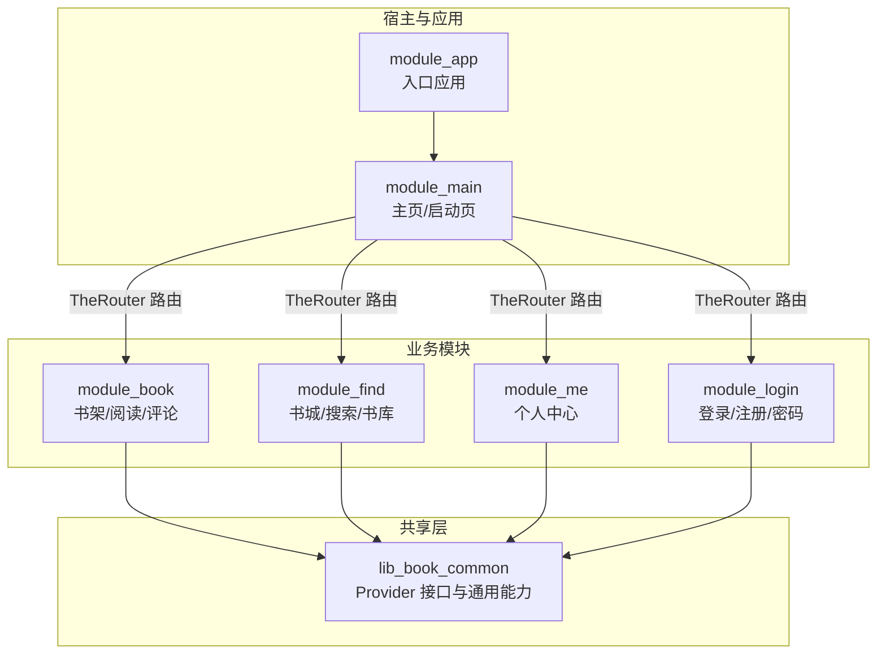
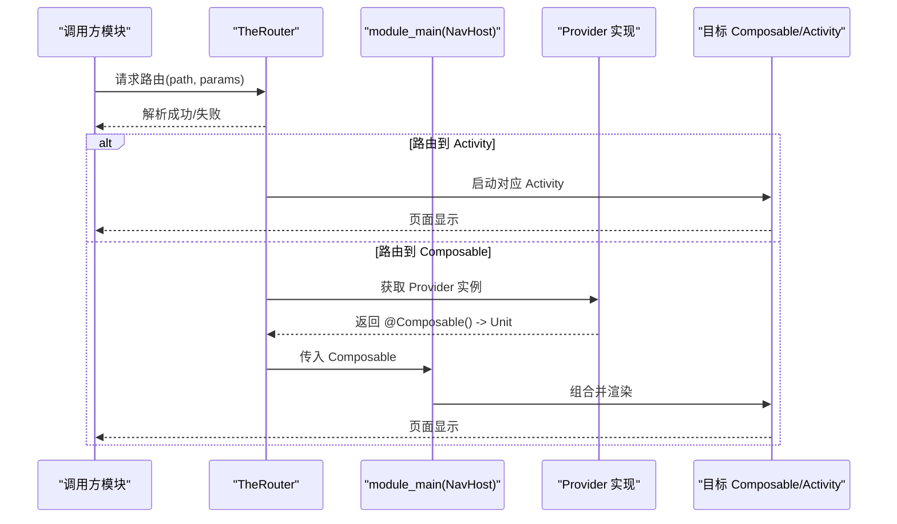
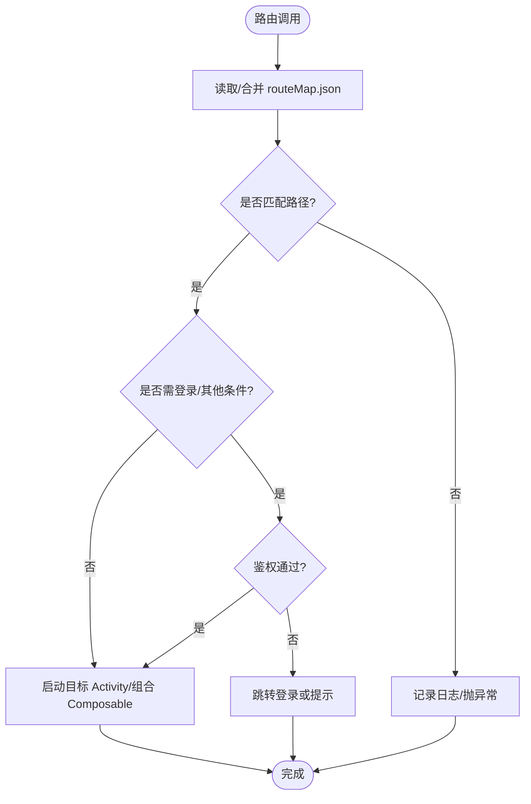
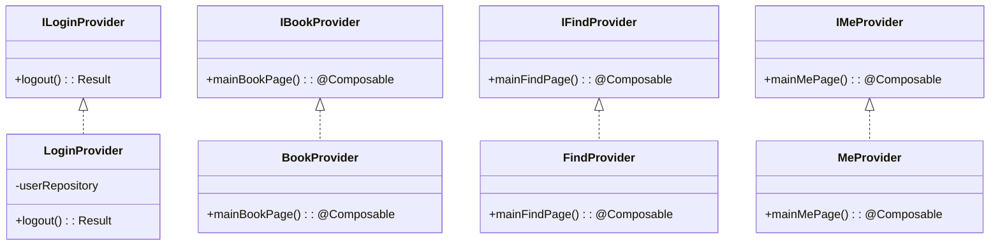
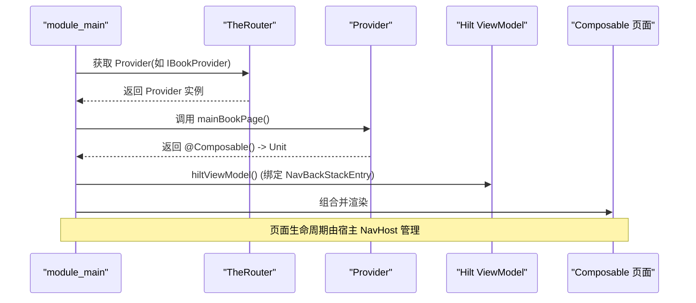
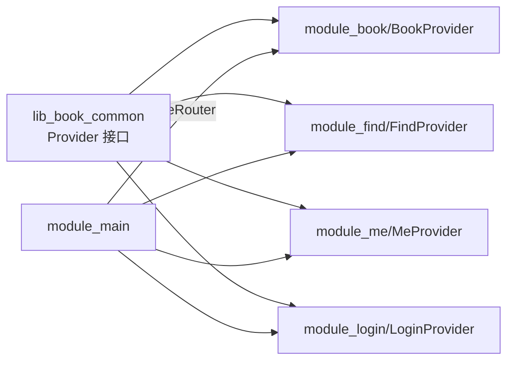

# 跨模块通信机制

<cite>
**本文引用的文件**
- [module_app/src/main/assets/therouter/routeMap.json](file://module_app/src/main/assets/therouter/routeMap.json)
- [module_book/src/main/assets/therouter/routeMap.json](file://module_book/src/main/assets/therouter/routeMap.json)
- [lib_book_common/src/main/java/com/ebook/common/provider/ILoginProvider.kt](file://lib_book_common/src/main/java/com/ebook/common/provider/ILoginProvider.kt)
- [lib_book_common/src/main/java/com/ebook/common/provider/IMeProvider.kt](file://lib_book_common/src/main/java/com/ebook/common/provider/IMeProvider.kt)
- [lib_book_common/src/main/java/com/ebook/common/provider/IBookProvider.kt](file://lib_book_common/src/main/java/com/ebook/common/provider/IBookProvider.kt)
- [lib_book_common/src/main/java/com/ebook/common/provider/IFindProvider.kt](file://lib_book_common/src/main/java/com/ebook/common/provider/IFindProvider.kt)
- [module_login/src/main/java/com/ebook/login/provider/LoginProvider.kt](file://module_login/src/main/java/com/ebook/login/provider/LoginProvider.kt)
- [module_find/src/main/java/com/ebook/find/provider/FindProvider.kt](file://module_find/src/main/java/com/ebook/find/provider/FindProvider.kt)
- [module_book/src/main/java/com/ebook/book/provider/BookProvider.kt](file://module_book/src/main/java/com/ebook/book/provider/BookProvider.kt)
- [module_me/src/main/java/com/ebook/me/provider/MeProvider.kt](file://module_me/src/main/java/com/ebook/me/provider/MeProvider.kt)
</cite>

## 目录
1. [简介](#简介)
2. [项目结构](#项目结构)
3. [核心组件](#核心组件)
4. [架构总览](#架构总览)
5. [详细组件分析](#详细组件分析)
6. [依赖关系分析](#依赖关系分析)
7. [性能考量](#性能考量)
8. [故障排除指南](#故障排除指南)
9. [结论](#结论)
10. [附录：最佳实践与示例指引](#附录：最佳实践与示例指引)

## 简介
本文件面向本仓库的跨模块通信机制，聚焦 TheRouter 路由系统与 Provider 接口模式。内容覆盖：
- TheRouter 路由表生成、加载与页面导航流程
- Provider 接口语义化、实现类注册与动态发现
- 跨模块 Composable 页面的组合方式与生命周期管理
- 模块间数据传递与一致性策略
- 路由表维护（自动生成、版本控制、冲突解决）
- 常见问题诊断与排障
- 结合仓库现有代码的集成测试要点与示例路径

## 项目结构
本项目采用多模块 Gradle 工程，功能模块之间不直接互相依赖，而是通过 lib_book_common 暴露的 Provider 接口进行解耦；跨模块页面跳转统一经 TheRouter 路由表完成。每个业务模块在自身 assets/therouter 下提供 routeMap.json，由 TheRouter 在构建期扫描并合并为应用级路由表。

**图示来源**
- [module_app/src/main/assets/therouter/routeMap.json:1-150](file://module_app/src/main/assets/therouter/routeMap.json#L1-L150)
- [module_book/src/main/assets/therouter/routeMap.json:1-39](file://module_book/src/main/assets/therouter/routeMap.json#L1-L39)

**章节来源**
- [module_app/src/main/assets/therouter/routeMap.json:1-150](file://module_app/src/main/assets/therouter/routeMap.json#L1-L150)
- [module_book/src/main/assets/therouter/routeMap.json:1-39](file://module_book/src/main/assets/therouter/routeMap.json#L1-L39)

## 核心组件
- TheRouter 路由表：以 JSON 形式声明 path→className 映射，支持 params 约束（如 needLogin）。各模块将自身路由登记到各自 assets/therouter/routeMap.json，构建期被聚合。
- Provider 接口：位于 lib_book_common，定义跨模块能力契约（如 ILoginProvider、IBookProvider、IFindProvider、IMeProvider）。
- Provider 实现：各业务模块在 provider/ 包下实现上述接口，并通过 @ServiceProvider 注解交由 TheRouter 发现与创建。
- 宿主组合：module_main 通过 TheRouter 获取 Provider 实例，调用其返回的 @Composable () -> Unit 来组合页面，ViewModel 作用域绑定 NavBackStackEntry。

**章节来源**
- [lib_book_common/src/main/java/com/ebook/common/provider/ILoginProvider.kt:1-20](file://lib_book_common/src/main/java/com/ebook/common/provider/ILoginProvider.kt#L1-L20)
- [lib_book_common/src/main/java/com/ebook/common/provider/IMeProvider.kt:1-14](file://lib_book_common/src/main/java/com/ebook/common/provider/IMeProvider.kt#L1-L14)
- [lib_book_common/src/main/java/com/ebook/common/provider/IBookProvider.kt:1-14](file://lib_book_common/src/main/java/com/ebook/common/provider/IBookProvider.kt#L1-L14)
- [lib_book_common/src/main/java/com/ebook/common/provider/IFindProvider.kt:1-14](file://lib_book_common/src/main/java/com/ebook/common/provider/IFindProvider.kt#L1-L14)
- [module_login/src/main/java/com/ebook/login/provider/LoginProvider.kt:1-37](file://module_login/src/main/java/com/ebook/login/provider/LoginProvider.kt#L1-L37)
- [module_find/src/main/java/com/ebook/find/provider/FindProvider.kt:1-200](file://module_find/src/main/java/com/ebook/find/provider/FindProvider.kt#L1-L200)
- [module_book/src/main/java/com/ebook/book/provider/BookProvider.kt:1-200](file://module_book/src/main/java/com/ebook/book/provider/BookProvider.kt#L1-L200)
- [module_me/src/main/java/com/ebook/me/provider/MeProvider.kt:1-200](file://module_me/src/main/java/com/ebook/me/provider/MeProvider.kt#L1-L200)

## 架构总览
下图展示从“发起导航”到“目标页面渲染”的完整链路：模块 A 通过 TheRouter 路由跳转到模块 B 的 Activity 或 Composable 页面；同时，模块 B 通过 Provider 向宿主暴露 Composable 页面，由 module_main 的 NavHost 组合。

**图示来源**
- [module_app/src/main/assets/therouter/routeMap.json:1-150](file://module_app/src/main/assets/therouter/routeMap.json#L1-L150)
- [module_login/src/main/java/com/ebook/login/provider/LoginProvider.kt:1-37](file://module_login/src/main/java/com/ebook/login/provider/LoginProvider.kt#L1-L37)

## 详细组件分析

### TheRouter 路由系统
- 路由表位置与格式：每个模块在 assets/therouter/routeMap.json 中声明 path→className 映射及可选 params（例如 needLogin=true）。构建期 TheRouter 会扫描并合并这些路由表，最终打包到应用资产中。
- 路由参数与校验：params 可携带路由级元信息（如是否需要登录），路由分发时可据此做前置鉴权或拦截。
- 独立模式下的占位路由：当模块独立运行时，若缺少其他模块的路由，可在 src/main/test/debug 下提供同名路径占位，避免静默丢失导致的问题。

**图示来源**
- [module_app/src/main/assets/therouter/routeMap.json:1-150](file://module_app/src/main/assets/therouter/routeMap.json#L1-L150)
- [module_book/src/main/assets/therouter/routeMap.json:1-39](file://module_book/src/main/assets/therouter/routeMap.json#L1-L39)

**章节来源**
- [module_app/src/main/assets/therouter/routeMap.json:1-150](file://module_app/src/main/assets/therouter/routeMap.json#L1-L150)
- [module_book/src/main/assets/therouter/routeMap.json:1-39](file://module_book/src/main/assets/therouter/routeMap.json#L1-L39)

### Provider 接口模式
- 接口语义化：所有跨模块能力在 lib_book_common 中以接口形式暴露，如 ILoginProvider（服务端登出）、IBookProvider/IFindProvider/IMeProvider（返回 @Composable 页面）。
- 实现类注册：各模块在 provider/ 包下实现接口，并使用 @ServiceProvider 注解让 TheRouter 发现；同时使用 @Singleton 保证单例。
- 动态发现与桥接：Provider 由 TheRouter 创建，内部可通过 Hilt EntryPointAccessors 桥接到 Hilt 图（如 LoginProvider 通过 UserRepositoryEntryPoint 获取 UserRepository）。

**图示来源**
- [lib_book_common/src/main/java/com/ebook/common/provider/ILoginProvider.kt:1-20](file://lib_book_common/src/main/java/com/ebook/common/provider/ILoginProvider.kt#L1-L20)
- [lib_book_common/src/main/java/com/ebook/common/provider/IBookProvider.kt:1-14](file://lib_book_common/src/main/java/com/ebook/common/provider/IBookProvider.kt#L1-L14)
- [lib_book_common/src/main/java/com/ebook/common/provider/IFindProvider.kt:1-14](file://lib_book_common/src/main/java/com/ebook/common/provider/IFindProvider.kt#L1-L14)
- [lib_book_common/src/main/java/com/ebook/common/provider/IMeProvider.kt:1-14](file://lib_book_common/src/main/java/com/ebook/common/provider/IMeProvider.kt#L1-L14)
- [module_login/src/main/java/com/ebook/login/provider/LoginProvider.kt:1-37](file://module_login/src/main/java/com/ebook/login/provider/LoginProvider.kt#L1-L37)
- [module_book/src/main/java/com/ebook/book/provider/BookProvider.kt:1-200](file://module_book/src/main/java/com/ebook/book/provider/BookProvider.kt#L1-L200)
- [module_find/src/main/java/com/ebook/find/provider/FindProvider.kt:1-200](file://module_find/src/main/java/com/ebook/find/provider/FindProvider.kt#L1-L200)
- [module_me/src/main/java/com/ebook/me/provider/MeProvider.kt:1-200](file://module_me/src/main/java/com/ebook/me/provider/MeProvider.kt#L1-L200)

**章节来源**
- [module_login/src/main/java/com/ebook/login/provider/LoginProvider.kt:1-37](file://module_login/src/main/java/com/ebook/login/provider/LoginProvider.kt#L1-L37)

### 跨模块页面导航与 Composable 组合
- 宿主组合：module_main 作为宿主，通过 TheRouter 获取 Provider 提供的 @Composable 页面并交给 NavHost 组合；页面 ViewModel 作用域绑定调用处的 NavBackStackEntry，遵循 Hilt 默认行为。
- 生命周期：Composable 页面随宿主 NavHost 的生命周期变化而创建/销毁；Provider 本身为单例，负责提供页面工厂方法。
- 路由与组合并存：部分页面通过 TheRouter 以 Activity 形式跳转（如登录、设置等），部分通过 Provider 暴露 Composable 给宿主直接组合（如书架、书城、我的）。

**图示来源**
- [lib_book_common/src/main/java/com/ebook/common/provider/IBookProvider.kt:1-14](file://lib_book_common/src/main/java/com/ebook/common/provider/IBookProvider.kt#L1-L14)
- [module_book/src/main/java/com/ebook/book/provider/BookProvider.kt:1-200](file://module_book/src/main/java/com/ebook/book/provider/BookProvider.kt#L1-L200)

**章节来源**
- [lib_book_common/src/main/java/com/ebook/common/provider/IBookProvider.kt:1-14](file://lib_book_common/src/main/java/com/ebook/common/provider/IBookProvider.kt#L1-L14)
- [module_book/src/main/java/com/ebook/book/provider/BookProvider.kt:1-200](file://module_book/src/main/java/com/ebook/book/provider/BookProvider.kt#L1-L200)

### 模块间数据传递与一致性
- 路由参数：通过 routeMap.json 中的 params 字段声明路由级元信息（如 needLogin），分发时可据此做鉴权或前置处理。
- Provider 返回值：Provider 提供的是页面工厂（@Composable），页面内部通过 Hilt ViewModel 获取状态与数据，确保状态与作用域一致。
- 事件总线：项目统一使用 SharedFlow（见 ADR-0004）进行跨模块事件通知，避免紧耦合。
- 会话一致性：用户会话由 UserSessionManager 单点管理，Provider 仅暴露服务端侧登出（ILoginProvider.logout），本地清会话统一由 UserSessionManager 处理，避免多处清理不一致。

**章节来源**
- [lib_book_common/src/main/java/com/ebook/common/provider/ILoginProvider.kt:1-20](file://lib_book_common/src/main/java/com/ebook/common/provider/ILoginProvider.kt#L1-L20)

### 路由表的管理与维护
- 自动生成：routeMap.json 由 TheRouter transform 回写；新增/改动 @Route 后，需再次构建以使新路由生效。
- 版本控制：路由表按模块拆分，便于版本演进与冲突定位；变更应配合提交信息与 ADR 记录。
- 冲突解决：不同模块不得声明相同 path；若出现冲突，需在模块边界协商命名空间前缀（当前已按 /ebook/{domain}/... 规范）。
- 独立模式占位：在 src/main/test/debug 提供同名路径占位，避免独立运行时的静默丢失。

**章节来源**
- [module_app/src/main/assets/therouter/routeMap.json:1-150](file://module_app/src/main/assets/therouter/routeMap.json#L1-L150)
- [module_book/src/main/assets/therouter/routeMap.json:1-39](file://module_book/src/main/assets/therouter/routeMap.json#L1-L39)

## 依赖关系分析
- 依赖方向：功能模块 → lib_book_common（Provider 接口），互不直接依赖；宿主 module_main 通过 TheRouter 装配各模块 Provider。
- 外部依赖：TheRouter 用于服务发现与路由分发；Hilt 用于页面级依赖注入（ViewModel 等）。
- 潜在环路与风险：Provider 不应持有强引用到宿主或跨模块具体实现；通过接口与 EntryPointAccessors 桥接，降低耦合。

**图示来源**
- [lib_book_common/src/main/java/com/ebook/common/provider/ILoginProvider.kt:1-20](file://lib_book_common/src/main/java/com/ebook/common/provider/ILoginProvider.kt#L1-L20)
- [lib_book_common/src/main/java/com/ebook/common/provider/IBookProvider.kt:1-14](file://lib_book_common/src/main/java/com/ebook/common/provider/IBookProvider.kt#L1-L14)
- [lib_book_common/src/main/java/com/ebook/common/provider/IFindProvider.kt:1-14](file://lib_book_common/src/main/java/com/ebook/common/provider/IFindProvider.kt#L1-L14)
- [lib_book_common/src/main/java/com/ebook/common/provider/IMeProvider.kt:1-14](file://lib_book_common/src/main/java/com/ebook/common/provider/IMeProvider.kt#L1-L14)
- [module_login/src/main/java/com/ebook/login/provider/LoginProvider.kt:1-37](file://module_login/src/main/java/com/ebook/login/provider/LoginProvider.kt#L1-L37)
- [module_book/src/main/java/com/ebook/book/provider/BookProvider.kt:1-200](file://module_book/src/main/java/com/ebook/book/provider/BookProvider.kt#L1-L200)
- [module_find/src/main/java/com/ebook/find/provider/FindProvider.kt:1-200](file://module_find/src/main/java/com/ebook/find/provider/FindProvider.kt#L1-L200)
- [module_me/src/main/java/com/ebook/me/provider/MeProvider.kt:1-200](file://module_me/src/main/java/com/ebook/me/provider/MeProvider.kt#L1-L200)

**章节来源**
- [module_login/src/main/java/com/ebook/login/provider/LoginProvider.kt:1-37](file://module_login/src/main/java/com/ebook/login/provider/LoginProvider.kt#L1-L37)

## 性能考量
- 路由查找：routeMap.json 体积较小，查找开销可忽略；避免在热路径中进行复杂计算。
- Provider 单例：Provider 以单例存在，避免重复创建；页面级依赖通过 Hilt ViewModel 按需注入。
- Composable 组合：宿主直接组合页面，减少 Fragment/Activity 切换开销；注意页面内列表/图片的懒加载与缓存。
- 沙箱与网络：脚本源执行器与网络请求应避免主线程阻塞，遵循项目对协程与 Flow 的约定。

## 故障排除指南
- 路由丢失（独立模式）：
  - 现象：跳转无响应、只记一行日志、不报错不闪退。
  - 排查：确认该模块是否在独立模式下提供了同名路径占位（src/main/test/debug）；检查 routeMap.json 是否包含目标路径。
  - 修复：补全占位路由或确保集成构建时正确合并路由表；重新构建使 TheRouter 回写生效。
- Provider 未找到：
  - 现象：无法获取跨模块能力，界面功能缺失。
  - 排查：确认实现类是否标注 @ServiceProvider/@Singleton；接口是否正确引入；Hilt EntryPoint 是否可用。
  - 修复：补全注解、修正依赖；必要时通过 EntryPointAccessors 桥接。
- 路由参数错误：
  - 现象：需要登录的页面未跳转或被拒绝。
  - 排查：检查 routeMap.json 中 params 配置（如 needLogin）；确认鉴权逻辑。
  - 修复：修正参数或完善鉴权流程。
- 会话不一致：
  - 现象：登出后仍显示旧身份信息。
  - 排查：确认是否通过 UserSessionManager.clearSession 统一清理；避免多处手动清理。
  - 修复：集中清理会话，确保 TokenHolder、SP、ProfileRepository 同步更新。

**章节来源**
- [lib_book_common/src/main/java/com/ebook/common/provider/ILoginProvider.kt:1-20](file://lib_book_common/src/main/java/com/ebook/common/provider/ILoginProvider.kt#L1-L20)

## 结论
本项目的跨模块通信以 TheRouter 路由与 Provider 接口为核心：路由负责页面级解耦，Provider 负责能力级解耦。通过统一的接口定义、注解驱动的动态发现以及宿主的集中组合，实现了高内聚、低耦合的多模块架构。配合严格的路由表管理与独立的占位机制，既保证了集成态的稳定，又兼顾了独立开发的便捷。

## 附录：最佳实践与示例指引
- 新增跨模块能力：
  - 在 lib_book_common 定义接口（如新的 IxProvider）。
  - 在对应模块 provider/ 下实现接口，添加 @ServiceProvider/@Singleton。
  - 在宿主通过 TheRouter 获取 Provider 并组合页面。
- 新增路由：
  - 在模块 assets/therouter/routeMap.json 中添加 path→className 映射与 params。
  - 独立模式下在 src/main/test/debug 提供占位路由。
  - 重新构建以使 TheRouter 回写生效。
- 集成测试要点：
  - 验证 Provider 是否能被 TheRouter 正确发现与实例化。
  - 验证路由能否正确跳转到目标页面（Activity/Composable）。
  - 验证鉴权逻辑（needLogin 等）与会话清理的一致性。
  - 参考仓库测试目录与 ADR-0004 的事件总线用法，编写端到端用例。

[本节为概念性指导，无需特定文件来源]