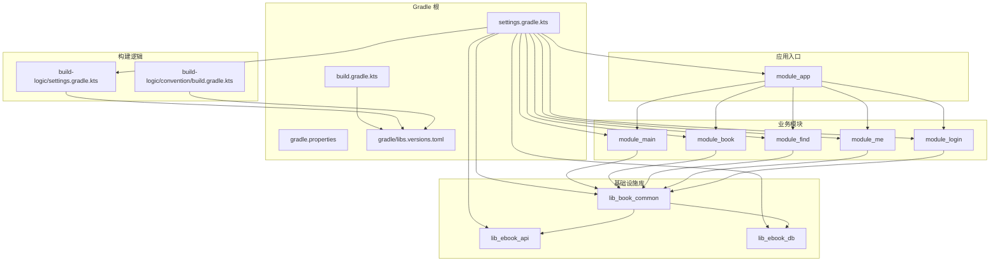
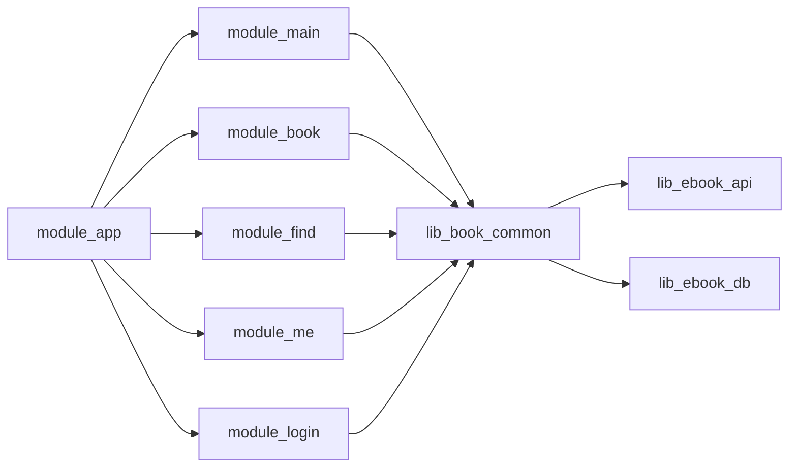
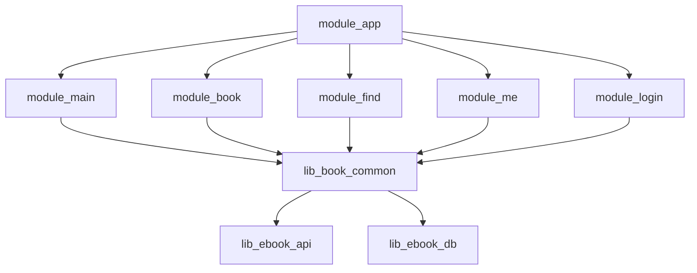
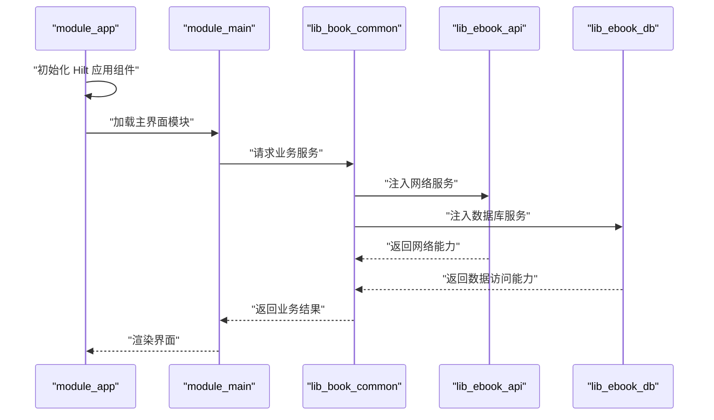

# 依赖管理

<cite>
**本文引用的文件**   
- [settings.gradle.kts](file://settings.gradle.kts)
- [build.gradle.kts](file://build.gradle.kts)
- [gradle/libs.versions.toml](file://gradle/libs.versions.toml)
- [gradle.properties](file://gradle.properties)
- [build-logic/settings.gradle.kts](file://build-logic/settings.gradle.kts)
- [build-logic/convention/build.gradle.kts](file://build-logic/convention/build.gradle.kts)
- [lib_book_common/build.gradle.kts](file://lib_book_common/build.gradle.kts)
- [lib_ebook_api/build.gradle.kts](file://lib_ebook_api/build.gradle.kts)
- [lib_ebook_db/build.gradle.kts](file://lib_ebook_db/build.gradle.kts)
- [module_app/build.gradle.kts](file://module_app/build.gradle.kts)
- [module_main/build.gradle.kts](file://module_main/build.gradle.kts)
- [module_book/build.gradle.kts](file://module_book/build.gradle.kts)
- [module_find/build.gradle.kts](file://module_find/build.gradle.kts)
- [module_me/build.gradle.kts](file://module_me/build.gradle.kts)
- [module_login/build.gradle.kts](file://module_login/build.gradle.kts)
</cite>

## 目录
1. [引言](#引言)
2. [项目结构](#项目结构)
3. [核心组件](#核心组件)
4. [架构总览](#架构总览)
5. [详细组件分析](#详细组件分析)
6. [依赖关系与单向原则](#依赖关系与单向原则)
7. [依赖注入（Hilt）在模块间的使用方式](#依赖注入hilt在模块间的使用方式)
8. [版本统一管理](#版本统一管理)
9. [版本冲突解决策略](#版本冲突解决策略)
10. [构建配置示例与最佳实践](#构建配置示例与最佳实践)
11. [故障排查](#故障排查)
12. [结论](#结论)

## 引言
本仓库是一个 Android 多模块电子书应用，采用 Gradle 多模块构建、约定式插件、版本目录 Catalog 和 Hilt 依赖注入。本文聚焦“依赖管理”，覆盖：
- `settings.gradle.kts` 中的模块声明与仓库统一；
- 根级 `build.gradle.kts` 对插件版本的集中管理；
- `gradle/libs.versions.toml` 中第三方库版本与依赖坐标的统一；
- 业务模块对基础设施模块的单向依赖；
- Hilt 在模块间的装配边界；
- 版本冲突定位与解决策略；
- 可复用的构建配置示例与最佳实践建议。

## 项目结构
仓库包含以下关键层级：
- 根构建配置：`settings.gradle.kts`、`build.gradle.kts`、`gradle.properties`；
- 版本目录：`gradle/libs.versions.toml`；
- 构建逻辑插件集：`build-logic/`，通过 `includeBuild` 作为独立子构建引入；
- 基础设施库：`lib_book_common`、`lib_ebook_api`、`lib_ebook_db`；
- 业务功能模块：`module_main`、`module_book`、`module_find`、`module_me`、`module_login`；
- 应用入口模块：`module_app`。

**图示来源**
- [settings.gradle.kts:1-65](file://settings.gradle.kts#L1-L65)
- [build-logic/settings.gradle.kts:1-49](file://build-logic/settings.gradle.kts#L1-L49)
- [build-logic/convention/build.gradle.kts:1-79](file://build-logic/convention/build.gradle.kts#L1-L79)
- [lib_book_common/build.gradle.kts:1-105](file://lib_book_common/build.gradle.kts#L1-L105)

**章节来源**
- [settings.gradle.kts:1-65](file://settings.gradle.kts#L1-L65)
- [build-logic/settings.gradle.kts:1-49](file://build-logic/settings.gradle.kts#L1-L49)
- [build-logic/convention/build.gradle.kts:1-79](file://build-logic/convention/build.gradle.kts#L1-L79)

## 核心组件
### settings.gradle.kts：模块声明与仓库统一
- 使用 `pluginManagement` 与 `dependencyResolutionManagement` 集中声明 Maven 仓库源，避免各子模块各自声明导致解析不一致；
- 启用 `org.gradle.toolchains.foojay-resolver-convention` 以支持 Gradle 9 的 toolchain 自动下载；
- 通过 `repositoriesMode = RepositoriesMode.FAIL_ON_PROJECT_REPOS` 禁止子模块自行声明仓库，保证依赖解析一致性；
- 通过 `include(...)` 声明所有模块，包括应用入口、业务模块和基础设施库；
- 提供临时本地联调 `includeBuild("lib-common-build")` 的注释说明，用于与外部 android-practice 侧的 `lib_common` 联动开发。

**章节来源**
- [settings.gradle.kts:1-65](file://settings.gradle.kts#L1-L65)

### build.gradle.kts：根级插件版本集中管理
- 根脚本仅声明插件别名并 `apply false`，不直接应用任何 Android 或 Kotlin 插件；
- 插件版本来自 `libs.versions.toml` 的 `[plugins]` 段，例如 Android Application/Library/Test、Compose Compiler、Hilt、KSP、Room、Therouter 等；
- 启用 `module.graph` 插件，便于生成依赖图；
- AGP 9 内置 Kotlin，因此不再预声明 `kotlin.jvm` 之外的 Kotlin Android 插件。

**章节来源**
- [build.gradle.kts:1-15](file://build.gradle.kts#L1-L15)

### gradle.properties：全局构建开关
- 启用 AndroidX、非传递 RClass、KSP 增量；
- 定义 `isModule=false`，用于区分集成态与单模块调试模式；
- 设置 JVM 参数以提升 Gradle Daemon 内存；
- 明确禁用已弃用或默认行为变化的属性，避免 AGP 9 警告。

**章节来源**
- [gradle.properties:1-35](file://gradle.properties#L1-L35)

### build-logic：约定式插件
- `build-logic/settings.gradle.kts` 暴露统一的 `libs` 版本目录给 convention 插件；
- `build-logic/convention/build.gradle.kts` 注册多个约定插件，如 `androidApplication`、`androidLibrary`、`androidComponent`、`androidCompose`、`hilt`、`androidRoom`、`androidLint`、`androidNative` 等；
- Convention 插件统一 JDK/JVM Target、插件 ID 与应用方式，减少业务模块重复配置。

**章节来源**
- [build-logic/settings.gradle.kts:1-49](file://build-logic/settings.gradle.kts#L1-L49)
- [build-logic/convention/build.gradle.kts:1-79](file://build-logic/convention/build.gradle.kts#L1-L79)

## 架构总览
整体依赖方向遵循“业务模块依赖基础设施库，应用入口聚合业务模块”的原则。

**图示来源**
- [module_app/build.gradle.kts:1-96](file://module_app/build.gradle.kts#L1-L96)
- [module_main/build.gradle.kts:1-75](file://module_main/build.gradle.kts#L1-L75)
- [module_book/build.gradle.kts:1-100](file://module_book/build.gradle.kts#L1-L100)
- [module_find/build.gradle.kts:1-85](file://module_find/build.gradle.kts#L1-L85)
- [module_me/build.gradle.kts:1-91](file://module_me/build.gradle.kts#L1-L91)
- [module_login/build.gradle.kts:1-75](file://module_login/build.gradle.kts#L1-L75)
- [lib_book_common/build.gradle.kts:1-105](file://lib_book_common/build.gradle.kts#L1-L105)

## 详细组件分析

### 基础设施库：lib_book_common
职责与依赖特点：
- 作为共享能力层，对外公开 UI 组件、领域模型、Repository 抽象、Store、Provider、Event、Interceptor 等；
- 通过 `api(project(":lib_ebook_api"))` 与 `api(project(":lib_ebook_db"))` 暴露网络与数据库契约；
- 通过 `api(project(":lib_book_source"))` 公开书源解析接口，使业务模块仅依赖 common 即可编译；
- 引入 Compose BOM、Dagger/Hilt、Router、JSoup、Retrofit converter、PermissionX 等；
- 测试端引入 Robolectric、Compose UI Test、Espresso 等。

**章节来源**
- [lib_book_common/build.gradle.kts:1-105](file://lib_book_common/build.gradle.kts#L1-L105)

### 基础设施库：lib_ebook_api
职责与依赖特点：
- 封装网络层、API 实体、拦截器、Retrofit 构建；
- 从 `local.properties` 读取开发服务器地址，并写入 `EBOOK_SERVER_HOST` 构建字段；
- 依赖 Retrofit、OkHttp Logging、Kotlinx Serialization、JSoup、AndroidX AppCompat、Material 等；
- 使用 `common` 库中的 DTO 类型作为公开 API 的一部分。

**章节来源**
- [lib_ebook_api/build.gradle.kts:1-64](file://lib_ebook_api/build.gradle.kts#L1-L64)

### 基础设施库：lib_ebook_db
职责与依赖特点：
- 封装 Room 数据库、Entity、DAO、迁移与事件；
- 显式声明 `sqlite-bundled` 驱动依赖，避免依赖传递性变化导致问题；
- 为 JVM 单测引入 `sqlite-bundled.jvm`，确保迁移测试在桌面原生 SQLite 上运行；
- 配合 Robolectric 与 JUnit 进行 DAO 与迁移回归测试。

**章节来源**
- [lib_ebook_db/build.gradle.kts:1-51](file://lib_ebook_db/build.gradle.kts#L1-L51)

### 业务模块：module_main / module_book / module_find / module_me / module_login
共同特征：
- 使用约定插件 `androidComponent` 与 `androidCompose`，并启用 KSP 与 Hilt；
- 依赖 `lib_book_common`，并通过 Router 实现页面路由；
- 在 `isModule=true` 时作为独立 application 运行，否则作为 library 被 `module_app` 集成；
- 在 release 模式下根据是否独立运行决定是否启用 R8 混淆；
- 单元测试普遍开启 `isIncludeAndroidResources = true`，以便 Robolectric 读取资源。

差异点：
- `module_main` 负责启动页与底部导航框架；
- `module_book` 负责书架、阅读、下载管理等核心阅读场景；
- `module_find` 负责搜索与发现；
- `module_me` 负责个人中心、缓存、更新检查等；
- `module_login` 负责登录、注册、密码修改、用户验证。

**章节来源**
- [module_main/build.gradle.kts:1-75](file://module_main/build.gradle.kts#L1-L75)
- [module_book/build.gradle.kts:1-100](file://module_book/build.gradle.kts#L1-L100)
- [module_find/build.gradle.kts:1-85](file://module_find/build.gradle.kts#L1-L85)
- [module_me/build.gradle.kts:1-91](file://module_me/build.gradle.kts#L1-L91)
- [module_login/build.gradle.kts:1-75](file://module_login/build.gradle.kts#L1-L75)

### 应用入口：module_app
职责与依赖特点：
- 唯一应用模块，声明 applicationId、版本号计算逻辑、productFlavors（real/mock）、R8 混淆规则；
- 在集成态下依赖所有业务模块；
- 通过 `isModule` 控制是否单独调试某个业务模块；
- 使用 Hilt 与 Router。

**章节来源**
- [module_app/build.gradle.kts:1-96](file://module_app/build.gradle.kts#L1-L96)

## 依赖关系与单向原则
### 模块依赖图

**图示来源**
- [settings.gradle.kts:1-65](file://settings.gradle.kts#L1-L65)
- [module_app/build.gradle.kts:1-96](file://module_app/build.gradle.kts#L1-L96)
- [lib_book_common/build.gradle.kts:1-105](file://lib_book_common/build.gradle.kts#L1-L105)

### 单向依赖原则
- 业务模块只能向上依赖基础设施库，不能反向依赖其他业务模块；
- 基础设施库之间保持最小耦合：`lib_ebook_api` 与 `lib_ebook_db` 不互相依赖，`lib_book_common` 同时依赖两者以统一暴露；
- 应用入口模块聚合业务模块，但不向业务模块暴露自身能力；
- 通过 Router 解耦模块间页面跳转，避免直接 class 引用。

**章节来源**
- [module_app/build.gradle.kts:1-96](file://module_app/build.gradle.kts#L1-L96)
- [lib_book_common/build.gradle.kts:1-105](file://lib_book_common/build.gradle.kts#L1-L105)
- [lib_ebook_api/build.gradle.kts:1-64](file://lib_ebook_api/build.gradle.kts#L1-L64)
- [lib_ebook_db/build.gradle.kts:1-51](file://lib_ebook_db/build.gradle.kts#L1-L51)

## 依赖注入（Hilt）在模块间的使用方式
### 构建期配置
- 根脚本通过 `alias(libs.plugins.hilt) apply false` 集中声明 Hilt 插件；
- 业务模块通过约定插件 `alias(libs.plugins.xrn1797.hilt)` 启用 Hilt；
- 基础设施库同样启用 Hilt，用于注入 Repository、Database、Network、Store 等能力；
- 测试模块通过 `hilt-android-testing` 与 `kspAndroidTest(hilt-compiler)` 支持仪器化测试。

### 运行时装配边界
- `module_app` 作为应用入口，通常承担 Hilt 组件树根节点；
- 业务模块通过 `@Module`、`@Provides`、`@InstallIn` 暴露局部依赖；
- 基础设施库通过公共 Module 提供跨模块共享能力，如网络、数据库、存储；
- 模块间通过接口与 DI 解耦，而非直接构造具体类。

**图示来源**
- [module_app/build.gradle.kts:1-96](file://module_app/build.gradle.kts#L1-L96)
- [module_main/build.gradle.kts:1-75](file://module_main/build.gradle.kts#L1-L75)
- [lib_book_common/build.gradle.kts:1-105](file://lib_book_common/build.gradle.kts#L1-L105)
- [lib_ebook_api/build.gradle.kts:1-64](file://lib_ebook_api/build.gradle.kts#L1-L64)
- [lib_ebook_db/build.gradle.kts:1-51](file://lib_ebook_db/build.gradle.kts#L1-L51)

**章节来源**
- [build.gradle.kts:1-15](file://build.gradle.kts#L1-L15)
- [module_app/build.gradle.kts:1-96](file://module_app/build.gradle.kts#L1-L96)
- [module_main/build.gradle.kts:1-75](file://module_main/build.gradle.kts#L1-L75)
- [lib_book_common/build.gradle.kts:1-105](file://lib_book_common/build.gradle.kts#L1-L105)

## 版本统一管理
### 版本目录结构
`gradle/libs.versions.toml` 将版本、库坐标、插件别名集中管理：
- `[versions]`：AGP、Kotlin、Hilt、Room、Compose BOM、Coroutines、Serialization、Retrofit、OkHttp、JSoup、Router、Robolectric 等；
- `[libraries]`：按功能分组，如 AndroidX、Compose、Hilt/Dagger、Kotlinx、Retrofit/OkHttp、JSoup、Router、Room、SQLLite、测试库；
- `[bundles]`：组合测试依赖，如 Compose UI Test；
- 插件别名：`[plugins]` 由根 `build.gradle.kts` 通过 `alias(libs.plugins.*)` 引用。

### 版本升级影响面
- 升级 AGP/Kotlin：影响所有 Android 模块与 build-logic；
- 升级 Hilt/Dagger：影响所有启用 Hilt 的模块；
- 升级 Compose BOM：影响所有 Compose 模块；
- 升级 Room/SQLite：影响 `lib_ebook_db` 及依赖 Room 的业务模块；
- 升级 Retrofit/OkHttp：影响 `lib_ebook_api` 及上层网络调用方；
- 升级 Router：影响所有使用路由的模块。

**章节来源**
- [gradle/libs.versions.toml:1-200](file://gradle/libs.versions.toml#L1-L200)
- [build.gradle.kts:1-15](file://build.gradle.kts#L1-L15)

## 版本冲突解决策略
### 策略一：优先使用版本目录
- 所有第三方库通过 `libs.versions.toml` 的 `version.ref` 引用，避免硬编码版本号；
- 新增依赖时先声明 version，再声明 library，最后在使用模块引用。

### 策略二：依赖收敛与可见性控制
- 基础设施库使用 `api` 暴露稳定契约，使用 `implementation` 隐藏内部实现；
- 业务模块只声明自身所需依赖，避免间接依赖污染；
- 通过 `api(platform(libs.androidx.compose.bom))` 统一 Compose 依赖版本。

### 策略三：显式依赖承重
- 对关键依赖（如 `sqlite-bundled`、`room-runtime`、`hilt-navigation-compose`）显式声明，避免上游变更导致隐式断裂；
- 在 `lib_ebook_db` 中显式声明 `sqlite-bundled` 与 `sqlite-bundled.jvm`，分别适配 Android 与 JVM 测试环境。

### 策略四：仓库源统一与镜像加速
- 根 `settings.gradle.kts` 与 `build-logic/settings.gradle.kts` 统一仓库源；
- 使用阿里云、腾讯云、JitPack、Sonatype Snapshots 等多源镜像，降低国内网络解析失败风险；
- 通过 `RepositoriesMode.FAIL_ON_PROJECT_REPOS` 禁止子模块自行添加仓库。

### 策略五：构建期校验与诊断
- 启用 `module.graph` 插件生成依赖图，辅助识别循环依赖与冗余依赖；
- 使用 Robolectric + Compose UI Test 在 JVM 环境下验证 UI 与依赖装配；
- 通过 Hilt 测试脚手架验证 DI 组件树是否正确装配。

**章节来源**
- [settings.gradle.kts:1-65](file://settings.gradle.kts#L1-L65)
- [build-logic/settings.gradle.kts:1-49](file://build-logic/settings.gradle.kts#L1-L49)
- [lib_ebook_db/build.gradle.kts:1-51](file://lib_ebook_db/build.gradle.kts#L1-L51)
- [lib_book_common/build.gradle.kts:1-105](file://lib_book_common/build.gradle.kts#L1-L105)

## 构建配置示例与最佳实践

### 示例一：模块声明与依赖声明
- 在 `settings.gradle.kts` 中通过 `include(...)` 声明模块；
- 在业务模块 `build.gradle.kts` 中使用 `implementation(project(":lib_book_common"))` 依赖基础设施库；
- 在应用入口模块聚合所有业务模块。

**章节来源**
- [settings.gradle.kts:1-65](file://settings.gradle.kts#L1-L65)
- [module_app/build.gradle.kts:1-96](file://module_app/build.gradle.kts#L1-L96)

### 示例二：约定式插件复用
- 业务模块统一使用 `alias(libs.plugins.xrn1797.android.component)` 与 `alias(libs.plugins.xrn1797.android.compose)`；
- 通过 `alias(libs.plugins.xrn1797.hilt)` 启用 Hilt；
- 通过 `alias(libs.plugins.ksp)` 启用注解处理器。

**章节来源**
- [module_main/build.gradle.kts:1-75](file://module_main/build.gradle.kts#L1-L75)
- [module_book/build.gradle.kts:1-100](file://module_book/build.gradle.kts#L1-L100)
- [module_find/build.gradle.kts:1-85](file://module_find/build.gradle.kts#L1-L85)
- [module_me/build.gradle.kts:1-91](file://module_me/build.gradle.kts#L1-L91)
- [module_login/build.gradle.kts:1-75](file://module_login/build.gradle.kts#L1-L75)

### 示例三：双态构建（isModule）
- 通过 `val isModule = project.findProperty("isModule").toString().toBoolean()` 判断当前是独立运行还是集成运行；
- 独立运行时启用 R8 混淆，集成运行时关闭以避免依赖丢失；
- 独立运行时可设置版本号，集成运行时由宿主模块提供。

**章节来源**
- [module_main/build.gradle.kts:1-75](file://module_main/build.gradle.kts#L1-L75)
- [module_book/build.gradle.kts:1-100](file://module_book/build.gradle.kts#L1-L100)
- [module_find/build.gradle.kts:1-85](file://module_find/build.gradle.kts#L1-L85)
- [module_me/build.gradle.kts:1-91](file://module_me/build.gradle.kts#L1-L91)
- [module_login/build.gradle.kts:1-75](file://module_login/build.gradle.kts#L1-L75)
- [gradle.properties:1-35](file://gradle.properties#L1-L35)

### 最佳实践建议
- 始终通过版本目录声明依赖，避免硬编码；
- 基础设施库使用 `api` 暴露契约，`implementation` 隐藏实现；
- 业务模块只声明自身所需依赖，避免间接依赖污染；
- 使用约定式插件统一 Android、Compose、KSP、Hilt 配置；
- 通过 Router 解耦模块间页面跳转；
- 使用 Robolectric 与 Compose UI Test 在 JVM 环境下验证 UI 与依赖装配；
- 在 CI 或本地频繁执行依赖图生成，及时清理冗余依赖；
- 升级第三方库前评估影响面，优先升级 Compose BOM、AGP、Kotlin 等基础栈。

## 故障排查

### 常见问题一：子模块自行声明仓库导致解析不一致
现象：不同机器或不同构建阶段依赖解析结果不一致。  
排查：
- 检查子模块 `build.gradle.kts` 是否声明了 `repositories { ... }`；
- 确认根 `settings.gradle.kts` 已启用 `RepositoriesMode.FAIL_ON_PROJECT_REPOS`。

**章节来源**
- [settings.gradle.kts:1-65](file://settings.gradle.kts#L1-L65)

### 常见问题二：Hilt 注入为空或未生成代码
现象：运行时注入对象为空，或 KSP 未处理 Hilt 注解。  
排查：
- 确认模块已应用 Hilt 约定插件；
- 确认 `ksp(libs.dagger.compiler)` 已声明；
- 仪器化测试需额外声明 `kspAndroidTest(libs.hilt.compiler)` 与 `hilt-android-testing`。

**章节来源**
- [module_book/build.gradle.kts:1-100](file://module_book/build.gradle.kts#L1-L100)
- [module_main/build.gradle.kts:1-75](file://module_main/build.gradle.kts#L1-L75)
- [lib_book_common/build.gradle.kts:1-105](file://lib_book_common/build.gradle.kts#L1-L105)

### 常见问题三：Room 或 SQLite 在 JVM 测试中报 UnsatisfiedLinkError
现象：JVM 单测加载不到 Android 原生库。  
排查：
- 确认 `lib_ebook_db` 已声明 `testImplementation(libs.sqlite.bundled.jvm)`；
- 确认测试使用 Room 内存数据库或 Robolectric 提供上下文。

**章节来源**
- [lib_ebook_db/build.gradle.kts:1-51](file://lib_ebook_db/build.gradle.kts#L1-L51)

### 常见问题四：R8 混淆后找不到类
现象：集成态下业务模块被剥离类，宿主应用崩溃。  
排查：
- 确认业务模块在集成态下关闭 `isMinifyEnabled`；
- 确认 consumerProguardFiles 正确配置；
- 检查混淆规则是否误删反射或动态加载类。

**章节来源**
- [module_main/build.gradle.kts:1-75](file://module_main/build.gradle.kts#L1-L75)
- [module_book/build.gradle.kts:1-100](file://module_book/build.gradle.kts#L1-L100)
- [module_find/build.gradle.kts:1-85](file://module_find/build.gradle.kts#L1-L85)
- [module_me/build.gradle.kts:1-91](file://module_me/build.gradle.kts#L1-L91)
- [module_login/build.gradle.kts:1-75](file://module_login/build.gradle.kts#L1-L75)

## 结论
本项目的依赖管理通过 Gradle 多模块、约定式插件、版本目录与 Hilt 依赖注入形成清晰分层：
- `settings.gradle.kts` 统一模块与仓库；
- `build.gradle.kts` 集中插件版本；
- `gradle/libs.versions.toml` 统一第三方库版本；
- `build-logic` 抽取通用构建逻辑；
- 基础设施库与业务模块严格单向依赖；
- Hilt 在模块间提供稳定的依赖装配边界；
- 通过版本目录、依赖收敛、显式承重与仓库镜像降低版本冲突风险。

按照本文的最佳实践维护依赖，可以在保证构建稳定性的同时，提升模块解耦程度与团队协同效率。